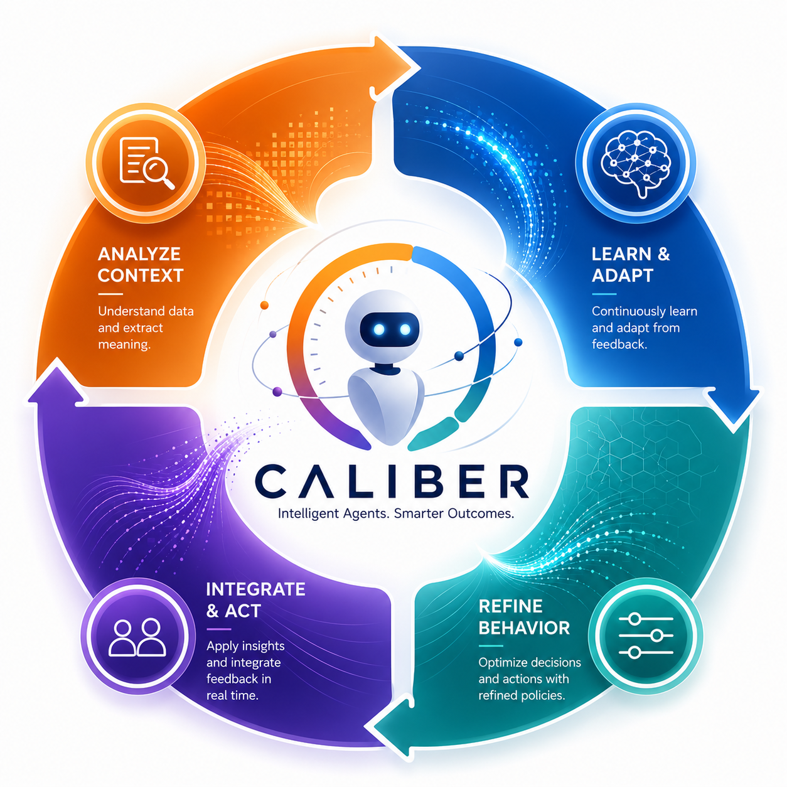
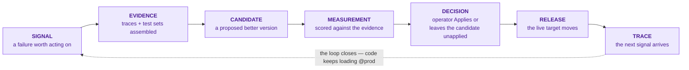
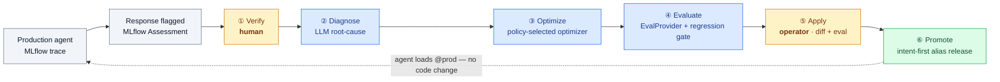
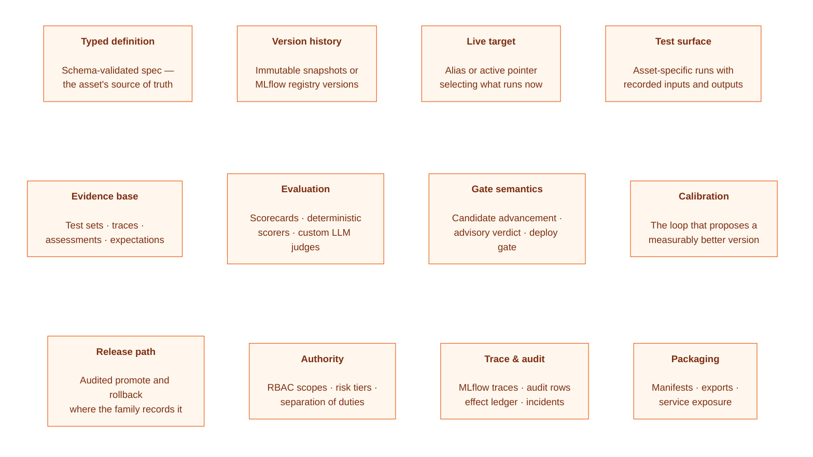
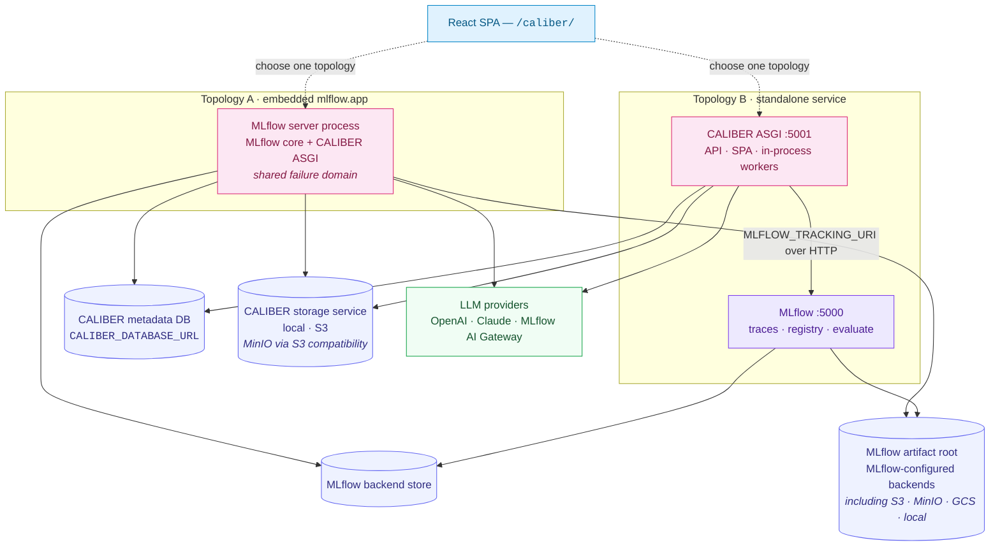
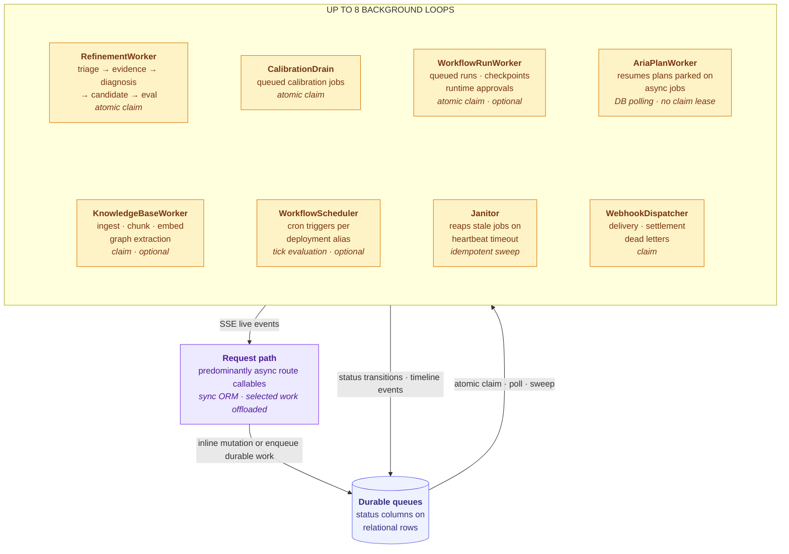
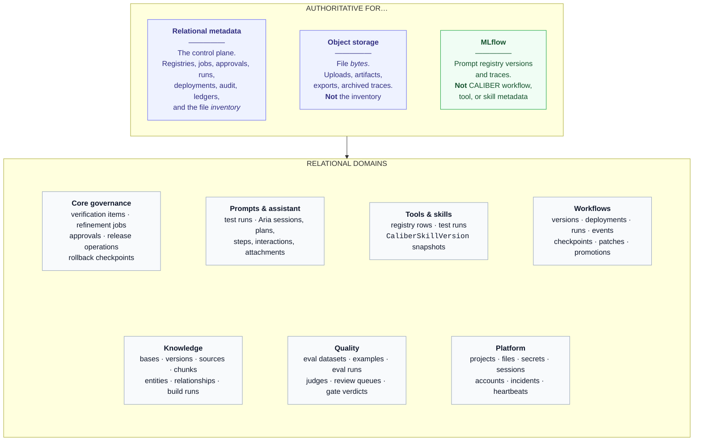
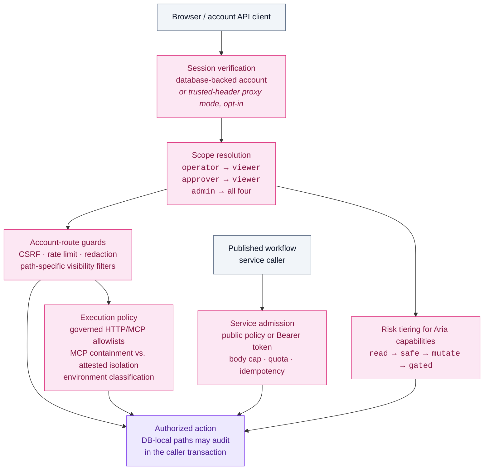

# CALIBER — Layered Architecture

### One control plane for the lifecycle of AI-agent resources

*Read top-down: the stack, the abstract lifecycle chain, the unit of governance, then the topologies.*

---

## At a glance

| Dimension | Where CALIBER stands |
| --- | --- |
| **What it is** | An MLflow-integrated ASGI control plane plus a React application with author, test, evaluate, calibrate, release, and observe surfaces whose coverage varies by asset family. |
| **The unit of value** | The **governed asset** — one of nine governed asset families or contexts. Typed definitions, versioning, evidence, gates, live targets, and release or rollback are family-specific rather than uniform guarantees (§4). |
| **The canonical chain** | `Signal → Evidence → Candidate → Measurement → Decision → Release → Trace` — a seven-term conceptual map, not seven worker stages. The concrete prompt refinement loop has six numbered stages (`Verify` through `Promote`): production trace/feedback supplies the signal, evidence assembly is folded into that concrete path, and the next trace closes the loop. Prompt and skill use the standard queued refinement path; workflow-manifest calibration enters at a workflow-specific stage but reuses durable job and apply machinery. Other families implement only the applicable facets. |
| **What it reuses** | MLflow Experiments, Traces, Assessments, Prompt Registry, Artifact Store, `genai.evaluate`, `genai.make_judge`, `genai.datasets` — CALIBER does not rebuild them. |
| **Where it runs** | One ASGI app, two topologies: in-process `mlflow.app`, or a standalone service talking to MLflow over HTTP. |
| **Source of truth** | Relational metadata is authoritative for the control plane; object storage owns file bytes; MLflow owns prompt versions and traces. |
| **Work model** | Bounded validation and many durable database mutations run inline; explicitly queued or long-running work uses up to eight in-process loops. All are gated by `background_tasks_enabled`; three also have independent enable flags. No separate worker tier. |
| **Trust model** | Four RBAC scopes — `viewer` / `operator` / `approver` / `admin` — plus route-specific CSRF, rate limiting, visibility filters, service admission, and governed HTTP/MCP execution policy. Coverage is path-specific, not a repository-wide isolation guarantee. |

---

## 1 · The layered stack

Read the centre column **bottom-up**. Infrastructure *carries* modular services;
services *obey* a governance substrate; the substrate *governs* asset families —
**the nouns**; lifecycle modes — **the verbs** — act on those nouns; and surfaces
expose the whole thing. The left column is machinery that spans every layer. The
right column is the thing all of it exists to produce.

```mermaid
flowchart LR

  subgraph HS["◀ PLATFORM SERVICES"]
    direction TB
    hs1["<b>Evidence Base</b><br/>Test sets · MLflow traces<br/>assessments · trace→example capture"]:::store
    hs2["<b>Evaluation Framework</b><br/>Scorecards · deterministic scorers<br/>custom LLM judges · human alignment"]:::ctrl
    hs3["<b>Calibration Framework</b><br/>Optimizer paths · manifest replay<br/>retrieval tuning · queued jobs"]:::async
    hs4["<b>Capability Registry</b><br/>Declare an operation once —<br/>risk tier · scopes · schema · handler<br/><i>emerging seam, partial coverage</i>"]:::ctrl
    hs5["<b>Integration Hub</b><br/>MCP servers · LLM Gateway<br/>webhooks · workflow-as-a-service"]:::ext
    hs6["<b>Project Scoping</b><br/>Shared visibility helpers and fields<br/><i>path-specific coverage</i>"]:::store
    hs1 --- hs2 --- hs3 --- hs4 --- hs5 --- hs6
  end

  subgraph STACK["THE CALIBER STACK"]
    direction TB

    subgraph L6["6 · SURFACES"]
      direction LR
      s1["<b>React SPA</b><br/><code>/caliber/</code>"]:::ui
      s2["<b>HTTP API</b><br/>456 method declarations<br/>across route modules"]:::ui
      s3["<b>Aria copilot</b><br/>permissioned<br/>agentic tool loop"]:::ui
      s4["<b>Headless</b><br/>service tokens ·<br/>SSE · webhooks"]:::ui
      s1 --- s2 --- s3 --- s4
    end

    subgraph L5["5 · LIFECYCLE MODES"]
      direction LR
      v1["<b>AUTHOR</b><br/>draft · render<br/>compile · validate"]:::ctrl
      v2["<b>TEST</b><br/>bounded test runs<br/>fixtures · baselines"]:::ctrl
      v3["<b>EVALUATE</b><br/>scorecards · judges<br/>review queues"]:::ctrl
      v4["<b>CALIBRATE</b><br/>optimize · replay<br/>tune retrieval"]:::ctrl
      v5["<b>RELEASE</b><br/>publish · gate<br/>promote · roll back"]:::ctrl
      v6["<b>OBSERVE</b><br/>trace · meter<br/>incident · replay"]:::ctrl
      v1 --- v2 --- v3 --- v4 --- v5 --- v6
    end

    subgraph L4["4 · ASSET FAMILIES"]
      direction LR
      a1["Prompts"]:::asset
      a2["Tools"]:::asset
      a3["Skills"]:::asset
      a4["MCP<br/>servers"]:::asset
      a5["Workflows"]:::asset
      a6["Knowledge<br/>bases"]:::asset
      a7["Test sets"]:::asset
      a8["Judges"]:::asset
      a9["Agents"]:::asset
      a1 --- a2 --- a3 --- a4 --- a5 --- a6 --- a7 --- a8 --- a9
    end

    subgraph L3["3 · GOVERNANCE"]
      direction LR
      g1["<b>Identity &amp; authority</b><br/>sessions · 4 RBAC scopes<br/>CSRF · rate limit"]:::gov
      g2["<b>Execution policy</b><br/>governed HTTP/MCP egress<br/>MCP containment · env class"]:::gov
      g3["<b>Evidence &amp; verdicts</b><br/>gate verdicts · regression<br/>impact analysis"]:::gov
      g4["<b>Release control</b><br/>apply · promote · reconcile<br/>release intents · rollback checkpoints"]:::gov
      g5["<b>Ledgers</b><br/>audit log · effect ledger<br/>redaction"]:::gov
      g1 --- g2 --- g3 --- g4 --- g5
    end

    subgraph L2["2 · KERNEL"]
      direction LR
      k1["Config &amp;<br/>secret store"]:::ctrl
      k2["Persistence<br/>SQLAlchemy · Alembic"]:::ctrl
      k3["Storage service<br/>artifact store"]:::ctrl
      k4["Tool execution<br/>bounded subprocess boundary"]:::ctrl
      k5["Event bus<br/>&amp; webhooks"]:::async
      k6["Observability core<br/>tracing · SLO · readiness"]:::ctrl
      k7["Provider adapters<br/>LLM · Eval · Promoter"]:::ext
      k1 --- k2 --- k3 --- k4 --- k5 --- k6 --- k7
    end

    subgraph L1["1 · INFRASTRUCTURE"]
      direction LR
      i1["Process host<br/>Starlette ASGI<br/>embedded or standalone"]:::store
      i2["PostgreSQL 17<br/>pgvector · Apache AGE<br/>SQLite for dev"]:::store
      i3["Object storage<br/>S3 · MinIO · local<br/><i>GCS only via MLflow</i>"]:::store
      i4["MLflow ≥ 3.14<br/>tracking · registry<br/>artifacts · evaluate"]:::ext
      i5["Event transport<br/>in-process · NATS<br/>Redis · database"]:::async
      i1 --- i2 --- i3 --- i4 --- i5
    end

    L6 --> L5 --> L4 --> L3 --> L2 --> L1
  end

  subgraph GA["◆ GOVERNED ASSET"]
    direction TB
    p1["<b>FULL LOOP</b><br/>―――――<br/><b>Prompt</b><br/><br/>Immutable MLflow registry<br/>versions behind <code>@prod</code><br/>Non-live authoring;<br/>advisory release verdict<br/>Intent-first alias release<br/>with operator reconciliation;<br/>exact rollback target<br/>Optimizer-backed calibration"]:::t1
    p2["<b>DEPLOYED</b><br/>―――――<br/><b>Workflow</b> · <b>Knowledge base</b><br/><br/>Published version rows behind<br/>deployment aliases or<br/><code>active_version_id</code><br/>Deploy-gate policy with an<br/>optimistic alias check<br/>Checkpoint-stack or<br/>activation-history rollback"]:::t2
    p3["<b>VERSIONED / MANAGED</b><br/>―――――<br/><b>Skill</b> · <b>Tool</b> · <b>Test set</b> · <b>MCP</b><br/><br/>Immutable skill snapshots;<br/>tool and test-set version forms;<br/>mutable MCP definitions with<br/>audit history<br/>No shared live-alias contract<br/>Skill rollback creates a new version"]:::t3
    p1 --- p2 --- p3
  end

  HS ~~~ STACK
  STACK ~~~ GA

  linkStyle default stroke:transparent,stroke-width:0px

  classDef ui fill:#e0f2fe,stroke:#0284c7,color:#075985;
  classDef ctrl fill:#ede9fe,stroke:#7c3aed,color:#4c1d95;
  classDef gov fill:#fce7f3,stroke:#db2777,color:#831843;
  classDef store fill:#eef2ff,stroke:#6366f1,color:#312e81;
  classDef ext fill:#f0fdf4,stroke:#16a34a,color:#14532d;
  classDef async fill:#fef3c7,stroke:#d97706,color:#78350f;
  classDef asset fill:#fff7ed,stroke:#ea580c,color:#7c2d12;
  classDef t1 fill:#fff1f2,stroke:#be123c,color:#881337;
  classDef t2 fill:#eff6ff,stroke:#1d4ed8,color:#1e3a8a;
  classDef t3 fill:#f0fdf4,stroke:#15803d,color:#14532d;
```

🟪 control plane &nbsp;·&nbsp; 🟦 surfaces &nbsp;·&nbsp; 🩷 governance &nbsp;·&nbsp; 🟧 asset families &nbsp;·&nbsp; 🟩 external systems &nbsp;·&nbsp; 🟨 asynchronous &nbsp;·&nbsp; 🔵 durable state

### Reading the layers

| Layer | What it owns | Primary code |
| --- | --- | --- |
| **6 · Surfaces** — *the interface* | Every human and machine entry point. One same-origin browser control plane in either topology. | [routes/static.py](caliber/src/caliber/routes/static.py) · [routes/](caliber/src/caliber/routes/) · [caliber-ui/src/](caliber/caliber-ui/src/) |
| **5 · Lifecycle modes** — *the verbs* | Six reusable lifecycle concepts applied where an asset supports them. Each new family must explicitly wire its adapters, routes, authorization, evidence, and tests; integration is not inherited automatically. | [orchestrator/](caliber/src/caliber/orchestrator/) · [eval/](caliber/src/caliber/eval/) · [apply.py](caliber/src/caliber/apply.py) · [promoter.py](caliber/src/caliber/promoter.py) |
| **4 · Asset families** — *the nouns* | Nine governed families or contexts. Some are authored runtime assets, while others are evidence, scoring, or anchor records; several have no live-target or release primitive (§4). | [db/models.py](caliber/src/caliber/db/models.py) · [schemas.py](caliber/src/caliber/schemas.py) |
| **3 · Governance substrate** — *the rules* | Shared primitives for identity, execution policy, evidence, release control, and ledgers. Asset paths wire them explicitly, so adoption and guarantees remain path-specific. | [auth.py](caliber/src/caliber/auth.py) · [egress.py](caliber/src/caliber/egress.py) · [mcp_policy.py](caliber/src/caliber/mcp_policy.py) · [gate_verdicts.py](caliber/src/caliber/gate_verdicts.py) · [release_operations.py](caliber/src/caliber/release_operations.py) · [audit.py](caliber/src/caliber/audit.py) |
| **2 · Kernel** — *modular services* | Core app-lifetime dependencies are built in `create_app()` and stored on `app.state`; some feature and runtime services or backends are constructed lazily or per operation. | [server.py](caliber/src/caliber/server.py) · [config.py](caliber/src/caliber/config.py) · [storage/](caliber/src/caliber/storage/) · [tool_sandbox/](caliber/src/caliber/tool_sandbox/) · [events/](caliber/src/caliber/events/) |
| **1 · Infrastructure** — *the base* | The substrate CALIBER runs on and integrates with, all of it swappable by configuration. | [db/session.py](caliber/src/caliber/db/session.py) · [knowledge/pgvector_ann.py](caliber/src/caliber/knowledge/pgvector_ann.py) · [knowledge/age.py](caliber/src/caliber/knowledge/age.py) |

> **The boundary that matters most:** feature modules should not own top-level
> application bootstrapping. Core lifecycle ownership remains in `create_app()`,
> even though some request- or operation-scoped services are constructed later.

---

## 2 · The abstract lifecycle chain

The chain is what makes a change *reviewable*: implemented refinement paths
persist durable state and evidence across their stages, so a release has a
reconstructable record rather than depending on memory. Read it as a **reference
shape** for refinement- and release-capable families. Prompt and skill use the
standard queued refinement path; workflow-manifest calibration enters at a
workflow-specific stage and reuses the durable job and apply machinery. Other
families implement only the positions their own evidence and release idiom support.

The seven terms below are **concepts, not a stage count**. In the concrete prompt
loop documented in [The Refinement Loop](docs/refinement-loop.md), production
trace/feedback supplies the incoming signal, evidence assembly is folded into the
transition from `Verify` toward `Diagnose`, the six numbered stages run from
`Verify` through `Promote`, and the next production trace closes the loop after
release.

Implemented paths leave durable state and evidence across the chain. A concept is
not necessarily a distinct worker stage, table, or row:

| Concept | What it leaves behind |
| --- | --- |
| Signal | Verification item — the queue entry an operator confirms is real |
| Evidence | Refinement job with assembled trace evidence |
| Candidate | Diagnosis + candidate artifact, produced by the policy-selected optimizer |
| Measurement | Job, regression, or evaluation records with scores and an enforced candidate-advancement gate decision; a separate per-version gate-verdict row, where written, is advisory release evidence |
| Decision | An explicit operator/admin Apply action; implemented refinement release paths then mint a born-approved provenance anchor carrying the candidate and evaluation evidence |
| Release | Implemented paths leave rollback and audit evidence. Prompt alias paths additionally commit an idempotent release intent with exact before/after versions before the external effect, then settle it or expose it for reconciliation; other provider paths must establish their own guarantees. |
| Trace | New MLflow traces and assessments — and, when SLO reconciliation runs on the observability surface, a durable incident |

The canonical **prompt** path is the fullest instance of the chain, with two
explicit human decisions — verification, and an operator Apply action:

Other asset families reuse the chain but **not** its full guarantees — a workflow
is measured by manifest replay, a tool by a revision-fenced deterministic suite,
a knowledge base by retrieval calibration. The chain is the shape; the evidence
and the release idiom are asset-specific. See §4.

---

## 3 · Anatomy of a governed asset

This is the unit the whole platform exists to produce. The diagram names twelve
possible facets; an asset family implements and explicitly wires only the ones
its idiom supports.

> ### What a governed asset is **not**
>
> **Not a prompt file in git.** **Not a dashboard over traces.** **Not an agent
> framework.** Where a family supports these facets, it is a typed record with
> version, evidence, and release metadata that makes a change reviewable. Evidence
> and anchor families such as test sets, judges, and agents do not have live targets
> or release paths.
>
> And the honest limits: gate semantics are **path-specific**, not one
> cross-artifact policy. Refinement gates enforce advancement to
> `candidate_ready`; persisted per-version verdicts are advisory and never block
> prompt alias rotation; deploy gates enforce release only on asset paths that
> explicitly wire them. Guarantees remain **asset-specific**, and v1 ships a
> **single environment** with no `dev → staging → prod` ladder.

---

## 4 · Asset families and their real guarantees

Sharing a substrate does not make the guarantees uniform, and the nine governed families
in layer 4 are not even the same *kind* of thing: six are authored runtime assets,
**Test sets** and **Judges** are evidence and scoring assets rather than things you
deploy, and **Agent** is the anchor record that verification items, refinement
jobs, and approvals hang off. This table is the one executives and architects
should read before assuming a capability transfers across families.

| Family | History & liveness | Gate semantics | Release / rollback | Calibration idiom |
| --- | --- | --- | --- | --- |
| **Prompt** | Immutable MLflow registry versions behind an alias such as `@prod`; authoring never changes the live alias | Refinement gate enforces advancement to `candidate_ready`; persisted version-panel verdict is advisory | Operator-scoped promote/rollback (operator or admin; approver is a sibling scope) commits an idempotent release intent before MLflow mutation, records exact before/after versions, and supports reconciliation | Provider optimizer + EvalProvider |
| **Workflow** | Editable drafts → published version rows; deployment aliases select one | Refinement/calibration gate enforces candidate readiness; deploy-gate policy enforces configured releases with an optimistic alias check | Rollback pops the deployment's checkpoint stack | Manifest replay |
| **Knowledge base** | Immutable build versions behind `active_version_id` | No prompt-style verdict | Audited activation; rollback derives the prior active build from history | Retrieval-quality calibration |
| **Skill** | Mutable current `CaliberSkill` + immutable `CaliberSkillVersion` snapshots | Refinement gate enforces advancement to `candidate_ready`; no release/version-panel gate | Rollback restores the prior snapshot as a new current version | Agent-free optimizer path |
| **Tool** | Separate `(name, version)` registry rows with lifecycle status | None | Read-only family history; no live alias | Revision-fenced deterministic suites |
| **Test set** | Version counter + example validity intervals | n/a — it *is* evidence | No live alias or generic rollback | n/a |
| **MCP server** | Mutable managed definitions with discovered tool inventories and audit edit history | Production workflow preflight | No version rollback; connection and policy controls are fail-closed | Connection + policy tests |
| **Judge** | Operator-authored, reusable via `Judge.<id>` tokens | n/a — it *is* a scorer | n/a | Human-alignment agreement / kappa |
| **Agent** | The record everything hangs off — items, jobs, approvals | n/a | `enabled` is the pause/resume lever workers read | n/a |

The shared `VersionPanel` is mounted for prompts, workflows, knowledge bases,
skills, and tools through per-artifact adapters. **Sharing the component does not
share the semantics.**

---

## 5 · Deployment topologies

One ASGI application; two ways to run it. The choice is a failure-domain and
operations decision, not a feature decision — the API and SPA are identical.

- **Neither mode makes CALIBER a transparent gateway in front of MLflow.** It is a
  sibling surface, not a proxy.
- `CALIBER_DATABASE_URL` independently owns CALIBER's tables and is **not required
  to equal** MLflow's backend store. The bundled stack deliberately uses separate
  logical databases so the two Alembic histories never compete for one version table.
- The SPA is bundled separately with Vite but served **through** the CALIBER package
  by [routes/static.py](caliber/src/caliber/routes/static.py) — same origin, not a distinct host.
- **Two different stores are both called "the artifact store."** MLflow's artifact
  root supports the full MLflow backend set including GCS; CALIBER's own storage
  service accepts only `local` and `s3` — [storage/service.py](caliber/src/caliber/storage/service.py)
  rejects anything else, and MinIO is reached as S3-compatible. Don't read GCS
  support on one as support on the other.

---

## 6 · Execution model — where the work actually happens

Bounded validation and many durable database mutations run inline in request
handlers. Explicitly queued or long-running work is handled by up to eight
in-process loops. The loops are **not uniform**: several queue consumers use
atomic claims, while pollers and sweepers have path-specific concurrency
semantics. All configured loops share the `background_tasks_enabled` lifecycle gate.
`WorkflowRunWorker`, `KnowledgeBaseWorker`, and `WorkflowScheduler` additionally
have independent enable flags; `AriaPlanWorker` does not.

Three consequences worth stating plainly:

- **Route handlers and workers both mutate the same tables.** Durable queue and
  run arbitration uses database status, claim, and lease state. Live SSE fan-out
  and lifecycle stop state may be process-local, or use a configured NATS, Redis,
  or database event transport; not every coordination mechanism is durable.
- **Sync SQLAlchemy throughout**, even though route callables are predominantly
  async. Selected blocking work is explicitly sent through `run_in_threadpool`
  or `asyncio.to_thread`; there is no async ORM.
- **Every process runs its own full set of loops, and some limits are per-process.**
  `mlflow server` defaults to four gunicorn workers, so all eight loops exist four
  times over. That is safe where arbitration is durable — the claim-based consumers
  compete for rows atomically, and the cron scheduler is idempotent by a
  minute-bucketed key backed by a unique partial index, so duplicate fires are
  impossible. It is *not* uniform: the failed-login throttle
  ([routes/auth.py](caliber/src/caliber/routes/auth.py)) and the API `RateLimiter`
  ([rate_limit.py](caliber/src/caliber/rate_limit.py)) are in-memory token/attempt
  buckets guarded by a thread lock, so their budgets are per worker process and the
  effective ceiling scales with the worker count. Size those limits accordingly, or
  pin `--workers 1`.

---

## 7 · State ownership

Three stores, three owners, stated strictly — ambiguity here is what makes a
governance platform unauditable.

---

## 8 · Trust boundary

Protected routes use `require_user` or `require_scopes` according to the route;
public health and published-service paths use separate admission rules. Aria's
HTTP entry points and projected capabilities reuse account scopes, but project
visibility remains path-specific rather than a verified repository-wide isolation
boundary.

Notes an architect will want:

- **Capabilities actually declared `gated` are omitted from the synchronous Aria
  tool projection** and require a plan interaction. This is classification-dependent:
  the existing hand-written `approve_draft` and `publish_draft` tools are classified
  as `mutate`, so build mode with `auto_all` advertises and can execute them.
- **Local stdio MCP controls are called *containment*, not a sandbox.** Command and
  host allowlists, a sanitized environment, a private working directory, and
  process timeouts reduce ambient authority. Only an attested managed sidecar or a
  non-loopback HTTPS endpoint counts as an external execution boundary for
  production preflight. The shipped bubblewrap profile is containment.
- **Fail-closed egress applies to governed HTTP and MCP transports, not arbitrary
  user code.** The shipped local tool runner has a separate interpreter, empty
  environment, private working directory, and resource limits, but retains ambient
  host filesystem and network authority. Untrusted authors require an
  operator-supplied OS-enforced backend.
- **Published workflow services use two-stage admission.** A protected invoke validates
  its Bearer token before consuming the body; public and protected invokes then count raw
  ASGI chunks against `CALIBER_SERVICE_INVOKE_MAX_BODY_BYTES` (1 MiB by default). Policy
  and token are revalidated under the enqueue lock after bounded parsing. This is a
  per-request application bound, not connection/IP flood protection.
- **Audit and external-effect safety are path-specific.** For database-resident
  paths that call `audit_record` on the caller's session, mutation and audit share
  one SQL transaction. Prompt alias changes use a stronger intent-first protocol:
  the exact operation is committed before MLflow is called, ambiguous outcomes
  become `reconcile_required`, and an operator can settle them from observed alias
  state. Other external/provider paths do not inherit that protocol merely by
  importing an audit or promoter helper.

---

## 9 · Extension seams

The layering pays off as a small number of places to add capability without
touching the substrate.

| Seam | What plugs in | Where |
| --- | --- | --- |
| **Provider protocols** | `LLMProvider`, `EvalProvider`, `Promoter` — narrow protocols, one operation per pipeline stage, with a deterministic `fake` default so the server boots with no API key | [llm/provider.py](caliber/src/caliber/llm/provider.py) · [eval/provider.py](caliber/src/caliber/eval/provider.py) · [promoter.py](caliber/src/caliber/promoter.py) |
| **Storage backends** | `StorageBackend` protocol — `local` and `s3` ship | [storage/base.py](caliber/src/caliber/storage/base.py) |
| **Event transports** | `in_process`, `nats`, `redis`, `database` | [events/](caliber/src/caliber/events/) |
| **Tool execution** | `ToolSandbox` protocol — the shipped implementation is a short-lived, bounded local subprocess process boundary, not container, VM, or seccomp isolation | [tool_sandbox/service.py](caliber/src/caliber/tool_sandbox/service.py) |
| **Workflow components** | 29 built-in node types behind a typed IR and component catalog; the in-server interpreter and generated Agents SDK export share that IR, which is designed for future additional backends | [workflows/ir.py](caliber/src/caliber/workflows/ir.py) · [workflows/component_catalog.py](caliber/src/caliber/workflows/component_catalog.py) |
| **Aria capabilities** | Declare an operation once — key, risk tier, scopes, input schema, handler — and the agent toolset picks it up as a *projection* of the registry. **Partial current-source snapshot:** the toolset is 29 hand-written `_t_*` tools plus a 7-capability projection, so this is an emerging seam rather than complete parity. | [assistant/capabilities.py](caliber/src/caliber/assistant/capabilities.py) |
| **Scorers & judges** | Deterministic scorers plus operator-authored `make_judge` judges, referenced as `Judge.<id>` tokens anywhere a scorer is accepted | [eval/judge_scorer.py](caliber/src/caliber/eval/judge_scorer.py) · [eval/scorecard.py](caliber/src/caliber/eval/scorecard.py) |
| **Graph extraction** | `heuristic` or `spacy` backends over Apache AGE | [knowledge/graph.py](caliber/src/caliber/knowledge/graph.py) · [knowledge/age.py](caliber/src/caliber/knowledge/age.py) |

---

## 10 · Where to go next

| You are… | Read |
| --- | --- |
| An **executive** sizing the platform | §1 the stack, §3 the governed asset, §4 the guarantees table — then [the competitive analysis](docs-site/m-17-competitive-analysis.html) and [roadmap](docs-site/m-18-roadmap.html) |
| An **architect** evaluating fit | §5 topologies, §6 execution, §7 state ownership, §8 trust — then [docs/01-caliber/architecture.md](docs/01-caliber/architecture.md) |
| A **builder** joining the codebase | §2 the chain, §9 the seams — then [CONTRIBUTING.md](caliber/CONTRIBUTING.md) and [server.py](caliber/src/caliber/server.py) |
| An **operator** bringing it up | The [walkthrough runbook](docs-site/walkthrough.html) and [deploy/README.md](deploy/README.md) |
| Anyone asking **"what is actually built?"** | [product-completness-developement-report.md](product-completness-developement-report.md) — the dated implementation and validation record; use the latest `main` CI run for current release evidence |

Per-area design specs live under [docs/](docs/), one `architecture.md` per numbered
area, rendered at [docs-site/](docs-site/). This document is the layered map above
them; they are the depth beneath it.
