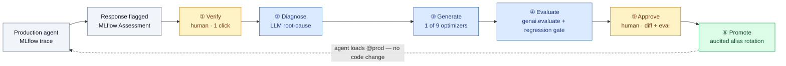
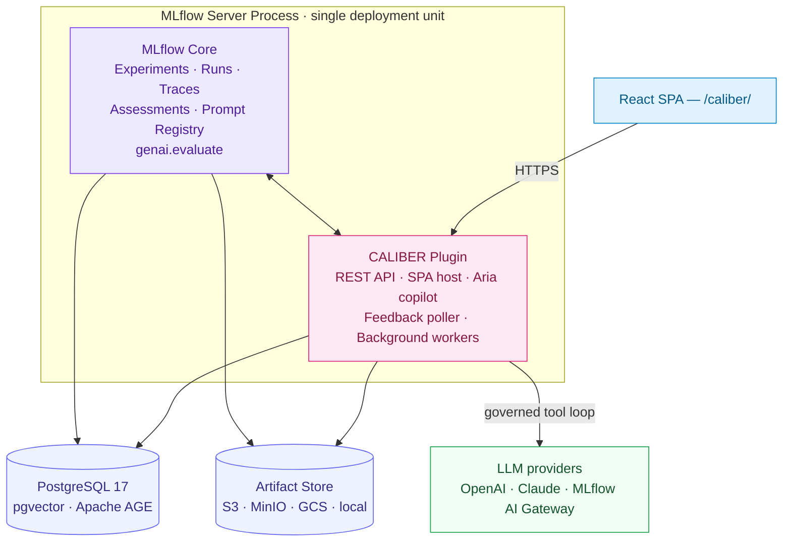

<div align="center">


# CALIBER Suite

### The MLflow-native control plane for trusted agentic workflows

**Design, evaluate, calibrate, approve, deploy, and observe every AI-agent resource**
— prompts, tools, skills, MCP servers, workflows, and knowledge bases —
**in one place, on infrastructure you already run.**

[](https://github.com/rrahimi-uci/caliber-suite/actions/workflows/ci.yml)
[](./caliber/LICENSE)
[](./caliber/README.md)
[](https://mlflow.org)
[](https://www.postgresql.org)
[](./caliber/caliber-ui)
[](#-project-status)
[](./CONTRIBUTING.md)

**[Quickstart](#-quickstart)** · **[The loop](#-the-refinement-loop)** · **[Architecture](#-architecture)** · **[Capabilities](#-whats-inside)** · **[Docs](#-documentation)** · **[Status](#-project-status)**

</div>

---

CALIBER is an **MLflow server plugin** and **React application** for the full lifecycle of AI-agent
resources. It closes the loop that most observability tools leave open: catching a production failure is
well-tooled — *doing something about it, at scale, with a human in the loop and an audit trail* is not.
CALIBER turns a flagged trace into an eval-gated, one-click-approved deployment **without standing up a
single new service** — it reuses MLflow's Experiments, Traces, Assessments, Prompt Registry, Artifact
Store, and `genai.evaluate`.

> 📖 **Live docs:** [`docs-site/index.html`](./docs-site/index.html) &nbsp;·&nbsp; 📦 **Plugin package:** `caliber-mlflow` &nbsp;·&nbsp; 🧑‍🍳 **Learn by doing:** [16 Cookbooks](./docs-site/m-16-cookbooks.html)

---

## 🔄 The refinement loop

From a thumbs-down in production to a deployed, eval-gated fix — typically **under 30 minutes** with exactly
**two human decisions**.



<div align="center"><sub>🟡 human decision &nbsp;·&nbsp; 🔵 automated &nbsp;·&nbsp; 🟢 shipped — the dashed edge closes the loop: your code keeps loading <code>@prod</code>, the next call gets the new version.</sub></div>

**Why it matters** — every change is *MLflow-native* (one deployment unit), *eval-gated* (nothing ships
without a quantified, per-dimension improvement on a held-out dataset), *auditable* (each change traces back
to the feedback that triggered it), and *multi-agent aware* (bundles refine collaborating agents jointly
when a bug spans handoffs).

---

## 🧩 What's inside

A single control plane spanning the whole agent stack — all implemented and tested.

| Area | Highlights |
| --- | --- |
| ✍️ **Authoring** | **Prompts**, **Tools**, **Skills**, **MCP servers** — versioned registries with test runs, advisory eval gates, and audited rollback |
| 🔀 **Workflows** | Visual **Studio**, queued runs, runtime approvals, checkpointing, and workflow-as-a-service |
| 📚 **Knowledge bases** | Versioned RAG corpora — chunking, embeddings, **Apache AGE** graph extraction, hybrid retrieval + cross-encoder rerank |
| 🧪 **Evaluation** | Scorecards, **custom LLM judges** (`make_judge`), structured human-review queues, advisory per-version gate verdicts |
| 🎛️ **Calibration** | A **nine-optimizer** pool (MetaPrompt, GEPA, DSPy, and more) auto-selected by artifact type + diagnosis shape, for prompts *and* skills |
| 🔭 **Observability** | MLflow tracing with multimodal attachments, SSE live events, service visibility, and trace retention |
| 🛡️ **Governance** | RBAC, audited promotion/rollback, and the **LLM Gateway** surface (endpoint discovery, guardrails, per-model pricing, usage) |
| 🤖 **Aria copilot** | An embedded, permissioned **agentic tool loop** (OpenAI + Claude) that drives a stated goal through a durable, supervised goal-plan — pause for permission, separation of duties, async resume, self-correction |

---

## 🏢 Architecture

CALIBER is one MLflow `mlflow.app` plugin that runs **inside the MLflow server process** and shares MLflow's
own database and artifact store — no standalone services, no second datastore.



- **MLflow-native** — the plugin registers ASGI routes (`/ajax-api/2.0/mlflow/caliber/*`), static SPA routes (`/caliber/`), a background feedback poller, refinement + workflow workers, and Alembic-managed extension tables in MLflow's own database.
- **One deployment unit** — relational metadata is the authoritative control plane; MLflow stays authoritative for prompt-registry versions and traces; object storage holds file bytes.
- **Portable state** — PostgreSQL 17 (pgvector + Apache AGE) in production, SQLite for lightweight/dev; artifacts on S3 / MinIO / GCS / local.

---

## 🚀 Quickstart

```bash
# ── Backend (from the repo root) ──
cd caliber
python -m venv .venv && source .venv/bin/activate
pip install -e ".[dev,s3]"

# ── Frontend (in a second shell) ──
cd caliber/caliber-ui
npm install
npm run dev
```

Then start the backend from `caliber/`:

```bash
source .venv/bin/activate
make dev
```

`make dev` defaults MLflow artifacts to `s3://mlflow/mlruns` via the local MinIO endpoint
(`http://127.0.0.1:9000`) — start the suite's MinIO stack first, or override `MLFLOW_ARTIFACT_ROOT` /
`MLFLOW_S3_ENDPOINT_URL`.

🔗 Open the UI at **`http://127.0.0.1:5001/caliber/login`**.

> 🐳 **Full containerized bring-up** (Postgres 17, MinIO, MLflow, MLflow AI Gateway, NATS, Redis): use the stack in [`deploy/`](./deploy/) — see [`deploy/README.md`](./deploy/README.md).

---

## 🗺️ Repository layout

| Path | What it is |
| --- | --- |
| 📦 [`caliber/`](./caliber/) | The MLflow plugin Python package — runtime code, Alembic migrations, the React SPA, tests, and packaging. See its [README](./caliber/README.md) for install + dev. |
| 🌐 [`docs-site/`](./docs-site/) | The published documentation site: the [landing page](./docs-site/index.html); 15 generated architecture module pages (`m-01`…`m-15`, built from [`docs/`](./docs/) by [`build-docs.mjs`](./docs-site/build-docs.mjs)); the **[Cookbooks](./docs-site/m-16-cookbooks.html)** — a card index plus 16 step-by-step, UI-only recipe pages sourced from [`docs-site/cookbooks/`](./docs-site/cookbooks/); the [walkthrough](./docs-site/walkthrough.html) runbook; and click-through slide decks. Also synced into the SPA and served in-app at `/caliber/docs/`. |
| 📐 [`docs/`](./docs/) | Source-of-truth design specs — one `architecture.md` per numbered area (platform, registries, workflows, data, observability, QA, evaluation, calibration, assistant) plus the [workflow components reference](./docs/06-workflows/components.md). Each opens with an **At a glance** summary + a typed-color diagram, then a banded **Reference** tier. Conventions in [`docs/STYLE.md`](./docs/STYLE.md); machine index for agents at `docs-site/llms.txt`. |
| 🐳 [`deploy/`](./deploy/) | The Docker stack for a full local/production bring-up (Postgres 17 + pgvector + Apache AGE, MinIO, MLflow, the MLflow AI Gateway, NATS, Redis) plus `compose.yaml`. See [`deploy/README.md`](./deploy/README.md). |
| 🎬 [`overview-video/`](./overview-video/) | Narration script and screenshot/video-generation scripts that render the embedded overview video on the docs site. |

---

## 📚 Documentation

| Start here | For… |
| --- | --- |
| 🏠 **[Docs landing page](./docs-site/index.html)** | What CALIBER is, why it exists, and how it fits with MLflow |
| 🧭 **[Walkthrough runbook](./docs-site/walkthrough.html)** | A copy-pasteable bring-up that tours every SPA page and builds a governed artifact with Aria |
| 🧑‍🍳 **[Cookbooks](./docs-site/m-16-cookbooks.html)** | 16 step-by-step, UI-only recipes — prompt regression, precision skills, policy-safe tools, doc-to-JSON, governed MCP, grounded knowledge, support/incident copilots, self-healing workflows, observability & triage, trustworthy evaluation, release signoff, and four Aria goal-plan recipes |
| 🧱 **[Build the plugin](./caliber/README.md)** | `pip install -e ".[dev,s3]"`, then `make dev` |
| 🤝 **[Contributing](./CONTRIBUTING.md)** | Local setup, the quality gate, extension seams, and PR conventions |

**Design context** — browse [`docs/`](./docs/) or the rendered [architecture pages](./docs-site/m-01-platform.html):
[platform architecture](./docs/01-caliber/) · [Aria copilot](./docs/12-assistant/) · [evaluation](./docs/14-evaluation/) + [calibration](./docs/15-calibration/).

---

## ⚡ MLflow 3.14 native

The suite tracks the current open-source **MLflow (`≥3.14`)** and **PostgreSQL 17** (pgvector + Apache AGE).
Five MLflow 3.14 GenAI capabilities are wired in with genuinely-native OSS APIs (native Review Queues are
Databricks-only, so that surface is built CALIBER-native on the OSS assessment primitives):

| Capability | How CALIBER uses it |
| --- | --- |
| **Test Set → dataset sync** | Push a test set to MLflow's native `mlflow.genai.datasets` registry for the dataset UI + source-trace lineage, while Postgres stays the source of truth (with a synced/stale badge). |
| **Custom LLM judges** | Author reusable judges from natural-language instructions (`mlflow.genai.make_judge`) on the **Judges** page; usable in the refinement gate, human review, and the Evaluations scorecard as `Judge.<id>` tokens alongside deterministic heuristics. |
| **Multimodal tracing** | Extraction spans carry the source document as a trace attachment so the KG/OCR pipeline's inputs render in the trace viewer. |
| **Trace retention** | Opt-in, server-owned archival of aged traces to object storage. |
| **Review Queues** | Define a label schema (pass/fail, categorical, numeric, free-text), enqueue traces, and review them; answers write back onto each trace as MLflow assessments/expectations. |

---

## ✅ Project status

The platform spans prompts, tools, skills, MCP servers, workflows, knowledge bases, object storage, test
sets, observability, evaluation, calibration, the LLM Gateway, RBAC, and Aria — **all implemented and
tested.**

Latest recorded local validation on **2026-06-15**:

| Layer | Result |
| --- | --- |
| 🐍 **Backend** | 3,037 pytest passed, 6 skipped, + opt-in integration suite (9 passed); Ruff, Mypy, and the package build green; **coverage 87.88%**. |
| ⚛️ **Frontend** | 903 Vitest passed across 60 files; TypeScript, the production Vite build, and 23 Chromium Playwright E2E tests passed. |

> ℹ️ The requested 97% coverage target is not yet met, and a supported-Python `pip-audit` follow-up stays open (transitive `diskcache`/`torch` in the optional DSPy / local-embedding stacks). These gaps are called out in the docs rather than hidden.

---

## 🧪 Testing & quality

<details>
<summary><b>Run the test suites</b></summary>

```bash
# Backend
cd caliber
ruff check src tests && mypy src
pytest -n auto -m "not integration"   # xdist parallel; integration tests need external servers

# Frontend
cd caliber/caliber-ui
npm run lint
npm run typecheck
npm run test:coverage
npm run test:e2e
```

</details>

<details>
<summary><b>Allure reports</b></summary>

All three test layers can emit [Allure](https://allurereport.org/) results:

| Layer | Emit results |
| --- | --- |
| Backend (pytest) | `cd caliber && make test-allure` |
| Frontend unit (vitest) | `cd caliber/caliber-ui && npm test` (emits automatically) |
| E2E (playwright) | `cd caliber/caliber-ui && npm run test:e2e` (emits + attaches screenshots/traces) |

**Emitting `allure-results/` needs no Java** — only *rendering* the HTML report does. Render from the suite root:

```bash
make allure          # combined backend + UI report, then opens it
```

`make allure` uses a local Java runtime when present and **falls back to a Dockerized JRE** otherwise, so it
works on any host with *either* Java or Docker (`make check` reports whether Java is available — it's
optional). Install Java directly with `brew install --cask temurin` (macOS),
`sudo apt-get install -y default-jre` (Debian/Ubuntu), or `choco install temurin` (Windows).

**CI:** results are produced without Java — upload `allure-results/` as an artifact, or render in-job by
adding Java first:

```yaml
- uses: actions/setup-java@v4
  with: { distribution: temurin, java-version: "21" }
- run: cd caliber/caliber-ui && npm run allure:generate:all
```

</details>

---

## ⚙️ Configuration

CALIBER is environment-configured through `CaliberConfig`. The **Settings** page shows a safe, grouped
inventory of assistant, LLM, storage, security, worker, webhook, and sandbox configuration. Common production
variables include `CALIBER_DATABASE_URL`, `CALIBER_ADMIN_USERS`, `CALIBER_WORKFLOW_STORAGE_*`,
`CALIBER_WORKFLOW_RUN_QUEUE_ENABLED`, and provider selections such as `CALIBER_LLM_PROVIDER`,
`CALIBER_EVAL_PROVIDER`, and `CALIBER_PROMOTER_PROVIDER`.

<details>
<summary><b>Single development environment (v1)</b></summary>

The initial product ships a **single environment**. A build deploys straight to one live alias — there is no
`dev → staging → prod` promotion ladder, no stage selector, and no promotion-approval queue. Deploy gates
still run as an optional eval check when a workflow attaches one. The infrastructure was already
single-stack (one `deploy/compose.yaml`, one `.env`, one Postgres/MinIO/MLflow); this just collapses the
application-level promotion lifecycle to match.

The multi-stage governance machinery (eval-gated promotion + human prod sign-off) is left intact but
dormant, so it can be turned back on without code surgery:

- **Frontend:** flip `SINGLE_ENVIRONMENT` in [`caliber/caliber-ui/src/lib/environment.ts`](caliber/caliber-ui/src/lib/environment.ts).
- **Backend:** re-add the gated alias to `GATED_ALIASES` in [`caliber/src/caliber/workflows/promoter.py`](caliber/src/caliber/workflows/promoter.py), and list the extra aliases in `_PROMPT_DISCOVERY_ALIASES` in [`caliber/src/caliber/routes/prompts.py`](caliber/src/caliber/routes/prompts.py).

</details>

---

## 🛠️ Troubleshooting

<details>
<summary><b>Common symptoms &amp; checks</b></summary>

| Symptom | Check |
| --- | --- |
| MinIO/S3 shows not configured | Set `CALIBER_WORKFLOW_STORAGE_BUCKET` plus endpoint, region, path-style, and credential-source variables; install the `s3` extra. |
| UI deep link returns 404 | Use the CALIBER backend `/caliber/` route or the Vite dev server with the correct `CALIBER_UI_BASE`. |
| Playwright cannot start | Run `npm run playwright:install` in `caliber/caliber-ui`. |
| Backend tests fail on Starlette TestClient | Ensure dev dependencies include `httpx2>=2.3` and reinstall with `pip install -e ".[dev]"`. |

</details>

---

## 🤝 Contributing

Contributions are welcome — start with **[CONTRIBUTING.md](./CONTRIBUTING.md)** for local setup, the quality
gate, the extension seams, and PR conventions.

## 📄 License

**Apache 2.0** — see [`caliber/LICENSE`](./caliber/LICENSE).

<div align="center"><sub>Built on MLflow · PostgreSQL · React — <a href="./docs-site/index.html">read the docs</a></sub></div>
