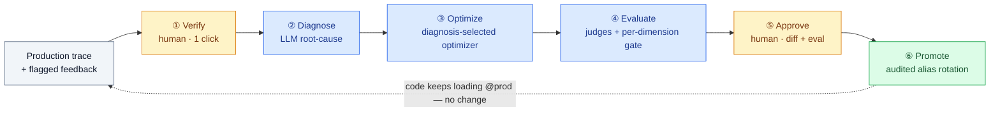

# CALIBER — The Refinement Loop

*The one idea that ties the rest of these docs together. Read this before the reference pages: it explains why the building blocks exist and how they connect.*

## At a glance

Every other topic in this documentation — prompts, tools, skills, MCP servers, workflows, knowledge bases, test sets, evaluation, calibration, governance, and the Aria copilot — exists to serve a single motion: **turn a flagged production response into a measurably-better, safely-deployed artifact**, without leaving the platform and without losing an audit trail. CALIBER runs this as a *closed loop* with humans at exactly **two** gates.

🟡 human decision · 🔵 automated · 🟢 shipped. The dashed edge closes the loop: your application keeps loading `@prod`, and the next call transparently gets the new version.

## The six stages

| Stage | What happens | Reference |
|---|---|---|
| **① Verify** | A human confirms the flagged trace is actionable — one click. | Platform |
| **② Diagnose** | An LLM identifies the root cause from the trace and its evidence. | Calibration |
| **③ Optimize** | A **diagnosis-selected optimizer** proposes a fix for the prompt or skill (the optimizer is chosen from the failure's shape, not hand-picked). | Calibration |
| **④ Evaluate** | The candidate is scored against a pinned test set with **per-dimension regression gates** — nothing advances on a regression. | Evaluation · Test sets |
| **⑤ Approve** | A human reviews the diff, the eval comparison, and the root-cause summary, then approves or rejects. | Prompts |
| **⑥ Promote** | The live alias is rotated atomically and **audited**; an explicit rollback restores the exact previously-live version. | Prompts · Workflows |

## Why it matters

Most tools own only one arc of this loop — an observability platform, a visual builder, or an evaluation harness. CALIBER's bet is owning the **whole circuit**, self-hosted and MLflow-native, so improvement is *governed end-to-end* rather than stitched together from separate products. That closed, eval-gated, audited loop — across a unified set of artifacts — is what distinguishes it. See [how CALIBER compares to the alternatives](competitive-analysis.md) and [where it is headed](roadmap.md).

## How the rest of the docs map to the loop

The loop runs over the artifacts the following sections document:

- **Authoring** — the artifacts it improves and promotes: [Prompts](02-prompts/architecture.md), [Tools](03-tools/architecture.md), [Skills](04-skills/architecture.md), [MCP servers](05-mcp/architecture.md), and [Workflows](06-workflows/architecture.md).
- **Data & knowledge** — what those artifacts run against: the [Object store](07-object-store/architecture.md) and [Knowledge bases](08-knowledge-bases/architecture.md).
- **Quality & trust** — how a fix is *proven*: [Test sets](11-test-sets/architecture.md) provide the evidence, [Evaluation](14-evaluation/architecture.md) scores it, and [Calibration](15-calibration/architecture.md) is the optimizer engine behind stage ③.
- **Operations** — how it's watched and governed once live: [Observability](09-observability/architecture.md), [Gateways](10-gateways/architecture.md), and the [QA plan](13-qa-plan/architecture.md).
- **Aria** — the [embedded copilot](12-assistant/architecture.md) that can drive parts of this loop under permission.

> **New here?** Start with the [Platform](01-caliber/architecture.md) overview for how CALIBER runs (an MLflow plugin), then this page for *what* it does, then dip into whichever artifact you're working with.
