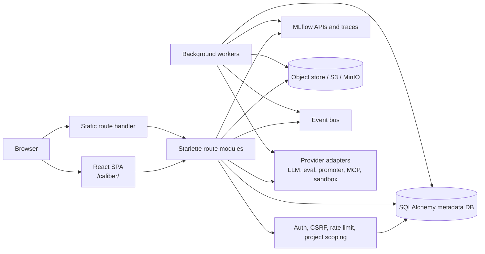
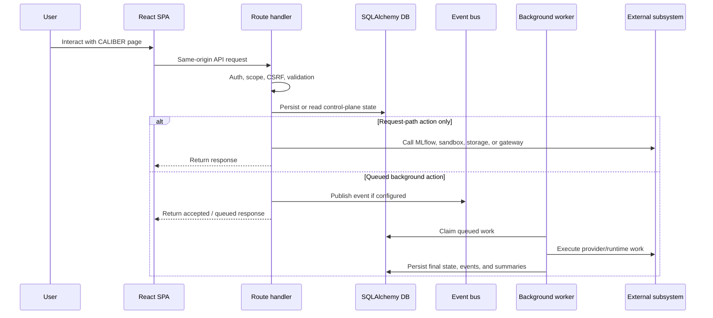

# CALIBER Platform Architecture

This document is the authoritative overview of the CALIBER platform. It describes
how the system is bootstrapped, how its layers fit together, where state lives,
and how the cross-cutting subsystems combine into a single control plane. The
per-feature documents that accompany it describe how individual bounded contexts
plug into the substrate established here; this document is the anchor they refer
back to.

Throughout, all HTTP routes are mounted under the
`/ajax-api/2.0/mlflow/caliber` prefix. To keep the prose readable, endpoint
paths are shown relative to that prefix once the convention has been stated.

## At a glance

| Dimension | Where CALIBER stands |
| --- | --- |
| **What it is** | A system-level control plane shipped as an MLflow `mlflow.app` plugin — not a gateway in front of MLflow. |
| **Where it runs** | In the MLflow server process, sharing its lifecycle, origin, and failure domain. |
| **How users reach it** | A React SPA served under `/caliber/`; every action flows through the API under `/ajax-api/2.0/mlflow/caliber/*`. |
| **Source of truth** | SQLAlchemy relational metadata is authoritative; object storage owns file bytes; MLflow owns prompt versions and traces. |
| **Work model** | Request-path actions return inline; durable work is queued to background workers (refinement, workflow runs, KB builds, janitor, webhooks). |
| **Trust model** | Identity arrives via `X-CALIBER-User` / `X-CALIBER-Project` headers; `auth.py` resolves the `viewer` / `operator` / `approver` / `admin` scopes. |

The sections below start from this picture and drill down — scope, boundaries,
runtime, state, surfaces, lifecycle, security, operations, and the seams the
system is extended along.

```diagram-svg
assets/platform-overview.svg
```

*Platform overview — CALIBER lives inside the MLflow server process, exposes one
same-origin control plane, and uses durable state plus background workers rather
than process-local orchestration.*

## Reference

## 1. Scope and responsibilities

The `caliber` module is the system-level control plane for the product. It is
implemented as an MLflow `mlflow.app` plugin and runs in the same Python process
as the MLflow server, which means CALIBER shares MLflow's lifecycle, origin, and
runtime rather than sitting in front of it. Its responsibilities are
correspondingly broad — wider than those of any single feature module — and span
the following concerns:

- It bootstraps the Starlette application and the shared runtime dependencies on
  which every feature depends.
- It serves the React SPA under `/caliber/`.
- It exposes the CALIBER API surface under
  `/ajax-api/2.0/mlflow/caliber/*`.
- It owns persistence, authorization, CSRF, rate limiting, project scoping, and
  audit.
- It orchestrates background workers for refinement, workflow runs,
  knowledge-base builds, janitor work, and webhook dispatch.
- It integrates with MLflow tracing, the MLflow prompt registry, object storage,
  and optional event-bus backends.

These responsibilities are realized across a small set of primary code paths,
which serve as the entry points for the rest of this document:

- `caliber/src/caliber/server.py`
- `caliber/src/caliber/routes/__init__.py`
- `caliber/src/caliber/config.py`
- `caliber/src/caliber/db/session.py`
- `caliber/src/caliber/auth.py`
- `caliber/src/caliber/routes/static.py`
- `caliber/caliber-ui/src/components/AppShell.tsx`

## 2. Module boundaries

Given that breadth, CALIBER is best understood as a layered application rather
than a monolith stitched together from feature-specific entry points. Each layer
has a clear responsibility and consumes the layers beneath it through stable
interfaces.

| Layer | Main code paths | Responsibilities |
| --- | --- | --- |
| Boot and dependency graph | `server.py`, `config.py` | Load configuration, construct providers, wire `app.state`, and own process lifecycle. |
| Transport and routing | `routes/__init__.py`, `routes/*.py` | Register HTTP endpoints, apply auth and request parsing, and translate errors to API responses. |
| Persistence | `db/models.py`, `db/session.py` | Define relational state, session factories, and durable audit/reference entities. |
| Feature modules | `routes/prompts.py`, `routes/tools.py`, `routes/skills.py`, `routes/mcp_servers.py`, `routes/workflows*.py`, `routes/assistant.py` | Implement domain-specific API behavior and orchestration. |
| Async execution | `orchestrator/*.py`, `workflows/run_launch.py` | Run queued refinement and workflow execution off the request path. |
| Shared subsystems | `auth.py`, `observability/*`, `storage/*`, `events/*`, `tool_sandbox/*` | Provide cross-cutting concerns used by multiple modules. |
| Frontend shell | `caliber-ui/src/components/AppShell.tsx`, `TopBar.tsx`, `Sidebar.tsx` | Route users into page-level feature modules and keep shared chrome, state, and assistant panel behavior consistent. |

The architectural boundary that matters most is that feature modules do not own
application bootstrapping. `server.py` constructs every long-lived dependency
exactly once, stores it on `app.state`, and leaves the route modules to consume
those dependencies rather than create their own. This single-construction
discipline is what keeps the layering above honest in practice.

## 3. Runtime architecture

The layers described above resolve, at runtime, into the flow shown below: a
browser drives the SPA and static surfaces, requests fan into the route modules,
and the route modules and background workers share access to persistence,
MLflow, object storage, the event bus, and the provider adapters.



```legend
```

Several structural properties follow from this topology and are worth making
explicit, because they shape every design decision downstream:

- CALIBER is not a separate gateway placed in front of MLflow. It is loaded into
  the MLflow server process as a sibling ASGI application surface, which is why
  same-origin behavior comes for free and why CALIBER and MLflow share a single
  failure domain.
- The frontend shell is bundled separately with Vite, but it is served through
  the plugin package by `routes/static.py` rather than from a distinct origin.
- Shared dependencies are constructed once in `create_app()` and injected via
  `app.state`. They comprise the SQLAlchemy engine and session factory, the
  artifact store, the LLM provider, the eval provider, the promoter, the event
  bus, the assistant service, and the background workers.
- The codebase uses sync SQLAlchemy consistently, even inside Starlette. Sync
  route handlers execute in Starlette's threadpool; this keeps the ORM model
  aligned with MLflow's own sync behavior and avoids the impedance mismatch of
  mixing async ORM access into a host process that is itself synchronous.

## 4. Data model and state

With the runtime established, the next question is where authoritative state
lives. The persistence model is deliberately broad: CALIBER keeps durable
product state in SQLAlchemy rows and treats external systems such as MLflow and
object storage as integrated subsystems rather than as replacements for
relational metadata.

That state divides into the following domains, each anchored to a representative
set of tables:

| Domain | Representative tables | Purpose |
| --- | --- | --- |
| Core governance | verification items, refinement jobs, approvals, rollback checkpoints | Human-in-the-loop refinement pipeline and deployment safety. |
| Prompts and assistants | prompt test runs, assistant sessions/messages/drafts/runs/publish events/attachments, Aria goal-plans/steps/interactions | Prompt authoring, testing, assistant-driven authoring state (Aria context attachments), and Aria's agentic goal-plan orchestration. |
| Tools and skills | tool registry, tool test runs, skill rows, skill test runs | Reusable runtime capabilities and authoring/test surfaces. |
| Workflows | workflows, workflow versions, deployments, runs, events, checkpoints, session memory, benchmark reports, patches, promotions | Workflow Studio source-of-truth and runtime lineage. |
| MCP | MCP servers | External tool endpoints, discovered tools, policies, and calibrations. |
| Knowledge bases | knowledge bases, versions, sources, chunks, entities, relationships, build runs, calibration test runs | Versioned RAG corpora with chunking/embeddings, graph (Apache AGE) extraction, and retrieval-quality calibration. |
| Evaluations / test sets | eval datasets, eval dataset examples, eval dataset files, eval runs, judges, review queues/items, gate verdicts | Versioned test sets, scorecard evaluation runs, operator-authored LLM judges, human review queues, and advisory per-version gate verdicts. |
| Files and projects | projects, workflow files, file events | Workspace and run-scoped file metadata independent of backing store. |

The division of authority across these domains is governed by a small set of
ownership rules, and they hold consistently across the platform:

- Relational metadata is the authoritative control plane.
- Object storage is authoritative for file bytes, but not for the file
  inventory.
- MLflow is authoritative for prompt registry versions and traces, but not for
  CALIBER-specific workflow, tool, or skill metadata.
- Route handlers and workers are both permitted to mutate the same tables, so
  the code coordinates through explicit status transitions, audit rows, and
  durable timeline events rather than through in-memory state. Durability is
  the synchronization mechanism precisely because the two writers do not share a
  process-local view.

Versioning is a cross-artifact concern with one shared model. Prompts (registry
versions behind a `@prod` alias), workflows (immutable versions behind a
deployment alias), knowledge bases (build versions behind an `active_version_id`
pointer), skills (per-version snapshots), test sets (copy-on-write), and tools
(a `(name, version)` family) each keep real history, and each promotion,
rollback, or activation writes an audit row. Rollback is derived from that audit
trail rather than an ordinal guess: the walk reads only the *promotion/activation*
rows (never the rollback rows a rollback itself writes), so repeated rollbacks
step strictly backward through real history instead of oscillating. An advisory
eval-gate verdict is attached per version and shown before a promotion but never
blocks the rotation. The frontend renders all of this through one shared
`VersionPanel` component (per-artifact adapters, no type branching), and the
read-only `/releases/timeline` and `/releases/live` surfaces answer "what changed"
and "what is live" across artifact types in one place — the live view attributing
each entry to the actor and moment of its activation from the audit trail.

## 5. API and interaction surfaces

State is reached exclusively through the HTTP surface. That surface is
centralized in `routes/__init__.py`, which registers each feature module under
the same-origin AJAX namespace. The endpoints below are representative rather
than exhaustive:

- `/prompts`
- `/tools`
- `/skills`
- `/mcp-servers`
- `/workflows`
- `/workflow-versions/*`
- `/workflow-runs/*`
- `/assistant/*`
- `/aria/plans/*` (Aria goal-plan orchestration)
- `/judges`, `/review-queues`, `/eval-datasets`, `/gate-verdicts/*`
- `/releases/timeline`, `/releases/live` (cross-artifact releases & rollback)

On the client side, the corresponding entry points are organized as page
modules, each of which owns a single feature surface:

- `caliber/caliber-ui/src/pages/Prompts.tsx`
- `caliber/caliber-ui/src/pages/ToolRegistry.tsx`
- `caliber/caliber-ui/src/pages/Skills.tsx`
- `caliber/caliber-ui/src/pages/McpServers.tsx`
- `caliber/caliber-ui/src/pages/Workflows.tsx`
- `caliber/caliber-ui/src/pages/WorkflowEditor.tsx`
- `caliber/caliber-ui/src/pages/Settings.tsx`

The frontend shell never talks to databases or providers directly. Every user
action routes through the CALIBER HTTP surface, even when the eventual effect is
a provider call, an object-store mutation, or a workflow enqueue. Keeping the
client behind a single API boundary is what allows authorization, scoping, and
audit to be enforced uniformly in one place.

## 6. Execution lifecycle

The API surface admits two shapes of work: actions that complete on the request
path, and actions that are durably queued for a background worker. The sequence
below shows both branches and the point at which they diverge.



The same lifecycle plays out at three scales — process startup, individual
request handling, and shutdown — and each has well-defined checkpoints:

- At application startup, configuration is loaded and validated, logging and
  tracing are configured, the engine, providers, storage, and event bus are
  built, and the workers are started by the Starlette lifespan manager.
- During request handling, the route module validates the headers, body, and
  query, uses the `app.state` dependencies together with a DB session, and
  either returns directly or enqueues durable work.
- At shutdown, the workers stop in a controlled order, the event bus is closed,
  and the SQLAlchemy engine is disposed. The ordering matters: workers are
  drained before their shared resources are torn down.

## 7. Security and trust boundaries

Because CALIBER runs inside the MLflow process, it inherits authentication from
the hosting MLflow server or an upstream proxy and does not implement its own
login service. The trust model therefore centers on resolving an explicit
request identity and scope rather than on session establishment:

- The `X-CALIBER-User` header identifies the caller.
- The `X-CALIBER-Project` header supplies the active project for multi-project
  scoping.
- `auth.py` resolves the `viewer`, `operator`, `approver`, and `admin` scopes.
- Route handlers call `require_user()` or `require_scopes()` before any
  mutation.

Layered over this identity model is a set of controls that protect both the
request path and the data it touches:

- CSRF protection guards browser-driven state changes.
- Optional rate-limiting middleware bounds request volume.
- Project and visibility filters are applied at query time.
- Audit logging records durable mutations.
- Secrets are referenced indirectly through `*_source` fields rather than
  carried as raw secret material.
- Manifest validation rejects inline secrets in workflow definitions.
- Tool sandbox runs execute in an isolated subprocess.

The dominant trust boundary runs between control-plane state and code execution.
Route handlers may accept user-authored manifests, prompt text, tool metadata,
and skill content, but only specific runtime paths are permitted to execute code
or make external calls. In particular, tool execution is isolated behind the
sandbox/runtime path rather than executed inline in request handlers, so
accepting untrusted content never implies running it in the server process.

## 8. Observability and operations

Operating CALIBER depends on an observability spine that is shared across every
module rather than reimplemented per feature. Its core pieces are:

- structured JSON logging in `observability/logging.py`;
- guarded MLflow tracing in `observability/mlflow_tracing.py`;
- request trace-ID propagation in `observability/trace.py`;
- Prometheus metrics exposed on the `/metrics` route;
- workflow-run events and checkpoints, which serve as durable operational
  timeline state.

The operational design choices behind these pieces favor graceful degradation,
so that observability and serving infrastructure fail soft rather than taking
the request path down with them:

- Logging defaults to stderr, with optional mirroring to S3 or the Object Store.
- Tracing is on-but-inert by default and degrades to a no-op when MLflow tracing
  support is unavailable.
- Event publication is best-effort and must never break the request path.
- Static UI serving degrades gracefully, returning a 503 with an
  operator-facing message when the bundle is absent.

## 9. Extension points and current constraints

CALIBER is built to be extended along its existing seams rather than rewired.
The primary extension points follow the layering described earlier:

- A new route module is added and registered in `routes/__init__.py`.
- A new provider adapter is added and wired through `server.py`.
- New worker loops are added into the lifespan graph.
- New storage or event-bus backends are added behind the existing abstractions.
- New pages extend the React SPA under `caliber-ui/src/pages`.

Set against those seams are the architectural constraints the system currently
accepts, stated plainly so that future work can weigh them deliberately:

- CALIBER and MLflow share the same process boundary. This simplifies
  same-origin behavior but couples their failure domains.
- SQLAlchemy usage is sync throughout the server.
- Many feature modules still perform orchestration directly in the route files
  rather than through deeper service layers.
- Several domains intentionally use hidden runtime identities
  (`prompt_targets`, `skill_targets`) so that they fit into the shared
  refinement machinery.
- Workflow execution and assistant logic remain substantially in-process, even
  though both are structured well enough to be extracted later.

Taken together, the picture is consistent: CALIBER is a plugin-hosted control
plane with feature modules layered on a common runtime substrate. The
per-feature documents take it from here, describing how each major bounded
context plugs into that substrate.
