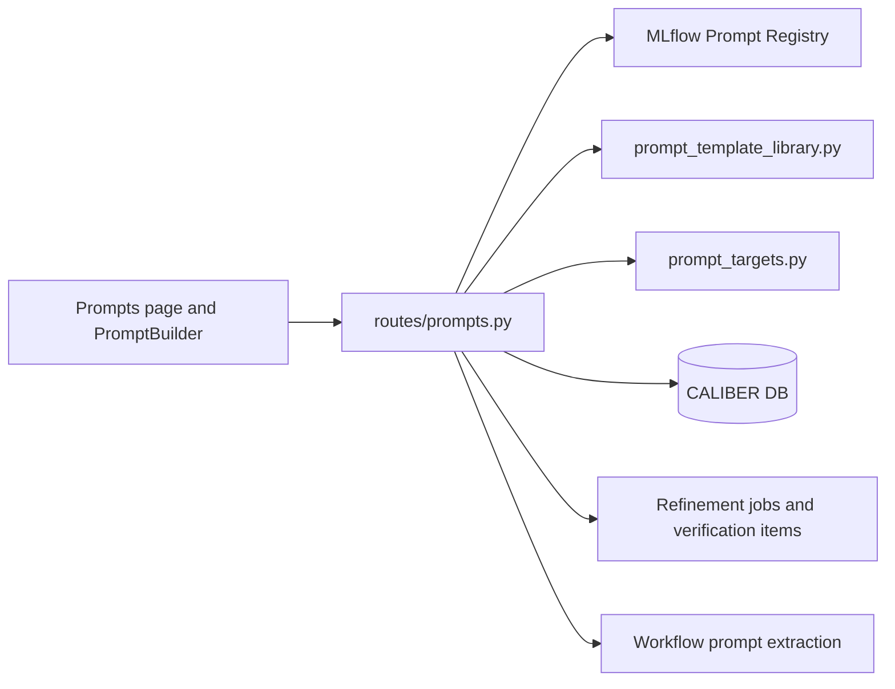

# Prompts Architecture

## At a glance

| Dimension | Prompts as a composition-layer control plane |
| --- | --- |
| **What it is** | CALIBER's prompt control plane for authoring, versioning, testing, and calibrating prompts. |
| **Where state lives** | No `caliber_prompts` table; content in the MLflow Prompt Registry, workspace/test metadata in CALIBER carriers. |
| **Key surfaces** | `caliber/src/caliber/routes/prompts.py`, `Prompts.tsx`, and `PromptBuilder.tsx`, mounted under `/ajax-api/2.0/mlflow/caliber`. |
| **Runtime model** | One route entry point fans out to MLflow, `prompt_template_library.py`, `prompt_targets.py`, the DB, and the shared refinement pipeline. |
| **Runtime identity** | A hidden `CaliberAgentConfig` prompt target keyed on prompt name gives each prompt an `agent_id`. |
| **Trust / safety** | Authoring is non-live: create/version endpoints only register immutable drafts. Alias release and rollback need `operator` scope and use a committed, idempotent release intent before MLflow is mutated. An admin inherits operator; `approver` is a sibling role and cannot release without separate operator/admin authority. Template-preview and test-render are read-only, non-executing transformations. |
| **Calibration** | Optimization and calibration enqueue `CaliberVerificationItem` and `CaliberRefinementJob` into the shared pipeline. |

The sections below start from this picture and drill down into the detail behind each dimension.

## Reference

## 1. Scope and responsibilities

The prompts module is CALIBER's prompt control plane: the single operator-facing
surface through which prompts are authored, versioned, tested, and calibrated.
What distinguishes it from the other asset modules is that it owns no canonical
storage of its own. There is no standalone `caliber_prompts` table; instead, the
module composes three distinct sources of truth into one coherent surface:

- the MLflow Prompt Registry, which stores prompt versions and aliases and acts
  as the canonical artifact backend;
- CALIBER runtime target rows, which give each prompt a durable runtime identity
  so it can be tested and calibrated like any other asset;
- CALIBER-owned history rows, which capture prompt test runs and drive
  refinement orchestration.

Working from those sources, the module carries the following responsibilities.
It lists, creates, inspects, versions, aliases, and deletes prompts through
MLflow. It surfaces prompt-builder templates and renders template previews. It
provides prompt test-render along with durable prompt test-run history. It
enqueues prompt optimization and calibration work into the generic refinement
pipeline shared across the product. Finally, it exposes workspace state such as
the bind target, the baseline run, the dataset binding, and the derived
lifecycle status.

These responsibilities are realized across a small set of primary code paths:

- `caliber/src/caliber/routes/prompts.py`
- `caliber/src/caliber/release_operations.py`
- `caliber/src/caliber/routes/releases.py`
- `caliber/src/caliber/prompt_template_library.py`
- `caliber/src/caliber/prompt_targets.py`
- `caliber/caliber-ui/src/pages/Prompts.tsx`
- `caliber/caliber-ui/src/components/PromptBuilder.tsx`

## 2. Module boundaries

Because the module is a composition layer, its boundaries are best understood as
a map of which subsystem owns which concern. The table below assigns each
responsibility to its owner and explains the rationale.

| Responsibility | Owner | Notes |
| --- | --- | --- |
| Prompt version and alias storage | MLflow Prompt Registry | CALIBER writes directly to MLflow so prompts remain visible from both systems. |
| Prompt runtime identity | Hidden `CaliberAgentConfig` prompt target | Needed because downstream refinement/test machinery is keyed by `agent_id`. |
| Prompt template catalog | `prompt_template_library.py` | Pure CALIBER module powering builder templates and previews. |
| Test-run history | `CaliberPromptTestRun` | Durable CALIBER-owned run history for the Prompts page. |
| Calibration queueing | `CaliberRefinementJob`, `CaliberVerificationItem` | Shared refinement pipeline used by prompts, skills, and workflows. |
| Prompt alias release | `CaliberReleaseOperation` plus MLflow Prompt Registry | CALIBER commits the exact before/after release intent before changing the external alias, then settles or reconciles the operation. |
| Workflow prompt visibility | `routes/prompts.py` extraction helpers | Workflow-agent prompts are surfaced into the same prompt inventory. |

These assignments make the module deliberately hybrid, and that hybrid character
follows a consistent rule. Authoritative prompt content lives in MLflow, while
authoritative prompt workspace and testing metadata lives in CALIBER, and the
list and detail responses compose both into a single API surface. The remainder
of this document follows from that division.

## 3. Runtime architecture

At runtime the module fans a single API entry point out to the several backends
it coordinates. The diagram below shows how a request flows from the user
interface through the route module to each downstream system.



```legend
```

Several structural properties make this more than a thin proxy. Prompt listing
is not a trivial database query: `list_prompts()` merges alias-backed MLflow
prompts, prompt-target-backed agent prompts, and workflow-agent prompt
references extracted from workflow manifests into one inventory. Prompt
authoring writes through MLflow rather than through CALIBER rows, keeping the
registry canonical. Test-run persistence and workspace metadata remain CALIBER
concerns, since they have no natural home in the registry. And although prompt
optimization options and runs are exposed as prompt-specific APIs, they are
implemented by queueing the shared refinement pipeline rather than a bespoke
engine.

## 4. Data model and state

The defining design decision of this module is what it does not store: it
intentionally avoids a dedicated prompt row. Prompt state is therefore spread
across the registry and a handful of CALIBER carriers, each chosen for a
specific purpose.

| State | Storage | Purpose |
| --- | --- | --- |
| Prompt versions, aliases, template text | MLflow Prompt Registry | Canonical prompt artifact store and deploy target. |
| Hidden runtime identity | `CaliberAgentConfig` keyed by prompt name | Gives prompt tests, traces, jobs, and baselines an `agent_id`. |
| Prompt test history | `CaliberPromptTestRun` | Durable per-run results, score, trace ID, and MLflow run linkage. |
| Optimization/calibration queue | `CaliberVerificationItem`, `CaliberRefinementJob` | Feeds prompt work into the same background refinement engine used elsewhere. |
| Alias release intent and outcome | `CaliberReleaseOperation` | Stores operation identity, exact before/after versions, actor/evidence, status, provider result, and reconciliation error. A unique active lock serializes incomplete operations per prompt alias. |
| Workspace status | `optimizer_config` on hidden prompt target | Stores model pin, dataset binding, bind target, and baseline run ID. |

This layout has three consequences worth making explicit. Deleting a prompt
means deleting it from MLflow, not removing a CALIBER row, because no such row
exists. Lifecycle state such as `Draft`, `Tested`, `Calibrated`, or `Bound` is
derived from target, test, and job state rather than stored directly as a single
status column. And a prompt can participate in CALIBER workflows without ever
being represented as a standalone SQLAlchemy model.

## 5. API and interaction surfaces

All HTTP routes in this module are mounted under
`/ajax-api/2.0/mlflow/caliber` and are shown relative to that prefix below. The
public surface in `routes/prompts.py` is broad because it unifies registry CRUD,
template-builder helpers, testing, and calibration behind one router. The
endpoints group naturally into four areas.

The first area covers core inventory and versioning, backed by the registry:

- `GET /prompts`
- `POST /prompts`
- `GET /prompts/{name}`
- `DELETE /prompts/{name}`
- `POST /prompts/{name}/versions`
- `GET /prompts/{name}/versions`
- `GET /prompts/{name}/versions/{version}`
- `POST /prompts/{name}/aliases/{alias}`
- `POST /prompts/{name}/rollback`

Within this area, authoring and release are separate. `POST /prompts` rejects a
non-empty `target_alias`, and `POST /prompts/{name}/versions` defaults to a
non-live draft and rejects `promote: true`. The caller must register the immutable
version first and then invoke `POST /prompts/{name}/aliases/{alias}` to release it.
That release route captures the outgoing live version and optional optimistic
`expected_version`, commits the gate evidence and a `CaliberReleaseOperation`,
and only then asks MLflow to rotate the alias. It returns the operation ID and
settled release status. The advisory verdict is durable evidence but never blocks
this direct operator release. `POST
/prompts/{name}/rollback` reads that audit trail to restore the exact
previously-live version, writing a `rollback_prompt` row and returning `409`
when no prior live version is recorded. The rollback walk reads only
`promote_prompt` rows — never the `rollback_prompt` rows a rollback itself
writes — so repeated rollbacks step strictly backward through real promotion
history (v3→v2→v1) instead of oscillating back to the version just left. An
alias rotation applied through the assistant/apply path records the same
`promote_prompt` row, so it is equally visible to rollback.

The external effect is not a distributed transaction, but it is crash-observable.
The release row starts as `prepared`, moves to `applying` before the provider
call, and settles as `applied`; a proven pre-call failure becomes `failed`, while
an exception after mutation might have begun becomes `reconcile_required`.
Reusing an operation ID is safe only for the exact same mutation. Every operation
remains visible through `GET /releases/operations`: a still-`prepared` operation
can be retried or abandoned through `POST
/releases/operations/{operation_id}/resolve`, while `POST /releases/operations/reconcile`
compares `applying` and `reconcile_required` rows with the live MLflow alias and
settles the result. A background reconciler runs the same observation loop, and
the operator-only Releases recovery console exposes both paths. This narrows the
remaining boundary to provider-state observation rather than an unrecorded
production change.

Agent processes can use `caliber.resolver.PromptResolver` for late binding without
routing model inference through CALIBER. It resolves `name@alias` through the prompt
detail endpoint, caches the immutable version/template for a configurable TTL, and
serves only a previously successful last-known value during an outage. An optional
maximum stale age can fail closed instead; a first resolution failure always fails.
Telemetry reports resolution source, version, age, and error type without emitting
the prompt template or authentication headers.

Both explicit alias promotion and rollback are operator-scoped release actions:
a configured operator or admin can invoke them because admin inherits operator,
while an approver does not inherit operator and cannot release merely by holding
the sibling approver scope.

The second area serves the builder and preview experience, transforming
templates without executing them:

- `POST /prompts/{agent_id}/test-render`
- `GET /prompts/template-library`
- `POST /prompts/template-library/preview`

The third area enqueues optimization and calibration into the shared pipeline:

- `GET /prompts/optimization/options`
- `POST /prompts/optimization/runs`
- `GET /prompts/calibration/options`
- `POST /prompts/calibration/runs`

The fourth area manages workspace state and durable test history:

- `POST /prompts/test-runs`
- `GET /prompts/test-runs`
- `GET /prompts/test-runs/{test_run_id}`
- `GET /prompts/{name}/workspace`
- `POST /prompts/{name}/bind`
- `POST /prompts/{name}/baseline`

The frontend reaches these endpoints through two entry points:

- `caliber/caliber-ui/src/pages/Prompts.tsx`
- `caliber/caliber-ui/src/components/PromptBuilder.tsx`

## 6. Execution lifecycle

The endpoints above come together in three recurring flows: authoring a prompt,
testing it, and calibrating it. The sequence diagram traces each in turn.

```mermaid
sequenceDiagram
    participant U as User
    participant UI as Prompts UI
    participant API as routes/prompts.py
    participant ML as MLflow Prompt Registry
    participant DB as CALIBER DB
    participant Q as Refinement pipeline

    U->>UI: Create or edit prompt
    UI->>API: POST /prompts or /prompts/{name}/versions
    API->>ML: Register prompt/version
    API-->>UI: Return immutable draft metadata

    U->>UI: Promote selected version
    UI->>API: POST /prompts/{name}/aliases/{alias}
    API->>DB: Commit release intent + gate evidence
    API->>ML: Rotate alias to exact version
    API->>DB: Settle operation + release audit
    API-->>UI: Return operation ID + applied status

    U->>UI: Run prompt tests
    UI->>API: POST /prompts/test-runs
    API->>DB: Persist CaliberPromptTestRun
    API-->>UI: Return durable test-run detail

    U->>UI: Start optimization/calibration
    UI->>API: POST /prompts/optimization/runs
    API->>DB: Ensure hidden prompt target
    API->>DB: Insert verification item and refinement job
    API-->>UI: Return queued job metadata
    Q->>ML: Read prompt and evidence
    Q->>DB: Process stages; on pass mark candidate_ready
    U->>UI: Inspect candidate and invoke Apply
    UI->>API: POST /jobs/{job_id}/apply
    API->>DB: Commit checkpoint, provenance, and release intent
    API->>ML: Register candidate and rotate alias
    API->>DB: Settle release operation and audit
```

A few lifecycle rules govern how these flows behave. The module in
`prompt_targets.py` auto-provisions a hidden runtime identity keyed on the prompt
name, so a prompt can be tested and calibrated without the operator ever managing
an explicit agent row. Saving a version never changes a live alias; even a legacy
`promote: true` request is rejected, so release must use the explicit alias route
or the later Apply path. Both are durable release operations that record the
outgoing version and advisory verdict before MLflow is mutated, allowing exact
rollback and recovery after an ambiguous provider failure. The advisory verdict
never blocks direct operator rotation. Incomplete provider effects remain a
reconciliation boundary, surfaced by the operation list and reconcile endpoint.
Test-run history is durable and CALIBER-owned, but replay is effectively a frontend
re-run that inserts a fresh row rather than a server-side replay API. Bind and baseline are workspace metadata operations on
the hidden prompt target, not registry mutations. And workflow-node binding is
currently best-effort metadata only: the route records the intent to bind but
does not yet fully rewrite workflow manifests in place.

## 7. Security and trust boundaries

Because the module spans a registry and CALIBER-owned state, its controls are
split across both. The enforced controls are as follows. Mutating endpoints
require `operator` scope; admins inherit it, but approvers are a sibling role and
do not. Consequently, prompt release and rollback require an operator or admin,
not an approver acting only with `caliber.approver`. Prompt target creation
inherits project scoping through the active identity. Direct release and rollback
aliases are syntax-validated; current prompt discovery and calibration write paths
remain single-environment and use `prod`, so the API's syntactic acceptance of
another alias is not a verified multi-environment product mode. Optional scorer
support is capability-gated at runtime rather than assumed to be present.

Three design choices reinforce these boundaries. Prompt content is not stored
redundantly in CALIBER tables, so there is a single canonical copy in MLflow.
Workspace metadata and lifecycle state stay in CALIBER's database rather than
being smuggled into MLflow custom tags or prompt metadata blobs. And the
template-preview and test-render endpoints are read-only transformations, not
execution paths, which keeps the authoring surface free of code execution.

## 8. Observability and operations

The module emits both artifact metadata and runtime quality signals, which gives
operators visibility into prompt health. Its operational characteristics include
the following. Prompt test runs persist `trace_id` and `mlflow_run_id` when those
values are available. The route module caches prompt lookups to reduce repeated
MLflow registry calls during list and detail surfaces. Release operations expose
the actor, exact target, before/after versions, status, provider result, and last
error needed for operator recovery. Scorer capability
construction checks the runtime availability of optional packages such as
`deepeval` before offering them. Single-environment mode is encoded directly in
prompt discovery and calibration write policy, where
`_PROMPT_DISCOVERY_ALIASES` and `_PROMPT_WRITE_ALIASES` currently contain only
`prod`.

Taken together, these mechanisms expose a layered view of each prompt:

- template previews and builder defaults;
- prompt version inventory;
- historical test-run scores;
- calibration queue entry points;
- lifecycle and baseline workspace state.

## 9. Extension points and current constraints

The module is designed to grow along a few clear seams, and it carries a known
set of constraints that follow directly from its composition-layer design.

The primary extension points are the following. The prompt template catalog can
be expanded in `prompt_template_library.py`. New scorer providers or scorer
capabilities can be added in `routes/prompts.py`. The alias model can be widened
beyond single-environment mode. And workflow prompt binding can be advanced from
metadata-only recording to full manifest rewrite flows.

The current constraints are the corollaries of those same choices. There is no
standalone `CaliberPrompt` table. Prompt binding to workflow nodes is not yet a
full graph rewrite path. Prompt test replay is not a dedicated server operation.
Prompt inventory depends on the MLflow APIs being available and readable. And
lifecycle state is derived from multiple sources rather than stored as one
canonical prompt status. Reconciliation is available both from the operator
recovery console and a periodic background task. A direct operator release still treats its
persisted gate verdict as advisory rather than an enforced approval decision.

The throughline of all of this is that the module is intentionally a composition
layer. It presents prompts as a first-class CALIBER surface while allowing MLflow
to remain the canonical prompt artifact backend.
