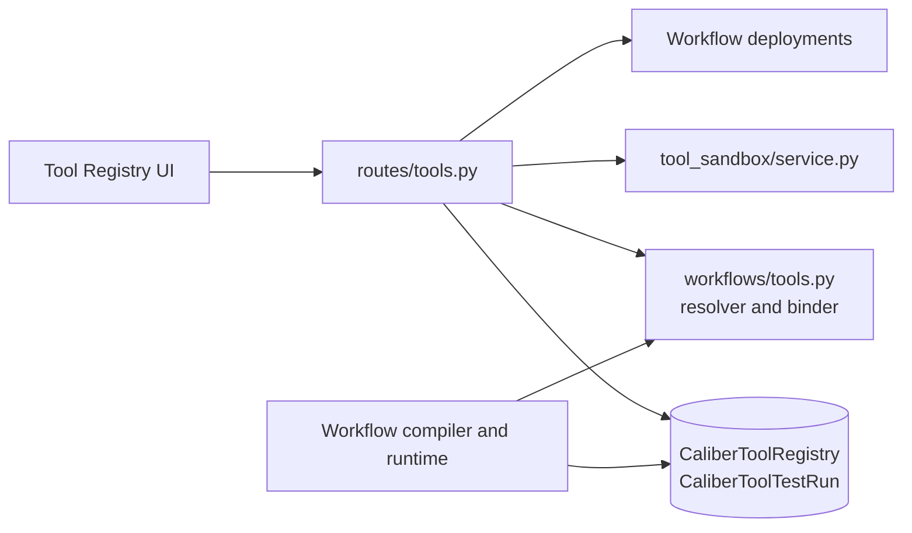
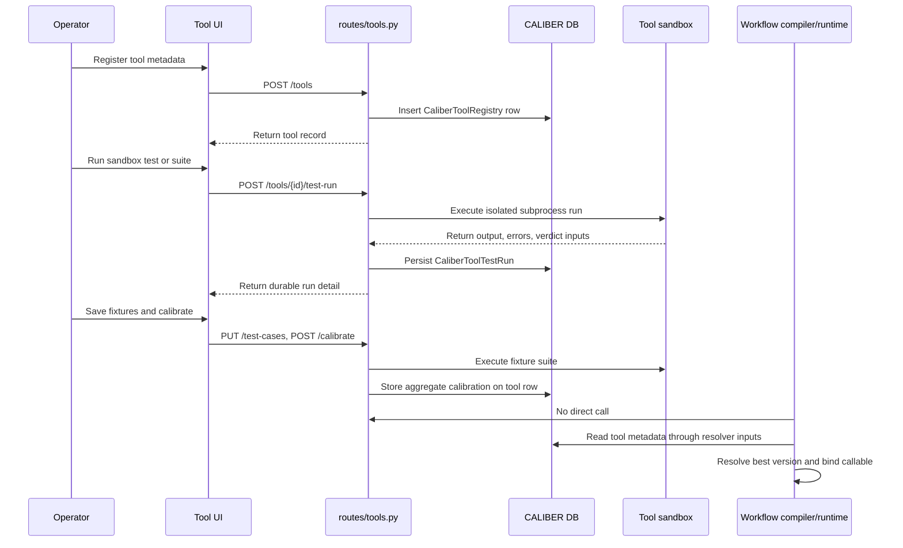

# Tools Architecture

## At a glance

| Dimension | Tools registry and execution boundary |
| --- | --- |
| **What it is** | CALIBER's registry and validation surface for versioned, callable runtime tools, referenced by family and version rather than inline code. |
| **Where state lives** | `CaliberToolRegistry` (tool rows) and `CaliberToolTestRun` (durable test-run history). |
| **Key surfaces** | HTTP routes in `routes/tools.py` under `/ajax-api/2.0/mlflow/caliber`; UI via `ToolRegistry.tsx`, `ToolWizard.tsx`, and `ToolDetail.tsx`. |
| **Runtime model** | Metadata-driven resolution first, import-driven binding second; the compiler reasons about tools without loading their code. |
| **Trust / safety** | Operator-supplied source runs only through the sandbox or controlled workflow binding; `admin` scope for registration/archive, `operator` for baselines/calibration. |
| **Isolation** | `LocalSubprocessToolSandbox` runs code under `python -I` in a temporary directory with an empty environment, clipped output, and a hard timeout. |
| **Calibration** | Tools are tested and calibrated against saved fixtures in isolation; lifecycle advances `Draft` → `Has fixtures` → `Tested` → `Hardened` → `Published`. |

The sections below start from this picture and drill down into detail, beginning
with the module's scope and responsibilities.

## Reference

## 1. Scope and responsibilities

The tools module is CALIBER's registry and validation surface for callable
runtime tools. Workflow designers reference registered tools by family and
version constraint rather than embedding source code directly in workflow
manifests, which keeps tool identity stable and independent of any single
workflow.

The module carries the following responsibilities. It registers, inspects,
updates, archives, and baselines versioned tools. It exposes source reflection
and test-run history for registered tools. It runs sandboxed single-invoke and
suite-based tool tests. It calibrates tools against saved fixtures and aggregates
the result. And it provides registry metadata to workflow compilation and runtime
binding.

These responsibilities are realized across a small set of primary code paths:

- `caliber/src/caliber/routes/tools.py`
- `caliber/src/caliber/workflows/tools.py`
- `caliber/src/caliber/tool_sandbox/service.py`
- `caliber/src/caliber/workflows/sandbox.py`
- `caliber/caliber-ui/src/pages/ToolRegistry.tsx`
- `caliber/caliber-ui/src/pages/ToolWizard.tsx`
- `caliber/caliber-ui/src/pages/ToolDetail.tsx`

## 2. Module boundaries

Tools are the product's principal code-execution surface, so the module draws a
firm line between describing a tool and running one. The table below assigns each
responsibility to its owner.

| Responsibility | Owner | Notes |
| --- | --- | --- |
| Tool metadata registry | `CaliberToolRegistry` | Versioned, project-scoped registry rows and lifecycle metadata. |
| Tool resolution by family/version | `workflows/tools.py` | Metadata-only resolution used by compiler and validation. |
| Callable import/binding | `workflows/tools.py` | Imports the resolved Python callable for runtime use. |
| Request-path testing and calibration | `routes/tools.py` | API surface for testing, fixtures, calibration, baselines, and archive protection. |
| Execution isolation | `tool_sandbox/service.py` | Runs user-authored tool code in a short-lived subprocess with timeout and clipped output. |
| Workflow runtime preview behavior | `workflows/sandbox.py` | Applies preview-mode restrictions and mocking for non-preview-safe tools. |

The boundaries reduce to a single design split. On one side are registry
concerns: identity, versioning, lifecycle, and test history. On the other are
execution concerns: import and bind, preview safety, and isolated testing.
Holding these apart is what lets the compiler reason about tools cheaply without
ever importing their code.

## 3. Runtime architecture

At runtime the request path and the workflow path both lead to the same registry,
but they touch it differently: the API drives testing and lifecycle, while the
workflow compiler and runtime resolve and bind tools. The diagram shows both
paths.



```legend
```

Several structural properties follow from this layout. Tools are versioned
registry entries rather than ad hoc code blobs embedded in workflow manifests.
Tool resolution is metadata-driven first and import-driven second, so most
reasoning happens without loading code. Archive protection checks live
deployments before allowing lifecycle changes, preventing in-use tools from
disappearing. And testing and calibration happen against the registered tool
artifact, not against workflow graphs, which keeps tool quality measurable in
isolation.

## 4. Data model and state

Tool state lives in two durable tables, with a third pair of tables consulted to
protect tools that are still in use. The table summarizes their roles.

| Table | Role |
| --- | --- |
| `CaliberToolRegistry` | Canonical tool registry row including version, callable location, schemas, safety metadata, fixtures, calibration summary, and pinned baseline. |
| `CaliberToolTestRun` | Durable test-run history for sandbox, suite, and hardening runs. |
| `CaliberWorkflowDeployment` and `CaliberWorkflowVersion` | Referenced during archive protection and usage analysis so in-use tool families cannot be removed unsafely. |

The `CaliberToolRegistry` row carries the fields that define a tool and govern how
it may be run. The `name` and `version` fields establish stable family and version
identity. The `module_path` and `callable_name` fields locate the Python import
target. The `input_schema` and `output_schema` fields fix the typed invocation
contract. The `side_effect_level`, `requires_approval`, and `allow_in_preview`
fields capture runtime safety. The `secret_refs` field provides secret
indirection rather than literal secrets. The `test_cases` field holds the saved
fixture suite. The `last_calibration` field records the latest aggregate scored
result. And `baseline_run_id` pins the comparison baseline used for workspace
diffs.

As with the other asset modules, lifecycle state is derived from both registry
status and historical evidence rather than stored as one column, and it advances
through the stages `Draft`, `Has fixtures`, `Tested`, `Hardened`, and
`Published`.

A tool family is the set of registry rows sharing a `name`, each a distinct
`version` (the pair is unique). Tools have no live alias to promote or roll back,
so the family's history is a read-only inventory: `GET /tools/{tool_id}/versions`
returns every version in the family, scoped by visibility so it never leaks
another project's versions, and ordered newest-first with a version-aware sort
(so `9` precedes `10` and `1.9` precedes `1.10`, not the lexical order a raw
string column would give).

## 5. API and interaction surfaces

All HTTP routes in this module are mounted under
`/ajax-api/2.0/mlflow/caliber` and are shown relative to that prefix below. The
surface in `routes/tools.py` groups into three areas.

The first area covers core registry management, including the archive-protected
lifecycle and usage analysis:

- `GET /tools`
- `POST /tools`
- `GET /tools/{tool_id}`
- `PATCH /tools/{tool_id}`
- `POST /tools/{tool_id}/archive`
- `GET /tools/{tool_id}/source`
- `GET /tools/{tool_id}/usage`
- `GET /tools/{tool_id}/versions`

The second area covers testing and calibration against the sandbox and fixtures:

- `POST /tools/{tool_id}/test-run`
- `PUT /tools/{tool_id}/test-cases`
- `POST /tools/{tool_id}/calibrate`
- `POST /tools/test-runs`
- `GET /tools/test-runs`
- `GET /tools/test-runs/{test_run_id}`

The third area exposes workspace metadata:

- `GET /tools/{tool_id}/workspace`
- `POST /tools/{tool_id}/baseline`

The frontend reaches these endpoints through three entry points:

- `caliber/caliber-ui/src/pages/ToolRegistry.tsx`
- `caliber/caliber-ui/src/pages/ToolWizard.tsx`
- `caliber/caliber-ui/src/pages/ToolDetail.tsx`

## 6. Execution lifecycle

The endpoints above support three recurring flows: registering a tool, testing it
in the sandbox, and calibrating it against fixtures. A fourth path, in which the
workflow compiler and runtime consume the registry without an API call, runs
alongside them. The sequence diagram traces all four.



The runtime rules that govern these flows reinforce the registry/execution split.
The module in `routes/tools.py` reflects source code for inspection but never
executes it inline in the request process. The `LocalSubprocessToolSandbox` runs
the code under `python -I` inside a temporary directory, with an empty
environment, clipped output, and a hard timeout. Workflow compilation resolves
tool references without importing the callable. And the workflow runtime binds and
imports only the resolved tool version that has already passed resolution and
safety checks.

## 7. Security and trust boundaries

Controls in this module are explicit because tools are the main code-execution
surface in the product, and they are layered across scopes, secrets, preview
policy, archival, and isolation. The enforced controls are the following.
Registration and archive actions require `admin` scope. Workspace baseline changes
and calibration require `operator` scope. Secret material is never stored on the
row, only `secret_refs`. Preview safety is encoded on the tool row and enforced in
the runtime preview paths. Archive is blocked while any active workflow deployment
still references the tool family, regardless of alias and not limited to `prod`.
And testing executes within a subprocess boundary, never inside the request
handler.

These controls converge on one trust boundary. The registry accepts
operator-supplied Python source metadata, but the runtime executes that code only
through the sandbox or controlled workflow binding, and source reflection is
best-effort and read-only. Authoring a tool, in other words, is not the same as
being allowed to run arbitrary code in the request process.

## 8. Observability and operations

The module surfaces enough signal to evaluate, compare, and debug tools over
time. The operational signals it exposes are the following. Durable
`CaliberToolTestRun` history is recorded for every major testing surface. Pinned
baseline support enables run comparisons in the workspace. A lifecycle summary is
computed from fixtures, test history, calibration, and registry status.
Source-code introspection and signature reflection are available for debugging.
And usage inspection runs against workflow versions and deployments.

To keep history listings fast, the module separates heavy payloads from cheap
summaries:

- full per-case result arrays stay in `results`;
- counters and aggregate scores are materialized for fast history listing.

## 9. Extension points and current constraints

The module has clear seams for growth alongside constraints that reflect its
current implementation.

The primary extension points are the following. New test-run kinds or richer
calibration assertions can be added. Preview policies and approval semantics can
be strengthened. Additional tool resolvers or registry backends can be introduced
if the database registry is ever abstracted. And sandbox isolation can be
hardened with containers or virtual machines.

The current constraints are the following. The default sandbox is still local
subprocess isolation, which is suitable for development and CI but is not a
hardened multi-tenant isolation boundary. Workflow manifests reference tool
families and version constraints, so usage analysis is dependency-aware rather
than row-id direct. Tool registration relies on importable Python modules being
available in the CALIBER runtime environment. And no workflow designer ever
authors tool code inline in manifests, by design.

The tools module is therefore both a catalog and an execution boundary. Its value
is not merely storing tool metadata, but making tool use testable, auditable,
preview-safe, and version-resolved for the workflow runtime.
