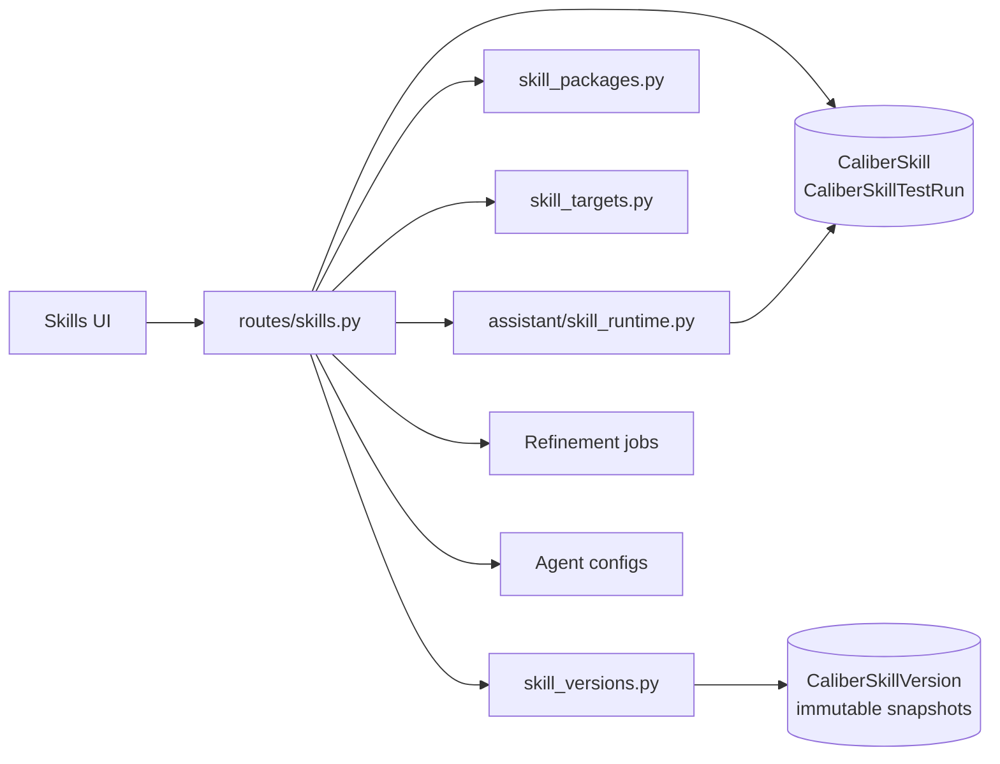

<!-- Generated by docs-site/build-docs.mjs from docs/04-skills/architecture.md. Do not edit this file: edit the source and re-run the build (caliber/caliber-ui: npm run sync:docs). -->


# Skills Architecture

## At a glance

| Dimension | Skills module orientation |
| --- | --- |
| **What it is** | A registry of reusable, versioned instruction assets composed into agents and assistant turns — lighter than a prompt or workflow. |
| **Where state lives** | The mutable current value lives in `CaliberSkill`; immutable content/summary snapshots live in `CaliberSkillVersion`; `CaliberSkillTestRun` holds run evidence; hidden `CaliberAgentConfig` targets are keyed `skill::{name}`. |
| **Key surfaces** | HTTP routes in `routes/skills.py` under `/ajax-api/2.0/mlflow/caliber`; UI via `Skills.tsx`, `SkillWizard.tsx`, `SkillDetail.tsx`. |
| **Runtime model** | The assistant selects skills `auto`/`manual`/`off` via `assistant/skill_runtime.py`, reading `CaliberSkill` rows directly. |
| **Trust / safety** | Skills are prompt material, not code; reserved prefixes rejected, direct ZIP import is bounded, and deterministic selection reports positive and negative matched signals. |
| **Calibration** | Reuses the shared refinement pipeline via `CaliberVerificationItem` and `CaliberRefinementJob`, with no user-managed host agent. |

The sections below start from this picture and drill down into the responsibilities, boundaries, data model, surfaces, and lifecycle in detail.

## Reference

## 1. Scope and responsibilities

The skills module manages reusable prompt fragments that can be composed into
agents and assistant turns. A skill is a structured instruction asset rather than
a full executable artifact like a workflow or a tool; what makes it a first-class
asset is the testing, packaging, selection, and calibration behavior built around
it.

The module carries the following responsibilities. It stores versioned skill rows
with progressive-disclosure fields, so that a short description and a full body
serve different stages of activation. It tests both skill render behavior and the
deterministic auto-selection behavior that decides when a skill applies. It
packages and imports skills using an OpenAI-compatible folder or ZIP format. The
Skill detail UI uploads ZIPs directly and requires an explicit reject, rename,
or admin-only versioned-merge conflict strategy. Archive/member bounds and
traversal, symlink, encryption, and binary-content checks run before
persistence. It exposes
workspace state, baseline pinning, bind targets, and lifecycle. It calibrates
skills through the shared refinement pipeline without requiring a user-managed
host agent. And it provides skill selection inputs to the assistant runtime.

These responsibilities are realized across a small set of primary code paths:

- `caliber/src/caliber/routes/skills.py`
- `caliber/src/caliber/skill_versions.py`
- `caliber/src/caliber/skill_packages.py`
- `caliber/src/caliber/skill_targets.py`
- `caliber/src/caliber/assistant/skill_runtime.py`
- `caliber/caliber-ui/src/pages/Skills.tsx`
- `caliber/caliber-ui/src/pages/SkillWizard.tsx`
- `caliber/caliber-ui/src/pages/SkillDetail.tsx`

## 2. Module boundaries

Skills span both authoring-time registry concerns and assistant-runtime selection
concerns, so each responsibility has a distinct owner. The table below maps them.

| Responsibility | Owner | Notes |
| --- | --- | --- |
| Skill registry | `CaliberSkill` | Canonical row storing summary, content, metadata, dependencies, and tags. |
| Immutable version history | `CaliberSkillVersion`, coordinated by `skill_versions.py` | One content/summary snapshot per version; edits and refinement Apply share the same transactional helpers, and rollback restores an older snapshot as a new forward-only version. |
| Packaging/import | `skill_packages.py` | Maps DB rows to/from OpenAI-style packages and validates direct ZIP uploads before conflict handling. |
| Auto-selection scoring | `assistant/skill_runtime.py` | Deterministic scorer with explicit positive boosts and stopword-aware negative exclusions; test results expose matched signals. |
| Hidden runtime identity | `skill_targets.py` | Auto-provisions `skill::{name}` agent identities for testing and calibration. |
| Skill test history | `CaliberSkillTestRun` | Durable render/selection/scenario run history. |
| Calibration queueing | `CaliberVerificationItem`, `CaliberRefinementJob` | Shared refinement path reused from prompts and workflows. |

The unifying observation is that the skill module sits across two worlds at once:
the authoring-time registry that defines what a skill is, and the
assistant-runtime selection logic that decides when a skill is used. Everything
below elaborates on how those two halves are kept consistent.

## 3. Runtime architecture

At runtime the route module coordinates the registry, packaging, hidden targets,
the refinement pipeline, and the assistant runtime, which itself reads skill rows
directly. The diagram traces those relationships.



```legend
```

Several structural properties distinguish skills from the other asset modules.
Skill rows are first-class database artifacts, unlike prompts, which are
MLflow-registry-backed. The assistant runtime needs no separate skill catalog
because it reads ordinary `CaliberSkill` rows directly. Testing and calibration
rely on hidden host identities, so skills behave like independently testable units
without polluting the visible agent inventory. And package import and export form
an interoperability layer, not a second source of truth that could drift from the
canonical rows.

## 4. Data model and state

Skill state is anchored in a single canonical row and supported by a small set of
companion carriers for history, runtime identity, and calibration. The table
summarizes each.

| State | Storage | Purpose |
| --- | --- | --- |
| Skill row | `CaliberSkill` | Canonical artifact with summary, content, category, tags, dependencies, and metadata. |
| Version history | `CaliberSkillVersion` | Immutable content-and-summary snapshots keyed by `(skill_id, version_number)` for listing, diff, conflict-safe forward history, and rollback-as-a-new-version. |
| Durable test history | `CaliberSkillTestRun` | Render, selection, and scenario run results with scores and optional host identity. |
| Hidden runtime target | `CaliberAgentConfig` keyed by `skill::{name}` | Provides an `agent_id` for jobs, traces, baselines, and workspace state. |
| Calibration queue | `CaliberVerificationItem`, `CaliberRefinementJob` | Shared refinement pipeline entry point for skill calibration. |

The `CaliberSkill` row encodes the progressive-disclosure model that defines a
skill. The `summary` is the always-available level-1 description used to decide
when the skill should activate. The `content` is the full instruction body,
loaded only once the skill is actually selected. The `allowed_tools` and
`depends_on` fields express composition and execution guidance. And `status` is
soft-delete oriented, taking the values `active` or `archived` rather than
hard-deleting by default.

Although the canonical skill is a single mutable row, its history is real: every
version-bumping API edit and refinement Apply snapshots the skill into
`CaliberSkillVersion` — one
immutable row per `(skill_id, version_number)` — which is what the version panel
lists, diffs, and rolls back against. Both the `content` and the level-1
`summary` are part of that snapshot, so an edit to either bumps the version and
is recoverable (a summary-only edit is versioned, not silently dropped from
history), while a tags/owner/description tweak — not part of the snapshot — does
not bump. `GET /skills/{skill_id}/versions` lists the history and
`POST /skills/{skill_id}/rollback` restores an earlier snapshot as a new version
(the version counter is forward-only; 409 when there is no prior version to
restore). Two edits that race the same version number resolve to a retryable
`409` rather than a `500`, so the version table never grows a duplicate.
The Skills API and `SkillPromoter` both use `skill_versions.py` in the caller's
database transaction, so updating the live row, recording its immutable history,
and writing the surrounding audit/checkpoint state succeed or roll back together.

## 5. API and interaction surfaces

All HTTP routes in this module are mounted under
`/ajax-api/2.0/mlflow/caliber` and are shown relative to that prefix below. The
surface in `routes/skills.py` divides cleanly into four areas that mirror the
skill lifecycle.

The first area covers registry and lifecycle operations on the canonical row:

- `GET /skills`
- `POST /skills`
- `GET /skills/{skill_id}`
- `PATCH /skills/{skill_id}`
- `GET /skills/{skill_id}/versions`
- `POST /skills/{skill_id}/rollback`

The second area handles packaging in the OpenAI-compatible format:

- `POST /skills/import-package`
- `GET /skills/{skill_id}/package`
- `GET /skills/{skill_id}/package.zip`

The third area covers testing and durable run history:

- `POST /skills/{skill_id}/test-render`
- `POST /skills/{skill_id}/test-selection`
- `POST /skills/test-runs`
- `GET /skills/test-runs`
- `GET /skills/test-runs/{test_run_id}`

The fourth area manages workspace state and calibration:

- `GET /skills/{skill_id}/workspace`
- `POST /skills/{skill_id}/baseline`
- `POST /skills/{skill_id}/bind`
- `POST /skills/{skill_id}/calibrate`

The frontend reaches these endpoints through three entry points:

- `caliber/caliber-ui/src/pages/Skills.tsx`
- `caliber/caliber-ui/src/pages/SkillWizard.tsx`
- `caliber/caliber-ui/src/pages/SkillDetail.tsx`

## 6. Execution lifecycle

The endpoints above drive three recurring flows: authoring a skill, testing its
selection or render behavior, and calibrating it. The sequence diagram follows
each.

```mermaid
sequenceDiagram
    participant U as Operator
    participant UI as Skills UI
    participant API as routes/skills.py
    participant DB as CALIBER DB
    participant TGT as Hidden skill target
    participant AR as assistant/skill_runtime.py
    participant Q as Refinement pipeline

    U->>UI: Create or edit skill
    UI->>API: POST or PATCH /skills
    API->>DB: Persist CaliberSkill; snapshot versioned payload when changed
    API-->>UI: Return skill record

    U->>UI: Test selection or render
    UI->>API: POST /test-render or /test-selection
    API->>AR: Score or render against current skill row
    API->>DB: Persist optional durable test run
    API-->>UI: Return result

    U->>UI: Calibrate skill
    UI->>API: POST /skills/{id}/calibrate
    API->>TGT: Ensure skill::{name} runtime target
    API->>DB: Insert verification item and refinement job
    API-->>UI: Return queued job metadata
    Q->>DB: Process refinement job against hidden target agent_id
```

These flows obey a few lifecycle rules. The module in `skill_targets.py` creates
a hidden `CaliberAgentConfig` row keyed on `skill::{skill_name}`, which lets
skills reuse the shared job and trace machinery without appearing in the agent
inventory. The skill workspace status is not stored as a single field but derived
from several signals:

- whether the skill is bound;
- whether a calibration job was applied;
- whether it has durable test runs;
- whether it has scenario evidence.

Finally, the assistant runtime can select skills in `auto`, `manual`, or `off`
mode using `assistant/skill_runtime.py`, giving operators explicit control over
how aggressively skills are applied.

## 7. Security and trust boundaries

Skills are instruction material, not code, and the module's controls are designed
to keep them that way. The enforced controls are the following. Reserved
skill-name prefixes such as `claude`, `anthropic`, and other schema-level reserved
values are rejected. XML-like angle brackets are rejected in a skill's
`description` and `summary` fields for instruction-safety hardening; the long-form
`content` body is deliberately not bracket-filtered, since legitimate instructions
may contain such characters. There is no hard delete in the normal operator
surface. Mutating actions are guarded by operator and admin scopes. And package
import validation checks the canonical generated files and the allowed bundled
resource directories.

These controls rest on one important trust boundary: skill content is prompt
material, not code. Packaging and import form a structured content-interchange
path, not a code-execution path. And assistant auto-selection is deterministic
and database-backed rather than model-decided, which keeps selection auditable.

## 8. Observability and operations

The module is built to be inspectable, exposing enough signal to understand both
what a skill is and why it was selected. Its operational characteristics include
the following. Durable test-run kinds distinguish `render`, `selection`, and
`scenario` behavior. Workspace state exposes the baseline, the latest run, the
bind target, and the lifecycle. Assistant skill selection stores selected-skill
metadata in session metadata for later inspection. And built-in skill seeding can
be enabled at runtime through config.

The assistant skill runtime is intentionally deterministic in the current design,
applying a fixed priority order:

- explicit skills win first;
- pinned skills are added next;
- active skills are scored using a small text scorer;
- dependency expansion is bounded by depth and content budgets.

This ordering keeps the skill layer inspectable and testable rather than
heuristic-only, which is what allows selection behavior to be tested as a unit.

## 9. Extension points and current constraints

The module has clear seams for growth alongside a set of constraints that reflect
its current design.

The primary extension points are the following. Selection scoring and metadata in
`assistant/skill_runtime.py` can be made richer. Package metadata import and
export can be broadened for wider compatibility. Workflow-node binding can be
improved to rewrite manifests directly. And scenarios can be given dedicated
storage instead of being inferred from durable runs.

The current constraints are the counterparts of those seams. The scenario concept
has no standalone store yet. Workflow-node binding records durable intent but does
not fully rewrite manifests in place. Hidden host targets are an implementation
device and must continue to stay out of normal agent inventory views. And skill
calibration reuses the generic refinement system rather than a skill-specific
optimizer runtime.

In sum, the skills module is the bridge between reusable instruction assets and
concrete runtime behavior. It packages, tests, selects, and calibrates skills
while keeping them lightweight compared with full prompts or workflows.
