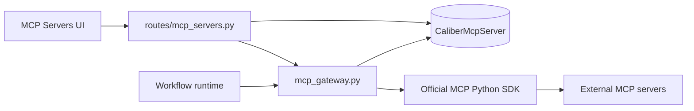
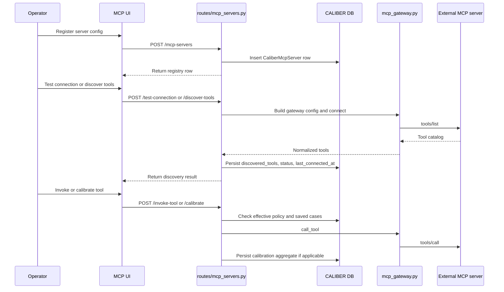

# MCP Architecture

## At a glance

| Dimension | MCP integration layer |
| --- | --- |
| **What it is** | A mediated layer that turns external MCP servers into governed, inspectable CALIBER runtime dependencies. |
| **Where state lives** | A single `CaliberMcpServer` row carries connection metadata, `discovered_tools`, `tool_policies`, `tool_test_cases`, and `tool_calibrations`. |
| **Key surfaces** | Routes under `/ajax-api/2.0/mlflow/caliber` (`routes/mcp_servers.py`), the `McpServers.tsx` UI, and the `mcp_gateway.py` transport gateway. |
| **Runtime model** | One gateway serves both operator tooling and the workflow runtime; invoke and calibrate share the `_invoke_mcp_tool()` path over stdio, SSE, and streamable HTTP. |
| **Trust / safety** | Boundary-crossing operations require the `admin` scope; policy overlays can block tools, and invocation runs under bounded timeouts. |
| **Calibration** | Saved per-tool test cases and calibration summaries are CALIBER-local overlays kept on the server row, distinct from the remote tool implementation. |

The sections below start from this picture and drill down into the scope, boundaries, data model, APIs, lifecycle, and trust posture in detail.

## Reference

## 1. Scope and responsibilities

The MCP module integrates external Model Context Protocol (MCP) servers into
CALIBER. It treats those servers as operator-managed runtime dependencies whose
tools can be discovered, policy-controlled, tested, calibrated, and invoked from
both the user interface and the workflow runtime. The module's purpose is to
make a remote, externally owned tool surface behave like a governed, inspectable
part of the CALIBER control plane.

From that purpose follow the module's responsibilities. It registers and
maintains MCP server connection metadata; it speaks the MCP transports through a
shared gateway layer; it discovers and caches the remote tool inventory of each
server; it maintains the per-tool policy, the saved test cases, and the
calibration results that CALIBER layers on top of those tools; it exposes
one-off invocation and test-connection APIs for operators; and it provides
synchronous invocation helpers that the workflow runtime binds against.

This work is carried by the following primary code paths, spanning the route
layer, the transport gateway, the registry model, the bundled first-party
server, and the front end:

- `caliber/src/caliber/routes/mcp_servers.py`
- `caliber/src/caliber/mcp_gateway.py`
- `caliber/src/caliber/db/models.py` (`CaliberMcpServer`)
- `caliber/src/caliber/mcp_servers/db/*`
- `caliber/caliber-ui/src/pages/McpServers.tsx`

## 2. Module boundaries

The module keeps persistence, transport, and runtime invocation in separate
hands so that none of them has to reimplement the others. The table below
records the owners:

| Responsibility | Owner | Notes |
| --- | --- | --- |
| Server registry and policy storage | `CaliberMcpServer` | Canonical connection metadata, discovered tools, policies, test cases, and calibrations. |
| Transport execution | `mcp_gateway.py` | Uses the official `mcp` Python SDK for stdio, SSE, and streamable HTTP. |
| Operator CRUD and discovery | `routes/mcp_servers.py` | API surface for registry management, discovery, testing, and playground use. |
| Runtime workflow invocation | `workflows/runtime.py` via sync gateway wrappers | Workflow execution can call MCP tools without reimplementing transport logic. |
| Bundled first-party MCP server | `mcp_servers/db/*` | A CALIBER-hosted MCP server exposing relational (SQL), vector (pgvector), and graph (Apache AGE / openCypher) tools; runnable via `python -m caliber.mcp_servers.db --mode <relational\|vector\|graph>`. |

This split is explicit and intentional. The routes own persistence and policy
enforcement; the gateway owns the network and transport mechanics; and the
workflow runtime reaches MCP tools only through sync wrappers, so that the same
tools are callable from the synchronous interpreter path without that path ever
touching transport details directly.

## 3. Runtime architecture

The diagram below shows how those owners connect. Operator actions flow from the
UI through the routes to the registry and the gateway, while the workflow
runtime reaches the same gateway directly. The gateway, in turn, drives the
official SDK out to the external servers.



```legend
```

A few structural properties make this layout work. The same gateway code path
serves both operator tooling and workflow runtime invocation, so transport
behavior cannot drift between the two. Discovered tool metadata is cached on the
`CaliberMcpServer` row rather than fetched on every UI render, which keeps the
interface responsive and avoids hammering remote servers. Policies are
CALIBER-local overlays that sit on top of the remotely discovered tools rather
than properties of the remote server itself. And the gateway can either
bootstrap a server's configuration from its DB row or accept an already-loaded
configuration object, so both stored servers and transient ones run through one
implementation.

## 4. Data model and state

All of this state lives on a single carrier, the `CaliberMcpServer` row, whose
fields divide cleanly by purpose:

| Field group | Purpose |
| --- | --- |
| `name`, `transport`, `uri`, `command`, `args` | Transport identity and connection shape. |
| `env`, `headers`, `auth_type`, `auth_config` | Credential and transport parameterization. |
| `discovered_tools` | Cached remote tool inventory from `tools/list`. |
| `tool_policies` | CALIBER-local execution policy overlay keyed by tool name. |
| `tool_test_cases` | Saved per-tool calibration fixtures. |
| `tool_calibrations` | Latest aggregate calibration results per tool. |
| `status`, `last_connected_at`, `connection_error` | Connection health and operator feedback. |

This division reflects a clear ownership split. Remote servers remain
authoritative for the live tool implementation, so CALIBER never pretends to
define what a tool does. CALIBER, in turn, becomes authoritative for the local
policy, the test fixtures, and the calibration summaries it maintains over those
tools. Because discovery is explicit and cached rather than continuous, the UI
stays fast and the system avoids paying repeated transport overhead on every
page load.

## 5. API and interaction surfaces

The module's HTTP surface mirrors the lifecycle of a managed server. All routes
are mounted under `/ajax-api/2.0/mlflow/caliber` and are shown relative to that
prefix throughout.

Registry management covers the create, read, update, and delete operations over
server records:

- `GET /mcp-servers`
- `POST /mcp-servers`
- `GET /mcp-servers/{server_id}`
- `PATCH /mcp-servers/{server_id}`
- `DELETE /mcp-servers/{server_id}` — guarded: returns 409 when the server is
  still referenced by an active deployment, and snapshots the full server
  definition into the delete audit row so it can be recreated.

Transport validation and discovery exercise the real connection: testing it,
refreshing the cached tool inventory, and reading that inventory back:

- `POST /mcp-servers/{server_id}/test-connection`
- `POST /mcp-servers/{server_id}/discover-tools`
- `GET /mcp-servers/{server_id}/tools`

Per-tool policy and validation manage the CALIBER-local overlay for an
individual tool, including its policy, its saved test cases, and its calibration:

- `PATCH /mcp-servers/{server_id}/tools/{tool_name}/policy`
- `PUT /mcp-servers/{server_id}/tools/{tool_name}/test-cases`
- `POST /mcp-servers/{server_id}/tools/{tool_name}/calibrate`

Playground invocation supports a single ad hoc tool call for inspection and
experimentation:

- `POST /mcp-servers/{server_id}/invoke-tool`

The front-end entry point that drives all of the above is:

- `caliber/caliber-ui/src/pages/McpServers.tsx`

## 6. Execution lifecycle

The endpoints above combine into a typical operator session: register a server,
validate it and discover its tools, then invoke or calibrate those tools. The
sequence below traces that path through the routes, the registry, the gateway,
and the external server.



A handful of runtime rules govern that flow. A connection test validates the
minimal configuration first and only then performs a real `tools/list` round
trip, so misconfiguration is caught before any network cost is paid. Invocation
and calibration both run through the same `_invoke_mcp_tool()` path, which keeps
the known-tool checks, the policy checks, the timeouts, and the gateway behavior
consistent regardless of which entry point triggered the call. And the workflow
runtime reaches tools through the sync wrappers in `mcp_gateway.py`, so the
synchronous interpreter never has to duplicate transport logic of its own.

## 7. Security and trust boundaries

Because every operation in this module can reach out to an externally owned
server, access control is weighted toward the operations that cross that
boundary. The following controls apply:

- Server registration and mutation — create, update, and delete — require the
  `admin` scope.
- Connection tests, tool discovery, tool-policy updates, and direct tool
  invocation also require the `admin` scope; because each of these reaches out
  to the remote server, they are deliberately treated as the
  highest-privilege operations.
- Only the saved test cases and calibration endpoints are `operator`-scoped.
- Policy overlays can explicitly block a remote tool even when the remote server
  still advertises it.
- Deletion is not an unguarded hard delete: it is refused with 409 while an
  active deployment still references the server, and the full server definition
  is snapshotted into the delete audit row so the record is recoverable.
- Tool invocation runs under bounded timeouts.
- Connection configuration is validated against transport-specific minimums
  before use.

These controls express a specific trust posture. CALIBER trusts the operator to
register the correct server endpoint, but not to bypass the policy checks that
sit in front of it. Remote MCP servers are external execution dependencies that
may fail or return tool errors, and the module is built to surface those
outcomes rather than mask them. CALIBER owns the connection health reporting,
the cached inventory, and the local tool policy, but it never owns the remote
tool implementation itself.

## 8. Observability and operations

The module reports its health and behavior through a compact set of signals that
operators can read directly:

- The `status`, `last_connected_at`, and `connection_error` fields on the server
  row.
- The cached discovered tool catalog, which gives the UI a stable view to
  render.
- The per-tool effective policy returned by `GET /tools`.
- The calibration summaries stored on the server row.
- The invocation duration and gateway error text returned to the caller.

Underneath those signals, the gateway is designed to be reusable and guarded. It
supports stdio, SSE, and streamable HTTP transports through one implementation.
It exposes async APIs alongside sync wrappers for callers that run outside an
event loop, notably the workflow runtime. And it can resolve the `${PYTHON}`
sentinel for first-party Python MCP servers, so that those servers launch under
the same interpreter as CALIBER rather than relying on whatever `python` happens
to be on the path.

## 9. Extension points and current constraints

The module is built to extend along clear lines. Its primary extension points
are:

- Adding more curated server presets in the MCP UI.
- Adding richer auth-type handling and secret-source indirection.
- Expanding policy semantics beyond allow/deny and side-effect metadata.
- Adding first-party MCP servers under `mcp_servers/*`.

Those seams come with constraints worth keeping in mind. Discovery is cached, so
the tool inventory can become stale until it is explicitly refreshed. Policy is
local to CALIBER and is not negotiated with the remote server. Workflow runtime
invocation is synchronous from the interpreter's perspective even though the
underlying transport is async. And the quality and safety of a remote server are
ultimately outside CALIBER's control.

In sum, the MCP module is a mediated integration layer. It turns external MCP
servers into policy-controlled, inspectable CALIBER runtime dependencies without
scattering transport logic throughout the codebase.
