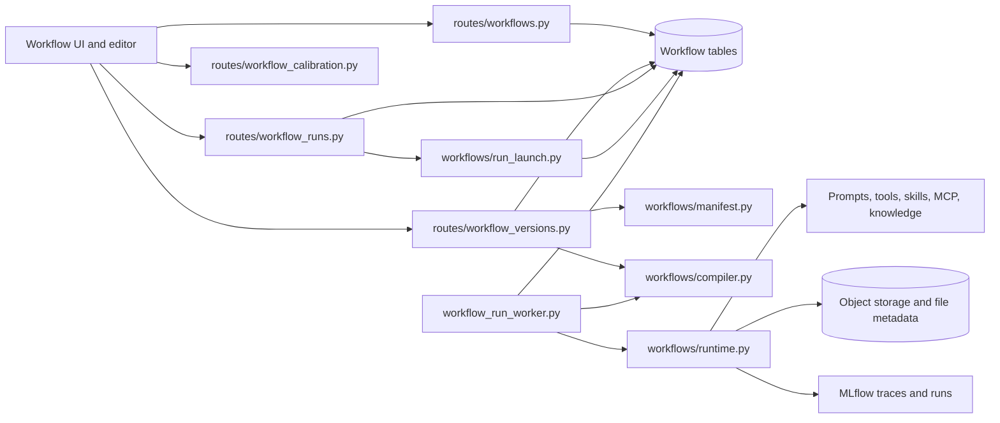
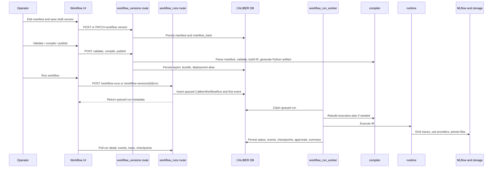

<!-- Generated by docs-site/build-docs.mjs from docs/06-workflows/architecture.md. Do not edit this file: edit the source and re-run the build (caliber/caliber-ui: npm run sync:docs). -->

# Workflows Architecture

## At a glance

| Dimension                   | Workflows module                                                                                                                                                                        |
| --------------------------- | --------------------------------------------------------------------------------------------------------------------------------------------------------------------------------------- |
| **What it is**        | CALIBER's execution backbone — authoring, deterministic compilation, and durable runtime for agent workflows.                                                                          |
| **Source of truth**   | The workflow graph as a manifest (`workflows/manifest.py`), from which every downstream step derives.                                                                                 |
| **Runtime model**     | The interpreter (`workflows/runtime.py`) executes the IR directly via a background worker (`orchestrator/workflow_run_worker.py`); generated Python is export/review material only. |
| **Where state lives** | Authoring records (`CaliberWorkflowVersion`, `CaliberWorkflowDeployment`) kept separate from runtime records (`CaliberWorkflowRun`, events, checkpoints, approvals).              |
| **Key surfaces**      | HTTP routes under`/ajax-api/2.0/mlflow/caliber` plus Workflow Studio (`Workflows.tsx`, `WorkflowEditor.tsx`).                                                                     |
| **Trust / safety**    | User-authored manifests are accepted as data, never executed directly; mutating endpoints require the`operator` scope; transitions validated via `run_state.py`.                    |
| **Calibration**       | `routes/workflow_calibration.py` enqueues workflow-specific calibration runs with dataset/judge gating.                                                                               |

The sections below start from this picture and drill down into the scope, boundaries, data model, APIs, lifecycle, and trust boundaries in detail.

## Reference

## 1. Scope and responsibilities

The workflows module is CALIBER's most complex bounded context, because it has
to reconcile three concerns that most subsystems keep apart: how an agent
workflow is authored, how it is compiled into something executable, and how it
actually runs over time. To do that, the module spans the logical workflow
inventory, the immutable and draft workflow versions and their deployment
aliases, manifest validation and deterministic compilation, both queued and
preview execution, and the full runtime surface of events, checkpoints,
approvals, lineage, files, and traces. It also carries the workflow calibration
and patch-generation machinery that lets operators measure and improve a
workflow after it ships.

From those concerns follow the module's concrete responsibilities. It stores the
workflow graph as a manifest that serves as the single source of truth; it
validates and compiles that manifest into typed intermediate representation (IR)
and generated review artifacts; it publishes deployment aliases that point at
compiled versions; it enqueues and executes workflow runs; it persists runtime
lineage, events, checkpoints, and approvals; and it exposes session memory and
benchmark reports for the operators who own a workflow.

The work is carried by the following primary code paths, spanning the route
layer, the core workflow engine, the background worker, and the Workflow Studio
front end:

- `caliber/src/caliber/routes/workflows.py`
- `caliber/src/caliber/routes/workflow_versions.py`
- `caliber/src/caliber/routes/workflow_runs.py`
- `caliber/src/caliber/routes/workflow_deployments.py`
- `caliber/src/caliber/routes/workflow_calibration.py`
- `caliber/src/caliber/workflows/manifest.py`
- `caliber/src/caliber/workflows/compiler.py`
- `caliber/src/caliber/workflows/runtime.py`
- `caliber/src/caliber/workflows/run_launch.py`
- `caliber/src/caliber/orchestrator/workflow_run_worker.py`
- `caliber/caliber-ui/src/pages/Workflows.tsx`
- `caliber/caliber-ui/src/pages/WorkflowEditor.tsx`
- `caliber/caliber-ui/src/pages/WorkflowVersionDetail.tsx`
- `caliber/caliber-ui/src/pages/WorkflowDetail.tsx`

For a developer-facing guide to the individual building blocks — component
anatomy, the typed port system, how to add/configure/connect/code/run nodes, and
a complete reference for every built-in component — see
[Workflow components](m-06-workflows-components.md).

## 2. Module boundaries

Each responsibility above maps to a clear owner, so that authoring, compilation,
and execution can evolve independently. The following table records who owns
what:

| Responsibility            | Owner                                                                                      | Notes                                                                                                        |
| ------------------------- | ------------------------------------------------------------------------------------------ | ------------------------------------------------------------------------------------------------------------ |
| Workflow inventory        | `routes/workflows.py`, `CaliberWorkflow`                                               | Logical workflow containers, dependency-preflighted import/clone-as-new, benchmark reports, session memory.  |
| Version lifecycle         | `routes/workflow_versions.py`, `CaliberWorkflowVersion`, `CaliberWorkflowDeployment` | Drafting, optimistic update, validate, compile, publish, export, preview, run.                               |
| Manifest schema           | `workflows/manifest.py`                                                                  | Source-of-truth typed schema and canonical hashing rules.                                                    |
| Deterministic compilation | `workflows/compiler.py`                                                                  | Manifest -> IR -> generated Python artifact and report.                                                      |
| Runtime interpreter       | `workflows/runtime.py`                                                                   | Executes the IR directly inside CALIBER. Generated Python is export/review material, not the execution path. |
| Queued execution          | `workflows/run_launch.py`, `orchestrator/workflow_run_worker.py`                       | Durable enqueue plus background worker claim/execute/heartbeat lifecycle.                                    |
| Run read/write API        | `routes/workflow_runs.py`                                                                | Create, lineage, manifest, events, trace, checkpoints, cancel, retry, approvals, resume.                     |
| Calibration               | `routes/workflow_calibration.py`                                                         | Workflow-specific calibration queue entry and dataset/judge gating.                                          |

These owners reflect a deliberate three-way split that recurs throughout the
rest of this document: authoring-time graph state is kept distinct from
compilation-time validation and IR generation, which in turn is kept distinct
from runtime queued execution and lineage persistence. Holding those phases
apart is what lets a workflow be edited, compiled, and replayed without one
phase corrupting the state of another.

## 3. Runtime architecture

The diagram below shows how those phases connect at runtime, from the Workflow
Studio front end down through the routes, the compiler and interpreter, and out
to MLflow, object storage, and the prompts, tools, skills, MCP servers, and
knowledge bases a workflow depends on.



```legend

```

Several structural properties hold this picture together. The manifest is the
source of truth for the workflow graph, so every downstream step derives from it
rather than from ad hoc state. Compilation is deterministic and free of side
effects beyond the generated artifacts and reports it is meant to produce, which
makes the same manifest compile to the same result every time. Execution is
durable and background-worker-driven through the queue rather than inline with
the request that started it. The runtime executes the IR directly instead of
running the exported Python module, keeping a single trusted execution path. And
run metadata, events, checkpoints, and the file inventory are all CALIBER-owned,
so observability does not depend on any external system being reachable.

## 4. Data model and state

The properties above are enforced by a relational model that separates authoring
records from runtime records. The primary entities are:

| Table                                                     | Role                                                                                     |
| --------------------------------------------------------- | ---------------------------------------------------------------------------------------- |
| `CaliberWorkflow`                                       | Logical workflow root and inventory record.                                              |
| `CaliberWorkflowVersion`                                | Draft or published immutable manifest version with validation and compilation artifacts. |
| `CaliberWorkflowDeployment`                             | Mutable alias pointer to an active version.                                              |
| `CaliberWorkflowRun`                                    | Queued/running/completed execution index row with summary and trace linkage.             |
| `CaliberWorkflowRunEvent`                               | Append-only runtime timeline.                                                            |
| `CaliberWorkflowRunCheckpoint`                          | Resume-capable state snapshots.                                                          |
| `CaliberRuntimeApprovalRequest`                         | In-run approval gates.                                                                   |
| `CaliberWorkflowFile` and `CaliberWorkflowFileEvent`  | File metadata and lifecycle independent of storage backend.                              |
| `CaliberWorkflowSessionMemory`                          | Durable session memory for workflow nodes.                                               |
| `CaliberWorkflowBenchmarkReport`                        | Product bakeoff scorecards.                                                              |
| `CaliberWorkflowPatch` and `CaliberWorkflowPromotion` | Patch proposals and publish lineage.                                                     |
| `CaliberWorkflowService`                                | Optional published HTTP service view over a workflow.                                    |

This shape carries several intentional consequences. Workflow authoring state and
runtime state are kept deliberately separate, so editing a workflow never
disturbs a run already in flight. The manifest snapshot is persisted per run,
which means replay and debugging survive later version churn even after the
source version has moved on. Events and checkpoints are append-oriented runtime
observability state rather than mere log output, so the timeline of a run can be
reconstructed faithfully. Finally, published versions are immutable by
convention while deployment aliases are the mutable switch point, which is what
lets a workflow be re-pointed to a new version without rewriting history.

## 5. API and interaction surfaces

The module exposes its capabilities over HTTP, grouped to match the lifecycle
phases described above. All routes are mounted under
`/ajax-api/2.0/mlflow/caliber` and are shown relative to that prefix throughout.

The first group supports the workflow inventory and the editor that lists,
creates, imports, and inspects workflows:

- `GET /workflows`
- `POST /workflows`
- `POST /workflows/import/preview`
- `POST /workflows/import`
- `GET /workflows/{workflow_id}`
- `PATCH /workflows/{workflow_id}`
- `DELETE /workflows/{workflow_id}`
- `GET /workflow-components`
- `GET /workflow-templates`
- `GET /workflows/{workflow_id}/session-memory`
- `DELETE /workflows/{workflow_id}/session-memory`
- benchmark report CRUD

The Workflows page exposes both import and clone-as-new. Import accepts YAML or
JSON, validates the graph, rejects inline secrets, inventories visible prompt,
skill, tool, dataset, MCP, knowledge-base, and subworkflow dependencies, and
refuses unresolved dependencies before persistence. Clone uses the same
preflight against a selected saved version. Both operations generate a fresh
workflow id, rewrite ownership to the authenticated actor, and create a new
draft v1; referenced dependencies remain linked rather than being copied.

The second group drives the version lifecycle, from drafting a manifest through
validation, compilation, publication, preview, run, patch proposal, and export:

- `GET /workflows/{workflow_id}/versions`
- `POST /workflows/{workflow_id}/versions`
- `GET /workflow-versions/{version_id}`
- `PATCH /workflow-versions/{version_id}`
- `POST /workflow-versions/{version_id}/validate`
- `POST /workflow-versions/{version_id}/compile`
- `POST /workflow-versions/{version_id}/publish`
- `POST /workflow-versions/{version_id}/preview-run`
- `POST /workflow-versions/{version_id}/run`
- `POST /workflow-versions/{version_id}/propose-patch`
- `POST /workflow-versions/{version_id}/copilot-edit`
- `GET /workflow-versions/{version_id}/export/manifest`
- `GET /workflow-versions/{version_id}/export/python`

The third group covers the run lifecycle, including creation, the read surfaces
for lineage, manifest, events, trace, and checkpoints, and the control actions
for cancel, retry, approval, resume, and trigger:

- `POST /workflow-runs`
- `GET /workflow-runs/{run_id}`
- `GET /workflow-runs/{run_id}/lineage`
- `GET /workflow-runs/{run_id}/manifest`
- `GET /workflow-runs/{run_id}/events`
- `GET /workflow-runs/{run_id}/trace`
- `GET /workflow-runs/{run_id}/checkpoints`
- `POST /workflow-runs/{run_id}/cancel`
- `POST /workflow-runs/{run_id}/retry`
- approval and resume endpoints
- `POST /workflows/{workflow_id}/trigger`

The fourth group, served by `routes/workflow_deployments.py`, handles deployment
and promotion: listing deployments, promoting or rolling back an alias, and
moving promotions through approval:

- `GET /workflows/{workflow_id}/deployments`
- `POST /workflows/{workflow_id}/deployments/{alias}/promote`
- `POST /workflows/{workflow_id}/deployments/{alias}/rollback`
- `GET /workflows/{workflow_id}/promotions`
- `POST /workflow-promotions/{promotion_id}/approve`
- `POST /workflow-promotions/{promotion_id}/reject`

The fifth group publishes a deployed workflow as an asynchronous HTTP service. Internal
operator routes manage policy and tokens; external routes invoke, poll, and expose the
same generated OpenAPI contract:

- `POST`, `GET`, and `DELETE /workflows/{workflow_id}/service`
- `POST` and `GET /workflows/{workflow_id}/service/tokens`
- `DELETE /workflows/{workflow_id}/service/tokens/{token_id}`
- `GET /workflows/{workflow_id}/service/openapi.json`
- `POST /services/{workflow_id}/invoke`
- `GET /services/{workflow_id}/runs/{run_id}`
- `GET /services/{workflow_id}/openapi.json`

The final group exposes calibration, which discovers the available options for a
workflow and enqueues calibration runs against it:

- `GET /workflows/{workflow_id}/calibration/options`
- `POST /workflows/{workflow_id}/calibration/runs`

## 6. Execution lifecycle

The endpoints above come together in a single end-to-end flow. The sequence
below traces an operator editing a manifest, compiling and publishing it, and
then running the workflow through the background worker, the compiler, the
runtime interpreter, and MLflow.



The two lifecycles in that flow are intentionally different state machines,
because authoring a version and running it are different problems. The version
lifecycle is a short, operator-driven progression:

- create
- validate
- compile
- publish

The run lifecycle, by contrast, is a longer-lived machine that must account for
queued work, pausing on external conditions, and several distinct terminal
outcomes:

- queued
- running
- waiting_approval or waiting_event
- completed, failed, cancelled, or expired

The legal transitions between these run states are centralized in
`run_state.py`, so the routes that enqueue work and the worker that executes it
share exactly one contract for what state changes are allowed.

## 7. Security and trust boundaries

Because workflows accept user-authored graphs and then execute them, the module
draws careful lines around what is trusted and what is merely accepted as data.
On the access-control side, the following controls apply:

- Mutating workflow endpoints require the `operator` scope.
- Workflow manifests reject inline secret values and force callers to use secret
  references instead.
- Runtime approvals create durable `CaliberRuntimeApprovalRequest` rows rather
  than transient in-memory prompts.
- Queue transitions are state-validated using `run_state.py`, so no caller can
  force an illegal status change.
- Idempotency keys prevent duplicate queued runs originating from external or
  event-driven sources.
- Token-protected published services reject a missing/invalid Bearer token before
  consuming the request body, then revalidate token and policy under the locked enqueue
  snapshot. Public and protected invokes both enforce a raw streamed-body ceiling.
- Concurrent version creation is race-safe: `version_number` allocation retries
  on the unique-constraint collision and returns a clean `409` instead of an
  unhandled `500`.
- Deployment rollback is `operator`-scoped to match promote, so whoever can move
  the live alias forward can also roll it back.
- File metadata is DB-owned even when the underlying bytes live in S3 or MinIO.
- A managed `file_input` embeds a content-pinned project-file snapshot. Runtime
  resolution verifies the declared `caliber://` ref, file id, project scope,
  byte length, object version when available, stored digest, and actual SHA-256
  before content is exposed. Legacy host paths remain an explicitly advanced,
  operator-controlled development option.

Those controls rest on a clear set of trust boundaries. User-authored manifests
are accepted as data and never executed directly; the compiler first parses and
validates them into typed structures before anything runs. Runtime execution is
then constrained by the IR, the declared tool bindings, the approval gates, and
the file and storage abstractions rather than by raw user code. The generated
Python export sits entirely outside this path: it is a review artifact for
humans, not the execution engine, which is why it can be inspected freely
without becoming an attack surface.

## 8. Observability and operations

The workflows domain is the deepest observability producer in CALIBER, since a
single run can fan out across providers, tools, files, and approvals. It emits a
correspondingly rich set of signals:

- MLflow traces and span tags emitted by `workflows/runtime.py`.
- Run rows carrying the summary, trace linkage, and the manifest snapshot for
  that run.
- An append-only stream of run events.
- Resume checkpoints that capture recoverable state.
- Runtime approval rows recording in-run gates.
- File metadata and artifact persistence summaries.
- Session memory and benchmark reports for operator review.

Several operational choices shape how those signals behave in practice. Preview
runs and queued runs share the same compilation and runtime primitives but
differ in their durability and persistence semantics, so a preview can exercise
the real engine without leaving the same permanent footprint as a queued run.
Run artifacts and logs can be persisted through the configured storage backends,
keeping output portable across deployments. Worker shutdown uses leases and
grace periods so that in-flight runs can drain cleanly rather than being killed
mid-execution. And the benchmark and patch surfaces let operators compare
product behavior at a level above the narrow run log, which is where regressions
and improvements are easiest to judge.

### Published workflow services

Publishing a workflow exposes an asynchronous invoke-and-poll contract over the same
queued-run path. New services require bearer tokens by default; explicitly public services
remain possible. A protected invoke first performs a short, read-only Bearer-token admission
check before consuming its body. After bounded parsing, mutable policy and the token are
revalidated under one database lock for invocation; status reads and the external OpenAPI
document use the same locked policy discipline. Enablement, authentication, schema,
deployment alias, quota, and CORS therefore cannot come from different authoritative
configuration snapshots.

Every invoke counts raw ASGI request chunks rather than trusting `Content-Length` and
returns `413` above `CALIBER_SERVICE_INVOKE_MAX_BODY_BYTES` (1 MiB by default). The limit
also applies to chunked and explicitly public requests; rejection creates no run, audit, or
quota charge, and a listed browser origin can read the error. Large content should use
managed storage references. This bounds per-request application memory and parse work; it
does not replace connection, IP, or aggregate rate controls at the deployment ingress.

Client idempotency keys are scoped to the authenticated token (or to the one anonymous
service identity for an explicitly public endpoint), hashed before persistence, and paired
with the canonical request input. Replaying the same request returns its existing run and
does not consume another paid-work quota slot. Reusing that caller-scoped key with different
input returns `409`; two different tokens may safely choose the same external key without
seeing or reusing one another's run. Upgrade compatibility recognizes a pre-namespace row
only when its recorded actor and input match the current caller.

Token minting and service unpublish serialize on the service row. Unpublish deletes the
service's tokens and current-window quota rows in the same transaction, preventing a racing
mint from leaving an orphan token that could become valid after a later re-publish.

## 9. Extension points and current constraints

The module is built to grow along well-defined seams. Its primary extension
points are:

- Adding new manifest node types coherently across `workflows/manifest.py`,
  `compiler.py`, and `runtime.py`.
- Expanding workflow service publication and external invocation surfaces.
- Adding new calibration strategies and patch-generation logic.
- Widening the compile-cache, storage, and event-bus backends.

These seams come with a set of deliberate constraints that callers should
understand. Run *orchestration* is in-process and worker-driven rather than a separate
service. By default, registered tools and `python_code` nodes execute through the
configured subprocess sandbox rather than importing author modules into the control
plane. That is a configurable boundary, not an invariant: an operator can explicitly
disable registered-tool sandboxing, choose a custom backend, or allow an
`external_app` entrypoint that remains trusted in-process code. The generated Python
exists for export and review and is not the live execution path; it enters the same
explicit run configuration before binding tools, so it preserves the selected sandbox
backend and allowlist. Synchronous SQLAlchemy and synchronous run
orchestration remain core assumptions of the design. Workflow versions are
immutable by convention after publication, so most edits are expressed as new
versions or patches rather than in-place mutation. And several advanced
behaviors, including wait/resume and approvals, are durable but operationally
complex, which is precisely why events and checkpoints are mandatory rather than
optional conveniences.

Import is a manifest-and-reference operation, not a portable dependency bundle:
it does not copy or remap prompts, skills, tools, datasets, knowledge bases, MCP
servers, or child workflows. Managed project files execute through CALIBER's
scoped runtime in normal synchronous and queued/service runs; an exported
standalone Python artifact has no implicit access to CALIBER's file metadata or
storage credentials and therefore needs an explicit host integration.

Taken together, these pieces make the workflows module the product's execution
backbone. It combines a strict graph source of truth, a deterministic compiler,
and a durable runtime lineage model so that complex agent workflows can be
authored, published, executed, resumed, and audited inside the same CALIBER
control plane.
