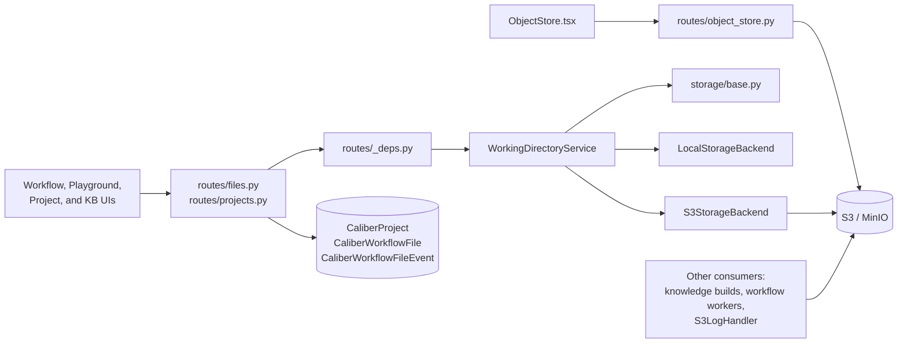
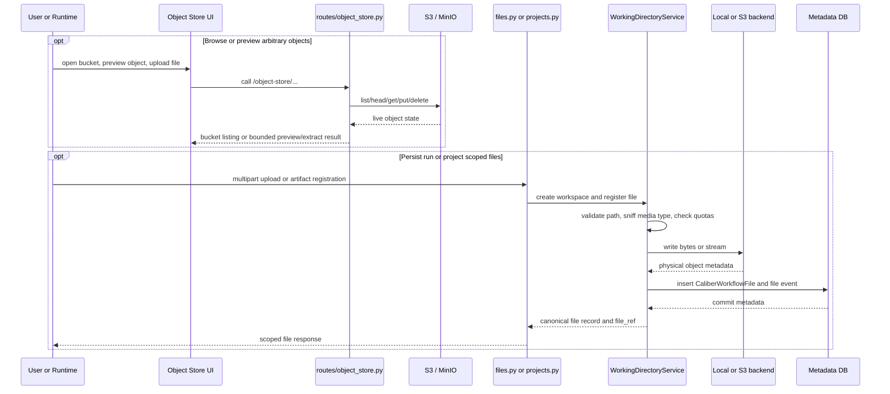

# Object Store Architecture

## At a glance

| Dimension | Object store: console plus managed storage substrate |
| --- | --- |
| **What it is** | An operator S3/MinIO console plus the backend-agnostic storage substrate the platform writes through, kept as two distinct concerns. |
| **Where state lives** | Console reads live S3 state per request; scoped storage is DB-backed in `CaliberProject`, `CaliberWorkflowFile`, and `CaliberWorkflowFileEvent`. |
| **Runtime model** | The console talks to S3 directly via `routes/object_store.py`; scoped storage flows through `WorkingDirectoryService` over `local` or `s3` backends. |
| **Key surfaces** | HTTP routes under `/ajax-api/2.0/mlflow/caliber`: `/object-store/...` console routes, `/workflow-files` and run-scoped file routes, and `/projects` workspace routes. |
| **Reference grammar** | Runtime code uses `caliber://` refs resolved against physical objects, never raw bucket keys. |
| **Trust / safety** | Reads need an authenticated user; console mutations require `SCOPE_ADMIN` and scoped writes `SCOPE_OPERATOR`; `safe_relative_path` and `local_realpath_guard` block traversal/symlink escape. |
| **Extends via** | New backends implement the `StorageBackend` protocol through `build_backend(...)`. |

The sections below start from this picture and drill down into the scope, boundaries, runtime paths, data model, surfaces, and trust boundaries in detail.

## Reference

## 1. Scope and responsibilities

The object-store module in CALIBER carries two closely related but
intentionally separate responsibilities: it presents a direct operator console
over an S3-compatible endpoint, and it provides the backend-agnostic storage
substrate that the rest of the platform writes through. Keeping those two
concerns distinct is the central design decision of the module.

In full, the module is responsible for the following, spanning the console, the
storage substrate, and the metadata that ties bytes to runtime scopes:

- It exposes an operator-facing S3/MinIO console for browsing buckets and
  objects.
- It provides the backend-agnostic storage substrate used by workflow runs,
  playground runs, and project files.
- It persists canonical file metadata in CALIBER's database while the object
  bytes live on local disk or in S3-compatible storage.
- It normalizes file references through `caliber://` URIs so runtime code never
  manipulates raw bucket keys directly.
- It gives adjacent modules such as workflows, knowledge bases, and logging a
  consistent object-persistence target.

These responsibilities are implemented across the following primary code paths,
which separate the console routes, the storage abstraction and its backends,
the scoped file routes, and the supporting dependencies and models:

- `caliber/src/caliber/routes/object_store.py`
- `caliber/src/caliber/storage/base.py`
- `caliber/src/caliber/storage/service.py`
- `caliber/src/caliber/storage/local.py`
- `caliber/src/caliber/storage/s3.py`
- `caliber/src/caliber/routes/files.py`
- `caliber/src/caliber/routes/projects.py`
- `caliber/src/caliber/routes/_deps.py`
- `caliber/src/caliber/db/models.py`
- `caliber/caliber-ui/src/pages/ObjectStore.tsx`

## 2. Module boundaries

The module draws a firm line between the live console and the managed,
DB-backed storage path. The table below assigns each responsibility to its
owner and records what that owner is accountable for:

| Responsibility | Owner | Notes |
| --- | --- | --- |
| Bucket/object console | `routes/object_store.py` + `ObjectStore.tsx` | Direct S3-compatible browser for buckets, folders, previews, extraction, upload, and delete. |
| Canonical ref grammar and path safety | `storage/base.py` | Defines `caliber://` refs, file kinds, safe relative paths, and shared exceptions. |
| Run/project-scoped file orchestration | `storage/service.py` | Builds namespaces, validates uploads, records DB rows, and resolves refs back to physical objects. |
| Local byte storage | `storage/local.py` | Atomic filesystem writes with realpath and symlink escape protection. |
| S3/MinIO byte storage | `storage/s3.py` | S3-compatible backend with secret resolution and public/internal endpoint separation. |
| Workflow/playground file APIs | `routes/files.py` | Run-scoped upload, list, download, and artifact registration. |
| Project workspace file APIs | `routes/projects.py` | Project CRUD plus folder/file browsing and backend selection. |
| Runtime metadata state | `CaliberProject`, `CaliberWorkflowFile`, `CaliberWorkflowFileEvent` | Database is the source of truth for scoped file metadata, not object listings. |

Those owners resolve into one architectural distinction that the rest of the
module depends on: the difference between state CALIBER reads live and state it
records authoritatively.

- Object-store console state is live bucket and object state, read directly from
  S3 on each request.
- Scoped file state consists of DB-backed file records that happen to point at
  local or S3-backed objects.

Because console state is never mirrored into the database, the console always
reflects ground truth, while scoped storage stays authoritative for everything
the runtime produces.

## 3. Runtime architecture

The two responsibilities take two different paths through the stack: the console
talks to S3 directly, while scoped storage flows through a shared service. The
diagram below shows both paths and the backends they reach:



```legend
```

Several structural properties follow from this split and explain why the two
paths exist side by side:

- The Object Store page is a direct browser over `CALIBER_OBJECT_STORE_*`
  configuration and does not go through `StorageBackend`.
- Workflow and project storage goes through `WorkingDirectoryService`, which
  chooses `local` or `s3` based on `workflow_storage` or the per-project
  backend.
- A single S3-compatible system can serve multiple roles at once: console
  browsing, workflow artifact storage, knowledge-base outputs, and service logs.
- `app.state` caches both the general object-store client and the
  `WorkingDirectoryService` so request handlers do not rebuild them on every
  call.

## 4. Data model and state

The console is deliberately stateless with respect to buckets and objects:
CALIBER does not mirror arbitrary bucket contents into a dedicated
`object_store_objects` table. Scoped storage, by contrast, keeps its state in
the database, which is the source of truth for every managed file.

The primary tables backing scoped storage are:

| Table | Role |
| --- | --- |
| `CaliberProject` | Project/workspace metadata, including `storage_backend` so each project can target `local` or `s3`. |
| `CaliberWorkflowFile` | Canonical file metadata row for workflow, playground, project, and dataset-scoped files. |
| `CaliberWorkflowFileEvent` | Append-only operational telemetry for upload, download, delete, and artifact events. |
| `CaliberEvalDatasetFile` | Role mapping from dataset examples to physical file rows. |

The `CaliberWorkflowFile` row is the linchpin: it ties a canonical reference to
a physical object and to the runtime scope that produced it. Its notable fields
are:

- `file_ref` holds the canonical `caliber://...` reference.
- `storage_backend` records whether the bytes live on `local` or `s3`.
- `storage_uri`, `bucket`, `object_key`, `object_version_id` form the physical
  locator.
- `kind`, `relative_path`, `status`, `version` track lifecycle and namespace
  state.
- `workflow_run_id`, `playground_run_id`, `project_id`, `dataset_id` record the
  scope.
- `producer_node_id`, `producer_tool_name` capture runtime lineage.

`WorkingDirectoryService` derives the namespace shape from that scope, so each
kind of file lands in a predictable, collision-free prefix:

- Workflow runs use
  `tenant/{tenant}/project/{project}/workflow/{workflow}/runs/{run}/...`.
- Playground runs use
  `tenant/{tenant}/project/{project}/playground/{run}/...`.
- Project file refs are stored as `CaliberWorkflowFile` rows with `project_id`
  and the chosen backend.

A file's lifecycle is metadata-driven: the `status` field advances through a
fixed set of states rather than being inferred from object listings:

- `pending_upload`
- `uploaded`
- `scanning`
- `rejected`
- `attached`
- `processing`
- `artifact`
- `deleted`

## 5. API and interaction surfaces

All HTTP routes in this module are mounted under
`/ajax-api/2.0/mlflow/caliber` and are shown relative to that prefix below. The
surface divides into the console routes, the scoped file-storage routes, and the
project workspace routes.

Object-store console routes operate directly against the live S3-compatible
endpoint:

- `GET /object-store/status`
- `GET /object-store/buckets`
- `POST /object-store/buckets`
- `DELETE /object-store/buckets/{bucket}`
- `GET /object-store/buckets/{bucket}/objects`
- `POST /object-store/buckets/{bucket}/objects`
- `POST /object-store/buckets/{bucket}/objects/delete`
- `POST /object-store/buckets/{bucket}/folders`
- `GET /object-store/buckets/{bucket}/object`
- `GET /object-store/buckets/{bucket}/object/preview`
- `GET /object-store/buckets/{bucket}/object/extract`
- `DELETE /object-store/buckets/{bucket}/object`

Scoped file-storage routes persist and retrieve run-bound files and artifacts:

- `POST /workflow-files`
- `POST /workflow-runs/{run_id}/files`
- `GET /workflow-runs/{run_id}/files`
- `GET /workflow-runs/{run_id}/files/{file_id}`
- `GET /workflow-runs/{run_id}/files/{file_id}/content`
- `POST /workflow-runs/{run_id}/artifacts`
- `POST /playground-runs/{run_id}/files`
- `GET /playground-runs/{run_id}/files`
- `GET /playground-runs/{run_id}/files/{file_id}/content`

Project workspace routes manage projects and their browsable file trees:

- `GET /projects`
- `POST /projects`
- `GET /projects/storage`
- `GET /projects/{project_id}`
- `PATCH /projects/{project_id}`
- `POST /projects/{project_id}/folders`
- `GET /projects/{project_id}/files`
- `POST /projects/{project_id}/files`
- `GET /projects/{project_id}/files/{file_id}/content`
- `DELETE /projects/{project_id}/files/{file_id}`

## 6. Execution lifecycle

The two surfaces run two distinct lifecycles: the console performs live object
operations, while scoped storage writes bytes through a backend and then anchors
all later access in a DB row. The sequence below shows both modes:



Operationally, that resolves into two modes with different sources of truth:

- Console mode performs direct live object operations against the configured
  S3-compatible endpoint.
- Managed mode writes bytes through a backend and then anchors all later access
  through a DB row plus its `caliber://` ref.

Both modes treat object content as potentially large and untrusted, so preview
and extraction are deliberately bounded:

- Text previews read only a capped byte range.
- Office extraction uses server-side parsers with file-size, row, and column
  caps before returning inline content.
- Download paths support inline media and byte-range streaming so browsers can
  play audio and video directly.

## 7. Security and trust boundaries

Authentication and authorization are split by surface, with console mutations
held to a higher bar than scoped file writes. The access rules are:

- Object-store reads require an authenticated user.
- Object-store mutations require `SCOPE_ADMIN`.
- Workflow and project file reads require an authenticated user.
- Workflow and project file writes require `SCOPE_OPERATOR`.

On top of authorization, the module enforces a set of core protections at the
boundary between CALIBER and untrusted storage:

- Object-store secrets are resolved indirectly through `resolve_secret` rather
  than stored as literal config values.
- `safe_relative_path` and `local_realpath_guard` block traversal and symlink
  escape on the local backend.
- `routes/files.py` enforces run binding, so a file ID from one run cannot be
  fetched through another run's path.
- Server-side media sniffing defeats basic extension and declared-type spoofing.
- The S3 backend uses the configured public endpoint when generating presigned
  URLs, avoiding internal endpoint leakage when browser-direct access is used.

Consistent with treating raw object storage as untrusted, the module hardens
how content is read back and rendered:

- Previews are size-capped.
- Office extraction returns graceful unsupported errors when parsers are missing
  or legacy formats are encountered.
- Scoped run/project file downloads (`routes/files.py`) are served as
  attachments with `X-Content-Type-Options: nosniff`, so untrusted HTML or SVG
  never renders inline. The object-store *console* download
  (`routes/object_store.py`) streams with `Content-Disposition` and
  `Accept-Ranges` and does not set `nosniff`, since it is an admin-scoped
  operator console rather than an end-user-facing fetch.

## 8. Observability and operations

Operational signals come from several layers, from connectivity probes to
per-file telemetry to mirrored logs. The available signals are:

- `GET /object-store/status` probes connectivity and returns a structured error
  instead of throwing a transport exception.
- `CaliberWorkflowFileEvent` records upload, download, delete, and artifact
  operations for scoped files.
- `S3LogHandler` can mirror structured service logs into object storage as JSONL
  objects.
- Other modules such as workflows and knowledge bases persist manifests, logs,
  and outputs back into object storage for inspection from the UI.

Configuration is split on purpose, separating the console client from the
managed-storage backend:

- `CALIBER_OBJECT_STORE_*` configures the console and the general
  S3-compatible client.
- `workflow_storage.*` configures the managed file-storage backend, bucket,
  prefixes, limits, and retention behavior.

That separation gives CALIBER operational flexibility:

- It can browse one S3-compatible endpoint through the Object Store page.
- It can store managed workflow and project files on local disk or another
  bucket.
- It can point both at the same MinIO deployment when that is operationally
  useful.

## 9. Extension points and current constraints

The module is built to extend along its storage abstraction and ref grammar.
The current extension points are:

- New storage backends can implement the `StorageBackend` protocol and plug in
  through `build_backend(...)`.
- More UI consumers can rely on `caliber://` refs and `WorkingDirectoryService`
  without knowing whether bytes live on local disk or S3.
- Additional object viewers can extend the preview and extract logic without
  changing the core storage model.

Those extension points sit alongside constraints that bound the current design:

- The Object Store page is S3-compatible only; it does not browse the local
  filesystem backend used by `workflow_storage.backend=local`.
- Console object state and DB-backed file metadata are deliberately separate, so
  there is no automatic reconciliation layer between them.
- Knowledge-base builds currently use their own direct object-store client
  rather than `WorkingDirectoryService`, which keeps the feature moving but
  means the storage story is not yet fully unified.
- Object storage remains whole-object oriented: uploads, copies, and deletes
  operate on complete objects rather than appendable streams.
