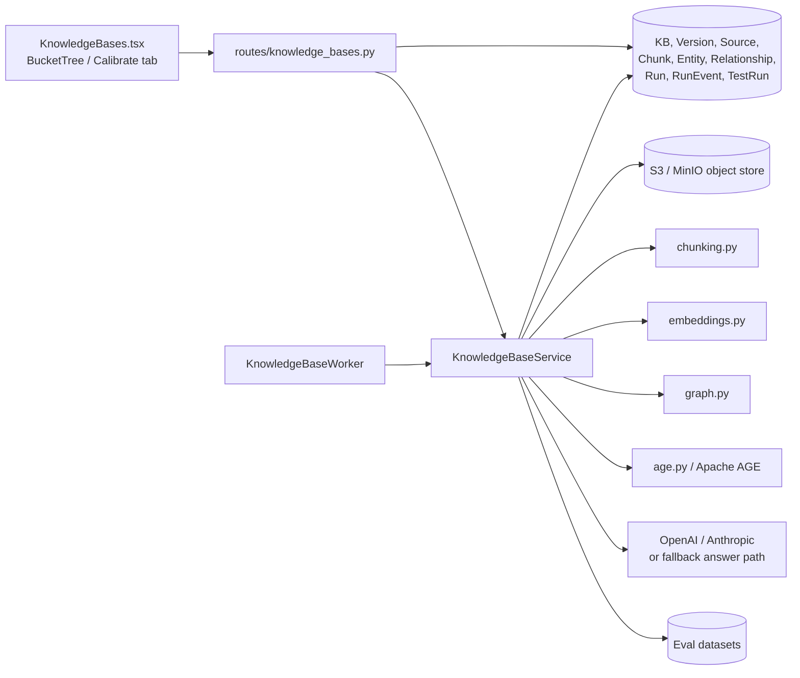
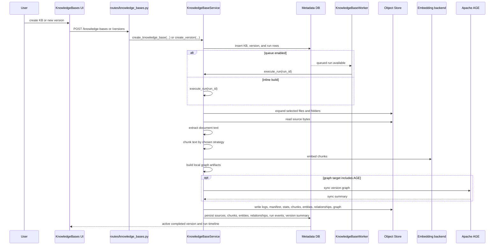

<!-- Generated by docs-site/build-docs.mjs from docs/08-knowledge-bases/architecture.md. Do not edit this file: edit the source and re-run the build (caliber/caliber-ui: npm run sync:docs). -->


# Knowledge Bases Architecture

## At a glance

| Dimension | Knowledge-bases module |
| --- | --- |
| **What it is** | A module that turns object-store documents into versioned, queryable corpora for CALIBER's RAG layer. |
| **Where state lives** | An identity/version/run split: `CaliberKnowledgeBase`, `CaliberKnowledgeBaseVersion`, and `CaliberKnowledgeBaseRun` tables, with chunks, entities, and relationships per version. |
| **Ingestion** | `KnowledgeBaseService.execute_run()` expands object-store sources, extracts text, chunks, embeds, and builds graph artifacts, optionally via `KnowledgeBaseWorker`. |
| **Retrieval** | Version-scoped dense, hybrid, graph-hybrid, or AGE-backed modes through `POST /knowledge/query`, with optional pgvector ANN and cross-encoder rerank. |
| **Key surfaces** | Routes under `/ajax-api/2.0/mlflow/caliber`, the `KnowledgeBases.tsx` UI, and the service in `caliber/src/caliber/knowledge/service.py`. |
| **Calibration** | `knowledge/calibration.py` scores quality against eval datasets and pins baseline runs via `CaliberKnowledgeBaseTestRun`. |
| **Trust boundary** | Reads need an authenticated user; mutating routes require `SCOPE_OPERATOR`. |

The sections below start from this picture and drill down into the scope, data
model, API surface, lifecycle, and operational detail behind each dimension.

## Reference

## 1. Scope and responsibilities

The knowledge-bases module turns object-store documents into versioned,
queryable corpora that power retrieval-augmented workflows and playground use.
It is more than a document catalog: it owns the full build, retrieval, graph,
and evaluation lifecycle for CALIBER's RAG layer, from raw bytes in a bucket
through retrieval-ready chunks, derived graphs, and pinned quality baselines.

Concretely, the module is responsible for the following capabilities, which
together span ingestion, retrieval, and quality assurance:

- It creates and manages logical knowledge bases with project-aware visibility.
- It builds immutable versions from object-store files and folders.
- It extracts text, chunks documents, generates embeddings, and persists the
  resulting retrieval state.
- It derives graph artifacts and optionally syncs them into Apache AGE.
- It answers questions through dense, hybrid, graph-hybrid, or AGE-backed
  retrieval.
- It calibrates retrieval quality against eval datasets and pins baseline runs.

The behavior above is implemented across the following primary code paths,
which split cleanly between the HTTP surface, the build and retrieval service,
the supporting subsystems, and the UI:

- `caliber/src/caliber/routes/knowledge_bases.py`
- `caliber/src/caliber/knowledge/service.py`
- `caliber/src/caliber/knowledge/worker.py`
- `caliber/src/caliber/knowledge/chunking.py`
- `caliber/src/caliber/knowledge/embeddings.py`
- `caliber/src/caliber/knowledge/graph.py`
- `caliber/src/caliber/knowledge/age.py`
- `caliber/src/caliber/knowledge/calibration.py`
- `caliber/src/caliber/db/models.py`
- `caliber/caliber-ui/src/pages/KnowledgeBases.tsx`
- `caliber/caliber-ui/src/pages/knowledge/KnowledgeCalibrateTab.tsx`
- `caliber/caliber-ui/src/components/knowledge/BucketTree.tsx`

## 2. Module boundaries

The module keeps a clear separation between durable identity, build outputs,
and operational state. The table below assigns each responsibility to its
owning component and notes what that owner guarantees:

| Responsibility | Owner | Notes |
| --- | --- | --- |
| Logical KB catalog | `CaliberKnowledgeBase` + `routes/knowledge_bases.py` | Stable KB identity, owner, visibility, source bucket, active version, and baseline run. |
| Immutable build versions | `CaliberKnowledgeBaseVersion` | Captures one chunking/embedding/graph build and its artifact URIs. |
| Build execution | `KnowledgeBaseService.execute_run()` / `_process_build()` | Expands sources, extracts text, chunks, embeds, builds graph artifacts, and persists outputs. |
| Queued build orchestration | `KnowledgeBaseWorker` | Claims queued runs, renews leases, and recovers expired work. |
| Chunking policy | `knowledge/chunking.py` | Recursive, semantic, markdown-aware, token, and character strategies. |
| Embedding runtime | `knowledge/embeddings.py` | Curated local Hugging Face embedding catalog plus runtime gating. |
| Local graph extraction | `knowledge/graph.py` | Heuristic or spaCy extraction into version-scoped entities and relationships. |
| Optional Apache AGE sync/retrieval | `knowledge/age.py` | Shared graph sync plus Cypher-backed retrieval and exploration. |
| Calibration | `knowledge/calibration.py` + `CaliberKnowledgeBaseTestRun` | Durable quality scoring against eval datasets. |

These owners line up against a single organizing principle: separating what
stays stable from what is rebuilt on every ingest. That principle resolves into
three distinct layers of state:

- Knowledge-base identity is the mutable library object that carries visibility
  and points at the active version.
- Knowledge-base versions are the immutable build outputs that hold the
  retrieval-ready state for one build configuration.
- Knowledge-base runs are the operational executions and their event history.

Because identity, versions, and runs are decoupled, a knowledge base can be
rebuilt and re-pointed without disturbing its catalog presence or its audit
trail.

## 3. Runtime architecture

The runtime fans out from a single service that coordinates the database, the
object store, and the supporting subsystems. The diagram below shows how the
UI, HTTP routes, and background worker all converge on `KnowledgeBaseService`:



```legend
```

Several structural properties follow from this layout and explain why the
pieces are arranged as they are:

- Source selection always begins from object-store files or folders, so the
  object store is the single ingestion entry point.
- Build output is persisted twice over: as normalized DB rows for query access
  and as object-store artifacts under `.caliber/knowledge-bases/...` for
  inspection and export.
- Retrieval is version-scoped rather than knowledge-base-global, which is what
  lets an older version keep serving while a new one builds.
- Apache AGE is optional and additive; it complements the local graph
  implementation rather than being the only one.

## 4. Data model and state

The persistence layer mirrors the identity/version/run split described above,
adding dedicated tables for the retrieval units and graph artifacts a build
produces. The primary tables are:

| Table | Role |
| --- | --- |
| `CaliberKnowledgeBase` | Logical corpus identity, visibility, source bucket/manifest, active version, baseline run, and latest run status. |
| `CaliberKnowledgeBaseVersion` | One immutable build configuration and output snapshot. |
| `CaliberKnowledgeBaseSource` | Expanded source documents, extraction status, and ingestion metadata. |
| `CaliberKnowledgeBaseChunk` | Retrieval unit with content, offsets, token count, and stored embedding vector. |
| `CaliberKnowledgeBaseEntity` | Version-scoped graph entities derived from chunk content. |
| `CaliberKnowledgeBaseRelationship` | Version-scoped graph edges with weights and evidence chunks. |
| `CaliberKnowledgeBaseRun` | Durable operational build run with queue/lease/heartbeat state. |
| `CaliberKnowledgeBaseRunEvent` | Append-only run timeline. |
| `CaliberKnowledgeBaseTestRun` | Durable calibration results and baseline candidates. |

The `CaliberKnowledgeBase` row anchors a corpus's identity and its operational
status. Its notable fields are:

- `project_id`, `visibility`, `owner` control library visibility and scoping.
- `source_bucket`, `source_manifest`, `source_fingerprint` capture the build
  inputs.
- `active_version_id` names the runtime default target.
- `baseline_run_id` records the calibration comparison baseline.
- `last_run_id`, `last_run_status`, `last_run_completed_at` summarize the most
  recent operational status.

Each `CaliberKnowledgeBaseVersion` row freezes one build configuration together
with pointers to its output artifacts. Its notable fields are:

- `version_number`, `status` establish the immutable build identity and
  readiness.
- `chunking_strategy`, `chunking_config` record how text was split.
- `graph_config` records how the graph was derived.
- `embedding_model`, `embedding_dimension` record how chunks were embedded.
- `output_bucket`, `output_prefix` locate the artifact namespace.
- `chunks_uri`, `entities_uri`, `relationships_uri`, `graph_uri` point at the
  exported build outputs.
- `manifest_uri`, `logs_uri`, `stats_uri` point at the operational artifacts.
- `summary`, `error_summary` carry the human-readable result.

A few implementation details shape how retrieval actually executes today and
are worth stating plainly:

- Chunk embeddings are stored as JSON arrays on `CaliberKnowledgeBaseChunk`.
- Dense retrieval is currently computed in-process over loaded chunk rows rather
  than pushed into a dedicated vector database.
- AGE sync is optional and complements, rather than replaces, the local DB
  retrieval path.

## 5. API and interaction surfaces

All HTTP routes in this module are mounted under
`/ajax-api/2.0/mlflow/caliber` and are shown relative to that prefix below. The
surface groups into catalog lifecycle, versioning and run inspection, version
detail and graph exploration, and retrieval and calibration.

Catalog and lifecycle routes manage the logical knowledge base itself:

- `GET /knowledge-bases/options`
- `GET /knowledge-bases`
- `POST /knowledge-bases`
- `GET /knowledge-bases/{knowledge_base_id}`
- `PATCH /knowledge-bases/{knowledge_base_id}`
- `DELETE /knowledge-bases/{knowledge_base_id}`

Versioning and run-inspection routes create builds and follow their progress:

- `GET /knowledge-bases/{knowledge_base_id}/versions`
- `POST /knowledge-bases/{knowledge_base_id}/versions`
- `POST /knowledge-bases/{knowledge_base_id}/versions/{version_id}/activate`
- `POST /knowledge-bases/{knowledge_base_id}/rollback`
- `GET /knowledge-bases/{knowledge_base_id}/runs`
- `GET /knowledge-runs/{run_id}/events`

Version-detail and graph-exploration routes expose the contents of a built
version, including its derived graph:

- `GET /knowledge-base-versions/{version_id}`
- `GET /knowledge-base-versions/{version_id}/sources`
- `GET /knowledge-base-versions/{version_id}/chunks`
- `GET /knowledge-base-versions/{version_id}/entities`
- `GET /knowledge-base-versions/{version_id}/relationships`
- `GET /knowledge-base-versions/{version_id}/graph`
- `POST /knowledge-base-versions/{version_id}/age-sync`

Retrieval and calibration routes answer questions and score quality against eval
datasets:

- `POST /knowledge/query`
- `POST /knowledge-bases/{knowledge_base_id}/calibrate`
- `GET /knowledge-bases/{knowledge_base_id}/test-runs`
- `GET /knowledge/test-runs/{test_run_id}`
- `POST /knowledge-bases/{knowledge_base_id}/baseline`

## 6. Execution lifecycle

A build moves from creation through ingestion to persisted, retrieval-ready
state, optionally routed through a background worker when queueing is enabled.
The sequence below traces that path end to end:



Once a version has built successfully, retrieval follows a separate path that
selects a mode appropriate to the question and the available artifacts:

- `query(...)` resolves the visible versions and the effective retrieval modes.
- Dense scoring computes similarity over the stored chunk embeddings.
- Hybrid mode adds lexical BM25-style scoring and reciprocal-rank fusion, so
  exact-term matches reinforce semantic matches.
- Graph-hybrid mode adds entity and relationship expansion drawn from the local
  graph tables, broadening recall through related concepts.
- AGE mode can seed retrieval from the synced graph and then rerank with dense
  chunk similarity.
- Answer generation calls OpenAI or Anthropic directly when configured, and
  falls back to a deterministic context summary when it is not.

Activation is audited and reversible. `activate_version(...)` records the
outgoing `previous_active_version_id` in its audit row, so `POST
/knowledge-bases/{id}/rollback` re-activates the exact prior active version by
reading that trail (rather than guessing an ordinal); it returns 409 when no
recorded prior active version exists or that version is no longer completed.
Re-activating the version that is already active is a no-op — it writes no
self-referential audit row — and the rollback walk reads only
`activate_knowledge_base_version` rows (never the `rollback` rows it writes), so
repeated rollbacks step strictly backward through activation history instead of
no-op'ing or oscillating.

## 7. Security and trust boundaries

Authorization is intentionally narrow, granting reads broadly while reserving
every mutating operation for operators. The access rules are:

- Reads require an authenticated user.
- Create, update, delete, build, activate, rollback, sync, calibrate, and
  baseline routes require `SCOPE_OPERATOR`.
- List and detail paths re-check visibility through `apply_visibility_filter`
  and the `_require_visible_*` helpers.

Beyond authorization, several controls protect the trust boundary between
CALIBER and the code, models, and storage it drives:

- The local embedding runtime is gated by `local_embedding_block_reason(...)`,
  so a risky or unsupported local torch stack is blocked unless explicitly
  allowed.
- Object-store access uses secret indirection through `resolve_secret` rather
  than literal credentials.
- Reserved output prefixes under `.caliber/knowledge-bases` are excluded from
  source expansion to prevent self-ingestion loops.
- Only completed versions are retrieval-ready, so partial builds never serve
  queries.
- Optional dependencies fail as `KnowledgeDependencyError` and surface as
  structured 503s rather than generic crashes.

Delete behavior is intentionally aggressive but bounded, distinguishing a
reversible lifecycle change from a destructive removal:

- `PATCH status=archived` is a soft lifecycle change.
- `DELETE /knowledge-bases/{id}` is a hard delete of the KB rows, versions,
  runs, chunks, entities, relationships, and test runs.
- Object-store output cleanup and AGE subgraph deletion run as best-effort
  follow-up operations.

## 8. Observability and operations

Operational durability is first-class: every build leaves a complete, queryable
trail in both the database and the object store. The runtime records the
following signals:

- Each build gets a `CaliberKnowledgeBaseRun` row carrying queue, claim, lease,
  and heartbeat fields.
- `CaliberKnowledgeBaseRunEvent` stores an ordered event timeline such as
  `build_queued`, `source_started`, `graph_built`, and `build_completed`.
- Completed and failed builds persist `manifest.json`, `stats.json`,
  `logs.jsonl`, and export artifacts to the object store.
- Version summaries retain aggregate counts, graph settings, embedding
  dimension, and AGE sync status.

These signals are tuned through configuration that governs queueing, the
background worker, graph extraction, AGE, and local embeddings:

- `knowledge_build_queue_enabled`
- `knowledge_build_worker_enabled`
- `knowledge_build_worker_interval_seconds`
- `knowledge_build_lease_seconds`
- `knowledge_graph_extractor_backend`
- `knowledge_age_enabled`
- `knowledge_age_graph_name`
- `allow_flagged_local_embeddings`

The UI is organized around this same operational lifecycle, presenting one stage
per task:

- Library presents the KB inventory and visibility.
- Build covers source selection, chunking, embeddings, and the graph profile.
- Explore offers query, chunk inspection, and graph inspection.
- Calibrate runs eval-dataset scoring and manages baselines.
- Use surfaces the runtime-facing KB identity and version selection.

## 9. Extension points and current constraints

The module is designed to grow along well-defined seams. The current extension
points are:

- New chunkers can be added through `chunk_text(...)` and surfaced via
  `list_chunking_strategies()`.
- New embedding models can be added to the curated catalog in
  `knowledge/embeddings.py`.
- Graph extraction can evolve independently from AGE sync, because the local
  graph artifacts already form a complete intermediate representation.
- Workflow nodes can reference a knowledge base by ID or pin explicit version
  IDs at runtime.

Those seams come with deliberate constraints that scope the current
implementation:

- Source selection and artifact output both live in the chosen object-store
  bucket today; there is no separate per-KB artifact bucket configuration.
- Embeddings are local Hugging Face models only today, even though answer
  generation can use OpenAI or Anthropic.
- Dense retrieval defaults to an in-process scan over version chunks; on Postgres
  with pgvector it can instead push a SQL-side nearest-neighbour top-k into the
  database (see §10). The cross-encoder rerank stage is local-model only, behind
  the same flagged-runtime guard as embeddings.
- Calibration runs are synchronous for now.
- Knowledge-base storage uses a direct S3-compatible client rather than the
  generic `WorkingDirectoryService`, so its storage behavior is similar to but
  not yet fully unified with workflow and project file storage.

## 10. Retrieval at scale: pgvector ANN + cross-encoder reranking

First-stage dense retrieval and a second-stage reranker are now separable, which
takes retrieval from demo-scale to large corpora without changing the query
contract.

**pgvector SQL-side ANN.** By default `_load_dense_candidates` loads every chunk
for the version and scores cosine similarity in Python — correct, but O(n·d) per
query. When `CALIBER_KNOWLEDGE_PGVECTOR_ENABLED` is set *and* the platform runs on
Postgres, dense retrieval instead issues a SQL nearest-neighbour query
(`ORDER BY embedding_vec <=> :q LIMIT :pool`) via `knowledge/pgvector_ann.py`: the
database computes the distances in C and returns only the candidate pool, so the
working set is bounded by `CALIBER_KNOWLEDGE_ANN_CANDIDATE_POOL_SIZE` rather than
the whole corpus. Migration `0060` (Postgres-only) creates the `embedding_vec`
column as `vector(N)` plus an **HNSW index** (`USING hnsw (embedding_vec
vector_cosine_ops)`) for sub-linear search. `N` is
`CALIBER_KNOWLEDGE_EMBEDDING_DIMENSION` (default 1024 — the dimension of the
recommended BGE-M3 / E5-large / Qwen3 models; MiniLM is 384), because pgvector's
HNSW index requires a fixed dimension and **caps at 2000** — the maximum CALIBER
supports for ANN, comfortably above every curated model. The column is populated
alongside the JSON `embedding` during build, but only for chunks whose dimension
matches `N`; a knowledge base built at a different dimension simply leaves
`embedding_vec` NULL and falls back to the Python scan, so a mismatch degrades
gracefully rather than failing the build. On SQLite (tests, local dev) the column
does not exist, `is_postgres` is false, and the Python scan is the unchanged
fallback — so the two paths return the same shape and the SQLite-based test suite
pins behaviour.

**Cross-encoder rerank.** When `CALIBER_KNOWLEDGE_RERANK_ENABLED` is set,
retrieval becomes two-stage: the first stage gathers the larger candidate pool
(by ANN or cosine, plus BM25 / graph fusion as configured), then a local
`sentence-transformers` `CrossEncoder` (`CALIBER_KNOWLEDGE_RERANK_MODEL`, default
`cross-encoder/ms-marco-MiniLM-L-6-v2`) re-scores each `(question, passage)` pair
jointly and reorders the pool down to the requested `top_k`. The raw rerank
logits are min-max normalized into the result `score`, with the original
first-stage score preserved under `score_breakdown.retrieval` and the rerank
score under `score_breakdown.rerank`. The reranker reuses the embedding runtime's
flagged-local guard and ships in the existing `knowledge-local` extra, so no new
dependency is introduced. Reranking applies uniformly across all retrieval modes
(dense, hybrid, graph_hybrid, age_graph).

**Judged calibration metrics share the platform judge path.** The knowledge-base
calibration metrics that need a model — faithfulness and answer-correctness — no
longer hand-roll a prompt and parse a number. `build_kb_judge` constructs two
`mlflow.genai.make_judge` judges through the shared
`caliber.eval.judge_scorer.build_judge`, and `KbJudge` scores them with
`score_with_judge`, so KB calibration uses the exact same judge machinery as the
Evaluations scorecard and the optimization gate (deterministic Recall@k / nDCG@k
remain pure functions). See the Evaluation and Calibration module docs.
