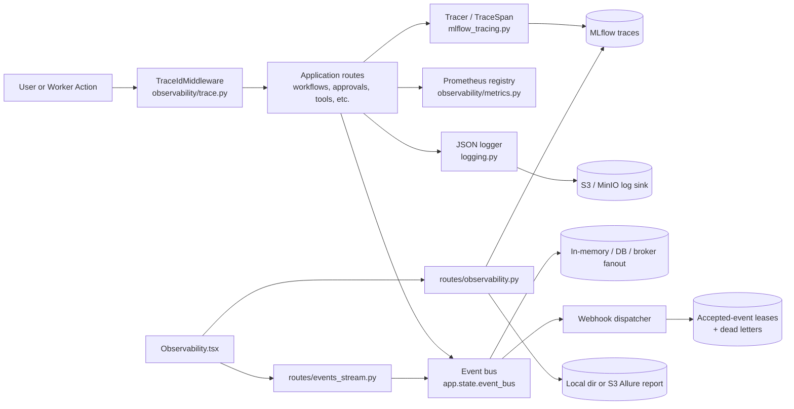
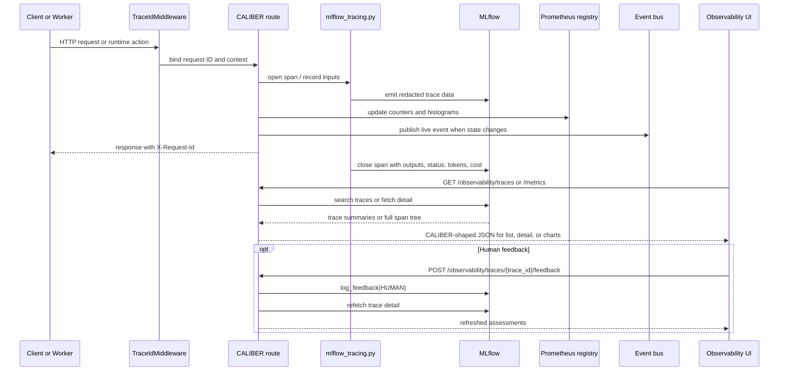

<!-- Generated by docs-site/build-docs.mjs from docs/09-observability/architecture.md. Do not edit this file: edit the source and re-run the build (caliber/caliber-ui: npm run sync:docs). -->


# Observability Architecture

## At a glance

| Dimension | CALIBER's runtime telemetry spine |
| --- | --- |
| **What it is** | An in-process telemetry layer embedded in the same Starlette app, not a sidecar. |
| **Tracing** | MLflow is the system of record for spans, tags, token/cost rollups, and assessments; CALIBER reads and annotates rather than originates. |
| **Metrics** | A CALIBER-owned Prometheus `CollectorRegistry` scraped at `GET /metrics`. |
| **Live events** | Ephemeral event-bus frames pushed to the SPA over `GET /events/stream` via a swappable fanout backend. |
| **Key surfaces** | In-app trace viewer and monitoring dashboard (`Observability.tsx`), structured review queues that write back to MLflow, and operator queue/alert/incident/dead-letter APIs. |
| **Retention** | Server-owned MLflow trace archival (Postgres → MinIO) via `MLFLOW_TRACE_ARCHIVAL_CONFIG`, opt-in and read transparently. |
| **Alerting** | Operator-declared SLO objectives evaluated on read, with incidents opened/resolved in `caliber_incidents` and routed over the event bus to the webhook dispatcher. Silencing and acknowledgement are recorded, not inferred. |
| **Trust / safety** | Authenticated trace surfaces, redaction and byte-caps before MLflow, and safe degradation to empty responses when MLflow is unavailable. |

The sections below start from this picture and drill down into each concern in detail, from scope and module boundaries through to retention and review queues.

## Reference

## 1. Scope and responsibilities

The observability module is CALIBER's runtime telemetry spine, serving operators
who need to know whether the platform is healthy and developers who need to
understand how a given execution behaved. It is the seam through which the rest
of the platform becomes legible. Concretely, the module is responsible for the
following:

- capturing request-correlated trace context and propagating a stable
  `X-Request-Id`;
- emitting MLflow traces and span metadata for workflows, tools, approvals,
  and LLM calls, including multimodal attachments (e.g. the source document on a
  document-extraction span);
- exposing an in-app trace viewer and monitoring dashboard so users can inspect
  execution behavior without leaving CALIBER;
- driving structured human review of traces through review queues whose answers
  are written back onto the trace as MLflow assessments and expectations;
- recording structured JSON logs and, optionally, batching them into
  S3-compatible object storage;
- publishing live workflow events over Server-Sent Events for the SPA;
- reconciling configured SLO objectives into durable incident history and routing
  lifecycle notifications through the event bus;
- preserving accepted-but-unsettled outbound webhooks and exhausted deliveries for
  operator acknowledgement or replay;
- exporting Prometheus metrics for scraping; and
- serving a generated Allure report from local disk or `s3://...` storage.

These responsibilities are implemented across the following primary code paths:

- `caliber/src/caliber/observability/mlflow_tracing.py`
- `caliber/src/caliber/observability/trace.py`
- `caliber/src/caliber/observability/logging.py`
- `caliber/src/caliber/observability/metrics.py`
- `caliber/src/caliber/trace_client.py`
- `caliber/src/caliber/routes/observability.py`
- `caliber/src/caliber/routes/review_queues.py`
- `caliber/src/caliber/review/writeback.py`
- `caliber/src/caliber/routes/metrics.py`
- `caliber/src/caliber/routes/events_stream.py`
- `caliber/src/caliber/events/bus.py`
- `caliber/src/caliber/events/database_bus.py`
- `caliber/src/caliber/events/nats_bus.py`
- `caliber/src/caliber/events/webhooks.py`
- `caliber/src/caliber/observability/incidents.py`
- `caliber/src/caliber/routes/system_services.py`
- `caliber/src/caliber/routes/system_effects.py`
- `caliber/src/caliber/routes/health.py`
- `caliber/caliber-ui/src/pages/Observability.tsx`
- `caliber/caliber-ui/src/components/observability/TraceMetricsCharts.tsx`

## 2. Module boundaries

The module deliberately distributes its work across several focused owners
rather than concentrating it in a single telemetry component. The table below
maps each responsibility to the file that owns it.

| Responsibility | Owner | Notes |
| --- | --- | --- |
| Trace/span lifecycle | `observability/mlflow_tracing.py` | Wraps MLflow tracing with CALIBER-safe helpers, redaction, token/cost attribution, and no-op degradation when tracing is unavailable. |
| Request correlation | `observability/trace.py` | Binds the current trace/request ID into context and injects `X-Request-Id` through middleware. |
| Structured logging | `observability/logging.py` | Emits single-line JSON logs to stderr or an S3-compatible sink while preserving request correlation. |
| Prometheus metrics | `observability/metrics.py` | Owns the CALIBER registry, counters, histograms, and gauges for runtime health and throughput. |
| Trace viewer APIs | `routes/observability.py` | Lists traces, fetches trace detail, logs human feedback, computes monitoring buckets, and serves Allure assets. |
| SSE live updates | `routes/events_stream.py` + `events/*` | Streams event frames from `app.state.event_bus` to the SPA, with heartbeat support and pluggable fanout backends. |
| SLO incident state | `observability/slo.py` + `observability/incidents.py` | Evaluates objectives and reconciles durable open/resolved/acknowledged/silenced incident rows. |
| Outbound delivery | `events/webhooks.py` + `routes/system_effects.py` | Signs and retries webhook deliveries, persists acceptance leases/dead letters, and exposes acknowledgement/replay operations. |
| Trace data access | `trace_client.py` | Normalizes MLflow trace reads into CALIBER's trace-detail shape for the UI and downstream consumers. |
| Queue and worker liveness | `observability/queue_health.py` + `observability/worker_registry.py` | Summarizes queue depth from durable run state and worker health from self-reported heartbeats, so an idle queue and a dead worker are distinguishable. |
| Operator service probes | `routes/system_services.py` + `routes/health.py` | Adjacent operational truth surfaces for backing service status and readiness honesty. |
| Frontend observability UX | `Observability.tsx` + `TraceMetricsCharts.tsx` + `Releases.tsx` | Provides trace list/detail, compare mode, filters, feedback UI, time-series monitoring charts, and an operator recovery console for effects and dead letters. |

Underneath those owners, the module draws one sharp line: it separates four
fundamentally different kinds of telemetry and operational memory, each with its own store
and lifetime.

- Durable trace data is external MLflow state that CALIBER reads and annotates
  rather than originates.
- Ephemeral live events are short-lived event-bus frames used to update the SPA
  in near real time.
- Durable operational memory is CALIBER relational state for SLO incidents,
  accepted webhook leases, delivery dead letters, and worker heartbeats.
- Process-local telemetry consists of Prometheus registry samples and structured
  log records emitted by the current server process.

Keeping these four concerns distinct is what allows each to fail or degrade
independently without taking the others down.

## 3. Runtime architecture

The runtime topology shows how a single action fans out into durable trace,
event-fanout, webhook-delivery, and process-local telemetry paths, and how the
UI later reads them back. SLO incident rows are reconciled separately when the
alert surface evaluates configured objectives.



```legend
```

Several structural properties follow from this layout and explain why it is
shaped the way it is.

- Observability is not a separate sidecar; it is embedded into the same
  Starlette application and instruments the platform in-process, which keeps
  context correlation cheap and exact.
- MLflow is the system of record for traces, assessments, and span trees, while
  CALIBER renders that state through its own API and UI.
- The event bus is deliberately swappable so that multi-replica deployments can
  push the same live event stream across processes.
- The Allure surface is static artifact serving, not report generation.
- The metrics registry is CALIBER-owned rather than a re-export of every default
  process metric from the host runtime, which keeps the scrape surface focused
  on platform-meaningful signals.

## 4. Data model and state

Observability state is intentionally split across multiple stores rather than
forced into a single telemetry table, because each kind of state has a different
durability requirement and a different reader. The following table summarizes
where each lives and why.

| State | Backing store | Role |
| --- | --- | --- |
| Trace spans, tags, token/cost rollups, feedback assessments | MLflow | Source of truth for trace inspection and human review. |
| Live event payloads | In-memory queue, database rows, or broker transport | Fanout substrate for SSE subscribers waiting on state changes. |
| Metrics counters, histograms, and gauges | In-process Prometheus `CollectorRegistry` | Scrape-time operational counters and distributions. |
| Structured logs | stderr and optional S3 JSONL batches | Operational logs with request correlation. |
| Request correlation | `contextvars` + response headers | Carries `trace_id` / request ID through async execution paths. |
| SLO incident lifecycle | `caliber_incidents` | Durable open/resolved history, acknowledgement, silence, routing metadata, and database arbitration for one open row per objective. |
| Accepted outbound targets | `caliber_webhook_accepted_events` | Per-occurrence, per-target acceptance and lease state until that target is settled or dead-lettered. |
| Exhausted/ambiguous deliveries | `caliber_webhook_dead_letters` | Durable operator-visible failure record with acknowledgement and manual replay state. |
| Background worker liveness | `caliber_worker_heartbeats` | One self-reported row per worker identity, rewritten every poll cycle, so an idle worker's health is observable without queued work. |

The relational tables cover both cross-replica fanout and operational memory:

| Table | Role |
| --- | --- |
| `CaliberLiveEvent` | Append-only event payload mirror used by the database-backed event bus. |
| `CaliberIncident` | Durable SLO transition record; a partial unique index arbitrates concurrent openers, and conditional updates arbitrate concurrent resolvers. |
| `CaliberWebhookAcceptedEvent` | Accepted-but-unsettled occurrence/target snapshot and renewable recovery lease. |
| `CaliberWebhookDeadLetter` | Per-target terminal/ambiguous delivery record retained for acknowledgement or manual replay. |
| `CaliberWorkerHeartbeat` | Worker self-registration (migration `0069`): kind, host hint, start/last-beat timestamps, and a cumulative `ticks` count that separates a wedged loop from an idle one. |

A handful of runtime semantics govern how that state is produced and consumed,
and they are worth stating explicitly.

- `TraceIdMiddleware` binds or generates the request ID early, then echoes it
  back as `X-Request-Id`, so correlation exists from the first instruction.
- `mlflow_tracing.py` enforces redaction and byte limits before trace attributes
  are attached to spans.
- `trace_client.py` reconstructs tree-shaped trace detail directly from MLflow
  rather than reading a CALIBER shadow table.
- `routes/observability.py` treats missing MLflow support as a degraded mode and
  returns empty results instead of surfacing internal exceptions.
- `app.state.event_bus` is the single fanout abstraction consumed by the SSE
  route, which is what keeps the transport swappable.
- `observability/worker_registry.py` inverts the direction of worker evidence.
  Liveness used to be *inferred* from claimed `running` rows, which says nothing
  while the queue is empty; each worker now writes its own row every cycle, so a
  fresh row proves the loop is turning, a stale row names the worker that stopped,
  and no row at all means none ever started. Staleness is judged against the
  worker's own poll interval rather than a second configured threshold, and a
  failed heartbeat write is swallowed and logged — losing an observability write
  must never fail the tick it was observing.
- Worker ids include the process id (`worker_registry.new_worker_id`) because the
  heartbeat table is shared by every process pointed at the same database. Under a
  multi-worker server each process runs its own copy of all nine loops, so an
  id derived from the instance alone would collide and N live workers would report
  as one.

Operators tuning the module reach for a small set of high-value configuration
knobs:

- `CALIBER_TRACING_ENABLED`
- `CALIBER_TRACING_AUTOLOG_ENABLED`
- `CALIBER_TRACING_MAX_ATTRIBUTE_BYTES`
- `CALIBER_TRACING_EXPERIMENT`
- `CALIBER_ALLURE_REPORT_DIR`
- `CALIBER_WORKFLOW_RUN_EVENT_BACKEND`
- `CALIBER_NATS_URL`
- `CALIBER_REDIS_URL`

## 5. API and interaction surfaces

All HTTP routes in CALIBER are mounted under `/ajax-api/2.0/mlflow/caliber` and
are shown relative to that prefix below; even the seemingly top-level `/metrics`
and `/events/stream` endpoints carry it. The observability routes group into
trace inspection, report serving, raw telemetry, and a pair of adjacent operator
surfaces.

The trace and monitoring routes back the in-app viewer and dashboard:

- `GET /observability/traces`
- `GET /observability/traces/{trace_id}`
- `POST /observability/traces/{trace_id}/feedback`
- `GET /observability/experiments`
- `GET /observability/metrics`

The report-serving routes expose the static Allure tree:

- `GET /observability/allure-report`
- `GET /observability/allure-report/{path:path}`

The platform telemetry routes are the machine-facing surfaces:

- `GET /metrics`
- `GET /events/stream`

The adjacent operational-memory routes expose queue health, alerts, incidents, and
delivery failures:

- `GET /system/queue`
- `GET /system/alerts`
- `GET /system/incidents`
- `POST /system/incidents/{incident_id}/silence`
- `POST /system/incidents/{incident_id}/acknowledge`
- `GET /system/effects`
- `POST /system/effects/{effect_key}/resolve`
- `GET /system/webhook-dead-letters`
- `POST /system/webhook-dead-letters/{dead_letter_id}/acknowledge`
- `POST /system/webhook-dead-letters/{dead_letter_id}/replay`

Two further routes are not part of observability proper but are the surfaces it
depends on operationally:

- `GET /system/services`
- `GET /readiness`

On the frontend, these routes compose into a single coherent interaction model.
The Releases recovery console is shown only to operators. Operators can inspect
indeterminate effects and recover dead letters; resolving an effect remains
admin-only because `skip` can assert that an externally ambiguous mutation happened.

- The trace tab calls `/observability/traces` with filters such as
  `experiment_id`, `status`, `session`, `since_ms`, and `limit`.
- Selecting a row triggers `/observability/traces/{trace_id}` to fetch the full
  span tree, request/response bodies, tags, token counts, and assessments.
- The monitor tab calls `/observability/metrics`, which buckets recent traces
  into fixed time windows for latency, error-rate, token, and cost charts.
- Submitting human review uses `/observability/traces/{trace_id}/feedback`,
  which writes an MLflow assessment and then returns the refreshed assessment
  list.
- The SPA opens `EventSource("/events/stream")` to keep progress indicators,
  queue counters, and approval surfaces fresh without polling.

## 6. Execution lifecycle

The sequence below traces a single action from request through telemetry
emission to the UI's later reads, including the optional human-feedback loop.



The Allure flow is intentionally kept separate from this live path, because
report generation is an out-of-band concern rather than a request-time one.

- A test or CI process generates the HTML report out-of-band.
- CALIBER serves the resulting report tree from `CALIBER_ALLURE_REPORT_DIR`.
- If `index.html` is missing, the route returns a placeholder page explaining
  how to generate the report instead of failing.

## 7. Security and trust boundaries

Because observability surfaces sensitive execution detail, its security posture
is built around authenticated access, payload sanitization, and clear trust
lines toward MLflow.

The authentication and authorization behavior is straightforward:

- Trace list, trace detail, feedback, experiment list, monitoring charts, and
  SSE all require an authenticated user.
- The Prometheus exposition endpoint at `GET /metrics` is intentionally
  unauthenticated today, matching the current deployment assumptions.
- Feedback entries are attributed to the authenticated actor and stored in
  MLflow as human assessments.

Several data-handling protections guard what actually reaches MLflow and the
browser:

- Trace inputs and outputs pass through CALIBER's redactor before they are
  attached to spans.
- Trace attributes are byte-capped so that oversized payloads cannot explode
  MLflow storage or UI rendering.
- The Allure file-serving path rejects traversal via `..` path segments.
- SSE strips private `_caliber_*` fields before sending payloads to browsers.
- Route handlers degrade to safe empty responses when MLflow is unavailable
  instead of dumping raw stack traces into the UI.

These protections rest on a small number of explicit trust boundaries:

- MLflow is trusted as the durable trace store but not as CALIBER's UI or auth
  layer.
- The event bus transport is trusted for fanout, but browser subscribers receive
  only the normalized payload CALIBER emits.
- Optional S3 log sinks are best-effort and always retain stderr as the startup
  fallback.

## 8. Observability and operations

Fittingly, this module is both a consumer and a producer of telemetry, and its
operational story is mostly about giving operators an honest picture of runtime
capability.

The behaviors that matter most in operation are these:

- `server.py` wires the event bus, logging, and route registration during app
  startup, so observability surfaces are available as soon as the API is up.
- `GET /readiness` reports whether providers are real or simulated and whether
  tracing is enabled, which keeps operator dashboards honest about runtime
  capabilities.
- `GET /system/services` probes MLflow, the object store, AI Gateway, the
  database, NATS, and related dependencies, so operators can separate a CALIBER
  bug from an unavailable backing service.
- `GET /observability/metrics` computes time buckets over recent traces for the
  in-app charts, while `GET /metrics` remains the machine-scrape surface for
  Prometheus.
- `GET /system/queue` reports queue depth alongside worker liveness —
  `workers_alive`, `workers_stale`, per-worker detail, stale leases, and the
  oldest queued age — which is the signal `/health` cannot give, because an API
  that answers proves nothing about whether anything is consuming the queue. A
  missing registration is only a fault where execution is actually queue-backed;
  under synchronous execution there is deliberately no worker, and reporting its
  absence would be a permanent false alarm.

### 8.1 SLO objectives, incidents, and alert routing

Instantaneous evaluation and incident *memory* are separate concerns.
`observability/slo.py` evaluates operator-declared objectives
(`CALIBER_SLO_OBJECTIVES`) against queue, delivery, and readiness signals and returns an
alert state per objective, rendered by `GET /system/alerts`. That is a gauge: it says
whether an objective is breaching *now*. It could not answer when a breach started, how
long it lasted, or whether it had happened before.

`caliber_incidents` supplies the missing state. An incident opens when an objective
starts firing and resolves when it stops, recording duration, severity, acknowledgement,
and silence. Migration `0079` adds a partial unique index for one open row per objective;
migration `0080` gives the all-clear its own notification marker. Conditional transition
and notification claims make the database choose one synchronous local publisher when
replicas reconcile the same state concurrently. The `0080` upgrade marks pre-existing
resolved history as already handled, so upgrading cannot emit a wave of historical
all-clears.

| Surface | Purpose |
| --- | --- |
| `GET /system/alerts` | Current objective states, and the reconcile point where incidents open and close |
| `GET /system/incidents` | History, newest first, filterable by status |
| `POST /system/incidents/{id}/silence` | Mute routing for a window, without hiding the record |
| `POST /system/incidents/{id}/acknowledge` | Record that a human owns it — deliberately *not* the same as resolving |

**Routing reuses the event bus rather than adding a delivery path.** An incident publishes
`slo.incident.opened` / `slo.incident.resolved`, which are included in the default webhook
filter. For each configured target, the dispatcher writes durable acceptance before queueing,
then applies bounded retry and per-target settlement. If an acceptance lease expires after
abrupt process loss, recovery moves it atomically into the durable dead-letter workflow for
manual replay; it does not silently re-send an outcome that may already have reached the
receiver. The lease/recovery loop remains active whenever durable storage is bound, even if
the current configuration has no webhook URLs or signing secret. Removing a target therefore
stops new delivery without stranding a previously accepted row whose foreign lease expires
after this replica starts. Dispatcher shutdown also sets a per-start stop generation before
cancelling async tasks. A blocking sender that returns late cannot begin another retry or
target, and an old generation cannot settle a restarted dispatcher's in-memory claim. A POST
already in progress at shutdown can still have an externally ambiguous outcome.

**A delivery is settled before it is counted.** The dispatcher clears the durable
accept row first and only then increments the operations-visible `delivered`
counter. The reverse order published a state that had not happened yet: a reader
could observe `delivered == N` while N accept rows still sat in the table looking
unsettled, which is the exact ambiguity those rows exist to remove. The settle step
swallows its own errors and prunes in a `finally`, so ordering it first cannot skip
the count.

Four further behaviours are deliberate and worth knowing before relying on this:

- **One synchronous local publisher wins each notification claim.** The partial unique
  index arbitrates open races, a conditional update arbitrates resolution races, and
  `notified_at` / `resolved_notified_at` independently claim the opening and all-clear.
  A known synchronous publication failure releases its claim, so a later firing or
  non-firing reconciliation retries it. Successfully committed markers prevent steady-state
  ticks from routing the transition again.
- **Silencing suppresses routing, not the record.** Dropping the row would hide the
  incident from the history that exists to be reviewed afterwards.
- **A resolution routes even when the open was silenced.** "All clear" is the one message
  that is never noise.
- **Severity is operator configuration** (`CALIBER_SLO_SEVERITIES`), not inferred from how
  far past target an observation sits: how bad a breach is depends on the service, not the
  number. An unrecognised severity is ignored so one typo cannot stop other objectives from
  being evaluated.

This is not exactly-once external notification. Event-bus publication and the incident-row
commit are not one atomic transaction. A process can publish and then fail before committing
its marker, causing the next reconciliation to publish the same transition again; an async
subscriber can also fail after the synchronous `publish()` call returns. Downstream webhook
acceptance and settlement are a separate durability boundary, and a receiver can succeed
while local acknowledgement is lost. Deployments that require receiver deduplication must
therefore use a stable event/delivery identity before treating replay as safe automation.

What is still absent: continuous/timer-driven objective reconciliation (the current
reconcile point is an alerts request), escalation chains, on-call rotation, and per-agent
or per-workflow health rollups. Severity is a label an operator sets, not a policy that
escalates over time.

Knowing how the module degrades is just as important as knowing how it behaves
when healthy. The common degraded modes are:

- With tracing disabled, the trace list and detail surfaces return empty
  datasets.
- With a fake or missing MLflow provider, observability remains reachable but
  mostly shows no trace content.
- With missing Allure assets, the report route serves explanatory placeholder
  HTML.
- With broker or cross-process event issues, SSE still works for in-process
  events, but cross-replica liveliness depends on the configured backend.

## 9. Extension points and current constraints

The module is built to grow along a few well-defined seams, and its present
limitations are deliberate consequences of those same design choices.

The principal extension points are:

- The event bus can run in-memory or be backed by database or broker-backed
  transports without changing the SSE route contract.
- Additional Prometheus counters or histograms can be added centrally in
  `observability/metrics.py`.
- New trace enrichment fields can be attached in `mlflow_tracing.py`, provided
  they respect redaction and size limits.
- The Allure route already supports both local directories and S3-compatible
  sources.

The matching constraints reflect the module's read-heavy, projection-first
stance:

- CALIBER does not maintain its own durable trace warehouse; the trace viewer is
  a projection over MLflow, so MLflow availability and retention policies
  directly shape the user experience.
- The monitoring API computes buckets from a bounded recent trace search rather
  than from a dedicated time-series database.
- Allure generation is external to the app, so CALIBER can serve a report but
  cannot produce one on demand.
- `GET /metrics` exposes only the CALIBER registry, not a full host-runtime or
  node-level telemetry picture.
- The module is intentionally read-heavy; outside of feedback logging it mostly
  observes other runtime systems rather than owning business state.

## 10. Multimodal trace attachments

MLflow 3.12+ supports multimodal tracing: a binary artifact set as a span input
or output is uploaded alongside the trace and the span value is replaced with a
reference URI, so the trace UI renders the actual source. CALIBER exposes this
through `TraceSpan.attach(name, content_bytes, content_type)` on the tracer
handle in `mlflow_tracing.py`, which wraps the bytes in
`mlflow.tracing.attachments.Attachment`, accumulates multiple attachments on one
span without clobbering, and records a plain-text `caliber.attachment.<name>`
marker so the redacted in-app viewer can surface the attachment without the
binary. Attachment, like every other tracing call, is best-effort: it returns
`False` (never raises) when tracing is inert or the attachment cannot be built.

The first consumer is the document-ingestion tool: `extract_document`
(`workflows/ingestion_tools.py`) now runs inside a `tool.extract_document` span
and attaches the source file (PDF, DOCX, image, …) to it, capped to avoid
bloating traces with very large scans. The result is that the KG/OCR pipeline's
extraction steps show the exact document they processed directly in the trace,
which is a substantial debugging aid for document-heavy workflows.

## 11. Trace retention and auto-archival

The MLflow tracking server (`deploy/mlflow/`) supports server-owned trace
retention and archival (MLflow 3.13+): a periodic pass moves aged trace span data
out of the Postgres backend store into object storage (MinIO) while keeping the
traces fully readable through the same UI and API. It is configured by a YAML
file (`deploy/mlflow/trace-archival.yaml`) declaring `enabled`, an artifact-repo
`location`, a `retention` window (`<int><unit>`, e.g. `30d`), and the pass
cadence, and is wired through the `MLFLOW_TRACE_ARCHIVAL_CONFIG` env var. It is
opt-in: the env var is unset by default so a fresh stack never relocates traces;
setting it to the baked-in config path activates archival. CALIBER's trace viewer
reads archived traces transparently, so retention tuning is an operational lever
rather than an application concern.

## 12. Review queues

Review queues give the trace viewer a structured human-review workflow. Because
MLflow's native Review Queues are Databricks-only, CALIBER implements the same UX
on the open-source assessment primitives. A queue (`caliber_review_queues`,
migration `0054`) carries a label schema of `questions` — pass/fail, categorical,
numeric, or free-text, each tagged as a *feedback* or *expectation* target — plus
a set of assigned reviewers; each item (`caliber_review_items`) pins one observed
trace. Reviewers answer the questions per trace on the **Review Queues** page, and
on submit the answers are written straight back onto the trace via
`review/writeback.py`: feedback questions through `mlflow.log_feedback` and
expectation (ground-truth) questions through `mlflow.log_expectation`, with the
reviewer recorded as a `HUMAN` assessment source. The resulting assessment ids are
stored on the item for provenance, and because the answers land on the trace as
ordinary assessments and expectations they immediately feed evaluation,
judge alignment, and trace-derived dataset capture. Submission validates the
answers against the queue's schema (required coverage, no unknown keys) and
degrades to a clean `502` if the trace write-back fails, leaving CALIBER state
consistent.
