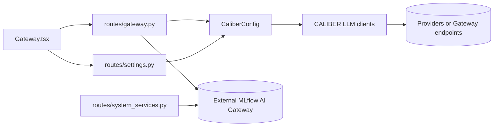
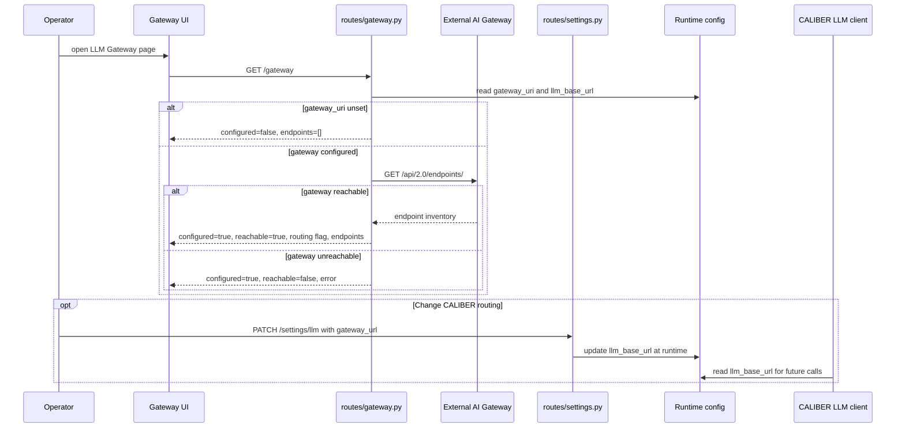

<!-- Generated by docs-site/build-docs.mjs from docs/10-gateways/architecture.md. Do not edit this file: edit the source and re-run the build (caliber/caliber-ui: npm run sync:docs). -->


# Gateways Architecture

## At a glance

| Dimension | Gateways integration layer |
| --- | --- |
| **What it is** | An integration and visibility layer over an external MLflow AI Gateway, not a proxy or gateway service of CALIBER's own. |
| **Discovery** | Synchronous, per-request probe of `CaliberConfig.gateway_uri` → `/api/2.0/endpoints/`; no metadata cache or local endpoint registry. |
| **Routing behavior** | CALIBER's own LLM calls go through the gateway only when `CaliberConfig.llm_base_url` (opt-in via `CALIBER_LLM_BASE_URL`) points at it; `routing_through_gateway` is a URL-prefix comparison against `gateway_uri`. |
| **Key surfaces** | `GET /gateway` discovery; guardrail catalog/create/delete and endpoint attach/detach/reorder routes; `/gateway/usage`; `/llm-pricing`; and `/settings/llm`. The UI is the tabbed `Gateway.tsx` page. |
| **State** | Endpoint discovery is computed on demand with no local endpoint registry. Guardrail definitions/configuration live in the MLflow tracking store, trace-derived usage lives with MLflow traces, and operator-authored per-model prices live in `caliber_llm_model_pricing` (migration `0061`). |
| **Trust / safety** | Discovery and usage are authenticated reads and never forward prompts. Guardrail mutations are operator-scoped and audited; pricing creation is operator-scoped, pricing updates/archive are admin-scoped, and `PATCH /settings/llm` is admin-scoped. |

The sections below start from this picture and drill down into each dimension in
detail, keeping the discovery, routing, and external-control-plane distinctions
strictly apart.

## Reference

## 1. Scope and responsibilities

The gateways module documents CALIBER's integration with an external MLflow AI
Gateway. It is important to state the boundary up front: in the current
checkout, CALIBER does not implement a general-purpose gateway service of its
own. The module is therefore an integration and visibility layer, not a proxy,
and it is responsible for the following:

- discovering whether an external AI Gateway is configured;
- probing that gateway for reachability and endpoint inventory;
- showing whether CALIBER routes its own LLM traffic through the gateway;
- listing, defining, deleting, attaching, detaching, and reordering tracking-store
  guardrails under audited operator scope;
- deriving usage/cost/latency/error views from CALIBER's MLflow traces;
- maintaining database-backed per-model pricing overrides used by cost attribution;
- presenting those status and governance surfaces inside the UI without requiring
  operators to leave CALIBER; and
- exposing adjacent settings and service-health surfaces that affect routing.

These responsibilities are implemented across the following primary code paths:

- `caliber/src/caliber/routes/gateway.py`
- `caliber/src/caliber/routes/llm_pricing.py`
- `caliber/src/caliber/observability/mlflow_tracing.py`
- `caliber/src/caliber/db/models.py` (`CaliberLlmModelPricing`)
- `caliber/src/caliber/routes/settings.py`
- `caliber/src/caliber/routes/system_services.py`
- `caliber/src/caliber/routes/health.py`
- `caliber/src/caliber/schemas.py`
- `caliber/src/caliber/config.py`
- `caliber/caliber-ui/src/pages/Gateway.tsx`
- `caliber/caliber-ui/src/api/caliberApi.ts`

## 2. Module boundaries

The module's work divides between reporting gateway truth, governing guardrails and
pricing, deriving usage, and adjusting CALIBER's own routing target. The table below
assigns each responsibility to its owner.

| Responsibility | Owner | Notes |
| --- | --- | --- |
| Gateway discovery/status API | `routes/gateway.py` | Read-only route that reports configured state, reachability, endpoint inventory, routing mode, and errors. |
| Gateway guardrails API | `routes/gateway.py` (`/gateway/guardrails`, `…/endpoints/{id}/guardrails`) | Reads scorer-based guardrails and per-endpoint coverage from the **MLflow tracking store**; lists buildable/registered scorers; defines or deletes guardrails; and attaches, detaches, or reorders them (operator-scoped, audited, off-thread, degrade-gracefully). Native templates can be created here; dependency-heavy validator scorers are still provisioned in the MLflow image (`deploy/mlflow/configure_guardrails.py`) and then selected here. |
| Gateway usage API | `routes/gateway.py` (`/gateway/usage`) → `observability.gateway_usage_payload` | Trace-derived token / cost / latency / error metrics over time + a by-model rollup (the gateway API exposes no usage stats; CALIBER's MLflow traces do). Reuses the observability bucketize; reads the `caliber.model` / `caliber.tokens` / `caliber.cost_usd` span attributes. |
| Per-model cost config | `routes/llm_pricing.py` + `CaliberLlmModelPricing` (migration 0061) | Database-backed USD-per-1K-token rates per provider/model. Operators create rows; admins update/archive them. `observability/mlflow_tracing.resolve_model_pricing` merges visible active overrides over `DEFAULT_MODEL_PRICING` (cached, invalidated on edit) so cost attribution reflects them. |
| Gateway schema contract | `GatewayEndpointSchema`, `GatewayStatusSchema`, `GatewayGuardrailsStatusSchema`, `LlmPricingSchema` | Shapes the endpoint rows, guardrail coverage, pricing rows, and the status envelopes returned to the UI. |
| Runtime routing configuration | `routes/settings.py` + `CaliberConfig.llm_base_url` | Determines whether CALIBER's own LLM calls go through the gateway or directly to providers. |
| Discovery configuration | `CaliberConfig.gateway_uri` | Tells CALIBER where to probe for the external AI Gateway, but does not route traffic by itself. |
| Operator service probes | `routes/system_services.py` | Shows AI Gateway health alongside MLflow, DB, object store, NATS, and related backing services. |
| Runtime honesty surface | `routes/health.py` | Two endpoints sit adjacent to gateway operations: `GET /health` probes the database (`SELECT 1`) and returns HTTP 503 with `db: "down"` when it is unreachable, while `GET /readiness` reports real-vs-simulated provider state (and does not probe the database). |
| Frontend gateway UX | `Gateway.tsx` + `components/gateway/*` | Tabbed LLM Gateway page: **Endpoints** (status cards + endpoint table + routing), **Guardrails** (catalog-backed define/delete plus per-endpoint attach/detach/order/enablement), **Pricing** (editable per-model rate table), **Usage** (recharts time-series + by-model table). |

Two MLflow servers are involved and must not be conflated: **endpoint discovery**
reads the standalone gateway over HTTP (`CaliberConfig.gateway_uri` →
`/api/2.0/endpoints/`); **guardrail governance** is a set of tracking-server RPCs
reached via the MLflow client store (`mlflow.get_tracking_uri()`), the same
reach-through `deploy/mlflow/configure_guardrails.py` uses. Guardrails in this
MLflow version are **scorer-based** (Stage `BEFORE`/`AFTER` × Action
`VALIDATION`/`SANITIZATION`), not natural-language instructions.

The single most important architectural distinction is the separation between discovery,
routing, and the two external state owners:

- `gateway_uri` is where CALIBER probes to discover an external gateway.
- `llm_base_url` is where CALIBER actually sends LLM requests.
- The standalone gateway owns endpoint definitions, provider bindings, and endpoint limits.
- The MLflow tracking store owns scorer-backed guardrail definitions and per-endpoint
  guardrail configuration.

Conflating the first two is the most common source of confusion, which is why
the rest of this document keeps them apart.

## 3. Runtime architecture

The topology below shows the two independent paths the module reasons about:
discovery toward the external gateway, and routing toward whatever target
CALIBER's LLM clients are configured to use.



```legend
```

Several structural properties define how this integration behaves:

- Gateway discovery is synchronous and per-request; CALIBER does not maintain a
  gateway metadata cache or a local endpoint registry.
- CALIBER is not a model-traffic proxy or endpoint-definition control plane. Its tabbed
  Gateway page does govern tracking-store guardrails and local pricing overrides in addition
  to reporting discovery and usage.
- Settings mutate CALIBER's runtime routing target, but they do not create,
  delete, or edit gateway endpoints.
- The same external gateway can be visible to CALIBER even when CALIBER itself
  is still routing directly to providers.

## 4. Data model and state

State is deliberately split by owner rather than being universally stateless:

- endpoint inventory/reachability is computed on demand from configuration plus a live HTTP
  probe and is never stored in a local endpoint registry;
- guardrail definitions and endpoint configuration belong to the MLflow tracking store;
- usage is derived from MLflow trace attributes; and
- operator-authored provider/model rates live in `CaliberLlmModelPricing`
  (`caliber_llm_model_pricing`, migration `0061`) and override built-in pricing.

The discovery status envelope, `GatewayStatusSchema`, carries the following fields:

- `configured`
- `reachable`
- `gateway_uri`
- `routing_through_gateway`
- `llm_base_url`
- `endpoints`
- `error`

Each endpoint row within that envelope, `GatewayEndpointSchema`, carries:

- `name`
- `endpoint_type`
- `provider`
- `model`
- `endpoint_url`
- `limit`

A few runtime semantics determine how those fields are populated, and they
encode the discovery-versus-routing distinction directly:

- `configured=false` means `CALIBER_GATEWAY_URI` is empty, so CALIBER has
  nothing to probe.
- `reachable=false` means the gateway URI was configured but the live probe
  failed or returned an error.
- `routing_through_gateway` is derived by comparing whether `llm_base_url`
  starts with the same scheme/host/port prefix as `gateway_uri`.
- Endpoint inventory is read from the external gateway's `/api/2.0/endpoints/`
  API and is never stored durably inside CALIBER.

## 5. API and interaction surfaces

All HTTP routes in CALIBER are mounted under `/ajax-api/2.0/mlflow/caliber` and
are shown relative to that prefix below. The gateway module exposes the
discovery route plus guardrail-governance, usage, and pricing routes, and the
adjacent settings and operational surfaces that govern routing.

The gateway surface is:

- `GET /gateway` — endpoint discovery + reachability (read-only)
- `GET /gateway/guardrails` — guardrail inventory + per-endpoint coverage (read-only; degrades gracefully when the tracking server is unreachable)
- `GET /gateway/guardrails/catalog` — native templates and already-registered scorers available for definition
- `POST /gateway/guardrails` — define a native-template or registered-scorer guardrail (operator-scoped, audited)
- `DELETE /gateway/guardrails/{guardrail_id}` — delete a guardrail (operator-scoped, audited)
- `POST /gateway/endpoints/{endpoint_id}/guardrails` — attach a guardrail (operator-scoped, audited)
- `DELETE /gateway/endpoints/{endpoint_id}/guardrails/{guardrail_id}` — detach a guardrail (operator-scoped, audited)
- `PATCH /gateway/endpoints/{endpoint_id}/guardrails/{guardrail_id}` — update execution order / enable state (operator-scoped, audited)
- `GET /gateway/usage` — trace-derived usage time series + by-model rollup (auth user)

Per-model pricing is a sibling CRUD resource (`routes/llm_pricing.py`):

- `GET /llm-pricing`, `GET /llm-pricing/{pricing_id}` (auth user, visibility-scoped)
- `POST /llm-pricing` (operator-scoped, audited; duplicate provider/model → 409)
- `PATCH /llm-pricing/{pricing_id}` (admin-scoped, audited)

The adjacent settings and operational surfaces are:

- `GET /settings/llm`
- `PATCH /settings/llm`
- `GET /system/services`
- `GET /health`
- `GET /readiness`

On the frontend, these routes compose into four tabs:

- **Endpoints** renders configured URI, reachability, routing posture, and endpoint inventory;
  an unreachable probe becomes an inline error rather than failing the page.
- **Guardrails** renders definitions and per-endpoint coverage, and lets operators define or
  delete supported guardrails and attach, detach, enable, disable, or reorder them.
- **Pricing** lists visible provider/model rate overrides and exposes scope-appropriate create,
  edit, and archive actions.
- **Usage** charts trace-derived token, cost, latency, and error totals/time series plus a
  by-model rollup.

The settings route separately reports and updates `gateway_url`, which maps to `llm_base_url`
and controls CALIBER's own outbound routing behavior.

## 6. Execution lifecycle

The sequence below shows discovery resolving to one of three outcomes, followed
by the separate, optional act of changing CALIBER's routing target.



The diagram makes the module's central separation explicit by keeping two flows
apart:

- The discovery flow answers whether CALIBER can see an external gateway and
  what endpoints that gateway reports.
- The routing flow answers whether CALIBER itself chooses to send its LLM calls
  through that gateway.

## 7. Security and trust boundaries

Because discovery/usage are reads while guardrail, pricing, and routing changes affect real
traffic or cost attribution, authorization grants progressively higher privilege as an
action's blast radius widens.

The authorization model is as follows:

- `GET /gateway`, `GET /gateway/guardrails`, `GET /gateway/guardrails/catalog`, and `GET /gateway/usage` require an authenticated user.
- Guardrail definition/deletion and endpoint attach/detach/update routes require `SCOPE_OPERATOR` and are audited.
- `GET /settings/llm` requires `SCOPE_OPERATOR`.
- `PATCH /settings/llm` requires `SCOPE_ADMIN`.
- Pricing reads (`GET /llm-pricing`) require an authenticated user; create requires `SCOPE_OPERATOR` and update requires `SCOPE_ADMIN` (both audited).

A small set of data-handling protections keeps discovery safe and predictable:

- Gateway probes use a short HTTP timeout and degrade into an error field rather
  than blocking or crashing the page.
- The gateway status route is read-only and never forwards prompts or model
  payloads through the discovery path.
- CALIBER treats the external gateway as the source of truth for endpoint
  inventory but still normalizes the response into a stable schema before
  exposing it to the UI.

These protections sit on top of explicit trust boundaries:

- `gateway_uri` merely declares where CALIBER looks for gateway metadata; it
  does not imply that runtime traffic is actually routed there.
- `llm_base_url` changes CALIBER's outbound call target, so it is kept on an
  admin-scoped settings surface rather than the read-only gateway page.
- CALIBER can define guardrails backed by its native templates or an already-registered scorer,
  then delete/attach/detach/reorder them through audited tracking-server RPCs. Dependency-heavy
  validator scorers that CALIBER intentionally does not install must still be provisioned in
  the MLflow image; once registered, they are discoverable/selectable here.

## 8. Observability and operations

Operationally, the gateway module is an operator truth surface rather than a
traffic-processing subsystem, and its value lies in disambiguating connectivity
problems from configuration problems.

The behaviors that matter most in operation are these:

- `GET /gateway` distinguishes "not configured" from "configured but
  unreachable", which matters when triaging connectivity versus missing setup.
- `GET /system/services` probes the AI Gateway alongside the rest of the
  platform dependencies, so operators can verify the service separately from the
  dedicated page.
- The Gateway UI explicitly explains that routing through the gateway is opt-in
  via `CALIBER_LLM_BASE_URL`.
- The settings surface exposes the live `gateway_url` value, so operators can
  align what the runtime is doing with what the status page reports.

Two configuration knobs govern the module's behavior end to end:

- `CALIBER_GATEWAY_URI`
- `CALIBER_LLM_BASE_URL`

From those knobs and the probe result, the module resolves into a small number
of operational states:

- With no gateway configured, the discovery page shows setup guidance.
- With a gateway configured but unreachable, the route returns `reachable=false`
  plus the probe error.
- With a gateway reachable but holding no endpoints, the route is healthy, yet
  the external gateway has no configured endpoint inventory.
- With a gateway reachable while CALIBER routes directly to providers, discovery
  works, but runtime traffic is not yet opted into the gateway.

## 9. Extension points and current constraints

The module is deliberately narrow, which makes both its growth path and its
present limitations easy to state.

It can be extended along these seams:

- Additional gateway metadata fields can be added to `GatewayEndpointSchema`
  without changing the fundamental discovery architecture.
- Additional safe guardrail templates can extend the catalog without moving scorer ownership
  out of the MLflow tracking store.
- Pricing and usage can add provider/model dimensions while retaining visibility scoping and
  trace-derived evidence.
- The settings layer can evolve to support richer routing strategies while still
  keeping the read-only discovery route separate.
- Service-health and readiness surfaces can continue to cross-link gateway state
  with other platform dependencies.

Its current constraints follow directly from that narrow scope:

- The current checkout contains no dedicated gateway service implementation
  inside CALIBER; this module integrates with an external MLflow AI Gateway.
- CALIBER cannot create/edit gateway endpoints, provider credentials, endpoint limits, or
  arbitrary external routing policy. It can govern supported guardrails and local pricing.
- Endpoint inventory is fetched live on every request and is neither cached nor
  historized inside CALIBER.
- `routing_through_gateway` is a prefix comparison on URLs, which is sufficient
  for the current single-target setup but is not a full policy engine for
  per-model or per-tenant routing.
- General API-gateway behavior for the rest of CALIBER remains outside this module's scope.
