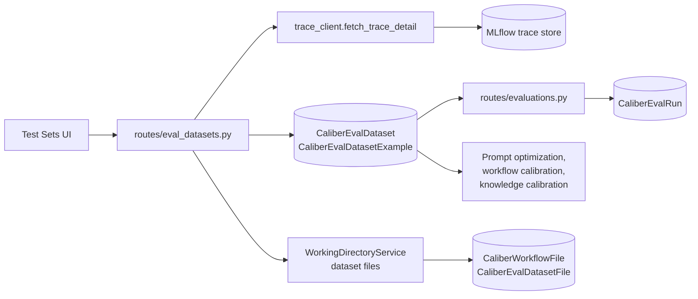
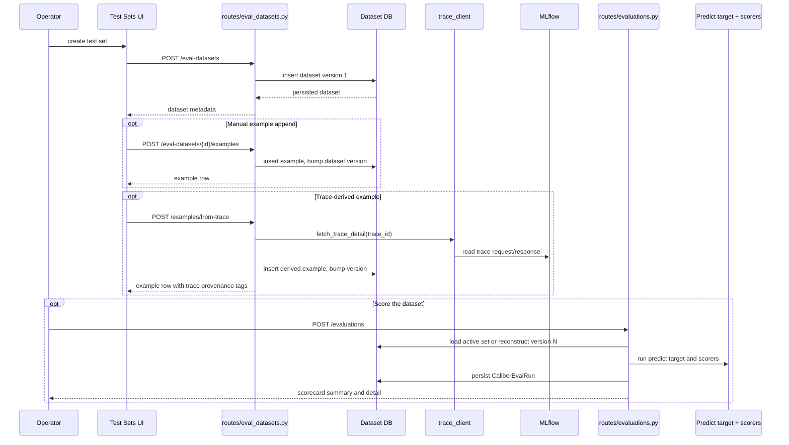

# Test Sets Architecture

## At a glance

| Dimension | Test Sets: CALIBER's versioned evaluation-dataset substrate |
| --- | --- |
| **What it is** | Durable, named sets of `input` / `expected` examples (UI "Test Sets", backend `eval-datasets`). |
| **Where state lives** | Relational, CALIBER-owned: `CaliberEvalDataset`, `CaliberEvalDatasetExample`, `CaliberEvalDatasetFile`, `CaliberEvalRun` — not in MLflow. |
| **Curation** | Append-only; manual rows, trace import, and edit-via-`revise`/`supersede`, each bumping `dataset.version`. |
| **Trace capture** | `POST /examples/from-trace` snapshots a trace into DB JSON via `fetch_trace_detail`. |
| **MLflow sync** | On-demand push via `POST /eval-datasets/{dataset_id}/sync` and `dataset_sync.py`; CALIBER stays authoritative. |
| **Key surfaces** | `routes/eval_datasets.py`, `routes/evaluations.py`, and `EvalDatasets.tsx` (+ `/eval-datasets/:id` detail editor). |

The sections below start from this picture and drill down into each dimension in
detail.

## Reference

## 1. Scope and responsibilities

The test-sets module is CALIBER's versioned evaluation-dataset substrate. A
naming note avoids confusion throughout this document: the UI says "Test Sets",
while the backend module and routes use `eval-datasets`; the two refer to the
same thing. The module's responsibilities are:

- to define durable, named sets of `input` / `expected` examples used to
  evaluate prompts, workflows, and calibration targets;
- to preserve change history through append-only example management instead of
  destructive edits;
- to allow operators to create examples manually or derive them from observed
  traces;
- to provide filtered listing, archival, and version-reconstruction surfaces;
- to supply downstream evaluation runs, prompt optimization, and knowledge-base
  calibration workflows with stable datasets;
- to attach dataset-scoped files through the same storage substrate used
  elsewhere in CALIBER when examples need artifacts; and
- to synchronize a test set into MLflow's native GenAI dataset registry on
  demand so the MLflow dataset UI and source-trace lineage become available
  without surrendering CALIBER's role as the source of truth.

These responsibilities are implemented across the following primary code paths:

- `caliber/src/caliber/routes/eval_datasets.py`
- `caliber/src/caliber/routes/evaluations.py`
- `caliber/src/caliber/eval/provider.py`
- `caliber/src/caliber/eval/mlflow_runner.py`
- `caliber/src/caliber/eval/dataset_sync.py`
- `caliber/src/caliber/db/models.py`
- `caliber/src/caliber/schemas.py`
- `caliber/src/caliber/storage/base.py`
- `caliber/src/caliber/storage/service.py`
- `caliber/src/caliber/prompt_targets.py`
- `caliber/src/caliber/workflows/calibration.py`
- `caliber/src/caliber/knowledge/service.py`
- `caliber/caliber-ui/src/pages/EvalDatasets.tsx`

## 2. Module boundaries

The module separates dataset curation, which it owns, from evaluation scoring,
which it merely feeds. The table below maps each responsibility to its owner.

| Responsibility | Owner | Notes |
| --- | --- | --- |
| Dataset CRUD and versioning | `routes/eval_datasets.py` | Owns list/get/create/update, append-only example creation, trace import, and supersede semantics. |
| Dataset and example persistence | `CaliberEvalDataset`, `CaliberEvalDatasetExample` | Database is the system of record for test-set identity, history, and visibility. |
| Dataset file attachments | `CaliberEvalDatasetFile` + `storage/service.py` | Reuses the general file-storage substrate for dataset/example-scoped files. |
| Evaluation runs | `routes/evaluations.py` + `CaliberEvalRun` | Consumes datasets to produce scorecards and per-example run results; related but not owned by dataset CRUD. |
| Schema contract | `schemas.py` | Defines request/response models and codifies append-only constraints. |
| Trace-derived curation | `fetch_trace_detail` via `EvalExampleFromTraceRequest` | Converts an observed trace into a regression example in one step. |
| Downstream consumers | prompts, workflows, knowledge services | Use dataset IDs and version-aware example loading to drive optimization and calibration. |
| Frontend inventory surface | `EvalDatasets.tsx` | Ships list, filters, archive/restore, and create UX under the "Test Sets" label. |

Three boundaries underpin that division and recur throughout the design:

- Dataset inventory is the set of named datasets and their metadata.
- Example history is the append-only collection of rows carrying version and
  supersede markers.
- Evaluation scorecards are run results that consume datasets but are stored
  separately from dataset curation itself.

## 3. Runtime architecture

The topology below shows curation flowing into the database, with trace import
reaching back into MLflow, and downstream consumers reading the same versioned
substrate.



```legend
```

Several structural properties define how the substrate behaves:

- Dataset state is CALIBER-owned and relational; it does not live in MLflow.
- Trace import is a capture path, not a foreign-key dependency on MLflow once the
  example row is written.
- Evaluations are synchronous consumers of dataset rows, not background dataset
  compilers.
- Dataset file attachment support reuses the general storage subsystem instead
  of inventing a separate blob layer.

## 4. Data model and state

The module's persistence spans four tables, summarized below, with the database
acting as the system of record.

| Table | Role |
| --- | --- |
| `CaliberEvalDataset` | One named test set with owner, visibility, tags, status, and current version. |
| `CaliberEvalDatasetExample` | One append-only input/expected row with version metadata and optional supersede markers. |
| `CaliberEvalDatasetFile` | Maps dataset/example artifacts to canonical stored files. |
| `CaliberEvalRun` | Stores evaluation scorecards and per-example results produced from a dataset. |

Each dataset row carries the following fields:

- `dataset_id`
- `name`
- `description`
- `owner`
- `project_id`
- `visibility`
- `tags`
- `status`
- `version`

Each example row carries:

- `example_id`
- `dataset_id`
- `dataset_version`
- `input`
- `expected`
- `weight`
- `tags`
- `created_at`
- `superseded_at`
- `superseded_version`

Versioning is the heart of the design, and the rules below define exactly how a
dataset's history is recorded and reconstructed:

- Creating a dataset starts it at `version = 1`.
- Appending an example bumps `dataset.version`.
- Superseding an example also bumps `dataset.version`.
- The current active set is the subset with `superseded_at IS NULL`.
- A historical view "as of version N" is reconstructed from examples where
  `dataset_version <= N` and `superseded_version` is either null or greater than
  `N`.

A few ownership rules keep that history trustworthy:

- The authenticated actor becomes the dataset owner at creation time, even if
  the request body provides a different `owner`.
- Visibility is derived from the active project context rather than delegated to
  the caller.
- Trace-derived examples snapshot the observed request/response into database
  JSON, so later MLflow retention does not invalidate the saved test case.

## 5. API and interaction surfaces

All HTTP routes in CALIBER are mounted under `/ajax-api/2.0/mlflow/caliber` and
are shown relative to that prefix below. The module exposes dataset curation
routes plus the evaluation-run routes that consume the datasets.

The dataset routes cover the full curation lifecycle:

- `GET /eval-datasets`
- `POST /eval-datasets`
- `GET /eval-datasets/{dataset_id}`
- `PATCH /eval-datasets/{dataset_id}`
- `GET /eval-datasets/{dataset_id}/examples`
- `POST /eval-datasets/{dataset_id}/examples`
- `POST /eval-datasets/{dataset_id}/examples/from-trace`
- `POST /eval-datasets/{dataset_id}/examples/{example_id}/supersede`
- `POST /eval-datasets/{dataset_id}/examples/{example_id}/revise`

The evaluation-run routes consume test sets to produce scorecards:

- `GET /evaluations`
- `GET /evaluations/{run_id}`
- `POST /evaluations`

On the frontend, these routes compose into the following interaction model:

- The Test Sets page lists active datasets by default and can filter by owner,
  tag, and status.
- Archiving and restoring are metadata updates on the dataset row, not example
  mutations.
- List-examples uses `version=<N>` for rows first added in N,
  `include_superseded=true` for retired rows, and `as_of_version=<N>` for the
  active set that a pinned evaluation would score. The active-as-of filter is
  mutually exclusive with the other two controls.
- From-trace import converts a captured MLflow trace into a regression example
  with `from-trace` and `trace:{trace_id}` style tags.
- Evaluation runs can optionally pin `dataset_version` for reproducibility.

## 6. Execution lifecycle

The sequence below walks through dataset creation, the two example-curation
paths, and an optional scoring run, all of which build on the versioning rules
defined earlier.



The lifecycle is engineered for reproducibility, and three properties follow
directly from the append-only model:

- Examples are never edited in place, so a historical evaluation run can still be
  explained against the dataset shape that existed at the time.
- The run layer reads dataset rows into an immutable scorecard payload rather
  than linking results to mutable in-memory objects.
- Downstream modules can choose the current active set or a pinned historical
  version depending on their reproducibility requirements.

## 7. Security and trust boundaries

The module grants privilege in proportion to an action's effect on shared
state: reads are broadly available, additive curation is operator-gated, and
mutations to identity or history are admin-gated.

The authorization model is as follows:

- Reads require an authenticated user.
- Dataset creation, example append, trace import, and evaluation runs require
  `SCOPE_OPERATOR`.
- Dataset metadata updates and supersede actions require `SCOPE_ADMIN`.

A set of data-integrity protections preserves the auditability the design
depends on:

- The server is authoritative for owner and project-derived visibility on
  dataset creation.
- There is no example `PATCH` or delete route, which preserves auditability.
- Supersede marks retirement without erasing the original example payload.
- The version filter is range-checked, so nonsensical large integers do not
  silently behave like valid historical pins.

These protections rest on explicit trust boundaries around imported data and
provider behavior:

- Trace import trusts MLflow only long enough to read the observed payload, then
  stores a CALIBER-owned snapshot.
- Imported traces are a starting point for curation, not a guarantee that the
  captured response is a correct gold answer.
- Evaluation runs require a real LLM provider for the `llm` predict target and
  do not fabricate scores when the provider is unavailable.

## 8. Observability and operations

The test-sets module relies on the platform observability layer rather than
owning its own telemetry backend, so operating it is mostly a matter of reading
a few high-signal indicators.

The signals that matter most in operation are these:

- `dataset.version` is the first thing to inspect when users report that "the
  test set changed" or that "an older run no longer matches".
- Archived datasets remain in the database, so historical runs and references do
  not disappear when a set is retired from active use.
- Trace-derived example creation depends on MLflow trace readability, so a broken
  observability stack can block that specific curation path without breaking
  manual example entry.
- Evaluation runs are synchronous and cap the number of scored examples, which
  avoids unbounded request times but also makes very large datasets an
  operational smell.

The module leans on several operationally adjacent systems rather than
duplicating them:

- Platform traces, logs, and metrics instrument dataset routes the same way they
  instrument the rest of CALIBER.
- Dataset files reuse the general object-store and file-metadata infrastructure,
  so storage backend issues surface there rather than inside bespoke test-set
  code.
- Evaluation outputs land in `CaliberEvalRun`, which gives operators a durable
  scorecard history separate from mutable UI state.

## 9. Extension points and current constraints

The module is built to grow without disturbing its versioned core, and its
present limitations are the deliberate trade-offs of an append-only,
reproducibility-first design.

It can be extended along these seams:

- Dataset files can be expanded into richer multimodal evaluation workflows
  without redesigning the core dataset schema.
- Trace import can evolve to capture additional provenance or normalization
  logic while keeping the operator-facing route contract stable.
- New downstream consumers can read the same versioned dataset substrate without
  coupling themselves to evaluation-run storage.

Its current constraints follow from the same choices:

- The core curation model is append-only. Editing a row is therefore a
  supersede-old-plus-append-new operation; the `/examples/{id}/revise` endpoint
  performs both atomically (one version bump) so the operator experience is
  edit-in-place while the audit trail stays append-only.
- Trace import currently flattens a trace into a single `input` / `expected`
  pair, which fits regression examples well but is not a full conversation
  transcript model.
- Evaluation runs are synchronous and bounded, so very large governance corpora
  would require additional orchestration if the platform grows beyond small
  curated sets.
- There is no bulk CSV/JSON import-export surface in the inspected module today,
  so operators curate through API calls, trace capture, or future tooling.

## 10. MLflow GenAI dataset sync

MLflow 3.14 ships a first-class GenAI dataset registry (`mlflow.genai.datasets`)
with a revamped dataset UI and source-trace lineage. Rather than migrate the
curated data out of Postgres, CALIBER *pushes* a test set to that registry on
demand so those native surfaces light up while CALIBER stays authoritative.

The boundary mirrors the other MLflow integrations (`trace_client`,
`mlflow_client`): `caliber/src/caliber/eval/dataset_sync.py` defines a
`DatasetSyncClient` protocol with an `MLflowDatasetSyncClient` implementation and
an in-memory fake for tests. A sync resolves (or creates) the MLflow dataset by
name, tags it with the CALIBER `dataset_id` and version for round-trip lineage,
and merges the current non-superseded examples as records (`inputs` /
`expectations`). `merge_records` upserts by the record's input hash, so re-syncs
are idempotent.

The operator-facing surface is a single endpoint,
`POST /eval-datasets/{dataset_id}/sync` (operator scope), which loads the live
example set, performs the push, and persists the linkage back onto the row.
Five nullable columns on `caliber_eval_datasets` record that linkage —
`mlflow_dataset_id`, `mlflow_synced_at`, `mlflow_synced_version`,
`mlflow_record_count`, and `mlflow_digest` (migration `0052`). The Test Sets page
renders this as a per-row status pill: *Not synced*, *Synced · vN*, or amber
*Stale · vN* when the example set has changed since the last push
(`mlflow_synced_version < version`). MLflow failures degrade to a clean `502`
rather than corrupting CALIBER state, and the existing trace-derived example
capture remains the path for turning observed traces into regression cases.

## 11. Curation surface (the test-set detail + row editor)

Each dataset has a detail route (`/eval-datasets/:id`) — the hand-curation
surface that turns "datasets can only grow from traces" into "datasets can be
authored." It lists the version's examples and lets an operator:

- **Add a row** by hand (`POST /examples`) — input and expected as JSON objects,
  with a weight and tags.
- **Edit a row** (`POST /examples/{id}/revise`) — the editor pre-fills the
  current values; saving supersedes the old row and appends the replacement in
  one transaction (one version bump, one `revise_eval_example` audit entry),
  honouring the append-only model while feeling like edit-in-place.
- **Retire a row** (`POST /examples/{id}/supersede`) without deleting it, so
  historical runs pinned to an older version stay reproducible.
- **Capture from a trace** (`POST /examples/from-trace`) — the same observed-trace
  path, available inline.
- **Filter by version** and reveal retired rows, mirroring the
  `?version=` / `?include_superseded=` query knobs.

This unblocks hand-built golden sets, which the judge surfaces depend on: you
can't align a judge against human judgment, or score a prompt against a curated
expectation set, without first being able to author that set by hand.
