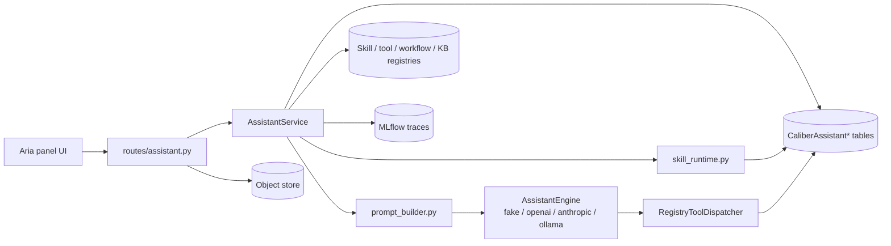
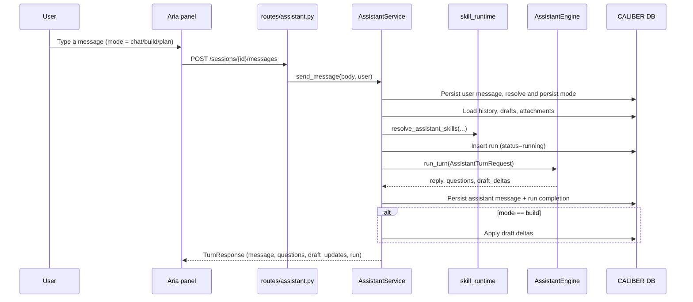
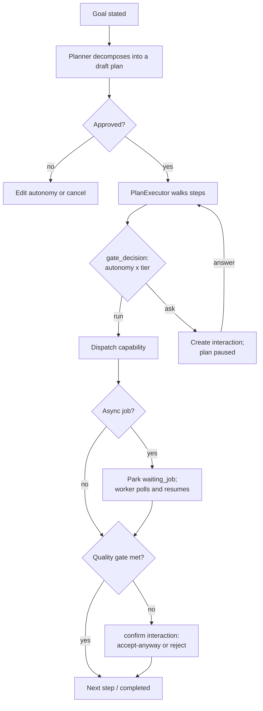

<!-- Generated by docs-site/build-docs.mjs from docs/12-assistant/architecture.md. Do not edit this file: edit the source and re-run the build (caliber/caliber-ui: npm run sync:docs). -->

# Assistant (Aria) Architecture

## At a glance

| Dimension | Aria, CALIBER's embedded authoring assistant |
| --- | --- |
| **What it is** | An in-product agent that turns a chat conversation into governed CALIBER actions — drafting tools, skills, prompts, workflows, and MCP servers. |
| **Session model** | Per-user authoring sessions with turn-by-turn message history, persisted in the `CaliberAssistant*` tables. |
| **Engine** | A pluggable provider behind one `AssistantEngine` protocol (`fake` / `openai` / `anthropic` / `ollama`), selected once at boot in `server.py`. |
| **Interaction modes** | `chat`, `build`, and `plan` — only `build` materializes `draft_deltas`; `plan` creates durable goal-plans via `POST /aria/plans`. |
| **Tool loop** | The OpenAI and Anthropic engines run an agentic tool-calling loop over a per-turn, tier-filtered surface: 29 hand-written tools plus seven capability-registry entries in the current source. It is not read-only or full registry parity: read tools are always eligible, safe/mutate tools depend on build/approval mode, and `gated` capabilities are omitted from synchronous projection. |
| **Approval / governance** | Drafts use validate → test → review/approved-status → publish. The author turn never receives gated approve/publish tools. `agent_review` invokes an isolated approver-scoped reviewer agent; `full_autonomy` adds a distinct operator-scoped release principal. Both fail closed and bind the decision to an immutable candidate hash. Gated goal-plan capabilities still pause for a human. |
| **Trust / safety** | Engine output is a proposal, never an authorization; attachments are capped text snapshots and platform RBAC outranks injected prompt content. |

The sections below start from this picture and drill down into the detail — scope,
module boundaries, runtime path, data model, surfaces, lifecycle, security,
observability, agentic orchestration, and extension points.

## Reference

## 1. Scope and responsibilities

The assistant module is **Aria**, CALIBER's in-product agent for authoring and
operating platform artifacts. Aria is an embedded reasoning and orchestration
layer: it turns a chat conversation into concrete, governed CALIBER actions —
drafting tools, skills, prompts, workflows, and MCP servers, validating and
testing those drafts, and publishing them when the current mode, actor authority,
draft state, and asset policy permit it. Approval and publication are never
model-callable from the author turn. Manual policies use the draft lifecycle
UI/API; `agent_review` and `full_autonomy` instead cross a separate reviewer-agent
boundary, and only the latter continues through a distinct release service. Registry capabilities
classified as `gated` instead pause a durable plan for explicit approval, while
prompt alias publication separately enforces its approval-provenance policy. Because it
is embedded rather than bolted on, admitted actions still flow through CALIBER's
path-specific service and capability controls.

Concretely, Aria owns the following responsibilities:

- It owns per-user authoring **sessions** and their turn-by-turn message
  history.
- It runs a pluggable provider **engine** (fake, OpenAI, Anthropic, or Ollama)
  behind a single `AssistantEngine` protocol, so the rest of the system never
  has to know which provider is active.
- It assembles grounded context for each turn — the selected skills, the current
  drafts, and any user-attached **context attachments** ("+ add files").
- It supports interaction **modes** (chat, build, and plan) that shape its
  behavior the way a code assistant's mode toggle does.
- It manages **drafts** through a validate → test → approved-status → publish
  state machine; the last two transitions are withheld from the authoring tool
  projection and may be crossed only manually or through the independent
  reviewer/release services.
- It runs an intent-driven **plan workbench** (resolve intent → build plan →
  execute) for structured, confirmable single mutations — now used mainly by
  authoring surfaces such as the Prompts page rather than by the assistant
  drawer's Plan mode.
- It runs the **agentic orchestrator** (§9) that decomposes a stated goal into a
  durable, reviewable **plan** of capability-bound steps and walks it under
  supervision — pausing mid-run for permission or choices, enforcing separation
  of duties on gated steps, parking on long-running async jobs, and escalating
  below-quality-gate results instead of silently passing. (In the shipped build
  the default planner proposes steps without populated inputs, so approving a
  create/mutate step hands artifact creation off to the operator's asset page;
  parked async steps advance only via the inline goal-plan card's poll or an
  explicit poll — the standalone Plans page does not poll on its own.) The assistant drawer's
  **Plan** mode now creates these durable plans and renders them as an inline
  goal-plan card; a standalone Plans page and a sidebar "needs you" badge let a
  user leave a plan running and return when it needs a decision. This is the
  "Claude Code for CALIBER" model.
- It exposes runtime **config** (engine, model, reasoning, and disabled
  intents/domains) and surfaces the caller's **access level**.

The behavior described above lives across a small set of backend code paths:

- `caliber/src/caliber/routes/assistant.py`
- `caliber/src/caliber/assistant/service.py`
- `caliber/src/caliber/assistant/models.py`
- `caliber/src/caliber/assistant/engine.py`
- `caliber/src/caliber/assistant/{openai_engine,anthropic_engine,ollama_engine,fake}.py`
- `caliber/src/caliber/assistant/prompt_builder.py`
- `caliber/src/caliber/assistant/tools.py`
- `caliber/src/caliber/assistant/skill_runtime.py`
- `caliber/src/caliber/assistant/{publisher,validators,tracing}.py`
- `caliber/src/caliber/assistant/reviewer.py` (strict reviewer-agent contract)
- `caliber/src/caliber/assistant/{capabilities,plans,executor,plan_worker}.py` (the agentic orchestrator — §9)
- `caliber/src/caliber/routes/aria_plans.py` (the goal-plan HTTP surface)
- `caliber/src/caliber/db/models.py` (the `CaliberAssistant*` and `CaliberAria*` tables)
- `caliber/src/caliber/server.py` (engine selection, service wiring, and the plan-worker lifespan)

The user-facing surface is implemented in a parallel set of frontend code paths:

- `caliber/caliber-ui/src/components/assistant/CaliberAssistantPanel.tsx`
- `caliber/caliber-ui/src/components/assistant/{AttachmentBar,ModeSelector,AssistantSettings,ChatHistory,AccessBadge}.tsx`
- `caliber/caliber-ui/src/components/assistant/{QuestionList,DraftStatusBadge,ArtifactTypeSelector,ValidationPanel,TestPanel,AriaLogo,AssistantPanelContext}.tsx`
- `caliber/caliber-ui/src/components/assistant/AriaPlanCard.tsx` (inline goal-plan card) plus `caliber/caliber-ui/src/{pages/AriaPlans.tsx,components/aria/planView.tsx}` (the standalone Plans page and shared plan-rendering atoms — the orchestrator surface of §9)
- `caliber/caliber-ui/src/api/{caliberApi.ts,assistantTypes.ts}`

The reasoning layer could be extracted behind the existing engine boundary in a
future deployment. This document describes only the **current embedded
architecture** that ships in this repository.

## 2. Module boundaries

Aria's design draws a firm line between orchestration and reasoning, so that the
parts that touch CALIBER state are separable from the parts that talk to a
model. The table below names each responsibility, the component that owns it,
and what that ownership entails.

| Responsibility | Owner | Notes |
| --- | --- | --- |
| Orchestration | `AssistantService` (`service.py`) | Persists turns/runs, assembles context, calls the engine, applies draft deltas, drives intent plans, and advances draft state according to interaction and approval mode. |
| Provider engine | `AssistantEngine` protocol (`engine.py`) | One `run_turn(AssistantTurnRequest) -> AssistantTurnResult` contract; concrete engines in `openai_engine.py`, `anthropic_engine.py`, `ollama_engine.py`, `fake.py`. |
| Engine selection | `server.py` | Picks the engine at boot from `assistant_engine` (default `auto` → a real provider by available API key: OpenAI if `OPENAI_API_KEY`, else Anthropic/Claude if `ANTHROPIC_API_KEY`, else OpenAI). `FakeAssistantEngine` is a deterministic test double, never selected automatically. |
| System prompt assembly | `prompt_builder.py` | Builds one shared system prompt from policy, mode guidance, selected skills, and attached context. |
| Skill selection | `skill_runtime.py` | Deterministic `resolve_assistant_skills` (auto / manual / off) over `CaliberSkill` rows. |
| Fallback registry access | `RegistryToolDispatcher` (`tools.py`) | A three-tool, read-only fallback (`list_skills` / `get_skill` / `list_tools`). Normal service turns pass the richer per-turn toolset below, which overrides this engine fallback. |
| Per-turn agent tools | `AssistantAgentToolset` (`agent_tools.py`) | Binds the actor, session, mode, approval mode, and project to 29 hand-written tools plus a tier-filtered projection of the seven currently registered capabilities. This is partial coverage, not a claim that every CALIBER route has tool parity; `gated` capabilities are never advertised to a synchronous turn. |
| Draft validation / test | `validators.py`, `service.py` | Validates draft artifacts and runs draft tests (tool sandbox, skill render, workflow compile). |
| Independent review | `reviewer.py`, `service.py` | Runs an isolated no-tools reviewer turn, validates its strict JSON decision, enforces approver scope and author/reviewer separation, and persists the decision against candidate hash/version with an expiry. |
| Publishing | `publisher.py`, `service.py` | Publishes drafts whose approved status, reviewer binding, and asset-specific policy permit it. `full_autonomy` requires a release principal distinct from author and reviewer with `operator` scope. |
| Tracing | `tracing.py` | `AssistantTracer` emits MLflow spans with session/correlation/user attributes. |
| Persistence | `CaliberAssistant*` rows (`db/models.py`) | Sessions, messages, drafts, reviewer decisions, runs, publish events, and attachments. |

The result is a layered ownership model: the service assembles and persists the
turn and injects context-bound tool dependencies, the engine reasons and requests
tool calls, and permissioned service/capability handlers perform any admitted
mutation. The seam remains the single `run_turn` contract, but the current tool
surface is deliberately mixed — 29 hand-written operations plus seven projected
registry capabilities — rather than full registry parity.

## 3. Runtime architecture

The components above compose into a single request path that fans out from the
service to skill selection, prompt assembly, the engine, and persistence. The
following diagram traces that path end to end.



```legend
```

Several structural properties of this path are worth calling out, because they
explain why the architecture stays simple as providers and features grow:

- The engine is **pluggable behind one protocol**. The service never branches on
  provider; only `server.py` does, and only once, at boot — so provider-specific
  code stays contained at the edge.
- The engine returns data (`reply`, `questions`, `draft_deltas`), not
  user-facing prose. The service owns persistence, draft application, and run
  bookkeeping, which keeps reasoning and side effects cleanly separated.
- **Context is pre-resolved.** Attachments are reduced to a capped plain-text
  snapshot at attach time, so every engine sees uniform text regardless of the
  underlying source.
- Skill selection is **deterministic and DB-backed**, not model-decided, so the
  same session state always yields the same skill set.
- Mutations remain subject to the current mode, actor scopes, draft state, and
  asset-specific policy. `build` + `auto_all` may perform admitted reversible
  mutations, but no longer self-approves or self-publishes. The two autonomous
  review policies run after the author turn through separate principals. Gated plan capabilities and the
  prompt-alias approval-provenance policy retain their stronger controls.

Together these properties make the engine a replaceable detail and the service
the durable, governed core.

## 4. Data model and state

Aria persists everything it needs to reconstruct and audit a conversation in a
dedicated family of `CaliberAssistant*` tables. Each kind of state maps to one
table with a clear purpose.

| State | Storage | Purpose |
| --- | --- | --- |
| Session | `CaliberAssistantSession` (`caliber_assistant_sessions`) | Per-user authoring conversation; carries `owner`, `status`, `goal`, `active_draft_id`, and a `metadata` JSON bag. |
| Message | `CaliberAssistantMessage` (`caliber_assistant_messages`) | Ordered turn history (`role`, `content`, per-turn `metadata`) with a unique `(session_id, sequence_number)`. |
| Draft | `CaliberAssistantDraft` (`caliber_assistant_drafts`) | Work-in-progress artifact with `spec`, `artifact`, validation/test/review reports, and lifecycle `status`. |
| Review | `CaliberAssistantReview` (`caliber_assistant_reviews`) | Append-only agent decision with mode, immutable candidate snapshot/hash/version, author and reviewer identities, policy/model, rationale, confidence, evidence IDs, and expiry. |
| Run | `CaliberAssistantRun` (`caliber_assistant_runs`) | One engine execution: engine/model, input/output summaries, `trace_id`, `mlflow_run_id`, error. |
| Publish event | `CaliberAssistantPublishEvent` (`caliber_assistant_publish_events`) | Audit row recording a draft published to a registry artifact. |
| Attachment | `CaliberAssistantAttachment` (`caliber_assistant_attachments`) | Context the user attached to a session, with a capped text snapshot. |

The agentic orchestrator (§9) persists its own durable state in a parallel
`CaliberAria*` family, so a plan survives restarts and can be resumed by a
background worker:

| State | Storage | Purpose |
| --- | --- | --- |
| Plan | `CaliberAriaPlan` (`caliber_aria_plans`) | A goal decomposed into ordered steps; carries `goal`, `owner`, `autonomy`, `status`, `visibility`, the originating session/project, and the task contract the planner reasons over — `constraints`, `done_when`, and `context_refs`. |
| Plan step | `CaliberAriaPlanStep` (`caliber_aria_plan_steps`) | One capability-bound action with `inputs`, an optional quality `gate`, `status`, and the captured `result`. |
| Interaction | `CaliberAriaInteraction` (`caliber_aria_interactions`) | A mid-run pause awaiting an answer — `kind` is `confirm` (accept/reject a result) or a permission prompt — with the supporting `evidence`, optional `required_scope`, and resolution. |

Some session state does not warrant its own columns and instead lives in the
session `metadata` JSON bag:

- `assistant_mode` holds the last interaction mode (`chat`, `build`, or `plan`).
- `assistant_skill_runtime` holds the skill mode together with pinned and
  disabled skill names and the last selected skills.
- `intent_workbench` holds the latest resolved intent and plan.
- `assistant_correlation_id` groups a session's traces.

Context attachments are the mechanism behind the "+ add files" affordance, and
they come in four kinds (`AttachmentKind`, `models.py`), each resolved to text
at attach time:

- `object_file` is an existing object-store file (bucket + key), fetched and
  text-extracted at attach time.
- `upload` is a file uploaded directly through the panel; it is text-extracted
  and optionally persisted to the object store.
- `library_resource` is an existing CALIBER asset (prompt, skill, tool,
  workflow, or knowledge_base) resolved into a text summary.
- `text_snippet` is a freeform pasted text block.

Whatever the kind, each attachment stores a `content_text` snapshot capped at
`ATTACHMENT_TEXT_MAX_CHARS` (50k chars) and marked with a `truncated` flag, and
each session is bounded by `max_attachments_per_session` (default 25). These
limits keep the prompt-injection surface and context size predictable.

Drafts move through a single lifecycle, encoded in `DraftStatus`, that mirrors
CALIBER's broader governance progression:

```text
draft → validating → validated | validation_failed
validated → testing → tested | test_failed
tested → approved (manual) | reviewing
reviewing → approved | review_rejected | review_failed
approved → publishing → published | publish_failed
```

The selectable approval policies are deliberately different from capability
risk tiers:

| Policy | Automatic progression after a new draft | Authority boundary |
| --- | --- | --- |
| `manual` | none | operator drives each draft gate |
| `auto_safe` | validate → test | approval/release remain manual |
| `auto_all` | validate → test; legacy mutation-tool admission | deprecated self-approval behavior removed |
| `agent_review` | validate → test → independent review | reviewer must differ from author and carry `caliber.approver`; no publish |
| `full_autonomy` | validate → test → independent review → publish | reviewer as above; releaser must be a third identity with `caliber.operator` |

The reviewer receives no author chat history and no tools. A structured decision
is accepted only when its policy version matches and its confidence clears the
configured floor. Editing the candidate clears its review. Publication rechecks
the durable review row, candidate hash/version, identity separation, and expiry.

## 5. API and interaction surfaces

Aria exposes a CALIBER-owned HTTP API together with a set of frontend entry
points that drive it. All routes are mounted under
`/ajax-api/2.0/mlflow/caliber/assistant` (`_PFX`); the paths below are shown
relative to that prefix.

Session lifecycle is handled by a small CRUD-style set of routes:

- `GET /sessions`
- `POST /sessions`
- `GET /sessions/{session_id}`
- `PATCH /sessions/{session_id}`

Messages and one-shot drafting cover the core conversational turn and a
stateless draft shortcut:

- `GET /sessions/{session_id}/messages`
- `POST /sessions/{session_id}/messages`  (carries `mode`)
- `POST /prompt-draft`

Context attachments back the "+ add files" affordance, with one route per source
plus a deletion route:

- `GET /sessions/{session_id}/attachments`
- `POST /sessions/{session_id}/attachments`  (`object_file` / `library_resource` / `text_snippet`)
- `POST /sessions/{session_id}/attachments/upload`  (multipart file upload)
- `DELETE /attachments/{attachment_id}`

The intent plan workbench drives structured, confirmable mutations through a
resolve → plan → execute progression:

- `POST /sessions/{session_id}/intent/resolve`
- `POST /sessions/{session_id}/plans`
- `GET /sessions/{session_id}/plans/latest`
- `POST /sessions/{session_id}/plans/execute`
- `GET /sessions/{session_id}/operations/{operation_id}`

Drafts and runs expose the validate/test/approve/publish lifecycle and the
records of each engine execution:

- `GET /sessions/{session_id}/drafts`
- `GET /drafts/{draft_id}`
- `PATCH /drafts/{draft_id}`
- `POST /drafts/{draft_id}/validate`
- `POST /drafts/{draft_id}/test`
- `POST /drafts/{draft_id}/approve`
- `POST /drafts/{draft_id}/publish`
- `GET /runs/{run_id}`

Runtime configuration is read and updated through two routes:

- `GET /config`
- `PATCH /config`

The agentic orchestrator (§9) exposes a sibling surface under the
`/ajax-api/2.0/mlflow/caliber/aria` prefix, covering the plan lifecycle and the
mid-run interaction protocol:

- `GET /aria/plans` · `POST /aria/plans`  (decompose a goal — with optional `constraints`, `done_when`, and `context_refs` — into a draft plan)
- `GET /aria/plans/{plan_id}` · `PATCH /aria/plans/{plan_id}`  (edit autonomy / cancel a draft)
- `POST /aria/plans/{plan_id}/approve`
- `POST /aria/plans/{plan_id}/execute`
- `POST /aria/plans/{plan_id}/poll`  (advance any parked async steps)
- `GET /aria/plans/{plan_id}/interactions`
- `POST /aria/interactions/{interaction_id}/answer`  (resume a paused plan)

On the frontend, a focused set of components binds these routes to the user:

- `CaliberAssistantPanel.tsx` is the right-side "Ask Aria" drawer host.
- `ModeSelector.tsx` is the Chat / Build / Plan toggle.
- `AttachmentBar.tsx` is the "+ add context" menu (upload, object store,
  library, and pasted text) together with the attachment chips.
- `AssistantSettings.tsx` edits model, reasoning, and disabled-intents settings
  over `/config`.
- `ChatHistory.tsx` lets the user browse, switch, rename, and archive past
  sessions.
- `AccessBadge.tsx` surfaces the caller's access level from `/me`.
- `AriaPlanCard.tsx` renders a durable goal-plan inline in the conversation and
  drives its lifecycle (approve, execute, resume) together with the mid-run
  interaction prompts.
- `pages/AriaPlans.tsx` is the standalone Plans page for inspecting and resuming
  goal-plans (sharing render atoms in `components/aria/planView.tsx`), and the
  sidebar shows a "needs you" badge counting plans paused awaiting a human
  decision.

## 6. Execution lifecycle

A single chat turn is the workhorse of Aria, and it stitches together
persistence, skill selection, the engine, and mode gating in a fixed order. The
sequence below shows that order for a `POST /sessions/{id}/messages` request.



A few rules govern how that lifecycle behaves in practice:

- **Mode gating** determines what a turn is allowed to produce. `build` is the
  only mode that materializes `draft_deltas`; `chat` and `plan` suppress drafts,
  and the prompt builder injects per-mode guidance to match. In the UI,
  selecting **Plan** now creates a durable goal-plan via `POST /aria/plans` and
  renders it as an inline goal-plan card (§9) rather than calling `send_message`;
  the intent-plan workbench (`/intent/resolve` → `/plans` → `/plans/execute`)
  remains a separate backend path used by authoring surfaces such as the Prompts
  page.
- **Context injection** is how grounding reaches the model. The prompt builder
  (`prompt_builder.py`) adds the selected skills and attachment snapshots to the
  system prompt, while attachments are loaded per turn and passed on
  `AssistantTurnRequest.attachments`.
- **Turn and draft limits** keep sessions bounded. Sessions are capped by
  `max_turns`, `max_questions_per_turn`, and `max_drafts_per_session`, and each
  engine call runs under a `run_timeout_seconds` watchdog.
- **Intent execution** is the structured-mutation path. `execute_intent_plan`
  dispatches to per-intent `_execute_*` adapters (create_tool/skill/workflow/
  mcp_server, prompt write, optimization, eval-dataset save, workflow
  calibration, and propose_promotion).

Each turn therefore produces a complete, auditable result — a persisted message,
an optional set of draft updates, and a run record — before control returns to
the UI.

## 7. Security and trust boundaries

Aria is an authoring agent with access to platform state, so its security model
assumes that engine output is untrusted and that every mutation must clear the
same authorization and asset-specific lifecycle controls as the corresponding
human-driven route. The following controls enforce that assumption.

- Every route requires an authenticated user (`require_user`), and the mutating
  intent-workbench routes — sessions, messages, attachments, drafts, intent-plan
  execution (`POST /sessions/{id}/plans/execute`), and config — require
  `operator` scope. (The agentic `/aria/plans/*` routes are **owner-scoped**, not
  operator-scoped — see the next bullet.)
- Listing another owner's sessions requires `admin` scope; otherwise sessions
  are owner-scoped, and cross-owner reads return empty results or a 404.
- Plans are owner-scoped on **every** route, not just the list: the detail,
  edit, approve, execute, poll, and interactions endpoints resolve the plan
  through `db.scoping.get_visible` with the caller's identity, so a guessed
  `plan_id` from another owner returns 404 (admins bypass). Editing a plan's
  autonomy dial is audited.
- Publishing requires the draft row to be in approved status. The authoring turn
  cannot advertise or dispatch approval/publication. In `agent_review`, an
  approver-scoped principal distinct from the author signs a hash/version-bound,
  expiring decision; in `full_autonomy`, a third operator-scoped release principal
  publishes it. Missing configuration, shared identities, missing scopes, provider
  errors, invalid JSON, low confidence, expiry, or candidate drift all fail closed.
  Human approval remains mandatory for gated goal-plan capabilities. Enabled
  prompt-alias policy accepts either matching promotion provenance or the matching
  durable agent review.
- Attachment content is reduced to a **capped text snapshot** at attach time and
  per-session counts are bounded, which limits both the prompt-injection surface
  and context blowup.
- The legacy engine fallback dispatcher is read-only, but normal OpenAI/Anthropic
  service turns receive `AssistantAgentToolset`: 29 hand-written tools plus the
  allowed subset of seven registered capabilities. Read tools are eligible in
  every mode; safe/mutate tools require the matching build/approval mode; and
  capabilities declared `gated` are omitted from synchronous tool specs and
  dispatch. This is permissioned partial coverage, not a read-only surface or
  complete route-to-tool parity.
- Draft testing runs in the shared local tool containment process rather than
  in the request handler. The runner uses Python isolated mode, an empty
  environment, a private working directory, POSIX CPU/memory/file/open-file
  limits where available, a wall timeout, and process-group termination. This
  prevents in-process execution but is not a container/VM/kernel security
  boundary; deployments that admit mutually untrusted authors still need one.
- In the agentic orchestrator (§9), `gated`-tier capabilities are a
  **non-negotiable floor**: they always pause for a human regardless of autonomy,
  and the tool projection (`agent_tools.py`) refuses to expose them for
  autonomous tool-calling. Approving such a step enforces **separation of duties**
  — the approver must hold the required scope and cannot be the plan owner who
  requested it (an unmapped `required_scope` denies rather than admitting anyone).
  A non-gated permission ask is the plan owner's (or an admin's) to answer — a
  third party cannot approve or deny it.
- Capability **RBAC scopes are enforced at execution**, not just the autonomy
  tier: before a step's handler runs, the executor checks the capability's
  declared `required_scopes` against the **plan owner's** scopes (the principal
  the plan runs on behalf of), so an under-privileged owner's auto-running plan
  can't invoke an operator-only capability. A separate gate-approver and the
  `@system` async poller don't need to hold the capability scope themselves.

Underpinning those controls are two trust boundaries that hold regardless of
what an engine returns:

- Engine output is treated as a proposal, never as an authorization; the service
  re-validates it and routes any mutation through normal governance.
- Platform policy and RBAC outrank any skill or attachment content injected into
  the prompt, so injected text cannot escalate privileges.

## 8. Observability and operations

Because Aria's turns are LLM-driven and provider-configurable, the system is
built so that every turn is traceable, every run is recorded, and the active
configuration is both inspectable and changeable at runtime.

- Every turn opens an MLflow span via `AssistantTracer` carrying
  `caliber.assistant.*` attributes — session id, run id, engine, mode,
  attachment count, and skill-runtime selection.
- `CaliberAssistantRun` rows persist engine/model, input/output summaries,
  `trace_id`, `mlflow_run_id`, and any error, so a turn can be reconstructed
  after the fact.
- A per-session correlation id groups multi-turn traces into one conversation.
- `GET /config` reports the active engine, model, provider, reasoning, and
  disabled intents/domains plus `agent_review` / `full_autonomy` readiness,
  while `PATCH /config` rebuilds both the author and reviewer engine at runtime
  (operator-scoped). The mode selector disables an autonomous policy until its
  service identities and real provider are ready.

These behaviors are driven by configuration on `CaliberConfig`, surfaced through
`CALIBER_ASSISTANT_*` environment variables, grouped here by what they control:

- Engine and model selection: `assistant_enabled`, `assistant_engine`
  (`auto` default / `openai` / `anthropic` / `ollama` / `fake`-for-tests),
  `assistant_model` (empty → the resolved provider's default), and
  `assistant_reasoning`.
- Skill runtime and intent gating: `assistant_skill_runtime_enabled`,
  `assistant_disabled_intents`, and `assistant_disabled_domains`.
- Session bounds: `assistant_max_turns`, `assistant_max_questions_per_turn`, and
  `assistant_max_drafts_per_session`.
- Safety and governance: `assistant_publish_requires_approval`,
  `assistant_reviewer_user`, `assistant_release_user`,
  `assistant_reviewer_policy_version`, `assistant_reviewer_min_confidence`,
  `assistant_review_ttl_seconds`, `assistant_tool_source_max_bytes`, and
  `assistant_run_timeout_seconds`.

## 9. Agentic orchestration (goal → plan → supervised execution)

Beyond drafting a single artifact in a chat turn, Aria can take a stated **goal**
and drive it through CALIBER's processes the way a coding agent drives a
repository: it decomposes the goal into a plan, then walks that plan step by
step, pausing for a human whenever a step needs permission, a choice, or an
approval. (In the shipped build the default `HeuristicPlanner` proposes
capability-bound steps with empty inputs and the interaction answer carries no
input payload, so an approved mutate step — e.g. `judge.create` — runs with
empty inputs and fails validation: Aria plans the work and pauses for approval,
but the operator still creates the artifact on its own asset page.
Auto-populated step inputs are a planned, not-yet-shipped capability.) The conversational assistant (§1–§8) reasons and drafts; the
orchestrator described here is designed to *operate the platform* under supervision. The two
share the same governance and tracing but live in separate, independently
testable modules.

### 9.1 Components

| Responsibility | Owner | Notes |
| --- | --- | --- |
| Capability registry | `capabilities.py` | Single-definition `Capability` objects (key, title, tier, handler) plus a `CapabilityContext`. Handlers reuse the same extracted route helpers as their HTTP paths. The seven builtins today are `judge.list/create`, `review_queue.list/create/add_items`, `eval_dataset.create`, and async `workflow.calibrate`; the shipped planner does not yet populate step inputs, so create-tier steps require operator-supplied inputs rather than autonomous creation. |
| Tool projection | `agent_tools.py` | Adds the allowed registry entries to a separate set of 29 hand-written engine tools. Thus the conversation and plan paths overlap on seven registered capabilities but do not have full surface parity. Mode/approval tier filtering applies, and `gated` capabilities are never projected for synchronous autonomous calling. |
| Planner | `plans.py` (`Planner` protocol, `HeuristicPlanner`) | Decomposes a goal into ordered `PlannedStep`s, each bound to a capability and carrying an optional quality `gate`. The default planner is registry-driven: it matches the capability domain named in the goal (the richer task contract is persisted on the plan for a future state-aware planner). |
| Plan service | `plans.py` (`PlanService`) | Persists plans and steps — including the per-plan task contract (`constraints`, `done_when`, `context_refs`) — with create / get / list / `set_status`. |
| Plan executor | `executor.py` (`PlanExecutor`) | Walks an approved plan, dispatches each step's capability, applies the autonomy gate, raises interactions, parks async steps, and runs the quality-gate / self-correction logic. |
| Plan worker | `plan_worker.py` (`AriaPlanWorker`) | A background asyncio task that periodically polls plans parked on async jobs and resumes them. Wired into the `server.py` lifespan, gated by `background_tasks_enabled` (interval `aria_plan_worker_interval_seconds`, default 10s). |

### 9.2 Lifecycle

A plan moves through `draft → approved → (running) → paused ↔ resumed →
completed` (or `cancelled`). The executor advances steps in order; between steps
it consults the **autonomy dial** to decide whether to run a step or pause for a
human via a `CaliberAriaInteraction`.



```legend
```

### 9.3 Supervision: autonomy × capability tier

Whether a step runs autonomously or pauses is a function of the step's
capability **tier** and the plan's **autonomy** setting (`gate_decision`):

| Tier | `ask_each` | `approve_plan` / `auto_guarded` |
| --- | --- | --- |
| `read` | run | run |
| `safe` | ask | run |
| `mutate` | ask | run |
| `gated` | ask | ask |

`gated` is the non-negotiable floor — it always pauses, and §7 records the
separation-of-duties rule that governs who may approve it.

### 9.4 Async steps and self-correction

Two behaviors make the executor durable rather than a one-shot walk:

- **Async jobs.** A capability whose work is long-running (today,
  `workflow.calibrate`) returns an `AsyncJobHandle` instead of a result. The
  executor parks the step as `waiting_job`, and the `AriaPlanWorker` polls the
  job's status through a `JobStatusResolver` (the `MLflowJobStatusResolver` maps
  refinement-job / eval-run status to `done` / `failed`), resuming the plan when
  the job finishes. `POST /aria/plans/{id}/poll` does the same on demand.
- **Self-correction.** When a step carries a quality `gate` and its result falls
  below the threshold, the executor does not silently pass and does not blindly
  retry — it raises a `confirm` interaction carrying the failing evidence, so a
  human explicitly accepts the below-gate result (preserving it) or rejects it
  (skipping the step). This reuses the same interaction infrastructure as
  permission pauses.

## 10. Extension points and current constraints

Aria's seams make it straightforward to extend along a few well-defined axes:

- New provider engines can be added behind the `AssistantEngine` protocol.
- Richer context attachment kinds and resolvers can be added in the route and
  service layer.
- Additional intent adapters can be added in `service.py`.
- New agentic capabilities are added by registering a `Capability` in
  `capabilities.py` (§9). The goal-plan registry sees them, while the synchronous
  conversational loop projects only capabilities allowed by its mode/approval
  tier and omits `gated` entries. That projection needs no bespoke `_t_*`
  adapter, but it does not make the existing 29 hand-written tools registry-backed
  or establish full parity. A richer planner can be supplied behind the
  `Planner` protocol.
- The reasoning layer can be extracted into a remote backend behind the engine
  protocol; no such service is shipped here.

Equally important are the constraints that hold in the current design, which
callers should plan around:

- Turns are **single-shot**, not streamed; `send_message` returns a complete
  `TurnResponse`.
- Attachment text is snapshotted at attach time and does not refresh if the
  source later changes.
- The OpenAI and Anthropic (Claude) engines run the agentic tool-calling loop
  (read/observe/act within a turn); the Ollama engine is still single-shot and
  receives context purely through the assembled system prompt.
- Raw uploaded files are persisted to the object store only when a target bucket
  is supplied — otherwise only the extracted text snapshot is retained.

Taken together, these properties make Aria the conversational front door to
CALIBER authoring: it reasons over grounded context, drafts governed artifacts,
and drives them through a mode-, scope-, state-, and policy-controlled
validate/test/approve/publish pipeline.
