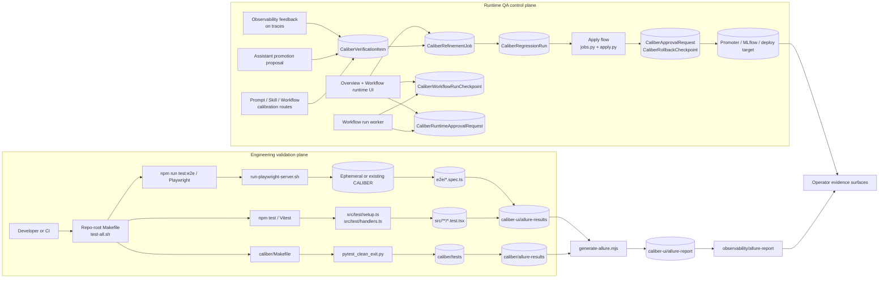
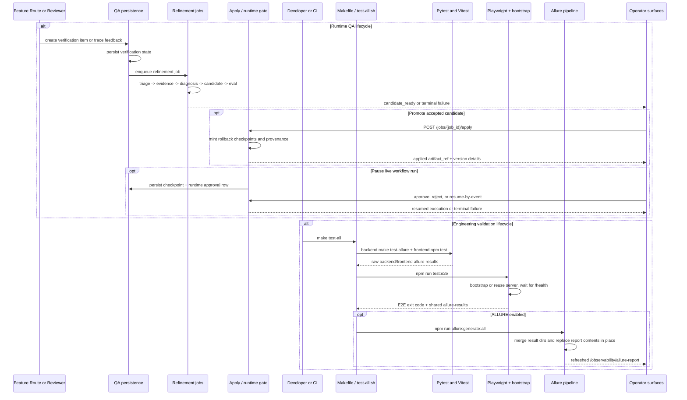

# QA Plan Architecture

This document describes the QA plan, the subsystem in CALIBER that governs
quality for both product behavior and engineering change safety. It explains how
the runtime QA control plane, the engineering validation plane, and the shared
evidence plane are separated, how each one works, and how they converge into a
single operator-facing view of quality. The companion feature documents assume
the substrate established in the platform architecture; this document focuses on
how quality governance is layered on top of it.

Throughout, all runtime QA HTTP routes are mounted under the
`/ajax-api/2.0/mlflow/caliber` prefix. To keep the prose readable, endpoint
paths are shown relative to that prefix once the convention has been stated.

## At a glance

| Dimension | QA plan: quality governance for product behavior and change safety |
| --- | --- |
| **What it is** | The seam where two notions of quality meet, spanning a runtime QA control plane, an engineering validation plane, and a shared evidence plane. |
| **Runtime QA state** | Durable rows — `CaliberVerificationItem`, `CaliberRefinementJob`, `CaliberRegressionRun` — moving artifacts through triage → evidence → diagnosis → candidate → eval → apply. |
| **Runtime approvals** | Paused live runs via `CaliberRuntimeApprovalRequest` + `CaliberWorkflowRunCheckpoint`, kept distinct from artifact promotion history. |
| **Validation suites** | Backend pytest, frontend Vitest, and browser Playwright E2E run from repo-root `Makefile` / `test-all.sh`. |
| **Evidence model** | MLflow assessments, Prometheus counters, dashboard summaries, and merged Allure reports served at `/observability/allure-report`. |
| **Key surfaces** | Runtime QA HTTP routes under `/ajax-api/2.0/mlflow/caliber`; CLI commands like `make test-all` for validation. |

The sections below start from this picture and drill down into the scope, boundaries, runtime, data model, surfaces, lifecycle, security, observability, and constraints in detail.

## Reference

## 1. Scope and responsibilities

The QA plan module in CALIBER is the combined quality-governance architecture
for both product behavior and engineering change safety. It is neither merely a
test runner nor merely a verification queue; it is the seam where two different
notions of quality meet. Concretely, it spans three distinct planes:

- The runtime QA control plane captures verification signals, executes
  refinement jobs, persists regression evidence, applies accepted candidates,
  and pauses live workflow runs for human approval when policy requires it.
- The engineering validation plane runs backend pytest, frontend Vitest, and
  browser E2E suites through stable repo-root entry points.
- The shared evidence plane turns trace feedback, job outcomes, raw test
  artifacts, and merged Allure reports into operator-visible quality proof.

Those planes give the module a deliberately broad mandate. Its responsibilities
are to do the following:

- Capture durable QA signals from prompt optimization, prompt calibration, skill
  calibration, workflow calibration, assistant promotion proposals, and human
  trace feedback.
- Move artifact-level issues through the triage -> evidence -> diagnosis ->
  candidate -> eval -> apply lifecycle with replay-safe provenance. Applications
  originating in refinement retain their signal-to-job lineage; direct release
  actions follow their asset-specific audit path instead of inventing that lineage.
- Enforce runtime approval pauses and checkpoint-based resume semantics for live
  workflow runs without conflating them with offline artifact promotion.
- Provide one-command test orchestration for backend, frontend, and browser
  validation.
- Merge backend and frontend test artifacts into one Allure surface that the
  product can serve directly.
- Expose quality pressure, approvals, regressions, and report artifacts through
  the dashboard, observability, and workflow-runtime surfaces.

These responsibilities are realized across a small set of primary code paths,
which serve as the entry points for the rest of this document:

- `Makefile`
- `test-all.sh`
- `caliber/Makefile`
- `caliber/pyproject.toml`
- `caliber/scripts/pytest_clean_exit.py`
- `caliber/scripts/run-playwright-server.sh`
- `caliber/src/caliber/db/models.py`
- `caliber/src/caliber/schemas.py`
- `caliber/src/caliber/routes/prompts.py`
- `caliber/src/caliber/routes/skills.py`
- `caliber/src/caliber/routes/workflow_calibration.py`
- `caliber/src/caliber/routes/jobs.py`
- `caliber/src/caliber/routes/workflow_runs.py`
- `caliber/src/caliber/routes/capabilities.py`
- `caliber/src/caliber/routes/dashboard.py`
- `caliber/src/caliber/routes/observability.py`
- `caliber/src/caliber/mlflow_client.py`
- `caliber/src/caliber/regression.py`
- `caliber/src/caliber/apply.py`
- `caliber/src/caliber/promoter.py`
- `caliber/src/caliber/observability/metrics.py`
- `caliber/src/caliber/assistant/service.py`
- `caliber/caliber-ui/package.json`
- `caliber/caliber-ui/vitest.config.ts`
- `caliber/caliber-ui/playwright.config.ts`
- `caliber/caliber-ui/scripts/run-vitest-sequential.sh`
- `caliber/caliber-ui/scripts/generate-allure.mjs`
- `caliber/caliber-ui/scripts/check-allure-java.mjs`
- `caliber/caliber-ui/scripts/allure-report.sh`
- `caliber/caliber-ui/src/test/setup.ts`
- `caliber/caliber-ui/src/test/handlers.ts`
- `caliber/caliber-ui/src/pages/Overview.tsx`
- `caliber/caliber-ui/src/pages/WorkflowDetail.tsx`
- `caliber/caliber-ui/src/pages/WorkflowEditor.tsx`
- `caliber/caliber-ui/src/components/workflows/TraceReplayGraph.tsx`
- `caliber/caliber-ui/src/components/workflows/WorkflowRunRecoveryPanel.tsx`
- `caliber/caliber-ui/src/api/caliberApi.ts`
- `caliber/caliber-ui/e2e/`
- `caliber/tests/`

## 2. Module boundaries

Given that breadth, the QA plan is best understood as a set of cooperating
responsibilities rather than a single component. The table below names each
responsibility, the code that owns it, and the role it plays in the wider
quality story.

| Responsibility | Owner | Notes |
| --- | --- | --- |
| Verification-item ingress | `routes/prompts.py`, `routes/skills.py`, `routes/workflow_calibration.py`, `assistant/service.py` | Feature-specific entry points create already-verified items and queued refinement jobs directly. |
| Curated human-review queues | `routes/review_queues.py` + `CaliberReviewQueue` (migration 0054), FE `ReviewQueues.tsx` | Dedicated `/review-queues` CRUD plus enqueue/submit surface for operator-curated review batches. |
| Authored judges | `routes/judges.py` + `CaliberJudge` (migration 0053), FE `Judges.tsx` | `/judges` list/create/detail/update plus `/test-run` and `/alignment`; judges are reusable scorers across calibration, the eval scorecard, and assessments. |
| Durable artifact QA state | `CaliberVerificationItem` + `VerificationItemSchema` | Source of truth for artifact-scoped QA items linked to traces, sessions, workflows, and assessments. |
| Refinement and replay evidence | `CaliberRefinementJob`, `CaliberRegressionRun`, `regression.py` | Tracks staged diagnosis and candidate evaluation separately from final promotion history. |
| Promotion and rollback provenance | `apply.py`, `promoter.py`, `CaliberApprovalRequest`, `CaliberRollbackCheckpoint` | Applies only ready candidates and stores rollback anchors before mutation. |
| Runtime approvals and checkpoints | `routes/workflow_runs.py`, `CaliberRuntimeApprovalRequest`, `CaliberWorkflowRunCheckpoint` | Governs paused live workflow runs and resume-safe recovery. |
| Feedback bridge from traces | `routes/observability.py`, `mlflow_client.py`, `CaliberRuntimeLock` | Human review lands on traces first and can later feed QA-oriented persistence. |
| Repo-root validation orchestration | `Makefile`, `test-all.sh` | Defines the canonical full-suite entry points and final failure semantics. |
| Backend Python tests | `caliber/Makefile`, `caliber/tests/`, `pyproject.toml` | Runs pytest with shared defaults, Allure emission, and the clean-exit wrapper. |
| Frontend unit/component tests | `package.json`, `vitest.config.ts`, `src/test/*` | Uses jsdom, Testing Library, MSW, and serialized workers for deterministic UI coverage. |
| Browser E2E harness | `playwright.config.ts`, `e2e/*.spec.ts`, `run-playwright-server.sh` | Drives real browser flows against an isolated or explicitly reused CALIBER instance. |
| Shared report composition | `generate-allure.mjs`, `allure-report.sh`, `routes/observability.py` | Merges raw results, renders HTML, and serves the final report in-product. |

The architectural separation that matters most inside the QA plan is the split
between the three planes already introduced, because each operates on a
different object and at a different cadence:

- The runtime QA plane owns verification items, refinement jobs, regression
  runs, promotion, rollback, and workflow-run approvals — the state that decides
  whether artifacts and live executions may advance.
- The engineering validation plane owns backend pytest, frontend Vitest, and
  browser E2E execution — the suites that decide whether code changes are safe
  to land.
- The shared evidence plane owns the MLflow assessments, Prometheus counters,
  dashboard summaries, and Allure artifacts that let operators judge the quality
  state produced by the other two planes.

Keeping these planes distinct is what allows runtime promotion safety and
engineering test safety to evolve independently while still reporting into one
view.

## 3. Runtime architecture

The boundaries above resolve, at runtime, into two largely independent execution
systems that meet only at the evidence layer. The diagram below shows the
runtime QA control plane on one side, the engineering validation plane on the
other, and the Allure pipeline that funnels both into operator surfaces.



```legend
```

Several structural properties follow from this topology and are worth making
explicit, because they shape how the QA plan behaves in practice:

- Runtime QA and engineering validation are separate execution systems, yet they
  converge into the same operator-facing evidence model, which is what lets a
  single surface speak to both kinds of quality.
- Artifact QA enters either through feature-specific calibration/test flows or
  through the dedicated `/review-queues` module, so an item's originating feature
  — or an explicitly curated review queue — owns the moment it enters the
  pipeline.
- Runtime approvals are intentionally distinct from artifact promotion
  approvals, even though both belong to the broader QA plan, so that live-run
  control flow and offline promotion history never blur together.
- Backend pytest, Vitest, and Playwright keep independent execution models but
  share one downstream Allure artifact path, which is the only place the two
  planes touch.
- The final Allure report is a served artifact, not the source of truth for
  whether tests ran successfully; the underlying exit codes remain
  authoritative.

## 4. Data model and state

With the runtime established, the next question is where authoritative QA state
lives. The QA plan deliberately uses two kinds of state: durable database rows
for runtime governance, and file- and process-oriented state for the test
plane. That split is intentional, because the two planes have different
durability and recovery needs.

The table below lists the representative state holders, grouped by the plane
they belong to.

| Plane | State holder | Role |
| --- | --- | --- |
| Runtime QA | `CaliberVerificationItem` | Durable artifact QA item with trace, session, workflow, and assessment linkage. |
| Runtime QA | `CaliberRefinementJob` | Multi-stage refinement execution for one verification item. |
| Runtime QA | `CaliberRegressionRun` | Replay/eval record that explains candidate readiness. |
| Runtime QA | `CaliberApprovalRequest` | Apply-time provenance anchor created already approved after governance-table removal. |
| Runtime QA | `CaliberRollbackCheckpoint` | Restore point for rollback after promotion. |
| Runtime QA | `CaliberRuntimeApprovalRequest` | Live workflow-run approval state for paused runtime gates. |
| Runtime QA | `CaliberWorkflowRunCheckpoint` | Resume-safe state snapshot for approval or event waits. |
| Runtime QA | `CaliberRuntimeLock` | Durable lease/checkpoint row for poller-style background coordination. |
| Runtime QA | `CaliberAuditLog` | Append-only history of QA mutations, approvals, promotions, and rollbacks. |
| Engineering validation | `caliber/tests/` | Backend unit, integration, route, storage, workflow, and runtime contract tests. |
| Engineering validation | `caliber/caliber-ui/src/**/*.{test,spec}.{ts,tsx}` | Frontend component, page, API-client, and state-management tests. |
| Engineering validation | `caliber/caliber-ui/e2e/` | Browser-driven full-stack validation flows. |
| Evidence/reporting | `caliber/allure-results/` | Raw backend Allure results emitted by pytest. |
| Evidence/reporting | `caliber/caliber-ui/allure-results/` | Shared raw frontend Allure results for Vitest and Playwright. |
| Evidence/reporting | `caliber/caliber-ui/allure-report/` | Generated HTML report served locally and in-product. |
| Engineering validation | `.tmp/playwright-server-$MLFLOW_PORT/` | Per-port E2E bootstrap state, PID files, logs, DB path, and locks. |

A handful of semantic rules govern how this state behaves, and they hold
consistently across the plane:

- `CaliberVerificationItem.assessment_id` is unique, which makes
  assessment-driven ingest idempotent across retries.
- Verification items preserve origin metadata such as `trace_id`, `session_id`,
  `workflow_id`, `artifact_ref`, and `submitted_context`, so that QA can route
  back to the original asset or execution.
- Refinement jobs own the staged lifecycle and can terminate in
  `candidate_ready`, `applied`, `failed`, or `rejected` states, all of which are
  surfaced by `routes/jobs.py`.
- Runtime approval rows are never reused for artifact promotion history, which
  prevents live-run control flow from mutating promotion provenance.
- The engineering test plane is file- and process-oriented rather than
  database-backed, so its raw evidence lives in result directories and ephemeral
  bootstrap state instead of tables.
- Report generation is downstream of raw artifact emission, which means HTML
  rendering can summarize evidence but cannot recover skipped test execution.

The test plane is also tuned through a set of high-value configuration knobs,
read by the Makefiles and shell scripts that drive validation:

- `ALLURE`
- `ARGS`
- `VENV`
- `PLAYWRIGHT_WORKERS`
- `CALIBER_E2E_USE_EXISTING_SERVER`
- `CALIBER_E2E_BASE_URL`
- `CALIBER_E2E_ENV_FILE`
- `MLFLOW_PORT`
- `CALIBER_SKIP_KNOWLEDGE_WARMUP`

## 5. API and interaction surfaces

Because the QA plan governs two planes, it is reached through two kinds of
surface: HTTP control routes for runtime QA, and CLI-driven commands for
engineering validation. The runtime QA routes are grouped below by purpose,
followed by the validation entry points.

All runtime QA routes live under `/ajax-api/2.0/mlflow/caliber` and are shown
relative to that prefix.

Artifact QA enters the pipeline through the feature-specific calibration and
optimization routes observed in the current checkout:

- `POST /prompts/optimization/runs`
- `POST /prompts/calibration/runs`
- `POST /skills/{skill_id}/calibrate`
- `GET /workflows/{workflow_id}/calibration/options`
- `POST /workflows/{workflow_id}/calibration/runs`

Curated human review enters through the dedicated review-queue and judge
modules:

- `GET`/`POST /review-queues`, `GET`/`PATCH /review-queues/{id}`, and the
  enqueue/submit endpoints (`routes/review_queues.py`, `CaliberReviewQueue`)
- `GET`/`POST /judges`, `GET`/`PATCH /judges/{id}`, `POST /judges/{id}/test-run`,
  `POST /judges/{id}/alignment` (`routes/judges.py`, `CaliberJudge`)

Once items are in flight, the inspection and apply routes drive them toward
promotion:

- `GET /jobs`
- `GET /jobs/{job_id}`
- `GET /jobs/{job_id}/targets`
- `POST /jobs/{job_id}/apply`

A separate set of routes governs runtime QA for live workflow executions, where
the unit of control is a paused run rather than an artifact:

- `GET /workflow-runs/{run_id}/checkpoints`
- `GET /workflow-runs/{run_id}/approvals`
- `POST /workflow-runs/{run_id}/approval/approve`
- `POST /workflow-runs/{run_id}/approval/reject`
- `POST /workflow-runs/{run_id}/resume`
- `POST /workflow-runs/resume-by-event`

Several adjacent routes supply the feedback, capability, and evidence surfaces
the QA plan depends on:

- `POST /observability/traces/{trace_id}/feedback`
- `GET /capabilities`
- `GET /dashboard/summary`
- `GET /observability/allure-report`
- `GET /observability/allure-report/{path:path}`

The engineering validation plane, by contrast, is driven from the command line.
Its canonical entry points are:

- `make test`
- `make test-all`
- `make test-allure`
- `make allure-report`
- `make allure-publish`
- `make allure`
- `./test-all.sh [--no-allure]`
- `cd caliber && make test`
- `cd caliber && make test-allure`
- `cd caliber/caliber-ui && npm test`
- `cd caliber/caliber-ui && npm run test:full:stable`
- `cd caliber/caliber-ui && npm run test:e2e`
- `cd caliber/caliber-ui && npm run test:e2e:workflow-platform`
- `cd caliber/caliber-ui && npm run test:e2e:age`
- `cd caliber/caliber-ui && npm run allure:generate:all`

A few contract nuances are worth noting, because the surface as deployed differs
from the surface the client still anticipates:

- The frontend API client and test mocks still model generic
  `/verification-queue`, `/verification-queue/{id}/verify`,
  `/verification-queue/{id}/dismiss`, `/verification-queue/{id}/duplicate`, and
  `/verification-queue/batch` endpoints.
- The artifact-QA ingress is served by a dedicated queue route module,
  `routes/review_queues.py` (the `/review-queues` CRUD plus enqueue/submit
  surface, backed by `CaliberReviewQueue`, migration 0054, FE page
  `ReviewQueues.tsx`), alongside `routes/judges.py` (`/judges`
  list/create/detail/update plus `/test-run` and `/alignment`, backed by
  `CaliberJudge`, migration 0053, FE page `Judges.tsx`). The narrower claim
  that there is no backend `/verification-queue` route specifically still holds —
  that generic contract above remains only a frontend client stub.
- The engineering validation plane is driven by CLI contracts first and product
  routes second, because report serving is downstream of test execution.

## 6. Execution lifecycle

The two planes also run on two distinct lifecycles, which the sequence below
places side by side. The runtime QA lifecycle advances artifacts and live runs;
the engineering validation lifecycle advances code changes. They never block
each other, and they meet only when their evidence reaches the operator.



The quality story is intentionally split but convergent, and the lifecycle makes
that explicit:

- Runtime QA decides whether artifacts and live executions are safe to advance.
- Engineering validation decides whether code changes are safe to land.
- Both pipelines emit operator-readable evidence rather than relying on hidden
  process state, so the decision of either plane can be inspected after the fact.

## 7. Security and trust boundaries

Quality governance is only as trustworthy as the controls around it, so the QA
plan enforces authorization, isolation, and data-integrity protections at every
point where state can change or code can run. The authorization model anchors
each sensitive action to an explicit scope and feature flag.

The QA plan enforces the following authorization rules:

- Calibration and apply routes require `SCOPE_OPERATOR`.
- Runtime approval decision routes also require `SCOPE_OPERATOR`, and the queue,
  runtime-approval, and checkpointing feature flags must allow the action.
- Observability feedback requires an authenticated user and records that actor
  as the reviewer.

Layered over the authorization model is a set of isolation boundaries that keep
unsafe state and unsafe execution from leaking across the plane:

- Artifact QA is fail-closed: `POST /jobs/{job_id}/apply` rejects any job that is
  not already in `candidate_ready`.
- Runtime approval resume logic validates checkpoint integrity, node identity,
  and policy shape before a live workflow run may continue.
- Vitest defaults to an MSW-backed local trust boundary rather than a live
  backend dependency.
- Playwright only reuses an existing server when explicitly configured to do so;
  otherwise it boots an isolated local instance with per-port state.
- The E2E bootstrap loads only a small allowlist of `.env` values rather than
  importing the entire ambient environment.

A further set of protections defends the integrity of the evidence itself, so
that what operators read can be trusted:

- Assessment ingest is idempotent because `assessment_id` is unique on
  `CaliberVerificationItem`.
- Audit records are appended for item creation, job creation, approval
  decisions, promotions, and rollbacks.
- `pytest_clean_exit.py` calls `os._exit()` only after pytest has already
  computed the real result, which avoids a misleading
  interpreter-finalization crash without masking genuine failures.
- Raw Allure results are evidence artifacts emitted by the test adapters, while
  the report-serving route exposes only static generated content.

Taken together, these controls express a deliberate trust model:

- Human trace feedback is durable reviewer intent, but it is not automatically
  final artifact truth until it has been materialized into QA state and acted
  upon.
- Promotion history and runtime approval history are intentionally split, so a
  live workflow decision can never silently rewrite artifact governance.
- The Allure report is informative evidence, not a replacement for checking the
  underlying suite exit codes.

## 8. Observability and operations

The QA plan is deeply coupled to CALIBER's observability stack, because quality
evidence is only useful if it is inspectable in the same production-like
operator flows as traces and metrics. The operational signals that matter most
are exposed through metrics, the dashboard, the workflow runtime panels, and the
served report.

Operators rely on the following signals:

- `observability/metrics.py` exports verification queue depth, approvals,
  job-terminal outcomes, promotions, and rollbacks as first-class Prometheus
  metrics.
- `dashboard/summary` rolls those counts into the Overview page, which is the
  most visible high-level QA-pressure surface in the current SPA.
- The workflow runtime panels load checkpoints, approval rows, live events, and
  recovery information, so paused or blocked executions can be diagnosed in
  context.
- The generated Allure report is available through
  `/observability/allure-report`, which makes test artifacts part of the same
  operator workflow as traces and metrics.
- Playwright bootstrap state under `.tmp/playwright-server-$MLFLOW_PORT/` is the
  first operational inspection point when the browser harness flakes.

These signals reflect that the planes operate at different tempos, and the
distinctions matter when diagnosing an issue:

- Artifact QA is generally asynchronous and can culminate in promotion.
- Runtime QA is synchronous relative to a live execution and can culminate in
  resume or failure.
- Engineering validation is usually developer- or CI-triggered and culminates in
  exit codes plus report artifacts.
- Observability feedback remains durable even when downstream queue-ingest
  mechanics are unavailable or still evolving.

## 9. Extension points and current constraints

The QA plan is built to grow along its existing seams rather than to be rewired,
and most extensions reuse the row, checkpoint, and Allure patterns already in
place. The primary extension points are:

- New artifact sources can create `CaliberVerificationItem` rows without
  redesigning the refinement, regression, or apply stages.
- Runtime approvals already expose a stable row-plus-checkpoint pattern that can
  be extended to richer policies or multi-actor review.
- New backend or frontend suites can emit into the existing Allure result
  directories and join the same report pipeline.
- `run-playwright-server.sh` already supports existing-server and bootstrap
  modes, which makes new environment profiles straightforward to add.
- The repo-root Makefile exposes stable entry points that CI and local tooling
  can wrap without learning the internals of pytest, Vitest, or Playwright.

Set against those seams are the constraints the QA plan currently accepts, stated
plainly so that future work can weigh them deliberately:

- The generic `/verification-queue` contract still appears in the frontend client
  and test mocks with no matching backend route. The curated-review surface that
  did ship is the dedicated `/review-queues` module (`routes/review_queues.py`,
  `CaliberReviewQueue`/`CaliberReviewItem`, migration 0054) — the
  `/verification-queue` client methods are the vestigial ones, not the queue
  feature as a whole.
- The normalized assessment client and runtime-lock schema clearly prepare for a
  feedback-poller path, but a standalone co-located poller implementation is not
  as obvious as the newer modules in this checkout.
- `CaliberApprovalRequest` now represents apply-time provenance rather than the
  older multi-review governance workflow, so older approval-queue mental models
  are stale for the current codebase.
- `make test-all` does not include linting or `npm run typecheck`, so those
  remain adjacent quality gates rather than part of the canonical full-suite
  path.
- Vitest remains intentionally serialized for stability and Playwright keeps
  `fullyParallel: false`, so throughput is bounded by these determinism choices.
- Direct `npm run allure:generate:all` depends on Java for the npm rendering
  path, while the shell wrapper remains the more portable render option.
- The QA plan is architecturally one quality system but operationally split
  across artifact refinement, workflow runtime control, and engineering test
  execution, so it still does not map to a single isolated microservice boundary
  inside the monolith today.

Taken together, the picture is consistent: the QA plan is one quality system
expressed as three cooperating planes — a runtime control plane, an engineering
validation plane, and a shared evidence plane — that decide, respectively,
whether artifacts, live runs, and code changes are safe to advance, and then
report their verdicts into a single operator-facing surface.
