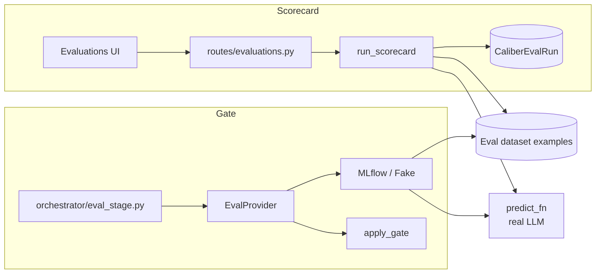
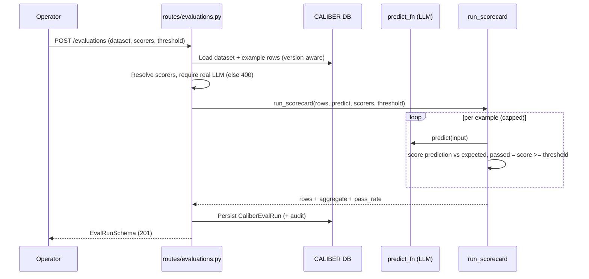

# Evaluation Architecture

This document describes how CALIBER turns a dataset and an artifact into scores.
Evaluation is the scoring engine of the platform: it is consumed both by an
operator-facing **scorecard** surface, where a dataset is run through scorers and
inspected example by example, and by the **refinement and calibration pipeline**,
where a candidate artifact is scored against a baseline and gated before it can be
promoted. The dataset model that supplies the examples is documented separately in
[Test Sets](m-11-test-sets.md), and the pipeline that consumes the
gate is documented in [Calibration](m-15-calibration.md); this
document covers the engine that sits between them.

Throughout, all HTTP routes are mounted under the `/ajax-api/2.0/mlflow/caliber`
prefix; endpoint paths are shown relative to that prefix once the convention has
been stated.

## At a glance

| Dimension | Evaluation engine |
| --- | --- |
| **What it is** | The scoring engine that turns a dataset and an artifact into scores, feeding both a scorecard surface and the refinement gate. |
| **Scorers / judges** | MLflow GenAI judges, scorecard heuristics (`exact_match`, `token_f1`, `contains_expected`, `non_empty`), the workflow LLM judge, and custom judges via `mlflow.genai.make_judge`. |
| **Run targets** | `predict_target` selects what is scored: `llm`, `prompt`, `skill`, or `workflow`. |
| **Human alignment** | `POST /judges/{id}/alignment` reports agreement rate and Cohen's kappa against operator labels. |
| **Where state lives** | Durable `CaliberEvalRun` (`caliber_eval_runs`, migration 0049) plus ephemeral `ScoreSet` / `EvalComparison` types crossing the `EvalProvider` boundary. |
| **Key surfaces** | `GET`/`POST /evaluations` scorecard routes and the internal gate via `orchestrator/eval_stage.py`. |
| **Fail behavior** | Fails closed: no real LLM provider returns `400` and never fabricates scores; per-row errors isolate rather than abort. |

The sections below start from this picture and drill down into the scope, boundaries, data model, lifecycle, and scoring details.

## Reference

## 1. Scope and responsibilities

Evaluation exists so that quality is measured by data rather than asserted by
intuition. The module owns the contract for scoring a set of inputs against
expected references, the adapters that realize that contract on top of MLflow or a
deterministic in-process scorer, and the gate that converts raw scores into a
promote-or-reject decision. It deliberately never fabricates a score: when no real
model is configured, the scoring path fails closed rather than inventing numbers.

Its responsibilities are:

- It defines the provider contract (`EvalProvider`) and the score, comparison, and
  request data types that flow across it.
- It runs candidate-versus-baseline evaluations for the refinement pipeline and
  computes the per-dimension deltas the gate inspects.
- It runs synchronous, per-example scorecard evaluations for the standalone
  Evaluations surface and persists their full results.
- It applies the promotion gate — the aggregate-score floor and the
  regression-delta ceiling.
- It hosts the scorer catalog and its capability gating, spanning MLflow GenAI
  judges, deterministic heuristics, the workflow LLM judge, and operator-authored
  **custom judges** built via `mlflow.genai.make_judge` (these families serve
  different callers and are not fully interchangeable on one surface — see §7 and
  §10: the deterministic heuristics **and** operator-authored custom judges (as
  `Judge.<judge_id>` scorer tokens) are selectable on the Evaluations scorecard
  surface, while the built-in MLflow-GenAI and workflow judge families run on the
  calibration and gate path).

These responsibilities are realized across a small set of primary code paths:

- `caliber/src/caliber/eval/provider.py`
- `caliber/src/caliber/eval/mlflow_runner.py`
- `caliber/src/caliber/eval/fake.py`
- `caliber/src/caliber/eval/gate.py`
- `caliber/src/caliber/eval/scorecard.py`
- `caliber/src/caliber/eval/predict.py`
- `caliber/src/caliber/routes/evaluations.py`
- `caliber/src/caliber/routes/judges.py`
- `caliber/src/caliber/orchestrator/eval_stage.py`
- `caliber/caliber-ui/src/pages/Evaluations.tsx`
- `caliber/caliber-ui/src/pages/Judges.tsx`

## 2. Module boundaries

CALIBER carries two evaluation subsystems that share scoring concepts but serve
different callers. The first is the refinement gate, which compares a candidate to
a baseline and returns a structured decision. The second is the scorecard surface,
which scores a dataset row by row and stores the evidence for inspection. The table
below assigns ownership across both.

| Responsibility | Owner | Notes |
| --- | --- | --- |
| Provider contract | `EvalProvider` protocol (`eval/provider.py`) | A single `evaluate(EvalRequest) -> EvalComparison`; failures are wrapped in `EvalProviderError` rather than leaking the backend exception. |
| MLflow scoring | `MLflowEvalProvider` (`eval/mlflow_runner.py`) | Runs `mlflow.genai.evaluate` per pass (candidate, baseline) and aggregates `result.metrics` into a `ScoreSet`. |
| Deterministic test double | `FakeEvalProvider` (`eval/fake.py`) | The default provider; returns fixed scores for tests and honors cold-start when no baseline content is supplied. |
| Promotion gate | `apply_gate` (`eval/gate.py`) | A pure function turning an `EvalComparison` plus thresholds into a `GateDecision`. |
| Scorecard run | `run_scorecard` (`eval/scorecard.py`) | Per-example prediction and scoring with per-row error isolation; the basis of the Evaluations surface. |
| Real-LLM prediction | `build_completion_fn` (`eval/predict.py`) | Builds the completion function from configuration; returns `None` for fake/unset providers so callers fail closed. |
| Scorecard persistence | `CaliberEvalRun` (`db/models.py`, migration 0049) | Stores run config, recomputed summaries, and the heavy per-example `results` array. |

## 3. Runtime architecture

The two subsystems converge on the same idea — predict, then score — but reach it
through different entry points, as the diagram shows.



```legend
```

Several structural properties follow from this split:

- Scoring is **provider-mediated**: callers depend on the `EvalProvider` contract,
  and only `server.py` selects the concrete provider at boot via `build_provider`.
- The engine **fails closed**: `build_completion_fn` returns `None` for unset,
  `fake`, or `deterministic` providers, so the scorecard route returns `400` and
  the gate's default factory is absent rather than producing fabricated scores.
- Reproducibility is built in: every evaluation can pin an
  `eval_dataset_version`, and the loaders select the historical example set as of
  that version.
- The two subsystems persist differently: the scorecard writes a durable
  `CaliberEvalRun`, while the gate returns an in-memory `EvalComparison` that the
  refinement job stores as part of its own provenance.

## 4. Data model and state

Evaluation state lives in two places: ephemeral data types that cross the provider
boundary, and the durable scorecard run.

| State | Storage | Purpose |
| --- | --- | --- |
| Score set | `ScoreSet` (`eval/provider.py`) | `overall: float` plus a `dimensions` map; `overall` is what the gate compares to the score floor. |
| Comparison | `EvalComparison` (`eval/provider.py`) | Candidate and optional baseline `ScoreSet`s, the per-dimension `deltas`, the dataset id, and the example count. |
| Request | `EvalRequest` (`eval/provider.py`) | Carries candidate/baseline content, the pinned dataset id and version, and the scorer names, configs, and weights. |
| Scorecard run | `CaliberEvalRun` (`caliber_eval_runs`) | Run config (`label`, `predict_target`, `model`, `scorers`, `pass_threshold`), server-recomputed summaries, the full per-example `results`, and `status`/`error_message`. |

The provider applies scorer weights with `apply_scorer_weights`, which recomputes
`overall` as a weighted mean over the named dimensions and rounds to four decimal
places, leaving the score unchanged when the weights sum to zero. The scorecard
run is deliberately summary-rich: `n_examples`, `passed_count`, `failed_count`,
`overall_score`, `pass_rate`, and a per-scorer `aggregate` map are recomputed
server-side so list views never have to parse the heavy `results` array.
Migration 0049 creates `caliber_eval_runs` with these columns and the
`(dataset_id, created_at)` and `created_at` indexes.

## 5. API and interaction surfaces

The scorecard surface exposes three routes, all mounted under the standard prefix.

- `GET /evaluations` — lists run summaries, filterable by `dataset_id`, with
  project-visibility scoping and the heavy `results` array omitted.
- `GET /evaluations/{run_id}` — returns the full run including per-example results.
- `POST /evaluations` — creates and runs an evaluation synchronously.

Creation accepts an `EvalRunCreateRequest` (`dataset_id`, optional
`dataset_version`, `label`, `scorers`, `pass_threshold` defaulting to `0.5`, and an
optional `max_examples`). The request is version-aware: an explicit
`dataset_version` selects the historical example set, while its absence uses the
current active set. The route requires a real LLM provider and returns `400` when
none is configured, so the Evaluations surface can never display fabricated scores.

The refinement gate has no public route of its own; it is invoked internally by the
calibration pipeline through `orchestrator/eval_stage.py`, which builds an
`EvalRequest`, calls the provider, and applies the gate.

## 6. Execution lifecycle

A scorecard run is synchronous and bounded, which keeps the request predictable and
the per-example evidence complete.



The lifecycle is governed by a few firm rules:

- Runs are capped: the example count is limited to `max_examples` or a default of
  `50`, because each example costs one LLM call and the run blocks the request.
- Failures are isolated per row: a prediction that raises degrades that single row
  to an error with a zero score rather than aborting the run; only when every row
  errors is the run marked `failed`.
- The gate path mirrors this but compares two passes: the provider runs the
  candidate and, when present, the baseline, then computes deltas for the gate.

## 7. Scoring, gating, and trust boundaries

Three scorer families coexist, each suited to a different caller. Naming them
explicitly avoids confusing a deterministic heuristic with an LLM judgment.

- **MLflow GenAI judges**, used by the refinement gate: `Correctness`,
  `Guidelines` (requires a configured guideline list), `RelevanceToQuery`, and
  `Safety`, plus provider-prefixed `DeepEval.*` metrics
  (`AnswerRelevancy`, `Faithfulness`, `Toxicity`, `ToolUse`). The default suite is
  `Correctness`, `Guidelines`, `RelevanceToQuery`, and `Safety`.
- **Scorecard heuristics**, used by the Evaluations surface: `exact_match`,
  `token_f1` (SQuAD-style token-overlap F1), `contains_expected`, and `non_empty`.
  The default set is `exact_match`, `token_f1`, and `contains_expected`.
- **The workflow LLM judge**, used by workflow calibration, which scores a single
  quality dimension and degrades to a structural scorer when unavailable.

The `DeepEval.*` family is capability-gated: when the `deepeval` package is not
importable, those scorers are marked unavailable with an install hint and excluded
from the defaults, so a missing optional dependency degrades cleanly instead of
failing a run.

The gate itself is a pure function. It reads `min_aggregate_score` (default `0.85`)
and `max_regression_delta` (default `0.02`) from the agent's thresholds, falling
back to those defaults, and applies two rules: the candidate's `overall` must meet
the score floor, and — only when a baseline exists — no per-dimension delta may
fall below the negative regression ceiling. Cold-start evaluations, which have no
baseline, skip the regression rule entirely. The decision carries its reasons and
the thresholds it used.

This verdict is also surfaced **advisorily** per artifact version. A single row
per `(artifact_type, version_key)` lives in `caliber_gate_verdicts` (migration
`0062`) and is read and upserted through `GET`/`POST /gate-verdicts/{artifact_type}/{version_key}`
(`gate_verdicts.py`); the prompt promote path stamps it from the supplied gate
fields so the version surface shows `pass`/`fail`/`none` before a promotion. The
verdict is strictly advisory — it never blocks an alias rotation — and `state` is
authoritative over both gate rules, with the numeric columns kept only as display
detail.

The trust boundary is that scores must be earned: creating a scorecard run requires
the `operator` scope, evaluation requires a real configured LLM provider, and
version pinning makes a run reproducible against the exact example set it scored.

## 8. Observability and operations

Evaluation is configured through a small set of keys and leaves durable evidence
behind. The provider is selected by `eval_provider` (env `CALIBER_EVAL_PROVIDER`),
which defaults to `fake`; production deployments set it to `mlflow`. The
prediction path is driven by `llm_provider`, `llm_diagnosis_model`, and
`llm_api_key_env`, and the completion function returns `None` for unset or fake
providers — the mechanism that makes the engine fail closed.

For inspection, the scorecard persists the full per-example `results` on each
`CaliberEvalRun`, and the refinement gate's `EvalComparison` is stored on the
refinement job alongside provenance tags such as the aggregate score, the example
count, the regression-detected flag, and the gate outcome. Runs are listed by
dataset and read individually; comparison between runs is performed client-side
from the persisted summaries and results rather than by a dedicated server route.

## 9. Extension points and current constraints

The clearest extension points are new scorers and new providers. Provider-prefixed
scorers (the `DeepEval.*` convention) show how additional judge libraries can be
surfaced behind capability gating, scorer weights allow re-balancing dimensions
without changing the scorers themselves, and the `EvalProvider` contract admits new
backends behind the same `evaluate` call.

The current constraints are deliberate trade-offs. Scorecard runs are synchronous
and capped, which keeps evidence complete but bounds dataset size per run. There is
no server-side run-comparison endpoint; comparison is a client concern over the
persisted runs. And gate thresholds are per-agent rather than global, which keeps
promotion policy close to the artifact it governs at the cost of a single
platform-wide knob.

Evaluation is therefore the measurement substrate beneath both inspection and
promotion: it scores honestly or not at all, it records enough to be audited, and
it hands the calibration pipeline a single, well-defined gate decision.

## 10. Custom LLM judges

Beyond the built-in scorer catalog, operators can author reusable **custom
judges** backed by MLflow 3.14's `mlflow.genai.make_judge`. A judge is a named,
natural-language rubric — instructions that reference the evaluation variables
`{{ inputs }}`, `{{ outputs }}`, and `{{ expectations }}` — plus an optional model
and a feedback value type (`bool` / `int` / `float` / `str`). They are managed on
the **Judges** page and stored in `caliber_judges` (migration `0053`), scoped and
archived like the other CALIBER assets. A schema validator enforces that the
instructions reference at least one evaluation variable so a judge always has
something to score. Updating a judge records the full from/to value diff in the
audit row (not just the changed field names), so a judge's prior instructions and
model stay recoverable after an edit — historical eval runs cite a judge by token
only, so this is what keeps their verdicts interpretable.

CALIBER is the source of truth for the definition; the judge is rebuilt
deterministically on every run rather than persisted in MLflow. Every judge in
the platform is now built one way — through the shared
`caliber.eval.judge_scorer.build_judge(...)` wrapper around `make_judge` — and run
one way, via `score_with_judge(...)`, which invokes the judge on literal
`inputs` / `outputs` / `expectations` fields and coerces the returned `Feedback`
into a `[0, 1]` score plus its raw verdict and rationale. `make_judge` itself is
OSS and needs no Databricks workspace.

### Judges on the Evaluations scorecard

Authored judges are selectable directly in the Evaluations run panel, not just
the refinement gate. A judge rides through the run's `scorers` list under the
reserved token `Judge.<judge_id>`; `routes/evaluations` hydrates each token from
`caliber_judges` (404 on unknown/archived), builds the judge through
`build_judge`, and passes it to `run_scorecard` as a judge-runner alongside the
deterministic scorers. The scorecard threads each example's full
inputs/prediction/expected into the judge and records its per-row score in the
same `scores` map as `exact_match` et al.; one judge failing a row degrades that
cell to an error rather than voiding the run. Judge columns render with the
judge's name and are compared run-over-run like any other scorer.

### Scoring a real artifact

A run's `predict_target` selects *what* is scored. The default `llm` produces a
generic completion; `prompt` and `skill` instead render the **artifact itself**
(a registered prompt version's template, or a skill's content) as the system
instruction via the gate's `build_default_predict_fn_factory`, so the thing under
test is the real asset, not a neutral completion. `workflow` compiles the version
**once** (the same `caliber.workflows.promoter` `build_plan` + `build_executor`
seam the preview/run paths use) and then executes that plan per example in
preview mode (tools sandboxed), scoring the workflow's output; because a workflow
run is heavy, the example count is bounded tighter (`_WORKFLOW_MAX_EXAMPLES`) than
the generic cap. Every run records `predict_target` + `subject_ref` (prompt
`<name>@<version>`, skill id, or workflow version id) for reproducibility.

### "Try it" playground and human alignment

Two trust surfaces close the loop on judge quality. `POST /judges/{id}/test-run`
runs a judge once on a sample (no persistence) and returns its score, raw
verdict, and rationale — the **"Try it"** playground on the Judges page. `POST
/judges/{id}/alignment` runs the judge over operator-labeled examples and reports
the **agreement rate and Cohen's kappa** (chance-corrected) between the judge's
thresholded verdicts and the human labels, plus a binary confusion breakdown
(`caliber.eval.alignment`). A judge that doesn't agree with humans shouldn't gate
releases; alignment makes that measurable before the judge is trusted.
