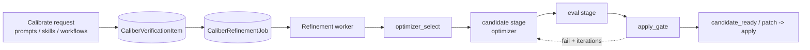
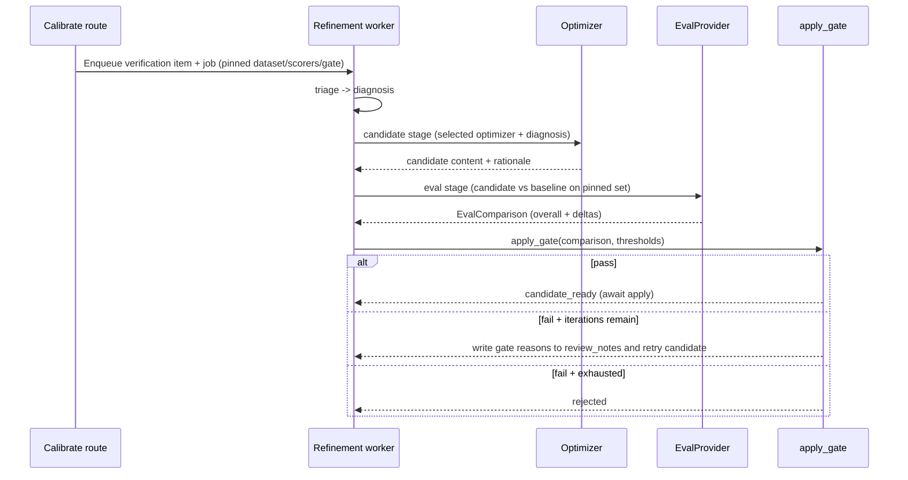

# Calibration Architecture

This document describes how CALIBER improves an existing artifact against evidence.
Calibration is the act of taking a prompt, skill, tool, or workflow and tuning it
until it scores well on a test set — generating a better candidate, measuring it,
and gating its promotion. It builds directly on two neighbours: the test sets that
supply examples ([Test Sets](../11-test-sets/architecture.md)) and the scoring
engine that grades candidates and owns the gate
([Evaluation](../14-evaluation/architecture.md)). This document focuses on the
calibration machinery itself and on the distinct algorithm used for each asset
type.

Throughout, all HTTP routes are mounted under the `/ajax-api/2.0/mlflow/caliber`
prefix; endpoint paths are shown relative to that prefix once the convention has
been stated.

## At a glance

| Dimension | Calibration |
| --- | --- |
| **What it is** | The platform's improvement loop — tune an artifact against evidence, then gate its promotion. |
| **What it calibrates** | Prompts, skills, and workflows via an async optimization pipeline; tools via a synchronous deterministic suite. |
| **Scoring path** | One shared `caliber.eval.judge_scorer.build_judge` wrapper over `mlflow.genai.make_judge`, run through `score_with_judge`. |
| **Optimizers** | Five implemented (`MetaPrompt`, `GEPA`, DSPy BootstrapFewShot, DSPy MIPROv2, `SkillMetaPrompt`); the form advertises only `MetaPrompt` and `GEPA`. |
| **Tool calibration** | `calibrate_tool` replays saved test cases inline in the preview sandbox and writes a pass rate to `last_calibration` — no worker, optimizer, or gate. |
| **Where state lives** | `CaliberVerificationItem`, `CaliberRefinementJob`, `CaliberAgentConfig`, `CaliberWorkflowPatch`, plus tool `last_calibration` / `CaliberToolTestRun`. |
| **Key surfaces** | `POST /prompts/calibration/runs`, `POST /skills/{skill_id}/calibrate`, `POST /tools/{tool_id}/calibrate`, `POST /workflows/{workflow_id}/calibration/runs` (all need the `operator` scope). |

The sections below start from this picture and drill down into the calibration
machinery, the per-asset algorithms, and the trust boundaries that keep it a
proposal rather than a publish.

## Reference

## 1. Scope and responsibilities

Calibration turns "this artifact could be better" into a measured, gated change.
CALIBER carries two calibration systems that share the word but little else. The
first is an **asynchronous optimization pipeline** shared by prompts, skills, and
workflows: it diagnoses a weakness, generates a candidate with an optimizer, scores
it through the evaluation engine, and gates promotion. The second is a
**synchronous deterministic suite** for tools: it replays saved test cases through
the preview sandbox and records a pass rate. Recognizing that these are different
mechanisms — not two views of one mechanism — is the key to reading this document.

Its responsibilities are:

- It selects an optimizer for a calibration job and generates a candidate artifact
  from a structured diagnosis.
- It loads a training and evaluation set from the pinned test set so candidates are
  measured against fixed evidence.
- It scores prompt, skill, and workflow candidates through the evaluation gate and
  drives the self-correction loop when a candidate falls short.
- It scores tool test cases deterministically in the preview sandbox and records
  the result on the tool.
- It keeps calibration a *proposal*: a winning candidate becomes a draft or a patch
  that still flows through the normal apply and approval path.

These responsibilities are realized across the following primary code paths:

- `caliber/src/caliber/routes/prompts.py`
- `caliber/src/caliber/routes/skills.py`
- `caliber/src/caliber/routes/tools.py`
- `caliber/src/caliber/routes/workflow_calibration.py`
- `caliber/src/caliber/orchestrator/optimizer_select.py`
- `caliber/src/caliber/orchestrator/candidate.py`
- `caliber/src/caliber/orchestrator/eval_stage.py`
- `caliber/src/caliber/llm/openai_agents.py`
- `caliber/src/caliber/llm/dspy_optimizer.py`
- `caliber/src/caliber/workflows/calibration.py`
- `caliber/src/caliber/workflows/judge.py`
- `caliber/src/caliber/calibration.py`
- `caliber/src/caliber/eval/gate.py`

## 2. Module boundaries

The two systems divide along a clear line: the optimization pipeline is queued and
processed by a background worker, while the tool suite runs inline in the request.
The table assigns ownership across both.

| Responsibility | Owner | Notes |
| --- | --- | --- |
| Optimizer selection | `select_optimizer` (`orchestrator/optimizer_select.py`) | Chooses an optimizer from the job pin, the agent override, or diagnosis-driven heuristics. |
| Candidate generation | `run_candidate` (`orchestrator/candidate.py`) + `llm/openai_agents.py` | Builds optimizer-specific context and calls the provider to produce a candidate. |
| DSPy bridge | `llm/dspy_optimizer.py` | Few-shot and MIPRO optimizers; `dspy` is eager-imported and folded into the `[llm]` extra (not a separate lazy `[dspy]` import), with a MetaPrompt fallback when the trainset is empty. |
| Candidate scoring + gate | `orchestrator/eval_stage.py` + `eval/gate.py` | Scores the candidate through the `EvalProvider` and applies the promotion gate. |
| Hidden runtime identity | `prompt_targets.py`, `skill_targets.py` | Auto-provisions `CaliberAgentConfig` identities so prompts and skills calibrate without a user-managed agent. |
| Tool suite scoring | `calibrate_tool` (`routes/tools.py`) + `calibration.py` | Runs saved test cases in the preview sandbox and scores assertions deterministically. |
| Workflow candidate search | `workflows/calibration.py` + `orchestrator/workflow_stages.py` | Generates manifest-patch candidates, replays them over examples, scores, and gates. |
| Workflow quality judge | `workflows/judge.py` | An optional LLM judge that overrides the structural quality dimension, with a structural fallback. |

## 3. Runtime architecture

The optimization pipeline is the spine that prompts, skills, and workflows share. A
request enqueues a verification item and a refinement job; a background worker then
advances the job through ordered stages, calling the optimizer and the evaluation
gate, and a successful candidate becomes a draft or patch awaiting apply.



```legend
```

Tool calibration deliberately sits outside this spine. The `calibrate_tool` route
runs the saved test cases inline through the preview sandbox and writes the result
to the tool row; there is no worker, optimizer, candidate, or gate. Several
structural properties follow:

- The shared pipeline is **stage-driven**: the worker reads the job's current stage
  and dispatches triage, diagnosis, candidate, and eval in order, so a stalled or
  retried job resumes from its recorded stage.
- Calibration **proposes, it does not publish**: a passing prompt or skill becomes
  `candidate_ready` for an operator to apply, and a winning workflow candidate
  becomes a `CaliberWorkflowPatch` that re-enters the eval-and-approval path.
- Default execution is conservative: with no real provider configured, candidate
  generation falls back to MetaPrompt and workflow scoring uses a fake executor and
  structural scorer, so the pipeline runs end to end without inventing quality.

## 4. Data model and state

Calibration state is carried by the refinement job and a few asset-specific stores.

| State | Storage | Purpose |
| --- | --- | --- |
| Calibration request | `CaliberVerificationItem` | The queued signal, with `category` (e.g. `prompt_optimization`, `skill_calibration`, `workflow_calibration`) and the pinned optimizer, scorers, gate, and dataset captured in `submitted_context`. |
| Job state | `CaliberRefinementJob` | `current_stage`, the generated `candidate`, the `eval_results`, the `refine_iteration` counter, and (for workflows) the `calibration_spec`. |
| Hidden target | `CaliberAgentConfig` keyed `skill::{name}` or by prompt name | Provides an `agent_id` for jobs, traces, and thresholds without appearing in agent inventory. |
| Tool suite result | `tool.last_calibration` (JSON on `CaliberToolRegistry`) | The latest pass rate, per-case outcomes, and `ran_at` timestamp from the deterministic suite. |
| Durable tool runs | `CaliberToolTestRun` | Render/suite/hardening run history with a pinnable `baseline_run_id` for diffing. |
| Workflow candidate | `CaliberWorkflowPatch` | The winning manifest patch that re-enters the refinement eval and approval path. |

The promotion gate's thresholds — `min_aggregate_score` (default `0.85`) and
`max_regression_delta` (default `0.02`) — are read from the agent's
`eval_thresholds`, so promotion policy travels with the artifact rather than living
in one global setting.

## 5. API and interaction surfaces

Each asset exposes its own calibration entry point, and all require the `operator`
scope to start a run.

- `GET /prompts/calibration/options` and `POST /prompts/calibration/runs` — prompt
  optimization; the `optimization/*` paths are aliases that share the same
  handlers. Options advertise the optimizers offered on the form (`MetaPrompt` and
  `GEPA`), the scorer catalog, and the default gate.
- `POST /skills/{skill_id}/calibrate` — skill calibration; intentionally minimal
  (an optional optimizer and notes), because the runtime identity is auto-created.
- `PUT /tools/{tool_id}/test-cases` and `POST /tools/{tool_id}/calibrate` — save the
  test-case suite and run it.
- `GET /workflows/{workflow_id}/calibration/options` and
  `POST /workflows/{workflow_id}/calibration/runs` — workflow calibration; the run
  is enqueued, not executed inline.

The prompt and skill runs return the created verification item and refinement job;
the workflow run does the same; the tool run returns its pass rate and per-case
results synchronously.

## 6. Per-asset calibration algorithms

One scoring path. Every LLM-as-judge metric in CALIBER — the refinement gate's
`Judge.*` scorers here, the Evaluations scorecard, and knowledge-base
faithfulness / answer-correctness — is now built through the single shared
`caliber.eval.judge_scorer.build_judge` wrapper around `mlflow.genai.make_judge`
and run through `score_with_judge`. There is no longer a hand-rolled
"prompt → LLM → regex-parse a score" loop anywhere in the calibration surfaces;
the KB judges in `knowledge/calibration.py` build two `make_judge` judges
(faithfulness, answer-correctness) via `build_kb_judge` instead. That single,
trusted scorer is what release-readiness, online monitoring, and Aria's
evaluate-then-gate all stand on.

The four assets differ most in how a candidate is produced and scored. The shared
pipeline sequence is the same for prompts, skills, and workflows:



### Prompts

Prompt calibration generates a rewritten prompt from a diagnosis and measures it on
the pinned test set. The optimizer is chosen by `select_optimizer` with a clear
precedence: a manual pin on the job wins, then an agent-level override, then
diagnosis-driven heuristics. The engine implements five optimizers, though the
calibration form advertises only the first two:

- **MetaPrompt** — a single LLM pass through the OpenAI Agents SDK. The candidate
  agent receives the current prompt, the structured diagnosis, and any reviewer
  guidance, and returns a minimal edit that preserves directives not implicated by
  the diagnosis. It is also the universal fallback when another optimizer is
  unavailable.
- **GEPA (Genetic-Pareto)** — delegates to MLflow's `GepaPromptOptimizer`, which
  evolves a population of prompt variants over generations using reflective
  mutation and Pareto-aware selection. CALIBER seeds it with a minimal synthetic
  trainset because its own evaluation gate, not GEPA's internal metric, is the real
  quality check. GEPA is auto-selected when the diagnosis signals competing
  objectives, low confidence, several alternatives, or prior rollbacks; if the
  `gepa` package is absent it falls back to MetaPrompt.
- **DSPy BootstrapFewShot** — wraps the prompt as a DSPy program, bootstraps
  few-shot demonstrations from the training examples whose outputs pass a
  deterministic containment metric, and appends them as a few-shot block without
  rewriting the instruction. It is opt-in and only selected when the diagnosis
  cites a few-shot need.
- **DSPy MIPROv2** — the same program wrapping, but jointly searches over candidate
  instructions and demonstrations under an `auto` budget preset, carrying the
  optimized instruction body plus a demo block.
- **SkillMetaPrompt** — the skill specialization described below.

The DSPy optimizers live in `llm/dspy_optimizer.py`, which eager-imports `dspy`
(shipped in the `[llm]` extra, not a separate `[dspy]` extra); the candidate
stage falls back to MetaPrompt when DSPy is unavailable, when a runtime block is
set, or when the trainset is empty. After generation, the candidate stage advances the job to the
eval stage, which scores the candidate against the baseline and applies the gate;
on failure with iterations remaining, the gate's reasons are fed back as review
notes and the candidate stage runs again.

### Skills

Skill calibration reuses the entire prompt pipeline, differing only in identity and
default optimizer. The `calibrate` route auto-provisions a hidden
`CaliberAgentConfig` keyed `skill::{name}`, so a skill behaves like a testable unit
without polluting the agent inventory, and the baseline content is read from the
active skill rather than a registry prompt. The default optimizer is
`SkillMetaPrompt`. By design it is a MetaPrompt specialization that should preserve
XML structure and validate `allowed_tools`; in the current production provider it
runs the MetaPrompt code path, and that specialization remains an aspiration rather
than implemented behavior, so the doc records it as such. Training examples for the
DSPy optimizers are loaded from the agent's pinned eval dataset, selecting the
historical example set when a version is pinned.

### Tools

Tool calibration is the outlier: a synchronous, deterministic suite with no LLM,
optimizer, or candidate. An operator first saves a set of test cases, each a
`{name, input, assertion}` triple where the assertion is `no_error`,
`output_contains`, or `equals`. Calibration then runs every saved case through the
same preview-sandbox invocation the one-off test path uses — `make_preview_callable`
mocks `write` and `external_action` tools and runs `read` tools live only when they
are explicitly preview-safe — and scores each case with `evaluate_assertion`: any
raised error fails the case, and otherwise the assertion type decides. The results
aggregate into a pass rate that is written to the tool's `last_calibration`. This
inline suite is distinct from the durable `CaliberToolTestRun` history, which is
produced by the subprocess-isolated sandbox (`LocalSubprocessToolSandbox`) and
supports baseline pinning and diffing. The shared assertion-and-aggregate code in
`calibration.py` is reused by MCP tools so first-party and remote tools score
identically.

### Workflows

Workflow calibration is an asynchronous candidate search over the workflow manifest.
A run resolves a baseline version (preferring the prod, then staging, then dev
deployment, then the highest published version) and an active deploy-gate dataset,
then enqueues a job. In the candidate stage, `generate_workflow_calibration_candidates`
produces a small set of manifest patches drawn from a bounded move set —
adding a grounding guardrail, tightening a tool constraint, or rerouting a
handoff — discarding any patch that weakens a protective guardrail, fails to apply,
duplicates an existing candidate, or fails manifest validation. Each surviving
candidate is replayed over the examples and scored on four structural dimensions:
quality, tool adherence, completion, and safety, aggregated with per-example
weights; when the LLM judge is enabled it overrides only the quality dimension and
falls back to the structural score on any error. A per-candidate calibration gate
then requires the objective dimension to clear its epsilon, forbids regression
beyond each protected tolerance, and hard-fails on incomplete or unsafe runs; the
winner is the accepted candidate with the largest objective gain. That winner
becomes a `CaliberWorkflowPatch`, which re-enters the refinement eval stage and must
additionally clear the regression gate before it can reach approval and deploy.

## 7. Security and trust boundaries

Calibration is privileged because it changes how the platform behaves, so it is
fenced accordingly. Starting any run requires the `operator` scope, and a run pins
its dataset version so the candidate is measured against a fixed, reproducible set
of examples. The hidden runtime identities that let prompts and skills calibrate
without a managed agent are kept out of inventory views by construction.

The central trust boundary is that calibration proposes but never unilaterally
ships: a passing prompt or skill candidate becomes `candidate_ready` for an
operator to apply, and a workflow winner becomes a patch that must pass the
downstream regression gate and approval. Two further safeguards protect the
workflow path specifically — candidate generation rejects any patch that weakens a
protective guardrail, and the LLM judge is defensive by design, never crashing the
gate and rejecting any reply that is not a single in-range number so a misparse
cannot inflate a score.

## 8. Observability and operations

Calibration is tuned through configuration and leaves provenance behind. The GEPA
path honors `CALIBER_GEPA_REFLECTION_MODEL` and `CALIBER_GEPA_MAX_METRIC_CALLS`, the
DSPy path honors `CALIBER_DSPY_MIPRO_AUTO` and the bootstrap/labeled demo caps, and
the few-shot auto-selection is opt-in through the agent's `optimizer_config`. The
workflow LLM judge is gated by `workflow_llm_judge_enabled` together with a real
provider and resolvable API key; absent any of these, scoring stays structural.

For inspection, the refinement job stores its `eval_results` — candidate and
baseline scores, deltas, and the gate decision — alongside provenance tags such as
the aggregate score, the example count, and the regression-detected flag. The tool
suite records its pass rate and per-case outcomes on `last_calibration`, while the
durable `CaliberToolTestRun` history and its pinned baseline support
run-over-run diffing on the tool workspace.

## 9. Extension points and current constraints

The optimizer roster is the most active extension surface: the selector's design
anticipates additional strategies beyond the five implemented today, and new
optimizers slot in behind the provider's candidate-generation call. New scorers and
judges extend the measurement side through the evaluation engine.

Several constraints are worth stating plainly so the documentation does not
overclaim. The prompt calibration form advertises only `MetaPrompt` and `GEPA`; the
DSPy optimizers are reachable through agent overrides and auto-selection rather than
the form. `SkillMetaPrompt` is not yet a true specialization and currently runs the
MetaPrompt path. Tool calibration is an inline deterministic suite, separate from
the subprocess-isolated durable test runs. And by default — without a configured
real provider — candidate generation falls back to MetaPrompt and workflow scoring
is structural, so production calibration depends on configuring real models.

Calibration is therefore the platform's improvement loop: it diagnoses a weakness,
generates a measured candidate with the right optimizer for the asset, and gates
the result so that only changes which demonstrably hold up against evidence advance
toward deployment.
