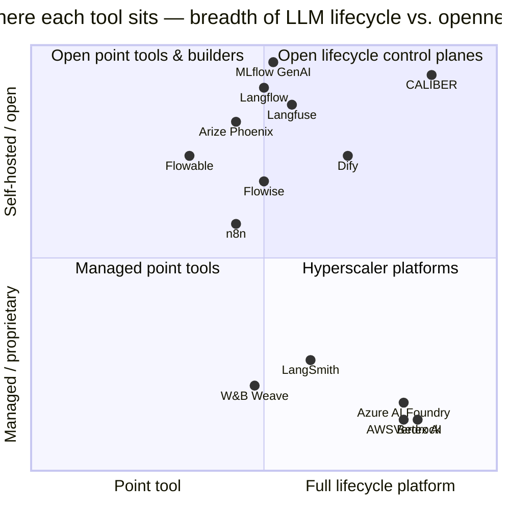
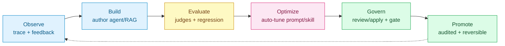

# CALIBER — Competitive Analysis

*Where an MLflow-integrated, self-hosted "agent lifecycle control plane" stands against the visual builders, automation/BPM engines, LLMOps & evaluation platforms, and hyperscaler stacks it is measured against — with every competitor claim grounded in primary sources ([§13](#13-references)).*

> **Scope.** A deep competitive review of CALIBER against the open-source and cloud tools it is most often compared to: visual LLM/agent builders (Langflow, Flowise, Dify), workflow-automation and BPM engines (n8n, Flowable, and the Windmill/Activepieces/Node-RED tier), LLMOps / evaluation / observability platforms (Langfuse, Arize Phoenix, LangSmith + LangGraph, W&B Weave, Promptfoo), the foundations CALIBER builds on (MLflow GenAI, DSPy, Haystack), and the hyperscaler stacks (AWS Bedrock, Google Vertex AI, Microsoft Azure AI Foundry).
>
> **As of.** Mid-2026. LLM tooling moves weekly — product names, licenses, star counts, and feature GA dates are point-in-time and were spot-verified against primary sources (official docs, GitHub repos/licenses, vendor announcements); treat exact figures as directional. Confidence notes are called out inline.
>
> **Naming note (recent rebrands).** Several competitors renamed in 2025–2026: **Azure AI Foundry → "Microsoft Foundry"** (Ignite 2025); **Google Vertex AI → "Gemini Enterprise Agent Platform"** (Google Cloud Next 2026); and AWS's **Bedrock Agents → "Bedrock Agents Classic"** (closing to new customers 2026-07-30), superseded by **Bedrock AgentCore** (GA Oct 2025). This report keeps the widely-recognized names with the new name annotated on first use.

---

## 1. Executive summary

CALIBER is not really a "workflow builder," even though it has a Workflow Studio. It is a **self-hosted, MLflow-integrated control plane for a broad inventory of AI-agent resources** — and its defining bet is a connected, evidence-backed prompt-refinement path: production feedback → verify → diagnose → optimize through a policy-selected provider path → **evaluate with per-dimension regression evidence** → **human review** → **audited alias rotation with exact rollback**. Other asset families implement their own subsets of that lifecycle. Almost every competitor implements *some* arc of the loop; very few package this combination while remaining open-source, self-hostable, and MLflow-integrated.

**The one-paragraph verdict.** In the specific quadrant of *open + self-hosted + full lifecycle with automatic optimization and evidence-backed governance*, CALIBER sits nearly alone. The visual builders (Langflow, Flowise, Dify) win on time-to-first-app, ecosystem size, and community, but **outsource evaluation and have no automatic optimization and no eval-gated promotion**. The LLMOps/eval tools (Langfuse, Phoenix, LangSmith) win on polish and mindshare of *measurement*, but they measure and trace — they **don't optimize or orchestrate a governed deploy**. The hyperscalers (Bedrock, Vertex, Azure) win decisively on managed scale, integrated models, and compliance, but bring **lock-in and per-token economics**. Prompt optimizers are now widespread; CALIBER's narrower differentiator is integrating policy selection, regression evidence, human authorization, audit, and asset-specific rollback in one product path. Its real risks are **maturity/adoption** and **dependence on MLflow**, which is itself advancing into this territory.

| Dimension | CALIBER | Builders (Langflow/Flowise/Dify) | Automation/BPM (n8n/Flowable) | LLMOps/eval (Langfuse/Phoenix/LangSmith) | Hyperscalers (Bedrock/Vertex/Azure) |
|---|---|---|---|---|---|
| **Primary job** | Govern + optimize + ship agent artifacts | Build agents/RAG visually | Automate work / orchestrate processes | Observe + evaluate LLM apps | End-to-end managed GenAI stack |
| **Automatic optimization** | 🟡 5 implemented provider paths; automatic rules choose 4, explicit pins can reach all 5, and 2 are exposed in the prompt UI/API | ❌ none (Dify = one-shot rewrite) | ❌ none | 🟡 Phoenix (OSS prompt-learning); Langfuse/LangSmith none | 🟡 Vertex + AWS + Azure (preview) optimizers |
| **Eval-gated promotion + rollback** | 🟡 asset-specific: prompt advisory verdicts, workflow deploy gates, exact audited rollback for prompt/workflow/KB, and snapshot rollback for skills | ❌ | ❌ (Flowable: process versioning, not LLM) | ❌ (eval yes, gate/promote no) | 🟡 eval yes; gating is DIY in IAM/pipelines |
| **Self-hosted + open** | ✅ Apache-2.0, in your infra | 🟡 mixed (MIT → source-available) | 🟡 fair-code / Apache core | ✅/🟡 (LangSmith is SaaS) | ❌ managed cloud only |
| **Breadth of ecosystem** | 🟡 focused, young | ✅ large (100–150+ components) | ✅ huge (n8n 400–500+) | 🟡 focused | ✅ vast (whole cloud) |
| **Maturity / community** | 🟡 young, small | ✅ 54k–150k★ | ✅ n8n ~195k★ | ✅ established | ✅ enterprise-grade |

Legend: ✅ strong/native · 🟡 partial/conditional · ❌ absent.

---

## 2. What CALIBER is (and the category it competes in)

CALIBER ships one ASGI control-plane codebase in two topologies: an in-process MLflow
`mlflow.app`, or a standalone CALIBER service that calls vanilla MLflow over HTTP. It
reuses MLflow's Experiments, Traces, Assessments, Prompt Registry, Artifact Store, and
`mlflow.genai.evaluate`; the bundled standalone stack uses separate logical CALIBER and
MLflow databases. On top of those primitives it adds:

- **A broad artifact registry with heterogeneous history** — prompts, workflows, skills, knowledge bases, test sets, and tools all preserve some version evidence, but not one release model. Prompts/workflows/KBs have live pointers and exact audited rollback; skills restore immutable snapshots as a new current version; test sets retain version-filtered examples; tool families are read-only history. MCP servers are registered but **not versioned**.
- **The refinement loop** — feedback → **verify** → **diagnose** → **generate** through a selected provider path → **evaluate** with baseline/regression evidence → explicit **review/apply** → audited promotion where the asset has a live pointer. The canonical prompt path has human action boundaries, but not every asset or direct route creates two independent approval records; runtime is provider/dataset dependent and no universal time-to-fix is claimed.
- **Automatic calibration** — five provider implementations exist: MetaPrompt, GEPA, DSPy BootstrapFewShot, DSPy MIPROv2, and SkillMetaPrompt. Automatic rules can select the first, second, third, or skill-specific path; explicit job/agent configuration can reach all five, including MIPROv2. The prompt form/API exposes MetaPrompt and GEPA. A broader nine-name taxonomy is descriptive roadmap vocabulary, not nine shipped implementations.
- **Evaluation** — scorecards, custom LLM judges (`mlflow.genai.make_judge`), deterministic scorers, human review queues, prompt advisory verdicts, and separate workflow deploy-gate evidence.
- **Knowledge bases** — RAG with chunking, embeddings, **Apache AGE knowledge-graph** extraction, hybrid retrieval + cross-encoder rerank.
- **Governance** — RBAC (`viewer`/`operator`/`approver`/`admin`), a full audit trail, and an LLM-Gateway governance surface (endpoint discovery, guardrails, pricing, usage).
- **Aria** — an embedded, permissioned agentic copilot (OpenAI + Claude) that drives goals through a durable, supervised plan.

**Category.** CALIBER is best described as an **"LLM/agent lifecycle control plane"** — the governance-and-improvement layer that sits *above* builders and *beside* observability tools. It competes on the axis of *"who owns the path from a flagged response to a safely-deployed, measurably-better artifact."*

---

## 3. Landscape map

The top-right quadrant — **open + full-lifecycle** — is sparsely populated. Dify is the closest neighbor (a broad, open-ish platform) but lacks native evaluation and optimization; MLflow GenAI is the most open but is a toolkit, not a governed loop. The hyperscalers own the bottom-right (full lifecycle, but closed/managed).

---

## 4. Master capability matrix

Rows are products; columns are the capabilities that define a lifecycle control plane. ✅ native/strong · 🟡 partial / basic / integration-dependent / paid-tier · ❌ absent · *(n/a categorically different)*.

| Product | Visual build | Agent orchestration | Prompt/artifact **versioning + rollback** | **Evaluation** (LLM-judge + regression) | **Auto-optimization** | **Eval-gated promotion + approvals** | Observability / tracing | RAG / **knowledge graph** | Governance (RBAC/audit) |
|---|---|---|---|---|---|---|---|---|---|
| **CALIBER** | 🟡 (Studio) | ✅ | 🟡 heterogeneous history across 6 types; live rollback on a subset | ✅ judges + per-dim regression evidence | 🟡 5 implementations / 4 automatic-policy paths / 5 explicit-reachable / 2 prompt-form options | 🟡 asset-specific advisory/deploy gates and explicit action boundaries | ✅ MLflow tracing (native) | ✅ + **Apache AGE graph** | ✅ RBAC + audit; approvals are path-specific |
| Langflow | ✅ | ✅ (+MCP) | 🟡 flow history (1.9) | ❌ (3rd-party) | ❌ (DSPy declined) | ❌ | ❌ (3rd-party) | ✅ / 🟡 | 🟡 (RBAC unshipped) |
| Flowise | ✅ | ✅ (Agentflow V2) | 🟡 weak | 🟡 native but **paid tier** | ❌ | 🟡 compare, not a gate | 🟡 (7 external integ.) | ✅ / ✅ (Neo4j GraphRAG) | 🟡 enterprise-gated |
| Dify | ✅ | ✅ (Agent node) | ✅ app-level restore | ❌ (annotation only → Arize/Langfuse) | ❌ (one-shot rewrite) | 🟡 HITL node, not metric-gated | 🟡 basic + external | ✅ / 🟡 (InfraNodus ext.) | 🟡 RBAC; audit/SSO paid |
| n8n | ✅ | ✅ (70+ LC nodes) | 🟡 workflow history (not prompt) | 🟡 native (2025); gated Pro/Ent | ❌ (community template) | ❌ | 🟡 logs + external Langfuse | ✅ / ❌ | 🟡 RBAC; audit/SSO/Git paid |
| Flowable | ✅ (BPMN/CMMN) | ✅ processes + 2025 Agent Engine | ✅ **process defs** (not prompts) | ❌ (deterministic tests) | ❌ | ✅ **process** approvals (not LLM) | ✅ process audit + AI cost/token | 🟡 (enterprise KB) | ✅ mature RBAC/audit |
| Langfuse | ❌ | ❌ | ✅ prompt registry + labels | ✅ judges, datasets, experiments | ❌ | ❌ | ✅ (OTel) strong | ❌ | 🟡 RBAC (SSO paid) |
| Arize Phoenix | ❌ | ❌ | 🟡 | ✅ evals + experiments | 🟡 OSS Prompt Learning SDK | ❌ | ✅ (OpenInference/OTel) | ❌ | 🟡 |
| LangSmith (+LangGraph) | 🟡 | ✅ (LangGraph, OSS) | ✅ prompt hub | ✅ datasets + judges + annotation | ❌ | 🟡 (CI gates DIY) | ✅ strong | ❌ | 🟡 (SaaS; self-host = Ent) |
| MLflow GenAI | ❌ | ❌ | ✅ registry + aliases | ✅ `genai.evaluate` + `make_judge` (~20 judges) | 🟡 experimental: `optimize_prompts` (GEPA+MetaPrompt), `optimize_prompt` (DSPy MIPROv2) | 🟡 `@mlflow.test` CI gate (3.14); manual alias | ✅ OTel tracing | 🟡 evaluates RAG; no native store | 🟡 RBAC (3.13) |
| AWS Bedrock *(Agents→AgentCore)* | ✅ (Flows) | ✅ (AgentCore) | ✅ Prompt Management | ✅ model + RAG eval + LLM-judge | 🟡 Advanced Prompt Optim. (eval-driven) | 🟡 DIY (Step Functions/IAM) | ✅ (CloudWatch/AgentCore, OTel) | ✅ / ✅ (Neptune GraphRAG, managed) | ✅ IAM + guardrails |
| Vertex AI *(→ Gemini Ent. Agent Platform)* | ✅ | ✅ (Agent Engine/ADK) | ✅ prompt mgmt | ✅ Gen AI Eval Service | ✅ Prompt Optimizer (eval-driven) | 🟡 DIY in MLOps pipelines | ✅ (Cloud Trace, OTel) | ✅ / ❌ (GraphRAG = DIY Spanner) | ✅ IAM + Model Armor |
| Azure AI Foundry *(→ Microsoft Foundry)* | 🟡 Prompt Flow (retiring 2027) | ✅ (Agent Svc / Agent Framework) | 🟡 Git + Prompty (no registry) | ✅ Evaluation SDK | 🟡 Agent Optimizer (preview) | 🟡 CI/CD gates DIY | ✅ (App Insights, OTel) | ✅ / ❌ (GraphRAG = OSS only) | ✅ Entra + Content Safety |

**Reading the matrix.** The individual capabilities are increasingly available elsewhere — MLflow has experimental optimizers (`optimize_prompts`/`optimize_prompt`) and CI gating; Arize Phoenix has an OSS prompt-learning optimizer; Vertex, AWS, and Azure (preview) ship optimizers. CALIBER's differentiated combination is an integrated prompt-refinement path: diagnosis-informed selection feeds per-dimension evidence, an explicit human action, and audited/reversible alias rotation, alongside a multi-asset registry and native graph-RAG. Workflow gates and other asset lifecycles remain separate. Gate verdicts are evidence rather than one unbypassable cross-artifact authorization policy. The edge is integration and governance, not the novelty of any one arc.

---

## 5. The core differentiator — closing the loop

Most tools own one or two stages. CALIBER's thesis is connecting the whole arc. The canonical prompt-refinement path has human verification and review/apply decisions; other asset families implement subsets and do not inherit those gates automatically:

- **Builders** (Langflow/Flowise/Dify) own *Build* (and RAG); they bolt on *Observe/Evaluate* via third parties and **stop before Optimize/Govern/Promote**.
- **LLMOps/eval** (Langfuse/Phoenix/LangSmith/Weave) own *Observe + Evaluate* (and prompt versioning); they **mostly do not Optimize** (Phoenix's OSS prompt-learning is the exception) and **do not Govern-to-ship or Promote**.
- **Automation/BPM** (n8n/Flowable) own *Build/orchestrate* (and, for Flowable, world-class *Govern* of business processes) but treat LLMs as steps — **no LLM Optimize, and eval is nascent/absent**.
- **Hyperscalers** own most stages as managed services (Vertex, AWS, and Azure — Agent Optimizer, preview — ship optimizers for *Optimize*), but you **assemble the gating/promotion yourself**, inside their cloud, with lock-in.
- **CALIBER's canonical prompt path** is built to connect **all six** stages as
  one opinionated, self-hosted, audited loop. Other artifact families implement
  explicitly documented subsets rather than inheriting that path wholesale.

---

## 6. Cluster deep-dives

### 6A. Visual LLM/agent builders — Langflow, Flowise, Dify

**Langflow** (MIT; owned by IBM via the DataStax acquisition, closed May 2025; ~150k★). Best-in-class visual authoring of agents/RAG, first-class MCP (client + server), 150+ components. But **no dedicated prompt registry** (Langflow 1.9, Apr 2026, did add flow-level *version history* with restore/revert), **no native evaluation engine** (a LangWatch evaluator component + LLM-as-judge templates exist, but scoring is delegated to external platforms), **no native observability**, thin governance (RBAC unshipped), and a **DSPy auto-optimization request was closed "not planned."** It is a *builder/runtime*, not a lifecycle plane.
- **CALIBER wins:** evaluation, policy-selected optimization, an integrated review/apply and promotion path with advisory evidence, asset-specific versioning/rollback, and RBAC/audit.
- **Langflow wins:** visual authoring UX, component/integration breadth, community/mindshare, IBM backing.

**Flowise** (dual: Apache-2.0 CE + commercial enterprise; ~54k★). Mature **Agentflow V2** state-machine orchestration with HITL and multi-agent, broad RAG including **Graph RAG via Neo4j**, and — unusually — **native evaluation** (datasets + LLM-as-judge + latency/token metrics). Caveats: evaluation, RBAC, SSO, and audit are **paid Cloud/Enterprise features** (not in the open CE), prompt versioning is weak, observability is delegated to seven external tools, and there is **no auto-optimization** and no hard regression gate wired into a promotion path.
- **CALIBER wins:** policy-selected optimization, integrated evidence/review/promotion, open governance (Flowise gates it behind a commercial license), and a broad asset registry.
- **Flowise wins:** visual orchestration maturity, Neo4j GraphRAG, larger ecosystem/community.

**Dify** (license: **Apache-2.0 with additional conditions** — informally the "Dify Open Source License" — no multi-tenant resale, no logo removal; ~147k★, LangGenius). The most complete *builder platform*: visual Workflow/Chatflow + Agent node + prompt IDE + strong RAG (hybrid retrieval, reranking, multimodal) + **app-level versioning with restore/rollback** + a first-class **Human Input (HITL) node**. **The decisive gap: no native evaluation** (only annotation/feedback; it explicitly points users to Arize/Langfuse/LangSmith), **no auto-optimization** (only a one-shot "Generate Optimized Prompt" rewrite), and **no metric-gated release** — publishing is not blocked by quality.
- **CALIBER wins:** real evaluation with regression evidence, policy-selected optimization, integrated review/promotion, native graph RAG (AGE) vs. Dify's external InfraNodus, and audit-of-eval-results.
- **Dify wins:** breadth and time-to-first-app, enormous model/plugin ecosystem, community (147k★), polished builder UX.

> **Takeaway for the builder cluster:** they are complementary more than competitive. A credible narrative is *"author in Dify/Langflow, then govern, evaluate, optimize, and promote in CALIBER."*

### 6B. Automation & BPM — n8n, Flowable (+ the Windmill/Activepieces/Node-RED tier)

**n8n** (Sustainable Use License — fair-code, source-available, **not OSI**; ~195k★; $180M Series C Oct 2025, ~$2.5B valuation; 400–500+ integrations). A general-purpose automation platform that has extended into AI (70+ LangChain nodes, AI Agent node, multi-agent via AI-Agent-as-tool) and even shipped a **native Evaluations feature** (2025: datasets + LLM-judge Correctness/Helpfulness + deterministic metrics — gated Pro/Enterprise; free tier = one eval). But it has **no prompt-artifact versioning** (only whole-workflow history), **no auto-optimization** (a community OPRO/DSPy *template* only), LLM tracing via **external Langfuse**, and audit-log streaming + SSO **Enterprise-only** (Git source control is on Business + Enterprise); HITL/approvals are DIY patterns, not a gated-release control plane.
- **CALIBER wins:** policy-selected optimization, integrated evidence/review/promotion, prompt lifecycle, native LLM observability, and open governance.
- **n8n wins:** integration surface (it can wire an LLM to *anything*), community/funding/momentum, general automation.

**Flowable** (Apache-2.0 core: BPMN/CMMN/DMN; ~9.3k★; Flowable AG; jBPM→Activiti→Flowable pedigree). A **category-adjacent** enterprise process/case engine with **world-class governance**: immutable versioned process definitions with rollback/migration, first-class human tasks/approvals, complete audit history, mature RBAC/identity (LDAP/SSO). Its 2025 **Agent Engine** embeds LLM agents *inside* governed processes (with per-agent token/cost tracking) and adds an enterprise **Knowledge Agent** RAG pipeline — **but AI, RAG, and AI-observability are enterprise-licensed (not in the OSS core), and there is no prompt management, no LLM evaluation, and no auto-optimization.** Its "quality gate" is deterministic process testing, not probabilistic-output eval.
- **CALIBER wins:** the entire LLM-quality axis — evaluation, optimization, prompt lifecycle, LLM-judge gating.
- **Flowable wins:** durable long-running orchestration, human-task/case management, and enterprise governance depth that predates the AI era; standards (BPMN/CMMN/DMN); regulated-industry credibility.

**Windmill (AGPL/Apache; ~17k★), Activepieces (MIT CE; ~23k★), Node-RED (Apache; ~23k★, OpenJS)** — all are **orchestration/automation layers** where LLMs appear as scripts, "pieces," or nodes. **None** offers prompt versioning, systematic evaluation, or auto-optimization. Not lifecycle competitors; potential upstream/trigger integrations.

### 6C. LLMOps / evaluation / observability — Langfuse, Arize Phoenix, LangSmith, W&B Weave, Promptfoo

This is the cluster whose *measurement* layer most overlaps with CALIBER — and where CALIBER's *optimization + orchestration + governance* is the differentiator. It is also the cluster undergoing the most **consolidation**: Langfuse (MIT core, ~30k★) was acquired by **ClickHouse** (Jan 2026); Promptfoo (MIT, ~23k★) **agreed to be acquired by OpenAI** (announced Mar 9, 2026, pending close); Helicone by **Mintlify** (now maintenance-mode); and W&B Weave rides **CoreWeave** (acquisition closed May 2025). LangSmith + LangGraph (~36k★ on LangGraph; LangChain raised $125M at a $1.25B valuation, Oct 2025) remain the agent-building mindshare leaders; Arize Phoenix (ELv2, ~10k★) is the other strong open tracer.

- **Langfuse** (MIT core, self-host + cloud). The closest OSS analog to CALIBER's **measurement** layer: prompt management (versioning + labels + deployment), tracing (OTel), evaluation (LLM-judge, datasets, experiments), and human annotation. **No auto-optimization, no agent/workflow orchestration, no knowledge bases, and no eval-gated auto-promotion pipeline.**
- **Arize Phoenix** (Elastic-2.0; self-host free, Phoenix Cloud managed, Arize AX the enterprise SaaS). Strong OpenInference/OTel tracing + evals + experiments — and, unlike the rest of this cluster, an **OSS prompt-optimization** path (the `prompt-learning` SDK + an "Optimize Prompts Automatically" tutorial). Its gap vs. CALIBER is the *governed loop*: no agent/workflow orchestration, no knowledge bases, and **no gated-and-audited promotion** — it can observe, evaluate, and optimize a prompt, but not govern-to-ship.
- **LangSmith + LangGraph.** LangSmith (proprietary SaaS; self-host on enterprise) is a strong tracing + eval + prompt-hub + annotation product; **LangGraph** (MIT) is excellent stateful agent orchestration with HITL. Together they cover build + observe + evaluate — but **LangSmith is closed/SaaS**, there is **no automatic optimization**, and eval-gated promotion is a **DIY CI** pattern.
- **W&B Weave** (proprietary; W&B). LLM tracing + eval + datasets with strong experiment lineage; **no optimization/promotion/agents/KB**, and it's SaaS-first.
- **Promptfoo** (MIT). A developer eval + red-teaming harness (assertions, LLM-judge, CI). Great as a *gate primitive*; **not** an observability, lifecycle, or optimization platform.

- **CALIBER wins across the cluster:** multi-path prompt/skill calibration is wired into regression evidence, an explicit Apply boundary, audit, and exact prompt rollback, alongside separate workflow/KB release controls, a broad registry, and native knowledge bases. Phoenix ships an OSS prompt-learning optimizer, but these tools do not pair optimization with CALIBER's integrated prompt promotion workflow and native KB surface.
- **They win:** depth, polish, and mindshare of *measurement*; broader framework-agnostic SDK integrations; larger communities; and (Langfuse/Phoenix) very mature tracing UIs. For a team that only wants "trace + eval," these are lighter and more established than standing up CALIBER.

### 6D. Foundations & libraries — MLflow GenAI, DSPy, Haystack

**MLflow 3.x GenAI (Apache-2.0) — the foundation CALIBER is built on.** This is the most important comparison, because a reviewer will ask *"why not just use MLflow directly?"* — and the honest answer must start by admitting **how much MLflow 3.x already ships.** As of mid-2026, raw MLflow gives you, for free and self-hosted: a **Prompt Registry** (immutable versions + aliases + rollback-by-re-pointing); an **eval harness** (`mlflow.genai.evaluate` with ~20+ built-in judges, `make_judge` custom judges, managed Evaluation Datasets); **Review Queues + a Review App** (assignable structured human feedback written back onto traces, shipped in 3.14); **CI regression gating** via the `@mlflow.test` pytest integration (also 3.14); **RBAC + Admin UI** (OSS 3.13); best-in-class **OTel-native tracing**; and — increasingly — **experimental prompt-optimization APIs**: `mlflow.genai.optimize_prompts()` (≥3.5, wrapping **GEPA + MetaPrompt**) and the earlier singular `optimize_prompt()` (≥3.1, adding **DSPy MIPROv2**, later GEPA). All are marked *Experimental*, not GA.

So CALIBER's differentiation is emphatically **not** "we have judges / a prompt registry / tracing / an optimizer" — MLflow has all of those. The real delta is **integration, automation, and governance of the loop as one product workflow**:

| MLflow 3.x already ships (the primitives) | What CALIBER adds — the integrated, governed loop |
|---|---|
| Two **experimental** APIs — `optimize_prompts()` (GEPA + MetaPrompt) and singular `optimize_prompt()` (DSPy MIPROv2) — invoked manually, no diagnosis, no gate/approval/promotion wrapper | Five provider paths are implemented; automatic rules choose four, explicit configuration can reach all five, and two are exposed in the prompt form/API. Diagnosis is one policy input; MIPROv2 is explicit-only. |
| CI gating (`@mlflow.test`) **and** manual alias-set **and** review queues — but as **separate, hand-wired steps** | The prompt refinement path chains per-dimension evidence → **explicit review/apply** → **audited alias rotation with exact rollback**. Prompt registry verdicts remain advisory; other assets have separate contracts. |
| Prompt + model registry | A broad registry across six artifact types, with asset-specific versioning, gate evidence, live aliases, and rollback rather than one uniform lifecycle (MCP servers are registered but not versioned). |
| **No native RAG / vector store** (MLflow only *evaluates* external retrieval) | **Native knowledge bases** — pgvector + **Apache AGE graph** + hybrid retrieval + rerank |
| RBAC (3.13); deep governance strongest only on Databricks/Unity Catalog | RBAC + **audit-of-eval-results** + approval roles + LLM-Gateway governance + the **Aria copilot** + one SPA over all of it |

**Net (and the honest caveat):** MLflow GenAI is the *engine and instruments*; CALIBER is the *governed, opinionated cockpit* built around them. But MLflow has closed much of the historical gap, so CALIBER's defensible claim is the **integrated, policy-selected prompt evidence/review/release path** (plus native graph-RAG), **not** any single primitive or a uniform unbypassable gate. This is simultaneously CALIBER's clearest differentiation and its single largest strategic risk.

**DSPy (MIT).** Not a competitor — an **optional dependency**. DSPy provides the MIPRO/BootstrapFewShot optimizers CALIBER orchestrates through the separate `[dspy]` extra. DSPy is a library for engineers; it has no UI, governance, release gate, or observability. CALIBER's contribution is **productizing DSPy-style optimization** with policy/configuration, evidence, an explicit Apply action, and audited prompt promotion.

**Haystack (Apache-2.0, deepset).** A production RAG/LLM **pipeline framework** with some evaluation and agents; the commercial layer is the **Haystack Enterprise Platform** (deepset Studio is a free visual builder). A framework, not a governed lifecycle plane — no eval-gated promotion, no auto-optimization-as-a-service, no unified versioned artifact registry with rollback.

### 6E. Hyperscaler platforms — AWS Bedrock, Google Vertex AI, Azure AI Foundry

**AWS Bedrock.** **Bedrock AgentCore** (the GA-Oct-2025 successor to the now-legacy *Bedrock Agents "Classic,"* which closes to new customers 2026-07-30) + **Flows** (ex-"Prompt Flows," visual) + **Prompt Management** (versioning) + **Bedrock Evaluations** + Guardrails + Knowledge Bases. Evaluations is deep and **GA**: model eval (BERTScore/F1 accuracy, robustness, `detoxify` toxicity), **LLM-as-a-judge** (GA Mar 2025), **RAG evaluation** (retrieval + generation + citation metrics), **bring-your-own-inference** (evaluate any model, even off-Bedrock), human eval (+$0.21/task); no separate eval-job charge. Bedrock is also the **one hyperscaler with turnkey managed GraphRAG** (Knowledge Bases + Neptune Analytics, GA Mar 2025 — auto-builds the entity graph). It now ships an **eval-driven Advanced Prompt Optimization / Migration tool** (reportedly ~2026) beyond the older one-shot rewrite. What's still missing vs. CALIBER: **no first-class eval-gated *deployment* promotion** — human-in-the-loop is runtime tool-approval (Return of Control); AgentCore Policy (preview) is *automated* Cedar-policy governance, not a human approval step; deployment gates are assembled from Step Functions + IAM. And **no self-hosting** (managed AWS-only).

**Google Vertex AI** *(rebranded the **Gemini Enterprise Agent Platform** at Cloud Next 2026)*. Agent Builder + **Agent Engine** (managed runtime) + **ADK** (OSS, Apache-2.0) + **A2A** protocol + Prompt management + the research-backed **Vertex AI Prompt Optimizer** (eval-metric-driven, NeurIPS-2024) + **Gen AI Evaluation Service** (incl. agent trajectory metrics) + Vertex AI Search / RAG Engine + Grounding. The Prompt Optimizer is the closest external analog to CALIBER's calibration (eval-driven, though single-technique and GCP-bound). Notable gap: **no managed general GraphRAG** — Google's turnkey knowledge graph is a narrow people/content search graph; document GraphRAG is a **DIY Spanner-Graph reference architecture** you build and maintain. Gating/promotion is assembled in Vertex MLOps pipelines; agent HITL pause/resume shipped Dec 2025.

**Azure AI Foundry** *(rebranded **Microsoft Foundry** at Ignite 2025)*. **Azure AI Evaluation SDK** (groundedness/relevance/coherence + agent evaluators: tool-call accuracy, intent resolution, task adherence; + safety) + Foundry Agent Service + **Content Safety** (Prompt Shields incl. indirect-injection) + **Copilot Studio** (low-code) + the **Microsoft Agent Framework** (the GA-2026 convergence of Semantic Kernel + AutoGen). Strong eval and RFT/fine-tuning story. But: **Prompt Flow (its visual DAG) is retiring April 2027** in favor of the code-first Agent Framework; **no first-class prompt registry** (prompt versioning is Git + Prompty); optimization is an **Agent Optimizer (preview)** that auto-refines an agent's *system instructions* in a closed eval loop (plus trace-clustering + fine-tune-data-gen) — real, but instruction-level, not a diagnosis-driven multi-optimizer; **no managed GraphRAG** (Microsoft's GraphRAG is an OSS library only); eval-gated release is DIY in Azure DevOps/GitHub Actions.

- **Hyperscalers win decisively on:** managed scale and reliability, integrated first-party + marketplace **models with inference** (Gemini, GPT/Claude, Nova), security/compliance certifications (SOC 2, HIPAA, FedRAMP, sovereign/air-gapped options like Google GDC and Azure Local), global infra, enterprise support/SLAs, and shipped prompt/agent optimizers (**Vertex** Prompt Optimizer, **AWS** Advanced Prompt Optimization, **Azure** Agent Optimizer preview).
- **CALIBER wins on:** self-hosting / data sovereignty / air-gap on infra you own; **no per-token, per-service, or egress economics** (the cloud bills stack: tokens + eval judge tokens + search hours + guardrail records + agent compute); **no lock-in** (model-agnostic, open source) and **no rebrand/retirement churn** (all three clouds renamed and re-SKU'd their agent stacks in 2025–2026, with Prompt Flow retiring); **MLflow-integrated** fit; **native, self-hosted graph-RAG** (Apache AGE) where Google and Azure require separate assembly; and a **single opinionated diagnosis→evidence→review→audited-promote path** none of them package as one flow.

---

## 7. CALIBER — strengths

1. **It closes the loop.** The end-to-end *feedback → optimize → eval-gate → approve → promote → observe* arc, as one governed system, is genuinely rare. Competitors own arcs; CALIBER owns the circuit.
2. **Diagnosis-informed optimizer policy.** Five provider paths are implemented, automatic rules choose four, explicit pins can reach all five, and two appear in the prompt form/API; DSPy MIPROv2 is explicit-only. Optimizers themselves are no longer unique — MLflow's `optimize_prompts` bundles three, and Vertex/AWS ship eval-driven optimizers — but the *diagnose → select → evaluate → explicit action → audited promotion* integration remains unusual.
3. **Evidence-backed, reversible deployment where supported.** Prompts combine per-dimension regression evidence, an advisory verdict, audited alias rotation, and exact rollback. Workflows use deployment aliases/checkpoints and their own deploy gates; knowledge bases use an audited active-version pointer; skills restore a snapshot as a new version and have no alias or gate. This improves review safety; it is not one unbypassable cross-artifact policy.
4. **MLflow-integrated with topology choice.** MLflow shops can use an embedded app, while the bundled standalone mode separates process failure domains and uses MLflow over HTTP. Both reuse tracing/registry/eval rather than replacing them.
5. **Unified but asset-specific lifecycle.** Six artifact types share one control-plane inventory, while versioning, live aliases, gate evidence, and rollback are applied only on the asset families that implement each capability; MCP servers are registered but unversioned.
6. **Governance as a first-class citizen.** RBAC (`viewer`/`operator`/`approver`/`admin`), human verification and review boundaries, plus audit rows for the tracked mutations and transitions. This is broad, but it is not a claim that every state change is causally linked to feedback.
7. **Batteries-included knowledge bases with a graph.** Native Apache AGE knowledge-graph + hybrid retrieval + rerank, rather than bolting on an external graph store.
8. **Open source + self-hosted + model-agnostic.** Apache-2.0, runs on infrastructure you already own, no per-token platform tax, sovereignty/air-gap friendly — the opposite of the hyperscaler posture.
9. **An embedded agentic copilot (Aria)** with durable, supervised goal-plans — an authoring accelerant most competitors lack.

---

## 8. CALIBER — weaknesses & risks

*(Deliberately candid — this is where the report earns its keep.)*

1. **Maturity and adoption gap — the biggest weakness.** CALIBER is young and thinly staffed relative to communities of **54k–195k GitHub stars** (Flowise ~54k, Dify ~147k, Langflow ~150k, n8n ~195k) with venture backing (n8n's $180M Series C; IBM behind Langflow). Small community ⇒ fewer integrations, less content, slower issue resolution, and real **bus-factor / longevity risk** for adopters.
2. **MLflow dependency is a double-edged moat — and MLflow is already advancing.** Being MLflow-integrated is a superpower for MLflow shops and a **strategic exposure** everywhere else: (a) teams *not* on MLflow face adoption friction; (b) CALIBER is coupled to MLflow's evolving GenAI APIs and release cadence; (c) **MLflow is actively absorbing the loop** — as of mid-2026 it already ships a prompt registry with aliases, `genai.evaluate` + `make_judge` (~20 judges), **Review Queues + `@mlflow.test` CI gating** (3.14), **RBAC** (3.13), and **experimental prompt optimizers** (`optimize_prompts` = GEPA + MetaPrompt; `optimize_prompt` = DSPy MIPROv2). CALIBER's remaining delta — policy-selected optimization, one integrated prompt evidence/review/audit path, a broad multi-asset inventory, and native graph-RAG — is real but **narrowing**, and much of it is "the opinionated integration MLflow doesn't ship yet." Defensible, but not a durable *technical* moat; the durability is in the opinionated product + the MLflow-shop distribution.
3. **Narrow ecosystem / integration surface.** n8n's 400–500+ connectors, Langflow's 150+ components, and the hyperscaler marketplaces dwarf CALIBER's connector set. CALIBER is not an integration hub and shouldn't pretend to be — but buyers comparing on "integrations" will see a gap.
4. **Not a general automation tool or BPM engine.** If the need is business-process orchestration (Flowable) or 400-app automation (n8n), CALIBER is the wrong tool. Its scope is deliberately the LLM-quality lifecycle.
5. **Self-host operational burden; no managed SaaS.** You run Postgres/MinIO/MLflow/workers yourself. There is no turnkey hosted tier, no managed autoscaling, and none of the compliance certifications (SOC 2 / HIPAA / FedRAMP) buyers get "for free" from the hyperscalers.
6. **It orchestrates models but doesn't host them.** CALIBER relies on external providers (OpenAI/Claude/gateway) for inference; the clouds bundle models + inference + scaling. Aria specifically targets OpenAI + Claude.
7. **Product-maturity signals — including historical docs that outran the code.** Package metadata supports Python 3.10–3.12 while the canonical functional CI suite runs on 3.11, and the maintained product audit still records unverified production boundaries. Earlier README editions advertised nine optimizers where the calibration engine implements five; that claim is corrected. Optional DSPy / local-embedding stacks carry heavier transitive dependencies. Verify capability and release claims against current code, tests, and the dated evidence ledger rather than an old snapshot.
8. **Single-environment v1.** No `dev → staging → prod` promotion ladder ships today (the machinery exists but is dormant). Enterprises expecting multi-stage promotion will see this as missing.
9. **Unproven at scale.** No public large-scale deployments, benchmarks, or reference customers to counter the hyperscalers' scale/reliability story.
10. **Documentation & UX polish** are improving but not yet at the level of the 100k-star builders; the visual Studio is less mature than Langflow/Flowise/Dify canvases and Prompt Flow.

---

## 9. Differentiation, whitespace & moat

**The defensible position is an intersection, not a single feature:**

> *self-hosted + open-source + MLflow-integrated + broad asset lifecycle + **policy-selected multi-optimizer calibration** + **evidence-backed, audited, asset-specific reversible promotion** + human-in-the-loop governance.*

No single competitor occupies all of it:

- Observability/eval tools (Langfuse, Phoenix, LangSmith, Weave) measure — and Phoenix can even optimize a prompt via its OSS prompt-learning — but don't **govern-to-ship** (no gated, approved, audited promotion).
- Builders (Langflow, Flowise, Dify) build but **outsource eval and lack optimization + gating**.
- Automation/BPM (n8n, Flowable) orchestrate but aren't **LLM-quality** platforms (Flowable governs *processes*, not prompts).
- Hyperscalers (Bedrock, Vertex, Azure) do most of it managed, but with **lock-in + per-token economics**; **Vertex and AWS** now ship eval-driven optimizers, yet none packages a single opinionated diagnosis→gate→human-action→audited-promote loop, and only AWS offers managed graph-RAG.

**How durable is the moat?** Moderate. Individual capabilities are copyable, and the biggest threat is *upstream* (MLflow) rather than lateral. The durable parts are (a) the **opinionated integration + workflow** (the loop as one product), (b) **MLflow-integrated positioning** for MLflow-standardized enterprises, and (c) **open + self-hosted governance** for regulated/sovereign buyers who can't or won't use the clouds.

---

## 10. Threats & strategic risks

1. **MLflow absorbs the loop — already underway.** The single largest risk, and no longer hypothetical: MLflow now ships an optimizer (`optimize_prompts`), Review Queues, CI gating, and RBAC on top of its registry/eval/tracing. If it adds policy-selected optimization plus an integrated evidence/review/promotion workflow, CALIBER's delta shrinks sharply. *Mitigation:* stay ahead on optimizer breadth + governance UX + native graph-RAG, and contribute upstream to remain the natural "batteries-included, opinionated" layer rather than a competitor to the substrate.
2. **Dify/Langfuse move up-stack.** Dify adding real evaluation + gating, or Langfuse adding optimization + orchestration, would directly contest CALIBER's whitespace with far larger communities (Dify ~147k★, Langfuse now ClickHouse-backed).
3. **Hyperscaler commoditization.** Vertex's Prompt Optimizer, AWS's Advanced Prompt Optimization + managed Neptune GraphRAG, and Azure's Evaluation SDK + Agent Optimizer (preview) keep maturing; "good enough, managed" pressures self-hosted differentiation for cloud-committed buyers.
4. **Community cold-start.** Without adoption momentum, CALIBER struggles on the "integrations + longevity + support" criteria that procurement weighs heavily.
5. **Dependency risk.** DSPy/local-embedding stacks (heavier deps, open security-audit follow-ups) and coupling to fast-moving MLflow GenAI APIs.
6. **Market signal — the point-tool layer is consolidating.** In ~12 months the independent LLMOps/eval field was largely acquired: **Langfuse → ClickHouse (Jan 2026)**, **Promptfoo → OpenAI (announced Mar 2026, pending close)**, **Helicone → Mintlify (Mar 2026, now maintenance-mode)**, **W&B → CoreWeave (closed May 2025)**. This *validates* the space and leaves the **integrated, self-hosted, policy-optimizing and evidence-backed lifecycle** niche thinly populated — but it also means better-capitalized owners now stand behind those tools and could extend them into CALIBER's lane.

---

## 11. Recommendations (strategic positioning)

1. **Own the wedge, don't chase breadth.** Position explicitly as *"the evidence-backed, self-hosted refinement and governance control plane for teams on MLflow"* — not as another builder or automation tool. Lead every comparison with the **integrated loop + policy-selected calibration + audited promotion**, and keep the advisory-gate boundary explicit.
2. **Target the buyers the clouds can't serve well:** regulated, sovereign, on-prem/air-gapped, cost-sensitive, and MLflow-standardized organizations. That is defensible ground against Bedrock/Vertex/Azure.
3. **Interoperate rather than compete with builders.** Ship first-class "import a Langflow/Dify flow, then govern/evaluate/optimize/promote it in CALIBER" paths; accept n8n/automation triggers as loop entry points. Make CALIBER the layer *above* the builders.
4. **Neutralize the top weaknesses deliberately:** (a) reach the roadmap's realistic 92% overall / 90% named-module coverage bar and publish it; (b) ship the dormant **multi-environment promotion** ladder; (c) grow a connector/plugin ecosystem and community; (d) publish reference benchmarks/case studies to answer the scale question; (e) offer an optional managed/hosted tier to remove the self-host barrier for pilots.
5. **Manage the MLflow relationship as strategy, not just architecture.** Track the MLflow GenAI roadmap closely, contribute upstream, and keep CALIBER's differentiation in the arcs MLflow is least likely to productize soon (auto-optimization orchestration, human-in-the-loop governance, a coordinated multi-asset registry with explicit per-asset lifecycles, knowledge-graph RAG).

---

## 12. Appendix — methodology, confidence & sources

**Method.** CALIBER's capabilities were taken from its own repository and architecture docs (authoritative). Competitor facts were gathered via parallel web research against primary sources (official docs, GitHub repos/licenses, vendor announcements), verified by an adversarial refute-pass on the highest-stakes claims, and cross-checked against prior knowledge. The resulting primary sources are listed in **[§13 References](#13-references)**; where a claim rests on inference or a single source, it is flagged inline.

**Confidence.**

- **High:** category positioning and the presence/absence of *auto-optimization* and *eval-gated promotion* across all products (the load-bearing claims); the 2025–2026 rebrands (Microsoft Foundry, Gemini Enterprise Agent Platform, Bedrock AgentCore); Prompt Flow's retirement; the observability M&A wave; and the specific fact that **MLflow now ships `optimize_prompts`, Review Queues, CI gating, and RBAC** — all verified against primary sources during research.
- **Medium / point-in-time:** GitHub star counts, exact license clauses, paid-vs-free tier boundaries, dollar figures, and precise cloud feature GA *dates* — these drift and some are forward-dated (e.g., AWS Advanced Prompt Optimization ~2026, AgentCore Policy/Eval GA early 2026, the Next-2026 Vertex rebrand framing). Re-verify before quoting externally.
- **CALIBER's own facts:** taken from its repository/architecture docs (authoritative).

**Representative sources consulted:** product GitHub repos and `LICENSE` files (Langflow, Flowise, Dify, n8n, Flowable, Windmill, Activepieces, Node-RED, DSPy, Haystack, LangGraph); official docs and announcements — Flowise Agentflow V2 / evaluations; Dify workflow/versioning/RAG/human-input; n8n evaluations/RBAC/history + Series C; Flowable AI 2025.x releases; MLflow GenAI (prompt registry, `genai.evaluate`, `make_judge`, Review Queues, `@mlflow.test`, `optimize_prompts`, RBAC); Langfuse/Phoenix/LangSmith/Weave/Promptfoo docs + acquisition news; and the three clouds' primary docs (AWS Bedrock Evaluations/Guardrails/Knowledge Bases/AgentCore + What's-New + pricing; Google `docs.cloud.google.com` for Agent Engine/ADK/Prompt Optimizer/Gen AI Eval/RAG Engine/grounding/IAM; Microsoft `learn.microsoft.com` for Foundry Agent Service/Evaluation SDK/Content Safety/Agent Framework/observability). Vendor doc pages that were JS-rendered were corroborated via release notes and static mirrors; those cases are flagged inline in the working notes.

*This document is a point-in-time competitive analysis; re-verify volatile specifics before external use.*

---

## 13. References

*Primary sources consulted for this analysis (web-verified mid-2026). Volatile figures — GitHub star counts, pricing, funding, and GA/retirement dates — change frequently and should be re-verified before publication. CALIBER's own capabilities are grounded in its repository and architecture docs, not web sources.*

**MLflow**

- **[1]** [MLflow GenAI Documentation](https://mlflow.org/docs/latest/genai/) — MLflow AI Platform
- **[2]** [`mlflow/mlflow`](https://github.com/mlflow/mlflow) — GitHub (Apache-2.0, ~26.8k★)
- **[3]** [Prompt Registry](https://mlflow.org/docs/latest/genai/prompt-registry/) — MLflow AI Platform
- **[4]** [Optimize Prompts (`optimize_prompts`, GEPA + MetaPrompt; ≥3.5, Experimental)](https://mlflow.org/docs/latest/genai/prompt-registry/optimize-prompts/) — MLflow
- **[5]** [MLflow 3.13.0 Highlights — Role-Based Access Control](https://mlflow.org/releases/3.13.0/) — MLflow Releases
- **[6]** [MLflow 3.14.0 Highlights — Review Queues + Pytest/`@mlflow.test` integration](https://mlflow.org/releases/3.14.0/) — MLflow Releases
- **[6a]** [Support GEPA in `mlflow.genai.optimize_prompt` (PR #18031, merged Oct 8 2025)](https://github.com/mlflow/mlflow/pull/18031) — GitHub

**Langflow**

- **[7]** [`langflow-ai/langflow`](https://github.com/langflow-ai/langflow) — GitHub (MIT, ~150k★)
- **[8]** [Langflow Documentation](https://docs.langflow.org/)
- **[9]** [Langflow 1.9 — Version History, Flow DevOps Toolkit, MCP](https://www.langflow.org/blog/langflow-1-9) — Langflow Blog
- **[10]** [IBM to Acquire DataStax (Feb 25 2025)](https://newsroom.ibm.com/2025-02-25-ibm-to-acquire-datastax,-deepening-watsonx-capabilities-and-addressing-generative-ai-data-needs-for-the-enterprise) — IBM Newsroom
- **[11]** [IBM Officially Closes Acquisition of DataStax (May 28 2025)](https://www.dbta.com/Editorial/News-Flashes/IBM-Officially-Closes-Acquisition-of-DataStax-169711.aspx) — DBTA
- **[12]** [DSPy integration request · Issue #5175 (closed, "not planned")](https://github.com/langflow-ai/langflow/issues/5175) — GitHub

**Flowise**

- **[13]** [`FlowiseAI/Flowise`](https://github.com/FlowiseAI/Flowise) — GitHub (~54k★)
- **[14]** [Flowise `LICENSE.md` (dual Apache-2.0 + Commercial)](https://github.com/FlowiseAI/Flowise/blob/main/LICENSE.md) — GitHub
- **[15]** [Agentflow V2](https://docs.flowiseai.com/using-flowise/agentflowv2) — FlowiseAI Docs
- **[16]** [Evaluations](https://docs.flowiseai.com/using-flowise/evaluations) — FlowiseAI Docs
- **[17]** [Analytics / observability integrations](https://docs.flowiseai.com/using-flowise/analytics) — FlowiseAI Docs

**Dify**

- **[18]** [`langgenius/dify`](https://github.com/langgenius/dify) — GitHub (~147k★)
- **[19]** [Dify `LICENSE` (Apache-2.0 with additional conditions)](https://github.com/langgenius/dify/blob/main/LICENSE) — GitHub
- **[20]** [Dify Documentation](https://docs.dify.ai/)
- **[21]** [Release 1.13.0 — Human-in-the-Loop node](https://github.com/langgenius/dify/releases/tag/1.13.0) — GitHub
- **[22]** [Version Control](https://docs.dify.ai/en/guides/management/version-control) — Dify Docs
- **[23]** [Dify × Arize: Evaluate, Monitor, and Improve Agents](https://dify.ai/blog/dify-arize-how-to-evaluate-monitor-and-improve-agents) — Dify Blog

**n8n**

- **[24]** [`n8n-io/n8n`](https://github.com/n8n-io/n8n) — GitHub (~195k★)
- **[25]** [Sustainable Use License](https://docs.n8n.io/sustainable-use-license/) — n8n Docs
- **[26]** [n8n raises $180M Series C (Oct 9 2025)](https://blog.n8n.io/series-c/) — n8n Blog
- **[27]** [Introducing Evaluations for AI workflows](https://blog.n8n.io/introducing-evaluations-for-ai-workflows/) — n8n Blog
- **[28]** [Source control & environments (feature availability)](https://docs.n8n.io/source-control-environments/) — n8n Docs

**Flowable**

- **[29]** [`flowable/flowable-engine`](https://github.com/flowable/flowable-engine) — GitHub (Apache-2.0, ~9.3k★)
- **[30]** [Flowable 2025.1 — Intelligent Orchestration](https://www.flowable.com/blog/releases/flowable-2025-1-intelligent-orchestration) — Flowable Blog
- **[31]** [Flowable 2025.2 — Governed Agentic Automation & AI Studio](https://www.flowable.com/blog/releases/flowable-2025-2-governed-agentic-automation) — Flowable Blog
- **[32]** [AI Capabilities Overview](https://documentation.flowable.com/latest/ai/ai-introduction) — Flowable Enterprise Docs
- **[33]** [Flowable and Activiti: What the Fork?!](https://www.flowable.com/blog/engineering/flowable-and-activiti-what-the-fork) — Flowable Blog

**Secondary automation (Windmill / Activepieces / Node-RED)**

- **[34]** [`windmill-labs/windmill`](https://github.com/windmill-labs/windmill) — GitHub (~17k★)
- **[35]** [Windmill — YC (Summer 2022 / S22)](https://www.ycombinator.com/companies/windmill) — Y Combinator
- **[36]** [`activepieces/activepieces`](https://github.com/activepieces/activepieces) — GitHub (MIT + Commercial, ~23k★)
- **[37]** [Activepieces — YC (S22)](https://www.ycombinator.com/companies/activepieces) — Y Combinator
- **[38]** [`node-red/node-red`](https://github.com/node-red/node-red) — GitHub (Apache-2.0, ~23k★)
- **[39]** [About Node-RED (OpenJS Foundation; IBM origin)](https://nodered.org/about/)

**Langfuse**

- **[40]** [`langfuse/langfuse`](https://github.com/langfuse/langfuse) — GitHub (MIT core, ~30k★)
- **[41]** [Doubling Down on Open Source (MIT relicensing, Jun 4 2025)](https://langfuse.com/blog/2025-06-04-open-sourcing-langfuse-product) — Langfuse Blog
- **[42]** [ClickHouse welcomes Langfuse (Jan 16 2026)](https://clickhouse.com/blog/clickhouse-acquires-langfuse-open-source-llm-observability) — ClickHouse Blog
- **[43]** [Langfuse joins ClickHouse](https://langfuse.com/blog/joining-clickhouse) — Langfuse Blog
- **[44]** [Evaluation of LLM Applications](https://langfuse.com/docs/evaluation/overview) — Langfuse Docs
- **[45]** [Prompt Version Control](https://langfuse.com/docs/prompt-management/features/prompt-version-control) — Langfuse Docs

**Arize Phoenix**

- **[46]** [`Arize-ai/phoenix`](https://github.com/Arize-ai/phoenix) — GitHub (Elastic License 2.0, ~10k★)
- **[47]** [Phoenix License (Elastic License 2.0)](https://arize.com/docs/phoenix/self-hosting/license) — Phoenix Docs
- **[48]** [Difference between Phoenix and Arize](https://arize.com/docs/phoenix/resources/frequently-asked-questions/what-is-the-difference-between-phoenix-and-arize) — Phoenix Docs
- **[49]** [`Arize-ai/prompt-learning` (OSS Prompt Learning SDK, ELv2)](https://github.com/Arize-ai/prompt-learning) — GitHub
- **[50]** [Optimize Prompts Automatically](https://arize.com/docs/phoenix/prompt-engineering/tutorial/optimize-prompts-automatically) — Phoenix Docs
- **[51]** [`arize-phoenix-evals`](https://pypi.org/project/arize-phoenix-evals/) — PyPI

**LangSmith / LangGraph (LangChain)**

- **[52]** [`langchain-ai/langchain`](https://github.com/langchain-ai/langchain) — GitHub (MIT, ~141k★)
- **[53]** [`langchain-ai/langgraph`](https://github.com/langchain-ai/langgraph) — GitHub (MIT core, ~36k★)
- **[54]** [`langgraph-api` (Elastic-2.0)](https://pypi.org/project/langgraph-api/) — PyPI
- **[55]** [LangSmith for Enterprise](https://docs.langchain.com/langsmith/enterprise) — Docs by LangChain
- **[56]** [LangChain raises $125M Series B (~$1.25B)](https://www.langchain.com/blog/series-b) — LangChain Blog
- **[57]** [Introducing Align Evals](https://www.langchain.com/blog/introducing-align-evals) — LangChain
- **[58]** [LangGraph 1.0 GA](https://changelog.langchain.com/announcements/langgraph-1-0-is-now-generally-available) — LangChain Changelog

**Weights & Biases Weave**

- **[59]** [`wandb/weave`](https://github.com/wandb/weave) — GitHub (Apache-2.0)
- **[60]** [W&B Weave Documentation](https://docs.wandb.ai/weave/)
- **[61]** [Self-managed W&B Weave](https://docs.wandb.ai/weave/guides/platform/weave-self-managed) — W&B Docs
- **[62]** [Guardrails and monitors](https://docs.wandb.ai/weave/guides/evaluation/guardrails_and_monitors) — W&B Docs
- **[63]** [CoreWeave Completes Acquisition of Weights & Biases (May 5 2025)](https://www.coreweave.com/blog/coreweave-completes-acquisition-of-weights-biases) — CoreWeave Blog
- **[64]** [CoreWeave acquires Weights & Biases](https://techcrunch.com/2025/03/04/coreweave-acquires-ai-developer-platform-weights-biases/) — TechCrunch

**Promptfoo**

- **[65]** [`promptfoo/promptfoo`](https://github.com/promptfoo/promptfoo) — GitHub (MIT, ~23k★)
- **[66]** [Promptfoo is joining OpenAI](https://www.promptfoo.dev/blog/promptfoo-joining-openai/) — Promptfoo Blog
- **[67]** [Assertions & Metrics](https://www.promptfoo.dev/docs/configuration/expected-outputs/) — Promptfoo Docs
- **[68]** [CI/CD Integration](https://www.promptfoo.dev/docs/integrations/ci-cd/) — Promptfoo Docs
- **[69]** [OpenAI acquires Promptfoo (Mar 9 2026)](https://techcrunch.com/2026/03/09/openai-acquires-promptfoo-to-secure-its-ai-agents/) — TechCrunch
- **[70]** [Tracing](https://www.promptfoo.dev/docs/tracing/) — Promptfoo Docs

**DSPy**

- **[71]** [`stanfordnlp/dspy`](https://github.com/stanfordnlp/dspy) — GitHub (MIT, ~35.7k★)
- **[72]** [DSPy documentation](https://dspy.ai/)
- **[73]** [Optimizers](https://github.com/stanfordnlp/dspy/blob/main/docs/docs/learn/optimization/optimizers.md) — DSPy docs
- **[74]** [GEPA: Reflective Prompt Evolution Can Outperform RL (arXiv:2507.19457)](https://arxiv.org/abs/2507.19457)
- **[75]** [Tracing DSPy](https://mlflow.org/docs/latest/genai/tracing/integrations/listing/dspy/) — MLflow

**Haystack (deepset)**

- **[76]** [`deepset-ai/haystack`](https://github.com/deepset-ai/haystack) — GitHub (Apache-2.0, ~25.8k★)
- **[77]** [Introduction to Haystack](https://docs.haystack.deepset.ai/docs/intro) — Haystack Docs
- **[78]** [Evaluation](https://docs.haystack.deepset.ai/docs/evaluation) — Haystack Docs
- **[79]** [Tracing](https://docs.haystack.deepset.ai/docs/tracing) — Haystack Docs
- **[80]** [Haystack Enterprise Platform](https://www.deepset.ai/products-and-services/haystack-enterprise-platform) — deepset

**AWS Bedrock**

- **[81]** [Amazon Bedrock](https://aws.amazon.com/bedrock/) — AWS
- **[82]** [Agents (Classic, maintenance)](https://docs.aws.amazon.com/bedrock/latest/userguide/agents.html) — Amazon Bedrock User Guide
- **[83]** [Amazon Bedrock AgentCore GA (Oct 13 2025)](https://aws.amazon.com/about-aws/whats-new/2025/10/amazon-bedrock-agentcore-available/) — AWS What's New
- **[84]** [Knowledge Bases GraphRAG GA (Mar 2025)](https://aws.amazon.com/about-aws/whats-new/2025/03/amazon-bedrock-knowledge-bases-graphrag-generally-available/) — AWS What's New
- **[85]** [Advanced Prompt Optimization & Migration Tool (May 14 2026)](https://aws.amazon.com/about-aws/whats-new/2026/05/amazon-bedrock-advanced-prompt-optimization-migration-tool/) — AWS What's New
- **[86]** [Amazon Bedrock Pricing](https://aws.amazon.com/bedrock/pricing/) — AWS

**Google Vertex AI / Gemini Enterprise Agent Platform**

- **[87]** [Gemini Enterprise Agent Platform (formerly Vertex AI)](https://cloud.google.com/products/gemini-enterprise-agent-platform) — Google Cloud
- **[88]** [Introducing Gemini Enterprise Agent Platform (Apr 22 2026)](https://cloud.google.com/blog/products/ai-machine-learning/introducing-gemini-enterprise-agent-platform) — Google Cloud Blog
- **[89]** [Agent Development Kit (`google/adk-python`)](https://github.com/google/adk-python) — GitHub (Apache-2.0)
- **[90]** [Google Cloud donates A2A to the Linux Foundation](https://developers.googleblog.com/en/google-cloud-donates-a2a-to-linux-foundation/) — Google Developers Blog
- **[91]** [Announcing Vertex AI Prompt Optimizer](https://cloud.google.com/blog/products/ai-machine-learning/announcing-vertex-ai-prompt-optimizer) — Google Cloud Blog
- **[92]** [Introducing Vertex AI RAG Engine (GA Jan 2025)](https://cloud.google.com/blog/products/ai-machine-learning/introducing-vertex-ai-rag-engine) — Google Cloud Blog
- **[93]** [GraphRAG with Agent Platform + Spanner Graph (reference architecture)](https://docs.cloud.google.com/architecture/gen-ai-graphrag-spanner) — Google Cloud Architecture Center

**Microsoft Foundry (formerly Azure AI Foundry)**

- **[94]** [What is Microsoft Foundry?](https://learn.microsoft.com/en-us/azure/foundry/what-is-foundry) — Microsoft Learn
- **[95]** [What's new in Microsoft Foundry (Oct/Nov 2025 rebrand)](https://devblogs.microsoft.com/foundry/whats-new-in-microsoft-foundry-oct-nov-2025/) — Microsoft Foundry Blog
- **[96]** [Agent Evaluators for Generative AI](https://learn.microsoft.com/en-us/azure/foundry/concepts/evaluation-evaluators/agent-evaluators) — Microsoft Learn
- **[97]** [Agent Optimizer in Foundry Agent Service (preview)](https://learn.microsoft.com/en-us/azure/foundry/agents/concepts/agent-optimizer-overview) — Microsoft Learn
- **[98]** [Migrate from Prompt Flow to Microsoft Agent Framework](https://learn.microsoft.com/en-us/azure/foundry-classic/how-to/prompt-flow-migration-overview) — Microsoft Learn
- **[99]** [Microsoft Agent Framework Overview](https://learn.microsoft.com/en-us/agent-framework/overview/) — Microsoft Learn
- **[100]** [`microsoft/graphrag` (MIT OSS; "not an officially supported Microsoft offering")](https://github.com/microsoft/graphrag) — GitHub
