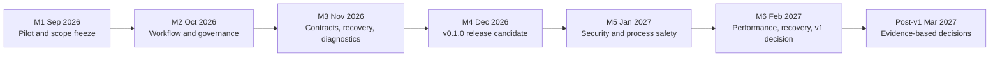

<!-- Generated by docs-site/build-docs.mjs from docs/roadmap.md. Do not edit this file: edit the source and re-run the build (caliber/caliber-ui: npm run sync:docs). -->


# CALIBER roadmap

This is the execution roadmap for the current CALIBER repository and [GitHub
Project #2](https://github.com/rrahimi-uci/caliber-suite/projects/2). It uses a
monthly release train and assumes **1.5 developers**: one primary engineering
stream plus a half-capacity stream for review, testing, documentation,
operations, and release work.

This document is a plan, not a capability claim. The current checkout is an
alpha/current-main build. A route, UI page, package, or passing unit test does
not make a capability supported production behavior. The release gates below
require reproducible evidence.

## Operating rules

- Every developer task is one or two days maximum. A task that grows beyond two
  days becomes a new child issue with its own title, acceptance criteria, and
  milestone.
- A workstream is a coordination issue, not an implementation task. Workstreams
  stay open while their child tickets are executed and reviewed.
- Each month has one primary stream and one half-capacity stream. Reserve the
  remaining capacity for review latency, regressions, pilot findings, release
  evidence, and operational interruptions.
- Monthly increments are releasable checkpoints. Formal product tags are
  created only at M4 (`caliber-v0.1.0`) and M6 (`caliber-v1.0.0`) after their
  gates pass.
- The first-mile pilot tests current `main`; it is not a production-readiness
  or stability claim.
- Every ticket must state exact scope, deliverables, acceptance criteria,
  verification commands, dependencies, and out-of-scope work.

## Current execution order



The controlling dependency is linear: pilot evidence selects the foundation
scope; the foundation makes the supported path repeatable; only then do
security, process safety, performance, recovery, and v1 acceptance begin.

## Monthly release train

| Month | GitHub milestone | Release/checkpoint | Scope | Exit evidence |
|---|---|---|---|---|
| **M1 · Sep 2026** | `M1 2026-09 — First-mile pilot and scope freeze` | Current-main pilot checkpoint | Epic [#78](https://github.com/rrahimi-uci/caliber-suite/issues/78), tester-led journeys #79–#99, capability/triage #100–#101 | Environment record, feature results, reproducible bugs, capability matrix, and selected M2 scope |
| **M2 · Oct 2026** | `M2 2026-10 — Primary workflow and governance` | Workflow increment | Workstreams #60–#61; tasks #102–#107 | One seeded workflow is reproducible through UI and API/SDK; release and environment semantics are explicit |
| **M3 · Nov 2026** | `M3 2026-11 — API contracts, recovery, and diagnostics` | Automation/operations increment | Workstreams #62–#64; tasks #108–#116 | Supported API/SDK/CLI matrix, bounded failure semantics, request correlation, and readiness diagnosis |
| **M4 · Dec 2026** | `M4 2026-12 — v0.1.0 release candidate` | Formal `caliber-v0.1.0` decision | Workstream #65; bug bash #76/#129/#120; gate #66/#121 | Clean build/deploy, release evidence, no unaccepted P0, and human go/no-go |
| **M5 · Jan 2027** | `M5 2027-01 — v1 security and process safety` | Production-safety increment | Workstreams #67–#68; tasks #122–#128 and #130 | Unsafe defaults rejected, scope/secret/egress boundaries tested, loop ownership and replay evidence |
| **M6 · Feb 2027** | `M6 2027-02 — v1 performance, recovery, and release` | Formal `caliber-v1.0.0` decision | Workstreams #69–#71; bug bash #77/#141; gate #72/#142; tasks #131–#142 | Measured workload limits, restore/rollback drill, acceptance packet, production-like bug bash, go/no-go |
| **Post-v1 · Mar 2027** | `Post-v1.0.0 — 2027-03 review` | Decision checkpoint, not a committed release | Epic #58; workstreams #73–#75; tasks #143–#149 | Demand/evidence-based decisions for identity, lifecycle/plugins, managed hosting, and scale |

## Epic and workstream structure

### M1 pilot — Epic #78

The pilot is split into one named journey per ticket. #79 verifies access and
fixture seed; #80–#98 each test one feature journey; #99 consolidates results;
#100–#101 establish capability truth and triage rules. A tester records
pass/fail/blocked/not-supported, exact commands, evidence, and a separate bug
issue for each reproducible defect. These journeys are tester/contributor work,
not 21 engineering person-days: if no tester is available, the M1 exit date
must move rather than silently consuming the implementation reserve.

### v0.1.0 foundation — Epic #56

The foundation is coordinated through #59–#65, #76, and #66. The implementation
children are #100–#121 and #129. The foundation is complete only when one
supported workflow is reproducible, the automation subset is honest, failure
and diagnostics behavior is actionable, and the clean deployment/release path
has evidence.

### v1.0.0 production safety — Epic #57

The production gate is coordinated through #67–#71, #77, and #72. The
implementation children are #122–#142. The v1 gate is not satisfied by a
feature inventory or test count; it requires measured security, process
ownership, workload, recovery, and operator evidence.

### Post-v1 decisions — Epic #58

Post-v1 work is deliberately small and decision-led. #143–#149 may produce
decision records, prototypes, or narrowly scoped internal seams. Treat the
10-person-day total as a discovery ceiling, not a commitment to complete all
seven tickets in March; start only the items justified by the M6 evidence.
None of these items can block M6 or be described as current supported product
behavior.

## Capacity model

The 1.5-developer assumption is a planning limit, not permission to run every
ticket in parallel:

| Capacity slice | Purpose | Monthly rule |
|---|---|---|
| **Primary stream** | One critical workflow or safety outcome | One active workstream; pull its child tickets in dependency order |
| **Half stream** | Tests, docs, pilot triage, diagnostics, or small hardening | One active supporting workstream; never hide a second major behind it |
| **Reserve** | Review, regressions, release evidence, incidents | Protect this capacity every month; it is part of the plan |

At the start of each month, choose the next child ticket only after checking
the parent decision, code seam, fixture, test command, and dependency. At the
mid-month review, cut stretch work before cutting release evidence or safety
tests.

The implementation estimates currently assigned to executable tickets are:

| Milestone | Implementation tickets | Estimated effort | Capacity judgement |
|---|---:|---:|---|
| M1 | #100–#101 | 2 person-days | Feasible for engineering; #79–#99 require tester/contributor capacity |
| M2 | #102–#107 | 9 person-days | Comfortable; reserve time for pilot-driven scope changes |
| M3 | #108–#116 | 12 person-days | Feasible with a protected diagnostics/review stream |
| M4 | #117–#121 and #129 | 9 person-days | Feasible only if the bug bash and go/no-go remain release work, not feature expansion |
| M5 | #122–#128 and #130 | 14 person-days | Feasible; keep security and process-safety work ahead of polish |
| M6 | #131–#142 | 18 person-days | Feasible but the tightest month; protect restore, acceptance, bug bash, and decision tickets |
| Post-v1 | #143–#149 | 10 person-days | Discovery ceiling; select a subset after #142 rather than committing all work |

## Codebase grounding

The ticket decomposition follows the current package and test boundaries:

| Capability | Implementation seams | Existing verification anchors |
|---|---|---|
| Server and routes | `caliber/src/caliber/server.py`, `caliber/src/caliber/routes/` | `caliber/tests/test_routes_*.py`, contract smoke tests |
| Workflow runtime | `caliber/src/caliber/workflows/`, `caliber/src/caliber/orchestrator/` | workflow compiler/runtime/e2e tests |
| Release and governance | `caliber/src/caliber/release_operations.py`, `caliber/src/caliber/routes/releases.py`, `caliber/src/caliber/workflows/deploy_gate.py` | release, promoter, approval, and deploy-gate tests |
| Reliability and events | `caliber/src/caliber/events/`, worker/runtime modules, effect ledger | event sequencing, worker edge-case, retry, and effect-ledger tests |
| Observability | `caliber/src/caliber/observability/`, health, metrics, trace routes | readiness, logging, trace, metrics, and observability route tests |
| SDK and CLI | `sdk/caliber-sdk/`, `sdk/caliber-cli/` | SDK transport/resource/waiter and CLI tests |
| UI and pilot journeys | `caliber/caliber-ui/src/pages/`, Playwright configs, fixture pack | page tests, cookbook tests, focused Playwright journeys |
| Deployment and docs | `deploy/`, `scripts/ci-local.sh`, docs sync/build scripts | deployment, packaging, docs executable-spec, and CI gates |

## Release gates

### M1 exit

- #79–#99 have recorded outcomes and linked reproducible bugs.
- #100 classifies current capabilities using live evidence.
- #101 defines the common finding format and severity rules.
- #56 has a documented M2 scope; unsupported features are not silently added.

### M4 `caliber-v0.1.0` gate

- #102–#119 are complete or explicitly descoped with evidence.
- #129 and #120 have no untriaged P0/P1 release blocker.
- The clean-checkout build, deployment, docs, and rollback path is reproducible.
- #121 records a human go/no-go decision before any formal tag is published.

### M6 `caliber-v1.0.0` gate

- #122–#140 provide dated security, process, performance, recovery, and
  acceptance evidence.
- #141 has no unaccepted P0/P1 blocker.
- #142 records a human go/no-go decision and publishes residual risks.
- The release notes state the measured supported envelope; they do not imply
  enterprise identity, managed hosting, multi-region, or unmeasured scale.

## Bug and feedback workflow

Testers use the labels `area-testing` and the applicable release label:

```text
release-v0.1.0 + area-testing   M1–M4 current release work
release-v1.0.0 + area-testing   M5–M6 production-gate testing
help wanted                     Optional volunteer/contributor attention
```

A bug report must include release commit, environment, fixture, exact steps,
expected result, actual result, logs/request ID, severity, and whether the
behavior is supported by the capability matrix. A test ticket records the
finding; it does not absorb the implementation fix.

## Success measures

- **M1 adoption:** all named pilot journeys have evidence and no untriaged
  critical finding.
- **M4 foundation:** one supported workflow and automation path are repeatable
  from a clean checkout with truthful release notes.
- **M6 production boundary:** security, process ownership, measured workload,
  recovery, acceptance, and operator evidence support a human decision.
- **Post-v1 discipline:** deferred work is selected from production evidence and
  demand, not from the existence of an attractive architectural seam.

## Sources and current limitations

The [product completeness report](https://github.com/rrahimi-uci/caliber-suite/blob/main/docs/reports/product-completeness-report.md),
the [pilot fixture pack](https://github.com/rrahimi-uci/caliber-suite/blob/main/docs/reports/first-milestone-pilot-fixture-pack.md), the
package manifests, CI workflows, and the linked GitHub issues are the evidence
sources for this roadmap. Known limitations remain explicit: current-main is
alpha, single-environment behavior is the safe v0.1 boundary, and enterprise
identity, managed hosting, multi-region operation, and broader governed asset
lifecycle remain post-v1 decisions.
