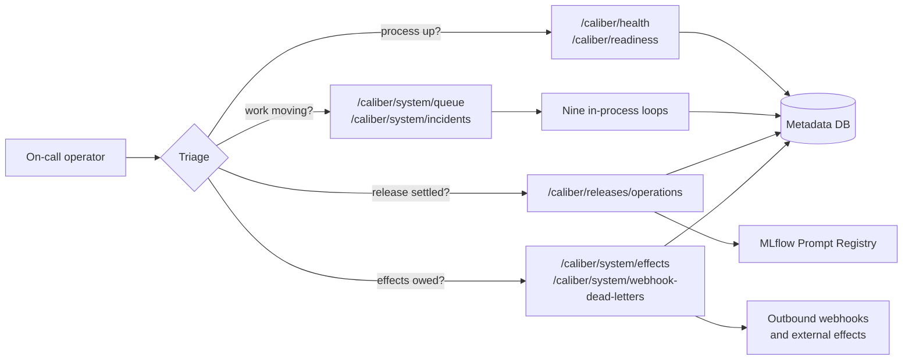

<!-- Generated by docs-site/build-docs.mjs from docs/runbook.md. Do not edit this file: edit the source and re-run the build (caliber/caliber-ui: npm run sync:docs). -->

# Operations runbook

When a governed release goes wrong, the useful question is rarely "what broke" — the
traces already answer that. It is "what am I allowed to do about it, and what will
that do to the audit record." This page answers the second question. It is the
on-call procedure for the recoveries CALIBER cannot complete on its own: a release
intent that never settled, an external effect whose outcome nobody knows, a queue
that stopped draining, and a rollback whose semantics differ by asset family. Every
endpoint, default, and state name below is the one the implementation actually uses.

## At a glance

| | |
| --- | --- |
| Audience | Whoever is on call for a CALIBER deployment, plus the operator who owns a release |
| First stop | `GET /caliber/health`, then `/caliber/readiness`, then `/caliber/system/queue` |
| Recovery model | Per background loop, not uniform — a crash loses a refinement job and requeues a workflow run |
| Decisions only a human may make | Resolving an indeterminate external effect, retrying a lost at-most-once job, applying a candidate |
| Blast radius of a live target | One mutable pointer per releasable family; rollback restores the *recorded* target, not "the previous number" |
| Environments | One. There is no `dev`→`staging`→`prod` ladder to rehearse in |
| Not covered here | Provider outages, MLflow's own operation, and anything under `caliber/caliber-ui` — those escalate to their owners |

All paths below are relative to the API prefix `/ajax-api/2.0/mlflow/caliber`; the
runbook writes them as `/caliber/…` for readability. Every mutating endpoint is
scope-checked and audited — the audit row is part of the recovery, not a side effect
of it.



```legend
```

## Reference

## Severity and first response

Classify before you act. The ladder matters because two of these tiers forbid
guessing, and guessing is the failure mode this platform is built to prevent.

| Tier | Definition | First move |
| --- | --- | --- |
| **S1 — outward-facing effect in doubt** | An external system may or may not have been called | Do **not** retry. Go to [P2](#p2-an-external-effect-is-indeterminate) |
| **S2 — production behaviour wrong** | A live target points at a bad version | Roll back first, diagnose second. Go to [P6](#p6-roll-back-a-release) |
| **S3 — work not progressing** | Queue not draining, or a job vanished | Go to [P3](#p3-the-workflow-run-queue-is-not-draining) or [P4](#p4-a-refinement-or-calibration-job-vanished) |
| **S4 — record incomplete** | A release intent never settled, but behaviour is correct | Go to [P1](#p1-a-prompt-release-is-stuck) |

Before touching anything, capture four things. They are what makes the recovery
reconstructable, and two of them are destroyed by a restart:

1. `GET /caliber/system/queue` — the queue verdict and its `degraded_reasons`.
2. `GET /caliber/releases/operations` — every unsettled release intent.
3. `GET /caliber/system/effects` — in-progress and indeterminate effect claims.
4. The relevant `GET /caliber/audit-log` window, or `…/audit-log/export`.

## Triage surfaces, and what each one does not prove

The most common on-call error here is reading a green probe as a working system.
Each surface proves something narrow, and the right-hand column is the part that
matters at 3am.

| Surface | Proves | Does **not** prove |
| --- | --- | --- |
| `GET /caliber/health` | The API process answers and its database is reachable | That any work is being done |
| `GET /caliber/readiness` | Which providers are **configured** | That any of them work |
| `GET /caliber/system/queue` | Workflow-run queue depth, worker liveness, stale leases | Anything about knowledge-base builds or Aria plans — separate workers, not aggregated |
| `GET /caliber/system/services` | Per-service visibility | End-to-end request success |
| `GET /caliber/system/alerts` | SLO objective evaluation | That an objective was well chosen |
| `GET /caliber/system/incidents` | Durable open/resolved SLO incidents | That anyone was paged |
| `GET /caliber/metrics` | Prometheus exposition | Nothing is scraping it |
| `GET /caliber/releases/live` | What each live target points at **now** | That the pointer got there through the governed path |

Two configuration facts belong with this table:

- **`/caliber/metrics` is open by default.** It is protected only when a bearer-token
  secret source is configured. On any shared network, configure it.
- **SLO objectives are opt-in and global**, set through
  `CALIBER_SLO_OBJECTIVES` (for example
  `workflow_success_rate>=0.99,workflow_p95_latency_ms<=30000`). They are
  deployment-wide, not per-workflow or per-agent. With none set, `/caliber/system/alerts`
  has nothing to say and incidents never open.

## P1 — a prompt release is stuck

A prompt alias release writes a durable intent *before* calling the provider, so a
crash mid-release is visible rather than silent. It is still not atomic: the provider
call and the SQL settlement cannot commit together.

**Symptom.** A release shows as in flight longer than a provider call should take, or
`/caliber/releases/operations` lists a row in `applying` or `reconcile_required`.

**Confirm.** `GET /caliber/releases/operations`. Read `status` exactly:

| Status | Means | Who settles it |
| --- | --- | --- |
| `prepared` | The intent is durable and **no provider call started** | You, explicitly — the reconciler never guesses about these |
| `applying` | A provider call was made; the outcome was not recorded | The reconciler, by observing the alias |
| `reconcile_required` | The observed alias disagreed with the intent | The reconciler retries; if it persists, you |
| `applied` / `failed` | Terminal | Nobody |

**Decide.** For `applying` and `reconcile_required`, prefer the loop: the
`ReleaseReconcilerTask` sweeps every 60s and compares the live alias against the
intent's exact before/after versions. Give it two cycles before intervening. For
`prepared`, the reconciler will *not* act — that state proves no external call
happened, so the retry-or-abandon decision is yours.

**Act.** `POST /caliber/releases/operations/reconcile` to force a sweep, or
`POST /caliber/releases/operations/{operation_id}/resolve` to settle one row
explicitly.

**Verify.** `GET /caliber/releases/live` shows the intended target, and the operation
reads `applied`.

**Record.** Reconciliation is audited. If you resolved a row by hand, the audit row
is the only evidence of *why* — write the reason as if a reviewer will read it in six
weeks, because that is the point of the record.

> A stuck operation is an **S4**, not an S2, as long as `/caliber/releases/live` shows
> the version you intended. The pointer is what production reads; the operation row is
> the record of how it got there. Fix the record, but do not roll back behaviour that
> is already correct.

## P2 — an external effect is indeterminate

This is the only tier where the platform deliberately refuses to decide. The effect
ledger gives external effects at-most-once semantics across a run restart, and reports
`indeterminate` when a process died between performing an effect and recording its
outcome. That report is correct: only a human can know whether the request reached the
remote system.

**Symptom.** A workflow run is blocked, or `/caliber/system/effects` lists a claim
that is not progressing.

**Confirm.** `GET /caliber/system/effects` — it defaults to `in_progress`, which is
the set that needs a decision. Identify the `effect_key` and read the run's event
timeline via `GET /caliber/workflow-runs/{run_id}/events`.

**Decide.** Establish, *at the remote system*, whether the effect happened. Do not
infer it from CALIBER's records — the whole reason the claim is indeterminate is that
CALIBER's records stop short of the answer.

**Act.** `POST /caliber/system/effects/{effect_key}/resolve` with the decision:

| Decision | Use when | Consequence |
| --- | --- | --- |
| `skip` | The effect **did** happen | The run continues without repeating it |
| `retry` | The effect did **not** happen | The run performs it |

**Verify.** The run leaves the blocked state; the ledger row is terminal.

**Record.** Resolution is admin-scoped and audited, and it asserts something about the
outside world that CALIBER cannot verify. Who claimed it and on what basis is
release-relevant evidence — not a convenience toggle.

## P3 — the workflow-run queue is not draining

**Symptom.** Runs sit in `queued`, or `/caliber/system/queue` reports
`healthy: false`.

**Confirm.** `GET /caliber/system/queue` and read `degraded_reasons` — it names the
distinct condition rather than making you infer it:

| Reason | What it means | Act |
| --- | --- | --- |
| `no workflow-run worker has registered a heartbeat` | A deployment that never started a worker | Check the process actually runs background tasks |
| `no workflow-run worker is reporting a fresh heartbeat` | A worker that died | Restart; the janitor requeues the abandoned runs |
| `N registered worker(s) stopped reporting` | Named workers went stale | The names are the actionable part — investigate those |
| `N running run(s) past lease with no fresh heartbeat` | Abandoned claims | The janitor requeues; confirm it is running |
| `oldest queued run has waited Ns` | Capacity, not liveness | Scale, or accept the lag |

**Decide.** Distinguish *dead worker* from *slow worker*. A dead worker's runs are
recoverable: lease expiry requeues them and they resume from their last checkpoint. A
slow worker's are not stuck, just late — requeueing them buys nothing and burns the
effect ledger's suppression budget.

**Act.** Restart the process for a dead worker. For a specific run,
`POST /caliber/workflow-runs/{run_id}/cancel` then `…/retry`; inspect
`…/checkpoints` first to see what a resume would replay.

**Verify.** `queued` falls, `workers_alive` is non-zero, `stale_leases` is zero.

> `workers_alive` counts workers that registered **or** hold a fresh claim — the union,
> not a choice. During an upgrade an old worker may hold a claim without registering,
> and counting one source alone under-reports.

## P4 — a refinement or calibration job vanished

Two loops are **at-most-once**, and this is the case where "the queue" is the wrong
mental model. Recovery is per loop.

**Symptom.** A refinement job reads `failed` with no diagnosis, or a calibration job
sits in `running` with no progress.

**Confirm.** `GET /caliber/jobs` and `GET /caliber/jobs/{job_id}`.

**Decide and act** by loop, because they differ:

| Loop | On owner death | Your move |
| --- | --- | --- |
| **Refinement** | The janitor marks the job `failed` after a stale heartbeat. It is **not** requeued | Re-run the refinement. Progress is lost; no partial state is trustworthy |
| **CalibrationDrain** | Nothing automatic. The row stays `running` | Abandon it, or create a new lineage-linked retry. Retries are explicit new jobs, by design |

**Verify.** The new job reaches a terminal state and its candidate appears for review.

**Record.** For calibration, the lineage link is what preserves the relationship
between attempts. Creating an unlinked job loses that, so link it.

> The janitor sweeps every 60s (`CALIBER_JANITOR_INTERVAL_SECONDS`) and presumes a
> `running` job crashed when its heartbeat is older than 300s
> (`CALIBER_JANITOR_STALE_THRESHOLD_SECONDS`). That threshold must stay comfortably
> longer than the longest expected single stage — set it too low and healthy long
> stages get reaped, which looks exactly like this playbook's symptom.

## P5 — outbound webhooks are dead-lettering

**Symptom.** Downstream consumers report missing events.

**Confirm.** `GET /caliber/system/webhook-dead-letters`.

**Decide.** Dead-lettering after settlement is the dispatcher working as designed —
delivery is at-least-once *by design*, so a consumer must be idempotent. Establish
whether the fault is the endpoint (fix it, then replay) or the payload (do not replay;
acknowledge and fix the producer).

**Act.** `POST` to the dead letter's replay path once the endpoint is healthy, or
acknowledge it to stop it being counted.

**Verify.** The dead-letter list drains and the consumer confirms receipt.

## P6 — roll back a release

**Rollback is not one operation.** Per-family guarantees are load-bearing here, and
the most likely operator error in CALIBER is assuming a guarantee transfers between
families because the same interface component appears in both places.

| Family | Endpoint | Semantics |
| --- | --- | --- |
| Prompt | via the release service | Restores the **recorded** outgoing alias target. Takes the same intent record and audit row as a promotion |
| Workflow | `POST /caliber/workflows/{workflow_id}/deployments/{alias}/rollback` | Pops the deployment's checkpoint stack |
| Skill | `POST /caliber/skills/{skill_id}/rollback` | Restores the prior snapshot as a **new** version |
| Knowledge base | `POST /caliber/knowledge-bases/{knowledge_base_id}/rollback` | Derives the prior build from history |
| Agent | `POST /caliber/agents/{agent_id}/rollback` | Uses the checkpoint stack at `…/checkpoints` |
| Tool | — | Read-only history and **no live alias**. There is nothing to roll back; ship a new version |
| Test set, judge, MCP server | — | No version rollback. MCP connection and policy controls are fail-closed instead |

**Decide.** Two questions, in order. Does this family *have* a rollback path? And is
the target the one the release **recorded**, or one you are inferring? Restoring "the
previous number" is how a rollback lands on a version that was never live.

**Act.** Use the family's endpoint above. Rollback is itself a release operation on
the prompt path, so it is scope-checked, audited, and checkpointed like any promotion.

**Verify.** `GET /caliber/releases/live` for the family's live target;
`caliber_rollbacks_total` increments.

**Record.** The audit row plus the checkpoint is the rollback's evidence. If you
rolled back a family with no recorded target, say so explicitly — that is a weaker
claim than a prompt rollback and should not read like the same thing.

## P7 — an SLO incident is open

**Symptom.** `GET /caliber/system/incidents` lists a `status: open` incident at
`severity: warning` or `critical`.

**Confirm.** `GET /caliber/system/alerts` for which objective is breaching, and
`/caliber/metrics` for the underlying series.

**Act.** `POST /caliber/system/incidents/{incident_id}/acknowledge` to record that a
human owns it, or `…/silence` to suppress a known-noisy objective. These are
different statements: acknowledge means "being worked", silence means "this objective
is wrong or this breach is expected".

**Verify.** The incident resolves on its own when signals recover — resolution is
derived, not asserted.

> Incidents are durable and emit `slo.incident.opened` / `slo.incident.resolved`.
> Silencing suppresses the surface, not the underlying breach; if you silence, open a
> follow-up to fix either the objective or the system.

## Background loops and their crash behaviour

The claim predicate is shared and gives concurrent mutual exclusion for all of these.
**Recovery after the owner dies is not shared**, and recovery is what determines
delivery semantics — which is why this table states them per loop instead of claiming
one number for "the queue".

| Loop | Lease | Recovery after owner death | Delivery |
| --- | --- | --- | --- |
| Refinement | heartbeat | Janitor marks `failed`; **not** requeued | At-most-once; needs operator action |
| WorkflowRun | lease + heartbeat | Lease expiry requeues; resumes from last checkpoint | At-least-once at the step boundary; effect ledger suppresses repeats |
| CalibrationDrain | — | None automatic; stays `running` | At-most-once per job; retries are explicit new jobs |
| KnowledgeBase | claim | Re-ingest is idempotent per source | At-least-once, idempotent |
| WebhookDispatcher | claim | Redelivery with settlement and a dead-letter path | At-least-once, by design |
| WorkflowScheduler | — | Idempotent via a minute-bucketed key behind a unique partial index | Exactly-once **firing**; the work then follows WorkflowRun |
| Janitor | — | An idempotent sweep | Idempotent |
| AriaPlan | — | Polls plans parked on settled jobs; takes no claim | At-least-once resume |
| ReleaseReconciler | — | Periodic; observes aliases for `applying` / `reconcile_required` rows | Idempotent; never guesses about `prepared` |

External effects are a **separate question from job delivery**. The effect ledger
records an `in_progress` external call whose outcome after a crash is *indeterminate* —
neither confirmed nor safely repeatable — and surfaces it as such rather than guessing.
That is [P2](#p2-an-external-effect-is-indeterminate), and no amount of requeueing
resolves it.

## Limits you must operate around

These are properties of the shipped system, not bugs awaiting triage. Each one changes
what an on-call response can achieve.

| Limit | Operational consequence |
| --- | --- |
| **The reconciler must be operated** | A durable intent removes silent divergence. It does not remove the need for something to observe the provider and settle the row |
| **Two dual-write boundaries cannot be closed** | Object-storage writes and external registry effects cannot join the caller's SQL transaction. A failed object write can leave orphaned bytes needing a sweep |
| **In-memory limiters are per process** | The failed-login throttle and API rate limiter are per-process token buckets. Effective ceilings scale with the worker count — size them for it |
| **Local tool and MCP execution is containment, not isolation** | The shipped runner keeps ambient host authority. Untrusted authors need an operator-supplied backend, not a configuration flag |
| **One environment** | No staging rehearsal. Drills run against production or against a throwaway deployment |
| **Apply is an operator confirmation** | It is a real human decision point after an automated gate. It is **not** separation of duties: nothing requires the applier to differ from the author |
| **The advancement gate is not a system-wide interlock** | It is enforced inside the refinement state machine. The direct operator promotion endpoint can carry an advisory verdict and an attributed override without entering it |

## Drills

Every procedure above depends on somebody having done it once before. Three are worth
rehearsing on a schedule, because each exercises a path that only appears during an
incident:

1. **Reconcile a release.** Interrupt a prompt release, then settle it through
   `/caliber/releases/operations`. Confirms the intent is durable and that you can read
   `applying` versus `prepared` correctly under pressure.
2. **Roll back one release per family you actually use.** Confirms the family has the
   path you assume it has, and that the restored target is the recorded one.
3. **Replay a dead letter.** Confirms your consumers are genuinely idempotent, which
   at-least-once delivery assumes and rarely verifies.

Record each drill in the audit log the same way you would a real recovery. A drill
that leaves no record has not tested the part that matters.
