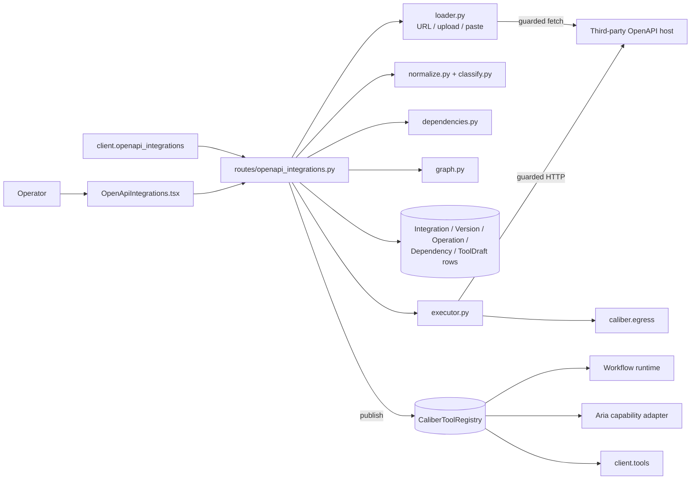
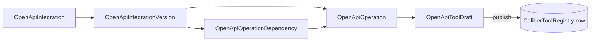
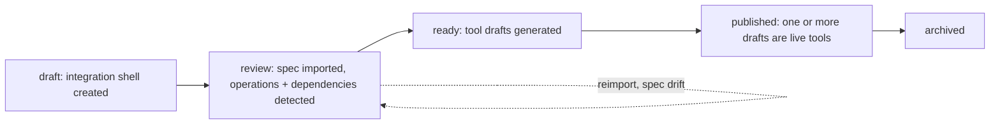

<!-- Generated by docs-site/build-docs.mjs from docs/16-openapi-integrations/architecture.md. Do not edit this file: edit the source and re-run the build (caliber/caliber-ui: npm run sync:docs). -->


# OpenAPI Integrations Architecture

## At a glance

| Dimension | OpenAPI Integrations layer |
| --- | --- |
| **What it is** | A governed pipeline that imports a third-party OpenAPI 3.x contract, normalizes and classifies its operations, detects dependencies between them deterministically, and lets an operator curate which operations become published, agent-facing tools. |
| **Where state lives** | `CaliberOpenApiIntegration` (identity) → `CaliberOpenApiIntegrationVersion` (one pinned spec snapshot) → `CaliberOpenApiOperation` (normalized operations) → `CaliberOpenApiOperationDependency` (canonical dependency rows) → `CaliberOpenApiToolDraft` (curated, pre-publication tools). Publication writes a row into the existing `CaliberToolRegistry` with `execution_backend="openapi_http"`. |
| **Key surfaces** | Routes under `/ajax-api/2.0/mlflow/caliber/openapi-integrations` (`routes/openapi_integrations.py`), the parser/classifier/detector modules under `integrations/openapi/*`, the `OpenApiIntegrations.tsx` UI, and `client.openapi_integrations` in the Python SDK. |
| **Runtime model** | Import and curation are control-plane only — no runtime tool exists until an operator explicitly publishes a draft. A published tool executes through a declarative HTTP executor (`integrations/openapi/executor.py`) that reuses `caliber.egress`'s guarded transport, the same policy the workflow `webhook`/`api_request` nodes use. |
| **Trust / safety** | All spec fetch (`url` import, reimport) and tool execution go through egress policy: loopback/link-local/private ranges and the cloud metadata endpoint are blocked by default. Secrets are referenced (`env://`, `secret://`), never stored raw. A draft cannot be previewed unless `allow_in_preview` is set, and publication requires every referenced secret to resolve. |
| **Dependency model** | Detection is mostly deterministic: OpenAPI `links` auto-wire at `high` confidence, structural rules (path hierarchy, identifier-field matching, async create→poll pairs) land at `medium` as operator-reviewable suggestions, and same-tag grouping lands at `low` as advisory-only. The graph an integration can also serve is a derived projection of these rows, never their replacement. |
| **Calibration** | Once published, an OpenAPI-derived tool is a normal `CaliberToolRegistry` row, so it inherits the same saved test-case, synchronous calibration, and durable calibration-job surfaces as a hand-registered tool. |

The sections below start from this picture and drill down into the scope,
boundaries, data model, APIs, lifecycle, and trust posture in detail.



```legend
```

## Reference

## 1. Scope and responsibilities

This module turns a third-party OpenAPI 3.x document into governed CALIBER
assets through a five-stage pipeline:

1. **import** — pin one parsed spec as an immutable version, from pasted
   text, an uploaded file, or a URL fetched through guarded egress;
2. **normalize and classify** — extract operations with a stable identity
   (`operation_key`), and classify each one deterministically (side-effect
   level, resource type, pagination style, async-job shape) beyond what the
   HTTP method alone implies;
3. **detect dependencies** — find relationships between operations (explicit
   `links`, path hierarchy, identifier-field matching, async lifecycle pairs,
   shared-tag grouping) and record them as typed, confidence-scored rows;
4. **curate tool drafts** — an operator selects operations (by id, or by
   tag/method/path-prefix filter) and generates one draft per operation, or
   binds several into one tool pack, with editable auth binding, server URL,
   and approval/preview flags;
5. **publish** — a ready draft becomes a row in the existing
   `CaliberToolRegistry` with `execution_backend="openapi_http"`, reachable
   through the same tool, workflow, and SDK surfaces every other tool uses.

It deliberately does **not**:

- auto-publish an imported operation as a runtime tool;
- generate Python source as an execution artifact — every published tool
  executes through the declarative HTTP executor, not generated code;
- treat an agent-suggested dependency as canonical — only deterministic
  detection auto-wires or feeds the operator-review queue;
- replace the workflow `api_request` node — that remains the low-level,
  one-off escape hatch; this module is for a *reusable, versioned, curated*
  external capability (see [§4.4.1 of the integration proposal](https://github.com/rrahimi-uci/caliber-suite/blob/main/docs/reports/openapi-integration-proposal.md#441-relation-to-the-existing-api-request-node)).

## 2. Module boundaries

| Module | Responsibility |
| --- | --- |
| `caliber/routes/openapi_integrations.py` | HTTP surface: CRUD on integrations, import/reimport, versions and diff, operations, dependencies and review, graph, tool-draft generation/update/preview/publish. |
| `caliber/integrations/openapi/loader.py` | Turns `inline_text`/`upload`/`url` into spec text. The `url` path is the feature's SSRF surface, so it runs through the same `caliber.egress` policy as tool execution — never an unguarded fetch. |
| `caliber/integrations/openapi/normalize.py` | Parses OpenAPI 3.x YAML/JSON into a stable, diffable operation list; computes a content hash for duplicate-import detection. |
| `caliber/integrations/openapi/classify.py` | Deterministic per-operation classification: side-effect level (mapped onto CALIBER's `read`/`write`/`external_action` tool vocabulary), CRUD kind, resource type, pagination style, async-job shape. Pure function of the normalized operation — same input, same output, every time. |
| `caliber/integrations/openapi/dependencies.py` | Deterministic dependency detection across an operation list: explicit `links`, path-hierarchy preconditions, identifier-field flow, async create→poll pairs, and same-tag grouping. No LLM call in this module. |
| `caliber/integrations/openapi/diff.py` | Structural diff between two normalized-operation lists — added/removed/changed/breaking, keyed on the tracked fields (side-effect level, auth, deprecation, body requirement) rather than free text. |
| `caliber/integrations/openapi/graph.py` | Projects operations + dependency rows + tool drafts into a node/edge graph, including fingerprinted request/response schema nodes. Pure derivation — never a second source of dependency truth. |
| `caliber/integrations/openapi/tool_drafts.py` | Builds a draft's name, description, input/output schema, and execution config from one operation or a multi-operation pack. |
| `caliber/integrations/openapi/executor.py` | The one place an OpenAPI-derived tool touches the network: schema validation, auth injection, guarded HTTP request (with a bounded, idempotency-aware retry), OAuth client-credentials / refresh-token exchange through the same egress policy, and response-header redaction. |
| `caliber/assistant/capabilities.py` + `assistant/agent_tools.py` | The stable `openapi_tool.list` / `openapi_tool.invoke` bridge plus the dynamic per-turn projection of visible published OpenAPI tools into Aria's toolset (see [§6](#6-agent-and-workflow-projection)). |

## 3. Domain model



```legend
```

| Entity | Purpose |
| --- | --- |
| `CaliberOpenApiIntegration` | Stable identity: name, owner, status (`draft`→`review`→`ready`→`published`→`archived`), project scoping. |
| `CaliberOpenApiIntegrationVersion` | One pinned, immutable imported document: source kind/ref, spec digest, normalized summary, import warnings, cached `graph_snapshot`. |
| `CaliberOpenApiOperation` | One normalized operation: method, path, tags, side-effect level, auth requirement, the full normalized parameter/body/response shape (including its `classification` block). |
| `CaliberOpenApiOperationDependency` | One typed edge between two operations: `dependency_type`, `confidence`, `source`, `status` (`auto_wired`/`suggested`/`advisory`/`confirmed`/`rejected`), `binding_field_map`. |
| `CaliberOpenApiToolDraft` | One curated, pre-publication tool: bound operation(s) (a pack has `additional_operation_ids`), auth binding, server URL, input/output schema, approval/preview flags, `published_tool_id` once live. |

`CaliberToolRegistry` gains two fields this module depends on:
`execution_backend` (`python_callable` | `openapi_http`) and `backend_config`
(the declarative HTTP call description a published draft carries over).

## 4. API surface

All routes are under `/ajax-api/2.0/mlflow/caliber/openapi-integrations` and
tagged `beta` in the served management OpenAPI document.

| Group | Routes |
| --- | --- |
| Integration lifecycle | `GET/POST /`, `GET/PATCH /{id}`, `POST /{id}/archive` |
| Import | `POST /{id}/import`, `POST /{id}/reimport`, `POST /{id}/validate-spec-source` |
| Versions | `GET /{id}/versions`, `GET /{id}/versions/{version_id}`, `POST /{id}/versions/{version_id}/diff` |
| Operations | `GET /{id}/operations`, `GET /{id}/operations/{operation_id}` |
| Dependencies | `GET /{id}/dependencies`, `PATCH /{id}/dependencies/{dependency_id}` |
| Graph | `GET /{id}/graph` |
| Tool drafts | `GET /{id}/tool-drafts`, `POST /{id}/tool-drafts/generate`, `GET/PATCH /{id}/tool-drafts/{draft_id}`, `POST .../preview`, `POST .../publish` |
| Credentials | `POST /{id}/validate-credential-binding` |

The SDK mirrors this one-for-one as `client.openapi_integrations` — see the
[SDK reference](m-21-sdk-reference.md) for the generated method signatures and
[SDK beta surfaces](m-22-sdk-beta.md) for the behavioral notes (the preview gate,
the pack input shape, the reimport/diff round trip).

## 5. Lifecycle



```legend
```

Import runs synchronously inside the import/reimport call: normalize, persist
operations, run deterministic dependency detection, and cache a graph
snapshot — all before the response returns, so "imported" always means
"curatable," never "still processing."

`reimport` only applies to a `url`-sourced version: it re-fetches the same
URL, imports it as a **new** version (past versions are never mutated), and
returns a structural diff against the previous version so an operator can see
exactly what moved before re-curating. A newly-deprecated operation, a changed
auth requirement, and a changed side-effect classification are flagged as
breaking; everything else is informational.

## 6. Agent and workflow projection

A published tool is an ordinary `CaliberToolRegistry` row, so it is
automatically visible to:

- **workflow tool binding** — `_bind()` in `workflows/runtime.py` dispatches on
  `execution_backend` and reaches the executor with the *plan's* egress
  policy, not a fallback;
- **the tool test-run route and SDK `client.tools`** — no special-casing
  needed beyond the execution-backend switch.

Aria reaches the published surface in two ways:

- `openapi_tool.list` (read tier) — lists published OpenAPI tools, including
  write-capable ones, for discovery;
- `openapi_tool.invoke` (read tier) — invokes one **read-only**,
  **non-approval-gated** published tool by id. A write or `external_action`
  tool is refused with a message pointing at the tool registry, a workflow,
  or the SDK instead.
- In a synchronous Aria authoring turn, `assistant/agent_tools.py` now
  projects every *visible* published OpenAPI tool into the per-turn toolset
  with tiering derived from the tool row itself:
  - `read` tools are available in every mode;
  - `write` / `external_action` tools are available only in mutating build
    modes (`auto_all` / `full_autonomy`);
  - approval-gated tools remain non-callable in a synchronous turn and keep
    their human gate.

So the stable generic adapter remains the explicit bridge, while the live
published-tool projection closes the "why doesn't Aria see this tool I just
published?" gap for ordinary read and mutate cases.

## 7. Security and trust boundaries

| Risk | Mitigation |
| --- | --- |
| SSRF via spec URL or tool execution | Both paths go through `caliber.egress`: loopback, link-local, private ranges, and the cloud metadata endpoint are blocked unless explicitly allowlisted. The executor pre-checks the destination *and* the transport that opens the connection re-checks the address it actually connects to, so a name that re-resolves after the check cannot be reached. |
| Secret exfiltration | Auth bindings carry a secret **reference** (`env://…`, `secret://…`); the resolved value is injected at request time and never persisted on the draft, the tool row, or an audit entry. Response headers likely to carry session/auth material (`Set-Cookie`, `Authorization`, …) are stripped before a result reaches the caller. |
| Unsafe writes reached before approval | A draft cannot be fired through `preview` unless `allow_in_preview` is explicitly set — the same gate a registered tool's preview path uses. Publication additionally requires every secret reference to resolve. |
| Hallucinated dependency structure | Only OpenAPI `links` and rule-based structural matches ever reach `auto_wired`/`suggested` status; there is no LLM call inside the detector at all. A same-tag grouping — the weakest, most text-only signal — is capped at `low`/advisory and never auto-wired. |
| Duplicate or silent re-import | A spec's content hash is checked before persisting a new version; an identical re-import is rejected with a pointer to the existing version rather than silently duplicating it. |
| Retry turning a create into a duplicate | The executor only retries a non-idempotent method (`POST`/`PATCH`-as-create) when the caller supplied an idempotency-key header; otherwise a transient 5xx/429 on a write is reported, not retried. |

## 8. Extension points

- **Graph substrate.** The current graph is a JSON snapshot cached on the
  integration version, derived on demand from canonical rows. A v2 could
  project it into CALIBER's Apache AGE graph substrate for richer traversal —
  see the [knowledge-base architecture](m-08-knowledge-bases.md)
  for the existing AGE integration pattern to follow.
- **OAuth browser flows.** Static bearer/API-key/basic/header bindings now sit
  beside OAuth client-credentials and refresh-token exchanges. The remaining
  deferred slice is a full browser-based authorization-code / PKCE flow,
  because that needs a distinct operator session/redirect contract rather than
  one more executor binding.
