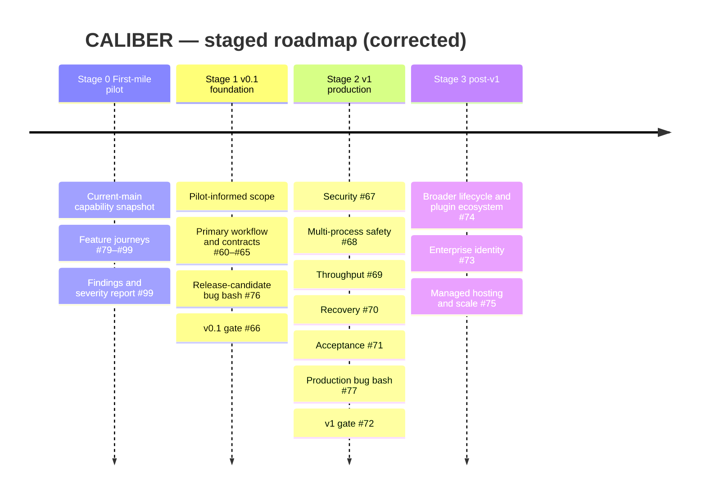

<!-- Generated by docs-site/build-docs.mjs from docs/roadmap.md. Do not edit this file: edit the source and re-run the build (caliber/caliber-ui: npm run sync:docs). -->

# CALIBER — Roadmap

*A feasibility-grounded, stage- and quarter-based plan derived from the [competitive analysis](m-17-competitive-analysis.md) and **verified against the actual codebase**. Built for a **two-person team — you (product/strategy lead) and me (AI pair-programmer)** — and scoped to what that team can realistically ship and, above all, *review*.*

> **Status:** planning snapshot, not a current capability reference. The original
> audit baseline found historical nine-optimizer claims; those claims have since
> been reconciled. As of 2026-08-10, five provider paths are implemented,
> automatic rules can choose four, explicit job/agent pins can reach all five, and
> the prompt form exposes two. The repo now also ships a served management
> OpenAPI document, searchable HTML REST and SDK docs, an alpha Python SDK
> (`caliber-sdk`), an alpha CLI (`caliber-cli`), and an experimental plugin SDK
> (`caliber-plugin-sdk`). Roadmap deliverables remain proposed until current code
> and release evidence prove them landed.

> **Current delta (2026-08-13):** prompt authoring is now non-live, and direct
> prompt promote/rollback uses an intent-first, idempotent release-operation row
> with exact before/after versions, optimistic concurrency, incomplete-operation
> locking, and operator-triggered reconciliation. The docs site now publishes the
> SDK, REST API, cookbook, and architecture surfaces as tested searchable HTML.
> This is meaningful delivery, but not completion of the customer-ready arc:
> requester/approver separation, enforced human sign-off, configurable
> multi-environment promotion, and production-stable operator contracts remain
> proposed work.

> **This roadmap was adversarially critiqued against the code before publication** (three skeptic passes: feasibility-vs-architecture, competitive-alignment, capacity). Several first-draft assumptions turned out to be wrong — most importantly that human-approval governance was merely "dormant." The corrections are recorded in **[§12 Feasibility review](#12-feasibility-review)**; the plan below is the corrected version.
>
> **Planning unit.** The execution order starts with a current-main first-mile
> pilot, then the v0.1.0 foundation, then the v1.0.0 production gate, and only
> then post-v1 work. Stage 0–Stage 2 / Q1–Q4 are committed and detailed; Stage 3
> / Q5–Q6 is directional work re-committed at the H1 review. Quarters are relative (start = "next
> quarter"), not fixed calendar dates.
>
> **Grounding rule.** Every deliverable names the architectural seam it builds on. Where a "seam" is only a docstring or a UI constant (not working code), it is marked 🌱 *green-field* and sized as new work — because pretending otherwise is exactly the "docs outrun code" failure this roadmap exists to cure.

---

## TL;DR

CALIBER's wedge is real but narrow: an open-source, self-hosted, MLflow-integrated control plane that connects policy-selected optimization, evaluation evidence, human action, audit, and asset-specific rollback beside a multi-asset registry with native graph-RAG. The current gate and lifecycle contracts are still not uniform across assets, and the newly shipped SDK/CLI/docs surfaces are ahead of the platform's production-readiness story. The analysis showed the wedge is thinly populated but narrowing as MLflow and cloud platforms absorb the primitives.

The corrected plan does four things, in priority order:

1. **Run the first-mile current-main pilot before widening implementation scope** (Stage 0) — exercise the real user journeys, capture capability-aware findings, and establish the first engineering priorities.
2. **Convert the feature-rich alpha into a coherent v0.1.0 foundation** (Stage 1/Q1–Q2) — resolve pilot blockers, prove the primary workflow, freeze supported contracts, standardize failure semantics, and make deployment/diagnostics repeatable.
3. **Prove the v1.0.0 production boundary** (Stage 2/Q3–Q4) — close security, multi-process, performance, recovery, and acceptance gates, then run the production-like bug bash.
4. **Only after v1 evidence, pursue post-v1 breadth and scale** (Stage 3/Q5–Q6) — enterprise identity, broader governed lifecycle, plugin/optimizer expansion, managed hosting, and multi-region decisions.

## Current execution order and GitHub mapping

This is the controlling order for the current GitHub milestones and epics. A
later stage can be explored, but it must not be treated as complete or as a
reason to skip the preceding gate.

| Order | Stage / milestone | GitHub scope | Exit evidence |
|---|---|---|---|
| **0** | **First-mile pilot on current `main`** · `v0.1.0` | Epic [#78](https://github.com/rrahimi-uci/caliber-suite/issues/78), native sub-issues [#79–#99](https://github.com/rrahimi-uci/caliber-suite/issues/79) | Capability snapshot, journey results, reproducible bugs, known limitations, and pilot report. |
| **1** | **v0.1.0 Platform Foundation** · `v0.1.0` | Epic [#56](https://github.com/rrahimi-uci/caliber-suite/issues/56), foundation work [#59–#65](https://github.com/rrahimi-uci/caliber-suite/issues/59), bug bash [#76](https://github.com/rrahimi-uci/caliber-suite/issues/76), release gate [#66](https://github.com/rrahimi-uci/caliber-suite/issues/66) | Pilot findings triaged; primary workflow, supported contracts, recovery semantics, diagnostics, clean deployment, and release-candidate bug bash complete. |
| **2** | **v1.0.0 Production MVP** · `v1.0.0` | Epic [#57](https://github.com/rrahimi-uci/caliber-suite/issues/57), production gates [#67–#71](https://github.com/rrahimi-uci/caliber-suite/issues/67), production bug bash [#77](https://github.com/rrahimi-uci/caliber-suite/issues/77), release gate [#72](https://github.com/rrahimi-uci/caliber-suite/issues/72) | Security boundary, safe process ownership, measured load, rehearsed recovery, acceptance evidence, and production-like pilot complete. |
| **3** | **Post-v1 deferred enhancements** · `post-v1.0.0` | Epic [#58](https://github.com/rrahimi-uci/caliber-suite/issues/58), issues [#73–#75](https://github.com/rrahimi-uci/caliber-suite/issues/73) | A v1 review chooses scope from production evidence and customer demand; no post-v1 item blocks v1.0.0. |

### Stage 0 is a gate, not a release claim

The first-mile pilot tests the current `main` checkout (`0.1.0.dev0`), not a
stable release. It must record the runtime `/capabilities` response before
testing feature behavior. Disabled workflow queue/approval/checkpoint controls
are configuration state; prompt direct-release verdicts are advisory; skills,
tools, test sets, judges, MCP servers, knowledge bases, workflows, and prompts
have different lifecycle contracts. The pilot is complete when its GitHub epic
exit criteria are met—not when every beta surface passes.

The pilot’s required implementation gate is:

This order prevents the team from treating feature breadth as release
readiness: pilot findings select the first fixes, v0.1 makes the core repeatable,
v1 proves production operations, and post-v1 work follows evidence.

| Quarter | Theme | Committed majors (2 + tax) | Answers |
|---|---|---|---|
| **Stage 0 / Q1** | First-mile pilot and scope recommendation | Current-main capability snapshot · #79–#99 feature journeys · #99 finding register | evidence-backed priorities; no unsupported release claims |
| **Stage 1 / Q2** | v0.1 foundation and release candidate | Primary workflow · API/SDK/CLI contract · failure/diagnostics/deployment hardening · #76/#66 | repeatable non-production foundation; v0.1 go/no-go |
| **Stage 2 / Q3** | v1 production security and process safety | Security boundary · single-instance guard · loop ownership/broker replay | safe supported topology before load claims |
| **Stage 2 / Q4** | v1 performance, recovery, acceptance, and release | Load targets · DR rehearsal · acceptance gates · #77/#72 | measured production boundary; v1 go/no-go |
| **Stage 3 / Q5** | Post-v1 governed lifecycle and extension ecosystem | Asset-specific lifecycle expansion · optimizer registry · plugin conformance | only after v1 evidence and demand review |
| **Stage 3 / Q6** | Post-v1 enterprise and managed options | Identity/provisioning · audit export · managed/multi-region decision · deeper Aria | explicit post-v1 investment decision |

> **Three claims this roadmap deliberately does *not* make**: the first-mile
> pilot is not production certification; governed promotion is asset-specific
> and does not mean every family has the same lifecycle; and "a management
> surface exists" does **not** mean "a production-stable operator contract
> exists." The SDK/CLI/API are real and useful, but they are not yet the end of
> that story.

---

## 1. Guiding strategy (from the competitive analysis)

- **Own the wedge; don't chase breadth.** Position the current product as an *evidence-backed, self-hosted refinement and governance control plane for teams on MLflow*; make unbypassable governed promotion a roadmap outcome, not a present-tense blanket claim. It is not a builder, automation hub, or BPM engine.
- **Bet the moat on what MLflow structurally won't build.** MLflow is a library/toolkit; it is unlikely to ship an opinionated **human-approval UI + cross-artifact release control room + a native graph store**. Those — plus **sovereign/air-gapped** deployment (a self-hosted MLflow shop *cannot* adopt Databricks-hosted governance) — are the least-copyable arcs. Invest there; treat MLflow as substrate (contribute upstream opportunistically).
- **Fund the differentiators the draft ignored.** Native **graph-RAG** (no MLflow/Vertex/Azure answer) and **sovereign/air-gap** (the analysis's #2 recommended segment) were named as moats but unfunded in the first draft — they are now first-class.
- **Neutralize named weaknesses on schedule** and **interoperate above the builders** (Plugin SDK + scoped import) rather than hand-maintaining fragile adapters.

---

## 2. How we work — the two-person operating model

Sized for **one human lead + one AI pair-programmer**. The AI implements fast, which **moves the bottleneck onto the human**: every PR is reviewed by one person, and every product/architecture/security decision and external conversation is serial, human-only work that the AI cannot parallelize. So we budget **human-serial load**, not deliverable count.

| Role | Owns |
|---|---|
| 🧑 **You (human lead)** | Product & strategy, prioritization, architecture & security sign-off, benchmark protocol, **PR review + merge authority**, community, and all design-partner/partnership conversations. |
| 🤖 **Me (AI pair)** | Implementation, tests, migrations (under review), docs, competitive/MLflow tracking, workflow orchestration, RFC drafting. |
| 🤝 **Pair** | Hard architecture, risky refactors, governance semantics, incident response, re-planning. |

**Capacity rules (revised after the capacity critique):**
- **≤ 2 *committed* majors per quarter + 1 stretch.** The former "3 majors" cap counted deliverables, not human load, and hid over-commitment.
- **Reserve ~1 major's worth of human capacity every quarter** for the unglamorous tax: PR-review latency, migrations & backward-compat, flaky-test triage, and the continuous tracks (§9). It is written into each quarter's exit criteria so it actually happens.
- **≤ 1 external/irreversible item per quarter** (one upstream PR *or* one public-SDK freeze *or* one design-partner negotiation — never two). These don't parallelize and their timelines aren't ours to control.

**Cadence:** kickoff (pick the 2 majors + stretch, write exit criteria) → weekly small-PR loop → mid-quarter checkpoint (cut to protect the majors) → end-of-quarter review → re-plan.

---

## 3. Timeline

**Dependency logic (why this order):**

```mermaid
flowchart LR
    S0["Stage 0 · First-mile pilot<br/>#78 · #79–#99"]:::a
    S1["Stage 1 · v0.1 foundation<br/>#56 · #59–#66"]:::b
    S2["Stage 2 · v1 production<br/>#57 · #67–#72"]:::c
    S3["Stage 3 · post-v1 review<br/>#58 · #73–#75"]:::d

    S0 -->|"findings select the foundation work"| S1
    S1 -->|"repeatable foundation before production claims"| S2
    S2 -->|"production evidence before deferred breadth"| S3
    classDef a fill:#e0f2fe,stroke:#0284c7,color:#075985;
    classDef b fill:#fce7f3,stroke:#db2777,color:#831843;
    classDef c fill:#dcfce7,stroke:#16a34a,color:#14532d;
    classDef d fill:#fef9c3,stroke:#ca8a04,color:#713f12;
    classDef e fill:#ede9fe,stroke:#7c3aed,color:#4c1d95;
```

The important edge is **Stage 0 → Stage 1**: the pilot is not a side activity.
It produces the evidence used to choose the first fixes. The v0.1 foundation
then makes the supported path repeatable before the v1 production gates are
attempted. Post-v1 breadth is explicitly downstream of the v1 release decision.

---

## 4. Stage 0 + Stage 1 / Q1 — first-mile pilot and v0.1 scope  *(verdict: learn from current main, then harden the core)*

**Why.** The first-mile pilot now gives the team a disciplined way to test the
current `main` surface before committing to broad implementation. Its findings
are the input to this quarter’s engineering work, not a production-readiness
claim. After the pilot, the highest-leverage work remains the customer-ready
core: make environment mode real configuration, keep workflow gating truthful,
and rebuild prompt approval only where the release contract actually requires it.

| # | Deliverable | Owner | Grounding (verified) | Exit criteria | Effort/Risk |
|---|---|---|---|---|---|
| 1.1 | **Use the first-mile evidence to freeze the v0.1 target.** Treat #59 as the pre-pilot capability/release baseline, then convert #99’s pilot findings into the final capability matrix, prioritized P0/P1/P2 backlog, and explicit current-main limitations before selecting implementation scope. | 🤝 Pair | GitHub #59 and #78–#99; `/capabilities`; `docs/reports/product-completeness-report.md`; current CI | Every pilot finding has classification, owner/decision, evidence, and release linkage; final scope is recorded after #99; no roadmap claim outruns the runtime contract | M / Med |
| 1.2 | **Env-mode as real config.** Add `CaliberConfig.environment_mode`; thread it through workflow promotion and prompt discovery; expose it in the UI; preserve single-env as the default with a migration and compat tests. | 🤝 Pair | `workflows/promoter.py:GATED_ALIASES`; `routes/prompts.py:_PROMPT_DISCOVERY_ALIASES`; `caliber-ui/src/lib/environment.ts`; `config.py` | Instances toggle single↔multi-env by config, single-env default preserved, compat suite green | M / **High** |
| 1.3 | **Governed promotion for workflows + prompts.** Workflows: preserve and harden the existing deployment gate/approval contract. Prompts: rebuild a real pending→approve→reject flow only if the v0.1 capability decision requires it; current direct prompt-release verdicts remain advisory until then. | 🤝 Pair (design), 🤖 impl | workflows: `routes/workflow_deployments.py`, `workflows/promoter.py`; prompts: `apply.py`, `release_operations.py`, `routes/releases.py`, `CaliberApprovalRequest` | The selected v0.1 release contract is explicit, tested, and honest about single-environment versus future multi-environment behavior | L / **High** |
| 1.4 | **Docs and release-contract truthfulness stay enforced.** Keep the current searchable HTML docs, cookbook examples, and sync pipeline under executable-spec tests while Q1 changes land. This is tax budget, not a new product bet. | 🤖 AI-led | `docs-site/build-docs.mjs`; `caliber/caliber-ui/scripts/sync-docs.mjs`; `caliber/tests/test_docs_generation_contract.py`; `caliber/tests/test_docs_executable_spec_contract.py` | Docs, generated HTML, and examples continue to match the live code after governance changes | S / Med |
| 1.5 | *(stretch)* **Prompt review UX and separation-of-duties polish.** Once 1.3 records author/requester metadata, enforce approver ≠ author only for the selected release contract and lift the releases room to the newly governed prompt path. | 🤖 AI-led | `auth.py` scopes; `routes/releases.py`; prompt release history | Approver ≠ author enforced where required; prompt releases readable in one operator flow | M / Med |

**Committed majors:** 1.1 + 1.2. **Hygiene (tax budget):** 1.4. **Stretch:** 1.5.
**Q1 exit:** the first-mile findings have selected the implementation scope, the
v0.1 release contract is explicit, single-env remains the safe default, and the
public docs continue telling the truth. A future `dev→staging→prod` ladder is a
target only after the required environment and approval work is implemented and
verified; it is not a current pilot assumption.

---

## 5. Stage 1 / Q2 — v0.1.0 foundation hardening and release candidate  *(verdict: turn pilot findings into a repeatable foundation)*

**Why.** The pilot is only useful if its findings change the product in a
controlled order. Stage 1 closes the v0.1 foundation issues: prove the primary
workflow, freeze the supported API/SDK/CLI subset, standardize failure behavior,
establish diagnostics, and make clean deployment repeatable. The programmatic
surface is one important workstream, not the whole milestone. The stage ends
with #76 and #66, not with a documentation page or a unit-test count.

| # | Deliverable | Owner | Grounding (verified) | Exit criteria | Effort/Risk |
|---|---|---|---|---|---|
| 2.1 | **Complete and prove the primary governed workflow.** Use the pilot findings to close the highest-impact UI/runtime gaps across input, evidence, candidate, evaluation, review, apply, release, and rollback where supported. | 🤝 Pair | #60; `orchestrator/`; `workflows/`; pilot findings #79–#99 | One representative browser and programmatic journey is reproducible with durable state, visible failures, and documented asset-family limits | L / **High** |
| 2.2 | **Define the supported management-API subset and stability policy.** Freeze which route families are GA for automation, which remain beta, and how versioning, deprecation, and backward-compat will be signaled. | 🤝 Pair | #62; `routes/openapi.py`; served `/openapi.json`; `docs/api/*.md`; `sdk_stability` on `/capabilities` | One support matrix names the operator-safe contract and the rule for changing it | M / Med |
| 2.3 | **Harden SDK/CLI coverage for the supported operator flows.** Keep the SDK and CLI thin over the served API, close wrapper gaps on the chosen GA subset, and make waiters/errors/examples the authoritative path for automation. | 🤝 Pair | `sdk/caliber-sdk/src/caliber_sdk/resources/*`; `sdk/caliber-cli/src/caliber_cli/*`; examples and tests | A normal operator script can authenticate, scope, inspect capabilities, drive the supported workflow/release flows, and handle failures without raw SQL or undocumented HTTP | M / Med |
| 2.4 | **Standardize failure semantics and baseline diagnostics.** Classify timeout, retry, cancellation, terminal state, request correlation, readiness, queue, and audit behavior across the supported path. | 🤝 Pair | #63 and #64; runtime/events/observability routes | Partial failures are durable and actionable; an operator can diagnose a failed journey without database spelunking | L / **High** |
| 2.5 | **Make CI/CD, packaging, deployment, and documentation repeatable.** Complete the #65 pilot-baseline checklist first, then finish the release-track packaging, tag, rollback, and published-evidence work before #66. Keep the HTML site, REST pages, SDK reference, cookbook pages, generated examples, and clean-checkout deployment under executable gates. | 🤖 AI-led | #65; docs build/sync pipeline; CI and compose workflows | A clean checkout can build, start, smoke-test, diagnose, and roll back the documented non-production deployment; release-track evidence is attached before #66 | M / Med |
| 2.6 | *(stretch)* **Idempotency, request-id, and dry-run parity on mutating paths.** Apply one consistent policy to the supported operator routes and document it in REST + SDK docs. | 🤖 AI-led | route families under `caliber/src/caliber/routes/`; transport/error layers in SDK | Supported write paths expose repeatable automation semantics, not just happy-path CRUD | M / Med |

**Committed majors:** 2.1 + 2.2. **Tax budget:** 2.3–2.5. **Stretch:** 2.6.
**Stage 1 exit:** the #65 pilot baseline and release track are complete or
explicitly descoped, #60–#64 are complete or explicitly descoped, #76 has no
untriaged P0/P1 release blocker, and #66 has enough evidence to make the v0.1.0
release decision. The API/SDK/CLI contract is part of that exit, not a separate
roadmap detached from the primary workflow.

---

## 6. Stage 2 / Q3 — v1.0.0 production security and process safety  *(verdict: make the v0.1 foundation safe to operate)*

**Why.** v1 work starts only after #66. It is not a feature-expansion quarter:
it closes the production blockers that the pilot and v0.1 work cannot prove,
especially access boundaries and multi-process execution. Performance work must
follow process-safety work so load does not amplify correctness failures.

| # | Deliverable | Owner | Grounding (verified) | Exit criteria | Effort/Risk |
|---|---|---|---|---|---|
| 3.1 | **Define and enforce the production security boundary.** Remove unsafe development assumptions, validate network-reachable configuration, and exercise authorization/scoping abuse cases. | 🤝 Pair | #67; auth/config/deployment surfaces | Production topology rejects unsafe defaults, scope boundaries are tested, and security evidence is recorded | L / **High** |
| 3.2 | **Make multi-process execution safe.** Add the single-instance refusal guard first, then externalize loop ownership and broker replay as required for safe replicas. | 🤝 Pair | #68; lifespan loops, events, reconciler, queue | A second replica cannot silently double-run owned loops; replay/ownership behavior is tested | XL / **High** |
| 3.3 | **Keep operational documentation aligned.** Update readiness, troubleshooting, and deployment docs as the security/process contract changes. | 🤖 AI-led | #67–#68; `docs/operate/`; docs contract tests | Operators can tell what topology is supported and why an unsafe topology is refused | S / Med |

**Committed majors:** 3.1 + 3.2. **Tax budget:** 3.3.
**Stage 2/Q3 exit:** #67 and #68 have verified evidence and no open P0 release
blocker; CALIBER’s supported process model is explicit before performance or DR
claims are made.

---

## 7. Stage 2 / Q4 — v1.0.0 performance, recovery, acceptance, and release  *(verdict: prove production behavior, then decide)*

**Why.** Once security and process ownership are safe, measure the workload,
rehearse recovery, and run the final production-like acceptance gate. This is
where “feature-rich alpha” can become a supportable production MVP—or produce a
defensible no-go decision with residual work.

| # | Deliverable | Owner | Grounding (verified) | Exit criteria | Effort/Risk |
|---|---|---|---|---|---|
| 4.1 | **Remove the async-handler synchronous-session ceiling and publish load targets.** Convert the highest-value paths, size dependencies, and measure bounded throughput/latency. | 🤝 Pair | #69; async handlers, session hotspots, deployment config | Load targets are measured on the supported topology and limitations are published | L / **High** |
| 4.2 | **Rehearse backup, restore, rollback, and incident operations.** State RPO/RTO, exercise restore and rollback, and record operator outcomes. | 🤝 Pair | #70; `docs/runbook.md`; deploy/storage paths | Recovery objectives are demonstrated once with evidence; unresolved manual recoveries are explicit | M / High |
| 4.3 | **Build production regression, evaluation, and acceptance gates.** Combine automated regression, security, recovery, performance, operator, and capability-truth checks. | 🤝 Pair | #71; CI, evaluation, browser, and operations evidence | A dated acceptance packet supports a human go/no-go decision | L / High |
| 4.4 | **Run the production-like bug bash and release decision.** Re-test the v0.1 baseline under the target production boundary, resolve or accept P0/P1 findings, then close #72 only with the required evidence. | Human lead + AI pair | #77 → #72 | No unaccepted P0/P1 blocker remains; release notes state verified limits and residual risks | M / **High** |

**Committed majors:** 4.1 + 4.2. **Tax/quality gate:** 4.3. **Release gate:** 4.4.
**Stage 2/Q4 exit:** #77 is complete, #72 has a human go/no-go decision, and no
production claim exceeds the measured security, workload, recovery, or operator
evidence.

---

## 8. Stage 3 / Q5–Q6 — post-v1 deferred enhancements

These items are intentionally assigned to the `post-v1.0.0` milestone and are
revisited only after #72. They are not substitutes for v1 security, process
safety, performance, recovery, or acceptance gates.

- **#74 · Broader governed lifecycle and extension ecosystem.** Extend
  asset-specific governance to skills, knowledge bases, test sets, tools, and
  MCP resources; then replace hard-coded optimizer dispatch and graduate the
  experimental plugin SDK only with conformance evidence.
- **#73 · Enterprise identity and provisioning.** Add OIDC/SAML, SCIM or
  equivalent provisioning, group-to-scope mapping, and audit export based on
  production demand and the proven v1 security boundary.
- **#75 · Managed hosting, multi-region, and broader scale envelope.** Decide
  managed hosting, multi-region availability, larger workload classes,
  ecosystem imports, and deeper Aria autonomy from measured v1 demand.
- **Sovereign/air-gap** remains a strategic direction, but packaging follows
  the v1 operational truth rather than getting ahead of it.

---

## 9. Cross-cutting continuous tracks (budgeted, not free)

These consume the reserved ~1-major/quarter capacity:

- **MLflow watch (threat #1)** *and* **up-stack competitor watch (Langfuse/ClickHouse, Dify)** — with pre-committed triggers (see the contingency box in §12).
- **Design-partner pipeline** — human-led, starts in **Stage 0** through the
  first-mile pilot so reference evidence exists before v1 production claims.
- **Upstream MLflow contribution** — opportunistic (open PRs; don't gate quarters on their review).
- **Security & dependency hygiene**; **docs=code** and **examples=code** (the current docs contract and cookbook example suites stay merge gates); **community & issue triage**.
- **The tax:** PR-review latency, migrations/backward-compat, flaky-test triage.

---

## 10. Non-goals (scope discipline)

We will **not**, in this horizon: become a general automation tool (n8n) or BPM engine (Flowable); chase a 400+ connector catalog; build a rival visual builder (we import from + extend them); or host models ourselves. Saying no here is what makes the "yes" list survivable for two people.

---

## 11. Success metrics

| Theme | Leading metric | Target |
|---|---|---|
| First-mile adoption | completed current-main journeys; evidence quality; bug triage | #78 exit criteria met; no untriaged P0/P1 blocker in the supported primary path |
| v0.1 foundation | primary workflow; supported API/SDK/CLI; failure/diagnostics/deployment gates | #60–#66 complete or explicitly descoped with release evidence |
| v1 production readiness | security; process safety; throughput; recovery; acceptance | #67–#72 complete with measured limits and a human go/no-go |
| Extensibility moat | optimizers *selectable*; dispatch pluggable; plugin conformance | post-v1 only; registry and exemplar shipped only with evidence |
| Unified lifecycle | governed asset families | asset-specific contracts first; broader families are post-v1 #74 |
| Enterprise options | identity + managed-tier decision | post-v1 #73/#75, based on v1 evidence and demand |

---

## 12. Feasibility review

*This section records the adversarial critique (three skeptic passes against the code and the competitive analysis) and what it changed. The plan above is already the corrected version.*

**A. Baseline movement since the first draft (now incorporated):**

1. **The management surface is no longer missing.** The repo now ships a served management OpenAPI document, REST docs, a typed Python SDK, and a CLI. → the roadmap changed from "build an API/CLI/SDK" to **harden and freeze the supported contract**.
2. **The plugin story is no longer hypothetical.** `caliber-plugin-sdk` exists, but it is explicitly experimental/pre-alpha and still sits behind a hard-coded optimizer dispatch. → post-v1 #74 is about **hardening the existing contract and the seam behind it**, not inventing the idea before v1.
3. **"Approval governance is dormant" was wrong for prompts.** `CaliberApprovalRequest` is a *born-approved* provenance anchor — human-feedback approval was removed. It is genuinely dormant only for **workflows**. → governed promotion remains a Stage 1 decision informed by the Stage 0 pilot, not a current-main assumption.
4. **`SINGLE_ENVIRONMENT` is a UI constant, not config.** → environment mode remains real work across prompt and workflow paths, not a flag flip.
5. **The public docs have outgrown the old roadmap ordering.** Searchable HTML docs, cookbook pages, SDK reference pages, and REST API pages are already published. → docs are now an always-on contract gate, not the headline deliverable.
6. **Operational blockers still dominate production readiness.** Single-instance loop ownership, HA/DR, and synchronous DB-session ceilings remain structurally more important than adding more surface area. → operational readiness moved ahead of enterprise packaging.

**B. Capacity corrections:** committed majors stay at **2 (+1 stretch)**; **~1 major/quarter remains reserved** for the tax; **≤1 external/irreversible item/quarter** still stands; and the new ordering explicitly avoids doing public ecosystem promises before operator contracts and governance are stabilized.

**C. Strategic gaps closed:** the roadmap now explicitly distinguishes **current shipped surfaces** (SDK, CLI, plugin SDK, REST docs, searchable HTML docs) from **supported contracts**; it keeps **graph-RAG**, **sovereign/on-prem**, and the **design-partner pipeline** in scope, but only after the nearer governance and operations work stops the product story from outrunning the system.

**D. MLflow contingency (pre-committed pivots for the #1 threat):**

> - **If MLflow ships gated promotion** (our Stage 1 arc): our differentiation becomes UX + breadth + sovereignty. Pivot the next governance quarter toward **unified multi-artifact** promotion (MLflow governs prompts/models, not skills/KBs/test-sets/tools/workflows) and **air-gapped governance** for shops that can't use hosted MLflow. The single→multi-env work stays valuable; the "we invented governed promotion" framing dies quietly.
> - **If MLflow ships diagnosis-driven selection** (our post-v1 #74 arc): pivot to selection **quality**, to **multi-agent / skill** optimization (MultiAgentCoord, SkillMetaPrompt — MLflow has no "skill" artifact), and accelerate **graph-RAG**, which MLflow has no answer for.
> - **In both cases:** accelerate the two arcs with *no* MLflow answer — **graph-RAG and sovereign/air-gap**.

**E. Residual risks we accept:**
- **Three consecutive higher-risk stages (Stage 0–Stage 2).** Mitigation: Stage 0 and Stage 1 may be run as a combined block if pilot triage or contract-freeze work overruns; stage boundaries are planning aids, not contracts.
- **Extensibility before stability pressure.** The product now visibly has an SDK, CLI, and plugin SDK, so there will be pressure to widen them faster than they can be supported. The roadmap explicitly resists that.
- **Q5 overflow:** acknowledged; re-scoped at H1 rather than assumed free.
- **Import treadmill:** mitigated by letting the Plugin SDK carry community-built importers instead of hand-maintaining adapters.

---

## 13. How this maps to the competitive analysis

| Competitive-analysis finding | Roadmap response |
|---|---|
| Weakness: "docs outrun the code" | Stage 0–Stage 1 keep docs, generated HTML, SDK examples, and cookbook examples under executable-spec tests while the contract changes |
| Weakness: unproven production posture | Stage 2 security/process gates, then measured throughput/DR/acceptance |
| Weakness: single-environment v1 | Stage 1 env-mode decision + governed promotion (workflows re-activate, prompts rebuild only if selected) |
| Weakness: narrow ecosystem / community cold-start | Stage 0 pilot and design-partner evidence first; post-v1 #74 plugin-contract hardening + one real third-party-style exemplar |
| Weakness: self-host adoption barrier | Stage 1 governance/foundation and Stage 2 operational truth first; sovereign/air-gap packaging and managed hosting remain post-v1 #75 bets |
| Threat #1: MLflow absorbs the loop | Continuous MLflow watch + **pre-committed pivots (§12.D)** + moat on the arcs MLflow won't build |
| Threat #2: Dify/Langfuse move up-stack | **New** up-stack competitor watch + trigger (§9) |
| Threat #4/#6: cold-start & consolidation | Stage 0 design-partner pilot; the independence/extension story stays attached to post-v1 #74 once the contract is real |
| Differentiators to deepen (diagnosis-driven multi-optimizer, HITL governance, **graph-RAG**, unified lifecycle, **sovereign**) | Stage 0 validates demand and current limits; Stage 1 hardens governance; post-v1 #74 expands lifecycle/optimizer seams; #75 follows v1 operational evidence |

---

## 14. Production readiness — what "supported production" actually requires

*Added 2026-08-08. §1–§13 above are a **product** roadmap: what CALIBER should be
able to do. This section is the **engineering readiness** plan, and it exists
because every completeness review to date has closed on the same verdict —
feature-rich Alpha, credible for a controlled technical pilot, not ready for
supported production — without anywhere naming, in dependency order, what would
change it.*

> **Grounding rule applies here too.** Nothing below is claimed as partially
> built. Each phase names the seam it builds on and what it does **not** prove,
> because a readiness plan that overstates its own progress is the failure mode
> it exists to prevent.

### 14.0 What actually blocks it

Six things, and they are not independent:

| # | Blocker | Why it blocks *supported* production |
| --- | --- | --- |
| B1 | **Single-instance by construction** | Nine background loops start in the server lifespan. Two replicas run nine more, and nothing arbitrates ownership — so the scheduler double-fires, the reconciler races itself, and the janitor competes with a copy. |
| B2 | **No HA/DR position** | No leader election, no documented RPO/RTO, no restore drill. "Highly available" is currently a deployment topology nobody has attempted, not a feature that is missing. |
| B3 | **Throughput ceiling** | 224 synchronous SQLAlchemy sessions opened directly in async handlers (F-11). Each one parks an event-loop thread; the ratchet holds the line but does not move it. |
| B4 | **Management surface exists but is not yet production-stable** | There is now a served management OpenAPI document, REST docs, an alpha SDK, and an alpha CLI. The blocker is no longer existence; it is contract hardening: explicit support boundaries, idempotent operator semantics, dry-run/versioning policy, and backward-compat rules. |
| B5 | **No enterprise identity** | Session auth with a header-trusted development mode. No OIDC/SAML, no SCIM provisioning, no group-to-scope mapping, no audit export. |
| B6 | **Deferred halves of closed findings** | F-04's trace visibility, F-10's broker replay, F-12's lexical fusion, F-02b's cancellation propagation. Each is a scoped remainder, not an oversight — but B2 depends on F-10. |

The dependency that matters: **real HA (B2) is gated on P1/F-10.** P0 can make
the single-instance assumption explicit, but it does not make a second replica
safe. Externalising the loops needs somewhere durable to put the work, which is
the broker-replay half of F-10. Doing HA before that produces a second process
that loses jobs faster.

### 14.1 Phase P0 — make the single-instance constraint *checked* rather than assumed

The cheapest and most valuable step, and it ships no HA at all.

Today nothing stops an operator scaling the deployment to two replicas, and
nothing tells them what will happen. P0 converts an undocumented assumption into
an enforced one: a startup-time single-writer claim (an advisory lock or a
lease row), so a second instance refuses to start its loops and says why,
rather than silently double-running them.

- **Builds on:** the existing lifespan loop registration, already enumerated by
  `gen_stats.py` via AST.
- **Proves:** that scaling out is refused loudly instead of corrupting quietly.
- **Does not prove:** anything about availability. A refused second replica is
  still one replica.
- **Size:** S. This is the F-08 move — turn a silent downgrade into a refusal.

### 14.2 Phase P1 — externalise loop ownership (the real HA gate)

Give the nine loops an owner that survives a process. Two credible shapes:
lease-based leader election with the loops running only on the leader, or moving
each loop's work onto the durable queue and letting any instance drain it.

The second is strictly better and strictly more expensive, and it is the same
work as **F-10's broker replay** — which is why F-10 is on this critical path
rather than filed as a nice-to-have.

- **Builds on:** the event bus, the dead-letter path landed for F-10, and the
  reconciler's existing refusal to guess (it settles only what it can prove).
- **Proves:** two instances can run without double-firing.
- **Does not prove:** that failover is fast, or that in-flight work survives it.
  That is P3.
- **Size:** XL. This is the single largest item on the list.

### 14.3 Phase P2 — remove the throughput ceiling

F-11's 224 synchronous sessions, ~30 files. Mechanical, and the target pattern
already exists in-tree, so this is volume rather than design risk. Pair it with
connection-pool sizing and a published load number — the roadmap's §11 already
commits to "queued-run throughput / KB corpus at stable latency."

- **Proves:** the process does not fall over under concurrent load.
- **Does not prove:** correctness under concurrency. That is P1's job, and doing
  P2 first would make the concurrency bugs *easier to hit* without making them
  detectable.
- **Size:** L. Sequenced after P1 deliberately.

### 14.4 Phase P3 — DR, stated as numbers

An RPO and an RTO, a backup and restore procedure, and — the part usually
skipped — a **rehearsed restore** whose result is recorded. The operations
runbook (`docs/runbook.md`) is the right home; it already documents the three
recoveries the platform deliberately will not perform alone.

- **Proves:** a stated recovery objective has been met at least once.
- **Does not prove:** that it will be met under real failure conditions. An
  unrehearsed DR plan and a rehearsed one differ by exactly one datum.
- **Size:** M, and cheap relative to its value.

### 14.5 Phase P4 — harden the management surface that already exists

The repo has already crossed the first threshold: the management API is served,
documented, and wrapped by both an SDK and a CLI. P4 is therefore not "invent
the surface." It is "declare the supported subset, keep the CLI/SDK thin over
that surface, and make the automation semantics safe enough to support."

- **Builds on:** served `/openapi.json`; `docs/api/*`; `sdk/caliber-sdk`;
  `sdk/caliber-cli`; `/capabilities` stability metadata.
- **Proves:** operations are scriptable, repeatable, and named as either
  supported or not-yet-supported.
- **Does not prove:** that every internal route is safe to automate against, or
  that enterprise identity and HA are solved. Those remain P5 and P1–P3.
- **Size:** M for contract freezing and route-policy work; M for CLI/SDK
  hardening over that supported subset.

### 14.6 Phase P5 — enterprise identity

OIDC/SAML SSO, SCIM provisioning, group-to-scope mapping, and audit export.
Deliberately last: it is the least architecturally entangled of the six and the
most likely to be driven by a specific customer's requirements, so building it
speculatively risks building the wrong one.

- **Size:** L. Gated behind P4, because SCIM without a management API is a
  bespoke integration rather than a feature.

### 14.7 What this section is not

It is **not** a schedule. No dates, because the two-person capacity model in §2
makes P1 alone a multi-quarter item and pretending otherwise would put this
document in the same category as the claims §12 had to retract.

It is also not a claim that the phases are all underway. At the time of writing,
**P4 has started in alpha form** (served API + SDK + CLI + docs), while P0–P3
and P5 remain largely ahead. The honest summary is that the readiness gap is
not a quality problem — the suite is green on the remote across the current CI
gates — it is a category problem: CALIBER is a well-tested single-instance
application with growing operator surfaces, and supported production means being
a different kind of system.
