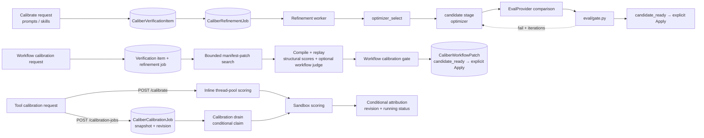
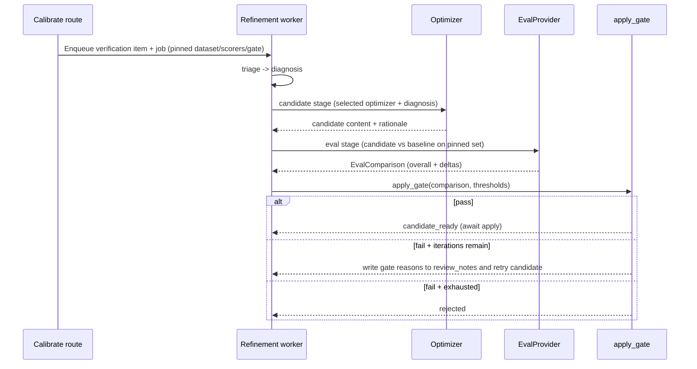

---
audience:
  - architect
  - developer
  - evaluator
doc_type: concept
product_area: calibration
stability: ga
prerequisites:
  - Layered architecture overview
reviewed_on: 2026-08-10
version_applicability: current main branch docs contract
tags:
  - calibration
  - refinement
  - gates
  - promotion
---

# Calibration Architecture

This document describes the asset-specific operations CALIBER calls calibration.
Prompts and skills use the refinement pipeline to generate and compare a candidate;
workflows run a bounded manifest search and replay gate; tools replay saved
assertions without generating a candidate at all. Test sets supply the examples for
the first two families ([Test Sets](../11-test-sets/architecture.md)), while the
general evaluation subsystem is one input to prompt/skill refinement
([Evaluation](../14-evaluation/architecture.md)). There is no single judge, gate, or
promotion contract shared by all four assets.

Throughout, all HTTP routes are mounted under the `/ajax-api/2.0/mlflow/caliber`
prefix; endpoint paths are shown relative to that prefix once the convention has
been stated.

## At a glance

| Dimension | Calibration |
| --- | --- |
| **What it is** | Three asset-specific evidence loops: prompt/skill refinement, workflow search/replay, and deterministic tool-suite scoring. |
| **What it calibrates** | Prompts/skills through async refinement, workflows through async search/replay, and tools through one deterministic suite exposed inline and as a durable queued job. |
| **Scoring path** | Prompts/skills use an `EvalProvider` comparison plus `eval/gate.py`; workflows use compiled replay with structural dimensions and an optional `workflows/judge.py` quality override; tools use deterministic assertions. |
| **Optimizers** | Five provider paths are implemented. Automatic rules can choose `MetaPrompt`, `GEPA`, DSPy BootstrapFewShot, or `SkillMetaPrompt`; an explicit job/agent pin can also reach DSPy MIPROv2. The prompt form advertises only `MetaPrompt` and `GEPA`. |
| **Tool calibration** | The same saved cases can run inline through `POST /calibrate` or durably through `POST /calibration-jobs`; both snapshot the executable definition/cases and revision-fence `last_calibration`. |
| **Where state lives** | `CaliberVerificationItem`, `CaliberRefinementJob`, `CaliberAgentConfig`, `CaliberWorkflowPatch`, plus `CaliberCalibrationJob`, tool `calibration_revision` / `last_calibration`, and `CaliberToolTestRun`. |
| **Key surfaces** | `POST /prompts/calibration/runs`, `POST /skills/{skill_id}/calibrate`, tool `/calibrate` and `/calibration-jobs`, and `POST /workflows/{workflow_id}/calibration/runs` (submission needs the `operator` scope). |

The sections below start from this picture and drill down into the calibration
machinery, the per-asset algorithms, and the trust boundaries that keep it a
proposal rather than a publish.

## Reference

## 1. Scope and responsibilities

Calibration turns "this artifact could be better" into evidence, but does so through
three different implementations. Prompts and skills use the staged refinement
pipeline: diagnose, generate through the selected provider path, compare through the
configured `EvalProvider`, and apply the aggregate/regression gate. Workflows share
the durable refinement-job shell but delegate candidate and evaluation stages to a
bounded manifest-patch search, compiled replay, structural dimensions, and an
optional workflow-specific LLM quality judge. Tools use a **deterministic suite**:
saved test cases run through the configured sandbox and produce a pass rate, with no
optimizer or promotion gate. Tool scoring is available inline and as a durable job;
those are two execution forms of the same tool algorithm.

Its responsibilities are:

- It selects a provider optimizer for prompt/skill jobs and generates a candidate
  artifact from a structured diagnosis.
- It pins the datasets used by prompt/skill and workflow jobs; tool jobs instead
  snapshot the executable definition and saved cases they measure.
- It compares prompt and skill candidates through the generic eval gate, and
  separately ranks workflow patches through workflow replay and its calibration
  policy.
- It scores tool test cases deterministically in the configured registered-tool
  sandbox, either inline or from a durable queue, and records a result only if the
  tool definition, cases, and monotonic revision are still current.
- It keeps generation separate from publication: a winning candidate or workflow
  patch reaches `candidate_ready` and still needs an explicit Apply action.

These responsibilities are realized across the following primary code paths:

- `caliber/src/caliber/routes/prompts.py`
- `caliber/src/caliber/routes/skills.py`
- `caliber/src/caliber/routes/tools.py`
- `caliber/src/caliber/routes/workflow_calibration.py`
- `caliber/src/caliber/orchestrator/optimizer_select.py`
- `caliber/src/caliber/orchestrator/candidate.py`
- `caliber/src/caliber/orchestrator/eval_stage.py`
- `caliber/src/caliber/orchestrator/calibration_drain.py`
- `caliber/src/caliber/llm/openai_agents.py`
- `caliber/src/caliber/llm/dspy_optimizer.py`
- `caliber/src/caliber/workflows/calibration.py`
- `caliber/src/caliber/workflows/judge.py`
- `caliber/src/caliber/calibration.py`
- `caliber/src/caliber/eval/gate.py`

## 2. Module boundaries

The three implementations share durable job and audit infrastructure where useful,
but not their scorer or gate. The table assigns each boundary explicitly.

| Responsibility | Owner | Notes |
| --- | --- | --- |
| Optimizer selection | `select_optimizer` (`orchestrator/optimizer_select.py`) | Chooses an optimizer from the job pin, the agent override, or diagnosis-driven heuristics. |
| Candidate generation | `run_candidate` (`orchestrator/candidate.py`) + `llm/openai_agents.py` | Builds optimizer-specific context and calls the provider to produce a candidate. |
| DSPy bridge | `llm/dspy_optimizer.py` | Few-shot and MIPRO optimizers in the separate `[dspy]` extra. The OpenAI provider imports the bridge only when a DSPy path is selected and falls back to MetaPrompt when dependencies are unavailable or the trainset is empty. |
| Prompt/skill scoring + gate | `orchestrator/eval_stage.py` + `eval/gate.py` | Compares a prompt or skill candidate through the `EvalProvider` and applies aggregate/regression thresholds to job readiness. |
| Hidden runtime identity | `prompt_targets.py`, `skill_targets.py` | Auto-provisions `CaliberAgentConfig` identities so prompts and skills calibrate without a user-managed agent. |
| Tool suite submission/scoring | `routes/tools.py` + `calibration.py` | Snapshots and scores saved cases through the configured sandbox; exposes inline and queued APIs. |
| Tool calibration drain | `orchestrator/calibration_drain.py` | Conditionally claims queued jobs, runs outside the event loop and DB session, fences stale/late attribution, and records terminal state. |
| Workflow candidate search | `workflows/calibration.py` + `orchestrator/workflow_stages.py` | Generates manifest-patch candidates, replays them over examples, scores, and gates. |
| Workflow quality judge | `workflows/judge.py` | An optional LLM judge that overrides the structural quality dimension, with a structural fallback. |

## 3. Runtime architecture

Prompts, skills, and workflows share the verification-item/refinement-job queue and
stage dispatcher. Their candidate/eval implementations then split: prompts and
skills call the LLM provider and generic `EvalProvider`; workflows delegate to the
manifest search/replay engine. Tool jobs use a smaller durable path beside both.



```legend
```

Tool calibration deliberately sits outside the candidate-generation spine. It has no
LLM optimizer, candidate, or promotion gate. `POST /calibrate` copies inputs out of a
short transaction, runs in Starlette's bounded thread pool, and attempts a fenced
write. `POST /calibration-jobs` persists the same executable snapshot and returns
`202`; the drain claims it with `UPDATE ... WHERE status = 'queued'`, scores it off
the event loop without holding a DB session, and stores the result on the job. It
attaches that result to the tool only while the snapshotted revision is still current.
Several structural properties follow:

- The durable shell is **stage-driven**: the worker reads the job's current stage
  and dispatches diagnosis, candidate, and eval in order. Workflow jobs take
  workflow-specific candidate/eval branches rather than the generic provider path.
- Calibration **proposes, it does not publish**: a passing prompt or skill becomes
  `candidate_ready` for an operator to apply, and a winning workflow candidate
  becomes a `CaliberWorkflowPatch` whose recorded calibration gate is reused before
  the same explicit Apply boundary.
- Default execution is demonstrative, not production evidence: without a real LLM
  provider, prompt/skill generation uses the deterministic fake provider; workflow
  scoring uses the fake executor and structural scorer unless configured otherwise.
- Every supported tool-definition or fixture edit increments `calibration_revision`
  with a database expression and clears `last_calibration` in the same transaction.
  A result is attached with a conditional revision predicate, closing edit/write races
  across replicas; stale output remains on its job for diagnosis rather than being
  presented as current tool evidence.

## 4. Data model and state

Calibration state is carried by the refinement job and a few asset-specific stores.

| State | Storage | Purpose |
| --- | --- | --- |
| Calibration request | `CaliberVerificationItem` | The queued signal, with `category` (e.g. `prompt_optimization`, `skill_calibration`, `workflow_calibration`) and the pinned optimizer, scorers, gate, and dataset captured in `submitted_context`. |
| Job state | `CaliberRefinementJob` | `current_stage`, the generated `candidate`, the `eval_results`, the `refine_iteration` counter, and (for workflows) the `calibration_spec`. |
| Hidden target | `CaliberAgentConfig` keyed `skill::{name}` or by prompt name | Provides an `agent_id` for jobs, traces, and thresholds without appearing in agent inventory. |
| Tool calibration identity | `tool.calibration_revision` on `CaliberToolRegistry` | Monotonic database-side fence advanced with every supported definition or fixture mutation. |
| Tool suite result | `tool.last_calibration` (JSON on `CaliberToolRegistry`) | The latest pass rate, per-case outcomes, and `ran_at` timestamp, attached only when the submitted revision is current. |
| Tool calibration job | `CaliberCalibrationJob` | Immutable tool/case snapshot plus queued/running/completed/failed state, claim identity, result/error, and timestamps. |
| Durable tool runs | `CaliberToolTestRun` | Render/suite/hardening run history with a pinnable `baseline_run_id` for diffing. |
| Workflow candidate | `CaliberWorkflowPatch` | The winning manifest patch and recorded calibration evidence that advance to the explicit Apply boundary. |

For prompt/skill refinement, `min_aggregate_score` (default `0.85`) and
`max_regression_delta` (default `0.02`) come from the hidden/managed agent's
`eval_thresholds` and decide whether the job reaches `candidate_ready`. Prompt
promotion separately persists the operator-supplied `pass`/`fail`/`none` advisory
verdict in `caliber_gate_verdicts` for the Version panel; that record does not turn
the alias boundary into a hard gate. Workflow calibration instead reads its
objective, epsilon, protected dimensions, and dataset from the workflow calibration
spec/deploy-gate context. Tools have no candidate gate.

## 5. API and interaction surfaces

Each asset exposes its own calibration entry point, and all require the `operator`
scope to start a run.

- `GET /prompts/calibration/options` and `POST /prompts/calibration/runs` — prompt
  optimization; the `optimization/*` paths are aliases that share the same
  handlers. Options advertise the optimizers offered on the form (`MetaPrompt` and
  `GEPA`), the scorer catalog, and the default gate.
- `POST /skills/{skill_id}/calibrate` — skill calibration; intentionally minimal
  (an optional optimizer and notes), because the runtime identity is auto-created.
- `PUT /tools/{tool_id}/test-cases` and `POST /tools/{tool_id}/calibrate` — save the
  test-case suite and run it inline; definition/fixture changes invalidate prior evidence.
- `POST /tools/{tool_id}/calibration-jobs` — snapshot and queue the same suite (`202`);
  `GET /tools/{tool_id}/calibration-jobs` and
  `GET /tools/{tool_id}/calibration-jobs/{job_id}` list/poll durable state.
- `GET /workflows/{workflow_id}/calibration/options` and
  `POST /workflows/{workflow_id}/calibration/runs` — workflow calibration; the run
  is enqueued, not executed inline.

The prompt and skill runs return the created verification item and refinement job;
the workflow run does the same. The inline tool route returns pass rate and per-case
results synchronously, while durable submission returns a job id for polling. The
current Tool workspace still calls the inline route; the queued API is available to
operators and is not yet surfaced as a cancel/retry/history workflow in that UI.

## 6. Per-asset calibration algorithms

The general evaluation scorecard and KB calibration do share judge-construction
helpers around `mlflow.genai.make_judge`, but that is not a platform-wide
calibration scorer. Prompt/skill refinement calls the injected `EvalProvider` and
`eval/gate.py`; workflow calibration uses `workflows/calibration.py` and may replace
only its structural `quality` dimension through `workflows/judge.py`; tool
calibration uses `calibration.py` assertions. These outputs have different schemas
and evidence boundaries.

The generic refinement sequence below applies to prompts and skills:



### Prompts

Prompt calibration generates a rewritten prompt from a diagnosis and measures it on
the pinned test set. The optimizer is chosen by `select_optimizer` with a clear
precedence: a manual pin on the job wins, then an agent-level override, then
diagnosis-driven heuristics. The provider accepts five optimizer names across prompt
and skill jobs. Automatic rules can return four of them overall; MIPROv2 is reachable
through an explicit job/agent pin but has no automatic rule. The prompt form/API
catalog advertises only MetaPrompt and GEPA:

- **MetaPrompt** — a single LLM pass through the OpenAI Agents SDK. The candidate
  agent receives the current prompt, the structured diagnosis, and any reviewer
  guidance, and returns a minimal edit that preserves directives not implicated by
  the diagnosis. It is also the universal fallback when another optimizer is
  unavailable.
- **GEPA (Genetic-Pareto)** — delegates to MLflow's `GepaPromptOptimizer`, which
  evolves a population of prompt variants over generations using reflective
  mutation and Pareto-aware selection. CALIBER seeds it with a minimal synthetic
  trainset because its own evaluation gate, not GEPA's internal metric, is the real
  quality check. GEPA is auto-selected when the diagnosis signals competing
  objectives, low confidence, several alternatives, or prior rollbacks; if the
  `gepa` package is absent it falls back to MetaPrompt.
- **DSPy BootstrapFewShot** — wraps the prompt as a DSPy program, bootstraps
  few-shot demonstrations from the training examples whose outputs pass a
  deterministic containment metric, and appends them as a few-shot block without
  rewriting the instruction. It is opt-in and only selected when the diagnosis
  cites a few-shot need.
- **DSPy MIPROv2** — an explicit-only provider path (the selector does not choose it
  automatically); it uses the same program wrapping but jointly searches over candidate
  instructions and demonstrations under an `auto` budget preset, carrying the
  optimized instruction body plus a demo block.
- **SkillMetaPrompt** — the skill specialization described below.

The DSPy optimizers live in `llm/dspy_optimizer.py` and ship in the dedicated
`[dspy]` extra on top of `[llm]`. That module imports `dspy` normally, but the
OpenAI provider imports the bridge lazily only after a DSPy optimizer is selected.
The candidate stage falls back to MetaPrompt when the extra is unavailable, a
runtime advisory blocks DSPy, or the trainset is empty. After generation, the eval
stage compares the candidate with the baseline and applies the generic gate; on
failure with iterations remaining, its reasons feed the next candidate pass.

### Skills

Skill calibration reuses the entire prompt pipeline, differing only in identity and
default optimizer. The `calibrate` route auto-provisions a hidden
`CaliberAgentConfig` keyed `skill::{name}`, so a skill behaves like a testable unit
without polluting the agent inventory, and the baseline content is read from the
active skill rather than a registry prompt. The default optimizer is
`SkillMetaPrompt`. By design it is a MetaPrompt specialization that should preserve
XML structure and validate `allowed_tools`; in the current production provider it
runs the MetaPrompt code path, and that specialization remains an aspiration rather
than implemented behavior, so the doc records it as such. Training examples for the
DSPy optimizers are loaded from the agent's pinned eval dataset, selecting the
historical example set when a version is pinned.

### Tools

Tool calibration is the outlier: a deterministic suite with no LLM, optimizer, or
candidate. An operator first saves a set of test cases, each a
`{name, input, assertion}` triple where the assertion is `no_error`,
`output_contains`, or `equals`. Calibration then runs every saved case through the
same preview-sandbox invocation the one-off test path uses — `make_preview_callable`
mocks `write` and `external_action` tools and runs `read` tools live only when they
are explicitly preview-safe — and scores each case with `evaluate_assertion`: any
raised error fails the case, and otherwise the assertion type decides. The results
aggregate into a pass rate. Inline and queued execution use the same scorer and
revision fence; only a current result is written to `last_calibration`. This
calibration-job history is distinct from the durable `CaliberToolTestRun` history, which is
produced by the subprocess-isolated sandbox (`LocalSubprocessToolSandbox`) and
supports baseline pinning and diffing. The shared assertion-and-aggregate code in
`calibration.py` is reused by MCP tools so first-party and remote tools score
identically.

### Workflows

Workflow calibration is an asynchronous candidate search over the workflow manifest.
A run resolves a baseline version (preferring the prod, then staging, then dev
deployment, then the highest published version) and an active deploy-gate dataset,
then enqueues a job. In the candidate stage, `generate_workflow_calibration_candidates`
produces a small set of manifest patches drawn from a bounded move set —
adding a grounding guardrail, tightening a tool constraint, or rerouting a
handoff — discarding any patch that weakens a protective guardrail, fails to apply,
duplicates an existing candidate, or fails manifest validation. Each surviving
candidate is replayed over the examples and scored on four structural dimensions:
quality, tool adherence, completion, and safety, aggregated with per-example
weights; when the LLM judge is enabled it overrides only the quality dimension and
falls back to the structural score on any error. A per-candidate calibration gate
then requires the objective dimension to clear its epsilon, forbids regression
beyond each protected tolerance, and hard-fails on incomplete or unsafe runs; the
winner is the accepted candidate with the largest objective gain. That winner
becomes a `CaliberWorkflowPatch`. For calibration jobs the following refinement
eval stage reuses the selected winner's recorded scores and gate rather than
invoking the generic `EvalProvider` or a second independent gate; a passing job
ends at `candidate_ready` for an explicit Apply action.

## 7. Security and trust boundaries

Calibration is privileged because it changes how the platform behaves, so it is
fenced accordingly. Starting any run requires the `operator` scope, and a run pins
its dataset version so the candidate is measured against a fixed, reproducible set
of examples. The hidden runtime identities that let prompts and skills calibrate
without a managed agent are kept out of inventory views by construction.

The central trust boundary is that calibration proposes but never unilaterally
ships: a passing prompt or skill candidate and a passing workflow patch end at
`candidate_ready` for an operator's explicit Apply action. That is an action
boundary, not a claim that every asset creates a second approver record. Two further
safeguards protect the workflow path: candidate generation rejects a patch that
weakens a protective guardrail, and the optional LLM judge falls back to structural
quality on provider or parse failure rather than inflating a malformed score.

## 8. Observability and operations

Calibration is tuned through configuration and leaves provenance behind. The GEPA
path honors `CALIBER_GEPA_REFLECTION_MODEL` and `CALIBER_GEPA_MAX_METRIC_CALLS`, the
DSPy path honors `CALIBER_DSPY_MIPRO_AUTO` and the bootstrap/labeled demo caps, and
the few-shot auto-selection is opt-in through the agent's `optimizer_config`. The
workflow LLM judge is gated by `workflow_llm_judge_enabled` together with a real
provider and resolvable API key; absent any of these, scoring stays structural.

For inspection, the refinement job stores its `eval_results` — candidate and
baseline scores, deltas, and the gate decision — alongside provenance tags such as
the aggregate score, the example count, and the regression-detected flag. Tool jobs
record status, worker identity, timestamps, immutable inputs, terminal result/error,
and stale-reason diagnostics; the current result is mirrored to `last_calibration`
only through the revision fence. `CaliberToolTestRun` and its pinned baseline remain
the separate run-over-run comparison history on the tool workspace.

The calibration drain stops within a configured grace window. It immediately fences the
active generation, signals the scorer, and waits only for the drain task already being
tracked. It deliberately starts no stop-time database settlement: cancelling an
`asyncio.to_thread` await does not stop its executor thread, so a best-effort settlement
could otherwise begin after the grace window and touch an engine the lifespan has already
disposed. Interrupted claims therefore remain visibly `running` and ambiguous for explicit
operator resolution. A scorer that eventually returns observes its retained generation
fence and cannot attach a late result. The drain does not silently retry `running` jobs
because tool execution may have side effects.

## 9. Extension points and current constraints

The optimizer roster is the most active extension surface: the selector's design
anticipates additional strategies beyond the five implemented today, and new
optimizers slot in behind the provider's candidate-generation call. New scorers and
judges extend the measurement side through the evaluation engine.

Several constraints are worth stating plainly so the documentation does not
overclaim. The prompt calibration form advertises only `MetaPrompt` and `GEPA`; DSPy
BootstrapFewShot is reachable through agent overrides and policy selection, while DSPy
MIPRO is implemented but not auto-selected. `SkillMetaPrompt` is not yet a true
specialization and currently runs the MetaPrompt path. Tool calibration offers both
inline and durable execution, but the UI still uses inline execution and has no job
cancellation/retry controls. Calibration jobs are separate from subprocess-isolated
`CaliberToolTestRun` history. Without a configured real provider, prompt/skill
generation uses the deterministic fake and workflow scoring uses a fake executor
with structural dimensions, so those runs are functional demonstrations rather
than production quality evidence.

Calibration is therefore a family of evidence loops, not one universal optimizer or
gate: it generates and compares prompt/skill candidates, searches and replays
workflow patches, and deterministically measures tool suites, while keeping the
result separate from the explicit action that changes live behavior.
