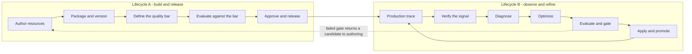
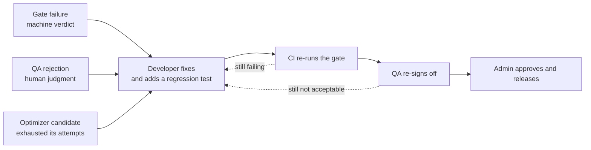

---
audience:
  - decision-maker
  - architect
  - developer
  - operator
  - evaluator
doc_type: concept
product_area: platform
stability: experimental
summary: The end-to-end development and release lifecycle for agentic applications on CALIBER — the two lifecycles, role responsibilities per stage, the CI/CD gates, and an honest map of what the platform implements today versus what the Workspace proposal adds.
prerequisites:
  - Read ARCHITECTURE.md section 2 for the canonical lifecycle chain
  - Read docs/workspace-plan.md for the proposed Workspace, revision, and environment model
  - Treat current-main behavior and tests as the source of truth for the "today" column
reviewed_on: 2026-09-08
version_applicability: current main at 79319ffb8a; the build-and-release lifecycle is partly proposed and is marked per stage
tags:
  - lifecycle
  - cicd
  - roles
  - rbac
  - evaluation
  - releases
---

# Development and release lifecycle for agentic applications

## Why this document exists

CALIBER can look like it has no release process, or two competing ones. It has
neither. It implements **one** lifecycle very thoroughly and leaves a **second**
one mostly unbuilt, and the two are easy to confuse because they share the same
evaluation and release machinery.

- **Lifecycle B, Observe and Refine** — start from a production failure, diagnose
  it, optimize the artifact, measure it, and release the improvement. This is
  implemented end to end, including the durable job pipeline, the optimizer
  selection, the regression gate, and intent-first alias release with
  reconciliation.
- **Lifecycle A, Build and Release** — author resources from nothing, package them
  as one versioned artifact, test the package, and promote it through
  environments. This is *partly* implemented. Individual families version and
  promote themselves; there is no artifact that versions the application as a
  whole. That gap is exactly what `docs/workspace-plan.md` proposes to close.

If you have been trying to describe "developer builds a package, QA tests it,
release manager ships it" and finding the platform does not quite line up, this
is why. That sentence describes Lifecycle A. The platform's deepest guarantees
are in Lifecycle B.

They are not alternatives. Lifecycle A ships version one; Lifecycle B is how
every version after that one gets better. A mature deployment runs both.

This split is not a CALIBER peculiarity. The published process model for
LLM-agent development — *Evaluation-Driven Development and Operations of LLM
Agents* (arXiv 2411.13768) — names six phases: agent design and development,
evaluation setup, **offline evaluation**, **online evaluation**, deployment and
monitoring, and continuous improvement. Its offline/online evaluation split is
the most standardized vocabulary in the field, and it is the same seam that
separates the two lifecycles here: offline evaluation gates Lifecycle A, online
evaluation feeds Lifecycle B.

## 1. The two lifecycles

Lifecycle B is the concrete six-stage refinement path documented in
[The Refinement Loop](refinement-loop.md) and mapped to the seven-term canonical
chain in [ARCHITECTURE.md](../ARCHITECTURE.md) section 2. Its two human decision
points — **Verify** and **Apply** — are the only two the platform requires today,
and they map cleanly onto two of the four roles below.

### 1.1 The four development cycles inside them

The two lifecycles are the shape. What a team actually experiences day to day is
four nested cycles with different cadences and different owners. Confusing them
is why "the development cycle" can feel unanswerable.

| Cycle | Cadence | Owner | What gates it | Stages |
| --- | --- | --- | --- | --- |
| **Inner** — author and run | Minutes | Developer | Nothing. It must run, that is all | 1–2 |
| **Quality** — evaluate and fix | Hours to days | Developer + QA | Regression gate, then QA sign-off | 3–6, plus rework |
| **Release** — approve and ship | Per release | Admin | Distinct-actor approval | 7–8 |
| **Refinement** — observe and improve | Continuous, production-driven | QA verifies, platform optimizes, Admin applies | The same regression gate as the quality cycle | 9–11, plus rework |

Three properties of this structure matter more than the stage list:

- **The inner cycle must stay ungated.** Putting an evaluation gate on a
  developer's edit-and-run loop is the fastest way to make people stop using the
  platform. Gates belong at the quality and release cycles, never at authoring.
- **The refinement cycle reuses the quality cycle's gate** rather than having its
  own. That is why an improvement proposed by an optimizer is held to exactly the
  same bar as one authored by a person — and why the two lifecycles converge at
  stage 5 rather than running in parallel.
- **Only the release cycle is calendar-driven.** The other three run at whatever
  rate the work arrives. Planning a release train around the inner or refinement
  cycle is planning around something you do not control.

## 2. Roles and responsibilities

### 2.0 Job functions are not permission roles

Most confusion about "who does what" comes from conflating two different things:

- A **job function** is what a person does: developer, QA, release manager,
  admin, stakeholder. In a small team one person wears several hats.
- A **permission role** is what the system enforces. A role only earns its
  existence when it gates a decision that a *different human* must make.

There are five job functions here and **four** permission roles, because
**release manager is a function, not a role** — it is what Admin does at stage 7
and 8. Adding a fifth role for it is what produced the Operator-versus-Owner
contradiction between `user-story.md` and `workspace-plan.md`.

Four stored roles; three that do work; one that watches. The project role
literals already exist in
[`resource_access.py`](../caliber/src/caliber/resource_access.py); the product
labels are what users should see.

| Product label | Stored role | Charter | Owns | Does not do |
| --- | --- | --- | --- | --- |
| **Developer** | `editor` | Builds the thing | Authors runtime resources — prompts, workflows, tools, skills, agent configuration. Runs them. Requests release. **Fixes what fails and adds the regression test.** | Approve or apply a release; manage members |
| **QA** | `reviewer` | Owns the quality bar and the human quality gate | Authors test sets, scorers, judges, thresholds. Runs evaluations. Verifies production signals. Files feedback. Signs off — or rejects with a reason. | Edit runtime resources; apply a release; manage members |
| **Admin** | `owner` | Owns access and the release | Membership and roles. Workspace settings. Acts as **release manager**: approves, applies, reconciles, rolls back. | Approve a change they authored themselves |
| **Viewer** | `viewer` | Reads, changes nothing | Resources, evidence, release history, audit. | Anything else |

### 2.0.1 Why QA earns a role here, when it does not elsewhere

Section 2.3 reports that no comparable platform ships a QA role. CALIBER is a
justified exception for a reason that comes from its own architecture rather than
from industry precedent:

**CALIBER's implemented loop already contains a human quality gate that is not an
authoring action.** Stage ① **Verify** — "is this production failure real?" — is
what *starts* a refinement job. In the platforms surveyed there is no equivalent:
a developer decides to run an evaluation when they choose to. In CALIBER,
verification is a production-driven decision with a durable queue behind it.

That gate needs an owner, and its owner is structurally not the author. Restated:
QA exists here because the platform has quality *decisions*, not merely quality
*tooling*.

### 2.1 Why QA is a restriction of Developer, not a sibling

This is the single most important correction to make against the current design
docs. Everything QA needs to do is gated today by `SCOPE_OPERATOR`:

| QA action | Current gate |
| --- | --- |
| Create a test set | `routes/eval_datasets.py` — `SCOPE_OPERATOR` |
| Create a judge or scorer | `routes/judges.py` — `SCOPE_OPERATOR` |
| Run an evaluation | `routes/evaluations.py` — `SCOPE_OPERATOR` |
| File feedback / verify a signal | `routes/review_queues.py` — `SCOPE_OPERATOR` |

Global scope inheritance is asymmetric: `caliber.approver` implies **only**
`caliber.viewer`. It does not imply `caliber.operator`. So a user holding
`caliber.approver` alone — which is what the `reviewer` project role maps to in
`docs/workspace-plan.md` section 7.4 — **cannot perform a single QA task.**

QA therefore needs the `caliber.operator` **ceiling**, with runtime-write
subtracted at the project-role layer. Same ceiling as Developer; the difference
lives entirely in the project role.

**This makes Workspace isolation closure a hard prerequisite for shipping QA.**
The twelve mutating prompt routes check global scope only, with no project-role
consultation. Grant QA `caliber.operator` before that changes and QA can edit
prompts — the role would look restricted while being fully privileged.

### 2.2 The action vocabulary this implies

The current registry has seven actions and no way to express "may author
evidence but not runtime artifacts," and no feedback verb at all. Two changes:

| Action | Developer | QA | Admin | Viewer |
| --- | :---: | :---: | :---: | :---: |
| `read` | Y | Y | Y | Y |
| `resource.write.runtime` — prompts, workflows, tools, skills | Y | | Y | |
| `resource.write.evidence` — test sets, scorers, judges | Y | Y | Y | |
| `resource.execute` — run tests, evals, workflows | Y | Y | Y | |
| `feedback.submit` — verify signals, flag traces | Y | Y | Y | |
| `resource.publish` — deploy | Y | | Y | |
| `resource.approve` — release sign-off | | Y* | Y* | |
| `project.update` | Y | | Y | |
| `project.manage_members` | | | Y | |
| **global scope ceiling** | `caliber.operator` | `caliber.operator` | `caliber.admin` | `caliber.viewer` |

`Y*` — neither QA nor Admin may approve a change they authored or requested.
See section 5.

`resource.write` splits because the resource classes already exist in
`workspace-plan.md` section 2.3, which separates "Authored runtime asset" from
"Evidence asset." The taxonomy is there; it is simply not wired to a permission.

`feedback.submit` is new. Verification-queue writes currently ride on
`resource.write`, which is precisely why QA cannot file feedback without also
gaining prompt-edit rights.

### 2.3 How this compares to shipped platforms

A survey of the RBAC actually shipped by LangSmith, Braintrust, Humanloop,
Weights & Biases, Databricks/MLflow, Azure AI Foundry, Vertex AI, Bedrock, Dify,
Langflow, Flowise, Langfuse, and OpenAI produced one uncomfortable finding and
several supportive ones. The uncomfortable one first, because it should inform
the decision rather than be discovered later.

**No agentic-AI platform ships a QA role.** Not one has a role named QA, Tester,
Reviewer, Evaluator, or Quality. In every one of them, evaluation work is done by
the *authoring* role:

- Humanloop's `Member` — its lowest real role — could create evaluators and
  datasets and run evaluations. What was withheld from it was **deployment**.
- Azure AI Foundry's `Foundry User` is the build-and-test developer role;
  publishing an agent requires `Foundry Project Manager` at minimum.
- W&B lets any Member add model versions but only registry admins move a
  **protected alias**.
- Databricks gates promotion by withholding `CREATE MODEL VERSION`.

**The boundary the industry actually enforces is author versus deployer, not
author versus tester.** If you enforce only one boundary, that is the
load-bearing one — and CALIBER already has it, since `resource.publish` and the
apply path are separable from authoring.

This has a direct consequence for the role above: if QA is defined as "Developer
who cannot deploy," then it is not really QA — Humanloop called that `Member`
and Azure calls it `Foundry User`, and the industry considers it the *default*
developer tier rather than a quality function.

The QA role is therefore defensible on **governance** grounds, not on
product-precedent grounds:

- NIST AI RMF 1.0 states that AI actors performing testing, evaluation,
  verification and validation should be separated as a best practice, "with
  those building and using the models separated from those verifying and
  validating the models."
- The two shipped precedents for a genuine review tier come from *annotation*
  platforms, not agent platforms: Label Studio Enterprise's `Reviewer` and
  Argilla's `annotator`. Both are defined by assignment-scoped visibility plus a
  review verb distinct from the authoring verb — not by "developer minus deploy."

So the honest framing is: **a QA tier is a deliberate governance choice that goes
beyond current product norms.** It is justifiable, and it is what regulated
deployments will expect, but it should be adopted knowingly. Be careful about
one claim in particular: cloud vendor pipeline documentation does describe "QA
engineers and domain experts" approving promotion, but that names a *job
function* in an organization, not a role in the platform's permission model.

Note also that credible practitioner guidance argues the opposite of separation —
that error analysis is the single most valuable activity and outsourcing it is a
mistake, with quality owned by one domain expert or product manager rather than a
separate function. Both camps are coherent. Which applies depends on whether the
deployment is regulated.

**What the survey does support, strongly:**

- **Resource-type scoped permissions are shipping and validated.** MLflow's own
  self-hosted RBAC is literally `(resource_type, resource_pattern, permission)`
  with `prompt` and `scorer` among its resource types — so "may edit scorers but
  not prompts" is directly expressible in the system CALIBER already builds on.
  Braintrust has `restrict_object_type`, LangSmith namespaces every permission by
  resource type, and Dify ships a `dataset_operator` role defined purely by
  resource-type restriction. The `resource.write.runtime` / `.evidence` split in
  section 2.2 is a well-attested pattern, not an invention.
- **Approval does not belong in the role enum.** The only native
  separation-of-duty implementation in the entire survey is Databricks' MLflow 3
  deployment jobs, where approval is a *tagged pipeline gate* — a task named
  `Approval_*` passes only when a tag is set by a principal holding `APPLY TAG`,
  and a tag policy can block the model owner from approving their own job.
  Multiple independent gates compose (`Approval_Legal`, `Approval_Security`).
  That is a per-instance permission plus policy, which is exactly the conclusion
  section 5 reaches independently.
- **Do not put environment into the role.** Every platform that tried it warns
  against it; the convergent answer is tags plus attribute-based policies.
  LangSmith explicitly recommends against workspace-per-environment because
  resources cannot be shared across workspaces, "which would prevent you from
  promoting resources (like prompts) between environments." CALIBER's proposed
  model — environments *inside* a workspace — avoids that trap. Keep it that way.
- **The failure mode predicted for a QA tier has already been observed
  elsewhere.** In LangSmith, `Workspace Editor` lacks `projects:create`, which
  silently blocks running experiments, and `Workspace Viewer` lacks
  `feedback:create`, so it cannot annotate. That is precisely the class of bug
  section 2.1 identifies in CALIBER today, and it is worth treating as a warning
  that a quality tier must be verified against the *create* permissions its
  workflows actually need, not just the read ones.

One design decision to make explicitly, since the two most relevant systems
disagree: MLflow folds grants with `max()` and has **no explicit deny**, so
narrowing access means granting narrowly rather than excepting a resource.
LangSmith's policies let **deny win**. Pick one deliberately and write it down.

## 3. The pipeline

Stage by stage: who acts, what artifact moves, what gate must pass, and whether
CALIBER implements it today.

| # | Stage | Actor | Artifact / output | Gate to pass | On failure goes to | Today |
| --- | --- | --- | --- | --- | --- | --- |
| 0 | Provision | Admin | Workspace, members, roles | — | — | Implemented (projects + members) |
| 1 | Author | Developer | Prompts, workflow manifest, tools, skills | — | — | Implemented per family |
| 2 | Smoke-run | Developer | Trace of a successful run | Runs without error | Developer | Implemented |
| 3 | Define the quality bar | **QA** | Test sets, scorers, judges, thresholds | Bar is reviewable and version-pinned | — | Implemented (eval datasets, judges, scorers) |
| 4 | Package and pin | CI | One versioned, digest-pinned artifact + Git tag | Manifest validates; every pin resolves | Developer | **Proposed** — workspace revision |
| 5 | Offline evaluation | CI | Scores per dimension vs baseline | **Regression gate** — section 4 | **Developer**, with gate reasons | Implemented (`eval/gate.py`) |
| 6 | Quality sign-off | **QA** | Verdict, or rejection with a written reason | QA accepts the evidence | **Developer**, with QA's reason | Partly — evidence exists, no sign-off record |
| 7 | Release approval | **Admin** | Approval bound to one version + target | Distinct actor from author | Developer or QA, per reason | Partly — see section 5 |
| 8 | Apply and promote | **Admin** | Live alias moves; before/after recorded | Effect settles or is `reconcile_required` | Admin — reconcile or roll back | Implemented (intent-first release) |
| 9 | Online evaluation | Platform + QA | Sampled scores, assessments, incidents | Alert thresholds | QA triages | Implemented (traces, assessments, SLO) |
| 10 | Feed back | **QA** | Verified failure becomes an eval example | — | — | Implemented (harvested examples) |
| 11 | Refine | Platform | New candidate via optimizer | Same gate as stage 5 | **Developer**, after N bounded attempts | Implemented (refinement loop, GEPA) |

Stages 9 through 11 are Lifecycle B. They are the part CALIBER does best, and
they close the loop back to stage 5 rather than restarting at stage 1.

Read the "on failure" column as the load-bearing part of the process. A pipeline
is defined by what it does when something fails, and every quality failure here
converges on the same owner: **the Developer fixes it, adds a regression test,
and re-enters at stage 5.**

### 3.2 The rework cycle

Nothing ships because it passed once. It ships because it passed *after*
whatever failed was fixed:

The "adds a regression test" step is the one teams skip and the one that
compounds. CALIBER supports it directly: a verified failure becomes an
eval-dataset example through the harvest path, so the fix and its test land
together and the same failure cannot ship twice.

**One handoff worth naming.** In stages ② through ④ the *platform's optimizer*
authored the candidate, not a person. So "the Developer fixes it" is really a
**transfer of authorship**: the optimizer's candidate is a proposal, and when it
fails, ownership reverts to a human author who may discard it entirely rather
than patch it.

### 3.3 Two kinds of rejection, one destination

Both route to the Developer, but they are different signals and need different
records:

| | Gate failure | QA rejection |
| --- | --- | --- |
| Decided by | Machine, threshold-based (0.85 / 0.02) | Human judgment |
| Means | The numbers do not clear the bar | The numbers cleared, but this is still wrong |
| Carries | Gate reasons and per-dimension deltas | A written reason |
| Today | `rejected`, terminal, unassigned | Cannot be expressed at all |

QA rejection is the more valuable of the two, because a change that passes the
gate and is still wrong is precisely what a quality function is for. It is also
the one that does not exist in any form today.

### 3.4 What the rework cycle needs, and does not have

This is the largest process gap in the platform, larger than the missing
package artifact, because it affects every failure rather than every release.

`refinement_max_iterations` **defaults to `0`, meaning off** — "a failed gate
rejects immediately." The eval stage then sets `job.status = "rejected"` and
stops. Concretely, today:

- nobody is assigned the failure;
- there is no task, notification, or queue entry for a Developer;
- **no request-changes endpoint exists**, so QA cannot return work with guidance.

A failed gate produces a `rejected` row and silence.

**One mechanism is already half-built.** `CaliberRefinementJob.review_notes`
exists, and its docstring reads: *"Reviewer change-request notes. Set by the
request-changes endpoint when an approver wants a new candidate with specific
guidance. Read by the candidate stage on the retry pass, then cleared."* The
candidate stage **still reads it**. The endpoint that wrote it was removed with
the approval-governance subsystem. The pipeline can already consume human rework
guidance; it lost the door people walked through.

Four things to build, in value order:

1. **A rework assignment.** A failed gate or QA rejection must produce an owned,
   visible task rather than a terminal `rejected` row.
2. **A QA sign-off record**, distinct from the machine gate. Today the gate's
   verdict is the only quality decision the system stores.
3. **A request-changes writer** for `review_notes` — nearly free, since the
   consumer already exists.
4. **Set `refinement_max_iterations` above `0` deliberately** and define what
   happens when it exhausts. Shipping at `0` currently gives you zero automation
   *and* zero escalation.

Items 1 and 2 are the substantive ones.

### 3.1 The one artifact that does not exist yet

Stage 4 is the gap. `workspace.yaml` appears in **zero** source files — it is
proposal-only. What you can version today:

| Family | Versioned unit | Promotion mechanism |
| --- | --- | --- |
| Prompt | MLflow prompt version | Mutable alias (`prod`) at an immutable version |
| Workflow | `CaliberWorkflowVersion` (draft or immutable manifest) | `CaliberWorkflowDeployment` alias + promotion |
| Skill | Immutable skill version | Selected active version |
| Tool | `(name, version)` registry row | No live alias; read-only history |
| Knowledge base | KB build | Activated build |

Each family versions and promotes itself. **Nothing versions the application.**
You cannot today answer "which exact prompt, workflow, tool, and test-set
versions constitute release 12" with one identifier — which is the question a
release manager needs answered, and the reason the Workspace revision digest
exists in the proposal.

## 4. The gates

### 4.1 The implemented regression gate

[`eval/gate.py`](../caliber/src/caliber/eval/gate.py) is a pure function with two
thresholds, and it is genuinely well designed against industry practice:

- `min_aggregate_score`, default **0.85** — an absolute floor the candidate's
  `overall` must clear.
- `max_regression_delta`, default **0.02** — no single dimension may regress by
  more than this against the baseline. Cold-start runs with no baseline skip
  this check.

On failure the job is marked `rejected`; on success an approval is created. That
is enforcement, not observation, and combining an absolute floor with a relative
regression bound is exactly what current guidance recommends. Most teams ship
only the floor.

### 4.2 Two things the gate does not yet cover

**Per-axis gating.** The gate compares dimensions but the recommended practice is
to gate per *failure mode* — hallucination, citation error, retrieval miss,
refusal — rather than on a composite, so a regression in one axis cannot be
masked by improvement in another. CALIBER's scorer set makes this expressible;
the gate contract does not require it.

**A provider model change is not a release.** Pinning matters more than most
teams realize: the same prompts and tools against a silently updated model is a
behavior change with no diff and no error. Industry guidance is to pin dated
model snapshots and treat a model bump as a release that traverses the full
pipeline. CALIBER pins a default model in config, but a model change does not
currently enter the gate. **This is the highest-value control missing**, and it
is cheap relative to its risk.

### 4.3 Separate the cadence from the gate

The most common way eval gates fail in practice is social, not technical: a noisy
gate on every pull request produces randomly red builds, trust erodes, and
someone disables it. Non-deterministic scores can move a few points with no
change at all.

Structure it as two suites:

- **Fast, deterministic-heavy suite** blocks the pull request. Assertions,
  schema checks, contract tests, a small anchored eval subset.
- **Heavy suite, averaged over three or more runs**, gates the *release* on merge
  and nightly — not the merge itself.

Quarantine unstable cases rather than retrying them; retries hide the signal.
Also worth internalizing: with 75% per-trial success over three trials, the
probability of passing all three is about 42%. Multi-step agent gates are
brittle for arithmetic reasons, not because the suite is bad.

One statistical caution while setting thresholds: the central limit theorem is
not a safe basis for confidence intervals on eval sets with fewer than a few
hundred datapoints, and bootstrap intervals perform poorly there too, because
eval items and outputs are correlated. Do not build a significance claim on a
200-case suite without accounting for that.

### 4.4 Online evaluation, at stage 9

Online evaluation has no reference outputs, so it looks different from the gate:

- Run **deterministic and code-based checks on 100%** of production traces —
  they are cheap.
- **Sample** LLM-as-judge scoring. Common practice is 5–20% of traces, lower for
  very high volume, with higher rates for high-value segments. Scoring runs
  asynchronously after the trace is logged, so it adds no request latency.
- A useful refinement: trigger the expensive judge only when a cheap
  deterministic check already shows a quality drop.
- **Cluster failures before writing test cases.** Turning eval failures into
  buckets and writing one case per bucket scales; case-by-case triage does not.

Judges deserve the same scepticism as any other measuring instrument. Grade each
dimension with its own isolated judge rather than one judge scoring everything,
and calibrate judges against human labels — an uncalibrated judge silently sets
the quality bar wherever it happens to sit.

## 5. Where the human decisions belong

CALIBER requires exactly two human decisions today — **Verify** (is this failure
real?) and **Apply** (should this ship?). That maps onto the roles almost exactly:
Verify is QA's job, Apply is the release manager's.

Current practice across cloud vendors converges on one required sign-off at the
**promotion-to-production boundary**, after automated evals have already passed,
shown the evidence for that specific version, with self-approval disabled and
independence from the author. Notably, at least one major vendor reference puts
QA engineers and domain experts explicitly in that approval path — so giving QA
sign-off authority alongside Admin is well supported, not unusual.

### 5.1 The live separation-of-duty hole

Two facts in the current implementation combine badly:

1. In `resource_access.py`, `owner` holds **both** `resource.write` and
   `resource.approve`, and there is no distinct-actor check anywhere in that
   module.
2. `project_role()` returns `ROLE_OWNER` for anyone holding `caliber.admin`,
   **before** it checks membership — so every platform admin is automatically
   release manager for every workspace.

Consequently an Admin can author a change and approve their own change, and a
platform operator cannot maintain the service without also holding release
authority in every project. On the prompt refinement path the same is true by
construction: `POST /jobs/{id}/apply` requires `caliber.operator` and records
that same actor as `approved_by`.

Closing it needs three things, none of which is a new role:

- a **distinct-actor constraint** on approval — the only real governance control
  here;
- **at least two people who can approve**, which is also the right answer to the
  bus-factor problem with a single owner field;
- **break-glass** for genuinely single-admin deployments: self-approval with a
  mandatory reason, an expiry, one-release scope, and a high-severity audit
  event. `workspace-plan.md` section 7.5 already specifies this correctly.

### 5.2 One axis is enough

There are two possible separation-of-duty axes, and MVP needs only one:

- **author ≠ approver** — catches bad changes. Required.
- **approver ≠ applier** — catches malicious deployment. A much rarer threat, and
  deliberately not enforced here.

Making Admin both approver and applier is a sound trade because the *author*
stays distinct. Record it as a decision so a reviewer does not read it as an
oversight.

## 6. What CALIBER already gets right

Worth stating plainly, because the gaps above are easier to see than the
foundations:

- **Alias-flip promotion at an immutable version** is the near-universal industry
  mechanism for prompts, and MLflow's prompt registry — which CALIBER builds on —
  is the canonical implementation. Promotion and rollback are alias operations,
  not rebuilds.
- **The offline/online evaluation split** is the most standardized vocabulary in
  the field, and CALIBER has both halves: eval datasets, judges and scorers
  offline; traces, assessments and SLO reconciliation online.
- **Intent-first external effects with reconciliation.** Committing the release
  intent with exact before/after versions before the provider call, then settling
  it or exposing `reconcile_required`, is more honest than most platforms manage.
  Partial provider effects stay visible instead of being reported as success.
- **The feedback loop is closed in code, not just in a diagram.** A verified
  correction becomes an eval-dataset example — the `harvested` field on the verify
  response. The industry principle is that once a bad output ships it becomes a
  permanent regression case; CALIBER implements the mechanism.
- **Structured release evidence.** There is no industry standard for what a
  GenAI release sign-off must show, and it is a recognized gap. CALIBER already
  persists eval results, candidate and diagnosis snapshots, a provenance anchor,
  rollback checkpoints, and audit rows. The Workspace proposal's
  `evidence_sha256` and `environment_config_sha256` would make that a signed,
  machine-readable package — which is genuinely ahead of common practice.

## 7. What to decide

| Question | Recommendation | Why it matters |
| --- | --- | --- |
| Should QA be a distinct role at all? | Yes, but knowingly — it exceeds product norms and rests on governance grounds (section 2.3) | If QA is only "Developer minus deploy," the industry calls that the default developer tier |
| Does QA hold `resource.approve`? | Yes — alongside Admin, never for own work | Gives SoD a second approver without a fifth role |
| Deny semantics | Choose grant-narrowly (MLflow) or deny-wins (LangSmith) | Silent divergence between the two is a security bug |
| QA's global scope ceiling | `caliber.operator`, not `caliber.approver` | Otherwise QA cannot do any QA task |
| Do evals block the pull request? | No — block the release; fast suite blocks the PR | Prevents the noisy-gate death spiral |
| Is a model version bump a release? | Yes | Highest-value missing control |
| Gate per axis or on a composite? | Per failure-mode axis | A composite masks single-axis regressions |
| Is staging mandatory before production? | Yes once environments exist | Cannot be enforced today (single-environment) |
| Who may self-approve? | Nobody, except audited break-glass | The live hole in section 5.1 |
| Where does a failed gate go? | To the Developer as an owned task | Today it goes nowhere — `rejected` and silence |
| Can QA reject work that passed the gate? | Yes, with a written reason | The whole point of a human quality gate |
| `refinement_max_iterations` | Set above `0` deliberately, and define the escalation | At `0` you get neither automation nor escalation |

## 8. Sequencing

The role model above cannot ship safely in one step, because QA's restriction
depends on project-role checks that most routes do not yet perform.

1. **Isolation closure first.** Every runtime-write route must consult the
   project role, not only the global scope. Until this lands, QA with an operator
   ceiling is effectively a Developer.
2. **Action vocabulary.** Split `resource.write`, add `feedback.submit`, add the
   distinct-actor constraint on approval.
3. **The rework loop.** A failed gate or QA rejection must become an owned task,
   QA sign-off must be a stored decision, and `review_notes` needs its writer
   back. Section 3.4. This is independent of the Workspace work and can ship
   first — it improves every failure today, not every release later.
4. **Roles and labels.** Surface Developer / QA / Admin / Viewer, keeping the
   stored literals.
5. **The package.** Workspace revisions and the manifest — stage 4, which makes a
   release identifiable as one artifact.
6. **Environments and promotion.** The dev → staging → production ladder, which
   is what makes staging enforceable.

Two ordering constraints are worth stating plainly. **Do not surface a QA role
before step 1** — a role that appears restricted while being fully privileged is
worse than no role at all, and it is the "terminology without enforcement" risk
`workspace-plan.md` lists first among its architectural risks. And **do not ship
the QA sign-off gate before step 3** — a gate a human can fail, with no path for
the work to come back, converts a quality process into a dead end.

## Sources

External practice referenced above. The internal claims are cited inline to
files in this repository.

### Lifecycle and process model

- [Evaluation-Driven Development and Operations of LLM Agents](https://arxiv.org/abs/2411.13768) — the six-phase process model and reference architecture with evaluation gates as stage checkpoints.
- [Observability in generative AI — Microsoft Foundry](https://learn.microsoft.com/en-us/azure/foundry/concepts/observability) — the GenAIOps three-stage evaluation model and post-production monitoring set.
- [AgentOps: operationalize agentic AI at scale — AWS](https://aws.amazon.com/blogs/machine-learning/agentops-operationalize-agentic-ai-at-scale-with-amazon-bedrock-agentcore/) — seven-stage mapping, canary/alias promotion, and the closed telemetry loop.

### Artifacts and promotion

- [Manage prompt lifecycles with aliases — MLflow](https://mlflow.org/docs/latest/genai/prompt-registry/manage-prompt-lifecycles-with-aliases/) — immutable versions plus mutable stage aliases; the mechanism CALIBER's prompt path builds on.
- [CI/CD and automation for serverless AI — AWS Prescriptive Guidance](https://docs.aws.amazon.com/prescriptive-guidance/latest/agentic-ai-serverless/cicd-and-automation.html) — prompts as versioned assets in source control, tagged versions for rollback, and an explicit approval stage.
- [MLflow 3 deployment jobs — Databricks](https://learn.microsoft.com/en-us/azure/databricks/mlflow/deployment-job) — evaluation → approval → deployment, and the only native separation-of-duty implementation found.

### Evaluation gates

- [Demystifying evals for AI agents — Anthropic](https://anthropic.com/engineering/demystifying-evals-for-ai-agents) — capability versus regression evals, isolated per-dimension judges, judge calibration, and the `pass^k` arithmetic.
- [CI/CD evaluation gates — Openlayer](https://www.openlayer.com/blog/cicd-eval-gates-block-merges-model-failure) — absolute floors versus relative baselines, and the observation/enforcement distinction.
- [Don't use the CLT in LLM evals with fewer than a few hundred datapoints](https://arxiv.org/abs/2503.01747) — why small-sample confidence intervals mislead.
- [Score production traces — Braintrust](https://www.braintrust.dev/docs/evaluate/score-online) — asynchronous online scoring and sampling rates.
- [LangSmith evaluation concepts](https://docs.langchain.com/langsmith/evaluation-concepts) — the offline/online split and the trace-to-dataset path.

### Roles and permissions

- [MLflow role-based access control](https://mlflow.org/docs/latest/self-hosting/security/role-based-access-control/) — `(resource_type, resource_pattern, permission)` grants including `prompt` and `scorer`; `max()` folding with no explicit deny.
- [LangSmith RBAC](https://docs.langchain.com/langsmith/rbac) and [ABAC](https://docs.langchain.com/langsmith/abac) — namespaced per-resource permissions, the warning against workspace-per-environment, and deny-wins policy semantics.
- [Braintrust access control](https://www.braintrust.dev/docs/admin/access-control) — permission groups and `restrict_object_type`.
- [Humanloop access roles](https://humanloop.com/docs/v5/reference/access-roles) — `Member` may run evaluations but not deploy. Note the product was sunset in 2025; cite as precedent, not as a live option.
- [Microsoft Foundry RBAC](https://learn.microsoft.com/en-us/azure/foundry/concepts/rbac-foundry) — `Foundry User` builds and tests; publishing requires `Foundry Project Manager`.
- [Configure registry access — Weights & Biases](https://docs.wandb.ai/guides/registry/configure_registry/) — protected aliases as a promotion gate.
- [Label Studio Enterprise user roles](https://docs.humansignal.com/guide/admin_roles) — `Reviewer` and `Annotator`, the closest shipped precedent for a quality tier.
- [NIST AI Risk Management Framework](https://www.nist.gov/itl/ai-risk-management-framework) — separation of those building from those verifying and validating. Use it to justify having a gate, not to justify a specific threshold.

### Model and provider drift

- [Test before you deploy: governing updates in the LLM supply chain](https://arxiv.org/abs/2604.27789) — provider-initiated silent updates as a governance problem, and pinning as a control.
