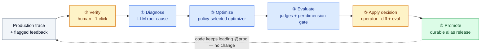

---
audience:
  - architect
  - developer
  - evaluator
doc_type: concept
product_area: calibration
stability: ga
prerequisites:
  - Layered architecture overview
reviewed_on: 2026-08-10
version_applicability: current main branch docs contract
tags:
  - refinement
  - evaluation
  - release
  - governance
---

# CALIBER — The Refinement Loop

*The one idea that ties the rest of these docs together. Read this before the reference pages: it explains why the building blocks exist and how they connect.*

> **v1 scope:** The concrete prompt-refinement path described here is the supported v1 reference journey. CALIBER runs as a standalone service (Topology B) against a separately running MLflow server over HTTP. Other asset families implement subsets of this lifecycle.

## At a glance

Every other topic in this documentation — prompts, tools, skills, MCP servers, workflows, knowledge bases, test sets, evaluation, calibration, governance, and the Aria copilot — supports one product motion: **turn a flagged production response into a measured candidate with an attributable deployment decision**. The concrete prompt-refinement path below has six numbered stages and two human decisions: verification and review/apply. The seven-term `Signal → Evidence → Candidate → Measurement → Decision → Release → Trace` chain in the [layered architecture](../ARCHITECTURE.md) is an abstract lifecycle map, not a second seven-stage worker pipeline: the incoming trace and feedback supply its signal, evidence assembly is folded into the transition from Verify toward Diagnose, and the next trace closes the loop after stage 6. Other asset families implement subsets of the lifecycle and must not be assumed to share its aliases, gates, or rollback semantics.

🟡 human decision · 🔵 automated · 🟢 shipped. The dashed edge closes the loop: your application keeps loading `@prod`, and the next call transparently gets the new version.

## The six stages

| Stage | What happens | Reference |
|---|---|---|
| **① Verify** | A human confirms the flagged trace is actionable — one click. | Platform |
| **② Diagnose** | An LLM identifies the root cause from the trace and its evidence. | Calibration |
| **③ Optimize** | A policy-selected optimizer proposes a fix. A manual pin or agent override wins; diagnosis heuristics choose among the remaining live paths. | Calibration |
| **④ Evaluate** | The candidate is scored against a pinned test set with per-dimension regression checks. A pass advances the job to `candidate_ready`; it does not promote automatically, and registry gate verdicts elsewhere remain advisory. | Evaluation · Test sets |
| **⑤ Apply decision** | An operator-scoped actor (operator or admin; approver is a sibling scope) reviews the diff, evaluation comparison, and root-cause summary, then either invokes Apply or leaves the candidate unapplied. This is not a separate vote/quorum/reject API. | Prompts |
| **⑥ Promote** | On the canonical prompt path, Apply first commits an idempotent release operation containing the exact outgoing and target versions, then rotates the live alias and settles the operation. Ambiguous provider outcomes remain visible for operator reconciliation; rollback uses the recorded target. Other assets retain their own release semantics. | Prompts |

## Why it matters

Most tools own only one arc — observability, visual building, or evaluation. CALIBER's bet is integrating the full prompt-refinement circuit with a broader asset inventory, self-hosted and MLflow-integrated. Its differentiator is that connected evidence/review/audit path, not a claim that every asset shares one unbypassable lifecycle. See [how CALIBER compares to the alternatives](competitive-analysis.md) and [where it is headed](roadmap.md).

## How the rest of the docs map to the loop

The loop runs over the artifacts the following sections document:

- **Authoring** — the artifacts it inventories, authors, tests, and, on supported paths, improves or promotes: [Prompts](02-prompts/architecture.md), [Tools](03-tools/architecture.md), [Skills](04-skills/architecture.md), [MCP servers](05-mcp/architecture.md), and [Workflows](06-workflows/architecture.md).
- **Data & knowledge** — what those artifacts run against: the [Object store](07-object-store/architecture.md) and [Knowledge bases](08-knowledge-bases/architecture.md).
- **Quality & trust** — how candidate evidence is produced: [Test sets](11-test-sets/architecture.md) provide examples, [Evaluation](14-evaluation/architecture.md) scores supported targets, and [Calibration](15-calibration/architecture.md) documents prompt/skill optimization plus the separate workflow and tool loops.
- **Operations** — how it's watched and governed once live: [Observability](09-observability/architecture.md), [Gateways](10-gateways/architecture.md), and the [QA plan](13-qa-plan/architecture.md).
- **Aria** — the [embedded copilot](12-assistant/architecture.md) that can drive parts of this loop under permission.

> **New here?** Start with the [Platform](01-caliber/architecture.md) overview for the standalone-service topology and runtime, then this page for *what* the canonical refinement path does, then dip into whichever artifact you're working with.
