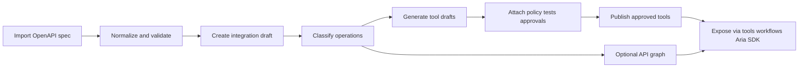
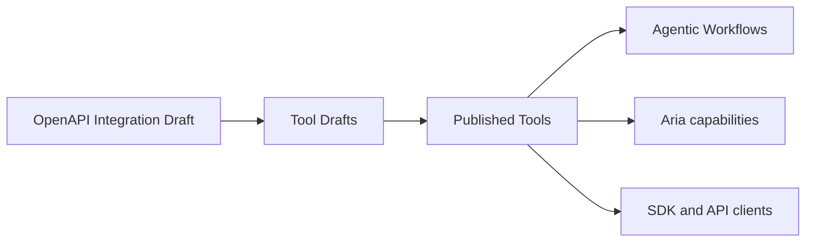

# CALIBER OpenAPI Integration Proposal

Status: Proposal

Repository baseline: `eafc1576db`

Last updated: 2026-08-10

---

## 0) Executive summary

CALIBER should add a governed OpenAPI integration capability, but it should not
be implemented as “paste a third-party spec and immediately expose every
endpoint to every agent.”

The right product is:

1. import and normalize a third-party OpenAPI specification;
2. classify and curate its operations;
3. generate governed tool drafts from selected operations;
4. publish only approved tools into CALIBER’s governed runtime, workflow, and
   SDK surfaces, with agent projection added explicitly rather than assumed;
5. optionally project the imported API into a graph representation that helps
   agents plan multi-step operations.

This fits CALIBER’s current architecture:

- the platform already serves and consumes OpenAPI;
- MCP servers already prove the pattern of discovered tools plus CALIBER-local
  policy overlays;
- workflow runtime already has guarded outbound HTTP execution for `webhook` and
  `api_request` nodes;
- tools, workflows, Aria capabilities, and the SDK already provide the runtime
  surfaces a governed integration should feed.

The main architectural decision is this:

> OpenAPI import should create governed integration assets and declarative tool
> bindings, not opaque generated Python code.

That keeps execution inside CALIBER’s existing policy, audit, scoping, and
egress controls instead of pushing critical behavior into unreviewed generated
source. It also means CALIBER can reuse the APIs and guarded HTTP runtime it
already has instead of rewriting them.

---

## 1) Why this capability belongs in CALIBER

CALIBER already positions integrations as a first-class part of the control
plane:

- the architecture names an Integration Hub alongside MCP servers, the LLM
  Gateway, webhooks, and workflow-as-a-service;
- MCP servers already behave like governed external tool dependencies;
- the management API already publishes its own OpenAPI contract at
  `/ajax-api/2.0/mlflow/caliber/openapi.json`;
- published workflow services already expose per-workflow OpenAPI documents.

So the platform already has the two core ingredients:

- a control-plane model for governed external capabilities; and
- a machine-readable contract model for HTTP APIs.

Adding governed OpenAPI import is therefore aligned with the current direction.
It is a natural extension of MCP and tools, not a separate product line.

---

## 2) Product decision

### Recommendation

Add a new **OpenAPI Integrations** capability under the Integrations area, with
**beta** stability initially.

### What it should do

- Import OpenAPI 3.x specs from URL, uploaded file, or pasted JSON/YAML.
- Normalize servers, auth schemes, tags, operations, request schemas, and
  response schemas into a CALIBER-owned representation.
- Let operators select which operations are eligible for tooling.
- Generate **tool drafts** from curated operations.
- Attach CALIBER-local policy, tests, approvals, and release workflow to those
  tool drafts.
- Publish approved drafts into CALIBER’s existing tool and workflow surfaces,
  with Aria projection handled as an explicit follow-on integration step.
- Optionally materialize an **API dependency graph** to improve agent planning
  and operator understanding, derived from CALIBER’s canonical dependency
  records.

### What it should not do

- Auto-publish every imported endpoint as an agent tool.
- Generate arbitrary Python source as the primary execution artifact.
- Treat OpenAPI as a proof of safe runtime behavior.
- Promise full support for every OpenAPI feature in v1.

---

## 3) Current repository facts that shape the design

This proposal is constrained by the current codebase, not by a generic API
platform template.

### 3.1 Existing platform assets to reuse

- `caliber/src/caliber/routes/openapi.py`
  - serves the management OpenAPI document from the live route table;
  - already defines route stability metadata and OpenAPI conventions.
- `caliber/src/caliber/routes/services.py`
  - already serves per-workflow service OpenAPI.
- `caliber/src/caliber/routes/mcp_servers.py`
  - already implements discovered-tool inventory, CALIBER-local policy overlays,
    test cases, and calibration on top of an external tool surface.
- `caliber/src/caliber/workflows/runtime.py`
  - already executes guarded outbound HTTP effects for `webhook` and
    `api_request` nodes through CALIBER-owned egress policy.
- `caliber/src/caliber/mcp_gateway.py`
  - already centralizes mediated external tool invocation.
- `caliber/src/caliber/assistant/capabilities.py`
  - already provides a governed agent capability registry, but it is
    code-registered rather than dynamically sourced from the tool registry.
- `caliber/src/caliber/routes/capabilities.py`
  - already exposes feature/stability discovery for SDK clients.
- `docs/api/*` and `docs/sdk/*`
  - already define the public REST and SDK documentation contract.
- `sdk/caliber-sdk/*`
  - already exposes `client.raw` as a permanent escape hatch for new REST
    surfaces before every typed helper lands.

### 3.2 Existing design constraints

- CALIBER’s current management OpenAPI is route-level first and still has
  partial request/response schema coverage.
- MCP is already a governed external capability model, so OpenAPI import should
  reuse its strengths and avoid duplicating its mistakes.
- The current tool registry is Python-callable oriented: `CaliberToolRegistry`
  stores `module_path` and `callable_name`, and workflow tool binding imports
  Python callables from those fields today.
- Aria’s current callable surface is not “all published tools.” It is a mixed,
  partial surface: hand-written tools plus a small code-registered capability
  projection.
- Tools, capabilities, and workflows already exist as durable surfaces; OpenAPI
  import should feed them rather than bypass them, but some of those surfaces
  need explicit extension for declarative HTTP tools.
- The platform already has governed HTTP/MCP egress policy, project scoping,
  audit, and release operations; imported integrations must remain inside those
  boundaries.

### 3.3 Consequence

The cleanest shape is:

- **new integration-domain models and routes** for OpenAPI import and curation;
- **declarative execution bindings** for selected operations;
- **a minimal extension of the existing tool runtime** so a published tool can
  be backed by declarative HTTP execution rather than only a Python import
  target;
- **optional Aria projection work**, because the current assistant capability
  surface is not dynamic registry parity.

---

## 4) Proposed architecture

### 4.1 Control-plane shape

The OpenAPI feature should be modeled as a governed integration pipeline:



### 4.2 Domain model

Add a dedicated integration model instead of overloading `CaliberMcpServer`.
MCP and OpenAPI are related, but they are not the same thing:

- MCP is a live remote tool protocol.
- OpenAPI is a contract for HTTP operations that CALIBER can interpret and
  govern.

Recommended entities:

| Entity | Purpose |
| --- | --- |
| `OpenApiIntegration` | The stable integration identity: vendor/system, owner, status, base metadata |
| `OpenApiIntegrationVersion` | One imported spec snapshot, pinned and auditable |
| `OpenApiOperation` | One normalized operation from the pinned spec |
| `OpenApiOperationDependency` | Canonical dependency record between operations, with type, confidence, and provenance |
| `OpenApiToolDraft` | One agent-facing/tool-facing draft produced from one or more operations |
| `OpenApiCredentialBinding` | Secret references and auth binding metadata |
| `OpenApiPolicyProfile` | Side-effect level, approval, rate limits, environment restrictions |
| `OpenApiGraphSnapshot` | Optional graph projection for planning and analysis |

### 4.2.1 What the integration draft is not

The **integration draft is not an agentic workflow**.

It should be modeled as a **governed integration asset** in the control plane.
Its job is to describe and govern an external API surface, not to orchestrate a
runtime execution plan.

That distinction matters because these are different layers of the system:

- **OpenAPI Integration Draft**
  - external API identity and imported contract
  - normalized operations
  - auth binding
  - policy classification
  - publication readiness
- **Tool Draft**
  - one curated callable capability derived from one or more operations
- **Published Tool**
  - a governed runtime capability exposed to agents, workflows, and SDK clients
- **Agentic Workflow**
  - a runtime orchestration that may call published tools as steps

If CALIBER collapses those into one object, it mixes:

- integration management;
- tool governance; and
- workflow orchestration.

That would make ownership, review, release, and runtime behavior harder to
reason about.

The correct dependency chain is:



So the integration draft belongs in the **integration/control-plane layer**,
while agentic workflows belong in the **runtime orchestration layer**.

### 4.2.2 Integration draft lifecycle

Recommended lifecycle:

| Status | Meaning |
| --- | --- |
| `draft` | Integration shell exists; spec may be imported, but no curated runtime exposure exists yet |
| `review` | Imported operations, auth bindings, and warnings are under operator review |
| `ready` | Selected operations are classified and eligible for tool-draft generation |
| `published` | One or more approved tool drafts derived from the integration are now live as governed tools |
| `archived` | Integration is retired and no longer active for new publication work |

Creation should therefore happen in two steps:

1. create the **integration shell**;
2. import one or more **pinned OpenAPI versions** into that shell.

This keeps the external system identity stable even when the imported contract
changes over time.

### 4.2.3 Canonical dependency model

API dependency should be modeled **first as typed records**, not first as a
graph.

The graph is useful, but it should be a projection of a stricter canonical
model. CALIBER’s governance, audit, versioning, SDK/API contracts, and release
workflow are easier to define against typed entities than against graph-only
state.

Recommended canonical record:

| Field | Purpose |
| --- | --- |
| `dependency_id` | Stable row identity |
| `integration_version_id` | Pins the dependency to one imported contract snapshot |
| `from_operation_id` | Source operation |
| `to_operation_id` | Target operation |
| `dependency_type` | Kind of relationship |
| `confidence` | `high`, `medium`, or `low` |
| `source` | How the dependency was found |
| `required` | Whether CALIBER should treat it as a hard dependency |
| `binding_field_map` | Field-level mapping such as `ticket_id -> path.ticket_id` |
| `notes` | Human explanation or review note |

Recommended `dependency_type` values:

- `produces_identifier_for`
- `consumes_identifier_from`
- `requires_auth`
- `polls`
- `paginates_to`
- `compensates`
- `precondition_for`
- `grouped_with`

Recommended `source` values:

- `openapi_link`
- `schema_match`
- `path_structure`
- `rule_inference`
- `agent_suggestion`
- `operator_confirmed`

This gives CALIBER a deterministic, diffable, auditable dependency layer before
it renders any graph view.

### 4.3 Runtime model

The runtime should be **declarative HTTP execution**, not generated code.

Each published tool should carry:

- operation reference;
- resolved server/base URL strategy;
- auth binding reference;
- input mapping rules;
- output extraction rules;
- pagination/polling metadata if supported;
- policy metadata;
- approval metadata.

Execution should happen through a CALIBER-owned HTTP executor that reuses the
same guarded outbound HTTP/effect path CALIBER already uses for workflow
`webhook` and `api_request` nodes wherever possible, rather than inventing a
second egress stack.

That executor should:

- validate inputs;
- injects credentials from the secret store;
- enforces egress policy;
- applies timeouts/retries/idempotency rules;
- records audit and effect traces;
- normalizes outputs back into tool results.

This preserves CALIBER’s control of execution and avoids a codegen surface that
is difficult to review or secure.

### 4.3.1 Tool runtime compatibility requirement

The proposal must be explicit about one current codebase fact:

- `CaliberToolRegistry` is currently defined around `module_path` and
  `callable_name`;
- workflow tool binding imports those Python callables directly.

So an OpenAPI-derived tool cannot be “published as a normal tool” without a
runtime extension. The cleanest path is to extend the tool registry/runtime with
an execution discriminator such as:

- `execution_backend = python_callable | openapi_http`
- backend-specific config or binding reference

This is better than hiding OpenAPI execution behind generated Python glue,
because the platform can still reason about the tool declaratively for audit,
policy, and future SDK/graph projection.

### 4.4 Where this lands in CALIBER

#### UI

Place it in the existing **Integrations** group, alongside:

- MCP Servers
- LLM Gateway

Recommended page flow:

- Integrations → OpenAPI
  - Catalog
  - Import
  - Versions
  - Operations
  - Tool Drafts
  - Tests
  - Release
  - Graph

#### API

Add a new beta route family:

```text
/ajax-api/2.0/mlflow/caliber/openapi-integrations/*
```

#### SDK

Add a corresponding SDK module:

```text
client.openapi_integrations
```

#### Agent and workflow runtime

Do not call imported operations directly from the planner. Publish approved tool
drafts into:

- the tool registry/runtime, after the execution-backend extension above;
- workflow tool binding surfaces;
- Aria only through an explicit follow-on adapter, because today Aria does not
  automatically project all published tools.

### 4.4.1 Relation to the existing API Request node

CALIBER already has an `api_request` workflow node. OpenAPI Integrations should
not replace it.

They solve different problems:

- `api_request`
  - low-level workflow escape hatch;
  - one-off request definition inside a workflow;
  - useful when the operator already knows the exact call they want to make.
- `OpenAPI Integration`
  - reusable, versioned, curated external capability surface;
  - central auth binding, policy, release, and audit;
  - publishable as shared governed tools for many workflows and SDK clients.

So the OpenAPI feature is useful precisely because it converts repeated
ad hoc HTTP usage into a governed integration service instead of leaving those
calls scattered across workflows.

---

## 5) How CALIBER should model API dependency

Use a **hybrid model**:

- **canonical model:** typed relational records;
- **derived model:** graph projection.

CALIBER should not make the graph the primary source of truth for imported API
dependency.

### 5.1 Why the canonical model should be typed records

Typed records are the better source of truth for:

- governance state;
- review and approval workflows;
- release/publication logic;
- audit and version diffing;
- REST and SDK contracts;
- deterministic import behavior.

That is why `OpenApiOperationDependency` should be the authoritative dependency
object.

### 5.2 Why CALIBER should still project a graph

The graph is still valuable, but as a **secondary planning and retrieval
surface**, not as the primary execution contract.

### Recommendation

- **Primary execution contract:** curated tool bindings backed by declarative
  HTTP execution.
- **Primary dependency truth:** typed dependency rows.
- **Secondary planning surface:** API graph projection.

### Why the graph helps

A flat operation list is fine for human inspection and direct invocation. It is
not ideal for agent planning when the task is multi-step:

- find a resource;
- create a child object;
- attach a file;
- poll a status endpoint;
- branch on a returned state.

A graph gives the agent structure that OpenAPI alone only implies.

### What the graph should contain

Nodes:

- integration
- server/base URL
- auth scheme
- tag/group
- operation
- request schema
- response schema
- resource type
- tool draft
- published tool
- dependency record

Edges:

- `requires_auth`
- `belongs_to_tag`
- `consumes_schema`
- `produces_schema`
- `depends_on`
- `returns_identifier_for`
- `polls`
- `paginates_to`
- `publishes_as_tool`

The graph should be derived from the canonical dependency rows plus integration,
operation, schema, and tool-draft metadata.

### When the graph materially improves agent use

- operation chaining;
- resource lifecycle reasoning;
- discovering follow-up actions after a call;
- selecting a safe read path before a write path;
- deciding which identifier-producing operation must run first.

### Important constraint

The graph should not replace tool curation. If the imported graph is wrong or
incomplete, the execution contract must still be safe. That is why the graph is
an aid to planning, retrieval, and explanation rather than the source of
authority for runtime execution.

### Storage recommendation

- **v1:** persist a normalized graph snapshot as JSON on the integration
  version, derived from the canonical dependency rows.
- **v2:** optionally project it into CALIBER’s existing graph substrate
  (Apache AGE) for richer traversal and analysis.

### 5.3 How CALIBER should detect dependencies

Dependency detection should be **mostly deterministic**, with agent assistance
only as an advisory layer.

Recommended three-tier model:

1. **explicit dependencies**
2. **inferred deterministic dependencies**
3. **agent-suggested dependencies**

#### Explicit dependencies

These are high-confidence and should auto-wire when valid:

- OpenAPI `links`
- exact response-field to request/path-field identifier mapping
- explicit security/auth requirements
- direct polling and pagination contracts present in the spec

#### Inferred deterministic dependencies

These are rule-based and repeatable:

- path parameter reuse
- hierarchical resource paths
- schema field matching such as `id -> {resource_id}`
- async lifecycle patterns like `create -> get status -> get result`
- common CRUD and attachment/publish/rollback verb patterns

These should produce stable draft dependencies with confidence scoring.

#### Agent-suggested dependencies

These should only be advisory:

- semantic grouping from operation descriptions
- likely business-tool composition
- possible compensating actions
- weak text-based relationship hints

These should never become hard runtime truth without operator confirmation.

### 5.4 Deterministic vs agent-assisted policy

CALIBER should follow this policy:

- **high confidence** → auto-wire into canonical dependency rows
- **medium confidence** → create draft suggestions for operator review
- **low confidence** → keep as advisory hints only
- **publish step** → operator confirms ambiguous dependencies

So the agent is not the primary detector. The deterministic parser is.

That keeps imports:

- repeatable;
- auditable;
- testable; and
- resistant to hallucinated dependency structure.

---

## 6) Key risks and mitigations

| Risk | Why it matters | Mitigation |
| --- | --- | --- |
| SSRF / arbitrary endpoint fetch | importing a spec or executing a generated tool can turn CALIBER into a network pivot | all spec fetch and runtime calls go through governed HTTP egress; allowlisted domains and environment policy apply |
| Secret exfiltration | imported integrations will carry third-party credentials | bind credentials through CALIBER secret references; never store raw secrets on tool drafts or audit rows |
| Unsafe writes exposed to agents | OpenAPI says what exists, not what is safe | default imported operations to non-published draft state; require side-effect classification and approval policy before publication |
| Tool explosion | large specs can produce hundreds of low-value endpoints | operator curation is required; support selection by tag/path/method; allow grouping into tool packs |
| Poor-quality specs | many enterprise specs are incomplete or inconsistent | normalize into CALIBER-owned models; emit import warnings; block publication when critical fields are missing |
| Spec drift | third-party APIs change silently | pin imported versions; diff old vs new; require re-review and re-publish |
| Runtime ambiguity | pagination, async jobs, and idempotency are often underspecified | explicitly model support tiers; start with synchronous request/response operations and add polling/pagination adapters later |
| OAuth complexity | full browser-based OAuth flows are harder than static API keys | v1 should support static headers, bearer token, API key, and basic auth first; defer full OAuth dance unless a concrete use case justifies it |
| Generated code risk | codegen produces opaque execution behavior and dependency sprawl | do not use generated Python as the primary execution model; keep execution declarative and server-owned |
| Cross-operation transaction illusion | agents may assume multi-step flows are atomic | express dependencies and compensating actions explicitly; never promise transactional semantics across external APIs |
| Agent-invented dependency structure | an LLM may infer relationships that the contract does not support | keep deterministic dependency detection primary; treat agent output as advisory until operator-confirmed |
| Runtime parity gap | current tools and Aria surfaces do not natively accept declarative HTTP tools | explicitly extend the tool runtime with an execution backend model; treat Aria dynamic projection as a scoped follow-on, not an assumed free win |

---

## 7) Exact implementation plan

This is the execution plan I would recommend for implementation.

### Phase 0 — foundation and contract

Goal: introduce the domain and import contract without exposing it to agents yet.

Files and areas:

- `caliber/src/caliber/db/models.py`
- `caliber/src/caliber/db/migrations/versions/*`
- `caliber/src/caliber/schemas.py`
- `caliber/src/caliber/routes/__init__.py`
- new `caliber/src/caliber/routes/openapi_integrations.py`

Deliverables:

- new persistence models for integrations, versions, operations, dependencies, and drafts;
- create/list/detail/update/archive routes;
- import request/response schemas;
- route registration and stability tagging;
- feature detection entry in `/capabilities`;
- project/visibility scoping aligned with existing asset families.

Acceptance criteria:

- an operator can create an integration record and import a spec snapshot;
- the imported version is durable and auditable;
- the new route family appears in the served management OpenAPI;
- nothing is yet callable by agents.

### Phase 1 — parser, normalizer, and validation

Goal: make imported specs trustworthy enough for curation.

Files and areas:

- new `caliber/src/caliber/integrations/openapi/loader.py`
- new `caliber/src/caliber/integrations/openapi/normalize.py`
- new `caliber/src/caliber/integrations/openapi/classify.py`
- new `caliber/src/caliber/integrations/openapi/diff.py`
- new `caliber/src/caliber/integrations/openapi/dependencies.py`

Deliverables:

- spec loader for URL, upload, and raw body import;
- normalization pipeline for servers, auth, tags, operations, schemas;
- classification for read/write/admin/async/paginated operations;
- deterministic dependency detector with confidence scoring;
- advisory agent-suggestion seam for ambiguous dependencies;
- import warnings and blocking errors;
- spec diff between versions.

Acceptance criteria:

- import produces deterministic normalized operations;
- dependency detection is deterministic for the same imported spec;
- unsupported or ambiguous constructs are explicitly reported;
- repeated import of the same spec produces stable normalized output.

### Phase 2 — tool draft generation

Goal: turn selected operations into governed CALIBER tool drafts.

Files and areas:

- new `caliber/src/caliber/integrations/openapi/tool_drafts.py`
- `caliber/src/caliber/routes/tools.py`
- `caliber/src/caliber/schemas.py`
- `caliber/src/caliber/db/models.py`

Deliverables:

- tool draft generation from selected operations or operation groups;
- operator-editable name, summary, description, input schema, output schema;
- policy profile attachment;
- execution-backend extension design for publishing declarative HTTP tools into
  the existing tool runtime;
- draft validation and preview execution.

Acceptance criteria:

- imported operations do not become runtime tools automatically;
- a generated draft is editable before publication;
- preview execution runs through CALIBER’s own guarded executor.

### Phase 3 — declarative HTTP executor

Goal: execute published OpenAPI-derived tools safely at runtime.

Files and areas:

- new `caliber/src/caliber/integrations/openapi/executor.py`
- `caliber/src/caliber/egress.py`
- `caliber/src/caliber/secret_store.py`
- `caliber/src/caliber/assistant/capabilities.py`
- workflow tool binding surfaces

Deliverables:

- server-owned executor for HTTP operations, reusing the guarded HTTP/effect
  path already present in workflow runtime where practical;
- auth injection using secret references;
- input validation, timeout, retry, audit, and effect recording;
- publication into tool/workflow surfaces;
- explicit Aria-adapter design or documented deferral.

Acceptance criteria:

- published tools are visible through existing CALIBER tool surfaces;
- runtime calls are audited and policy-controlled;
- workflow runtime can invoke published OpenAPI-backed tools without Python code generation;
- failures preserve enough detail for debugging without leaking secrets.

### Phase 4 — graph projection

Goal: improve agent planning and operator understanding.

Files and areas:

- new `caliber/src/caliber/integrations/openapi/graph.py`
- possible later projection into knowledge graph infrastructure

Deliverables:

- graph snapshot endpoint;
- graph summary in the UI;
- SDK access to graph nodes and edges;
- optional planner-facing summaries for Aria.

Acceptance criteria:

- graph output is derived from the pinned integration version and canonical dependency rows;
- agents can retrieve the graph without bypassing curated tools;
- the graph aids planning but is not required for execution correctness.

### Phase 5 — UX, docs, SDK, and hardening

Goal: make the feature usable and supportable.

Files and areas:

- `caliber/caliber-ui/src/pages/*`
- `sdk/caliber-sdk/*`
- `docs/api/*`
- `docs/sdk/*`
- `docs/use/*`
- `docs-site/*`

Deliverables:

- OpenAPI Integrations UI;
- SDK module and examples;
- REST and SDK docs;
- cookbook examples;
- CI validation and contract tests.

Acceptance criteria:

- the feature is documented as a supported beta surface;
- examples are tested;
- new docs are published through the existing docs-site pipeline.

---

## 8) Concrete route and SDK shape

### 8.1 Proposed route families

Recommended initial routes:

```text
GET    /openapi-integrations
POST   /openapi-integrations
GET    /openapi-integrations/{integration_id}
PATCH  /openapi-integrations/{integration_id}
POST   /openapi-integrations/{integration_id}/archive

POST   /openapi-integrations/{integration_id}/import
GET    /openapi-integrations/{integration_id}/versions
GET    /openapi-integrations/{integration_id}/versions/{version_id}
POST   /openapi-integrations/{integration_id}/versions/{version_id}/diff

GET    /openapi-integrations/{integration_id}/operations
GET    /openapi-integrations/{integration_id}/operations/{operation_id}
GET    /openapi-integrations/{integration_id}/dependencies
POST   /openapi-integrations/{integration_id}/tool-drafts/generate
PATCH  /openapi-integrations/{integration_id}/tool-drafts/{draft_id}
POST   /openapi-integrations/{integration_id}/tool-drafts/{draft_id}/preview
POST   /openapi-integrations/{integration_id}/tool-drafts/{draft_id}/publish

GET    /openapi-integrations/{integration_id}/graph
POST   /openapi-integrations/{integration_id}/validate-spec-source
POST   /openapi-integrations/{integration_id}/validate-credential-binding
POST   /openapi-integrations/{integration_id}/reimport
```

### 8.1.1 Creation flow

The creation flow should be explicit:

1. `POST /openapi-integrations`
   - creates the integration shell in `draft` state
2. `POST /openapi-integrations/{integration_id}/import`
   - imports and pins an OpenAPI version
   - normalizes operations
   - records warnings and validation results
3. `GET /openapi-integrations/{integration_id}/operations`
   - lets the operator review the imported surface
4. `POST /openapi-integrations/{integration_id}/tool-drafts/generate`
   - generates curated tool drafts from selected operations

This is deliberate: importing a spec should not itself create a workflow, and it
should not auto-publish runtime tools.

### 8.2 Proposed SDK surface

Recommended SDK group:

```python
client.openapi_integrations.list()
client.openapi_integrations.create(...)
client.openapi_integrations.import_spec(...)
client.openapi_integrations.list_operations(...)
client.openapi_integrations.list_dependencies(...)
client.openapi_integrations.generate_tool_drafts(...)
client.openapi_integrations.preview_tool_draft(...)
client.openapi_integrations.publish_tool_draft(...)
client.openapi_integrations.validate_credential_binding(...)
client.openapi_integrations.graph(...)
```

### 8.3 Publication model

The OpenAPI Integration feature should not create a parallel tool runtime.

Instead:

- integration import owns discovery and curation;
- published drafts become standard CALIBER runtime tools after the runtime grows
  an explicit declarative HTTP execution backend;
- agents and workflows consume those published artifacts through the existing
  governed surfaces; and
- `client.raw` remains the fallback for early adopters until the typed SDK group
  is complete.

That preserves platform consistency and minimizes duplicated runtime code.

---

## 9) Documentation and test deliverables

Implementation should not be considered complete without the following
artifacts:

### Documentation

- architecture doc for OpenAPI Integrations;
- user guide for importing and curating a spec;
- API reference for the new route family;
- SDK reference for `client.openapi_integrations`;
- at least two cookbook examples:
  - read-only enterprise API integration;
  - governed write-capable integration with approval.

### Test suites

- unit tests for normalization, classification, and diffing;
- unit tests for deterministic dependency detection and confidence scoring;
- route tests for CRUD/import/publication;
- integration tests for declarative HTTP execution;
- policy tests for secret redaction, allowlists, and unsafe-operation blocking;
- docs example tests for SDK snippets.

### CI gates

- add the new tests to the default suite;
- add contract checks that imported drafts cannot bypass policy;
- add docs validation for all new examples.

---

## 10) Recommended scope for v1

To keep the first release defensible, limit v1 to:

- OpenAPI 3.x import;
- JSON/YAML body ingestion;
- static server selection;
- API key, bearer token, basic auth, and secret-header binding;
- synchronous request/response operations;
- operator-curated tool publication;
- tool-registry execution-backend extension for declarative HTTP tools;
- deterministic dependency detection with operator-reviewed ambiguity handling;
- JSON graph snapshot.

Defer unless a real use case demands them:

- full OAuth browser flows;
- token refresh and multi-step OAuth exchanges;
- callbacks and webhooks generated from the imported spec;
- long-running async job orchestration beyond simple polling patterns;
- broad automatic code generation;
- automatic publication of entire tags or entire specs;
- full dynamic Aria parity for every published OpenAPI tool.

---

## 11) Final recommendation

This capability is worth building.

It strengthens CALIBER in exactly the direction the platform is already going:

- governed integrations;
- reusable tool surfaces;
- agentic workflows with safe external actions;
- SDK and OpenAPI-driven developer adoption.

The key is to implement it as a **governed integration pipeline** rather than an
API-import shortcut.

If built this way, OpenAPI integration can become:

- a better operator workflow than hand-writing every HTTP tool;
- a better developer workflow than bypassing CALIBER and calling external APIs
  directly;
- a better agent workflow than giving the model a flat, unstructured endpoint
  list.

And yes: presenting imported APIs as a graph will make agents better at
planning and sequencing operations, but only when that graph sits beside a
curated, governed tool surface, and only when the graph is derived from a
deterministic canonical dependency model rather than replacing it.
