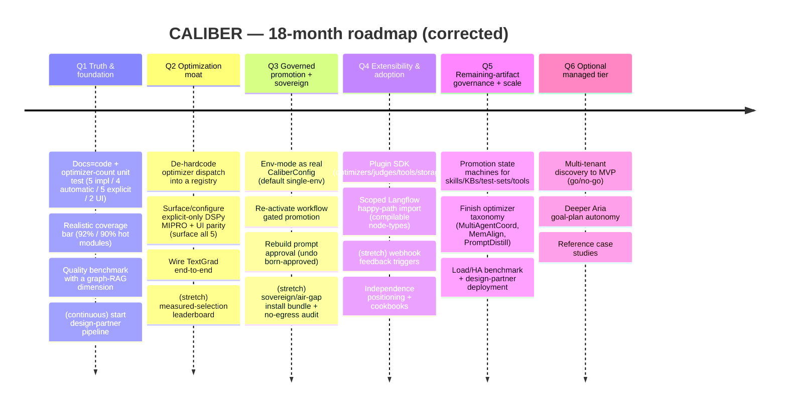
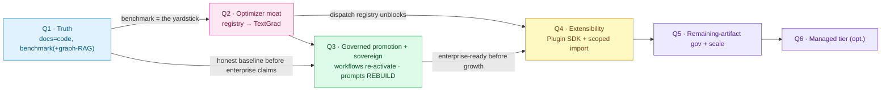

---
audience:
  - architect
  - decision-maker
doc_type: strategy
product_area: strategy
stability: ga
prerequisites:
  - Competitive analysis context
reviewed_on: 2026-08-10
version_applicability: current main branch docs contract
tags:
  - roadmap
  - strategy
  - planning
  - execution
---

# CALIBER — Roadmap

*A feasibility-grounded, quarter-by-quarter plan derived from the [competitive analysis](./competitive-analysis.md) and **verified against the actual codebase**. Built for a **two-person team — you (product/strategy lead) and me (AI pair-programmer)** — and scoped to what that team can realistically ship and, above all, *review*.*

> **Status:** planning snapshot, not a current capability reference. The original
> audit baseline found historical nine-optimizer claims; those claims have since
> been reconciled. As of 2026-07-31, five provider paths are implemented,
> automatic rules can choose four, explicit job/agent pins can reach all five, and
> the prompt form exposes two. Roadmap deliverables remain proposed until current
> code and release evidence prove them landed.

> **Current delta (2026-08-04):** prompt authoring is now non-live, and direct
> prompt promote/rollback uses an intent-first, idempotent release-operation row
> with exact before/after versions, optimistic concurrency, incomplete-operation
> locking, and operator-triggered reconciliation. This is release durability, not
> completion of Q3 governed promotion: requester/approver separation, enforced
> human sign-off, and a configurable multi-environment ladder remain proposed.

> **This roadmap was adversarially critiqued against the code before publication** (three skeptic passes: feasibility-vs-architecture, competitive-alignment, capacity). Several first-draft assumptions turned out to be wrong — most importantly that human-approval governance was merely "dormant." The corrections are recorded in **[§12 Feasibility review](#12-feasibility-review)**; the plan below is the corrected version.
>
> **Planning unit.** One quarter = 3 months. Q1–Q4 are committed and detailed; Q5–Q6 are directional bets re-committed at the H1 review. Quarters are relative (start = "next quarter"), not fixed calendar dates.
>
> **Grounding rule.** Every deliverable names the architectural seam it builds on. Where a "seam" is only a docstring or a UI constant (not working code), it is marked 🌱 *green-field* and sized as new work — because pretending otherwise is exactly the "docs outrun code" failure Q1 exists to cure.

---

## TL;DR

CALIBER's wedge is real but narrow: an open-source, self-hosted, MLflow-integrated control plane that connects policy-selected optimization, evaluation evidence, human action, audit, and asset-specific rollback beside a multi-asset registry with native graph-RAG. The current gate and lifecycle contracts are not uniform across assets; closing those gaps is work in this roadmap. The analysis showed the wedge is thinly populated but narrowing as MLflow and cloud platforms absorb the primitives.

The corrected plan does four things, in priority order:

1. **Earn trust & tell the truth about the code** (Q1) — reconcile the historical docs↔code optimizer mismatch and the removal of prompt approval governance, hit a *realistic* coverage bar, and publish a quality benchmark **that includes a graph-RAG dimension**.
2. **Deepen the two moats MLflow is less likely to build** (Q2–Q3) — the policy/diagnosis-informed multi-optimizer (starting by making dispatch pluggable) and **human-in-the-loop governed promotion** (re-activate it for workflows; **rebuild** it for prompts), fused with the **sovereign/air-gap** story.
3. **Grow adoption via extensibility, not hand-built adapters** (Q4) — ship a **Plugin SDK** so the community builds importers/optimizers, plus a scoped Langflow happy-path import.
4. **Then scale** (H2) — extend governance to the remaining artifacts, finish the optimizer taxonomy, and run a go/no-go on an optional managed tier.

| Quarter | Theme | Committed majors (2 + tax) | Answers |
|---|---|---|---|
| **Q1** | Truth & foundation | Docs↔code + optimizer-count unit test · Quality benchmark (**incl. graph-RAG**) | "docs outrun code", coverage, quality proof |
| **Q2** | Optimization moat | **De-hardcode optimizer dispatch** + surface/configure explicit-only DSPy MIPRO + UI parity · Wire **TextGrad** end-to-end | MLflow encroachment; differentiation |
| **Q3** | Governed promotion + sovereign | Env-mode as real config · Governed promotion: **workflows (re-activate) + prompts (rebuild)** | single-env v1; regulated/sovereign buyers |
| **Q4** | Extensibility & adoption | **Plugin SDK** (needs Q2 registry) · Scoped **Langflow happy-path import** | narrow ecosystem; community cold-start |
| **Q5** | Remaining-artifact governance + scale | Promotion for skills/KBs/test-sets/tools · finish optimizer taxonomy · load/HA + design partner | "6-artifact" governance; unproven at scale |
| **Q6** | Optional managed tier | Multi-tenant discovery → MVP (go/no-go) · deeper Aria · case studies | self-host adoption barrier |

> **Two claims this roadmap deliberately does *not* make** (corrected from the draft): governed promotion exists for **1** artifact in the roadmap's audited baseline (workflows), not 6; and the optimizer engine implements **5** (4 automatic-policy paths, all 5 explicit-reachable, 2 surfaced in the prompt UI), not 9.

---

## 1. Guiding strategy (from the competitive analysis)

- **Own the wedge; don't chase breadth.** Position the current product as an *evidence-backed, self-hosted refinement and governance control plane for teams on MLflow*; make unbypassable governed promotion a roadmap outcome, not a present-tense blanket claim. It is not a builder, automation hub, or BPM engine.
- **Bet the moat on what MLflow structurally won't build.** MLflow is a library/toolkit; it is unlikely to ship an opinionated **human-approval UI + cross-artifact release control room + a native graph store**. Those — plus **sovereign/air-gapped** deployment (a self-hosted MLflow shop *cannot* adopt Databricks-hosted governance) — are the least-copyable arcs. Invest there; treat MLflow as substrate (contribute upstream opportunistically).
- **Fund the differentiators the draft ignored.** Native **graph-RAG** (no MLflow/Vertex/Azure answer) and **sovereign/air-gap** (the analysis's #2 recommended segment) were named as moats but unfunded in the first draft — they are now first-class.
- **Neutralize named weaknesses on schedule** and **interoperate above the builders** (Plugin SDK + scoped import) rather than hand-maintaining fragile adapters.

---

## 2. How we work — the two-person operating model

Sized for **one human lead + one AI pair-programmer**. The AI implements fast, which **moves the bottleneck onto the human**: every PR is reviewed by one person, and every product/architecture/security decision and external conversation is serial, human-only work that the AI cannot parallelize. So we budget **human-serial load**, not deliverable count.

| Role | Owns |
|---|---|
| 🧑 **You (human lead)** | Product & strategy, prioritization, architecture & security sign-off, benchmark protocol, **PR review + merge authority**, community, and all design-partner/partnership conversations. |
| 🤖 **Me (AI pair)** | Implementation, tests, migrations (under review), docs, competitive/MLflow tracking, workflow orchestration, RFC drafting. |
| 🤝 **Pair** | Hard architecture, risky refactors, governance semantics, incident response, re-planning. |

**Capacity rules (revised after the capacity critique):**
- **≤ 2 *committed* majors per quarter + 1 stretch.** The former "3 majors" cap counted deliverables, not human load, and hid over-commitment.
- **Reserve ~1 major's worth of human capacity every quarter** for the unglamorous tax: PR-review latency, migrations & backward-compat, flaky-test triage, and the continuous tracks (§9). It is written into each quarter's exit criteria so it actually happens.
- **≤ 1 external/irreversible item per quarter** (one upstream PR *or* one public-SDK freeze *or* one design-partner negotiation — never two). These don't parallelize and their timelines aren't ours to control.

**Cadence:** kickoff (pick the 2 majors + stretch, write exit criteria) → weekly small-PR loop → mid-quarter checkpoint (cut to protect the majors) → end-of-quarter review → re-plan.

---

## 3. Timeline

**Dependency logic (why this order):**

Note the **Q2 → Q4 edge**: the "de-hardcode optimizer dispatch into a registry" task in Q2 is a *prerequisite* for the Plugin SDK's flagship extension point (custom optimizers), so it is done once and reused.

---

## 4. Q1 — Truth & foundation  *(verdict: realistic — the light quarter)*

**Why.** The analysis's sharpest internal finding was that the product was "ahead of itself in spots." At the roadmap's audit baseline, historical docs claimed 9 optimizers while the engine implemented 5, automatic rules selected 4, explicit configuration could reach all 5 (including MIPRO), and the prompt UI showed 2; internal docstrings also contradicted each other. None of the later moat/enterprise claims were safe until that baseline was reconciled — making it the low-risk warm-up quarter.

| # | Deliverable | Owner | Grounding (verified) | Exit criteria | Effort/Risk |
|---|---|---|---|---|---|
| 1.1 | **Docs↔code reconciliation + a real test.** Correct `docs/`, `docs-site/`, **and Python docstrings** (`candidate.py`, `optimizer_select.py` disagree with each other). Add a **unit test** asserting the true supported/selectable optimizer set (not just a doc grep). | 🤖 AI-led | `docs-site/build-docs.mjs`; `orchestrator/optimizer_select.py`; `llm/openai_agents.py` dispatch tuple | No doc/docstring claims a capability the code lacks; a `test_supported_optimizers` guards the count in CI | S / Low |
| 1.2 | **Realistic coverage bar.** Raise coverage on the hot modules (assistant provider engines, `build_plan`/worker branches, large UI pages) to **92% overall / 90% named modules** (95% = stretch). Drop the 97% vanity target the analysis invented. | 🤖 AI-led, 🧑 review | existing pytest/vitest/Allure harness | 92% overall, 90% named; flaky-test budget acknowledged | M / Med |
| **1.3** | **Dependency & security cleanup.** Resolve the `pip-audit` follow-ups (`diskcache`/`torch` in DSPy/local-embedding extras); clean default profile, risky extras opt-in. | 🤝 Pair | `run-supported-python-security-audit.sh`, `pyproject.toml` extras | Default profile audit-clean | S / Med |
| **1.4** | **Quality benchmark (+ graph-RAG).** A reproducible harness running the loop on a **public dataset with a real LLM** (not `FakeLLMProvider`) for **MetaPrompt + GEPA** (defer DSPy until its `_demo_metric` is upgraded to an LLM-judge). Includes a **graph-RAG-vs-flat-RAG retrieval-quality dimension** and a **modest concurrency/throughput data point**. Labeled honestly: proves *the loop improves quality*, not *scale*. | 🧑 designs protocol, 🤖 implements | `eval/gate.py` (clean pure function — real seam); KB AGE retrieval; calibration orchestrator | One published, re-runnable benchmark with honest methodology + a graph-RAG number | M / **High** (real-LLM cost/non-determinism) |

**Committed majors:** 1.1 + 1.4. **Hygiene (tax budget):** 1.2, 1.3. **Continuous (starts now):** design-partner pipeline (§9).
**Q1 exit:** docs/docstrings match code (CI-guarded), coverage at a realistic bar, default deps clean, and one credible quality benchmark — with a graph-RAG number — as the yardstick for Q2.

---

## 5. Q2 — Optimization moat  *(verdict: split & de-scoped — the draft was over-committed)*

**Why.** Optimizers are now widespread (MLflow experimental, Phoenix OSS, Vertex/AWS/Azure). Our edge is *diagnosis-driven selection across many optimizers, wired into a gated loop* — but the critique showed the "selector already maps to N optimizers, just wire them" premise was **false**: automatic rules return only 4 implemented names, the provider rejects unsupported names, and the extra taxonomy entries are docstring-only. MIPRO is already an implemented explicit-pin path, not a sixth optimizer. So Q2 first makes the dispatch *pluggable*, then adds **one** genuinely new optimizer.

| # | Deliverable | Owner | Grounding (verified) | Exit criteria | Effort/Risk |
|---|---|---|---|---|---|
| 2.1 | **De-hardcode the optimizer dispatch into a registry** + define an automatic-selection policy (or retain an explicit-only policy) for **DSPy MIPRO** + **UI parity** (surface all 5 implemented paths; the form shows 2). This is the honest, high-leverage, mostly-cheap major — and it unblocks the Q4 Plugin SDK. | 🤝 Pair | `llm/openai_agents.py` hard-coded dispatch; `optimizer_select.py`; calibration form | Optimizers dispatched via a registry; all 5 current paths remain explicit-reachable; the MIPRO policy is documented; UI shows all implemented | M / Med |
| 2.2 | **Wire TextGrad end-to-end** — 🌱 green-field: new selection heuristic + a new iterative candidate-generation strategy class (TextGrad is multi-call, unlike single-pass MetaPrompt) + fake-provider support + UI + tests + one benchmark slice. | 🤝 Pair (design), 🤖 impl | follows the *module* pattern of `dspy_optimizer.py` (424 lines) — i.e., a real new module, not a config tweak | TextGrad selectable + tested; beats MetaPrompt on ≥1 benchmark slice **(research outcome — if it doesn't, that's a documented finding, not a failure)** | L / **High** (green-field + research risk) |
| 2.3 | *(stretch)* **Measured-selection leaderboard** across the **implemented** set on the Q1 benchmark; improve ≥1 keyword heuristic with evidence. | 🤖 AI-led | `optimizer_select.py` keyword heuristics + benchmark | Selection quality reported per diagnosis class | M / Med |
| — | **Upstream MLflow PR → continuous track** (§9), not a committed major. "Open a PR" (ours) not "merged" (theirs). | 🧑 | — | — | — |

**Committed majors:** 2.1 + 2.2. **Stretch:** 2.3. **Moved:** MultiAgentCoord → Q5; upstream PR → continuous.
**Q2 exit:** dispatch is pluggable, 6 provider paths are selectable (the current 5, already including MIPRO, plus the new TextGrad path), the UI is honest, and TextGrad is live (or its non-win is documented). *If 2.2's research risk bites, ship 2.1 + a documented TextGrad finding and pull 2.3 in.*

---

## 6. Q3 — Governed promotion + sovereign  *(verdict: corrected & split — the draft's core premise was wrong)*

**Why.** Single-environment v1 is the named enterprise gap, and regulated/sovereign/on-prem buyers are our most defensible segment (analysis rec #2). **Correction from the code critique:** the draft's "dormant, not missing" is only true for **workflows** — `promoter.py` has the full `GATED_ALIASES` → `CaliberWorkflowPromotion` → `approve/reject` → rollback-checkpoint machinery intact. For **prompts, human-approval governance was deliberately removed** (`CaliberApprovalRequest` is now a *born-approved* provenance anchor; `routes/jobs.py:217`), so this is a **rebuild**, not a re-activation. And `SINGLE_ENVIRONMENT`/`GATED_ALIASES` are a UI constant + Python module constants, **not** config fields.

| # | Deliverable | Owner | Grounding (verified) | Exit criteria | Effort/Risk |
|---|---|---|---|---|---|
| 3.1 | **Env-mode as real config.** Add `CaliberConfig.environment_mode`; thread it through the workflow promoter *and* the prompt-discovery hot-path; expose in the UI; default **single-env** (backward-compatible); migration + compat tests. | 🤝 Pair | `promoter.py:GATED_ALIASES`, `routes/prompts.py:_PROMPT_DISCOVERY_ALIASES`, `environment.ts`, `config.py` (no env-mode field today) | Instances toggle single↔multi-env by config, single-env default preserved; compat test green | M / **High** (touches prompt hot-path w/ known latency issue) |
| 3.2 | **Governed promotion for workflows + prompts.** Workflows: re-activate `GATED_ALIASES` + the existing promotion/approval state machine. Prompts: **rebuild** a pending→approve→reject flow with a requester/approver distinction (undo the born-approved shortcut). | 🤝 Pair (design), 🤖 impl | workflows: `promoter.approve_promotion`/`reject_promotion` (intact); prompts: 🌱 rebuild atop `CaliberApprovalRequest` (currently born-approved) | A candidate flows dev→staging→prod with eval gate + human sign-off + audited rollback, for **workflows and prompts** | L / **High** (prompt path is a rebuild) |
| 3.3 | *(stretch)* **Separation-of-duties + Releases room.** Enforce approver ≠ author (depends on 3.2 recording an author); scope the existing `/releases` timeline/live hub to artifacts with real rollback (workflows, KBs, prompts). | 🤖 AI-led | RBAC scopes in `auth.py` (real; already references "separation of duties"); `routes/releases.py` (real) | Approver≠author enforced; releases room covers the rollback-capable artifacts | M / Med |
| 3.4 | *(stretch)* **Sovereign/air-gap install bundle.** A no-egress install profile (docker-compose/offline), an offline model/gateway story, and a "no outbound calls" audit — the *cheap half* of "remove self-host barrier," pulled forward because it's the same buyer as governance. | 🧑 leads, 🤝 | existing single-stack `deploy/` compose; config | An air-gapped install runs the loop with a documented no-egress audit | M / Med |

**Committed majors:** 3.1 + 3.2. **Stretch:** 3.3, 3.4. **Explicitly deferred:** governance for skills/KBs/test-sets/tools → **Q5** (it is four asset-specific promotion/rollback implementations, *not* a fast-follow).
**Q3 exit:** governed `dev→staging→prod` for **workflows and prompts** with eval gates, human sign-off, and audited rollback, toggleable to single-env — and, ideally, an air-gapped install profile for the regulated segment.

---

## 7. Q4 — Extensibility & adoption  *(verdict: tighten to one big bet + let the community carry interop)*

**Why.** Recommendations #3–#4. The critique's key steer: **don't hand-build fragile importers on a two-person team — ship a Plugin SDK so the community builds them.** The Plugin SDK is also the higher-leverage, harder-to-reverse decision, so it gets the human's full design attention; the Langflow importer is scoped to a *compilable happy-path* because CALIBER's typed `WorkflowManifest` + `compile_workflow` validation won't accept arbitrary free-form flows.

| # | Deliverable | Owner | Grounding (verified) | Exit criteria | Effort/Risk |
|---|---|---|---|---|---|
| 4.1 | **Versioned Plugin SDK.** A semver'd extension interface for custom optimizers (**uses the Q2 dispatch registry**), judges (`make_judge`), tools, and storage backends, with docs. | 🤝 Pair | Q2 optimizer registry; judge/tool/storage seams (cleaner than the optimizer one was) | A third party adds an optimizer + a judge without forking; SDK docs + example published | L / **High** (one-way-door public contract) |
| 4.2 | **Scoped Langflow happy-path import.** Map a Langflow flow of node-types {LLM, prompt, tool-call} → a CALIBER manifest that **passes `compile_workflow`**; publish the *unsupported* node list. Dify = a spike only. | 🤝 Pair (design), 🤖 impl | 🌱 new adapter; target = `parse_manifest`/`compile_workflow` | Import one real (simple) Langflow flow into a governed, compilable CALIBER artifact | L / High (impedance mismatch) |
| 4.3 | *(stretch)* **Webhook feedback triggers** (n8n/CI → verification queue) — *verify the webhook surface exists before committing*. | 🤖 AI-led | feedback poller + webhook surface (assert-first) | External event → verification-queue item, documented | M / Low |
| 4.4 | **Adoption assets** (tax-budget, human-led): 2–3 interop cookbooks + an **"the last independent, open, self-hosted lifecycle control plane"** positioning piece (converts the consolidation wave — Langfuse→ClickHouse, Promptfoo→OpenAI — into a buying reason). | 🧑 leads, 🤖 drafts | `docs-site/cookbooks` pipeline | Cookbooks + positioning piece published | S / Low |

**Committed majors:** 4.1 + 4.2. **Stretch:** 4.3. **Moved to continuous (§9):** public roadmap + issue triage (it's ongoing community work, not a one-time deliverable).
**Q4 exit:** a semver'd Plugin SDK (community can extend without forking) + one real Langflow happy-path import + a sharpened independence narrative.

---

## 8. H2 (Q5–Q6) — directional bets

Re-committed at the H1 review. **Q5 is intentionally the overflow catch-basin** for work pushed out of Q2/Q3 (MultiAgentCoord, remaining-artifact governance) — it will itself need scoping at H1, not treated as free.

- **Q5 · Remaining-artifact governance + scale.** Build promotion/rollback state machines for **skills, KBs, test-sets, tools** (four asset-specific implementations that make "6-artifact governance" real alongside prompts and workflows); finish the optimizer taxonomy (MultiAgentCoord, MemAlign, PromptDistill); **load/HA benchmark** for queued workers + larger KB corpora (the *scale* proof the Q1 benchmark deliberately did not attempt); land a **design-partner deployment**.
- **Q6 · Optional managed tier.** The biggest lift — **explicitly a discovery→MVP arc with a human-led go/no-go gate** (multi-tenancy, isolation, ops span >1 quarter). Also deeper Aria goal-plan autonomy; reference case studies.
- **Split of "remove self-host barrier":** the *cheap* half (air-gap install bundle) is pulled forward to Q3; the *expensive* half (managed multi-tenant SaaS) stays a gated H2 bet.

---

## 9. Cross-cutting continuous tracks (budgeted, not free)

These consume the reserved ~1-major/quarter capacity:

- **MLflow watch (threat #1)** *and* **up-stack competitor watch (Langfuse/ClickHouse, Dify)** — with pre-committed triggers (see the contingency box in §12).
- **Design-partner pipeline** — human-led, runs from **Q1** so a reference customer can land by Q3–Q4, not Q6.
- **Upstream MLflow contribution** — opportunistic (open PRs; don't gate quarters on their review).
- **Security & dependency hygiene**; **docs=code** (the 1.1 unit test runs forever); **community & issue triage** (moved here from Q4).
- **The tax:** PR-review latency, migrations/backward-compat, flaky-test triage.

---

## 10. Non-goals (scope discipline)

We will **not**, in this horizon: become a general automation tool (n8n) or BPM engine (Flowable); chase a 400+ connector catalog; build a rival visual builder (we import from + extend them); or host models ourselves. Saying no here is what makes the "yes" list survivable for two people.

---

## 11. Success metrics

| Theme | Leading metric | Target |
|---|---|---|
| Truth/credibility | doc/docstring↔code drift; coverage; benchmarks (incl. graph-RAG) | 0 drift (CI-guarded); ≥92%; ≥1 benchmark with a graph-RAG number |
| Optimization moat | optimizers *selectable*; dispatch pluggable; measured selection | 6 selectable (Q2) → taxonomy done (Q5); registry shipped; leaderboard |
| Governed promotion | artifacts with governed multi-env promotion | **workflows + prompts** (Q3) → all 6 (Q5) |
| Sovereign | air-gapped install with no-egress audit | ≥1 profile (Q3 stretch) |
| Extensibility & adoption | external plugins; scoped import; design partners | ≥1 external plugin; ≥1 Langflow import; ≥1 design partner by Q4 |
| Scale | queued-run throughput / KB corpus at stable latency | published load numbers (Q5) |

---

## 12. Feasibility review

*This section records the adversarial critique (three skeptic passes against the code and the competitive analysis) and what it changed. The plan above is already the corrected version.*

**A. Factual grounding errors caught in the first draft (now fixed):**

1. **"Approval governance is dormant" was wrong for prompts.** `CaliberApprovalRequest` (models.py) is a *born-approved* provenance anchor — human-feedback approval was **removed**. It is genuinely dormant only for **workflows** (`GATED_ALIASES` machinery intact). → Q3 reframed as *re-activate (workflows) + **rebuild** (prompts)*; sized L/High.
2. **"Governed promotion across 6 artifacts" was aspirational at that audit baseline.** Only workflows then had a promotion state machine; skills/KBs/test-sets/tools had none, and tools lacked alias/rollback entirely. → the other four moved to **Q5** as four asset-specific implementations; the "6-artifact" language was removed from the headline.
3. **The optimizer "selector seam" was mostly fiction.** Automatic rules return 4 implemented names; the provider rejects unsupported names; TextGrad/MultiAgentCoord/etc. are docstring-only; DSPy MIPRO is implemented and explicit-reachable but has no automatic rule or prompt-form option. → Q2 adds a **dispatch registry** first, makes the MIPRO policy/UI explicit, and commits to **one** green-field optimizer (TextGrad), not two.
4. **`SINGLE_ENVIRONMENT` is a UI constant, not config.** → Q3.1 is real config plumbing across two subsystems + the UI, with a migration and compat test — a full major, not a flag flip.
5. **97% coverage is a vanity number.** → target lowered to a realistic 92%/90%.
6. **Plugin SDK's flagship extension point sits behind a hard-coded dispatch.** → the Q2 registry is an explicit prerequisite for Q4's SDK.

**B. Capacity corrections:** committed majors cut from 3 → **2 (+1 stretch)**; **~1 major/quarter reserved** for the tax; **≤1 external/irreversible item/quarter**; stretch flags moved onto the genuinely risky items (green-field optimizer, prompt-approval rebuild, public-SDK freeze) rather than the convenient secondary ones. **Q2 and Q3 were split**; Q3's non-workflow/prompt artifacts moved to Q5.

**C. Strategic gaps closed:** **graph-RAG** (a differentiator with no MLflow/Vertex/Azure answer) is now funded (Q1 benchmark dimension; Q5 scale); **sovereign/air-gap** (the analysis's #2 segment) is a first-class Q3 workstream; the **up-stack competitor watch** (threat #2) and a **from-Q1 design-partner pipeline** (threat #4 / social proof) were added; the consolidation wave is converted into a Q4 positioning bet.

**D. MLflow contingency (pre-committed pivots for the #1 threat):**

> - **If MLflow ships gated promotion** (our Q3 arc): our differentiation becomes UX + breadth + sovereignty. Pivot Q3 toward **unified multi-artifact** promotion (MLflow governs prompts/models, not skills/KBs/test-sets/tools/workflows) and **air-gapped governance** for shops that can't use hosted MLflow. The single→multi-env work stays valuable; the "we invented governed promotion" framing dies quietly.
> - **If MLflow ships diagnosis-driven selection** (our Q2 arc): pivot to selection **quality** (the leaderboard: "we pick better," provable on the Q1 benchmark), to **multi-agent / skill** optimization (MultiAgentCoord, SkillMetaPrompt — MLflow has no "skill" artifact), and accelerate **graph-RAG**, which MLflow has no answer for.
> - **In both cases:** accelerate the two arcs with *no* MLflow answer — **graph-RAG and sovereign/air-gap**.

**E. Residual risks we accept:**
- **Three consecutive higher-risk quarters (Q2–Q4).** Mitigation: Q2 and Q3 may be run as a combined block if the optimizer or prompt-approval-rebuild work overruns; quarter boundaries are planning aids, not contracts.
- **Q1 benchmark non-determinism** (real LLM + external data): mitigated by scoping to MetaPrompt+GEPA and treating the protocol as a research deliverable.
- **Q5 overflow:** acknowledged; re-scoped at H1 rather than assumed free.
- **Import treadmill:** mitigated by letting the Plugin SDK carry community-built importers instead of hand-maintaining adapters.

---

## 13. How this maps to the competitive analysis

| Competitive-analysis finding | Roadmap response |
|---|---|
| Weakness: "docs outrun the code" | Q1 docs+docstring reconcile + optimizer-count **unit test** (CI-guarded) |
| Weakness: coverage below target | Q1 realistic 92%/90% bar (not the invented 97%) |
| Weakness: unproven at scale | Q1 benchmark proves **quality** (relabeled honestly); **scale** proof is Q5 load/HA |
| Weakness: single-environment v1 | Q3 env-mode config + governed promotion (workflows re-activate, prompts rebuild) |
| Weakness: narrow ecosystem / community cold-start | Q4 **Plugin SDK** (community builds importers) + scoped import + independence positioning; design-partner pipeline from Q1 |
| Weakness: self-host adoption barrier | *cheap half* → Q3 air-gap bundle; *expensive half* (managed SaaS) → Q6 gated bet |
| Threat #1: MLflow absorbs the loop | Continuous MLflow watch + **pre-committed pivots (§12.D)** + moat on the arcs MLflow won't build |
| Threat #2: Dify/Langfuse move up-stack | **New** up-stack competitor watch + trigger (§9) |
| Threat #4/#6: cold-start & consolidation | Q1 design-partner pipeline; Q4 "last independent open lifecycle plane" positioning |
| Differentiators to deepen (diagnosis-driven multi-optimizer, HITL governance, **graph-RAG**, unified lifecycle, **sovereign**) | Q2 (optimizer + registry), Q3 (governance + sovereign), Q1/Q5 (**graph-RAG**, now funded), Q5 (unified 6-artifact) |

---

## 14. Production readiness — what "supported production" actually requires

*Added 2026-08-08. §1–§13 above are a **product** roadmap: what CALIBER should be
able to do. This section is the **engineering readiness** plan, and it exists
because every completeness review to date has closed on the same verdict —
feature-rich Alpha, credible for a controlled technical pilot, not ready for
supported production — without anywhere naming, in dependency order, what would
change it.*

> **Grounding rule applies here too.** Nothing below is claimed as partially
> built. Each phase names the seam it builds on and what it does **not** prove,
> because a readiness plan that overstates its own progress is the failure mode
> it exists to prevent.

### 14.0 What actually blocks it

Six things, and they are not independent:

| # | Blocker | Why it blocks *supported* production |
| --- | --- | --- |
| B1 | **Single-instance by construction** | Nine background loops start in the server lifespan. Two replicas run nine more, and nothing arbitrates ownership — so the scheduler double-fires, the reconciler races itself, and the janitor competes with a copy. |
| B2 | **No HA/DR position** | No leader election, no documented RPO/RTO, no restore drill. "Highly available" is currently a deployment topology nobody has attempted, not a feature that is missing. |
| B3 | **Throughput ceiling** | 224 synchronous SQLAlchemy sessions opened directly in async handlers (F-11). Each one parks an event-loop thread; the ratchet holds the line but does not move it. |
| B4 | **No management surface** | No CLI, no SDK, no management API. Every operational action is a UI click or a direct SQL statement, which is the thing that makes an incident unrepeatable. |
| B5 | **No enterprise identity** | Session auth with a header-trusted development mode. No OIDC/SAML, no SCIM provisioning, no group-to-scope mapping, no audit export. |
| B6 | **Deferred halves of closed findings** | F-04's trace visibility, F-10's broker replay, F-12's lexical fusion, F-02b's cancellation propagation. Each is a scoped remainder, not an oversight — but B2 depends on F-10. |

The dependency that matters: **B2 is gated on B1, and B1 is gated on F-10.**
Externalising the loops needs somewhere durable to put the work, which is the
broker-replay half of F-10. Doing HA before that produces a second process that
loses jobs faster.

### 14.1 Phase P0 — make the single-instance constraint *checked* rather than assumed

The cheapest and most valuable step, and it ships no HA at all.

Today nothing stops an operator scaling the deployment to two replicas, and
nothing tells them what will happen. P0 converts an undocumented assumption into
an enforced one: a startup-time single-writer claim (an advisory lock or a
lease row), so a second instance refuses to start its loops and says why,
rather than silently double-running them.

- **Builds on:** the existing lifespan loop registration, already enumerated by
  `gen_stats.py` via AST.
- **Proves:** that scaling out is refused loudly instead of corrupting quietly.
- **Does not prove:** anything about availability. A refused second replica is
  still one replica.
- **Size:** S. This is the F-08 move — turn a silent downgrade into a refusal.

### 14.2 Phase P1 — externalise loop ownership (the real HA gate)

Give the nine loops an owner that survives a process. Two credible shapes:
lease-based leader election with the loops running only on the leader, or moving
each loop's work onto the durable queue and letting any instance drain it.

The second is strictly better and strictly more expensive, and it is the same
work as **F-10's broker replay** — which is why F-10 is on this critical path
rather than filed as a nice-to-have.

- **Builds on:** the event bus, the dead-letter path landed for F-10, and the
  reconciler's existing refusal to guess (it settles only what it can prove).
- **Proves:** two instances can run without double-firing.
- **Does not prove:** that failover is fast, or that in-flight work survives it.
  That is P3.
- **Size:** XL. This is the single largest item on the list.

### 14.3 Phase P2 — remove the throughput ceiling

F-11's 224 synchronous sessions, ~30 files. Mechanical, and the target pattern
already exists in-tree, so this is volume rather than design risk. Pair it with
connection-pool sizing and a published load number — the roadmap's §11 already
commits to "queued-run throughput / KB corpus at stable latency."

- **Proves:** the process does not fall over under concurrent load.
- **Does not prove:** correctness under concurrency. That is P1's job, and doing
  P2 first would make the concurrency bugs *easier to hit* without making them
  detectable.
- **Size:** L. Sequenced after P1 deliberately.

### 14.4 Phase P3 — DR, stated as numbers

An RPO and an RTO, a backup and restore procedure, and — the part usually
skipped — a **rehearsed restore** whose result is recorded. The operations
runbook (`docs/runbook.md`) is the right home; it already documents the three
recoveries the platform deliberately will not perform alone.

- **Proves:** a stated recovery objective has been met at least once.
- **Does not prove:** that it will be met under real failure conditions. An
  unrehearsed DR plan and a rehearsed one differ by exactly one datum.
- **Size:** M, and cheap relative to its value.

### 14.5 Phase P4 — a management surface

A management API first, then a CLI over it, then an SDK. In that order and for
one reason: a CLI built before the API becomes a second implementation of every
operation, and the report already documents what happens when one fact has two
copies.

- **Builds on:** the 487 existing route declarations, which are a UI-shaped API,
  not a management-shaped one — the distinction is real work, not a rename.
- **Proves:** operations are scriptable and therefore repeatable.
- **Does not prove:** they are safe to script. Rate limits, idempotency keys and
  dry-run modes belong in this phase, not after it.
- **Size:** L for the API, M for the CLI, L for a supported SDK (a published SDK
  is a compatibility commitment, which is why §7 flags the public-SDK freeze as
  the risky part).

### 14.6 Phase P5 — enterprise identity

OIDC/SAML SSO, SCIM provisioning, group-to-scope mapping, and audit export.
Deliberately last: it is the least architecturally entangled of the six and the
most likely to be driven by a specific customer's requirements, so building it
speculatively risks building the wrong one.

- **Size:** L. Gated behind P4, because SCIM without a management API is a
  bespoke integration rather than a feature.

### 14.7 What this section is not

It is **not** a schedule. No dates, because the two-person capacity model in §2
makes P1 alone a multi-quarter item and pretending otherwise would put this
document in the same category as the claims §12 had to retract.

It is also not a claim that the phases are underway. At the time of writing,
**none of P0–P5 has been started.** The honest summary is that the readiness gap
is not a quality problem — the suite is green on the remote across 13 CI gates —
it is a category problem: CALIBER is a well-tested single-instance application,
and supported production means being a different kind of system.
