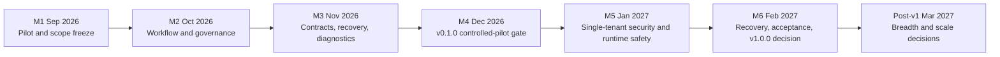

---
audience:
  - architect
  - decision-maker
  - developer
doc_type: strategy
product_area: strategy
stability: ga
summary: Monthly release train and one- or two-day implementation backlog for the current CALIBER codebase.
prerequisites:
  - Current-main capability matrix and first-mile evidence
  - A named single-tenant deployment owner and supported MLflow provider profile
reviewed_on: 2026-08-13
version_applicability: current main branch and GitHub Project #2
tags:
  - roadmap
  - monthly-release
  - execution
  - planning
---

# CALIBER roadmap

This is the execution roadmap for the current CALIBER repository and [GitHub
Project #2](https://github.com/rrahimi-uci/caliber-suite/projects/2). The
[v1.0.0 product requirements document](./prd.md) defines the product boundary,
requirements, and requirement-to-ticket trace; this document owns the delivery
sequence, dates, capacity, and release gates. It uses a
monthly release train and assumes **1.5 developers**: one primary engineering
stream plus a half-capacity stream for review, testing, documentation,
operations, and release work.

This document is a plan, not a capability claim. The current checkout is an
alpha/current-main build. A route, UI page, package, or passing unit test does
not make a capability supported production behavior. The release gates below
require reproducible evidence.

## Operating rules

- Every developer task is one or two days maximum. A task that grows beyond two
  days becomes a new child issue with its own title, acceptance criteria, and
  milestone.
- A workstream is a coordination issue, not an implementation task. Workstreams
  stay open while their child tickets are executed and reviewed.
- Each month has one primary stream and one half-capacity stream. Reserve the
  remaining capacity for review latency, regressions, pilot findings, release
  evidence, and operational interruptions.
- Monthly increments are releasable checkpoints. Formal product tags are
  created only at M4 (`caliber-v0.1.0`) and M6 (`caliber-v1.0.0`) after their
  gates pass.
- The first-mile pilot tests current `main`; it is not a production-readiness
  or stability claim.
- Every ticket must state exact scope, deliverables, acceptance criteria,
  verification commands, dependencies, and out-of-scope work.

## Current execution order



The controlling dependency is linear: pilot evidence selects the foundation
scope; the foundation makes the supported path repeatable; then the supported
single-tenant topology is hardened, operated, recovered, and accepted. A
controlled-pilot tag is not a v1 release; it is evidence for the remaining v1
work.

## v1.0.0 MVP boundary and critical path

`v1.0.0` is an enterprise-usable **single-tenant** product, not a feature
inventory or a technical demo. It supports one named, governed
prompt-refinement journey: a flagged MLflow trace is verified, diagnosed,
evaluated, explicitly applied by an authorized operator, released through a
durable intent, and either reconciled or rolled back with auditable evidence.
The journey is available through the documented UI and a deliberately small,
contract-tested API/SDK/CLI subset.

The supported deployment is one tenant, one active CALIBER process, a durable
PostgreSQL metadata store, a named MLflow tracking/profile dependency, object
storage where the selected path requires it, external TLS/ingress and network
policy, least-privilege service credentials, authenticated role-based users,
backup/restore evidence, logs/traces/metrics/readiness, and a human-operated
incident and upgrade procedure. The final workload envelope is measured and
published; it is not inferred from a test count.

This deliberately excludes multi-tenancy, SSO/SCIM, HA or active-active
workers, multi-region disaster recovery, managed hosting, general-purpose
untrusted tool/MCP execution, every asset family's lifecycle, and unmeasured
horizontal scale. Those are post-v1 decisions. A second process must be
rejected or API-only until a later ownership/broker design is implemented.

| Phase | Critical path | Issues | Exit evidence |
| --- | --- | --- | --- |
| **M1 · Scope** | Freeze the supported tenant, journey, dependency/provider profile, and acceptance evidence | #100–#101; #153; #154 | Approved contract, capability truth, fixture, and release-blocker rules |
| **M2 · Foundation** | Make the canonical prompt-refinement/release path durable and demonstrable | #102–#107; #152 | Reproducible workflow, explicit release state, and external-effect reconciliation |
| **M3 · Contracts** | Make the path diagnosable and supportable through agreed interfaces | #108–#116; #151 | API/SDK/CLI contract, failure taxonomy, correlation, readiness, and worker decision |
| **M4 · Controlled pilot** | Produce a clean, packaged, internal pilot release and close foundation defects | #117–#121; #129 | Controlled-pilot evidence and a decision to enter v1 hardening; not a v1 claim |
| **M5 · v1 hardening** | Enforce the single-tenant security/runtime/deployment boundary | #122–#125; #130–#135; #157–#159 | Unsafe configuration refused, one active owner, bounded workload, and recoverable topology |
| **M6 · v1 acceptance** | Rehearse recovery, run the acceptance matrix, and make the v1.0.0 decision | #136–#142 | Restore/rollback and operator evidence, no unaccepted P0/P1, human go/no-go |


## Monthly release train

| Month | GitHub milestone | Release/checkpoint | Scope | Exit evidence |
| --- | --- | --- | --- | --- |
| **M1 · Sep 2026** | `M1 2026-09 — First-mile pilot and scope freeze` | Current-main pilot checkpoint | Epic [#78](https://github.com/rrahimi-uci/caliber-suite/issues/78), discovery #100–#101, #153, #154 | Environment record, feature results, reproducible bugs, capability matrix, and selected M2 scope |
| **M2 · Oct 2026** | `M2 2026-10 — Primary workflow and governance` | Foundation increment | Workstreams #102–#107; #152 | One seeded workflow is reproducible through UI and API/SDK; release and environment semantics are explicit |
| **M3 · Nov 2026** | `M3 2026-11 — API contracts, recovery, and diagnostics` | Automation/operations increment | Workstreams #108–#116; #151 | Supported API/SDK/CLI matrix, bounded failure semantics, request correlation, and readiness diagnosis |
| **M4 · Dec 2026** | `M4 2026-12 — v0.1.0 release candidate` | Controlled-pilot decision | Workstream #117–#121; #129 | Clean build/package, pilot evidence, no unaccepted pilot blocker, and human decision to begin v1 hardening |
| **M5 · Jan 2027** | `M5 2027-01 — v1 security and process safety` | v1 single-tenant hardening | Workstreams #67–#70; #122–#135; #157–#159 | Unsafe defaults rejected, one active loop owner, bounded concurrency, explicit backup inventory, and supported deployment profile |
| **M6 · Feb 2027** | `M6 2027-02 — v1 performance, recovery, and release` | Formal `caliber-v1.0.0` decision | Workstreams #70–#71; #136–#142 | Measured workload limits, restore/rollback drill, acceptance packet, production-like bug bash, and human go/no-go |
| **Post-v1 · Mar 2027** | `Post-v1.0.0 — 2027-03 review` | Decision checkpoint, not a committed release | Epic #58; workstreams #73–#75; tasks #143–#149 | Demand/evidence-based decisions for identity, lifecycle/plugins, managed hosting, and scale |

## Epic and workstream structure

### M1 pilot — Epic #78

M1 is discovery only: use one environment to validate the prompt-refinement
journey, fixture assumptions, evidence format, and capability boundary. Record
pass/fail/blocked/not-supported results, exact commands, and reproducible
defects, then use #100–#101 to establish capability truth and triage rules.
M1 does not commit the team to implementing the broader pilot journey inventory
or to a production-readiness claim; if the discovery evidence is insufficient,
the implementation start moves rather than silently expanding scope.

### v0.1.0 foundation and controlled pilot — Epic #56

The foundation is coordinated through #59–#65, #76, and #66. The implementation
children are #100–#121, #129, and the attached #151–#154 decisions. The foundation is complete only when one
supported workflow is reproducible, the automation subset is honest, failure
and diagnostics behavior is actionable, and the clean deployment/release path
has evidence.

### v1.0.0 single-tenant safety and operations — Epic #57

This is part of the v1 critical path, not optional production expansion. It is
coordinated through #67–#71, #77, and Issue #72, with implementation children
#122–#125 and #130–#142 plus the attached deployment/recovery work. Any v1 decision requires
measured security, one-process ownership, workload, recovery, and operator
evidence; feature inventory or test count alone is insufficient. Broker-backed
multi-worker delivery is explicitly deferred unless #151 changes the supported
topology decision.

### Post-v1 decisions — Epic #58

Post-v1 work is deliberately small and decision-led. #143–#149 may produce
decision records, prototypes, or narrowly scoped internal seams. Treat the
10-person-day total as a discovery ceiling, not a commitment to complete all
seven tickets in March; start only the items justified by the M6 evidence.
None of these items can block M6 or be described as current supported product
behavior.

## Capacity model

The 1.5-developer assumption is a planning limit, not permission to run every
ticket in parallel:

| Capacity slice | Purpose | Monthly rule |
| --- | --- | --- |
| **Primary stream** | One critical workflow or safety outcome | One active workstream; pull its child tickets in dependency order |
| **Half stream** | Tests, docs, pilot triage, diagnostics, or small hardening | One active supporting workstream; never hide a second major behind it |
| **Reserve** | Review, regressions, release evidence, incidents | Protect this capacity every month; it is part of the plan |

At the start of each month, choose the next child ticket only after checking
the parent decision, code seam, fixture, test command, and dependency. At the
mid-month review, cut stretch work before cutting release evidence or safety
tests.

The implementation estimates currently assigned to executable tickets are:

| Milestone | Implementation tickets | Estimated effort | Capacity judgement |
| --- | ---: | ---: | --- |
| M1 | #100–#101; #153; #154 | 4 person-days plus the selected pilot journeys | Feasible only if #79–#99 are reduced to the canonical path and exploratory work does not block scope freeze |
| M2 | #102–#107; #152 | 10 person-days | Comfortable; reserve time for pilot-driven scope changes |
| M3 | #108–#116; #151 | 12 person-days | Feasible with a protected diagnostics/review stream |
| M4 | #117–#121; #129 | 9 person-days | Feasible only if the bug bash and decision remain release work, not feature expansion |
| M5 | #122–#125; #130–#135; #157–#159 | Re-estimate after #151 | This is the tightest phase. It cannot fit as written until broker work and duplicate deployment tickets are removed or deferred. |
| M6 | #136–#142 | Re-estimate after M5 | Feasible only after the topology, RPO/RTO, and workload envelope are concrete. |
| Post-v1 | #143–#149 | 10 person-days | Discovery ceiling; select a subset after #142 rather than committing all work |

## Codebase grounding

The ticket decomposition follows the current package and test boundaries:

| Capability | Implementation seams | Existing verification anchors |
| --- | --- | --- |
| Server and routes | `caliber/src/caliber/server.py`, `caliber/src/caliber/routes/` | `caliber/tests/test_routes_*.py`, contract smoke tests |
| Workflow runtime | `caliber/src/caliber/workflows/`, `caliber/src/caliber/orchestrator/` | workflow compiler/runtime/e2e tests |
| Release and governance | `caliber/src/caliber/release_operations.py`, `caliber/src/caliber/routes/releases.py`, `caliber/src/caliber/workflows/deploy_gate.py` | release, promoter, approval, and deploy-gate tests |
| Reliability and events | `caliber/src/caliber/events/`, worker/runtime modules, effect ledger | event sequencing, worker edge-case, retry, and effect-ledger tests |
| Observability | `caliber/src/caliber/observability/`, health, metrics, trace routes | readiness, logging, trace, metrics, and observability route tests |
| SDK and CLI | `sdk/caliber-sdk/`, `sdk/caliber-cli/` | SDK transport/resource/waiter and CLI tests |
| UI and pilot journeys | `caliber/caliber-ui/src/pages/`, Playwright configs, fixture pack | page tests, cookbook tests, focused Playwright journeys |
| Deployment and docs | `deploy/`, `scripts/ci-local.sh`, docs sync/build scripts | deployment, packaging, docs executable-spec, and CI gates |

## Release gates

### M1 exit

- MVP discovery evidence is captured and approved.
- The #153/#154 MVP contract is agreed and testable.
- #100 capability truth is established.
- #101 triage rules are documented and accepted.

### M4 `caliber-v0.1.0` controlled-pilot gate

- #102–#119 are complete or explicitly descoped with evidence.
- #129 and #120 have no untriaged P0/P1 release blocker.
- The clean-checkout build, deployment, docs, and rollback path is reproducible.
- #121 records a human go/no-go decision before any formal tag is published.

### M6 `caliber-v1.0.0` gate

- #122–#140 and the selected single-tenant deployment tickets provide dated
  security, process, performance, recovery, and acceptance evidence.
- #141 has no unaccepted P0/P1 blocker.
- #142 records a human go/no-go decision and publishes residual risks.
- The release notes state the measured supported envelope; they do not imply
  enterprise identity, managed hosting, multi-region, or unmeasured scale.

## Bug and feedback workflow

Testers use the labels `area-testing` and the applicable release label:

```text
release-v0.1.0 + area-testing   M1–M4 current release work
release-v1.0.0 + area-testing   M5–M6 production-gate testing
help wanted                     Optional volunteer/contributor attention
```

A bug report must include release commit, environment, fixture, exact steps,
expected result, actual result, logs/request ID, severity, and whether the
behavior is supported by the capability matrix. A test ticket records the
finding; it does not absorb the implementation fix.

## Success measures

- **M1 adoption:** all named pilot journeys have evidence and no untriaged
  critical finding.
- **M4 controlled pilot:** one supported workflow and automation path are
  repeatable from a clean checkout with truthful pilot notes.
- **M6 enterprise single-tenant MVP:** security, process ownership, measured
  workload, recovery, acceptance, deployment, and operator evidence support a
  human decision.
- **Post-v1 discipline:** deferred work is selected from production evidence and
  demand, not from the existence of an attractive architectural seam.

## Sources and current limitations

The [product completeness report](./reports/product-completeness-report.md),
the [pilot fixture pack](./reports/first-milestone-pilot-fixture-pack.md), the
package manifests, CI workflows, and the linked GitHub issues are the evidence
sources for this roadmap. Known limitations remain explicit: current-main is
alpha; the v1 target is a bounded single-tenant deployment, not a claim of
multi-tenant, HA, managed-hosting, multi-region, or broad asset-lifecycle
support.
