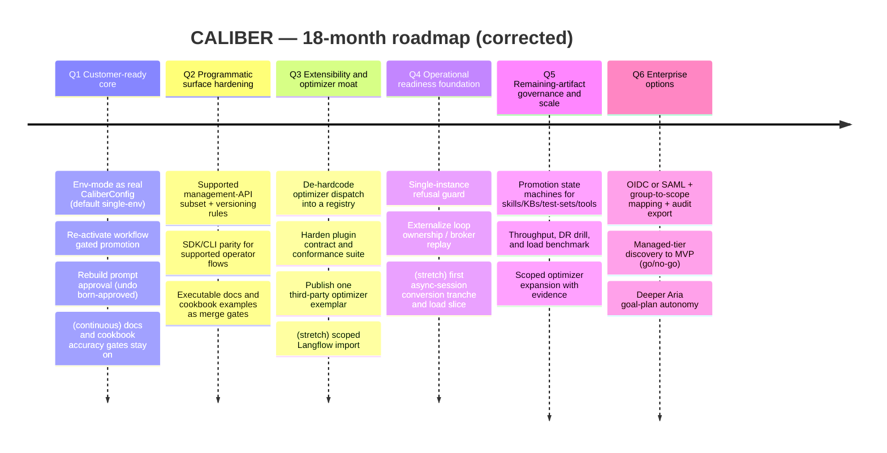
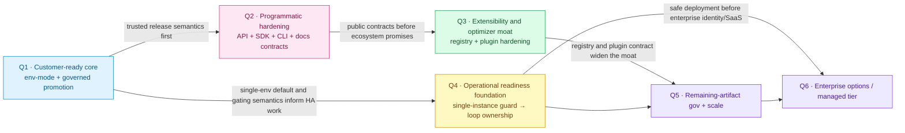

---
audience:
  - architect
  - decision-maker
doc_type: strategy
product_area: strategy
stability: ga
prerequisites:
  - Competitive analysis context
reviewed_on: 2026-08-10
version_applicability: current main branch docs contract
tags:
  - roadmap
  - strategy
  - planning
  - execution
---

# CALIBER — Roadmap

*A feasibility-grounded, quarter-by-quarter plan derived from the [competitive analysis](./competitive-analysis.md) and **verified against the actual codebase**. Built for a **two-person team — you (product/strategy lead) and me (AI pair-programmer)** — and scoped to what that team can realistically ship and, above all, *review*.*

> **Status:** planning snapshot, not a current capability reference. The original
> audit baseline found historical nine-optimizer claims; those claims have since
> been reconciled. As of 2026-08-10, five provider paths are implemented,
> automatic rules can choose four, explicit job/agent pins can reach all five, and
> the prompt form exposes two. The repo now also ships a served management
> OpenAPI document, searchable HTML REST and SDK docs, an alpha Python SDK
> (`caliber-sdk`), an alpha CLI (`caliber-cli`), and an experimental plugin SDK
> (`caliber-plugin-sdk`). Roadmap deliverables remain proposed until current code
> and release evidence prove them landed.

> **Current delta (2026-08-10):** prompt authoring is now non-live, and direct
> prompt promote/rollback uses an intent-first, idempotent release-operation row
> with exact before/after versions, optimistic concurrency, incomplete-operation
> locking, and operator-triggered reconciliation. The docs site now publishes the
> SDK, REST API, cookbook, and architecture surfaces as tested searchable HTML.
> This is meaningful delivery, but not completion of the customer-ready arc:
> requester/approver separation, enforced human sign-off, configurable
> multi-environment promotion, and production-stable operator contracts remain
> proposed work.

> **This roadmap was adversarially critiqued against the code before publication** (three skeptic passes: feasibility-vs-architecture, competitive-alignment, capacity). Several first-draft assumptions turned out to be wrong — most importantly that human-approval governance was merely "dormant." The corrections are recorded in **[§12 Feasibility review](#12-feasibility-review)**; the plan below is the corrected version.
>
> **Planning unit.** One quarter = 3 months. Q1–Q4 are committed and detailed; Q5–Q6 are directional bets re-committed at the H1 review. Quarters are relative (start = "next quarter"), not fixed calendar dates.
>
> **Grounding rule.** Every deliverable names the architectural seam it builds on. Where a "seam" is only a docstring or a UI constant (not working code), it is marked 🌱 *green-field* and sized as new work — because pretending otherwise is exactly the "docs outrun code" failure this roadmap exists to cure.

---

## TL;DR

CALIBER's wedge is real but narrow: an open-source, self-hosted, MLflow-integrated control plane that connects policy-selected optimization, evaluation evidence, human action, audit, and asset-specific rollback beside a multi-asset registry with native graph-RAG. The current gate and lifecycle contracts are still not uniform across assets, and the newly shipped SDK/CLI/docs surfaces are ahead of the platform's production-readiness story. The analysis showed the wedge is thinly populated but narrowing as MLflow and cloud platforms absorb the primitives.

The corrected plan does four things, in priority order:

1. **Convert the current feature-rich alpha into a customer-ready core** (Q1) — make environment mode real configuration, restore governed promotion where the architecture already has seams, and rebuild prompt approval where it does not.
2. **Harden the programmatic and documentation surface that already exists** (Q2) — turn the served API, SDK, CLI, and searchable docs from "present" into "safe to automate against," with explicit support boundaries and contract tests.
3. **Deepen extensibility and the optimization moat** (Q3) — de-hardcode optimizer dispatch, harden the experimental plugin contract, and let integrations grow through a real extension path rather than hand-built adapters.
4. **Then attack operations and scale** (H2) — fix loop ownership, throughput, DR, the remaining artifact-governance gaps, and the enterprise/managed tier decisions.

| Quarter | Theme | Committed majors (2 + tax) | Answers |
|---|---|---|---|
| **Q1** | Customer-ready core | Env-mode as real config · Governed promotion for **workflows (re-activate) + prompts (rebuild)** | single-env v1; born-approved prompt path; release trust |
| **Q2** | Programmatic surface hardening | Supported management-API subset + stability policy · SDK/CLI/docs hardening with executable examples | repeatable automation; operator confidence |
| **Q3** | Extensibility & optimization moat | **De-hardcode optimizer dispatch** · harden the experimental **Plugin SDK** + one real third-party exemplar | MLflow encroachment; community leverage |
| **Q4** | Operational readiness foundation | Single-instance refusal guard · externalize loop ownership / broker replay | safe deployment; real HA path |
| **Q5** | Remaining-artifact governance + scale | Promotion for skills/KBs/test-sets/tools · throughput/DR/load proof · scoped optimizer growth | unified lifecycle; scale proof |
| **Q6** | Enterprise options | OIDC/SAML/SCIM + audit export · managed-tier discovery → MVP (go/no-go) · deeper Aria | enterprise buying friction; optional SaaS |

> **Two claims this roadmap deliberately does *not* make** (corrected from the draft): governed promotion exists for **1** artifact in the roadmap's audited baseline (workflows), not 6; and "a management surface exists" does **not** mean "a production-stable operator contract exists." The SDK/CLI/API are real and useful, but they are not yet the end of that story.

---

## 1. Guiding strategy (from the competitive analysis)

- **Own the wedge; don't chase breadth.** Position the current product as an *evidence-backed, self-hosted refinement and governance control plane for teams on MLflow*; make unbypassable governed promotion a roadmap outcome, not a present-tense blanket claim. It is not a builder, automation hub, or BPM engine.
- **Bet the moat on what MLflow structurally won't build.** MLflow is a library/toolkit; it is unlikely to ship an opinionated **human-approval UI + cross-artifact release control room + a native graph store**. Those — plus **sovereign/air-gapped** deployment (a self-hosted MLflow shop *cannot* adopt Databricks-hosted governance) — are the least-copyable arcs. Invest there; treat MLflow as substrate (contribute upstream opportunistically).
- **Fund the differentiators the draft ignored.** Native **graph-RAG** (no MLflow/Vertex/Azure answer) and **sovereign/air-gap** (the analysis's #2 recommended segment) were named as moats but unfunded in the first draft — they are now first-class.
- **Neutralize named weaknesses on schedule** and **interoperate above the builders** (Plugin SDK + scoped import) rather than hand-maintaining fragile adapters.

---

## 2. How we work — the two-person operating model

Sized for **one human lead + one AI pair-programmer**. The AI implements fast, which **moves the bottleneck onto the human**: every PR is reviewed by one person, and every product/architecture/security decision and external conversation is serial, human-only work that the AI cannot parallelize. So we budget **human-serial load**, not deliverable count.

| Role | Owns |
|---|---|
| 🧑 **You (human lead)** | Product & strategy, prioritization, architecture & security sign-off, benchmark protocol, **PR review + merge authority**, community, and all design-partner/partnership conversations. |
| 🤖 **Me (AI pair)** | Implementation, tests, migrations (under review), docs, competitive/MLflow tracking, workflow orchestration, RFC drafting. |
| 🤝 **Pair** | Hard architecture, risky refactors, governance semantics, incident response, re-planning. |

**Capacity rules (revised after the capacity critique):**
- **≤ 2 *committed* majors per quarter + 1 stretch.** The former "3 majors" cap counted deliverables, not human load, and hid over-commitment.
- **Reserve ~1 major's worth of human capacity every quarter** for the unglamorous tax: PR-review latency, migrations & backward-compat, flaky-test triage, and the continuous tracks (§9). It is written into each quarter's exit criteria so it actually happens.
- **≤ 1 external/irreversible item per quarter** (one upstream PR *or* one public-SDK freeze *or* one design-partner negotiation — never two). These don't parallelize and their timelines aren't ours to control.

**Cadence:** kickoff (pick the 2 majors + stretch, write exit criteria) → weekly small-PR loop → mid-quarter checkpoint (cut to protect the majors) → end-of-quarter review → re-plan.

---

## 3. Timeline

**Dependency logic (why this order):**

Note the **Q2 → Q3 edge**: the SDK, CLI, served OpenAPI, and searchable docs
already exist, so Q2 is about freezing a supported automation contract. Only
after that is it reasonable to widen the ecosystem promise in Q3.

---

## 4. Q1 — Customer-ready core  *(verdict: highest leverage — finish the release story before adding breadth)*

**Why.** The docs, API pages, SDK pages, cookbook gallery, and generated HTML now
present a materially larger product surface than the platform supported a month
ago. That is useful, but it also raises the bar: the next customer question is
not "can I click through it?" but "can I trust promotion, review, and rollback
semantics enough to put this in front of a real team?" The highest-leverage work
is therefore the customer-ready core: multi-environment semantics as real config,
workflow gating turned back on, and prompt approval rebuilt rather than implied.

| # | Deliverable | Owner | Grounding (verified) | Exit criteria | Effort/Risk |
|---|---|---|---|---|---|
| 1.1 | **Env-mode as real config.** Add `CaliberConfig.environment_mode`; thread it through workflow promotion and prompt discovery; expose it in the UI; preserve single-env as the default with a migration and compat tests. | 🤝 Pair | `workflows/promoter.py:GATED_ALIASES`; `routes/prompts.py:_PROMPT_DISCOVERY_ALIASES`; `caliber-ui/src/lib/environment.ts`; `config.py` | Instances toggle single↔multi-env by config, single-env default preserved, compat suite green | M / **High** |
| 1.2 | **Governed promotion for workflows + prompts.** Workflows: re-activate the existing promotion/approval state machine. Prompts: rebuild a real pending→approve→reject flow instead of the born-approved shortcut. | 🤝 Pair (design), 🤖 impl | workflows: `routes/workflow_deployments.py`, `workflows/promoter.py`; prompts: `apply.py`, `release_operations.py`, `routes/releases.py`, `CaliberApprovalRequest` | A candidate moves dev→staging→prod with eval gate, human sign-off, and audited rollback for workflows and prompts | L / **High** |
| 1.3 | **Docs and release-contract truthfulness stay enforced.** Keep the current searchable HTML docs, cookbook examples, and sync pipeline under executable-spec tests while Q1 changes land. This is tax budget, not a new product bet. | 🤖 AI-led | `docs-site/build-docs.mjs`; `caliber/caliber-ui/scripts/sync-docs.mjs`; `caliber/tests/test_docs_generation_contract.py`; `caliber/tests/test_docs_executable_spec_contract.py` | Docs, generated HTML, and examples continue to match the live code after governance changes | S / Med |
| 1.4 | *(stretch)* **Prompt review UX and separation-of-duties polish.** Once 1.2 records author/requester metadata, enforce approver ≠ author and lift the releases room to the newly governed prompt path. | 🤖 AI-led | `auth.py` scopes; `routes/releases.py`; prompt release history | Approver ≠ author enforced; prompt releases readable in one operator flow | M / Med |

**Committed majors:** 1.1 + 1.2. **Hygiene (tax budget):** 1.3. **Stretch:** 1.4.
**Q1 exit:** governed `dev→staging→prod` semantics are real for workflows and prompts, single-env remains the safe default, and the public docs continue telling the truth while the release model changes underneath them.

---

## 5. Q2 — Programmatic surface hardening  *(verdict: necessary correction — the surface exists, now make it dependable)*

**Why.** The repo now serves an OpenAPI document, publishes REST pages, ships a
typed SDK, ships a CLI, and renders cookbook examples into GitHub Pages. The
remaining gap is not invention; it is supportability. A customer-ready
integration surface needs explicit support boundaries, compatibility rules,
idempotent operator flows, and examples that fail the build if they drift.

| # | Deliverable | Owner | Grounding (verified) | Exit criteria | Effort/Risk |
|---|---|---|---|---|---|
| 2.1 | **Define the supported management-API subset and stability policy.** Freeze which route families are GA for automation, which remain beta, and how versioning, deprecation, and backward-compat will be signaled. | 🤝 Pair | `routes/openapi.py`; served `/openapi.json`; `docs/api/*.md`; `sdk_stability` on `/capabilities` | One support matrix names the operator-safe contract and the rule for changing it | M / Med |
| 2.2 | **Harden SDK/CLI coverage for the supported operator flows.** Keep the SDK and CLI thin over the served API, close wrapper gaps on the chosen GA subset, and make waiters/errors/examples the authoritative path for automation. | 🤝 Pair | `sdk/caliber-sdk/src/caliber_sdk/resources/*`; `sdk/caliber-cli/src/caliber_cli/*`; examples and tests | A normal operator script can authenticate, scope, inspect capabilities, drive workflow/release/cookbook flows, and handle failures without dropping to raw SQL or undocumented HTTP | M / Med |
| 2.3 | *(stretch)* **Idempotency, request-id, and dry-run parity on mutating paths.** Apply one consistent policy to the supported operator routes and document it in REST + SDK docs. | 🤖 AI-led | route families under `caliber/src/caliber/routes/`; transport/error layers in SDK | Supported write paths expose repeatable automation semantics, not just happy-path CRUD | M / Med |
| 2.4 | **Executable documentation stays a release gate.** The HTML site, REST pages, SDK reference, cookbook pages, and generated examples remain CI-validated while Q2 changes land. | 🤖 AI-led | docs build/sync pipeline; cookbook example tests; docs contract tests | Public docs remain safe to copy from while the contract hardens | S / Low |

**Committed majors:** 2.1 + 2.2. **Stretch:** 2.3. **Tax budget:** 2.4.
**Q2 exit:** the programmatic surface is not just present; it is supportable. Operators know which API/SDK/CLI paths are stable, examples stay executable, and automation no longer depends on reverse-engineering UI traffic.

---

## 6. Q3 — Extensibility & optimization moat  *(verdict: build on the now-hardened surface, not before it)*

**Why.** The repo already contains the first version of a plugin contract and the
current docs already teach developers how to use it. What is missing is the seam
behind it: optimizer dispatch is still hard-coded, and the experimental contract
has not yet survived a release with a real third-party-style implementation.
Extensibility becomes a moat only after the supported operator contract exists,
not before.

| # | Deliverable | Owner | Grounding (verified) | Exit criteria | Effort/Risk |
|---|---|---|---|---|---|
| 3.1 | **De-hardcode optimizer dispatch into a registry.** Preserve the current five implemented paths, keep the automatic-vs-explicit story honest, and move selection off the hard-coded tuple so plugins have a real extension seam. | 🤝 Pair | `llm/openai_agents.py`; `orchestrator/optimizer_select.py`; calibration UI | Optimizers are dispatched via a registry; all current paths remain reachable; the policy for automatic vs explicit selection is documented | M / Med |
| 3.2 | **Harden the experimental plugin SDK.** Keep the allowlist and capability-reporting model, expand conformance tests, and publish one real third-party-style optimizer exemplar that installs without editing CALIBER. | 🤝 Pair | `sdk/caliber-plugin-sdk`; capabilities extensibility block; plugin docs/tests | A third party can add an optimizer via package + allowlist + conformance suite, and the operator can see what is installed and active | M / **High** |
| 3.3 | *(stretch)* **Scoped Langflow import or one new optimizer path.** Only after 3.1 lands: either prove a compilable happy-path import, or add one new optimizer with measured evidence rather than taxonomy-only claims. | 🤖 AI-led | `compile_workflow`; import seams; optimizer modules | One ecosystem expansion path is real and documented, not aspirational | M / Med |
| 3.4 | **Cookbook and exemplar adoption assets.** Keep the docs-site cookbook gallery and SDK cookbook counterparts aligned with the extension story so community examples teach the supported path. | 🧑 leads, 🤖 drafts | `docs-site/cookbooks`; `docs/sdk/cookbooks.md`; SDK examples | Extension and integration examples point at the actual contract that shipped | S / Low |

**Committed majors:** 3.1 + 3.2. **Stretch:** 3.3. **Tax budget:** 3.4.
**Q3 exit:** the plugin story has a real underlying seam, the extension contract is still conservative but credible, and the public examples teach the supported way to extend CALIBER rather than a one-off implementation detail.

---

## 7. Q4 — Operational readiness foundation  *(verdict: this is where “good product” starts becoming “supportable system”)*

**Why.** The production-readiness section below still calls out the same core
blocking facts: loop ownership is process-local, HA/DR has no proved path, and
the server still carries a large synchronous-session ceiling inside async
handlers. Those are not cosmetic gaps. They define whether a customer can run
the system safely, and they come before broader enterprise packaging.

| # | Deliverable | Owner | Grounding (verified) | Exit criteria | Effort/Risk |
|---|---|---|---|---|---|
| 4.1 | **P0 single-instance refusal guard.** Make the single-writer assumption explicit at startup so a second replica refuses to run owned loops instead of silently double-firing them. | 🤝 Pair | lifespan loop registration; startup hooks; operations docs | Scaling to two replicas fails loudly and explainably rather than corrupting quietly | S / Low |
| 4.2 | **P1 externalize loop ownership / broker replay.** Move the loop-ownership story out of one process so two instances can coexist without double-running schedulers and reconcilers. | 🤝 Pair | event bus; dead-letter path; loop/reconciler seams | Two instances can run without duplicate loop ownership; replay model is durable rather than best-effort | XL / **High** |
| 4.3 | *(stretch)* **First async-session conversion tranche + load slice.** Start removing the synchronous-session ceiling from the highest-value route families and publish one bounded throughput number. | 🤖 AI-led | async handlers and SQLAlchemy session hotspots | The load conversation is based on a measured ceiling, not guesswork | L / Med |
| 4.4 | **Runbook and readiness docs stay honest.** Update the operator-facing docs alongside the platform changes so the public site never implies HA or throughput properties that the code has not proved. | 🤖 AI-led | `docs/runbook.md`; operate docs; docs contract tests | Operational docs match the actual deployment model at each step | S / Low |

**Committed majors:** 4.1 + 4.2. **Stretch:** 4.3. **Tax budget:** 4.4.
**Q4 exit:** CALIBER has a credible path from single-instance alpha to supportable deployment: replica misconfiguration is checked, loop ownership is no longer accidental, and the operator docs match the deployment truth.

---

## 8. H2 (Q5–Q6) — directional bets

Re-committed at the H1 review. **Q5 is intentionally the overflow catch-basin**
for work pushed out of Q3/Q4 (remaining-artifact governance, throughput, DR,
scoped optimizer growth) — it will itself need scoping at H1, not treated as
free.

- **Q5 · Remaining-artifact governance + scale.** Build promotion/rollback state machines for **skills, KBs, test-sets, tools** (four asset-specific implementations that make "6-artifact governance" real alongside prompts and workflows); continue the async-session and throughput work; run a **DR rehearsal** with stated RPO/RTO; and publish a bounded load benchmark.
- **Q6 · Enterprise options.** Add OIDC/SAML SSO, SCIM or equivalent provisioning, group-to-scope mapping, and audit export for customers who need enterprise identity; in parallel, run the human-led **managed-tier discovery→MVP** go/no-go. Also deeper Aria goal-plan autonomy; reference case studies.
- **Sovereign/air-gap** stays important, but its priority now follows Q1–Q4 truth: first fix governance, contracts, and loop ownership; then package the deployment shapes those changes made real.

---

## 9. Cross-cutting continuous tracks (budgeted, not free)

These consume the reserved ~1-major/quarter capacity:

- **MLflow watch (threat #1)** *and* **up-stack competitor watch (Langfuse/ClickHouse, Dify)** — with pre-committed triggers (see the contingency box in §12).
- **Design-partner pipeline** — human-led, runs from **Q1** so a reference customer can land by Q3–Q4, not Q6.
- **Upstream MLflow contribution** — opportunistic (open PRs; don't gate quarters on their review).
- **Security & dependency hygiene**; **docs=code** and **examples=code** (the current docs contract and cookbook example suites stay merge gates); **community & issue triage**.
- **The tax:** PR-review latency, migrations/backward-compat, flaky-test triage.

---

## 10. Non-goals (scope discipline)

We will **not**, in this horizon: become a general automation tool (n8n) or BPM engine (Flowable); chase a 400+ connector catalog; build a rival visual builder (we import from + extend them); or host models ourselves. Saying no here is what makes the "yes" list survivable for two people.

---

## 11. Success metrics

| Theme | Leading metric | Target |
|---|---|---|
| Customer-ready core | artifacts with governed multi-env promotion | **workflows + prompts** (Q1) |
| Programmatic surface | supported API tags; SDK/CLI parity; executable examples | explicit GA/beta matrix; no unsupported examples on the public site |
| Extensibility moat | optimizers *selectable*; dispatch pluggable; plugin conformance | registry shipped; ≥1 third-party-style exemplar; taxonomy growth only with evidence |
| Operational readiness | replica safety; loop ownership; throughput ceiling | P0 checked; P1 underway/landed; one published load number |
| Unified lifecycle | governed asset families | workflows + prompts (Q1) → all 6 (Q5) |
| Enterprise options | identity + managed-tier decision | identity plan landed; managed-tier go/no-go made explicit |

---

## 12. Feasibility review

*This section records the adversarial critique (three skeptic passes against the code and the competitive analysis) and what it changed. The plan above is already the corrected version.*

**A. Baseline movement since the first draft (now incorporated):**

1. **The management surface is no longer missing.** The repo now ships a served management OpenAPI document, REST docs, a typed Python SDK, and a CLI. → the roadmap changed from "build an API/CLI/SDK" to **harden and freeze the supported contract**.
2. **The plugin story is no longer hypothetical.** `caliber-plugin-sdk` exists, but it is explicitly experimental/pre-alpha and still sits behind a hard-coded optimizer dispatch. → Q3 is now about **hardening the existing contract and the seam behind it**, not inventing the idea.
3. **"Approval governance is dormant" was wrong for prompts.** `CaliberApprovalRequest` is a *born-approved* provenance anchor — human-feedback approval was removed. It is genuinely dormant only for **workflows**. → governed promotion moved to **Q1** as the first customer-ready-core bet.
4. **`SINGLE_ENVIRONMENT` is a UI constant, not config.** → environment mode remains real work across prompt and workflow paths, not a flag flip.
5. **The public docs have outgrown the old roadmap ordering.** Searchable HTML docs, cookbook pages, SDK reference pages, and REST API pages are already published. → docs are now an always-on contract gate, not the headline deliverable.
6. **Operational blockers still dominate production readiness.** Single-instance loop ownership, HA/DR, and synchronous DB-session ceilings remain structurally more important than adding more surface area. → operational readiness moved ahead of enterprise packaging.

**B. Capacity corrections:** committed majors stay at **2 (+1 stretch)**; **~1 major/quarter remains reserved** for the tax; **≤1 external/irreversible item/quarter** still stands; and the new ordering explicitly avoids doing public ecosystem promises before operator contracts and governance are stabilized.

**C. Strategic gaps closed:** the roadmap now explicitly distinguishes **current shipped surfaces** (SDK, CLI, plugin SDK, REST docs, searchable HTML docs) from **supported contracts**; it keeps **graph-RAG**, **sovereign/on-prem**, and the **design-partner pipeline** in scope, but only after the nearer governance and operations work stops the product story from outrunning the system.

**D. MLflow contingency (pre-committed pivots for the #1 threat):**

> - **If MLflow ships gated promotion** (our Q1 arc): our differentiation becomes UX + breadth + sovereignty. Pivot the next governance quarter toward **unified multi-artifact** promotion (MLflow governs prompts/models, not skills/KBs/test-sets/tools/workflows) and **air-gapped governance** for shops that can't use hosted MLflow. The single→multi-env work stays valuable; the "we invented governed promotion" framing dies quietly.
> - **If MLflow ships diagnosis-driven selection** (our Q3 arc): pivot to selection **quality**, to **multi-agent / skill** optimization (MultiAgentCoord, SkillMetaPrompt — MLflow has no "skill" artifact), and accelerate **graph-RAG**, which MLflow has no answer for.
> - **In both cases:** accelerate the two arcs with *no* MLflow answer — **graph-RAG and sovereign/air-gap**.

**E. Residual risks we accept:**
- **Three consecutive higher-risk quarters (Q1–Q3).** Mitigation: Q1 and Q2 may be run as a combined block if the prompt-governance rebuild or contract-freeze work overruns; quarter boundaries are planning aids, not contracts.
- **Extensibility before stability pressure.** The product now visibly has an SDK, CLI, and plugin SDK, so there will be pressure to widen them faster than they can be supported. The roadmap explicitly resists that.
- **Q5 overflow:** acknowledged; re-scoped at H1 rather than assumed free.
- **Import treadmill:** mitigated by letting the Plugin SDK carry community-built importers instead of hand-maintaining adapters.

---

## 13. How this maps to the competitive analysis

| Competitive-analysis finding | Roadmap response |
|---|---|
| Weakness: "docs outrun the code" | Q1–Q2 keep docs, generated HTML, SDK examples, and cookbook examples under executable-spec tests while the contract changes |
| Weakness: unproven production posture | Q4 P0/P1 work, then Q5 throughput/DR proof |
| Weakness: single-environment v1 | Q1 env-mode config + governed promotion (workflows re-activate, prompts rebuild) |
| Weakness: narrow ecosystem / community cold-start | Q3 plugin-contract hardening + one real third-party-style exemplar; design-partner pipeline from Q1 |
| Weakness: self-host adoption barrier | governance and operational truth first; sovereign/air-gap packaging follows those fixes; managed SaaS stays a gated Q6 bet |
| Threat #1: MLflow absorbs the loop | Continuous MLflow watch + **pre-committed pivots (§12.D)** + moat on the arcs MLflow won't build |
| Threat #2: Dify/Langfuse move up-stack | **New** up-stack competitor watch + trigger (§9) |
| Threat #4/#6: cold-start & consolidation | Q1 design-partner pipeline; the independence/extension story stays attached to Q3 once the contract is real |
| Differentiators to deepen (diagnosis-driven multi-optimizer, HITL governance, **graph-RAG**, unified lifecycle, **sovereign**) | Q1 (governance), Q3 (optimizer + plugin seam), Q5 (unified 6-artifact + scale), sovereign packaging after Q4 truth work |

---

## 14. Production readiness — what "supported production" actually requires

*Added 2026-08-08. §1–§13 above are a **product** roadmap: what CALIBER should be
able to do. This section is the **engineering readiness** plan, and it exists
because every completeness review to date has closed on the same verdict —
feature-rich Alpha, credible for a controlled technical pilot, not ready for
supported production — without anywhere naming, in dependency order, what would
change it.*

> **Grounding rule applies here too.** Nothing below is claimed as partially
> built. Each phase names the seam it builds on and what it does **not** prove,
> because a readiness plan that overstates its own progress is the failure mode
> it exists to prevent.

### 14.0 What actually blocks it

Six things, and they are not independent:

| # | Blocker | Why it blocks *supported* production |
| --- | --- | --- |
| B1 | **Single-instance by construction** | Nine background loops start in the server lifespan. Two replicas run nine more, and nothing arbitrates ownership — so the scheduler double-fires, the reconciler races itself, and the janitor competes with a copy. |
| B2 | **No HA/DR position** | No leader election, no documented RPO/RTO, no restore drill. "Highly available" is currently a deployment topology nobody has attempted, not a feature that is missing. |
| B3 | **Throughput ceiling** | 224 synchronous SQLAlchemy sessions opened directly in async handlers (F-11). Each one parks an event-loop thread; the ratchet holds the line but does not move it. |
| B4 | **Management surface exists but is not yet production-stable** | There is now a served management OpenAPI document, REST docs, an alpha SDK, and an alpha CLI. The blocker is no longer existence; it is contract hardening: explicit support boundaries, idempotent operator semantics, dry-run/versioning policy, and backward-compat rules. |
| B5 | **No enterprise identity** | Session auth with a header-trusted development mode. No OIDC/SAML, no SCIM provisioning, no group-to-scope mapping, no audit export. |
| B6 | **Deferred halves of closed findings** | F-04's trace visibility, F-10's broker replay, F-12's lexical fusion, F-02b's cancellation propagation. Each is a scoped remainder, not an oversight — but B2 depends on F-10. |

The dependency that matters: **real HA (B2) is gated on P1/F-10.** P0 can make
the single-instance assumption explicit, but it does not make a second replica
safe. Externalising the loops needs somewhere durable to put the work, which is
the broker-replay half of F-10. Doing HA before that produces a second process
that loses jobs faster.

### 14.1 Phase P0 — make the single-instance constraint *checked* rather than assumed

The cheapest and most valuable step, and it ships no HA at all.

Today nothing stops an operator scaling the deployment to two replicas, and
nothing tells them what will happen. P0 converts an undocumented assumption into
an enforced one: a startup-time single-writer claim (an advisory lock or a
lease row), so a second instance refuses to start its loops and says why,
rather than silently double-running them.

- **Builds on:** the existing lifespan loop registration, already enumerated by
  `gen_stats.py` via AST.
- **Proves:** that scaling out is refused loudly instead of corrupting quietly.
- **Does not prove:** anything about availability. A refused second replica is
  still one replica.
- **Size:** S. This is the F-08 move — turn a silent downgrade into a refusal.

### 14.2 Phase P1 — externalise loop ownership (the real HA gate)

Give the nine loops an owner that survives a process. Two credible shapes:
lease-based leader election with the loops running only on the leader, or moving
each loop's work onto the durable queue and letting any instance drain it.

The second is strictly better and strictly more expensive, and it is the same
work as **F-10's broker replay** — which is why F-10 is on this critical path
rather than filed as a nice-to-have.

- **Builds on:** the event bus, the dead-letter path landed for F-10, and the
  reconciler's existing refusal to guess (it settles only what it can prove).
- **Proves:** two instances can run without double-firing.
- **Does not prove:** that failover is fast, or that in-flight work survives it.
  That is P3.
- **Size:** XL. This is the single largest item on the list.

### 14.3 Phase P2 — remove the throughput ceiling

F-11's 224 synchronous sessions, ~30 files. Mechanical, and the target pattern
already exists in-tree, so this is volume rather than design risk. Pair it with
connection-pool sizing and a published load number — the roadmap's §11 already
commits to "queued-run throughput / KB corpus at stable latency."

- **Proves:** the process does not fall over under concurrent load.
- **Does not prove:** correctness under concurrency. That is P1's job, and doing
  P2 first would make the concurrency bugs *easier to hit* without making them
  detectable.
- **Size:** L. Sequenced after P1 deliberately.

### 14.4 Phase P3 — DR, stated as numbers

An RPO and an RTO, a backup and restore procedure, and — the part usually
skipped — a **rehearsed restore** whose result is recorded. The operations
runbook (`docs/runbook.md`) is the right home; it already documents the three
recoveries the platform deliberately will not perform alone.

- **Proves:** a stated recovery objective has been met at least once.
- **Does not prove:** that it will be met under real failure conditions. An
  unrehearsed DR plan and a rehearsed one differ by exactly one datum.
- **Size:** M, and cheap relative to its value.

### 14.5 Phase P4 — harden the management surface that already exists

The repo has already crossed the first threshold: the management API is served,
documented, and wrapped by both an SDK and a CLI. P4 is therefore not "invent
the surface." It is "declare the supported subset, keep the CLI/SDK thin over
that surface, and make the automation semantics safe enough to support."

- **Builds on:** served `/openapi.json`; `docs/api/*`; `sdk/caliber-sdk`;
  `sdk/caliber-cli`; `/capabilities` stability metadata.
- **Proves:** operations are scriptable, repeatable, and named as either
  supported or not-yet-supported.
- **Does not prove:** that every internal route is safe to automate against, or
  that enterprise identity and HA are solved. Those remain P5 and P1–P3.
- **Size:** M for contract freezing and route-policy work; M for CLI/SDK
  hardening over that supported subset.

### 14.6 Phase P5 — enterprise identity

OIDC/SAML SSO, SCIM provisioning, group-to-scope mapping, and audit export.
Deliberately last: it is the least architecturally entangled of the six and the
most likely to be driven by a specific customer's requirements, so building it
speculatively risks building the wrong one.

- **Size:** L. Gated behind P4, because SCIM without a management API is a
  bespoke integration rather than a feature.

### 14.7 What this section is not

It is **not** a schedule. No dates, because the two-person capacity model in §2
makes P1 alone a multi-quarter item and pretending otherwise would put this
document in the same category as the claims §12 had to retract.

It is also not a claim that the phases are all underway. At the time of writing,
**P4 has started in alpha form** (served API + SDK + CLI + docs), while P0–P3
and P5 remain largely ahead. The honest summary is that the readiness gap is
not a quality problem — the suite is green on the remote across the current CI
gates — it is a category problem: CALIBER is a well-tested single-instance
application with growing operator surfaces, and supported production means being
a different kind of system.
