---
audience:
  - decision-maker
  - architect
  - developer
  - operator
doc_type: concept
product_area: governance
stability: experimental
summary: Visual user stories for workspace, RBAC, resource ownership, environment promotion, and operations in CALIBER.
prerequisites:
  - Read ARCHITECTURE.md for the current control-plane and lifecycle model.
  - Read docs/prd.md for the current single-tenant product boundary.
reviewed_on: 2026-09-08
version_applicability: current main at 94bffc1108; the Workspace and multi-environment model is proposed, not an implemented capability
tags:
  - workspace
  - user-stories
  - RBAC
  - environments
  - governance
---

# CALIBER user stories

This document is a visual, implementation-oriented model of how people use
CALIBER. It is intended to validate the Workspace, RBAC, resource ownership,
environment, deployment, and governance architecture before those concepts are
made uniform across the product.

The diagrams use the current architecture as their baseline: CALIBER is a
single-tenant control plane; the durable control-plane source of truth is
relational metadata; MLflow owns prompt versions and traces; object storage
owns file bytes; and lifecycle guarantees vary by asset family. The Workspace
and multi-environment model below is therefore partly proposed. Proposed
behavior is marked explicitly rather than presented as an existing guarantee.

Three baseline facts are load-bearing for every diagram below, because the
shipped product is narrower than the stories:

- **Workspace does not exist yet.** The implemented scoping primitives are
  `project_id` and a three-value `visibility` tier (`project`, `user`,
  `public`) applied through `caliber.db.scoping.apply_visibility_filter`.
  Every "Workspace" node below is proposed.
- **The product ships single-environment.** `SINGLE_ENVIRONMENT` is true and
  one live alias (`prod`) is the only deployment alias; `DEPLOYMENT_ALIASES`
  collapses to that single entry and no alias is release-gated by default.
  The Development / Testing / Production ladder below is therefore a proposed
  operating model, not three live targets. The alias string itself is an
  implementation detail the UI deliberately never surfaces — it shows neutral
  wording such as "Live" or "Deployed".
- **Approver-gated release does not exist on the prompt path.** Human-feedback
  approval governance was removed; a refinement job that clears the eval gate
  lands directly at `candidate_ready`, and `POST /jobs/{id}/apply` requires
  `caliber.operator` and records that same actor as the approver. Sections 7
  and 12 describe a proposed separation of duty, not current behavior.

## 1. Ecosystem at a glance

The primary mental model is:

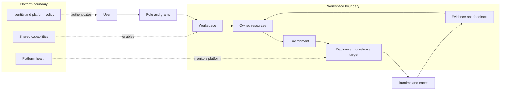

**Reading rule:** a user gets access to a workspace through identity plus a
workspace grant. A resource is not globally writable merely because its owner
can see it. Environment, resource type, action, and approval state all affect
whether the action is allowed.

## 2. Personas and authority

CALIBER's implemented authorization vocabulary is currently four broad scopes:
`caliber.viewer`, `caliber.operator`, `caliber.approver`, and `caliber.admin`
(the `caliber.` prefix is part of the literal value a token or route check
uses, not a namespace this document adds). The persona names below are product
roles mapped onto those scopes. A deployment may map several people to the same
scope, but the system should still record the human identity behind every
mutation, approval, release, and operational action.

Two properties of the implemented model constrain the personas below:

- **The scopes are hierarchical, and not symmetrically so.**
  `caliber.admin` implies approver, operator, and viewer; `caliber.approver`
  implies **only** viewer — it does not imply operator. An approver therefore
  cannot release or roll back on the strength of that scope alone.
- **There is no platform-level scope.** `caliber.admin` is global and
  workspace-less: a single tenant, a single scope set. The Platform Admin row
  below describes a proposed least-privilege boundary, not an implemented
  scope tier.

| Persona | Primary responsibility | Typical scope | Workspace reach | Explicit authority boundary |
| --- | --- | --- | --- | --- |
| Developer | Authors prompts, agents, tools, skills, workflows, test sets, and evaluation configuration; iterates from evidence. | `caliber.operator` for authoring and testing; may hold only `caliber.viewer` elsewhere. | One or more assigned workspaces (proposed). | Cannot approve their own production promotion unless an explicit policy allows separation of duties (proposed; not enforced today). |
| Workspace Admin | Manages workspace membership, grants, resource ownership, workspace defaults, and environment access. | `caliber.admin` (today global; workspace-scoped admin is proposed). | One workspace or an assigned set of workspaces (proposed). | Cannot automatically administer the CALIBER platform or bypass release policy. |
| Reviewer / Approver | Reviews candidate versions, test evidence, evaluation verdicts, risk, and release intent. | `caliber.approver`. | Assigned workspace and environment (proposed). | Can approve or reject; approval is not deployment. Today this scope gates only workflow promotion (off by default) and runtime approval nodes — not prompt release. |
| Operator | Executes an authorized release, reconciles uncertain external effects, rolls back, and handles runtime incidents. | `caliber.operator` (or `caliber.admin`, which implies it). | Workspace production environment and runtime targets. | Cannot edit the candidate while acting as release operator (proposed). |
| Platform Admin | Operates the CALIBER service, integrations, storage, identity boundary, and platform health. | `caliber.admin` plus deployment authority; there is no separate platform scope. | Platform metadata and health surfaces; workspace content only when explicitly granted or required for support. | Must not silently read or mutate workspace-owned resources (proposed boundary). |
| Auditor / Viewer | Inspects configuration, evidence, release history, audit logs, and runtime status. | `caliber.viewer`. | Read-only workspace or platform view. | Cannot author, approve, deploy, or delete. |

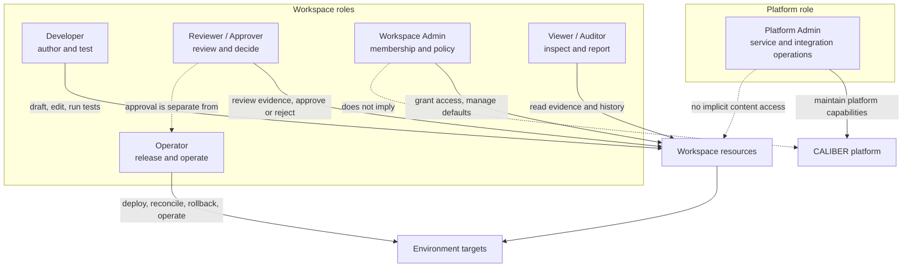

## 3. Workspace, ownership, and isolation

A Workspace is the collaboration boundary for a product or team. It contains
resource metadata, membership, grants, environment bindings, release policy,
and audit context. It is not the same thing as an MLflow experiment, an
execution environment, or a user account.

The proposed model should make the ownership path visible:

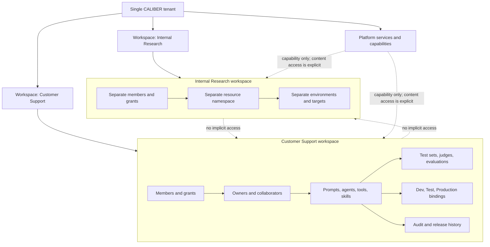

### Ownership rules to validate

- Every workspace resource has one owning workspace and one accountable owner
  identity or owning team, even when multiple users collaborate on it.
- A collaborator receives an explicit grant; membership alone should not make
  every resource writable.
- References between workspaces are denied by default. A controlled publish,
  export, or shared capability must create an auditable boundary crossing.
- Environment bindings point to immutable resource versions or release intents,
  not to a mutable working copy.
- Delete is a governed action. It should preserve audit history and should not
  delete evidence or production history implicitly.

## 4. Resource lifecycle and environment boundaries

The environment names below are a proposed operating model for the current
lifecycle primitives. The current repository has release, alias, rollback,
reconciliation, and audit concepts, but it does not yet provide one uniform
promotion contract for every asset family — and it ships a single live
environment rather than the three shown here. Read the three lanes as the
promotion contract to build, with today's single live alias standing in for
the Production lane.

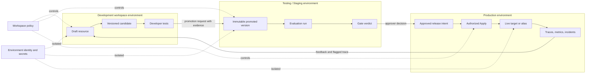

### Resource-specific interpretation

The lifecycle is intentionally resource-aware:

| Resource | Development activity | Test / evidence | Production or release target |
| --- | --- | --- | --- |
| Prompt | Author template, compare candidate versions, calibrate from traces. | Prompt test runs, datasets, judges, human review. | MLflow registry version behind the single live alias (internally `prod`, surfaced as "Live"); rollback and reconciliation are explicit. |
| Agent | Define identity, model/configuration, prompt binding, skills, and policy. | Run bounded tests and inspect traces/evaluations. | A runtime target or workflow binding, subject to the supported deployment path. |
| Tool / MCP server | Define schema, implementation, scopes, risk tier, and egress policy. | Contract tests and governed execution tests. | Approved capability available to an environment with secrets and network policy. |
| Skill | Author and version instructions and referenced capabilities. | Test grounding and behavior against fixtures. | A selected immutable skill version; rollback creates or selects a governed version according to the asset contract. |
| Workflow | Compose agent nodes, prompts, tools, skills, data, and transitions. | Manifest replay, test set, evaluation, and approval evidence. | Published workflow version behind an environment deployment alias or active version. |
| Test set / judge / evaluation | Create fixtures, scorers, judges, and thresholds. | Produce evidence and verdicts. | Usually evidence/configuration rather than a live runtime target; visibility and ownership still apply. |
| Knowledge base | Ingest and version source material and retrieval configuration. | Retrieval quality and access-policy checks. | An activated version or deployment binding where supported. |

## 5. User story: developer authors and iterates

**As a Developer**, I want to enter my team Workspace, create a prompt and its
supporting agent configuration, and iterate without affecting Production.

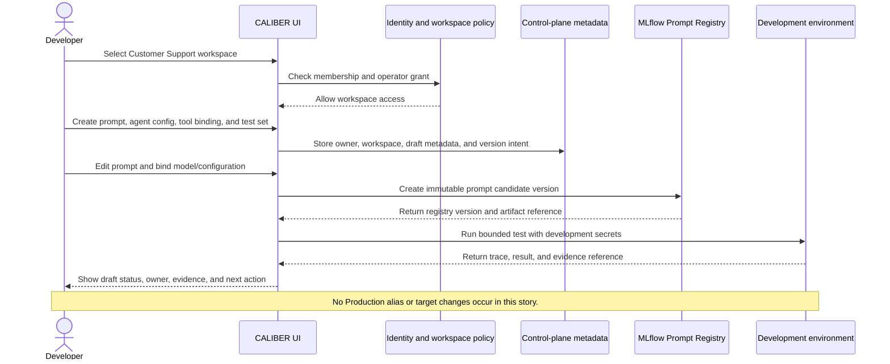

**Permission check:** `caliber.operator` can author and test within the Workspace, but
cannot cross into Production or approve their own promotion unless policy
explicitly says otherwise.

## 6. User story: developer tests and evaluates

**As a Developer**, I want to turn a failing trace into measurable evidence,
compare candidate prompts, and submit a promotion request without silently
changing the live resource.

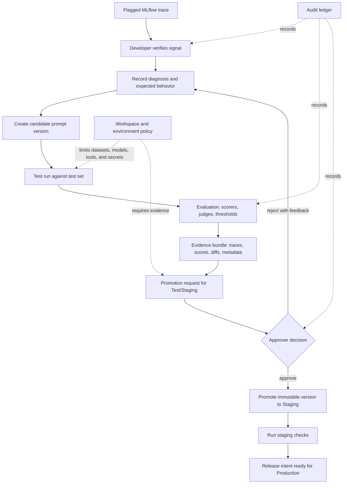

The supported prompt refinement shape is `Signal -> Evidence -> Candidate ->
Measurement -> Decision -> Release -> Trace`. The diagram makes the human
verification and release decision visible: a passing evaluation does not itself
apply a Production change.

## 7. User story: reviewer approves promotion

**As a Reviewer / Approver**, I want to inspect exactly what will change, the
workspace and environment targets, evaluation evidence, and separation-of-duty
constraints before approving a release intent.

> **Proposed, not current behavior.** Human-feedback approval governance was
> removed from the refinement path: a job that clears the eval gate lands at
> `candidate_ready`, and the operator who calls `POST /jobs/{id}/apply` is
> recorded as its own approver, so there is no separation of duty on that
> route today. The approval gates that do exist are workflow promotion
> (reachable only when human approval is explicitly enabled, which is off by
> default) and in-run runtime approval nodes. This section describes the
> separation of duty the Workspace model would need to introduce.

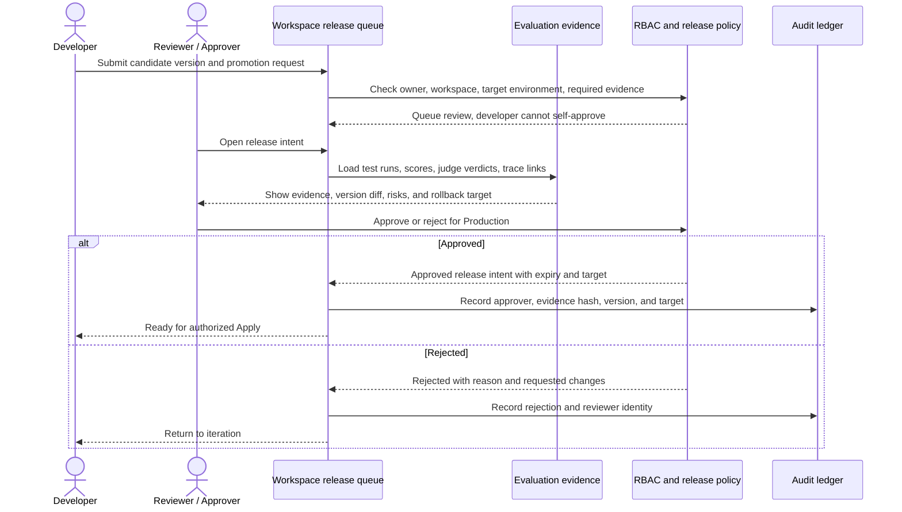

Approval is a decision on a specific immutable version and target. It should
not be a blanket permission to deploy future versions.

## 8. User story: authorized deployment and recovery

**As an Operator**, I want to apply an approved release to Production, see the
external MLflow or runtime effect settle, and reconcile or roll back when the
result is uncertain.

The states below are the implemented `caliber_release_operations.status`
vocabulary, not illustrative names: `prepared`, `applying`, `applied`,
`failed`, and `reconcile_required`.

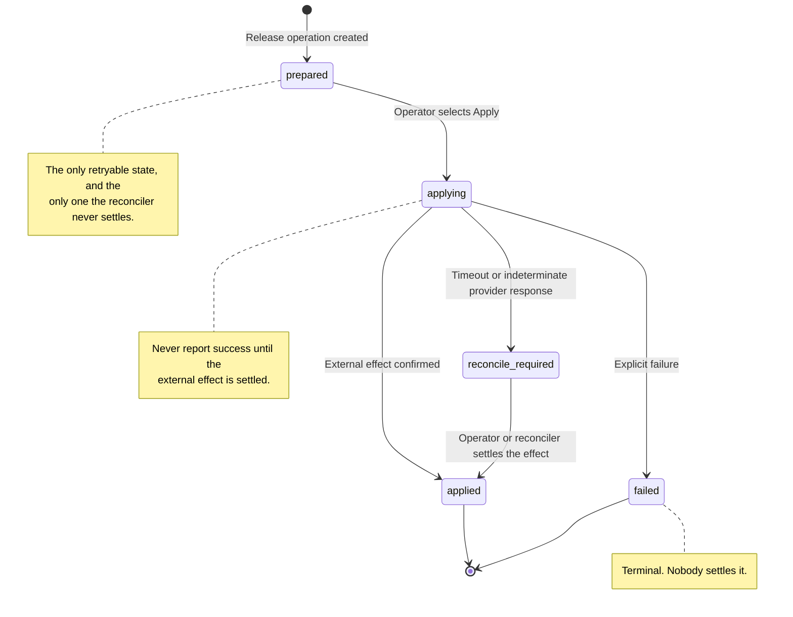

Three details matter for an operator reading this, and each one is a place
where the earlier drafts of this document were wrong:

- **`prepared` is the retry boundary.** Once a row reaches `applying` it is no
  longer retryable, and `failed` is terminal rather than a loop back to a
  fresh intent.
- **Reconciliation resolves to `applied`.** A settled reconcile writes
  `applied`; `reconciled` and `rolled_back` are flags on the response payload,
  not statuses of this row.
- **Rollback and runtime observation are separate operations.** They carry
  their own records and checkpoints rather than appearing as states here, so
  the diagram deliberately stops at the settled release.

The operator cannot edit the candidate during Apply. The release record must
retain intended version, observed provider state, correlation ID, actor, target,
settlement state, and next action. The "approved release intent" that precedes
`prepared` in sections 7 and 12 is part of the proposed model.

## 9. User story: operator monitors Production

**As an Operator**, I want to understand which Workspace resource and version
is live, inspect traces and health, and route feedback into a new development
candidate without editing Production in place.

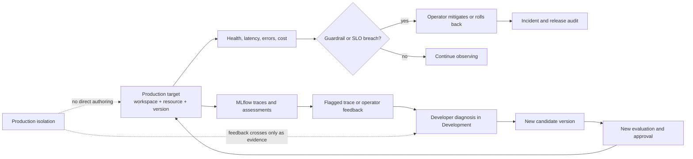

## 10. User story: Workspace Admin manages collaboration

**As a Workspace Admin**, I want to invite users, assign least-privilege
workspace grants, establish owners and environment access, and remove access
without changing resource content or bypassing approval policy.

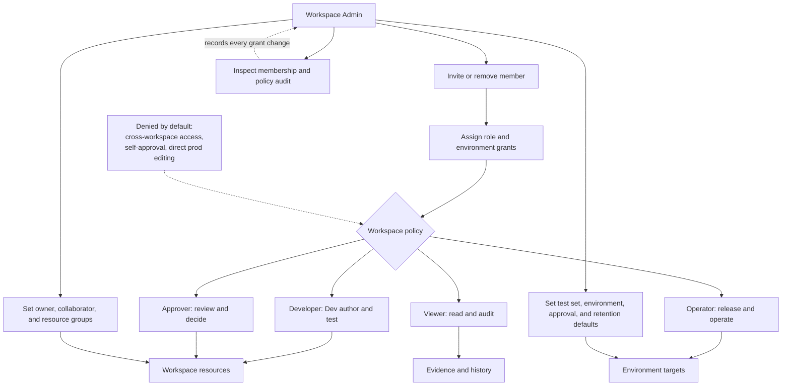

Membership management and resource management are separate actions. An Admin
can manage who may access a resource without becoming its author, approver, or
operator by default.

## 11. User story: Platform Admin operates the platform

**As a Platform Admin**, I want to keep CALIBER healthy, configure integrations,
rotate platform credentials, and diagnose service failures without gaining
unbounded access to workspace-owned prompt text, datasets, or business data.

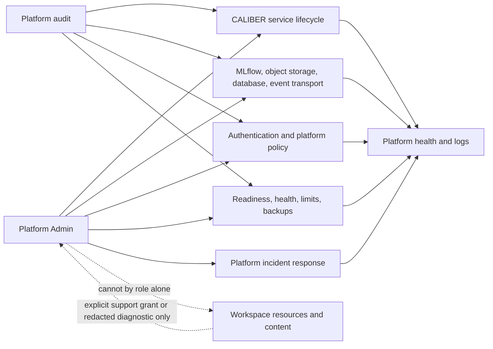

This story is intentionally stricter than “admins can see everything.” The
current product is single-tenant, so this is a proposed least-privilege
boundary for platform operations, not a claim that every existing route already
provides content-level redaction.

## 12. Multi-user collaboration scenario

A single Workspace contains one Customer Support agent and its prompt. The
Developer authors it, the Reviewer decides whether evidence is sufficient, the
Operator deploys it, and the Workspace Admin manages access. Each person acts
on the same resource through a different permission boundary.

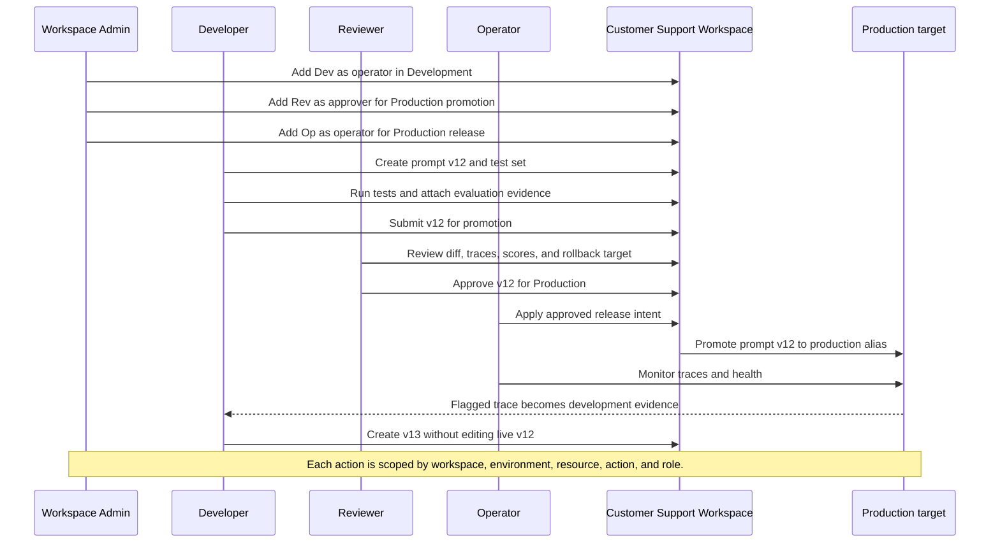

### Permission matrix for the collaboration scenario

This matrix is the target state. Today the same four global scopes govern every
row: there is no workspace or environment dimension, `caliber.approver` does
not gate prompt release, and the operator who applies a release is recorded as
its own approver. Read "No by default" as "what the Workspace model must
enforce", not as a constraint the current API applies.

| Action | Developer | Reviewer | Operator | Workspace Admin | Viewer |
| --- | --- | --- | --- | --- | --- |
| Read workspace resource | Yes, if granted | Yes | Yes | Yes | Yes |
| Create or edit Development draft | Yes | Optional | No by default | Policy-dependent | No |
| Run tests and evaluations | Yes | Yes | Optional | No by default | Read results |
| Submit promotion request | Yes | Yes | Optional | Policy-dependent | No |
| Approve another author's change | No by default | Yes | No | No by default | No |
| Approve own change | No | No | No | No | No |
| Apply Production release | No by default | No by default | Yes, if environment-granted | Policy-dependent, not implicit | No |
| Reconcile or roll back | No by default | No by default | Yes | Policy-dependent | No |
| Manage members and grants | No | No | No | Yes | No |
| Delete resource | Owner/policy-dependent | No | No | Policy-dependent with audit | No |
| Read audit and release history | Yes, scoped | Yes | Yes | Yes | Yes |

## 13. End-to-end governance view

This diagram combines identity, workspace, ownership, evidence, approval, and
runtime feedback into one implementation-oriented path.

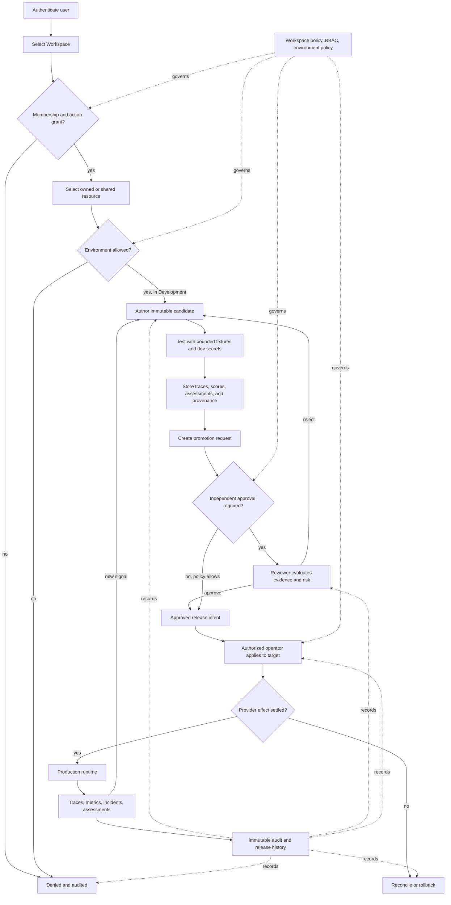

## 14. Assumptions and architectural gaps

These are the decisions the stories expose. They should become architecture
records, schema decisions, authorization tests, and API contracts before the
visual model is treated as implemented behavior.

| Area | Assumption used by this document | Current evidence | Gap or decision needed |
| --- | --- | --- | --- |
| Workspace identity | Every resource can be scoped to exactly one Workspace. | `project_id` plus a three-value `visibility` tier (`project`, `user`, `public`) applied through `apply_visibility_filter`; 21 models carry `project_id` and 14 carry `visibility`. | Define Workspace tables/IDs, membership, invitations, resource ownership, and migration from project/user visibility. |
| Tenant boundary | The current v1 deployment is single-tenant. | PRD explicitly excludes multi-tenancy. | Decide whether Workspace is an organizational namespace inside one tenant or the future tenant boundary. |
| Roles | The four current scopes map to persona roles. | `caliber.viewer`, `caliber.operator`, `caliber.approver`, `caliber.admin`, hierarchical and global; approver implies only viewer, never operator. | Define action-level permissions and whether grants are workspace-, resource-, or environment-scoped. |
| Environment model | Development, Testing/Staging, and Production are distinct targets. | The shipped mode is single-environment: `SINGLE_ENVIRONMENT` is true, one live alias, and no alias is release-gated by default. Syntactic acceptance of another alias is not a verified product mode. | Define environment records, secrets, target bindings, promotion APIs, and isolation guarantees. |
| Approval | Approval is separate from Apply and is tied to an immutable version. | Not true on the prompt path: human-feedback approval governance was removed, a cleared job lands at `candidate_ready`, and `POST /jobs/{id}/apply` requires `caliber.operator` and records that actor as the approver. Real gates exist only for workflow promotion (off by default) and in-run runtime approval nodes. | Reintroduce separation of duty, expiry, evidence hash, target, and version at every supported release route. |
| Prompt candidates | MLflow may contain optimizer-generated or draft prompt versions that are not final. | MLflow owns prompt versions; CALIBER supports calibration and prompt refinement. | Add explicit candidate/final/released state or release metadata so “registered” is not mistaken for “approved production.” |
| Asset lifecycle | Each asset family has a different release contract. | Architecture explicitly says lifecycle guarantees are family-specific. | Publish a capability matrix for create, version, test, approve, deploy, rollback, and delete per family. |
| Platform Admin access | Platform operations should not imply workspace-content access. | This is a proposed least-privilege principle; current route coverage is path-specific. | Add support grants, redaction rules, break-glass audit, and tests for content access. |
| Cross-workspace references | References are denied by default. | The architecture describes project scoping, but not a complete Workspace reference policy. | Define export, sharing, dependency, and revocation semantics. |
| Delete and retention | Delete is governed and preserves audit/evidence history. | Audit and resource-specific deletion exist in parts of the system. | Define soft-delete, retention, dependency checks, and production deletion safeguards. |
| Runtime ownership | A live target identifies workspace, resource, version, environment, and release intent. | Prompt aliases, workflow deployment versions, rollback, and reconciliation are not uniform across families. | Define a common release-target identity while preserving asset-specific adapters. |
| Audit coverage | Every membership, resource, approval, release, and operational action is attributable. | Audit/effect ledgers are architectural primitives; provider-boundary limits are documented. | Verify route coverage and correlation across MLflow, object storage, and runtime effects. |
| Platform scale | One active CALIBER process is the supported v1 topology. | PRD and roadmap explicitly constrain v1 to one active process. | Keep Workspace stories independent of unsupported HA, multi-tenant, or cross-region claims. |

## 15. Validation checklist

Before implementing or approving the Workspace model, use these questions as
acceptance criteria:

- Can a user explain which Workspace and environment they are operating in at
  every mutation?
- Can the API reject a user who is a Workspace member but lacks the required
  resource or environment grant?
- Can a Developer create a candidate without changing Production?
- Can a Reviewer approve exactly one immutable version for exactly one target?
- Can an Operator distinguish `prepared`, `applying`, `applied`, `failed`, and
  `reconcile_required` after an external provider call, and tell which of them
  is still safe to retry?
- Can a Workspace Admin change membership without silently changing ownership or
  content?
- Can a Platform Admin diagnose service health without automatic access to
  workspace-owned prompt text and datasets?
- Can a Viewer inspect evidence and history without receiving mutation routes?
- Can the system show the complete chain from user, role, workspace, resource,
  environment, version, approval, release, and runtime trace?
- Can the model express that prompt families, workflow families, tools, skills,
  test sets, and knowledge bases have different lifecycle guarantees?
- Can every boundary crossing be audited and correlated to a human or service
  identity?

Until these questions have implementation and test evidence, the diagrams in
this document should be treated as a design hypothesis and review aid, not as a
claim that the current alpha surface already provides uniform Workspace or
RBAC isolation.
