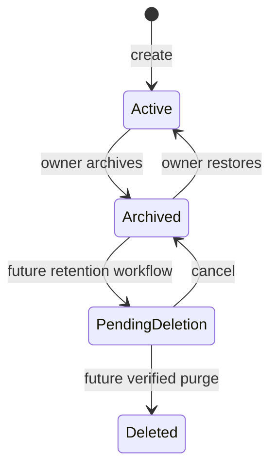
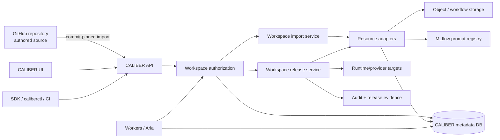
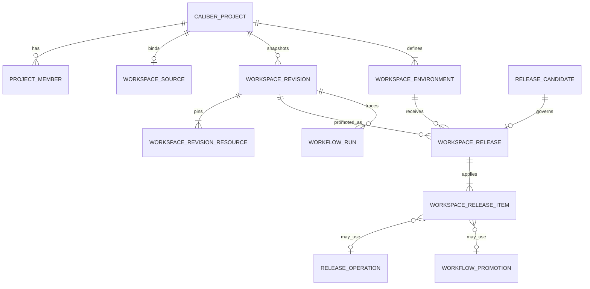
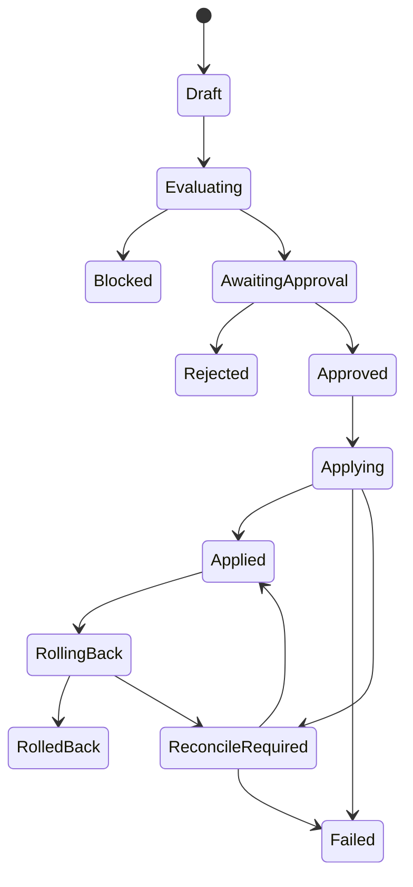
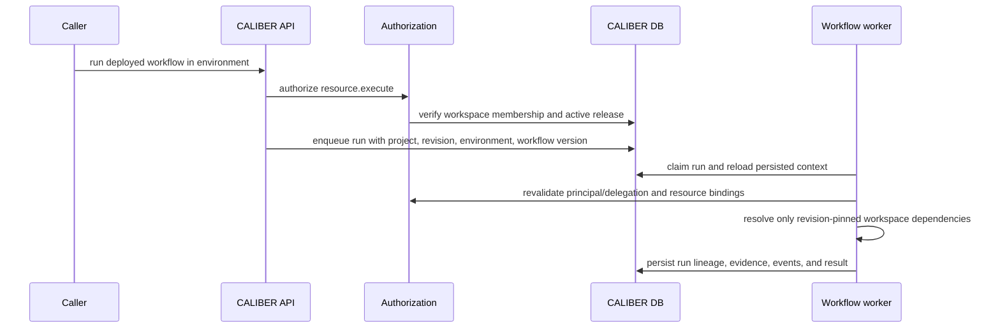

---
audience:
  - architect
  - developer
  - security
  - operator
  - decision-maker
doc_type: proposal
product_area: platform
stability: draft
summary: Repository-grounded architecture and phased implementation plan for making the existing CALIBER project scope a first-class Workspace with revisions, collaborators, Git-backed authoring, isolation, and governed environment promotion.
prerequisites:
  - Read the layered architecture and platform architecture
  - Treat current-main behavior and tests as the source of truth
  - Preserve the current single-tenant product boundary unless a separate decision changes it
reviewed_on: 2026-09-08
version_applicability: current main at 9061aeccb758; proposal only, not an implemented capability
tags:
  - workspace
  - project-scoping
  - rbac
  - versioning
  - github
  - environments
  - releases
---

# Workspace architecture and implementation proposal

## Proposal status

This document proposes how to make **Workspace** the coherent project boundary
for CALIBER. It is implementation-ready planning, not a statement that the
capability already exists. The source audit is against `main` at `9061aeccb758`.

The recommended decision is:

> Evolve the existing `CaliberProject` and project-membership implementation
> into the Workspace control boundary; add immutable workspace revisions and
> environment-scoped releases; retain each asset family's existing version and
> release semantics; and introduce GitHub as an optional, one-way source for
> authored workspace content.

The MVP deliberately keeps the existing `PRJ-*` identifiers,
`X-CALIBER-Project` header, `/projects` routes, four project roles, and current
resource tables. “Workspace” becomes the product term without forcing a risky
repository-wide physical rename. A later major-version API can rename the wire
contract after the behavior is proven.

## 1. Problem and motivation

### 1.1 The user problem

CALIBER exposes workflows, prompts, tools, skills, knowledge bases, test sets,
judges, integrations, files, runs, approvals, releases, and operational
evidence. Today those objects have several different versioning and storage
idioms. A user can select a project called a workspace, but there is no single
immutable answer to:

- Which exact resource versions comprise this project?
- Which Git commit produced those versions?
- What is deployed in development, staging, or production?
- Who may edit, review, promote, roll back, or administer this project?
- Can a run be traced back to the complete project state rather than only its
  workflow version?
- Can another project see or execute this project's resources through a route,
  worker, assistant capability, provider lookup, or guessed identifier?

The result is a logical-fragmentation problem. CALIBER's relational database,
MLflow, object storage, GitHub, and runtime providers legitimately own different
physical state, but the user should not need to reconstruct the project by
navigating each store or guessing which one is authoritative.

### 1.2 Current limitations this proposal addresses

The current repository already contains a partial workspace foundation, but its
guarantees are not yet workspace-wide:

1. `CaliberProject` is documented as a workspace that groups files “and future
   resources”; it is not a versioned aggregate.
2. `CaliberProjectMember` and `resource_access.py` provide four roles and a
   small action registry, but routes also use global scopes independently. The
   effective policy is therefore path-specific.
3. The UI sends `X-CALIBER-Project` from `WorkspaceSelector`, but it also offers
   “All workspaces,” and the header is optional. That is appropriate for legacy
   personal/public libraries but insufficient for a strict workspace boundary.
4. Many root resources carry nullable `project_id` and `visibility`; most do not
   have a database foreign key to `caliber_projects`. Several names remain
   globally unique despite project scoping.
5. MLflow prompt discovery enumerates provider records independently of a
   first-class CALIBER prompt-to-project binding. A project-scoped agent does not
   by itself make every MLflow prompt project-scoped.
6. MCP server definitions and the encrypted secret store are platform-level.
   They need explicit workspace/environment bindings rather than an assumption
   that every platform record becomes workspace-owned.
7. Asset history is intentionally heterogeneous. Prompts, workflows, knowledge
   bases, skills, tools, test sets, judges, and MCP servers do not share one
   release or rollback contract.
8. Environment classification exists and is fail-closed for unknown aliases,
   but the supported product remains single-environment. Prompt discovery uses
   only `prod`; workflow deployment stores a derived environment class rather
   than a first-class workspace environment.
9. Release candidates, signoffs, prompt release operations, workflow
   promotions, and rollback checkpoints exist, but there is no parent release
   that binds a complete workspace revision to an environment.
10. There is no current GitHub repository binding, commit-pinned workspace
    manifest, workspace revision model, or durable GitHub import job.
11. Personal access tokens can narrow global scopes but cannot currently bind
    the credential to one project. A CI token used for workspace import would
    otherwise retain its owner's access to every workspace where that owner is
    a member.

These are not reasons to replace the architecture. They identify where the
existing project scope should become a real aggregate and where current
path-specific safeguards must be closed over the whole request and execution
surface.

### 1.3 Goals

The Workspace initiative should deliver:

- one discoverable project boundary for authored assets, evidence, runs,
  releases, collaborators, and environment state;
- strict workspace isolation for every workspace-owned read, write, execution,
  and assistant path;
- an immutable workspace revision that pins exact domain resource versions and
  content digests;
- optional GitHub-backed authoring with commit provenance and no competing
  mutable source;
- a workspace-bound automation credential for Git import and release
  automation;
- controlled promotion of the same immutable revision through development,
  staging, and production;
- minimum viable RBAC using the four roles already implemented;
- separation of editing, approval, and production application at the release
  instance, without creating a large role taxonomy;
- replay, audit, rollback, and partial-effect reconciliation that remain honest
  about asset-specific and provider-specific guarantees;
- backward compatibility for current project IDs, routes, headers, SDK users,
  and legacy unscoped/public resources during migration.

### 1.4 Non-goals for the MVP

The MVP does not include:

- multi-tenant SaaS isolation, organizations, billing, or cross-tenant sharing;
- SSO, SCIM, directory groups, or custom-role authoring;
- nested workspaces or per-resource ACLs;
- arbitrary promotion graphs or a general deployment orchestrator;
- bidirectional Git synchronization or silent commits from the CALIBER UI;
- treating Git branches as environments;
- storing secrets, traces, large corpora, compiled bundles, or runtime outputs
  in Git;
- replacing MLflow, object storage, or existing asset-specific version stores;
- pretending that a multi-provider release is transactionally atomic;
- renaming every `project_id`, `CaliberProject`, `/projects`, and SDK symbol in
  the first release;
- making all asset families deployable or forcing them behind one generic
  `VersionedResource` implementation.

## 2. Current architecture: what exists and what it proves

### 2.1 Reusable foundation

| Existing component | Current behavior | Reuse decision | Gap to close |
| --- | --- | --- | --- |
| [`CaliberProject`](../caliber/src/caliber/db/models.py) | `PRJ-*` identity, `tenant_id`, owner, active/archived status, storage backend | Treat as the Workspace root; preserve table and ID | Add stable slug/source mode and stronger lifecycle rules |
| [`CaliberProjectMember`](../caliber/src/caliber/db/models.py) | One active/inactive user membership with owner/editor/reviewer/viewer role | Reuse unchanged initially | Add action-level policy and release-instance separation of duties |
| [`routes/projects.py`](../caliber/src/caliber/routes/projects.py) | Project CRUD, members, folders, uploads, downloads | Extend with nested source/revision/environment routes, or register focused route modules beside it | Current project scope is primarily metadata/files |
| [`resource_access.py`](../caliber/src/caliber/resource_access.py) | Central project role lookup and seven project actions | Evolve into the single workspace authorization entry point | Global scopes, environment policy, workers, CLI, and Aria are not yet one policy decision |
| [`db/scoping.py`](../caliber/src/caliber/db/scoping.py) | Visibility-aware list/detail filtering for project/user/public rows | Reuse for discovery and legacy library behavior | Strong workspace actions must require a concrete workspace and deny by default |
| [`auth.py`](../caliber/src/caliber/auth.py) | Validated identity, global viewer/operator/approver/admin scopes, PAT scope ceilings, active project header | Reuse authentication and scope ceilings | Do not treat a client-provided workspace header as authorization; add credential workspace, environment, and resource context |
| [`WorkspaceSelector.tsx`](../caliber/caliber-ui/src/components/WorkspaceSelector.tsx) | Select/create active project; invalidates cached queries | Reuse and expand into workspace navigation | “All workspaces” must not silently become an authorization scope |
| [`ProjectsAPI`](../sdk/caliber-sdk/src/caliber_sdk/resources/projects.py) | Typed project, member, and file operations | Extend without breaking existing methods | Add source, revision, environment, and release models/resources |
| Domain resource models | Project IDs on agents, datasets, judges, review queues, plans, eval runs, skills, workflows, tools, OpenAPI integrations, KBs, files, and several run tables | Keep domain models authoritative | Coverage is nullable, uneven, and not always FK-enforced |
| Domain version models | MLflow prompt versions; workflow versions; KB builds; skill snapshots; tool version rows; dataset intervals | Keep each domain contract | Add a cross-resource immutable pin set, not a replacement version backend |
| [`deployment_environments.py`](../caliber/src/caliber/deployment_environments.py) | Classifies aliases as development/staging/production; unknown aliases fail closed to production | Reuse classification and policy helpers | Add durable workspace environment identity and state |
| Workflow deployments/promotions | Alias CAS, deploy gates, optional human approval, rollback stack | Reuse through a workspace release adapter | Applies only to workflow aliases and current global scopes |
| Release candidates/signoffs | Evidence rubric, immutable final signoff snapshot | Reuse for workspace release decisions | Current candidate names one artifact/version, not a workspace revision/environment |
| Prompt release operations | Intent-first external effect with reconciliation | Reuse as a child operation | Other asset paths do not inherit this external-effect guarantee |
| Audit log | Actor/action/entity/details | Reuse and add workspace/revision/environment correlation | No mandatory structured workspace fields across every event |
| Storage service | Project/run namespaces, digest-bearing file records, local/S3 backends | Reuse | Revision must pin immutable file refs rather than mutable paths |

### 2.2 Current source-of-truth boundaries

The current architecture explicitly separates state ownership:

| State | Current authority | Workspace interpretation |
| --- | --- | --- |
| CALIBER control metadata | CALIBER relational database | Workspace catalog, membership, revisions, environments, releases, and provider references live here |
| File bytes | Object/workflow storage | Workspace records content-addressed references; it does not duplicate large bytes in SQL or Git |
| Prompt versions and traces | MLflow | CALIBER adds workspace-local bindings and records exact provider versions |
| Workflows, tools, skills, datasets, judges, KB metadata | CALIBER relational models | Existing domain versions remain canonical and are pinned by a workspace revision |
| Authored Git-managed files | GitHub commit | Canonical authored source for a `git_managed` workspace; CALIBER materializes and governs it |
| Secret values | Encrypted CALIBER secret versions | Never enter a manifest or audit payload; environments bind `secret://` references |

The user experience is one logical workspace even though physical stores remain
separate. The CALIBER database is the authoritative inventory: an object that
exists only in MLflow, object storage, or GitHub is not a usable workspace
resource until CALIBER binds it and an immutable revision pins it. Centralizing
authority and navigation is the goal; collapsing every failure domain into one
database is not.

### 2.3 Resource classification

Not every object inside a workspace has the same lifecycle:

| Class | Examples | Revision behavior | Release behavior |
| --- | --- | --- | --- |
| Authored runtime asset | Prompt, workflow, skill, tool | Pin exact immutable version/content digest | Materialize or bind through an asset-specific adapter |
| Grounding asset | Knowledge base, source manifest | Pin exact KB build and source fingerprint | Activate a build or bind it as a dependency |
| Evidence asset | Test set, judge, evaluation run, review result | Pin the version/run/digest that justified the decision | Never “deploy” it; carry it with release evidence |
| Integration definition | OpenAPI snapshot, approved MCP connection binding | Pin contract version and policy | Validate/preflight; environment binding controls use |
| Operational record | Run, trace, release operation, audit event | Reference the workspace revision and environment | Produced by execution; not part of authored source |
| Platform service | Identity, encrypted secret value, provider credentials, storage backend | Referenced by name/version where safe | Managed by platform operators, not copied into workspaces |
| Documentation | Design, runbook, resource documentation | Version in Git for Git-managed workspaces | Not deployed as a runtime asset, but included in project provenance |

## 3. Workspace concept

### 3.1 Definition

A Workspace is the durable collaboration and governance boundary for one
CALIBER project. It owns or binds:

- collaborators and their workspace roles;
- authored resources and exact resource versions;
- evidence and operational lineage associated with those resources;
- zero or one GitHub source binding in the MVP;
- immutable workspace revisions;
- development, staging, and production environment records;
- release requests, signoffs, application state, and rollback lineage;
- workspace-scoped file namespaces and secret references;
- policies controlling import, execution, approval, and promotion.

A Workspace is **not** a tenant, a Git repository, a deployment environment, a
mutable bundle, or a physical storage backend. It is the common logical context
that relates those concepts.

### 3.2 Boundary and invariants

The following invariants define the capability:

1. Every workspace-owned root resource has exactly one workspace ID.
2. A resource may be shared from a platform/personal catalog only through an
   explicit, version-pinned revision entry; visibility alone does not make it a
   dependency.
3. CALIBER's workspace inventory is the only discovery and authorization
   authority. Provider listings are reconciliation inputs, never an alternate
   workspace catalog.
4. A ready workspace revision is immutable.
5. A release always names one ready revision and one target environment.
6. Staging and production receive the same revision digest that passed the
   previous environment; CALIBER does not rebuild source between promotions.
7. Environment-specific configuration and secret-version references are
   captured separately and hashed into release evidence.
8. A caller's workspace/environment header or URL is context, not proof of
   access. Server-side membership and policy decide every action.
9. Workers, Aria, SDK/CLI calls, and direct HTTP calls enforce the same decision
   function.
10. Unknown roles, actions, environments, revision item types, provider states,
   or authorization-store failures deny or remain unresolved; they never widen
   access or become a successful release.
11. A partial external release is represented as partial or
    `reconcile_required`; it is never recorded as fully applied because the SQL
    parent transaction committed.

### 3.3 Ownership model

The existing project owner remains the initial workspace owner and initial
`owner` membership. Ownership is administrative accountability, not proof that
the person independently reviewed a release.

MVP rules:

- exactly one active owner relationship is retained through the existing
  `CaliberProject.owner` compatibility field;
- the owner cannot be removed through ordinary member deletion;
- ownership transfer is an explicit, audited operation that atomically updates
  the owner field and memberships;
- archiving blocks new writes/imports/releases but preserves reads, runs,
  revisions, audit history, and recovery actions;
- hard deletion is out of scope; a later retention workflow must prove that no
  live environment, legal hold, release, or cross-resource reference depends on
  the workspace.

### 3.4 Workspace lifecycle



Only `active` and `archived` are implemented for the MVP. `PendingDeletion` and
`Deleted` show the safe extension path and must not be exposed until retention,
dependency, backup, and recovery contracts exist.

### 3.5 Source modes

Each workspace declares one source mode:

- `caliber_managed`: current behavior. CALIBER domain records are the authored
  source; a revision is created from selected saved versions.
- `git_managed`: a GitHub commit plus `.caliber/workspace.yaml` is the authored
  source. CALIBER materializes immutable domain versions and records the
  mapping.

The source mode prevents dual authority. In a `git_managed` workspace, UI edits
may be used as local development drafts, but they are not eligible for staging
or production until represented by a new imported Git commit. The MVP does not
silently write commits or PRs from the CALIBER UI.

## 4. Proposed architecture

### 4.1 Logical architecture



### 4.2 Minimal-disruption decisions

1. **Reuse `CaliberProject` as Workspace.** Do not rename the table, public ID,
   header, or existing routes in the MVP.
2. **Add focused services instead of enlarging `routes/projects.py`.** New
   modules should own sources, revisions, environments, and workspace releases.
3. **Keep domain models authoritative.** A workspace revision references exact
   domain versions; it does not copy all domain payloads into one generic table.
4. **Do not add a mutable generic resource catalog in the MVP.** Existing root
   resources plus immutable revision items avoid a second registry that can
   drift from domain tables.
5. **Use adapters only at aggregate boundaries.** Import, resolve, validate,
   release, observe, and rollback need a common adapter protocol; ordinary
   domain CRUD remains unchanged.
6. **Start GitHub integration as push-based CI.** A GitHub Action or trusted CI
   calls CALIBER with a scoped CALIBER PAT and a commit-pinned bounded source
   bundle. CALIBER does not need to store a GitHub token in the MVP.
7. **Represent environments durably.** Alias classification remains reusable,
   but environment identity, policy, current release, and configuration digest
   must be database state rather than process configuration alone.
8. **Use a parent workspace release.** Existing prompt operations, workflow
   promotions, KB activations, and other asset operations become child items.
   This records partial outcomes without claiming cross-provider atomicity.

### 4.3 New service boundaries

| Service | Responsibility | Must not own |
| --- | --- | --- |
| `WorkspaceService` | Workspace lifecycle, owner transfer, member administration | Domain resource payloads |
| `WorkspaceAuthorizationService` | One deny-by-default decision for principal/action/workspace/resource/environment/release | Authentication or UI-only capability hiding |
| `WorkspaceRevisionService` | Canonicalize manifest, resolve pins, compute digest, validate completeness, diff revisions | Provider-specific mutation logic |
| `WorkspaceImportService` | Durable import job, path/size validation, adapter orchestration, idempotency, failure reporting | GitHub user credentials in push-based MVP |
| `WorkspaceEnvironmentService` | Seed/manage environment identities and policy, capture config digest | Secret plaintext |
| `WorkspaceReleaseService` | Request, evaluate, approve, apply, observe, reconcile, and roll back one revision/environment pair | Pretending child effects are atomic |
| `WorkspaceResourceAdapter` registry | Domain-specific resolve/materialize/validate/release/observe/rollback operations | Generic domain CRUD replacement |

The resource adapter interface should be narrow and capability-declaring:

```python
class WorkspaceResourceAdapter(Protocol):
    resource_type: str

    def resolve(self, session, workspace, declaration) -> ResolvedPin: ...
    def validate(self, session, pin, environment=None) -> ValidationResult: ...
    def prepare_release(self, session, pin, environment) -> PreparedAction | None: ...
    def apply_release(self, prepared) -> ProviderOutcome: ...
    def observe_release(self, prepared) -> ProviderOutcome: ...
    def rollback(self, prepared) -> ProviderOutcome: ...
```

An adapter returns `None` from `prepare_release` for evidence/documentation
items. Unsupported or ambiguous operations return a typed refusal; they do not
silently skip a required runtime dependency.

## 5. Proposed data model

### 5.1 Entity relationships



### 5.2 Existing table changes

#### `caliber_projects`

Keep the table and `project_id`. Add:

| Column | Type | Rule |
| --- | --- | --- |
| `slug` | `String(128)` | Stable, lowercase workspace handle; unique within `tenant_id` |
| `source_mode` | `String(24)` | `caliber_managed` or `git_managed`; default `caliber_managed` |
| `archived_at` | nullable datetime | Set with archived status |
| `archived_by` | nullable string | Actor for lifecycle audit |

Replace global project-name uniqueness over time with `(tenant_id, slug)`.
Display names need not be globally unique. Do not drop the old uniqueness
constraint until collision analysis and all name-based lookups are removed.

#### `caliber_project_members`

No new role table is required for the MVP. Add optional lifecycle fields only
if needed by the existing route contract:

| Column | Type | Rule |
| --- | --- | --- |
| `deactivated_at` | nullable datetime | Set when status becomes inactive |
| `deactivated_by` | nullable string | Auditable actor |

The existing unique `(project_id, user_id)` remains correct. A membership is
reactivated rather than duplicated.

#### Existing release and execution records

Add nullable foreign keys during dual-read migration:

- `caliber_release_candidates.workspace_revision_id`
- `caliber_release_candidates.environment_id`
- `caliber_workflow_deployments.environment_id`
- `caliber_workflow_deployments.workspace_release_id`
- `caliber_workflow_runs.workspace_revision_id`
- `caliber_workflow_runs.environment_id`
- `caliber_release_operations.workspace_release_item_id`
- `caliber_workflow_promotions.workspace_release_item_id`

Keep current aliases, version IDs, environment-class strings, manifest
snapshots, and evidence payloads for compatibility and independent recovery.

#### `caliber_personal_access_tokens` and `CaliberIdentity`

Add a nullable `project_id` foreign key to the existing PAT table and project
`credential_kind`, `credential_id`, and `credential_project_id` into
`CaliberIdentity`. A project-bound PAT is refused whenever the URL/header,
resource owner, or persisted worker context names a different workspace.

Existing PAT rows remain nullable for compatibility and continue to be bounded
by the owner's live global scopes and workspace memberships. New CI import
tokens must be project-bound. A later policy may prohibit account-wide PATs for
all workspace mutations after operators have migrated automation.

### 5.3 New tables

#### `caliber_workspace_sources`

| Column | Type | Constraint/meaning |
| --- | --- | --- |
| `source_id` | `String(64)` | `WSS-*` primary key |
| `project_id` | FK | Non-null; unique in MVP (zero or one source per workspace) |
| `provider` | string | MVP value `github` |
| `repository` | string | Canonical `owner/name`, not an arbitrary display URL |
| `default_branch` | string | Informational and import default; releases still pin a SHA |
| `root_path` | string | Normalized repository-relative path |
| `manifest_path` | string | Default `.caliber/workspace.yaml` |
| `sync_mode` | string | MVP value `push` |
| `status` | string | `active`, `disabled`, `error` |
| audit timestamps/actors | fields | Created/updated provenance |

No GitHub access token is stored for push mode. A later GitHub App connection
uses an opaque installation/connection reference, not plaintext credentials.

#### `caliber_workspace_import_jobs`

| Column | Type | Constraint/meaning |
| --- | --- | --- |
| `import_job_id` | `String(64)` | `WSI-*` primary key |
| `project_id`, `source_id` | FK | Workspace/source boundary |
| `repository`, `commit_sha` | string | Full source identity |
| `manifest_sha256`, `bundle_sha256` | string | Idempotency and provenance |
| `status` | string | `queued`, `running`, `succeeded`, `failed`, `reconcile_required` |
| `revision_id` | nullable FK | Set on success |
| `idempotency_key` | string | Unique within project |
| `claimed_by`, lease/heartbeat fields | fields | Follow existing durable worker patterns |
| `error_code`, `error_summary` | nullable | Bounded, redacted diagnostics |
| audit timestamps/actors | fields | Request and completion lineage |

#### `caliber_workspace_revisions`

| Column | Type | Constraint/meaning |
| --- | --- | --- |
| `revision_id` | `String(64)` | `WSR-*` primary key |
| `project_id` | FK | Non-null workspace |
| `revision_number` | integer | Unique monotonic ordinal per workspace |
| `source_id`, `source_commit_sha` | nullable | Required for `git_managed`; absent for CALIBER-managed snapshots |
| `manifest` | JSON | Canonical normalized manifest snapshot |
| `manifest_sha256` | string | Canonical JSON digest |
| `revision_sha256` | string | Digest over manifest plus sorted resolved pins |
| `status` | string | `validating`, `ready`, `invalid` |
| `validation_report` | JSON | Deterministic errors/warnings and adapter versions |
| `created_by`, `created_at`, `validated_at` | fields | Provenance |

Unique keys:

- `(project_id, revision_number)`
- `(project_id, revision_sha256)` for idempotent snapshots
- `(project_id, source_id, source_commit_sha, manifest_sha256)` for Git imports

Once status reaches `ready` or `invalid`, manifest, pins, digests, source
identity, and report are immutable. Retrying changed input creates a new import
job and, if content differs, a new revision.

#### `caliber_workspace_revision_resources`

| Column | Type | Constraint/meaning |
| --- | --- | --- |
| `revision_resource_id` | `String(64)` | `WSRR-*` primary key |
| `revision_id` | FK | Non-null parent |
| `resource_type` | string | Closed registry key |
| `logical_name` | string | Workspace-local name |
| `resource_id` | string | CALIBER domain ID or stable binding ID |
| `version_ref` | string | Exact immutable domain/provider version |
| `content_sha256` | string | Resolved content digest |
| `source_path`, `source_sha256` | nullable | Git provenance for authored content |
| `provider_ref` | nullable string | MLflow/object/provider reference; never a secret |
| `purpose` | string | `runtime`, `grounding`, `evidence`, `integration`, `documentation` |
| `resolution` | JSON | Adapter version and bounded resolution metadata |

Unique `(revision_id, resource_type, logical_name)`. A heterogeneous
`resource_id` cannot have one SQL foreign key, so the revision service must
resolve and authorize every pin before marking the revision ready. The pin
carries a content digest so deletion or provider drift is detectable.

#### `caliber_workspace_environments`

| Column | Type | Constraint/meaning |
| --- | --- | --- |
| `environment_id` | `String(64)` | `WSE-*` primary key |
| `project_id` | FK | Non-null workspace |
| `name` | string | Default `dev`, `staging`, or `prod` |
| `environment_class` | string | `development`, `staging`, `production` |
| `promotion_order` | integer | Default 10, 20, 30 |
| `status` | string | `active` or `disabled` |
| `policy` | JSON | Approval count, predecessor requirement, gate requirements, rollback policy |
| `config_refs` | JSON | Non-secret provider/config references |
| `config_sha256` | string | Digest included in release evidence |
| `current_release_id` | nullable FK | CAS-protected pointer to last fully applied release |
| audit timestamps/actors | fields | Configuration provenance |

Unique `(project_id, name)`. The class must be resolved through the existing
environment classifier and stored explicitly. Unknown values fail closed to
production policy and cannot bypass validation by spelling.

#### `caliber_workspace_releases`

| Column | Type | Constraint/meaning |
| --- | --- | --- |
| `workspace_release_id` | `String(64)` | `WSREL-*` primary key |
| `project_id`, `revision_id`, `environment_id` | FK | Exact release coordinates |
| `release_candidate_id` | FK | Existing evaluated candidate/signoff record |
| `expected_current_release_id` | nullable FK | Optimistic concurrency precondition |
| `predecessor_release_id` | nullable FK | Required environment predecessor evidence |
| `environment_config_sha256` | string | Exact non-secret config snapshot digest |
| `evidence_sha256` | string | Digest over candidate/signoff/evidence inputs |
| `status` | string | State machine below |
| request/apply/complete actors and timestamps | fields | Accountable lineage |
| `break_glass_used`, reason, expiry | nullable fields | Explicit one-release override; disabled by default |
| `error_code`, `error_summary` | nullable | Bounded/redacted failure |

Release states:



#### `caliber_workspace_release_items`

| Column | Type | Constraint/meaning |
| --- | --- | --- |
| `workspace_release_item_id` | `String(64)` | `WSRELI-*` primary key |
| `workspace_release_id`, `revision_resource_id` | FK | Parent and exact pin |
| `action` | string | `no_op`, `bind`, `promote`, `activate`, `publish`, `verify` |
| `target_ref` | string | Environment/provider target |
| `before_ref`, `after_ref` | nullable/string | Exact rollback and target versions |
| `status` | string | `prepared`, `applying`, `applied`, `failed`, `reconcile_required`, `rolled_back` |
| `provider_operation_ref` | nullable string | Existing release operation/promotion/run identity |
| `provider_result` | nullable JSON | Redacted observation |
| timestamps/error fields | fields | Item-level recovery |

Unique `(workspace_release_id, revision_resource_id, target_ref)`. The parent is
`applied` only when every required deployable item is applied and every required
evidence/config item remains valid. Optional item failure must be declared by
manifest policy; it cannot be inferred after failure.

### 5.4 Git workspace manifest

The repository owns authored source. CALIBER owns the resolved lock represented
by `WorkspaceRevision` and its resource rows.

```yaml
apiVersion: caliber/v1alpha1
kind: Workspace
metadata:
  slug: mortgage-underwriting

resources:
  workflows:
    - name: underwriting
      path: caliber/workflows/underwriting.json

  prompts:
    - name: eligibility-decision
      path: caliber/prompts/eligibility-decision.md
      metadataPath: caliber/prompts/eligibility-decision.yaml

  skills:
    - name: explain-decision
      path: caliber/skills/explain-decision.md

  tools:
    - name: income-ratio
      path: caliber/tools/income-ratio.yaml

  testSets:
    - name: underwriting-regression
      path: caliber/test-sets/underwriting-regression.jsonl

  knowledgeBases:
    - name: policy-manual
      manifestPath: caliber/knowledge/policy-manual.yaml

  judges:
    - name: grounded-decision
      path: caliber/judges/grounded-decision.yaml

  integrations:
    - name: servicing-api
      path: caliber/integrations/servicing.openapi.yaml

documentation:
  - docs/architecture.md
  - docs/runbook.md

secretRefs:
  - secret://servicing-api-token
```

Manifest rules:

- paths are normalized POSIX repository-relative paths and cannot escape the
  configured root;
- duplicate logical names per type are refused;
- unknown keys/types are refused for `v1alpha1` rather than ignored;
- secret-looking values are refused; only `secret://` references are accepted;
- source bundle size, file count, individual file size, decompression ratio,
  symlinks, and media types are bounded;
- mutable URLs, provider `latest` aliases, and unversioned object references are
  not valid revision pins;
- the canonical digest uses normalized JSON, sorted resource keys, source file
  SHA-256 values, exact resolved version refs, and adapter contract versions;
- materialization failures leave the import failed or reconciliation-required;
  they do not create a ready revision with missing resources.

## 6. API and interface changes

### 6.1 Compatibility strategy

For the MVP:

- keep `/ajax-api/2.0/mlflow/caliber/projects` as the wire root;
- keep `project_id`, `PRJ-*`, and `X-CALIBER-Project`;
- use “Workspace” in UI copy and product documentation;
- add `workspace` as an SDK convenience namespace only if it delegates to the
  same `/projects` contract without duplicating models;
- return deprecation metadata before introducing
  `X-CALIBER-Workspace` or `/workspaces` in a future major API;
- never accept both project/workspace headers with different values. If a later
  alias is introduced, conflicting values return `400`.

This avoids changing hundreds of resource fields and consumers before the
boundary itself is reliable.

### 6.2 Workspace root and collaborator APIs

Extend current responses and preserve existing methods:

| Method and path | Purpose | Required workspace action |
| --- | --- | --- |
| `GET /projects` | Visible workspaces; explicit library mode remains separate | authenticated read |
| `POST /projects` | Create workspace and seed owner + environments | global operator |
| `GET /projects/{id}` | Workspace details/capabilities/current revision/environment summary | `workspace.read` |
| `PATCH /projects/{id}` | Name/description/archive policy | `workspace.admin` |
| `POST /projects/{id}/transfer-ownership` | Atomic owner transfer | owner + global admin |
| Existing member endpoints | List/add/change/deactivate collaborators | `workspace.manage_members` |

Create must transactionally create the owner membership and default environment
rows. A failed seed leaves no partial workspace.

### 6.3 Source and import APIs

| Method and path | Purpose | Permission |
| --- | --- | --- |
| `GET /projects/{id}/source` | Read source mode/binding/status | `workspace.read` |
| `PUT /projects/{id}/source` | Create/replace disabled binding with precondition | `workspace.admin` |
| `POST /projects/{id}/revision-imports` | Queue commit-pinned import | `revision.import` |
| `GET /projects/{id}/revision-imports/{job_id}` | Read durable import status | `workspace.read` |
| `GET /projects/{id}/revisions` | List immutable revisions | `workspace.read` |
| `GET /projects/{id}/revisions/{revision_id}` | Revision, pins, validation | `workspace.read` |
| `GET /projects/{id}/revisions/{revision_id}/diff?base=...` | Deterministic pin/content diff | `workspace.read` |
| `POST /projects/{id}/revisions:snapshot` | Snapshot selected CALIBER-managed versions | `revision.create` |

Representative push-based import:

```http
POST /ajax-api/2.0/mlflow/caliber/projects/PRJ-123/revision-imports
Authorization: Bearer <scoped-caliber-pat>
X-CALIBER-Project: PRJ-123
Idempotency-Key: github:rrahimi-uci/example:4ac...e91
Content-Type: multipart/form-data

metadata={
  "repository":"rrahimi-uci/example",
  "commit_sha":"4ac0...e91",
  "manifest_path":".caliber/workspace.yaml",
  "github_run_url":"https://github.com/.../actions/runs/..."
}
bundle=@caliber-source.tar.gz
```

Return `202` with the import job. Repeating the same idempotency key and digest
returns the same job; reusing the key for different content returns `409`.

### 6.4 Environment and release APIs

| Method and path | Purpose | Permission |
| --- | --- | --- |
| `GET /projects/{id}/environments` | Environment state and current release | `workspace.read` |
| `PATCH /projects/{id}/environments/{name}` | Policy/config refs with ETag | `environment.manage` |
| `POST /projects/{id}/releases` | Create revision-to-environment candidate | `release.request` |
| `GET /projects/{id}/releases/{release_id}` | Parent/items/evidence/signoffs | `workspace.read` |
| `POST /projects/{id}/releases/{release_id}/evaluate` | Run deterministic release checks | `release.request` |
| `POST /projects/{id}/releases/{release_id}/approve` | Go/no-go signoff | `release.approve` |
| `POST /projects/{id}/releases/{release_id}/apply` | Apply an approved release | `release.apply` |
| `POST /projects/{id}/releases/{release_id}/rollback` | Restore exact prior release | `release.rollback` |
| `POST /projects/{id}/releases/{release_id}/reconcile` | Observe/settle ambiguous child effects | `release.reconcile` |
| `POST /projects/{id}/releases/{release_id}/break-glass-apply` | One-release override with reason/expiry when explicitly enabled | owner + global admin |

Every mutation accepts an idempotency key where retries can cross an external
effect. Apply also requires `expected_current_release_id`; stale environment
state returns `409` before any child operation starts.

### 6.5 SDK, CLI, UI, and Aria

- Extend `ProjectsAPI` with `source`, `revision_imports`, `revisions`,
  `environments`, and `workspace_releases` sub-resources.
- Add async-client parity for every GA method.
- Add `caliberctl workspace` commands only after the Python SDK contract is
  stable; CLI output must expose pending/blocked/reconcile-required as distinct
  non-success states.
- Expand the selector into a Workspace switcher that shows role, source status,
  current revision, and environment summary.
- Add a Workspace overview page containing Resources, Revisions,
  Collaborators, Environments, Releases, and Settings tabs. Domain detail pages
  remain the editing surfaces.
- Replace “All workspaces” with an explicit Personal/Shared Library view. It may
  aggregate readable catalog resources, but writes and releases require a
  selected workspace.
- Extend API query keys so workspace changes invalidate every scoped query and
  no previous-workspace data remains visible.
- Aria receives immutable workspace/revision/environment context. Its
  capabilities call the same authorization service; prompts or tool text never
  grant authority. Gated release actions remain absent from synchronous
  auto-approval and use durable interactions.

## 7. Minimum viable RBAC

### 7.1 Why four roles are enough initially

CALIBER already exposes `owner`, `editor`, `reviewer`, and `viewer`. Keep those
four. Do not add Prompt Editor, Production Admin, Release Manager, Auditor, or
custom roles until usage demonstrates a real need.

The security model comes from orthogonal checks:

```text
effective decision =
    authenticated principal
  AND credential/global-scope ceiling
  AND credential workspace ceiling, when present
  AND active workspace membership/role
  AND resource belongs to or is pinned by workspace
  AND environment policy
  AND release-instance rules
```

Environment is a scope on an action, not a role. “Reviewer in production” is a
reviewer permitted by production policy, not a new `production_reviewer` role.

### 7.2 Role responsibilities

| Role | Responsibility | Explicit exclusions |
| --- | --- | --- |
| `viewer` | Read workspace metadata, resources, revisions, environments, runs, evidence, releases, and audit records permitted by API policy | No execution, edits, imports, approvals, or release actions |
| `reviewer` | Viewer rights; execute bounded review/evaluation flows; comment; approve/reject eligible staging/production releases | No resource edits, source changes, member administration, release application, or approval of own release |
| `editor` | Viewer rights; create/edit resources; import/snapshot revisions; run/evaluate; deploy to development; request staging/production release | No member/environment administration; no staging/production approval; no production apply |
| `owner` | Workspace administration; membership, source, environment policy, archive/restore, resource editing, approved release application/reconciliation/rollback | Ownership alone does not satisfy distinct production approval |

Platform admin remains a global scope, not a workspace role. It may enter an
explicit break-glass path, but ordinary admin access must still produce a
workspace-aware decision and audit record.

### 7.3 Permission matrix

`Y` means the workspace role permits the action before global-scope,
environment-policy, and release-instance checks.

| Action | Viewer | Reviewer | Editor | Owner |
| --- | :---: | :---: | :---: | :---: |
| `workspace.read` | Y | Y | Y | Y |
| `resource.read` | Y | Y | Y | Y |
| `review.execute` |  | Y | Y | Y |
| `resource.write` |  |  | Y | Y |
| `revision.create` / `revision.import` |  |  | Y | Y |
| `release.request` |  |  | Y | Y |
| `environment.deploy.development` |  |  | Y | Y |
| `release.approve` |  | Y |  | Y* |
| `release.apply.staging` |  |  |  | Y |
| `release.apply.production` |  |  |  | Y |
| `release.rollback` / `release.reconcile` |  |  |  | Y |
| `workspace.update` |  |  |  | Y |
| `workspace.manage_members` |  |  |  | Y |
| `workspace.manage_source` |  |  |  | Y |
| `environment.manage` |  |  |  | Y |

`Y*`: an owner may approve a release requested and authored by another actor,
but cannot satisfy the distinct-actor rule for their own staging/production
release. This preserves a four-role MVP while preventing “admin means automatic
final approval.” A later split into Workspace Admin, Release Approver, and
Release Operator is an evolution option, not an MVP requirement.

### 7.4 Global-scope ceilings

Reuse current global scopes as credential/platform ceilings:

| Global scope | Workspace actions it may enable |
| --- | --- |
| `caliber.viewer` | Read actions only |
| `caliber.operator` | Edit, import, execute, request, development deploy |
| `caliber.approver` | Review and approve |
| `caliber.admin` | Workspace administration and approved release application; current inheritance remains but release-instance rules still apply |

A role cannot widen the token's scope, and a PAT cannot widen its owner's live
scope. Unknown permissions deny. UI capability flags are projections of the
server decision and are never the enforcement boundary.

### 7.5 Environment policies and separation of duties

Default MVP policy:

| Environment | Prerequisite | Approval | Apply actor |
| --- | --- | --- | --- |
| Development | Ready revision | None; editor/owner may deploy | Editor or owner |
| Staging | Same revision successfully applied in development | One reviewer/eligible owner distinct from revision requester | Owner |
| Production | Same revision successfully applied and verified in staging; all production gates pass | One approver distinct from source author/requester and apply actor | Owner after approval |

For a single-user local deployment, development remains usable. A production
release without a second actor requires a named break-glass action, a reason,
an expiry, global admin scope, and a high-severity audit event. It is disabled
by default, applies to one release only, and cannot be embedded in an automation
token. Break-glass is not a normal role and does not turn an owner into their
own independent reviewer.

### 7.6 Central authorization contract

Implement one server-side entry point:

```python
authorize(
    principal: CaliberIdentity,
    action: WorkspaceAction,
    workspace_id: str,
    *,
    resource: ResourceContext | None = None,
    environment: EnvironmentContext | None = None,
    release: ReleaseContext | None = None,
) -> AccessDecision
```

`AccessDecision` should include `allowed`, stable reason code, role, effective
permissions, and policy version. Sensitive not-found cases return an
indistinguishable `404`; visible resources with insufficient authority return
`403`. Every write path authorizes before mutation and revalidates under the
transaction immediately before a release state change.

## 8. Isolation and security model

### 8.1 Relational isolation

- Require non-null `project_id` for newly created workspace-owned resources.
- Add foreign keys and `(project_id, status/name/created_at)` indexes where
  domain constraints allow.
- Resolve child records through an authorized parent; never authorize a version,
  run, promotion, file, or test result only by its own guessed ID.
- Preserve `user` and `public` visibility only as explicit library/catalog
  scopes. They are not implicit members of an active workspace.
- Require a selected workspace for workspace writes, imports, executions, and
  releases. An absent header cannot mean “write globally.”
- Scope background claims and resolver queries by the persisted workspace ID,
  not ambient request state.
- Change global uniqueness constraints to workspace-local constraints only
  after dependent name-based lookups are made workspace-aware.

### 8.2 Provider isolation

- Add a CALIBER prompt binding/projection so MLflow prompt names are not treated
  as globally visible workspace resources.
- Namespace new provider prompt names with a stable workspace key while
  retaining the workspace-local logical name in CALIBER.
- Workflow tool/skill/prompt resolvers must accept workspace/revision context;
  selecting all active registry rows is not valid for a strict workspace run.
- MCP connections remain platform-managed in the MVP. A workspace binds an
  approved connection plus policy; provider credentials do not move into the
  workspace.
- Object keys continue to use the existing tenant/project namespace. Revision
  pins use immutable file IDs, versions, object version IDs, and SHA-256 digests.

### 8.3 Source-import security

- Accept full commit SHAs, never a mutable branch as release provenance.
- Authenticate CI with a short-lived or regularly rotated CALIBER PAT scoped no
  wider than operator actions and bound to exactly one workspace.
- Bound uploads before decompression and reject path traversal, symlinks,
  duplicate normalized paths, device files, unsupported media, and archive
  bombs.
- Do not execute imported tool code during import. Static validation and
  sandboxed test execution are separate explicit steps.
- Redact secret values from errors, evidence, logs, manifests, and audit rows.
- Record repository, commit, run URL, actor, digests, and importer/adapter
  versions. These are provenance, not proof that GitHub reviewed the change.
- In push mode the dedicated CI principal is the trust boundary asserting that
  the uploaded bytes match the named commit. If cryptographic commit/review
  verification is required, staging/production must wait for the later GitHub
  App pull mode; CALIBER must not overstate a caller-supplied SHA as proof.
- Later GitHub App webhook delivery must verify signatures, installation/repo
  binding, event replay keys, and commit reachability before queueing an import.

### 8.4 Release safety

- Evaluate a canonical release plan before any provider mutation.
- Persist the parent release and all prepared child intents before the first
  external effect where the provider protocol allows it.
- Serialize incomplete releases per `(environment_id, target_ref)`.
- Use optimistic concurrency against the environment's current release.
- Require the same revision digest at each promotion step.
- Revalidate membership, approval, revision integrity, environment config
  digest, predecessor evidence, and provider preflight immediately before apply.
- Store exact before/after refs for every reversible item.
- If observation cannot distinguish success from failure, use
  `reconcile_required`; do not retry an effect blindly.
- Rollback creates a new audited release operation pointing to the exact prior
  workspace release. It does not decrement version numbers or reconstruct state
  from “latest minus one.”

## 9. Key interactions

### 9.1 GitHub import and revision creation

```mermaid
sequenceDiagram
    participant GH as GitHub Actions
    participant API as CALIBER API
    participant AZ as Workspace authorization
    participant IQ as Import queue/worker
    participant RA as Resource adapters
    participant DB as CALIBER DB
    participant P as MLflow/object providers

    GH->>API: POST revision import (repo, SHA, manifest, bundle, idempotency key)
    API->>AZ: authorize revision.import for workspace
    AZ-->>API: allow with role/scope decision
    API->>DB: create or return idempotent import job
    API-->>GH: 202 import_job_id
    IQ->>DB: atomically claim job
    IQ->>IQ: validate archive and canonicalize manifest
    loop each declared resource
        IQ->>RA: resolve/materialize declaration
        RA->>P: create/read immutable provider version if needed
        RA->>DB: persist domain version and resolved pin
    end
    IQ->>DB: compute revision digest and validation report
    alt complete and valid
        IQ->>DB: mark revision ready; job succeeded
    else deterministic invalidity
        IQ->>DB: mark revision invalid; job failed
    else ambiguous provider outcome
        IQ->>DB: mark job reconcile_required
    end
```

### 9.2 Promotion through environments

```mermaid
sequenceDiagram
    participant E as Editor
    participant API as CALIBER API
    participant R as Reviewer
    participant O as Owner/operator
    participant RS as Workspace release service
    participant A as Resource adapters
    participant DB as CALIBER DB

    E->>API: create release(revision, staging)
    API->>RS: validate ready revision and dev predecessor
    RS->>DB: persist evaluated candidate + release plan
    API-->>E: awaiting_approval
    R->>API: approve release with rationale
    API->>RS: enforce role, scope, and distinct actor
    RS->>DB: append signoff snapshot
    O->>API: apply with expected_current_release_id
    API->>RS: revalidate membership, policy, digest, CAS
    RS->>DB: persist prepared child intents
    loop each deployable item
        RS->>A: apply prepared item
        A-->>RS: applied, failed, or ambiguous
        RS->>DB: settle item
    end
    alt all required items applied
        RS->>DB: mark release applied; move environment pointer
    else ambiguous or partial
        RS->>DB: mark reconcile_required; pointer unchanged
    end
```

### 9.3 Runtime execution



## 10. Migration strategy

### 10.1 Principles

- Additive schema first; no destructive rename in the MVP.
- Backfill deterministically and publish an exception report before enforcing
  non-null/FK constraints.
- Preserve existing public/user library semantics during migration.
- Never assign ambiguous legacy resources to a workspace by name alone.
- Keep source mode `caliber_managed` for every existing project.
- Seed environments without changing current live aliases.
- Feature-flag Git import and multi-environment apply independently.
- A failed migration leaves existing project/resource behavior available; it
  does not partially switch authority.

### 10.2 Data migration sequence

1. Add workspace source/revision/environment/release tables and nullable
   lineage columns.
2. Backfill `slug` from project ID/name with deterministic collision suffixes;
   do not alter display names.
3. Create `dev`, `staging`, and `prod` environment rows for each project, but
   map the current live `prod` alias only. Mark dev/staging disabled until
   explicitly enabled.
4. Backfill child workspace references through authoritative parents where the
   relationship is unambiguous.
5. Inventory root resources with `project_id IS NULL`, invalid project IDs,
   duplicate names, provider-only prompts, and cross-project dependencies.
6. Classify null resources as public catalog, personal library, assignable, or
   unresolved. Produce a report; do not guess.
7. Create CALIBER-managed baseline workspace revisions only for projects whose
   selected versions and dependencies resolve completely. Leave others without
   a current revision and display the blocker.
8. Change creation paths to require a workspace for workspace-owned assets.
9. Add FKs/composite uniqueness in separate migrations after the exception
   inventory is zero for the affected table.
10. Turn on strict runtime resolution and environment releases per workspace,
    starting with a controlled pilot.

### 10.3 Naming and identity migration

Current global uniqueness for project names, skill names, dataset names, judge
names, and tool `(name, version)` conflicts with repo-like workspace-local
namespaces. Treat this as a staged compatibility change:

- continue using globally unique stable IDs in URLs and references;
- add workspace-local display/logical names to manifests and revision pins;
- make every resolver accept `(project_id, logical_name/version)`;
- namespace new MLflow provider prompt names while retaining logical names;
- migrate unique constraints to `(project_id, name...)` only after all read,
  import, workflow compile/run, and assistant paths stop resolving by a global
  bare name;
- retain aliases/mappings for legacy provider names rather than renaming live
  external records in place.

## 11. Implementation effort

### 11.1 Estimate

The estimates are engineering person-days, including implementation, focused
tests, review fixes, migrations, and documentation, but excluding unpredictable
external security review and production change windows. Confidence is
approximately +/-30% until Phase 0 completes the endpoint/resource inventory.

| Phase | Scope | Estimate |
| --- | --- | ---: |
| 0. Contract and inventory | Decisions, endpoint/worker/resource matrix, fixtures, migration report design | 3-5 days |
| 1. Workspace foundation and authorization | Model extensions, environment seeds, central actions, compatibility APIs | 8-12 days |
| 2. Isolation closure | Root/child scoping, prompt binding, runtime resolvers, Aria/worker coverage, constraints | 12-18 days |
| 3. Workspace revisions and Git import | Manifest, canonical digest, import jobs, adapters, provenance, GitHub Action example | 15-22 days |
| 4. Environment releases | Parent/item state machines, approvals, CAS, adapters, reconciliation, rollback | 15-24 days |
| 5. UI, SDK, and CLI | Workspace overview, revisions/environments/releases, SDK parity, selected CLI commands | 9-14 days |
| 6. Migration, pilot, and rollout | Backfill tooling, telemetry, compatibility verification, pilot and runbook | 8-12 days |
| **Total** | Full proposed MVP | **70-107 person-days** |

One experienced engineer should plan roughly 15-22 calendar weeks after review
latency and interruptions. Two engineers with clear ownership boundaries can
target 8-13 weeks; the work does not divide perfectly because authorization,
schema, and release state machines are sequencing constraints.

A narrower first milestone ending after Phase 2 provides a trustworthy
workspace-isolation foundation in approximately 23-35 person-days, but it does
not yet deliver Git-backed revisions or dev/staging/prod workspace promotion.

### 11.2 Major dependencies

- existing session/PAT authentication and global scope resolution;
- project memberships and visibility-aware scoping;
- Alembic and migration parity tests for SQLite/PostgreSQL;
- existing domain version APIs and deterministic fake providers for tests;
- MLflow prompt registry behavior and provider failure simulation;
- project-aware storage paths and immutable file refs;
- workflow deploy gates, environment classifier, promotions, and rollback stack;
- release candidate/signoff and prompt release reconciliation;
- background-task lifecycle/lease patterns;
- SDK transport/project header behavior and UI query invalidation.

### 11.3 Highest-complexity areas

| Area | Why it is hard | Mitigation |
| --- | --- | --- |
| Cross-path authorization | Routes, workers, SDK/CLI, Aria, and provider callbacks can diverge | One action registry, endpoint inventory, capability projection, deny-by-default regression matrix |
| Prompt isolation | Provider registry is external and name-oriented | Local workspace binding, provider namespace, exact version pin, fake-provider tests |
| Global-to-local names | Existing global constraints and bare-name references | Stable IDs first, workspace-aware resolvers, compatibility aliases, later constraint migration |
| Aggregate release | Provider effects are not one transaction | Parent/item intents, deterministic ordering, observation, reconciliation, no false atomicity |
| Git source authority | UI authoring can create a competing source | Explicit source mode; staging/prod only from imported revision in Git-managed mode |
| Legacy null/public rows | Automatic assignment risks data disclosure or broken dependencies | Report and classify; no name-based guess; feature flag strict enforcement |
| Environment configuration | Same source revision can behave differently with secrets/providers | Capture config and secret-version references/digests in release evidence |
| Migration and rollback | Constraint changes can strand old rows or provider refs | Additive migrations, dual read, backfill reports, per-workspace opt-in |

### 11.4 Architectural risks

1. **Terminology without enforcement.** Renaming Project to Workspace in UI
   without closing route/runtime isolation would create a stronger claim than
   the implementation.
2. **Generic abstraction leakage.** A universal resource table or release
   interface could erase asset-specific refusal, gate, liveness, and rollback
   behavior.
3. **Admin as finalizer.** Letting owner/admin both author and independently
   approve production defeats governance. Enforce release-instance actor
   separation.
4. **Branch/environment coupling.** Mapping `main=prod` and another branch to
   staging permits drift and rebuilds. Promote one revision digest instead.
5. **False source provenance.** A commit SHA supplied by CI is provenance from
   the authenticated caller, not cryptographic proof of GitHub review. A GitHub
   App can add verification later.
6. **Partial release misreporting.** Some provider effects can succeed after a
   timeout. Parent and child states must preserve uncertainty.
7. **Workspace-local name changes.** Moving global uniqueness too early can
   break workflow and agent references that still resolve by bare name.
8. **Scope explosion.** Adding seven or more roles before action/environment
   semantics are stable increases policy combinations without increasing
   safety.

## 12. Phased implementation plan

Each implementation ticket should remain one or two developer days where
possible. Workstream rows below are milestones; split their tasks into focused
PRs with their own tests and migration impact.

### Phase 0 - contract freeze and inventory

**Outcome:** approved contracts and a measured migration/isolation scope.

Tasks:

1. Approve this document's terminology, source modes, role matrix, environment
   policy, and compatibility boundary.
2. Build a machine-readable inventory of every route, worker, Aria capability,
   SDK method, CLI command, and resource root with its current global scope,
   project lookup, owner column, parent path, and external effect.
3. Inventory every table's project FK/nullability/visibility/uniqueness and all
   bare-name resolvers.
4. Define the `v1alpha1` manifest JSON Schema and canonicalization algorithm.
5. Define the resource adapter capability contract and supported MVP types.
6. Create deterministic fixtures: two workspaces with colliding logical names,
   four users, three environments, a provider-only prompt, shared catalog
   resource, partial provider effect, and legacy null rows.
7. Record whether production requires one or two approvers and the controlled
   break-glass policy.

Dependencies: none beyond current source and tests.

Acceptance criteria:

- every protected operation has one inventory row;
- every workspace-owned root/child model is classified;
- manifest canonicalization has golden vectors;
- unresolved policy decisions have named owners and block implementation rather
  than becoming defaults;
- no code behavior is described as implemented merely because it is planned.

### Phase 1 - Workspace foundation and central authorization

**Outcome:** existing projects behave as administrable workspaces with explicit
environment identities and one authorization contract.

Primary code areas:

- `caliber/src/caliber/db/models.py`
- `caliber/src/caliber/db/migrations/versions/`
- `caliber/src/caliber/schemas.py`
- `caliber/src/caliber/routes/projects.py`
- `caliber/src/caliber/resource_access.py`
- `caliber/src/caliber/auth.py`
- project/authorization/migration tests

Tasks:

1. Add project slug/source mode/archive provenance and environment tables.
2. Seed owner membership and three environments transactionally on create.
3. Backfill existing workspaces and environment rows additively.
4. Replace free-form action strings with a closed `WorkspaceAction` registry.
5. Add optional PAT project binding and identity credential context; require
   project-bound PATs for CI import.
6. Implement `authorize(...)` using global scope, credential project ceiling,
   membership role, optional
   resource/environment/release context, and stable reason codes.
7. Preserve current `require_project_access` as a compatibility wrapper over the
   new decision service.
8. Add owner-transfer and archive/restore state transitions with audit records.
9. Return effective capabilities from workspace/environment responses.
10. Deny workspace writes when no active workspace is supplied.

Acceptance criteria:

- existing `/projects`, membership, SDK, and header tests remain compatible;
- anonymous is `401`; insufficient visible role is `403`; hidden/wrong
  workspace is indistinguishable `404`;
- inactive member, expired/revoked PAT, excessive token scope, unknown action,
  and policy-store failure deny;
- a project-bound PAT cannot list, import into, execute, or release another
  workspace even when its owner is a member there;
- create is atomic across workspace, owner membership, and environment seeds;
- archived workspace rejects writes/releases but remains readable;
- fresh and upgrade migrations match ORM metadata on SQLite and PostgreSQL.

### Phase 2 - isolation closure across resources and execution

**Outcome:** workspace context is enforced on every in-scope resource and
execution path.

Tasks:

1. Apply the Phase 0 route/model inventory; replace bare child lookup with
   authorized parent resolution.
2. Require project IDs for new project-owned root records; retain explicit
   personal/public catalog paths.
3. Add missing indexes/FKs where migration evidence permits.
4. Add a CALIBER prompt binding and workspace/provider namespace strategy.
5. Make workflow compiler/runtime resolvers project- and revision-aware for
   prompts, tools, skills, KBs, datasets, and MCP bindings.
6. Scope files, evaluations, review queues, release candidates, plans, and all
   run/event/checkpoint reads through the parent workspace.
7. Route Aria capabilities and durable plan execution through the central
   authorization contract.
8. Make SDK/CLI automation send an explicit project scope for every workspace
   operation.
9. Produce the legacy-null and duplicate-name migration report; do not enforce
   destructive constraints yet.

Acceptance criteria:

- a complete cross-workspace matrix proves list, detail, mutate, execute,
  approve, release, file download, assistant, and worker isolation;
- a guessed child ID from another workspace returns the same result as missing;
- two workspaces can use the same logical manifest names without resolving each
  other's assets (provider/backend naming limitations are explicitly reported
  until composite uniqueness lands);
- workers use persisted workspace context and cannot fall back to all active
  tools/prompts;
- public/personal resources enter a workspace run only through an exact pinned
  dependency;
- UI capability hiding agrees with server decisions but is not required for the
  denial tests to pass.

### Phase 3 - immutable revisions and GitHub push import

**Outcome:** a commit or selected CALIBER versions produce a deterministic,
immutable workspace revision.

Tasks:

1. Add source, import-job, revision, and revision-resource tables plus ID
   generators and schemas.
2. Implement manifest parser, JSON Schema validation, path/archive limits, and
   canonical digest golden tests.
3. Implement the adapter registry with initial workflow, prompt, skill, tool,
   test-set, KB, judge, OpenAPI, documentation, and secret-reference adapters.
4. Implement durable import claim/lease/retry/reconcile behavior.
5. Add GitHub Action and `caliberctl`/SDK example for push import using a
   project-bound CALIBER PAT; ordinary tests use local fixtures and fake
   providers.
6. Implement CALIBER-managed snapshot creation from selected saved versions.
7. Add revision list/detail/diff APIs and audit events.
8. Enforce Git-managed source authority: local drafts are non-promotable beyond
   development until imported from a commit.

Acceptance criteria:

- identical canonical source and pins return the same revision/idempotent job;
- path traversal, archive bomb, symlink, secret literal, unknown type/key,
  mutable provider alias, missing dependency, and digest mismatch fail closed;
- a ready revision contains every required exact version and content digest;
- provider ambiguity is `reconcile_required`, not success or blind retry;
- revision rows and pins reject mutation after terminal validation;
- source repository, full commit SHA, file digests, adapter versions, actor, and
  CI run link are visible in revision provenance;
- import requires no network or credentials in ordinary tests.

### Phase 4 - environment releases and rollback

**Outcome:** the exact same workspace revision can move through development,
staging, and production under explicit policy.

Tasks:

1. Add workspace release/item models, schemas, service, routes, and existing
   release-candidate/environment/revision links.
2. Extend release candidates to evaluate a workspace revision and environment
   while retaining single-artifact candidates.
3. Implement predecessor and same-digest rules for dev -> staging -> prod.
4. Implement release approval separation of duties and break-glass refusal/audit.
5. Add adapter-backed prepare/apply/observe/rollback for each deployable family;
   classify evidence-only items as verified no-ops.
6. Add environment-pointer CAS and target-level active locks.
7. Reuse prompt release operations, workflow promotions, KB activation, skill
   snapshots, and domain-specific rollback where sound.
8. Add parent/item reconciliation and exact prior-release rollback.
9. Stamp workspace revision/environment/release IDs on workflow runs and
   provider evidence.

Acceptance criteria:

- staging cannot accept a revision not successfully deployed in development;
- production cannot accept a different revision digest from verified staging;
- requester/source author/apply actor cannot satisfy the configured distinct
  production approval;
- break-glass is disabled by default, requires owner plus global admin, cannot
  use a PAT, expires, applies to one release, and emits a high-severity audit
  event;
- stale current-release expectation returns `409` before provider effects;
- all required gates and provider preflights fail closed;
- injected timeout-after-provider-success becomes `reconcile_required` and can
  be settled from observed state;
- partial child application never advances the environment current-release
  pointer;
- rollback names and restores the exact prior release, with every child outcome
  and residual blocker visible.

### Phase 5 - product surfaces, SDK, and CLI

**Outcome:** users can operate the capability without reconstructing state from
domain pages or raw APIs.

Tasks:

1. Build Workspace overview and Collaborators, Resources, Revisions,
   Environments, Releases, and Settings tabs.
2. Enhance the selector and replace ambiguous “All workspaces” behavior.
3. Show source mode, Git commit, dirty/uncommitted draft state, revision digest,
   environment current release, evidence, approval, and reconciliation status.
4. Add typed sync/async SDK models and sub-resources with transport parity tests.
5. Add bounded CLI import/status/release/approve/apply/rollback commands and
   documented exit-state mapping.
6. Add Aria read/propose capabilities only after direct API authorization tests;
   keep approval/apply behind durable human interaction.
7. Update OpenAPI, docs, runbooks, backup inventory, and capability catalog.

Acceptance criteria:

- switching workspace removes stale prior-workspace data from every scoped page;
- controls render from server capabilities and direct calls still deny when a
  control is hidden;
- editor -> reviewer -> owner dev/staging/prod browser journey passes against
  deterministic providers;
- SDK sync/async and CLI contract tests cover all GA workspace endpoints;
- docs generation is deterministic and committed outputs match sources;
- no UI label claims multi-environment support before the Phase 4 acceptance
  suite is green.

### Phase 6 - migration, controlled pilot, and rollout

**Outcome:** existing installations can opt in without losing visibility,
history, or rollback ability.

Tasks:

1. Run migration inventory in a representative copy of production-like data.
2. Resolve or explicitly waive every null/orphan/collision/provider-only record.
3. Create baseline revisions and verify live target/release mapping.
4. Enable strict workspace isolation for one controlled workspace.
5. Enable Git import, then development, staging, and production release flags in
   that order.
6. Run backup/restore, provider outage, worker death, interrupted import,
   interrupted release, reconciliation, and rollback drills.
7. Monitor authorization denials, unresolved bindings, import latency/failure,
   release duration, partial effects, reconciliation age, and cross-workspace
   probe tests.
8. Publish compatibility/deprecation policy and operator rollback procedure.

Acceptance criteria:

- migration reports no unexplained ownership assignment or hidden data loss;
- backup/restore recovers workspace metadata, revision pins, source provenance,
  release/signoff history, and file/provider references together;
- controlled pilot completes one Git commit -> revision -> dev -> staging ->
  production -> rollback journey;
- all required CI, browser, and migration checks pass on the PR state;
- feature flags can stop new imports/promotions without making existing
  releases/runs unreadable;
- rollout remains open for human go/no-go; a green test run alone is not a
  production-readiness claim.

## 13. Validation strategy

### 13.1 Deterministic test layers

| Layer | Required coverage |
| --- | --- |
| Pure unit | Manifest canonicalization, digests, environment policy, action matrix, state transitions, adapter refusal |
| Model/migration | Fresh schema, upgrade from pre-workspace state, backfill, indexes, FKs, uniqueness, rollback/downgrade where supported |
| Route | Auth status, role/scope intersection, project mismatch, idempotency, ETag/CAS, lifecycle conflict codes |
| Cross-workspace regression | Two workspaces, colliding names, guessed root/child IDs, files, workers, Aria, release operations |
| Provider contract | Fake MLflow/storage/adapters; success, refusal, timeout-before-effect, timeout-after-effect, observed reconciliation |
| Release state machine | Prerequisites, distinct actors, partial application, exact rollback, concurrent promotion |
| UI component/integration | Selector invalidation, capabilities, revision diff, release state, hidden/disabled actions |
| Browser journey | Git-like import fixture -> dev -> staging -> prod -> rollback with multiple users |
| SDK/CLI | Sync/async parity, multipart import, waiters, exit states, project header |
| Docs/OpenAPI | Generated docs/assets, route inventory, examples, migration/runbook links |

### 13.2 Minimum authorization regression matrix

At minimum test:

- anonymous -> `401`;
- authenticated but insufficient global scope -> `403`;
- visible workspace but insufficient role -> `403`;
- wrong/hidden workspace -> indistinguishable `404`;
- inactive member -> deny;
- disabled account or revoked/expired PAT -> `401`;
- PAT requesting authority beyond its owner -> deny;
- missing workspace on a workspace write -> deny;
- forged workspace/environment context -> deny;
- guessed child/provider reference from another workspace -> `404`/refusal;
- editor approving own staging/production release -> deny;
- owner applying an unapproved production release -> deny;
- unknown role/action/environment/policy version -> deny;
- authorization database failure -> deny;
- worker/Aria delegated identity exceeding original actor -> deny;
- admin break-glass without reason/expiry -> deny.

### 13.3 CI-equivalent validation for implementation PRs

Each PR must follow `.github/workflows/ci.yml` for affected areas. Workspace
work spans backend, SDK, CLI, UI, docs, and migrations, so integration milestones
should run `./test-all.sh` or `scripts/ci-local.sh` rather than only focused
tests. Every PR also runs `git diff --check`, regenerates intentional docs/OpenAPI
outputs, checks migration parity, and inspects the exact diff for secrets and
unrelated state.

Ordinary tests must remain offline: use fake providers, local source archives,
and deterministic Git metadata. A separately labelled live-compatible test may
exercise GitHub or MLflow, but credentials and network cannot become a required
unit/CI dependency.

## 14. Observability and operations

Add structured fields or correlation IDs for:

- `project_id`, revision ID/digest, environment ID/class, release ID/item ID;
- source repository/commit and import job;
- principal, credential kind, role, effective global scopes, authorization
  decision reason, and policy version;
- provider operation identity, before/after target, settlement state, and
  reconciliation age;
- current-release CAS conflict and predecessor/gate blocker;
- cross-workspace denial counts without exposing hidden resource IDs.

Required operational views:

- imports queued/running/failed/reconcile-required and oldest age;
- environments and exact current workspace revision;
- releases blocked/awaiting approval/applying/partial/reconcile-required;
- provider drift between environment pointer and observed target;
- unresolved legacy resource ownership/bindings;
- break-glass events and expiry;
- audit export scoped to one workspace and release.

Backup and restore must preserve the CALIBER metadata database, object/workflow
storage, and provider references consistently. Git can reconstruct authored
source but cannot reconstruct release signoffs, runtime lineage, secret
versions, provider settlement, or audit history.

## 15. Architecture evolution

The MVP creates stable seams without committing to premature breadth.

### 15.1 Near-term extensions

- Add verified GitHub App pull/webhook mode after push import is stable.
- Add PR status checks for manifest validation and candidate evidence.
- Allow CALIBER UI edits to produce a downloadable patch, then an explicit
  GitHub PR through a separately authorized integration.
- Split owner powers into Workspace Admin, Release Approver, and Release
  Operator when real teams require independent assignments.
- Add teams/groups and environment-specific role bindings without changing the
  action vocabulary.
- Make workspace-local uniqueness universal after bare-name resolver migration.
- Add configurable approval quorum and CODEOWNERS-like resource review rules.

### 15.2 Later capabilities

- multiple repositories or monorepo subtrees per workspace;
- reusable signed resource packages and explicit cross-workspace dependencies;
- custom environments and promotion graphs;
- policy-as-code for release gates;
- artifact attestations/SBOM/signatures and Git commit/review verification;
- environment drift detection and declarative reconciliation;
- tenant/organization boundaries, SSO/SCIM, and delegated administration;
- safe workspace export/import and archival purge;
- deployment backends beyond current aliases/providers.

These should extend `WorkspaceSource`, environment policy, adapter registry, and
authorization bindings. They should not require replacing workspace revisions
or changing their immutable digest contract.

## 16. Decisions and open questions

### 16.1 Recommended decisions to accept now

1. Workspace is the product term; `CaliberProject`, `PRJ-*`, `/projects`, and
   `X-CALIBER-Project` remain compatibility contracts for the MVP.
2. Existing domain versions remain authoritative; WorkspaceRevision is an
   immutable aggregate pin set.
3. Four roles are sufficient for the MVP; environment and release-instance
   policy provide the missing security dimensions.
4. Git integration starts push-based and one-way with zero or one repository per
   workspace.
5. Git branches are not environments. The same revision digest is promoted.
6. Platform services and secret values are bound/referenced, not copied into a
   workspace.
7. Multi-provider release is explicitly non-atomic and uses parent/item
   reconciliation.
8. Existing resources default to `caliber_managed`; migration never guesses
   ownership from names.

### 16.2 Questions that must be answered in Phase 0

| Question | Recommended default | Why it can change implementation |
| --- | --- | --- |
| Which resource types are required in the first Git import? | Workflow, prompt, skill, tool, test set, KB manifest, judge, OpenAPI, docs, secret refs | Determines adapters and schedule |
| Is one distinct production approver enough? | Yes for MVP; make policy field extensible | Quorum changes signoff model and UI |
| May an owner approve another person's production release? | Yes, but never their own requested/authored release | Keeps four roles viable |
| Must staging be mandatory? | Yes for production in the default policy | Controls predecessor state machine |
| Can Git-managed UI drafts deploy to development? | Yes, clearly marked uncommitted; never staging/prod | Preserves experimentation without dual authority |
| How are provider-only legacy prompts assigned? | Explicit binding workflow; never by name alone | Prevents cross-workspace disclosure |
| Are public catalog resources copied or pinned? | Pin immutable versions; copy only when editing | Preserves provenance and avoids drift |
| Which live asset families are in the controlled pilot? | Start with one workflow and its prompt/tool/test-set dependencies | Limits cross-provider release risk |

## 17. MVP definition of done

Workspace is an implemented capability only when all of the following are true:

- an existing project can be migrated without changing its stable ID or losing
  resources, files, members, runs, or audit history;
- the four-role policy and global-scope intersection are enforced by routes,
  workers, SDK/CLI, and Aria with the full negative matrix passing;
- every in-scope resource and child record has an authorized workspace path;
- a Git commit or CALIBER-managed selection creates a deterministic ready
  revision with exact resource pins and digests;
- the same revision moves through development, staging, and production with
  environment-specific evidence and distinct production approval;
- partial/ambiguous provider effects remain visible and reconcilable;
- every run identifies its workspace, revision, environment, and deployed
  resource versions;
- rollback restores the exact prior workspace release or reports precise
  unrecoverable items;
- UI, REST, SDK, CLI, OpenAPI, generated docs, migration tests, and browser
  journeys agree on the capability;
- a controlled pilot, restore drill, interrupted-release drill, and rollback
  drill complete successfully;
- limitations remain explicit: one tenant, one repository per Git-managed
  workspace, four fixed roles, fixed default environments, no bidirectional Git
  sync, and asset-specific release guarantees.

Anything less may be a useful foundation or partial milestone, but it is not a
complete Workspace implementation.
