---
audience:
  - decision-maker
  - architect
  - developer
  - operator
  - evaluator
doc_type: concept
product_area: platform
stability: experimental
summary: Single source of truth for the Workspace initiative — the development and release lifecycle for agentic applications, source-control authority, role responsibilities, the Workspace architecture and data model, isolation and RBAC, the Python SDK contract, and the phased delivery plan. Interfaces covered are API, SDK, and CLI; the web UI is deliberately out of scope.
prerequisites:
  - Read ARCHITECTURE.md section 2 for the canonical lifecycle chain
  - Treat current-main behavior and tests as the source of truth for every "today" claim
  - Preserve the current single-tenant product boundary unless a separate decision changes it
reviewed_on: 2026-09-09
version_applicability: reviewed against main at 87923249693; the Workspace, revision, environment, release, rework, and CALIBER SDK models described as target state are proposed, not implemented
tags:
  - workspace
  - lifecycle
  - cicd
  - rbac
  - sdk
  - releases
  - environments
  - source-control
---

# Workspace platform: lifecycle, roles, architecture, and SDK

## Status and scope

This document is the single source of truth for the Workspace initiative. It
consolidates four earlier documents — the Workspace architecture proposal, the
visual user stories, the SDK development proposal, and the agentic development
lifecycle — because keeping the role model, release states, and environment
story in four places produced contradictions between them rather than clarity.

It is implementation-ready planning, **not** a statement that the capability
exists. Every claim about current behavior is marked; everything else is
proposed.

**Interface scope: API, SDK, and CLI only.** The web UI architecture is
deliberately excluded. The platform is being delivered SDK-first, and a UI plan
written before the server contract stabilizes would be planning against a moving
target. When the API and SDK contracts are frozen, the UI gets its own document.

The recommended decision is:

> Evolve the existing `CaliberProject` and project-membership implementation
> into the Workspace control boundary; keep CALIBER authoritative for the
> domain inventory, immutable application packages, environment policy,
> approvals, deployments, and runtime evidence; and make GitHub, GitLab, or
> Bitbucket an optional authoritative backend only for authored source and its
> technical review. Import from that backend in one direction. Do not make any
> Git provider the system of record for the whole Workspace.

The MVP keeps the existing `PRJ-*` identifiers, `X-CALIBER-Project` header,
`/projects` routes, four project roles, and current resource tables.
"Workspace" becomes the product term without forcing a risky repository-wide
physical rename. A later major-version API can rename the wire contract after
the behavior is proven.

### Review outcome and corrected design constraints

The September 2026 code-level review found several contradictions that would
have made the previous draft unsafe or impossible to implement as written. The
rest of this document incorporates these corrections:

| Finding in the previous draft | Corrected decision |
| --- | --- |
| QA had only `caliber.operator` but was expected to approve | QA and Workspace Admin require both `caliber.operator` and `caliber.approver`; a workspace role never grants a missing global scope |
| Workspace Admin was equated with `caliber.admin` | Workspace ownership and platform administration are independent; platform admin has no ordinary implicit workspace access |
| Section 2 actions and section 12 route actions used different names | Section 2.4 is the canonical closed action registry used by policy, APIs, workers, SDK capability projections, tests, and audit |
| Production required `approver != applier` while the MVP explicitly rejected that second axis | The MVP uses one separation axis — author/requester versus human decision-maker — with role-specific checks for QA sign-off and Admin approval; the same Workspace Admin may approve and apply |
| A revision was expected to contain evaluation results produced by evaluating that revision | Revisions pin quality definitions; release evidence binds the resulting evaluation runs and human decisions afterward |
| One existing artifact release candidate/signoff was stretched across QA and final release decisions | Existing release candidates remain reusable evaluation evidence; workspace releases add typed, append-only `quality` and `release` decisions |
| A partial external apply left the environment pointer unchanged but otherwise usable | An environment enters `applying` or `reconcile_required`; new execution and promotion are blocked until observation settles external state |
| Revision numbering and circular environment/release foreign keys had no concurrency or migration protocol | Revision numbers use a bounded compare-and-set project counter compatible with SQLite/PostgreSQL; release-operation tables are created before nullable environment pointers are constrained |
| Workspace creation required only `caliber.operator`, although its creator immediately became an Admin that also requires `caliber.approver` | `project.create` is a pre-membership action requiring **both** scopes; do not implement this with today's any-of `require_scopes()` helper |
| The text treated the single stored `owner` membership as both accountability and the only possible Admin | `CaliberProject.owner` remains one accountable primary owner, while multiple active `owner`-role memberships may carry the Admin permission set; only the primary owner is transfer-protected |
| Default environments were named but their bootstrap and protection rules were incomplete | Workspace creation transactionally seeds fixed `dev`, `qa`, `staging`, and `prod` records; they cannot be created, renamed, reordered, or deleted in the MVP; only Admin may configure or enable them |
| The generic release state machine gave development no path from evaluation to approval, while the SDK example attempted to apply it anyway | Decision state is environment-dependent: development/staging may become approved from machine gates and predecessor policy; QA waits for quality sign-off; production waits for fresh QA and Admin decisions |
| Approval state and provider-effect state were mixed on one release row, making rollback and repeated reconciliation ambiguous | A release records immutable coordinates/evidence/decisions; separate release-operation rows record apply, rollback, and reconcile attempts and their child effects |
| Gate rejection returned directly to evaluation even though a ready revision is immutable | Rework creates or selects a **new revision and release** before evaluation; only a non-content operational blocker may re-evaluate the same release |
| The revision model called every pin immutable even though judge and tool definitions are mutable today | Every adapter must prove an authoritative immutable version or write a content-addressed snapshot; a digest pointing at an overwritten row is not reconstructable provenance |
| One optional artifact release candidate could not represent evaluation evidence for an aggregate revision | Releases use a many-row evidence-link table; legacy release candidates are one supported evidence type, not the aggregate container |
| Push import trusted a caller-supplied commit SHA but did not bind or retain the uploaded source | CALIBER computes a canonical source-tree digest, retains a content-addressed normalized source snapshot, and rejects one repository/commit mapping to different canonical content; push provenance remains caller-attested, not GitHub-verified |
| API prose required cursor pagination while SDK prose extended the existing offset `Page` model | New Workspace history APIs use an opaque cursor and a new `CursorPage[T]`; existing list return types remain compatible |
| Rework was a required outcome without a model, API, authorization action, or SDK surface | Add a durable rework-task contract linking the failed release/refinement job to its owner and eventual superseding revision |
| The effort estimate assumed broad isolation and ten resource adapters could be delivered as ordinary small PRs | Estimates now account for roughly forty registered route modules, worker/assistant paths, immutable snapshot work, PostgreSQL migration CI, and provider-operation recovery |
| A revision could be released, but no PR-like object isolated review from continued development | Add a first-class Change Request over immutable revision heads. Updating a Change Request appends a new head generation, invalidates stale checks and approvals, and never freezes the Workspace or mutates an earlier package |
| Human release states, semantic versions, and environment labels were all described as if they were interchangeable tags | Keep three separate contracts: immutable package identity/digest, immutable semantic-version tags, and mutable audited environment pointers |
| GitHub was described as an optional source without deciding which system was authoritative for each kind of state | Split authority by plane: the configured authoring backend owns authored files; CALIBER owns materialized resources, packages, release policy, environment state, operations, and evidence. No bidirectional authority is allowed |
| A native Change Request and a GitHub Pull Request could perform the same technical review twice | Make the Change Request a provider-neutral package/promotion envelope with an explicit review backend. A Git-managed request may consume exact-head provider review attestations; it does not copy or compete with the provider's source discussion |

These are proposed corrections, not current implementation. In particular,
[`resource_access.py`](../caliber/src/caliber/resource_access.py) currently maps
every platform admin to `owner`, uses free-form strings, and gives owner both
write and approval authority. Only a small subset of routes consume those
project actions. The existing release-candidate route has one artifact-level
final signoff and requires `caliber.admin`; workflow promotion approval is a
separate current path gated by `caliber.approver`.

### How this document is organized

| Sections | Subject |
| --- | --- |
| 1–5 | **Lifecycle and roles** — the two lifecycles, the four development cycles, role responsibilities, the pipeline and its rework path, the gates, and separation of duty |
| 6–11 | **Workspace architecture** — current state, source-authority decision, the Workspace concept, services, data model, isolation, and key interactions |
| 12–14 | **Interfaces** — API compatibility and routes, the Python SDK contract, and the CLI |
| 15–20 | **Delivery** — migration, the phased plan, effort, validation, open decisions, and the definition of done |

## 1. The two lifecycles

CALIBER can look like it has no release process, or two competing ones. It has
neither. It has an operational path for **one** lifecycle and leaves a **second**
mostly unbuilt, and the two are easy to confuse because they share evaluation
and release machinery. Neither is governance-complete today.

- **Lifecycle B, Observe and Refine** — start from a production failure,
  diagnose it, optimize the artifact, measure it, release the improvement.
  The main path is implemented: durable jobs, optimizer selection, a refinement
  regression gate, and intent-first prompt alias release with reconciliation.
  Rework ownership, distinct actors, and full workspace isolation remain gaps,
  so this is not an end-to-end production-readiness claim.
- **Lifecycle A, Build and Release** — author resources from nothing, package
  them as one versioned artifact, test the package, promote it through
  environments. **Partly** implemented. Individual families version and promote
  themselves; nothing versions the application as a whole. Closing that gap is
  what sections 6 through 11 propose.

If you have been describing "developer builds a package, QA tests it, release
manager ships it" and finding the platform does not line up, that sentence
describes Lifecycle A, while the platform's deepest guarantees are in
Lifecycle B.

They are not alternatives. Lifecycle A ships version one; Lifecycle B is how
every version after that gets better.

This split is not a CALIBER peculiarity. The published process model for
LLM-agent development — *Evaluation-Driven Development and Operations of LLM
Agents* (arXiv 2411.13768) — names six phases: agent design and development,
evaluation setup, **offline evaluation**, **online evaluation**, deployment and
monitoring, and continuous improvement. Its offline/online split is the most
standardized vocabulary in the field, and it is the same seam that separates the
two lifecycles: offline evaluation gates Lifecycle A, online evaluation feeds
Lifecycle B.

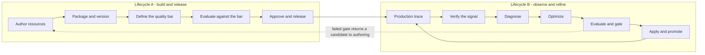

Lifecycle B is the concrete six-stage refinement path documented in
[The Refinement Loop](refinement-loop.md) and mapped to the seven-term canonical
chain in [ARCHITECTURE.md](../ARCHITECTURE.md) section 2. Those two sources
describe **Verify** and **Apply** as its human decision points. Both are live,
separately-exercised routes today, but not evenly: **Apply** governs every
job, while **Verify** (`P3-B`, section 16) only reaches a manually-flagged
concern — the four paths that create most refinement jobs still self-verify
inline, unchanged by `P3-B`. Section 2.2 has the full account.

### 1.1 The four development cycles

The two lifecycles are the shape. What a team experiences day to day is four
nested cycles with different cadences and owners. Confusing them is why "the
development cycle" can feel unanswerable.

| Cycle | Cadence | Owner | What gates it | Stages |
| --- | --- | --- | --- | --- |
| **Inner** — author and run | Minutes | Developer | Nothing. It must run, that is all | 1–2 |
| **Quality** — review, evaluate and fix | Hours to days | Developer + selected technical-review backend + QA | Head checks, technical approval, regression gate, then QA sign-off | 3–8, plus rework |
| **Release** — stage, approve and ship | Per release | Admin + QA | Staging verification, then distinct-actor production decisions | 9–10 |
| **Refinement** — observe and improve | Continuous, production-driven | QA verifies, platform optimizes, Admin applies | The same regression gate | 11–13, plus rework |

Three properties matter more than the stage list:

- **The inner cycle must stay ungated.** An evaluation gate on a developer's
  edit-and-run loop is the fastest way to make people stop using the platform.
  Gates belong at the quality and release cycles, never at authoring.
- **The refinement cycle reuses the quality cycle's gate** rather than having
  its own. An improvement proposed by an optimizer is held to exactly the same
  bar as one authored by a person, which is why the two lifecycles converge at
  package review and QA evaluation instead of running in parallel.
- **Only the release cycle is calendar-driven.** The other three run at whatever
  rate work arrives. Planning a release train around the inner or refinement
  cycle is planning around something you do not control.

## 2. Roles and responsibilities

### 2.1 Job functions are not permission roles

Most confusion about "who does what" comes from conflating two things:

- A **job function** is what a person does: developer, QA, release manager,
  admin, stakeholder. In a small team one person wears several hats.
- A **permission role** is what the system enforces. A role earns its existence
  only when it gates a decision that a *different human* must make.

There are six job functions and **four** permission roles, because **technical
Reviewer** and **release manager** are change-scoped functions, not permanent
roles. A Reviewer is an eligible Developer or Admin assigned to one Change
Request; release manager is what Admin does at stages 9 and 10. Adding stored
roles for either function would increase standing authority without creating a
new security boundary.

Four stored roles; three that do work; one that watches. The role literals
already exist in
[`resource_access.py`](../caliber/src/caliber/resource_access.py); the product
labels are what users should see.

| Product label | Stored role | Charter | Owns | Does not do |
| --- | --- | --- | --- | --- |
| **Developer** | `editor` | Builds the thing | Authors runtime resources — prompts, workflows, tools, skills, knowledge bases. Runs them. Creates packages and Change Requests, reviews another developer's request when assigned, requests release and may apply to development. **Fixes what fails and adds the regression test.** | Technically approve their own Change Request; quality-sign or finally approve; apply to QA/staging/production; manage members; register an agent (admin-gated today — see section 2.5) |
| **QA** | `reviewer` | Owns the quality bar and the human quality gate | Authors test sets, scorers, judges, thresholds. Runs evaluations. Verifies production signals. Files feedback. Signs off — or rejects with a reason. | Edit runtime resources; give final release approval; apply a release; manage members |
| **Admin** | `owner` | Owns access and the release | Membership and roles. Workspace settings. Assigns Change Request reviewers. Acts as **release manager**: gives final approval and starts protected-environment apply, reconcile, and rollback operations. One Admin is the accountable primary owner; additional Admin collaborators are allowed. | Technically approve or finally approve a change they authored or requested themselves; bypass a failed machine gate |
| **Viewer** | `viewer` | Reads, changes nothing | Resources, evidence, release history, audit. | Anything else |

Environment is a scope on an action, not a role. The product label **QA** names
a person with the stored `reviewer` role; lowercase **`qa`** names a runtime
environment. **Reviewer** with a capital R means a per-Change-Request technical
review assignment. It does not introduce a fifth role or make the QA role a
source-code approver by implication.

With `review_backend=source_provider`, a provider approval counts only when its
human actor is explicitly linked to an active CALIBER Developer/Admin member,
has the required live global scope, did not author/import the covered change,
and remains eligible at evaluation time. The provider may require additional
reviewers or teams; every covered PR/MR must satisfy the CALIBER external-review policy and
include at least one mapped, eligible non-author approval. CALIBER never turns a
bot or unmapped external collaborator into a Workspace role. QA and Admin
decisions are always CALIBER-native.

### 2.2 Why QA earns a role here when it does not elsewhere

Section 2.6 found no dedicated QA system role in the reviewed products' official
documentation as of September 2026. That bounded observation is not proof that
no product or custom role provides the function. CALIBER's case for a fixed QA
role comes from its own architecture rather than from a universal industry
claim:

**CALIBER's implemented loop contains two human quality gates that are not
authoring actions, one of them only partly reaching the traffic it is meant
to govern.** Stage ⑤ **Apply** — `POST /jobs/{id}/apply` — is real: a
distinct, separately-callable decision, gated by `caliber.operator`, that a
human takes on an already-existing job. That alone does not require QA; an
operator applying their own job is exactly the self-approval problem
section 5.1 names.

Stage ① **Verify** — "is this production failure real?" — is where the case
for a *separate* role, rather than a second permission on the same actor,
actually comes from: the design calls for production-driven triage that is
not the same click as authoring or applying a fix. `P3-B` (section 16) gave it
a real route: `POST /verification-queue/{item_id}/verify`, gated by
`caliber.operator`, distinct from and callable after item creation. It is
genuinely a separate action today for a *manually*-flagged concern.

It does not yet reach the traffic that matters most. The four code paths that
create a refinement job (prompt optimization, skill calibration, workflow
calibration, an Aria-proposed promotion) are unchanged by `P3-B` and still
insert the verification row pre-`status="verified"`, stamped with the same
operator's own identity, in the same transaction that creates the job — the
`verify` route is never in that path. There is also still no ingestion path:
the model's own docstring calls for "the feedback poller," and none exists, so
a `pending` item only appears when a human creates one by hand through the new
route. And verifying an item does not create a `CaliberRefinementJob` — see
`caliber/src/caliber/routes/verification.py`'s module docstring for why that
was deliberately deferred rather than half-built.

So the honest state is narrower than either "not implemented" or "done": a
human can verify a manually-flagged concern as a decision distinct from
authoring it, which is what this section's argument needs to be true, but the
majority of today's refinement jobs still bypass that gate entirely by
self-verifying at creation, and Verify does not yet connect to Diagnose the
way Apply connects backward to a real job. Section 3.6 documents the
still-open half of this — the ingestion path and the job link — which shares
the review's designed-but-unwired shape one stage later in the loop.

### 2.3 QA is operator-scoped but narrower than Developer

This is the most important correction against the earlier documents. Everything
QA needs to do is gated today by `SCOPE_OPERATOR`:

| QA action | Current gate |
| --- | --- |
| Create a test set | `routes/eval_datasets.py` — `SCOPE_OPERATOR` |
| Create a judge or scorer, or edit its content | `routes/judges.py` — `SCOPE_OPERATOR` |
| Run an evaluation | `routes/evaluations.py` — `SCOPE_OPERATOR` |
| Create a review queue / enqueue items to it | `routes/review_queues.py` — `SCOPE_OPERATOR` |
| Submit a review-queue answer (file feedback) | `routes/review_queues.py` `submit_item` — `SCOPE_OPERATOR` |

`submit_item` is the action that actually writes feedback: it takes a
reviewer's answers and, outside the request transaction, calls
`mlflow.log_feedback` / `mlflow.log_expectation` on the covered trace. It
previously required only `require_user` — any authenticated caller, including a
bare `caliber.viewer`, could cause MLflow assessments to be written — found
during this review and fixed to match every sibling write in the same module.

Judge editing was the other asymmetry this review found and has since closed:
`update_judge` required `caliber.admin` for every field, including a judge's
own `instructions`, with no operator-reachable edit at all. It is now split —
content fields (`description`, `instructions`, `model`, `feedback_value_type`,
`tags`) need `caliber.operator`; a request that includes `status` (archive,
the delete-equivalent for a judge) still needs `caliber.admin`, checked before
either field lands. The lookup that used to be a bare `session.get()` — safe
only because admins bypass visibility filtering by design — now goes through
`get_visible()`, the same fix `test_run_judge` in the same file already had
for the identical reason (a judge's instructions are its authored grading
logic; an unscoped read handed any signed-in caller another project's).

A second, structurally distinct queue exists for the same job — signal triage
rather than annotation — and (as of `P3-B`, section 16) is more complete than
a scope table alone can show: `CaliberVerificationItem`
(`caliber_verification_queue`) has a registered `POST
/caliber/verification-queue` and `POST
/caliber/verification-queue/{item_id}/verify`, both `SCOPE_OPERATOR`-gated,
for a *manually*-flagged concern. What that route still does not reach is the
majority path: the four `SCOPE_OPERATOR`-gated job-creation paths (prompt
optimization, skill calibration, workflow calibration, an Aria-proposed
promotion) are unchanged and still insert their own item pre-`verified`,
self-stamped by the same actor, as bookkeeping for the job they already
started — not a human filing feedback on a signal, and not a decision distinct
from creating the job. Section 2.2 covers what this split state means for the
case for a QA role.

Global scope inheritance is asymmetric: `caliber.admin` implies approver,
operator and viewer, while **`caliber.approver` implies only `caliber.viewer`**.
It does not imply operator. An approver-only user can currently approve or
reject a visible gated workflow promotion, but cannot create quality
definitions, run evaluations, file feedback, import, or execute. That is not a
complete QA capability.

QA therefore needs both `caliber.operator` and `caliber.approver`, with
runtime-write subtracted at the project-role layer. Operator permits evidence
authoring and evaluation; approver permits the human quality decision. The same
person may be present in both configuration lists because effective authority is
the intersection with the stored workspace role.

**This makes isolation closure a hard prerequisite for shipping QA.** The
mutating prompt routes check global scope only, with no project-role
consultation. Grant QA `caliber.operator` before that changes and QA can edit
prompts — a role that looks restricted while being fully privileged.

### 2.4 Canonical action registry and scope requirements

The current registry has seven actions — `read`, `project.update`,
`project.manage_members`, `resource.write`, `resource.publish`,
`resource.approve`, `resource.execute` — with no way to express "may author
evidence but not runtime artifacts", and no feedback verb at all.

The target registry below is authoritative. Route documentation must use these
exact literals; do not introduce `workspace.read`, `workspace.admin`, or another
alias vocabulary. Existing actions retain their names where their meaning is
unchanged, which keeps `require_project_access` a viable compatibility wrapper.

| Action | Developer | QA | Admin | Viewer | Required global scope(s) |
| --- | :---: | :---: | :---: | :---: | --- |
| `project.create` — pre-membership bootstrap | | | | | **both** `caliber.operator` and `caliber.approver` |
| `read` | Y | Y | Y | Y | `caliber.viewer` |
| `project.update` — name and description only | Y | | Y | | `caliber.operator` |
| `project.archive` / `project.restore` | | | Y | | `caliber.operator` |
| `project.manage_members` / `project.transfer_owner` | | | Y | | `caliber.operator` |
| `source.manage` | | | Y | | `caliber.operator` |
| `resource.write.runtime` — prompts, workflows, tools, skills | Y | | Y | | `caliber.operator` |
| `resource.write.evidence` — test sets, scorers, judges | Y | Y | Y | | `caliber.operator` |
| `resource.execute` — run tests, evals, workflows | Y | Y | Y | | `caliber.operator` |
| `feedback.submit` — verify signals, flag traces | Y | Y | Y | | `caliber.operator` |
| `resource.publish` — compatibility path, development only for Developer | Y** | | Y | | `caliber.operator` |
| `revision.import` / `revision.create` | Y | | Y | | `caliber.operator` |
| `change_request.create` / `change_request.update` | Y* | | Y* | | `caliber.operator` |
| `change_request.comment` | Y | Y | Y | | `caliber.operator` |
| `change_request.review` | Y* | | Y* | | `caliber.operator` |
| `change_request.manage` — assign reviewer, close administratively | | | Y | | `caliber.operator` |
| `environment.manage` | | | Y | | `caliber.operator` |
| `release.request` | Y | | Y | | `caliber.operator` |
| `release.evaluate` | Y | Y | Y | | `caliber.operator` |
| `release.quality_signoff` | | Y* | | | `caliber.approver` |
| `release.approve` | | | Y* | | `caliber.approver` |
| `release.apply` | Y** | | Y | | `caliber.operator` |
| `release.rollback` / `release.reconcile` | | | Y | | `caliber.operator` |
| `release.break_glass_apply` — no ordinary role grant | | | | | `caliber.admin`, interactive credential, explicit recovery policy |
| `rework.update` — claim, resolve, or reassign under task policy | Y* | | Y | | `caliber.operator` |

`Y*` — a Developer may update only a Change Request they opened and a rework
task assigned to them; an assigned Developer or Admin Reviewer may not review a
Change Request whose current head they authored or imported; QA may not
quality-sign-off a runtime/source change they authored; Admin may not finally
approve a release they authored or requested. `Y**` — Developer may apply only
to development. See section 5.

The minimum global-scope assignments are therefore Developer =
`caliber.operator`; QA = `caliber.operator` + `caliber.approver`; Workspace
Admin = `caliber.operator` + `caliber.approver`; Viewer = `caliber.viewer`.
`caliber.admin` remains a platform-operations scope and does **not** imply
workspace membership or ownership. This is a deliberate change from today's
`project_role()` bypass and requires an audited, explicit break-glass path for
platform recovery.

The two-scope requirements are conjunctions. Today's `require_scopes()` accepts
**any** listed scope, so it must not be reused to enforce Admin eligibility.
The central decision service needs an `all(required_scopes)` check (or a
separately tested `require_all_scopes()` helper). Workspace creation, assigning
an Admin or QA role, and ownership transfer reject a target whose live platform
scopes are insufficient. Workspace Admin manages membership; platform identity
configuration still controls global scopes in this single-tenant MVP.

`resource.write` splits because the resource classes already exist in section
6.4, which separates authored runtime assets from evidence assets. The taxonomy
is there; it is simply not wired to a permission.

`feedback.submit` and every action after it that is not in today's seven-action
registry are new. There is no existing action for it to ride on: as section 2.3
details, submitting review-queue feedback today calls neither
`require_project_access` nor any project action, only `require_user`, so
`resource.write` is not actually the gate — the gate is closer to none.
`feedback.submit` therefore does not need to be carved out of `resource.write`
so much as it needs to exist at all before isolation closure (Phase 2) can give
this route a project-role check without accidentally making QA's floor
`caliber.viewer`-equivalent forever. Unknown action literals deny and fail a
contract test; they never fall back to a broader action.

`project.create` is the deliberate exception to role intersection because no
Workspace membership exists yet. It is authorized by the conjunction of the
two listed global scopes, and successful creation atomically gives the creator
the primary-owner relationship plus an `owner`-role Admin membership.

For every other row, `Y` means the workspace role permits the action *before*
global-scope, environment-policy, and release-instance checks. The effective
decision is:

```text
effective decision =
    authenticated principal
  AND credential/global-scope ceiling
  AND credential workspace ceiling, when present
  AND active workspace membership/role
  AND resource belongs to or is pinned by workspace
  AND environment policy
  AND release-instance rules
```

### 2.5 Resource families: who creates, edits, and releases what

The action vocabulary above is deliberately abstract. This section resolves it
per resource family, because **"release" does not mean the same thing for every
family, and three families have no release step at all.** The per-family
guarantees below are the ones recorded in
[ARCHITECTURE.md](../ARCHITECTURE.md) section 4, not an idealization.

#### 2.5.1 What each family is, and what releasing it means

| Family | Class | How it versions | What "release" means for it | Rollback |
| --- | --- | --- | --- | --- |
| **Prompt** | runtime | Immutable MLflow registry versions behind an alias | Move the live alias to a version. Intent-first: the release intent with exact before/after versions is committed *before* the MLflow mutation | Yes — reconcilable, exact prior version |
| **Workflow** | runtime | Editable drafts → published version rows | Point a deployment alias at a published version, under deploy-gate policy with an optimistic alias check | Yes — pops the deployment's checkpoint stack |
| **Skill** | runtime | Mutable current record + immutable version snapshots | Select a snapshot as current | Yes — restores the prior snapshot **as a new current version** |
| **Knowledge base** | grounding | Immutable build versions behind `active_version_id` | Audited activation of a build | Yes — prior active build derived from history |
| **Agent** | runtime | Mutable configuration record; no immutable version model today | Not independently released. A Workspace revision must snapshot its runtime configuration; `enabled` remains the workspace-level pause/resume lever workers read | n/a — toggle `enabled` |
| **Tool** | runtime | Separate `(name, version)` registry rows, but supported edits mutate the row in place | **No release.** A Workspace revision must snapshot the canonical tool definition; there is no live alias | **None** |
| **Test set** | evidence | Version counter plus example validity intervals | **No release.** It *is* evidence; it is carried with a release, never deployed | **None** |
| **Judge / scorer** | evidence | Mutable operator-authored row, reusable via a `Judge.<id>` token | **No release.** It is a scorer, but a revision needs an immutable definition snapshot | n/a |
| **MCP server** | integration | Mutable managed definitions with discovered tool inventories | Connection plus policy binding, fail-closed; production workflow preflight | **No version rollback** |
| **OpenAPI integration** | integration | Contract snapshot | Validate and preflight; environment binding controls use | Re-bind a prior snapshot |

Two consequences follow, and both matter for role design:

- **A role cannot hold a uniform "release" permission**, because for tools, test
  sets and judges there is nothing to release, and for agents the lever is a
  boolean rather than a version. An external-provider `release.apply` child
  effect is meaningful only for prompt, workflow, skill, knowledge base, and
  supported integration bindings; other required items are still verified and
  bound through the environment's revision pointer.
- **Rollback is not universal either.** Tools and test sets have none, and MCP
  servers have no version rollback. A release plan that assumes every item is
  reversible is wrong; the adapter contract in section 8.2 returns a typed
  refusal precisely so that this is explicit rather than silently skipped.
- **A version-looking label is not immutability.** Tool and judge definitions,
  and the Agent configuration, need content-addressed snapshots before a ready
  Workspace revision may depend on them.

#### 2.5.2 Create, edit, release, delete — by role

Target state. `Y` = permitted by the workspace role, before global-scope,
environment-policy and release-instance checks. `—` = not permitted.

| Resource | Create | Edit | Release / activate | Delete |
| --- | --- | --- | --- | --- |
| Prompt | Dev, Admin | Dev, Admin | **Admin** (Dev to development only) | Admin |
| Workflow | Dev, Admin | Dev, Admin | **Admin** (Dev to development only) | Admin |
| Skill | Dev, Admin | Dev, Admin | **Admin** (Dev to development only) | Admin |
| Agent | Dev, Admin | Dev, Admin | n/a — `enabled` toggle: Admin | Admin |
| Tool | Dev, Admin | Dev, Admin | n/a — no release | Admin |
| Knowledge base | Dev, Admin | Dev, Admin | **Admin** (Dev to development only) | Admin |
| MCP server | Admin | Admin | **Admin** (connection plus policy binding) | Admin |
| OpenAPI integration | Dev, Admin | Dev, Admin | **Admin** (Dev to development only) | Admin |
| **Test set / eval dataset** | **QA**, Dev, Admin | **QA**, Dev, Admin | n/a — evidence | Admin |
| **Judge / scorer** | **QA**, Dev, Admin | **QA**, Dev, Admin | n/a — evidence | Admin |
| **Evaluation run** | **QA**, Dev, Admin | — (immutable result) | n/a | Admin |
| **Feedback / verification item** | **QA**, Dev, Admin | **QA** (verify, dismiss) | n/a | Admin |
| Release request | Dev, Admin | — | — | — |
| Release quality sign-off | **QA** — never a runtime/source change they authored | — (immutable decision) | — | — |
| Final release approval | Admin — never work they authored or requested | — (immutable decision) | — | — |
| Workspace revision | Dev, Admin (snapshot or import) | — (immutable once ready) | — | — |
| Environment policy | Admin | Admin | n/a | — |
| Members and roles | Admin | Admin | n/a | Admin |
| Secrets | platform admin | platform admin | n/a — referenced, never copied | platform admin |
| Runs, traces, audit | produced by execution | — (append-only) | n/a | — retention only |

The pattern to notice: **QA's write authority is confined to the evidence rows**
— test sets, judges, scorers, evaluation runs, feedback, and its own sign-off.
Evaluation runs and sign-offs are release evidence created *after* a revision;
they are not pinned into the revision they evaluate. QA creates nothing runtime
and releases nothing. That is the whole content of the
`resource.write.evidence` versus `resource.write.runtime` split.

#### 2.5.3 What the same table looks like today

Nothing above is enforced per-role yet, because there is no per-resource role
check — only the four global scopes. The honest current state, verified route
by route rather than assumed from the family's general reputation — several
rows in an earlier version of this table were wrong in exactly the way a reader
would not think to double-check, because "create" and "edit" were folded into
one cell and only "create" was actually checked:

| Resource | Create | Edit | Release / activate | Delete or archive | Reachable by Developer (`caliber.operator` only)? |
| --- | --- | --- | --- | --- | --- |
| Prompt | operator | operator | operator | admin | Yes — including release |
| Workflow | operator | operator | operator, by shipped default¹ | — | Yes, today¹ |
| **Skill** | operator | **admin** | **admin** (same action as edit) | admin | **Create only** |
| **Tool** | **admin** | **admin** | n/a | admin | **No** — operator can test/calibrate an already-registered tool, not register or edit one |
| Knowledge base | operator | operator | operator | operator | Yes — including release |
| Agent | admin | admin | n/a | admin | No — admin-gated |
| MCP server | admin | admin | admin | admin | Partly — operator only for test-case authoring/calibration on an already-registered server |
| OpenAPI integration | operator² | operator² | **project-role `resource.publish`³**, admin fallback for an org-wide integration | admin (archive) | Yes for create/edit/import/draft; release depends on project role, not global scope |
| **Test set / eval dataset** | operator | **operator for example content; admin for the dataset record itself** (rename, describe, tag, archive) | n/a | admin (folded into edit — no separate delete route) | Partly — content yes, dataset metadata no |
| Judge / scorer | operator | operator for content; **admin for `status`** (archive, folded into the same endpoint — no separate delete route) | n/a | admin | Yes for content; archive stays admin-only |
| Evaluation run | operator | — (immutable) | n/a | — (no delete/cancel exists at any scope) | Yes |
| Feedback: review queue itself | operator | admin | n/a | — | Yes to create/enqueue only |
| Feedback: review-queue answer | operator | — | n/a | — | Yes |

¹ `promote_deployment`'s required scope is computed at request time —
`SCOPE_ADMIN if requires_human_approval(alias, config) else SCOPE_OPERATOR` —
not a flat grant. It resolves to operator for every alias only because
`GATED_ALIASES` is a hardcoded empty set and
`release_require_human_approval_for_environment_classes` defaults to `""`. One
config value, no code change, makes promoting a given environment class
admin-gated; a Developer's release reach here is a deployment setting, not a
code guarantee, unlike Prompt's.

² Not "mixed operator/admin" — every create/edit/import/draft route here is
literally `require_scopes(request, [SCOPE_ADMIN, SCOPE_OPERATOR])`, and
because `require_scopes` grants on any listed scope while `caliber.admin`
already implies `caliber.operator` (section 2.3), that list is functionally
identical to `[SCOPE_OPERATOR]` alone. Every one of those actions is 100%
reachable by a plain Developer; there is no admin-only-to-the-exclusion-of-
operator action in this family's create/edit surface.

³ `publish_openapi_tool_draft` calls `require_project_access(...,
"resource.publish")` for a project-scoped integration — a project-role check
(`owner`/`editor`, resource_access.py), independent of global scope — and only
falls back to a hard `caliber.admin` check when the integration has no
`project_id`. "Release: `caliber.admin`" described the fallback path, not the
common one.

Four facts in that table are the reason this document argues what it does:

1. **A Developer can release a prompt or a workflow today.** `resource.publish`
   and the apply path are not separated from authoring in practice, so the one
   boundary consistently visible in the reviewed systems — author versus
   deployer — is not enforced here yet.
2. **`caliber.approver` is not a complete QA boundary.** It currently gates
   workflow-promotion approval/rejection and participates in assistant autonomy
   readiness, but quality-definition creation and evaluation still require
   `caliber.operator`, while release-candidate signoff requires
   `caliber.admin`. The project-level `resource.approve` action is not consumed
   by those approval routes.
3. **Agent registration is admin-only.** `register_agent`, `update_agent` and
   `delete_agent` all require `caliber.admin`, so a Developer cannot create the
   record that prompts, jobs and approvals hang off. That is either a deliberate
   guard worth keeping or an accident worth fixing, and Phase 0 should decide
   which — but the target table above assumes it becomes a Developer action,
   since authoring an agent is authoring.
4. **Create-then-stranded was a repeated pattern, not one family's quirk —
   and one instance of it has since closed.** Skill and Tool still let a
   Developer create the resource and then require `caliber.admin` for every
   subsequent edit. Judge/scorer had the same shape (admin-only for every
   field, including its own instructions) and this review fixed it: content
   edits are now `caliber.operator`, with the fix's own review finding a
   second issue baked into the first — the route's bare `session.get()` was
   safe only because it required admin, and widening the scope without also
   routing the lookup through `get_visible()` would have handed a plain
   Developer another project's judge instructions by id, the exact defect
   `test_run_judge` in the same file was already audited and fixed for once.
   A role table that only checks the create endpoint of each family, as an
   earlier version of this one did, will systematically overstate what a
   Developer can actually do with what they made. The target table in 2.5.2
   assumes edit rejoins create at `Dev, Admin`; today's code still does not,
   for two of ten families.

#### 2.5.4 Functionality by role, end to end

| Capability | Developer | QA | Admin | Viewer |
| --- | :---: | :---: | :---: | :---: |
| Browse resources, evidence, history, audit | Y | Y | Y | Y |
| Author prompts, workflows, tools, skills, KBs | Y | — | Y | — |
| Author test sets, judges, scorers, thresholds | Y | Y | Y | — |
| Run a workflow or agent | Y | Y | Y | — |
| Run an evaluation against a test set | Y | Y | Y | — |
| Verify a production signal is real | Y | Y | Y | — |
| File feedback on an output | Y | Y | Y | — |
| Deploy to development | Y | — | Y | — |
| Create a workspace revision (snapshot or import) | Y | — | Y | — |
| Open/update a Change Request | Y* | — | Y* | — |
| Technically review an assigned Change Request | Y* | — | Y* | — |
| Comment on a Change Request | Y | Y | Y | — |
| Request a release | Y | — | Y | — |
| Sign off on release quality | — | Y* | — | — |
| Give final release approval | — | — | Y* | — |
| Apply to development | Y | — | Y | — |
| Apply to QA/staging/production; reconcile or roll back | — | — | Y | — |
| Configure environment policy | — | — | Y | — |
| Manage members and roles | — | — | Y | — |
| Transfer ownership, archive the workspace | — | — | Y | — |
| Manage secrets, providers, storage | — | — | platform admin | — |

`Y*` — the Change Request owner may update only their own request; an assigned
Reviewer cannot approve a head they authored or imported; QA cannot sign off a
runtime/source change they authored; Admin cannot finally approve work they
authored or requested.

### 2.6 How this compares to shipped platforms

A survey of the RBAC actually shipped by LangSmith, Braintrust, Humanloop,
Weights & Biases, Databricks/MLflow, Azure AI Foundry, Vertex AI, Bedrock, Dify,
Langflow, Flowise, Langfuse and OpenAI produced one uncomfortable finding and
several supportive ones. The uncomfortable one first.

**The official role sets reviewed did not include a dedicated QA role.** This is
a time-bounded comparison, not a claim about every product or every custom-role
configuration. In the reviewed systems, evaluation is generally available to
an authoring/member role while deployment receives the stronger guard:

- Humanloop's `Member` — its lowest real role — could create evaluators and
  datasets and run evaluations. What was withheld was **deployment**.
- Azure AI Foundry's `Foundry User` is the build-and-test developer role;
  publishing an agent requires `Foundry Project Manager` at minimum.
- W&B lets any Member add model versions but only registry admins move a
  **protected alias**.
- Databricks deployment jobs can place approval between evaluation and
  deployment.

**The boundary the industry most often enforces is author versus deployer, not
author versus tester.** If CALIBER enforces only one boundary, that is the
load-bearing one. CALIBER has some of the necessary seams — a project
`resource.publish` action, gated workflow promotions, release operations, and
separate apply routes — but they are not one consistently enforced boundary
today.

Consequently: if QA were defined as "Developer who cannot deploy," it would not
be QA at all — Humanloop called that `Member` and Azure calls it `Foundry User`,
and both treat it as the *default* developer tier. Section 2.2 is the reason
this platform is different.

The QA role is therefore defensible on **governance** grounds:

- NIST AI RMF 1.0 states that AI actors performing testing, evaluation,
  verification and validation should be separated as a best practice, "with
  those building and using the models separated from those verifying and
  validating the models."
- The two shipped precedents for a genuine review tier come from *annotation*
  platforms: Label Studio Enterprise's `Reviewer` and Argilla's `annotator`.
  Both are defined by assignment-scoped visibility plus a review verb distinct
  from the authoring verb.

Adopt it knowingly. And note the counter-argument honestly: credible
practitioner guidance holds that error analysis is the single most valuable
activity and that outsourcing it is a mistake, with quality owned by one domain
expert rather than a separate function. Both camps are coherent; which applies
depends on whether the deployment is regulated.

**What the survey supports strongly:**

- **Resource-type scoped permissions are shipping and validated.** MLflow's own
  self-hosted RBAC is literally `(resource_type, resource_pattern, permission)`
  with `prompt` and `scorer` among its resource types — so "may edit scorers but
  not prompts" is directly expressible in the system CALIBER already builds on.
  Braintrust has `restrict_object_type`, LangSmith namespaces every permission
  by resource type, and Dify ships a `dataset_operator` role defined purely by
  resource-type restriction. The split in section 2.4 is a well-attested
  pattern, not an invention.
- **Approval does not belong in the role enum.** The only native
  separation-of-duty implementation in the survey is Databricks' MLflow 3
  deployment jobs, where approval is a *tagged pipeline gate*: a task named
  `Approval_*` passes only when a tag is set by a principal holding `APPLY TAG`,
  and a tag policy can block the model owner from approving their own job.
  Independent gates compose. That is a per-instance permission plus policy —
  exactly the conclusion section 5 reaches independently.
- **Do not put environment into the role.** LangSmith supports workspace-level
  isolation and finer-grained environment restrictions through attributes. For
  CALIBER, keeping development, QA, staging and production inside one workspace is
  the minimal model because it promotes one aggregate revision without copying
  resources or memberships between containers.
- **The failure mode predicted for a QA tier has been observed elsewhere.** In
  LangSmith, `Workspace Editor` lacks `projects:create`, which silently blocks
  running experiments, and `Workspace Viewer` lacks `feedback:create`, so it
  cannot annotate. That is the same class of bug section 2.3 identifies here: a
  quality tier must be verified against the *create* permissions its workflows
  need, not just the read ones.

One decision to make explicitly, since the two most relevant systems differ:
current MLflow RBAC folds grants with `max()` and has **no explicit deny**, while
LangSmith supports finer-grained policy restrictions. CALIBER's MVP uses
grant-narrowly plus deny-by-default: a role action must be present and every
scope, membership, resource, environment and release predicate must pass. It
does not add arbitrary explicit-deny rules in the MVP.

## 3. The pipeline

Stage by stage: who acts, what moves, what gate must pass, where a failure goes,
and whether CALIBER implements it today.

| # | Stage | Actor | Artifact / output | Gate to pass | On failure goes to | Today |
| --- | --- | --- | --- | --- | --- | --- |
| 0 | Provision | Eligible Workspace creator, becoming primary Admin | Workspace, primary-owner membership, fixed environments | Creator has both required scopes; transaction is atomic | — | Partly — projects + owner membership exist; scope conjunction and environments are proposed |
| 1 | Author | Developer | Prompts, workflow manifest, tools, skills | — | — | Implemented per family |
| 2 | Smoke-run | Developer | Trace of a successful run | Runs without error | Developer | Implemented |
| 3 | Define the quality bar | **QA** | Test sets, scorers, judges, thresholds | Bar is reviewable and reconstructably pinned | — | Partly — datasets are reconstructably versioned; judges are mutable and need snapshots |
| 4 | Package and pin | Developer or CI automation user with project-bound PAT | One digest-pinned application package (`WorkspaceRevision`) tied to retained source | Manifest validates; every pin is reconstructable | Developer | **Proposed** — workspace revision |
| 5 | Submit change | Developer | Change Request with accepted-base revision, immutable head revision, proposed semantic version, selected review backend, and native Reviewer assignment or provider references | Head is ready; base is current; version reservation is unique; backend prerequisites exist | Developer | **Proposed** — Change Request |
| 6 | Technical review | Native assigned **Reviewer**, or mapped provider reviewers for every PR/MR covering the source delta | Native comments/checks/review or provider attestations bound to the exact head generation and digest | Required fast checks pass and selected backend proves complete non-author review | **Developer**, through a new package/head generation | **Proposed** |
| 7 | QA candidate | **Admin** applies; **QA** evaluates | Same package in the protected `qa` environment; scores per dimension vs baseline | **Regression gate** — section 4 | **Developer**, with gate reasons and a rework task | **Proposed** for aggregate revisions; current evaluation primitives are reusable |
| 8 | Quality sign-off and acceptance | **QA** | Digest-bound verdict; `go` accepts the package version, `no_go` records a reason | QA accepts the exact QA evidence and is distinct from the runtime/source author | **Developer**, through a new package/head generation | **Proposed** |
| 9 | Stage | **Admin** | Accepted package applied to staging; integration/smoke evidence | Exact accepted digest passed QA; staging checks settle | Developer, QA, or Admin per reason | **Proposed** aggregate release; individual mechanisms partly exist |
| 10 | Production approval and promote | **Admin** | Fresh final approval, then production environment pointer moves | Same staged digest; production gates pass; Admin is distinct from originator/requester | Admin — reconcile or roll back | Partly — individual paths exist; aggregate release proposed |
| 11 | Online evaluation | Platform + QA | Sampled scores, assessments, incidents | Alert thresholds | QA triages | Partly — traces, assessments and SLO primitives exist; aggregate revision/environment lineage is proposed |
| 12 | Feed back | **QA** | Verified failure becomes an eval example | — | — | Implemented (harvested examples) |
| 13 | Refine | Platform | New candidate via optimizer | Same gate as stage 7 | **Developer**, after N bounded attempts | Partly — refinement and GEPA exist, but automatic retries default off and exhaustion creates no owned task |

Stages 11 through 13 are Lifecycle B — the part CALIBER does best. They close
the loop back to package/review rather than restarting the application from
scratch.

Read the "on failure" column as the load-bearing part of the process. A pipeline
is defined by what it does when something fails, and every quality failure
converges on the same owner: **the Developer fixes it, adds a regression test,
creates a new immutable revision, updates the Change Request head, and then
re-enters at stage 6.**

### 3.1 The one artifact that does not exist yet

Stage 4 is the gap. `workspace.yaml` appears in **zero** source files — it is
proposal-only. What can be versioned today:

| Family | Versioned unit | Promotion mechanism |
| --- | --- | --- |
| Prompt | MLflow prompt version | Mutable alias (`prod`) at an immutable version |
| Workflow | `CaliberWorkflowVersion` (draft or immutable manifest) | `CaliberWorkflowDeployment` alias + promotion |
| Skill | Immutable skill version | Selected active version |
| Tool | `(name, version)` registry row whose definition can still be edited | No live alias; not an immutable historical pin |
| Knowledge base | KB build | Activated build |

Each family versions and promotes itself. **Nothing versions the application.**
You cannot today answer "which exact prompt, workflow, tool and test-set
versions constitute release 12" with one identifier — the question a release
manager needs answered, and the reason the workspace revision digest exists.

### 3.2 The PR-like application lifecycle

The missing collaboration object is a **Change Request**. It is similar to a
Git pull request in purpose, but it does not merge mutable provider state. It
compares one immutable base package with one immutable head package and carries
the exact head into QA. Technical source checks, comments and review are either
native CALIBER records or a complete normalized attestation set from the
configured Git provider—never two competing approval systems.

| Source-development idea | CALIBER lifecycle equivalent | Mutability rule |
| --- | --- | --- |
| Commit | Workspace revision / application package | Immutable after `ready`; addressed by `WSR-*`, revision number and SHA-256 digest |
| Branch | Developer's mutable drafts or Git branch | May change freely; never a release identity |
| Pull request | Workspace Change Request, optionally linked to the provider PRs/MRs covering its source delta | CALIBER package/promotion envelope around append-only immutable head generations |
| Review/check run | Native Change Request review/check or provider attestation | Exactly one technical-review backend; evidence is bound to exact head generation + digest |
| Merge | Accept package after technical approval and QA `go` | Compare-and-set accepted baseline from base to head; no bytes are rewritten |
| Release tag | Semantic version such as `1.4.0` | Immutable mapping to one package digest |
| Deployment/environment | `dev`, `qa`, `staging`, or `prod` current-release pointer | Mutable only through audited apply/rollback operations |

The lifecycle is deliberately three-layered:

1. **Package identity** answers *what exactly is this application?* A ready
   `WorkspaceRevision` is the application package: the canonical manifest,
   retained source snapshot, exact resource versions/snapshots, model/runtime
   dependency pins and content digests. It is immutable and reconstructable.
2. **Change review** answers *should this package replace the currently
   accepted application baseline?* A Change Request records base, current head,
   head history, native or provider technical-review evidence, and QA outcome.
3. **Environment release** answers *where is that exact package running, under
   which configuration, evidence and approval?* A `WorkspaceRelease` plus its
   operations moves an environment pointer. It never mutates the package or
   semantic-version tag.

The package is a logical content-addressed manifest, not a second monolithic
archive that duplicates MLflow, object storage and domain tables. Its canonical
descriptor contains `schema_version`, `project_id`, source mode/commit/tree
digest/snapshot reference, and resource entries sorted by
`(resource_type, logical_name)` with exact version reference, content digest,
snapshot reference and adapter version. Runtime-model dependencies are ordinary
closed-type entries. Secret values and environment configuration are excluded.
Using the repository's existing formatting
[`canonical_json`](../caliber/src/caliber/workflows/manifest.py)
convention—UTF-8, lexicographically sorted object keys and
`separators=(",", ":")`—extended with schema rejection of NaN/infinity and no
implicit `default=str` coercion, the package identity is:

```text
revision_sha256 = SHA-256(canonical_json(package_descriptor))
```

The descriptor and every referenced content-addressed snapshot are retained.
If exportable bundles are added later, they are transport representations and
must recompute to the same descriptor digest. This keeps one authoritative
package without copying every governed document into CALIBER.

#### Concurrent development and candidate locking

Opening a Change Request freezes its **head package**, not the Workspace. The
Developer may immediately continue editing or importing new work. Those edits
produce a new package with a new revision number and digest; they cannot alter
the package already under review or running in QA.

If review or QA requests changes, the Developer creates a new package and
explicitly updates the Change Request head. The service appends generation
`g+1`; generation `g`, all comments, checks, approvals and QA evidence remain
queryable. Every required check reruns and all technical approvals are
invalidated by default. Carry-forward approval is out of scope for the MVP
because deciding whether a change is semantically irrelevant is itself a review
decision.

Multiple Change Requests may be open concurrently. Acceptance is an atomic
compare-and-set:

```text
accept only when workspace.accepted_revision_id == change_request.base_revision_id
then set workspace.accepted_revision_id = change_request.head_revision_id
```

If another Change Request was accepted first, the stale request becomes
`out_of_date`. CALIBER does not attempt a generic merge across prompts,
workflows, tools and provider resources. In Git-managed mode the Developer
merges/rebases in Git and imports the resulting commit. In CALIBER-managed mode
the Developer snapshots a new revision based on the latest accepted package,
resolves conflicts explicitly, and updates the request head.

#### Change Request state machine

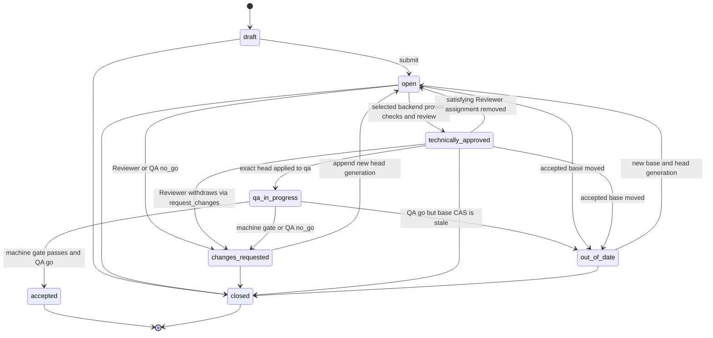

`accepted` means the package passed change review and QA and is eligible for
staging. It does **not** mean deployed to staging or production. A production
release still requires its own environment-specific evidence and Admin final
approval. A `no_go` never deletes the package; it creates owned rework and
preserves the negative result.

#### Version and tag policy

Do not use one mutable label to mean package identity, quality state and
deployment location. The MVP uses these separate names:

| Name | Example | Authority and rule |
| --- | --- | --- |
| Revision number | `r42` | Server-allocated, workspace-local, monotonic with allowed gaps; convenient display identity, never reused |
| Package digest | `sha256:8c1…` | Canonical immutable identity used by gates, approvals and promotion |
| Review candidate | `CR-17/g2` | Change Request and append-only head generation; identifies what was reviewed |
| QA candidate version | `1.4.0-rc.2` | Immutable prerelease tag assigned to the exact head entering QA; a changed head gets `rc.3`, never replaces `rc.2` |
| Accepted package version | `1.4.0` | Immutable SemVer tag created when the exact candidate is accepted; version uniqueness is reserved transactionally when the request is submitted |
| Environment channel | `dev`, `qa`, `staging`, `prod` | Mutable current-release pointer moved only by successful apply or rollback operations |

Semantic versioning describes package compatibility; CALIBER cannot infer
major/minor/patch from heterogeneous content. The Developer proposes the next
version, policy validates syntax and uniqueness, and Admin may resolve a version
reservation conflict before submission. Acceptance also requires the proposed
version to have greater SemVer precedence than the highest accepted version; an
out-of-date rebase must reserve a newer value when that condition no longer
holds. For non-library applications whose API
compatibility is not meaningful, a workspace policy may select calendar
versions later; the MVP ships SemVer only to avoid two version grammars.

Git tags/releases are optional source mirrors, not CALIBER's aggregate release
authority. For Git-managed source, CALIBER records and may verify that a Git tag points to
the imported commit, but the CALIBER version tag also binds non-Git resource
pins, configuration-independent model dependencies and the complete package
digest. `dev`, `qa`, `staging`, `prod`, `approved`, and `latest` must never be
created as immutable version tags; the first four are environment pointers and
the others are derived states.

An operational retry against unchanged package/config coordinates does not
consume a new semantic version; it creates another evaluation or operation
attempt under the same release history. Any content or pinned-dependency change
before acceptance creates a new revision/head and the next prerelease tag under
the reserved final version. Any such change after acceptance requires a new
Change Request and a new semantic version. This prevents a supposedly immutable
`1.4.0` from acquiring different bytes to repair a failed deployment.

#### End-to-end handoff

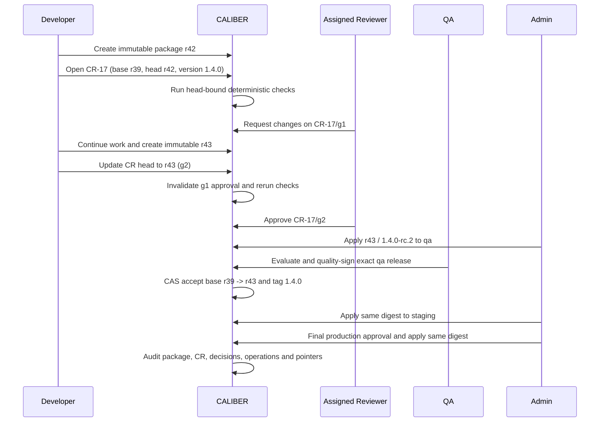

This diagram shows `review_backend=caliber`. With provider review, the Developer
and source Reviewer work in the PR/MR, CALIBER verifies a digest-bound review
attestation for the imported resulting commit, and the QA/Admin handoff is
otherwise identical.

### 3.3 Traceability, history, and rollback

One query must reconstruct this chain without reading free-form log text:

```text
source commit or CALIBER snapshot
  -> immutable workspace revision and resource pins
  -> Change Request base/head generation, checks, comments and reviews
  -> immutable candidate/accepted version tags
  -> environment-specific release, evidence and decisions
  -> apply/rollback operation and provider child effects
  -> environment current-release pointer
  -> run, trace, assessment or incident
```

Every arrow is a typed foreign key plus copied integrity digest. Audit events
record actor, credential, workspace role, action, decision reason, request ID,
idempotency key, before/after identifiers, policy version and timestamp. Secret
values and unbounded provider payloads never enter the audit record. Historical
packages, rejected heads, stale approvals, failed operations and prior pointer
moves remain readable under retention policy; they are not garbage-collected
while a release, audit event, run or legal hold references them.

Rollback is a new forward operation, not a version edit. Admin selects an exact
previously applied release in the same environment, supplies the expected
current release and environment lock version, and records a reason. CALIBER
prepares reverse child effects from retained pins, settles or reconciles them,
and moves only that environment's current-release pointer after every required
effect is proven. The original package, Change Request, semantic-version tag,
approvals and failed/newer release remain unchanged. A rollback from production
does not automatically move staging or the accepted baseline; those differences
are visible. A hotfix may start from the deployed production package, but its
submitted Change Request must still rebase against the current accepted
baseline and record the production source release as provenance; this prevents
rollback from silently discarding later accepted work.

### 3.4 The rework cycle

Nothing ships because it passed once. It ships because it passed *after*
whatever failed was fixed:

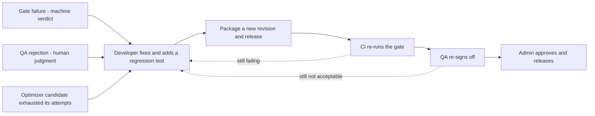

The "adds a regression test" step is the one teams skip and the one that
compounds. CALIBER supports it directly: a verified failure becomes an
eval-dataset example through the harvest path, so the fix and its test land
together and the same failure cannot ship twice.

**One handoff worth naming.** In the automated stages the *platform's optimizer*
authored the candidate, not a person. So "the Developer fixes it" is really a
**transfer of authorship**: the optimizer's candidate is a proposal, and when it
fails, ownership reverts to a human author who may discard it entirely rather
than patch it.

### 3.5 Two kinds of rejection, one destination

| | Gate failure | QA rejection |
| --- | --- | --- |
| Decided by | Machine, threshold-based (0.85 / 0.02) | Human judgment |
| Means | The numbers do not clear the bar | The numbers cleared, but this is still wrong |
| Carries | Gate reasons and per-dimension deltas | A written reason |
| Today | `rejected`, then owned via an auto-created rework task (`P3-A`, section 16) | Cannot be expressed for an aggregate Workspace release |

QA rejection is the more valuable of the two, because a change that passes the
gate and is still wrong is precisely what a quality function is for. It is also
the one that does not exist for an aggregate Workspace release today.

### 3.6 What the rework cycle needs, and does not have

This is the largest gap *after* a job exists — larger than the missing package
artifact, because it affects every failure rather than every release. Section
2.2 covers the one that precedes it: Stage ① Verify (`P3-B`) now has a live
route, but only for a manually-flagged concern; the ingestion path and the
job-link below share this section's designed-but-unwired shape, one stage
earlier and with no consumer already waiting for them.

`refinement_max_iterations` **still defaults to `0`, meaning off**: "a failed
gate rejects immediately." The eval stage sets `job.status = "rejected"` — but
as of `P3-A` (section 16), that terminal transition now also creates a
`CaliberReworkTask` row in the same transaction (`orchestrator/eval_stage.py`),
so concretely, today:

- the failure is assigned once someone claims the task (`POST
  /rework-tasks/{id}/claim`), or an admin reassigns it directly;
- there is a task: `GET /rework-tasks` lists it, filterable by status and
  assignee, with the gate's reasons and evidence snapshot attached;
- **a request-changes endpoint now exists** — `POST
  /jobs/{id}/request-changes` — so an operator can return a `candidate_ready`
  job for another pass with written guidance.

A failed gate produces a `rejected` row and an owned rework task, not silence.

**One mechanism was already half-built, and is now wired end to end.**
`CaliberRefinementJob.review_notes` exists, and its docstring reads: *"Reviewer
change-request notes. Set by the request-changes endpoint when an approver
wants a new candidate with specific guidance. Read by the candidate stage on
the retry pass, then cleared."* The candidate stage **still reads it**, and
`request-changes` (item 3 below) is the writer that was missing.

Four things to build, in value order:

1. **A rework assignment.** *Delivered by `P3-A`.* A failed gate produces an
   owned, visible `caliber_rework_tasks` row (global scope today, not yet
   project-scoped) rather than a terminal `rejected` row with nothing pointing
   at it. `claim`/`resolve`/`reassign` cover the ownership lifecycle;
   `resolve` optionally links the superseding job that fixed it.
2. **A QA sign-off record**, distinct from the machine gate. *Delivered by
   `P3-C`.* `POST /jobs/{id}/quality-reviews` (`caliber.operator`) records an
   append-only `caliber_quality_reviews` row. `"go"` is purely advisory — it
   does not touch the job, matching the "advisory in v1" precedent
   `routes/gate_verdicts.py` already set. `"no_go"` is not advisory: it
   terminally rejects the job (same conditional-UPDATE claim idiom `apply`/
   `request-changes` use) and creates a `caliber_rework_tasks` row with
   `failure_kind = "quality_no_go"` in the same transaction — the exact
   pattern `eval_stage.py` uses for a machine-gate rejection, just triggered
   by a human decision. Current workflow promotion approval and artifact
   release signoff remain different, unrelated contracts; this is not the
   proposed aggregate Workspace-release quality decision (`P5-B`, section
   9.2's `caliber_workspace_release_decisions`) — that's a separate table at
   a different granularity, the same way the aggregate release "does not
   reuse `caliber_release_signoffs`" either.
3. **A request-changes writer** for `review_notes`. *Delivered by `P3-A`* —
   `POST /jobs/{id}/request-changes`, gated the same way `apply` is
   (`caliber.operator`), claims `candidate_ready -> running` with the same
   conditional-UPDATE idiom `apply` uses, and deliberately does not touch
   `refine_iteration` (a human request is not a way to spend the automatic
   self-correction budget).
4. **Set `refinement_max_iterations` above `0`** deliberately and define what
   happens when it exhausts. *Escalation is now defined, the default is
   unchanged.* Item 1 means exhausting retries (or rejecting immediately at the
   shipped `0`) always produces an owned rework task — "what happens when it
   exhausts" now has a concrete answer regardless of the configured value.
   Raising the default itself would change cost/latency for every existing
   refinement flow platform-wide, which stays a separate, deliberate
   operational decision this slice does not make unilaterally.

All four items are now delivered. What remains is the aggregate
Workspace-release version of items 1 and 2 (Phase 5), and making the
rework-task routes project-scoped (needs `P1-C`).

## 4. The gates

### 4.1 The implemented regression gate

[`eval/gate.py`](../caliber/src/caliber/eval/gate.py) is a pure function with
two thresholds, and it is well designed against current practice:

- `min_aggregate_score`, default **0.85** — an absolute floor the candidate's
  `overall` must clear.
- `max_regression_delta`, default **0.02** — no single dimension may regress by
  more than this against the baseline. Cold-start runs with no baseline skip
  this check.

The pure function creates no approval or database state. In the refinement
orchestrator, an exhausted failure marks the job `rejected`, while a pass creates
the path's approval record. That path is enforcement rather than observation,
but it is not yet an aggregate Workspace release gate. Combining an absolute
floor with a relative regression bound is the reusable design.

### 4.2 Two things the gate does not cover

**Per-axis gating.** Recommended practice is to gate per *failure mode* —
hallucination, citation error, retrieval miss, refusal — rather than on a
composite, so a regression in one axis cannot be masked by improvement in
another. CALIBER's scorer set makes this expressible; the gate contract does not
require it.

**A provider model change is not a release.** The same prompts and tools against
a silently updated model is a behavior change with no diff and no error.
Industry guidance is to pin dated model snapshots and treat a model bump as a
release that traverses the full pipeline. CALIBER pins a default model in
config, but a model change does not currently enter the gate. **This is the
highest-value control missing**, and it is cheap relative to its risk.

### 4.3 Separate the cadence from the gate

The most common way eval gates fail is social, not technical: a noisy gate on
every pull request produces randomly red builds, trust erodes, and someone
disables it. Non-deterministic scores can move several points with no change at
all.

- **Fast, deterministic-heavy suite** blocks the pull request: assertions,
  schema checks, contract tests, a small anchored eval subset.
- **Heavy suite, averaged over three or more runs**, gates the *release* on
  merge and nightly — not the merge itself.

Quarantine unstable cases rather than retrying them; retries hide the signal.
With 75% per-trial success over three trials, the probability of passing all
three is about 42% — multi-step agent gates are brittle for arithmetic reasons,
not because the suite is bad.

One statistical caution: the central limit theorem is not a safe basis for
confidence intervals on eval sets with fewer than a few hundred datapoints, and
bootstrap intervals perform poorly there too, because eval items and outputs are
correlated.

### 4.4 Online evaluation

Online evaluation has no reference outputs, so it looks different from the gate:

- Run **deterministic and code-based checks on 100%** of production traces.
- **Sample** LLM-as-judge scoring — commonly 5–20% of traces, lower for very
  high volume, higher for high-value segments. Scoring runs asynchronously after
  the trace is logged, so it adds no request latency.
- Trigger the expensive judge only when a cheap deterministic check already
  shows a quality drop.
- **Cluster failures before writing test cases.** One case per bucket scales;
  case-by-case triage does not.

Judges deserve the same scepticism as any other instrument. Grade each dimension
with its own isolated judge rather than one judge scoring everything, and
calibrate judges against human labels — an uncalibrated judge silently sets the
quality bar wherever it happens to sit.

## 5. Human decisions and separation of duty

The implemented Lifecycle B has two human decisions today: **Verify** (is this
failure real?) and **Apply** (should this refinement ship?). The proposed
Lifecycle A adds three distinct decisions at different boundaries: the selected
backend's head-bound **technical review**, QA's release-bound **quality
sign-off**, and Workspace Admin's production-bound **final release approval**.
Apply is the side effect authorized by the applicable policy, not another
approval. A technical approval cannot substitute for QA or Admin, and neither
release decision retroactively approves a changed Change Request head.

Current practice across cloud vendors converges on one required sign-off at the
**promotion-to-production boundary**, after automated evals have passed, shown
the evidence for that specific version, with self-approval disabled and
independence from the author.

### 5.1 The live separation-of-duty hole

Two facts in the current implementation combine badly:

1. In `resource_access.py`, `owner` holds **both** `resource.write` and
   `resource.approve`, and there is no distinct-actor check anywhere in that
   module.
2. `project_role()` returns `ROLE_OWNER` for anyone holding `caliber.admin`
   **before** it checks membership — so every platform admin is automatically
   release manager for every workspace.

An Admin can therefore author a change and approve their own change, and a
platform operator cannot maintain the service without holding release authority
in every project. On the prompt refinement path the same is true by
construction: `POST /jobs/{id}/apply` requires `caliber.operator` and records
that same actor as `approved_by`.

Closing it needs four things, none of which is a new permanent role:

- **one head-bound technical review backend** on each submitted Change Request;
  native review assigns an eligible Developer/Admin, while provider review
  requires complete PR/MR coverage with mapped eligible non-author reviewers;
- **role-specific distinct-actor checks** on technical review, QA sign-off and
  Admin final approval, all implementing the same
  originator-versus-decision-maker axis;
- **two stored decision roles after technical review** — QA records quality and
  a Workspace Admin gives final approval. A Workspace may have several eligible
  Admin collaborators, while `CaliberProject.owner` retains one primary owner
  for accountability and recovery. QA is not an Admin substitute;
- **break-glass** for an otherwise eligible emergency production release
  missing its fresh production QA or Admin decision: a mandatory reason, short
  expiry, one-release scope, an interactive
  `caliber.admin` credential, and a high-severity audit event. Disabled by
  default, applies to one release only, and is server-refused for PAT and service
  credentials.

Break-glass is not a normal role and does not turn an owner into their own
independent reviewer.

### 5.2 One axis is enough

Two separation-of-duty axes are possible; MVP needs the first:

- **change originator ≠ human decision-maker** — catches bad changes. Applied
  three times with role-specific originator sets: each native or mapped
  provider Reviewer whose decision is required cannot technically approve a
  covered change they authored or imported; QA cannot
  quality-sign a runtime/source change they authored; Admin cannot finally
  approve a production release they authored or requested. QA cannot request a
  release in the MVP. The immutable Change Request and release records capture
  the exact actor set from revision provenance and the requester;
  evidence-definition authors do not make the revision permanently
  unapprovable.
- **approver ≠ applier** — catches malicious deployment. A much rarer threat,
  deliberately not enforced here.

Making Admin both approver and applier is a sound trade because the *author*
stays distinct. Record it as a decision so a reviewer does not read it as an
oversight.

Because the target permits Admin to author runtime resources, an Admin-authored
production release requires a **different Admin** for final approval.
With only one Admin, that change can use development but cannot progress through
normal production approval. Break-glass is emergency recovery, not the routine
answer to this staffing constraint.

For CALIBER-managed resources, the enforceable author set comes from immutable
domain-version `created_by` provenance. In push-based Git mode, the enforceable
actors are the authenticated import/request principals; commit author text is
recorded but is not trusted identity. A later GitHub App may add verified account
mapping. The MVP must not claim stronger Git author separation than it can
authenticate.

### 5.3 Default environment policy

Workspace creation automatically and transactionally creates exactly four
protected environment records. Their canonical API/SDK identifiers, classes,
and display labels are:

| Identifier | Environment class | Display label | Initial state for a new Workspace |
| --- | --- | --- | --- |
| `dev` | `development` | Development | active |
| `qa` | `qa` | QA | disabled until Admin configuration validates |
| `staging` | `staging` | Staging | disabled until Admin configuration validates |
| `prod` | `production` | Production | disabled until Admin configuration validates |

The MVP has no environment-create, rename, reorder, or delete operation. Admin
may update validated non-secret configuration references, tighten policy, and
enable or disable an environment. Admin cannot weaken the mandatory predecessor
or decision requirements below the defaults in this section. Custom
environments are an architecture-evolution feature, not an MVP escape hatch.

| Environment | Prerequisite | Human decisions | Apply actor |
| --- | --- | --- | --- |
| Development | Ready revision or current Change Request head | None | Developer or Admin |
| QA | Same Change Request head successfully applied in development; selected backend's required head checks and technical review pass | Native Reviewer approval or provider attestation set is already bound to that head; QA gives the environment-bound quality decision after evaluation | Admin |
| Staging | Accepted package; same digest successfully applied and quality-signed in QA | No duplicate human decision; the accepted-package record and QA decision are predecessor evidence, while staging machine/integration checks bind its own configuration | Admin |
| Production | Same digest applied and verified in staging; fresh production gates pass | Fresh QA quality sign-off and Admin final approval; neither may be a runtime/source author, and final approver must differ from requester | Admin; may be the final approver |

For a single-user local deployment, development remains usable without a second
actor. The normal protected path requires the named collaborators. Break-glass
may exceptionally authorize production apply without its fresh production QA
or Admin decision only after the package was technically reviewed, accepted in
QA, verified in staging, and passed production machine/integrity gates. It does
not replace initial QA acceptance or make self-reviewed single-user promotion
routine. Ordinary policy is never silently relaxed because the team is small.

A migrated project is different from a newly created Workspace: existing live
aliases cannot be claimed as an aggregate Workspace release. The migration
seeds all four rows but marks every detected live target
`baseline_required`. Dual-read compatibility may continue serving it, but
strict Workspace execution and promotion remain disabled until an Admin records
and verifies a baseline revision/release mapping.

### 5.4 Central authorization contract

One server-side entry point:

```python
authorize(
    principal: CaliberIdentity,
    action: WorkspaceAction,
    workspace_id: str | None,
    *,
    resource: ResourceContext | None = None,
    environment: EnvironmentContext | None = None,
    release: ReleaseContext | None = None,
) -> AccessDecision
```

`workspace_id=None` is valid only for `project.create`, which performs the
pre-membership two-scope bootstrap check described in section 2.4. Every other
action with no concrete workspace denies. This keeps one action registry
without pretending a not-yet-created Workspace has a membership record.

`AccessDecision` includes `allowed`, a stable reason code, role, effective
permissions, and policy version. Sensitive not-found cases return an
indistinguishable `404`; visible resources with insufficient authority return
`403`. Every write path authorizes before mutation and revalidates under the
transaction immediately before a release state change.

A role cannot widen the token's scope, and a PAT cannot widen its owner's live
scope. Unknown permissions deny. Client-side capability flags are projections of
the server decision and are never the enforcement boundary.

`caliber.admin` is not an implicit workspace role in the target contract.
Ordinary platform maintenance therefore cannot read or mutate workspace content.
A separate break-glass authorization path requires an interactive credential,
workspace and release IDs, reason, incident/reference, expiry, and an audit
event; it cannot be reached through `project_role()` or a broad role mapping.

## 6. Current architecture: what exists and what it proves

### 6.1 The user problem

CALIBER exposes workflows, prompts, tools, skills, knowledge bases, test sets,
judges, integrations, files, runs, approvals, releases, and operational
evidence. Those objects have several different versioning and storage idioms. A
user can select a project called a workspace, but there is no single immutable
answer to:

- Which exact resource versions comprise this project?
- Which Git commit produced those versions?
- What is deployed in development, QA, staging, or production?
- Who may edit, review, promote, roll back, or administer this project?
- Can a run be traced back to the complete project state rather than only its
  workflow version?
- Can another project see or execute this project's resources through a route,
  worker, assistant capability, provider lookup, or guessed identifier?

The relational database, MLflow, object storage, GitHub, and runtime providers
legitimately own different physical state, but the user should not need to
reconstruct the project by navigating each store or guessing which one is
authoritative.

### 6.2 Current limitations this addresses

1. `CaliberProject` is documented as a workspace that groups files "and future
   resources"; it is not a versioned aggregate.
2. `CaliberProjectMember` and `resource_access.py` provide four roles and a
   seven-action registry, but routes also use global scopes independently. The
   effective policy is therefore path-specific.
3. The active-project header is optional, and clients also offer an
   all-workspaces mode. That is appropriate for legacy personal/public
   libraries but insufficient for a strict workspace boundary.
4. Many root resources carry nullable `project_id` and `visibility`; most do not
   have a database foreign key to `caliber_projects`. Several names remain
   globally unique despite project scoping.
5. MLflow prompt discovery enumerates provider records independently of a
   first-class CALIBER prompt-to-project binding. A project-scoped agent does
   not by itself make every MLflow prompt project-scoped.
6. MCP server definitions and the encrypted secret store are platform-level.
   They need explicit workspace/environment bindings rather than an assumption
   that every platform record becomes workspace-owned.
7. Asset history is intentionally heterogeneous. Prompts, workflows, knowledge
   bases, skills, tools, test sets, judges, and MCP servers do not share one
   release or rollback contract.
8. Environment classification exists and an unrecognized alias falls back to
   the configured default class, which ships as production — but that fallback
   is configurable rather than an invariant, and the explicit non-deployment
   aliases classify as development. The supported product also remains
   single-environment: prompt discovery uses only `prod`, and workflow
   deployment stores a derived environment class rather than a first-class
   workspace environment.
9. Release candidates, signoffs, prompt release operations, workflow
   promotions, and rollback checkpoints exist, but there is no parent release
   that binds a complete workspace revision to an environment.
10. There is no current GitHub repository binding, commit-pinned workspace
    manifest, workspace revision model, or durable GitHub import job.
11. Personal access tokens can narrow global scopes but cannot currently bind
    the credential to one project. A CI token used for workspace import would
    otherwise retain its owner's access to every workspace where that owner is
    a member.

These identify where the existing project scope should become a real aggregate
and where current path-specific safeguards must be closed over the whole request
and execution surface.

### 6.3 Reusable foundation

| Existing component | Current behavior | Reuse decision | Gap to close |
| --- | --- | --- | --- |
| [`CaliberProject`](../caliber/src/caliber/db/models.py) | `PRJ-*` identity, `tenant_id`, owner, active/archived status, storage backend | Treat as the Workspace root; preserve table and ID | Add stable slug/source mode and stronger lifecycle rules |
| [`CaliberProjectMember`](../caliber/src/caliber/db/models.py) | One active/inactive user membership with owner/editor/reviewer/viewer role | Reuse table and literals; permit additional eligible `owner`-role Admins while retaining one primary owner | Add action-level policy, role-grant eligibility and release-instance separation of duties |
| [`routes/projects.py`](../caliber/src/caliber/routes/projects.py) | Project CRUD, members, folders, uploads, downloads | Extend with nested source/revision/environment routes, or register focused route modules beside it | Current project scope is primarily metadata/files |
| [`resource_access.py`](../caliber/src/caliber/resource_access.py) | Central project role lookup and seven project actions | Evolve into the single workspace authorization entry point | Global scopes, environment policy, workers, CLI, and Aria are not yet one policy decision |
| [`db/scoping.py`](../caliber/src/caliber/db/scoping.py) | Visibility-aware filtering over a three-value tier (`project`, `user`, `public`) | Reuse for discovery and legacy library behavior | Strong workspace actions must require a concrete workspace and deny by default |
| [`auth.py`](../caliber/src/caliber/auth.py) | Validated identity, hierarchical global scopes, PAT scope ceilings, active project header | Reuse authentication and scope ceilings | Do not treat a client-provided workspace header as authorization; add credential workspace, environment, and resource context |
| [`ProjectsAPI`](../sdk/caliber-sdk/src/caliber_sdk/resources/projects.py) | Typed project, member, and file operations | Extend without breaking existing methods | Add source, revision, environment, and release models/resources |
| Domain resource models | Project IDs on agents, datasets, judges, review queues, plans, eval runs, skills, workflows, tools, OpenAPI integrations, KBs, files, and several run tables | Keep domain models authoritative | Coverage is nullable, uneven, and not always FK-enforced |
| Domain version models | MLflow prompt versions; workflow versions; KB builds; skill snapshots; dataset intervals; OpenAPI snapshots | Keep proven immutable domain contracts | Tool and judge rows are mutable despite tool version labels; adapters must create immutable snapshots before those types can be ready revision pins |
| [`deployment_environments.py`](../caliber/src/caliber/deployment_environments.py) | Classifies aliases as development/staging/production; an unrecognized alias falls back to a configurable default class that ships as production, except the explicit non-deployment aliases which classify as development | Reuse classification and policy helpers for legacy aliases | Add a closed `qa` class plus durable workspace environment identity/state; Workspace names never use the legacy unknown-alias fallback |
| Workflow deployments/promotions | Alias CAS, deploy gates, optional human approval, rollback stack | Reuse through a workspace release adapter | Applies only to workflow aliases and current global scopes |
| Release candidates/signoffs | Evidence rubric, immutable artifact-level final signoff snapshot | Reuse as optional workspace release evidence, not as the aggregate decision record | Current candidate names one artifact/version and permits one final signoff, not two typed revision/environment decisions |
| Prompt release operations | Intent-first external effect with reconciliation | Reuse as a child operation | Other asset paths do not inherit this external-effect guarantee |
| Audit log | Actor/action/entity/details | Reuse and add indexed workspace/revision/environment/release/operation correlation columns | A JSON `details` convention alone is not queryable or enforceable enough for incident reconstruction |
| Storage service | Project/run namespaces, digest-bearing file records, local/S3 backends | Reuse | Revision must pin immutable file refs rather than mutable paths |

### 6.4 Source-of-truth boundaries and resource classification

| State | Current authority | Workspace interpretation |
| --- | --- | --- |
| CALIBER control metadata | CALIBER relational database | Workspace catalog, membership, revisions, environments, releases, and provider references live here |
| File bytes | Object/workflow storage | Workspace records content-addressed references; it does not duplicate large bytes in SQL or Git |
| Prompt versions and traces | MLflow | CALIBER adds workspace-local bindings and records exact provider versions |
| Workflows, tools, skills, datasets, judges, KB metadata | CALIBER relational models | Existing domain versions remain canonical and are pinned by a workspace revision |
| Authored Git-managed files | Configured Git provider commit | Canonical authored source for a `git_managed` workspace; CALIBER materializes and governs it |
| Secret values | Encrypted CALIBER secret versions | Never enter a manifest or audit payload; environments bind `secret://` references |

The CALIBER database is the authoritative inventory: an object that exists only
in MLflow, object storage, or GitHub is not a usable workspace resource until
CALIBER binds it and an immutable revision pins it. Centralizing authority and
navigation is the goal; collapsing every failure domain into one database is not.

“Pin” means **reconstructable**, not merely able to detect drift. If the
referenced domain row can be edited or deleted, its digest is insufficient
because the old payload cannot be recovered. The adapter must either reference
an already immutable provider/domain version or persist a canonical, non-secret
snapshot in the existing content-addressed storage service. Ready revisions
protect those snapshot/version references from garbage collection. A resource
type without one of these guarantees is refused during revision validation.

Not every object inside a workspace has the same lifecycle. This classification
is what the `resource.write.runtime` / `resource.write.evidence` split in
section 2.4 keys on:

| Class | Examples | Revision behavior | Release behavior |
| --- | --- | --- | --- |
| Authored runtime asset | Prompt, workflow, skill, tool | Pin an authoritative immutable version, or a CALIBER-created content-addressed snapshot when the current row is mutable | Materialize or bind through an asset-specific adapter |
| Grounding asset | Knowledge base, source manifest | Pin exact KB build and source fingerprint | Activate a build or bind it as a dependency |
| Quality definition | Test set, judge/scorer, threshold policy | Pin the reconstructable dataset version or a content-addressed definition snapshot and digest | Never deployed; revision input |
| Release evidence | Evaluation run, gate verdict, QA sign-off, final approval | Bind to `(revision, environment-config digest, runtime dependency digest)` after evaluation | Never part of the revision it evaluates; append-only release evidence |
| Integration definition | OpenAPI snapshot, approved MCP connection binding | Pin contract version and policy | Validate/preflight; environment binding controls use |
| Operational record | Run, trace, release operation, audit event | Reference the workspace revision and environment | Produced by execution; not part of authored source |
| Platform service | Identity, encrypted secret value, provider credentials, storage backend | Referenced by name/version where safe | Managed by platform operators, not copied into workspaces |
| Documentation | Design, runbook, resource documentation | Version in Git for Git-managed workspaces | Not deployed, but included in project provenance |

### 6.5 Architecture decision: Git is a source backend, not the Workspace

The mapping in the question is useful, but only for one architectural plane:

```text
Workspace       != repository
Revision/package != commit
Environment     != branch
Production state != tag or GitHub deployment
```

A repository can be the authored representation of a Workspace, and a commit is
excellent source provenance. It cannot by itself identify the materialized
MLflow prompt versions, retained snapshots of mutable CALIBER rows, object-store
bytes, model/provider fingerprints, environment configuration and secret
versions, evaluation evidence, human release decisions, partial external
effects, or the current observed deployment state. Those are already CALIBER
domain and operational concerns. Treating the repository as the whole system of
record would either omit them or force runtime state and secrets into Git.

#### 6.5.1 The consequential decision: authority is split by plane

The recommended option is **C, hybrid/pluggable**, with an explicit and
non-overlapping authority contract:

| Plane | Authoritative system | Git-provider role |
| --- | --- | --- |
| Workspace identity, inventory, membership and RBAC | CALIBER | Optional identity evidence only; repository permission never grants CALIBER runtime access |
| Authored declarative source | CALIBER in `caliber_managed`; configured provider in `git_managed` | In `git_managed`, owns files, commits, branches, source diffs and merge history |
| Technical source review | CALIBER policy, satisfied by native review or configured provider evidence through exactly one backend per request | May own PR/MR discussion, review and source CI when `review_backend=source_provider`; every change in the candidate source range must be covered |
| Materialized domain versions and snapshots | CALIBER plus the existing domain provider | Commit is an input and provenance reference, not the materialized identity |
| Aggregate application package and dependency lock | CALIBER | Commit SHA and source-tree digest are package inputs; provider release may mirror the resulting package tag |
| Quality runs, gate verdicts and QA decisions | CALIBER | Source CI may report a check, but cannot substitute for environment-bound CALIBER evaluation evidence |
| Environment configuration and secret references | CALIBER; secret values in its encrypted store or an approved external vault | Provider environments/secrets are optional execution plumbing, never the canonical policy or secret inventory |
| Deployment intent, current state, reconciliation and rollback | CALIBER | Actions/Pipelines may be a child executor; CALIBER records intent before invocation and observes the effect |
| Runs, traces, incidents and audit correlation | CALIBER and its bound telemetry providers | Commit/PR/run URLs are immutable provenance fields, not the audit ledger |

This means GitHub is neither CALIBER's global system of record nor a generic
bidirectional synchronization peer. It is an **optional authoritative source
and review backend for the authoring plane**. CALIBER performs a one-way,
commit-pinned import and remains the system of record for the package, control,
release and runtime planes. In `caliber_managed` mode, a future repository
export can be a read-only mirror/synchronization target, but CALIBER must not
round-trip changes from that mirror. One workspace has one writer for authored
state at a time.

#### 6.5.2 Option comparison

| Criterion | A. CALIBER-native lifecycle | B. GitHub-backed whole lifecycle | C. Hybrid/pluggable lifecycle |
| --- | --- | --- | --- |
| Source/version collaboration | Must build native diffs, review history and merge-like concurrency | Excellent for Git-representable content | Reuses provider collaboration when configured; retains native path |
| Domain/package correctness | Natural fit; CALIBER sees every materialized dependency | Poor fit unless non-Git state is duplicated or hidden behind pointers | Strong: CALIBER package binds source plus all non-Git versions/snapshots |
| Business-user experience | Best; no Git concepts required | Weak; identities, branches and PRs leak into ordinary work | Strong if CALIBER terms remain canonical and provider details are optional provenance |
| GitHub/GitLab/Bitbucket/no-Git portability | Full | None without rebuilding the product around each provider | Provider adapter plus native fallback; no provider required |
| Environment and runtime governance | Full control | Provider environment semantics, plan tiers and retention become product constraints | CALIBER policy is stable; provider deployment is an optional child executor |
| Engineering effort | Highest initial effort, including native review UX | Lowest apparent effort, but high integration and semantic-gap cost | Moderate/high; still builds domain lifecycle plus adapters, but avoids rebuilding developer SCM |
| Coupling and outage behavior | Lowest external coupling | GitHub outage/rate limit can block the whole platform | Authoring import may pause; existing packages, releases, runs and rollback remain operable |
| Audit and compliance | One ledger, but CALIBER must build all evidence | Split and mutable provider evidence; export/retention depend on vendor/plan | CALIBER retains normalized, digest-bound evidence and provider provenance |
| Recommendation | Viable fallback, but duplicates mature SCM for developers | Reject as the Workspace-wide architecture | **Recommend** |

Option B looks smaller only if “application” means files. In this repository it
also means provider-backed prompts, content-addressed files, workflow
deployments, release operations, evaluations and runtime lineage. The current
`CaliberReleaseOperation` already distinguishes `prepared`, `applying`,
`applied` and `reconcile_required`; a Git tag cannot safely replace that state
machine. Option A remains necessary as the no-Git fallback and for business
review, but it should not force developers to abandon a mature SCM. Option C
preserves the existing architecture and confines provider-specific behavior to
an adapter boundary.

#### 6.5.3 What fits Git naturally

| Artifact/state | Git fit | Representation |
| --- | --- | --- |
| Prompt templates, policies, configuration schemas and documentation | Strong | UTF-8 YAML/JSON/Markdown plus schema validation |
| Agent and workflow definitions | Strong when declarative | Stable IDs, typed manifests and source paths; generated/runtime state excluded |
| Tool, OpenAPI and MCP binding definitions | Strong/conditional | Declarative contract and approved connection reference; never credentials or executable import side effects |
| Evaluation definitions and small fixtures | Strong | Test-set manifest, scorer definition, thresholds and small reviewable fixtures |
| Large datasets and knowledge sources | Conditional | Manifest plus immutable object/version digest; do not commit indexes, embeddings or large traces by default |
| Model dependencies | Conditional | Immutable provider/deployment ID plus inference-config fingerprint; reject `latest` for protected environments |
| Secrets, provider credentials and environment values | Poor/unsafe | Versioned `secret://` or vault references only; values remain outside Git |
| Evaluation results, traces, review queues and incidents | Poor | Append-only CALIBER evidence linked to package/environment/run |
| Embeddings, indexes, compiled bundles and mutable provider records | Poor | Build/materialization output in content-addressed storage and provider snapshots |
| Deployment/current-environment state | Poor | CALIBER release operation and observed environment pointer |

Git provides text history; it does not make an arbitrary mutable provider object
immutable. Every source adapter still has to resolve the declaration to an
existing immutable domain version or retain a content-addressed snapshot.

#### 6.5.4 Safe delegation and hard native boundaries

CALIBER may safely delegate commit storage, branching, line/file diffs,
technical source discussion, required source checks, code-owner review and
merge protection. It may publish a check back to the provider and mirror an
accepted semantic version as a tag/release carrying the CALIBER package digest
and release URL; that mirror is never sufficient to reconstruct environment
state. GitHub Actions, GitLab CI or
Bitbucket Pipelines may validate source and invoke a CALIBER import with a
workspace-bound short-lived credential. A pipeline may execute a CALIBER-owned
release-operation child only when the operation already records the exact
package digest and target and CALIBER subsequently observes/reconciles the
result.

CALIBER must still build and own:

- the Workspace catalog, resource ownership and centralized authorization;
- manifest validation, provider materialization and immutable snapshots;
- the aggregate revision/package digest and complete dependency lock;
- native Change Requests for no-Git or CALIBER-reviewed work;
- a complete normalized external-review attestation set when provider review is selected;
- quality gates, QA sign-off, Admin release approval and separation of duties;
- environment policy, configuration/secret references and protected pointers;
- intent-first deployment, provider observation, reconciliation and rollback;
- run/evaluation/deployment lineage and an exportable audit history;
- provider connection, webhook, idempotency, reconciliation and identity-link
  infrastructure; and
- a provider-neutral SDK/CLI vocabulary plus native behavior when no provider
  is configured.

Git provider deployment approvals are useful defense in depth, but they are not
portable equivalents of CALIBER policy. Their reviewer limits, plan/tier
availability, role semantics, audit retention and self-approval behavior differ.
The CALIBER gate therefore remains authoritative even when the external executor
also has an approval gate.

#### 6.5.5 Package and dependency contract

The source commit is a **build input**, not the package identity. Packaging is a
deterministic materialization step:

1. Resolve the full commit and normalized repository subtree. Never package a
   mutable branch name.
2. Validate `.caliber/workspace.yaml`, reject undeclared or unsupported runtime
   dependencies, and canonicalize the source tree.
3. Resolve every declaration through its domain adapter to an immutable version
   or retained snapshot. Record object-store version/digest, model fingerprint,
   provider contract and non-secret integration references. Record only declared
   secret requirements in the package; each release captures the actual
   environment-specific secret-version references and configuration digest.
4. Produce the canonical package descriptor and `revision_sha256` over the
   source identity, source-tree digest, manifest and sorted resolved pins.
5. Retain the descriptor and source snapshot in CALIBER. Optionally export a
   generated `.caliber/workspace.lock.json` or OCI artifact for reproducibility;
   neither becomes a second authority.
6. Promote that exact digest through every environment. Rebuilding from the
   same commit is a verification operation and must reproduce the digest or
   fail as drift; it never silently replaces the reviewed package.

The package therefore supports source-only dependencies, CALIBER-managed
resources and external immutable provider versions in one lock. A Git tag may
mirror `1.4.0`, but the authoritative mapping is CALIBER's immutable version tag
to `revision_sha256`.

#### 6.5.6 One review workflow, not two

`WorkspaceChangeRequest` is the provider-neutral package/promotion envelope.
It always binds CALIBER's accepted package baseline to one immutable candidate
revision and carries quality/release progress. Its `review_backend` determines
only where **technical source review** happens:

- `caliber`: CALIBER owns reviewer assignment, comments, checks and technical
  approval. This is the default for `caliber_managed`, no-Git and business-led
  review.
- `source_provider`: the provider owns branch conflict resolution, source
  discussion, checks and PR/MR approval. CALIBER stores normalized immutable
  attestations bound to provider/repository/request IDs, exact reviewed heads,
  resulting commits, CALIBER external-review policy, required-check sets,
  optional observed provider-ruleset snapshots and mapped actors. CALIBER
  comments do not masquerade as provider comments.

For provider review, the safe default is to materialize the exact commit that
landed on the protected default branch. Expensive pre-merge CALIBER evaluations
may be advisory provider checks, but QA acceptance binds the post-merge package
digest. A squash, rebase, merge-queue result or changed head requires a new
import and invalidates any attestation not bound to the resulting commit.
CALIBER never infers approval from “PR merged”; it verifies the configured
CALIBER external-review policy and exact commit through the provider adapter. If the candidate
contains several merges since its CALIBER base package, the attestation set must
cover the complete source-tree delta. Every changed path/commit must be
attributable to a verified PR/MR under the required policy; direct pushes,
bypasses and uncovered commits make the set `insufficient`. The first package
uses an explicit Admin-approved baseline-import procedure because no prior
CALIBER source commit exists.

Push import alone cannot verify those facts. Until a least-privilege GitHub App
or equivalent provider connection is installed, the request either uses native
CALIBER technical review or remains ineligible for environments whose policy
requires provider-verified review.

#### 6.5.7 Business users and provider portability

The API, SDK and future UI expose `Draft`, `In review`, `Changes requested`,
`QA candidate`, `Staged`, `Production` and `Rollback`; provider, repository,
branch and PR/MR appear only as optional provenance. A business user can create,
compare, comment on and approve CALIBER-managed revisions without a Git account.
When provider review is selected, only the technical source reviewers need the
provider workflow; QA and Admin continue entirely in CALIBER. Writing a
provider comment or review on behalf of a CALIBER user is out of scope until an
explicit identity link and user-authorized token exist—an installation token
must never impersonate a human.

Implement a `SourceControlProvider` capability interface rather than a GitHub
service embedded in Workspace logic. Capabilities include commit/tree fetch,
commit reachability/range coverage, change-request lookup, exact-head reviews,
required checks, optional provider-ruleset observation, webhook verification
and optional status publication. Missing
capabilities are explicit typed refusals. GitHub is the first adapter; GitLab,
Bitbucket, self-hosted variants and `none` are later adapters. Provider-specific
environment, secret and role concepts do not cross this interface.

#### 6.5.8 Coupling, scale, security and governance risks

| Risk | Consequence | Required control |
| --- | --- | --- |
| Provider outage, webhook loss or rate limit | Imports/review refresh pause or arrive out of order | Durable event inbox, delivery idempotency, cursor/reconciliation poll, last-verified timestamp; existing releases and rollback remain available |
| Force-push, deleted repository/tag or retention change | External source/history disappears | Retain canonical source snapshot, descriptor and attestations; reference full commits, never branch/tag alone |
| Identity mismatch and bots | Wrong actor satisfies separation of duty | Explicit provider-user-to-CALIBER-principal link, actor type, tenant/repository binding and revalidation; unknown actors never count |
| Forged or weak status checks | Untrusted actor marks a commit green | Pin required check names and trusted app/source identities; retain check conclusions and input SHA |
| Malicious workflow/fork input | Secret or deployment compromise | No secret on untrusted PR jobs; least-privilege App, short-lived/OIDC credentials, protected execution workflow and CALIBER-side target authorization |
| Repository admin bypass, direct push or policy drift | Candidate includes source without intended review | Verify complete base-to-head commit/path coverage against CALIBER's external-review policy, record bypass actor/reason, and retain provider ruleset evidence when readable |
| Repo-per-workspace or monorepo scale | API fan-out, webhook storms, ambiguous path ownership | Bind repository plus normalized root path, index repository/path to workspaces, batch fetches, enforce non-overlapping roots unless explicitly supported |
| Vendor/edition differences | A policy works only on one product tier | Closed capability discovery, CALIBER-native fallback and policy that refuses unavailable required guarantees |
| Bidirectional synchronization | Conflicts and unprovable authority | One authoring mode at a time; one-way import or one-way export, never automatic round-trip sync |

These controls are why the provider integration is not a shortcut around the
Workspace work. It can remove the need to recreate developer-facing Git
collaboration, but it adds a security-sensitive adapter and evidence ingestion
boundary.

## 7. The Workspace concept

A Workspace is the durable collaboration and governance boundary for one
CALIBER project. It owns or binds collaborators and their roles; authored
resources and exact resource versions; evidence and operational lineage; zero or
one provider-neutral Git source binding in the MVP; immutable workspace revisions;
Change Requests and immutable application-version tags; development, QA,
staging and production environment records; release requests, typed decisions,
application state and rollback lineage; workspace-scoped file namespaces and
secret references; and policies controlling import, review, execution, approval
and promotion.

A Workspace is **not** a tenant, a Git repository, a deployment environment, a
mutable bundle, or a physical storage backend. It is the common logical context
that relates those concepts.

### 7.1 Invariants

1. Every workspace-owned root resource has exactly one workspace ID.
2. A resource may be shared from a platform/personal catalog only through an
   explicit, version-pinned revision entry; visibility alone does not make it a
   dependency.
3. CALIBER's workspace inventory is the only discovery and authorization
   authority. Provider listings are reconciliation inputs, never an alternate
   workspace catalog.
4. A ready workspace revision is immutable.
5. A Change Request head always names one ready revision. Head updates append a
   generation and invalidate checks and approvals; they never mutate that
   revision.
6. Accepting a Change Request compare-and-sets its base to its head; a stale
   base becomes `out_of_date`, never an implicit heterogeneous merge.
7. An immutable semantic-version tag names exactly one accepted revision
   digest. Environment names are mutable pointers, never package tags.
8. A release always names one ready revision and one target environment.
9. QA, staging and production receive the same revision digest that passed the
   previous environment; CALIBER does not rebuild source between promotions.
10. Environment-specific configuration and secret-version references are
   captured separately and hashed into release evidence.
11. A caller's workspace/environment header or URL is context, not proof of
   access. Server-side membership and policy decide every action.
12. Workers, Aria, SDK/CLI calls, and direct HTTP calls enforce the same decision
   function.
13. Unknown roles, actions, environments, revision item types, provider states,
    or authorization-store failures deny or remain unresolved; they never widen
    access or become a successful release.
14. A partial external release is represented as partial or
    `reconcile_required`; it is never recorded as fully applied because the SQL
    parent transaction committed.
15. An environment with unresolved external state is not executable or
    promotable, even when its last confirmed `current_release_id` is readable.
16. One system writes authored state at a time: CALIBER in `caliber_managed`,
    the configured repository in `git_managed`. Import/export never creates a
    bidirectional merge loop.
17. A submitted Change Request has exactly one immutable technical-review
    backend. Native and provider approvals cannot be combined to satisfy it.
18. For provider review, evidence covers the complete source delta from the
    CALIBER base revision's source commit to the candidate source commit; a
    linked PR/MR that covers only part of the package is insufficient.

### 7.2 Ownership and lifecycle

The existing project owner remains the initial workspace primary owner and
initial `owner`-role membership. Ownership is administrative accountability,
not proof that the person independently reviewed a release. The database already
allows more than one membership to carry the `owner` literal even though the
current API refuses assigning it; the target uses that compatibility seam for
additional Admin collaborators instead of adding a fifth stored role.

- exactly one primary-owner relationship is retained through the existing
  `CaliberProject.owner` compatibility field and a matching active `owner`-role
  membership; other active `owner`-role memberships are Admins but not the
  primary owner;
- assigning an additional Admin requires the acting Admin plus target scope
  eligibility; it does not alter `CaliberProject.owner`;
- transfer conditionally updates the expected current primary owner and
  validates both membership records in the same transaction before commit;
- the primary owner cannot be removed or demoted through ordinary member
  mutation; a secondary Admin can be changed like another collaborator;
- ownership transfer is an explicit, audited operation that atomically updates
  the owner field and memberships;
- startup/migration validation reports a missing or mismatched primary-owner
  membership and refuses strict mode; it never chooses an owner by name;
- archiving requires no non-terminal import or release operation,
  blocks new authoring, imports, executions and releases, and preserves
  historical run records, revisions, audit history, monitoring, reconciliation,
  and rollback recovery. It does not itself claim to undeploy an external
  provider alias;
- hard deletion is out of scope; a later retention workflow must prove that no
  live environment, legal hold, release, or cross-resource reference depends on
  the workspace.

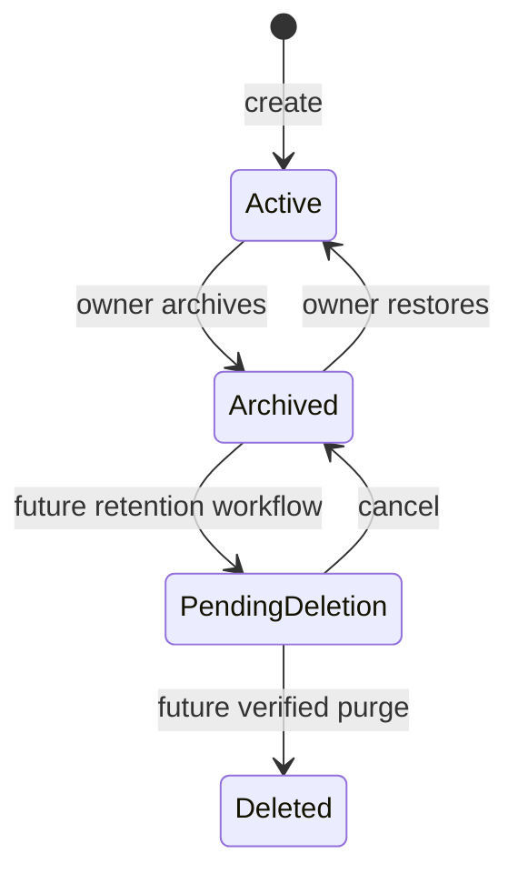

Only `active` and `archived` are implemented for the MVP. `PendingDeletion` and
`Deleted` show the safe extension path and must not be exposed until retention,
dependency, backup, and recovery contracts exist.

### 7.3 Source and review modes

Each workspace declares one source mode and, independently, one technical-review
backend:

- `caliber_managed`: current behavior. CALIBER domain records are the authored
  source; a revision is created from selected saved versions.
- `git_managed`: a full commit from the configured Git provider plus
  `.caliber/workspace.yaml` is the authored source. CALIBER materializes
  immutable domain versions and records the mapping. `source_provider` is a
  separate closed value (`github` first; `gitlab` and `bitbucket` later), not a
  source mode.

`review_backend` is `caliber` or `source_provider`. It defaults to `caliber` and
is mandatory for no-Git work. `source_provider` is eligible only when a
provider adapter can verify the exact imported commit against CALIBER's
external-review policy, required checks and mapped actors. It delegates technical source review only;
CALIBER still owns the Change Request's package baseline/head, QA and release
state.

The source mode prevents dual authority. In a `git_managed` workspace, local
edits may be used as development drafts, but they are not eligible for staging
or any later environment until represented by a new imported Git commit. The
MVP does not silently write commits or PRs/MRs from CALIBER. Provider-backed
review is one-way evidence ingestion, not mirrored comment or approval state.

Source changes are compare-and-set lifecycle transitions, not ordinary mutable
configuration. An active binding must be disabled before replacement. Switching
between `caliber_managed` and `git_managed` requires no running import or
non-terminal release, emits an audit event, and affects only future revisions;
existing ready revisions and release history remain immutable and readable.
Changing mode never retroactively relabels a CALIBER snapshot as Git-authored or
a Git import as CALIBER-authored.

## 8. Proposed architecture

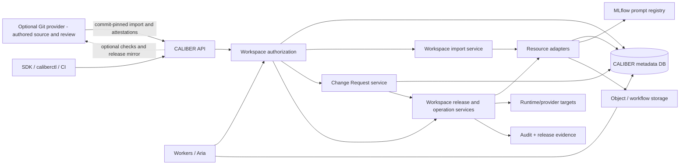

### 8.1 Minimal-disruption decisions

1. **Reuse `CaliberProject` as Workspace.** Do not rename the table, public ID,
   header, or existing routes in the MVP.
2. **Add focused services instead of enlarging `routes/projects.py`.** New
   modules should own sources, revisions, Change Requests, environments, and
   workspace releases.
3. **Keep domain models authoritative.** A workspace revision references exact
   domain versions; it does not copy all domain payloads into one generic table.
4. **Do not add a mutable generic resource catalog in the MVP.** Existing root
   resources plus immutable revision items avoid a second registry that can
   drift from domain tables.
5. **Use adapters only at aggregate boundaries.** Import, resolve, validate,
   release, observe, and rollback need a common adapter protocol; ordinary
   domain CRUD remains unchanged.
6. **Start source integration as provider-neutral push CI, then add verified
   review ingestion.** A GitHub Action or trusted CI submits a commit-pinned
   bundle first, so CALIBER does not need a provider token for import. A later
   least-privilege provider App verifies exact-commit PR/MR review evidence;
   GitLab and Bitbucket implement the same capability contract rather than
   entering Workspace services directly.
7. **Represent environments durably.** Alias classification remains reusable,
   but environment identity, policy, current release, and configuration digest
   must be database state rather than process configuration alone.
8. **Use a parent workspace release.** Existing prompt operations, workflow
   promotions, KB activations, and other asset operations become child items.
   This records partial outcomes without claiming cross-provider atomicity.
9. **Do not replace `CaliberProject` with MLflow Workspace in the MVP.** Current
   MLflow supports workspace-scoped prompts, scorers, experiments and models,
   but it does not own CALIBER workflows, skills, tools, files, workers, Aria, or
   aggregate releases. Replacing the existing project contract would expand the
   migration while leaving most isolation work intact. The prompt adapter may
   later map one CALIBER workspace to one MLflow workspace when deployment
   compatibility and migration tests prove that mapping; CALIBER remains the
   aggregate authorization authority.

### 8.2 Service boundaries

| Service | Responsibility | Must not own |
| --- | --- | --- |
| `WorkspaceService` | Workspace lifecycle, owner transfer, member administration | Domain resource payloads |
| `WorkspaceAuthorizationService` | One deny-by-default decision for principal/action/workspace/resource/environment/release | Authentication or client-only capability hiding |
| `WorkspaceRevisionService` | Canonicalize manifest, resolve pins, compute digest, validate completeness, diff revisions | Provider-specific mutation logic |
| `WorkspaceChangeRequestService` | Base/head generations, review-backend selection, normalized review evidence, version reservation, stale-base CAS acceptance | Source merging, duplicated provider discussion, QA quality decisions, or provider effects |
| `WorkspaceImportService` | Durable import job, path/size validation, resource-adapter orchestration, idempotency, failure reporting | Provider user credentials or SCM policy interpretation |
| `SourceControlProvider` registry | Commit/tree and reachability lookup, PR/MR/check/review-policy attestations, webhook verification, optional status publication | Workspace authorization, package identity, QA/release decisions, environment or secret policy |
| `WorkspaceEnvironmentService` | Seed/manage environment identities and policy, capture config digest | Secret plaintext |
| `WorkspaceReleaseService` | Request/evaluate one revision/environment pair and record digest-bound human decisions | Provider effects or mutable approval history |
| `WorkspaceReleaseOperationService` | Prepare, apply, observe, reconcile, and roll back through intent-first parent/child operations | Pretending child effects are atomic or rewriting release evidence |
| `WorkspaceReworkService` | Own failed-gate and human-rejection tasks through a superseding revision/release | Mutating an immutable rejected release |
| `WorkspaceResourceAdapter` registry | Domain-specific resolve/materialize/validate/release/observe/rollback operations | Generic domain CRUD replacement |

The resource adapter interface is narrow and capability-declaring:

```python
class WorkspaceResourceAdapter(Protocol):
    resource_type: str

    def resolve(self, session, workspace, declaration) -> ResolvedPin: ...
    def snapshot(self, session, resolved_pin) -> ImmutableSnapshot: ...
    def validate(self, session, pin, environment=None) -> ValidationResult: ...
    def prepare_release(self, session, pin, environment) -> PreparedAction | None: ...
    def apply_release(self, prepared) -> ProviderOutcome: ...
    def observe_release(self, prepared) -> ProviderOutcome: ...
    def rollback(self, prepared) -> ProviderOutcome: ...
```

`resolve()` must identify an already immutable source or `snapshot()` must write
a canonical content-addressed representation. An adapter returns `None` from
`prepare_release` for evidence/documentation items. Unsupported, mutable without
a snapshot, or ambiguous operations return a typed refusal; they do not silently
skip a required runtime dependency.

## 9. Data model

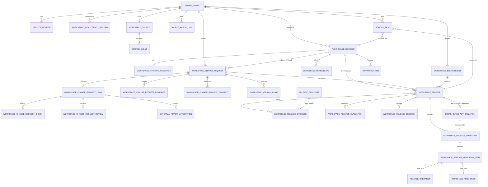

### 9.1 Existing table changes

**`caliber_projects`** — keep the table and `project_id`. Add:

| Column | Type | Rule |
| --- | --- | --- |
| `slug` | `String(128)` | Stable, lowercase workspace handle; unique within `tenant_id` |
| `source_mode` | `String(24)` | `caliber_managed` or `git_managed`; default `caliber_managed` |
| `accepted_revision_id` | nullable string, then FK | Current package accepted by Change Request CAS; added nullable in Phase 1 and constrained after revision tables exist in Phase 4; not an environment pointer |
| `archived_at` | nullable datetime | Set with archived status |
| `archived_by` | nullable string | Actor for lifecycle audit |

Replace global project-name uniqueness over time with `(tenant_id, slug)`.
Display names need not be globally unique. Do not drop the old uniqueness
constraint until collision analysis and all name-based lookups are removed.
`tenant_id` is non-null (`local` today), so the composite unique key does not
have nullable-key behavior. Add `next_revision_number`, initialized to `1`, and
allocate it with a compare-and-set update:

```sql
UPDATE caliber_projects
SET next_revision_number = next_revision_number + 1
WHERE project_id = :project_id
  AND next_revision_number = :expected
```

The caller owns `:expected` as its allocated number only when exactly one row is
updated; otherwise it reloads and retries within a bounded loop. This avoids
depending on `SELECT FOR UPDATE` or SQLite-version-specific `RETURNING`
behavior and works on SQLite and PostgreSQL. The unique revision key remains
the concurrency backstop. Rolled-back transactions and failed validation may
leave number gaps; numbers are monotonic identifiers, not a contiguous count.

**`caliber_project_members`** — no new role table or literal is required for the
MVP. The existing `owner` literal is the Admin permission role and may occur on
multiple active memberships; `caliber_projects.owner` identifies the one
primary owner. Add `deactivated_at`, `deactivated_by`, and role-change audit
provenance. The unique `(project_id, user_id)` remains correct; a membership is
reactivated rather than duplicated. Assignment validates the target's live
global scopes, and startup validation requires the primary owner to have one
matching active `owner`-role membership.

**Existing release and execution records** — add nullable foreign keys during
dual-read migration:

- `caliber_release_candidates.workspace_revision_id` and `.environment_id`
- `caliber_workflow_deployments.environment_id` and `.workspace_release_id`
- `caliber_workflow_runs.workspace_revision_id` and `.environment_id`
- `caliber_release_operations.workspace_release_operation_item_id`
- `caliber_workflow_promotions.workspace_release_operation_item_id`

Keep current aliases, version IDs, environment-class strings, manifest
snapshots, and evidence payloads for compatibility and independent recovery.

**`caliber_audit_log`** — add nullable indexed `project_id`, `revision_id`,
`change_request_id`, `change_request_head_id`, `environment_id`,
`workspace_version_tag_id`, `workspace_release_id`, and
`workspace_release_operation_id`. New Workspace mutations require the relevant
columns; legacy events remain nullable. Do not rely on unindexed keys inside
`details` for authorization or incident reconstruction.

**`caliber_personal_access_tokens` and `CaliberIdentity`** — add a nullable
`project_id` foreign key to the PAT table and `credential_kind`,
`credential_id`, and `credential_project_id` to `CaliberIdentity`. A
project-bound PAT is refused whenever the URL/header, resource owner, or
persisted worker context names a different workspace. Existing PAT rows remain
nullable for compatibility and continue to be bounded by the owner's live global
scopes and workspace memberships. New CI import tokens must be project-bound. A
CI actor is a dedicated automation user authenticated by a project-bound PAT and
holding the stored `editor` role; it is not a fifth workspace role and requires
no new principal model. The automation user must already exist in the current
identity source and hold `caliber.operator`; Workspace member administration
cannot grant that global scope. Token issuance, rotation, expiry, and revocation
are explicit prerequisites rather than capabilities of the import endpoint.
Durable work records
both the initiating principal and delegated worker identity, and delegation can
only narrow authority.

### 9.2 New tables

**`caliber_workspace_idempotency_records`** — `WSIDEM-*` primary key; non-null
`project_id`; closed `action`; caller-owned `idempotency_key`; canonical redacted
`request_sha256`, status (`in_progress`, `completed`), bounded response resource
type/ID and safe response digest, created/completed timestamps. Unique
`(project_id, action, idempotency_key)`. Every governed lifecycle mutation that
requires `Idempotency-Key` inserts or locks this record in the same transaction
as its durable intent. The same key and request digest replays the original
resource/response; the same key with different input returns `409
idempotency_conflict`. Records are retained at least as long as the referenced
revision, decision, rework task, or operation; expiry cannot make an old
external effect repeatable. Per-entity key columns below aid lookup, but this
ledger is the cross-route contract. For source uploads, the canonical request
digest incorporates the normalized source-tree digest rather than tar/gzip
container metadata, after archive safety checks have passed.

**`caliber_workspace_sources`** — `WSS-*` primary key; non-null `project_id`,
unique in the MVP (zero or one source per workspace); closed `provider`
(`github` first, with `gitlab` and `bitbucket` reserved for later adapters);
provider host/instance plus canonical repository ID and display path;
`default_branch` (informational — a release still pins a SHA); normalized
`root_path`; `manifest_path` defaulting to `.caliber/workspace.yaml`;
`import_mode` (`push` or later `provider_pull`); nullable opaque
`connection_ref`; provider capability snapshot; versioned CALIBER
`external_review_policy` and digest specifying required mapped approvals,
trusted checks/producers and source-range coverage; optional last-observed
provider ruleset digest; `status` (`active`, `disabled`, `error`); last
verified/reconciled timestamps; audit timestamps and actors.

No provider access token is stored for push mode. A later GitHub App or
equivalent connection uses the opaque `connection_ref`; keys and tokens live in
the encrypted connection/secret facility, never this row.

**`caliber_workspace_source_events`** — `WSSE-*` primary key; non-null
`source_id`; provider delivery/event ID, event type, repository ID, received and
processed timestamps, status, bounded redacted error and payload digest. Unique
`(source_id, provider_delivery_id)`. Store only the minimum normalized payload
required for replay/audit; raw webhook bodies follow a bounded retention policy.
Signature verification, repository/installation binding and idempotent inbox
insert happen before processing. A reconciliation cursor/poll repairs missed or
out-of-order deliveries.

**`caliber_workspace_source_actor_links`** — `WSSAL-*` primary key; non-null
`project_id`, provider/host, provider subject ID and CALIBER user ID; status,
verified method/time and revocation provenance. Unique active provider subject
and CALIBER user mappings within one provider host/workspace. A provider actor
without an active unambiguous link is retained as provenance but cannot satisfy
Reviewer, QA, Admin or separation-of-duty policy.

**`caliber_workspace_import_jobs`** — `WSI-*` primary key; `project_id` and
`source_id`; `repository` and `commit_sha`; raw `upload_sha256` for transport
diagnostics; canonical `source_bundle_sha256` over the normalized path/content
tree; immutable `source_snapshot_file_id`; `manifest_sha256`; `status` in `queued`, `running`,
`succeeded`, `failed`, `reconcile_required`; nullable `revision_id` set on
success; `idempotency_key` unique within project; `claimed_by` plus
lease/heartbeat fields following existing durable-worker patterns; bounded and
redacted `error_code` and `error_summary`; audit timestamps and actors.

After archive safety validation, CALIBER computes `source_bundle_sha256` from
the ordered normalized repository-relative path, media type, executable bit,
size, and SHA-256 of each accepted file—not from tar/gzip container bytes—and
writes a deterministic content-addressed source snapshot. The first successful
observation of `(source_id, commit_sha)` binds that commit to one canonical
source digest. A later upload claiming the same repository/commit with
different canonical content is rejected as `source_commit_digest_conflict` and
emits a high-severity audit event. Different compression metadata over the same
canonical tree is not equivocation. This detects caller inconsistency but still
does not prove that the content came from the named provider; push provenance is explicitly
`caller_attested`.

**`caliber_workspace_revisions`** — `WSR-*` primary key; non-null `project_id`;
monotonic `revision_number` per workspace; nullable `source_id` and
`source_commit_sha` (required for `git_managed`); canonical normalized
`manifest` JSON; `manifest_sha256`; `source_bundle_sha256`; immutable
`source_snapshot_file_id`; `source_attestation` (`caller_attested` in push mode); `revision_sha256` over
the canonical package descriptor defined in section 3.2 (manifest, complete
source identity/digest, and sorted resolved pins); `status` in
`validating`, `ready`, `invalid`;
`validation_report`; provenance fields.

Unique keys: `(project_id, revision_number)`;
`(project_id, revision_sha256)` for idempotent snapshots; and
`(project_id, source_id, source_commit_sha, source_bundle_sha256,
manifest_sha256)` for Git imports. A separate uniqueness/guard on
`(source_id, source_commit_sha)` enforces the one-observed-digest rule above.

Once status reaches `ready` or `invalid`, manifest, pins, digests, source
identity, and report are immutable. Retrying changed input creates a new import
job and, if content differs, a new revision. Retained ready revisions protect
both their per-resource snapshots and canonical source snapshot from garbage
collection.

**`caliber_workspace_revision_resources`** — `WSRR-*` primary key; non-null
`revision_id`; `resource_type` from a closed registry; workspace-local
`logical_name`; `resource_id`; exact immutable `version_ref`; `content_sha256`;
nullable `source_path` and `source_sha256` for Git provenance; nullable
`provider_ref` (never a secret); nullable `snapshot_file_id` and
`snapshot_sha256` for types whose current domain rows are mutable; `purpose` in `runtime`, `grounding`,
`evidence`, `integration`, `documentation`; and a bounded `resolution` JSON
carrying the adapter version.

Unique `(revision_id, resource_type, logical_name)`. A heterogeneous
`resource_id` cannot have one SQL foreign key, so the revision service must
resolve, authorize, and prove reconstructability for every pin before marking
the revision ready. The pin's content digest detects drift; its immutable
domain/provider reference or content-addressed snapshot makes recovery
possible. Garbage collection and delete paths refuse to remove referenced
versions/snapshots while any retained ready revision depends on them.

Revision resources include runtime assets and **quality definitions** such as
test-set and judge versions. They do not include evaluation runs, gate verdicts,
QA sign-offs, or final approvals produced after the revision exists. Those
outputs bind to the workspace release, avoiding an impossible digest cycle.

Runtime model dependencies are explicit revision resources (or a closed
`model_dependency` declaration) that pin provider, immutable model/deployment
snapshot, inference configuration digest, and adapter version. Mutable aliases
such as `latest` are invalid for QA, staging and production. If a provider cannot
offer an immutable model identifier, CALIBER records the strongest observable
fingerprint and refuses production unless policy explicitly accepts that weaker
guarantee.

**`caliber_workspace_change_requests`** — `WSCR-*` primary key; non-null
`project_id`, `current_head_revision_id`, and `created_by`; nullable
`base_revision_id` only for the first accepted package;
monotonic `head_generation`; title and bounded description; `status` in
`draft`, `open`, `changes_requested`, `technically_approved`,
`qa_in_progress`, `out_of_date`, `accepted`, `closed`; nullable
`accepted_at`, `accepted_by`, and `closed_reason`; closed `review_backend` in
`caliber`, `source_provider`; monotonic `lock_version`; and audit timestamps.
Provider change-request references live in the external-attestation rows so one
CALIBER package may truthfully cover several provider merges. Base and head must
be ready revisions in the same Workspace
and must differ when base is present. `base_revision_id` is the expected
accepted baseline; SQL `NULL` is the explicit compare-and-set expectation when
the Workspace has never accepted a package. `current_head_revision_id` is a
cached pointer to the latest append-only
head row, never an editable package. `review_backend` is immutable after
submission; a team that needs to change it closes the request and opens another
over the same revision, preserving an unambiguous audit history.

Submission requires exactly one active version claim. A `caliber` review also
requires at least one eligible Reviewer assignment; a `source_provider` review
requires a configured active source and one or more provider change-request
references whose verified resulting commits cover the complete source delta.
Acceptance is one transaction that verifies the current head's applicable
native checks/review or external attestation, QA release/evidence, actor separation and version
precedence, compares
`caliber_projects.accepted_revision_id` with `base_revision_id`, creates the
final immutable version tag, moves the accepted pointer to the head, and marks
the request `accepted`. A failed compare-and-set marks the request
`out_of_date`; it never applies an implicit merge. Accepted and closed requests
are terminal.

**`caliber_workspace_change_request_heads`** — `WSCRH-*` primary key;
`change_request_id`; monotonic `generation`; non-null `revision_id` and copied
`revision_sha256`; review-policy version and digest; `changed_by`, change
summary, and timestamp. Unique
`(change_request_id, generation)`. Rows are append-only. Updating the head
requires an open or changes-requested request, the expected request
`lock_version`, and a new ready revision. It appends the row, updates the cached
head pointer and generation, returns the request to `open`, and invalidates all
prior-generation checks and approvals as current authority while retaining
them as history. An `out_of_date` request cannot use ordinary head update:
`:rebase` must atomically set `base_revision_id` to the exact current accepted
revision and append a new conflict-resolved head generation under one expected
request lock version.

**`caliber_workspace_change_request_reviewers`** — `WSCRR-*` primary key;
`change_request_id`; `user_id`; assigned/removed actor and timestamps; active
flag. An active assignment is unique by request/user. Eligibility is checked
from live membership and global scopes on assignment and again on review. An
assigned Reviewer must hold Developer or Admin workspace authority and cannot
approve a head they authored or imported. Assignment grants no standing
Workspace permission. Assignment changes are refused once QA apply begins; before
that boundary, removing the reviewer whose approval satisfied policy recomputes
the outcome and returns the request from `technically_approved` to `open`.

**`caliber_workspace_change_request_comments`** — `WSCRC-*` primary key;
`change_request_id`; nullable `head_id` and structured resource/path anchor;
bounded Markdown body; author and timestamp. Comments are append-only and have
no edit/delete/resolve operation in the MVP. Secrets and provider payloads are
rejected or redacted under the same audit-content policy.

**`caliber_workspace_change_request_checks`** — `WSCRCHK-*` primary key;
non-null `head_id`; closed `check_name`; check implementation version, input
digest and evidence reference/digest; status in `queued`, `running`, `passed`,
`failed`, `cancelled`; durable lease fields and timestamps. A partial unique
index permits one active attempt per `(head_id, check_name)`. Only required
checks from the policy snapshot bound to that head count toward technical
approval. Old-head checks remain visible but never satisfy the current head.

**`caliber_workspace_change_request_reviews`** — `WSCRREV-*` primary key;
non-null `change_request_id`, `head_id`, `reviewer_id`; decision in `approve`,
`request_changes`; bounded rationale; actor-role/scope snapshot and timestamp.
Rows are append-only. The current technical outcome is derived only from the
latest eligible review per assigned reviewer for the current head. A new head
generation makes all earlier approvals stale by construction. A
`request_changes` decision before QA apply invalidates any prepared QA release
for that head. Once the first QA provider effect begins, technical review is
frozen for that candidate; QA owns the subsequent `go`/`no_go` decision.

Native reviewer, comment, check and review rows are authoritative only when
`review_backend=caliber`. They may still display imported provider provenance,
but must not be synthesized into human CALIBER decisions.

**`caliber_workspace_external_review_attestations`** — `WSERA-*` primary key;
non-null `change_request_id`, `head_id`, `source_id`; provider change-request
ID/URL; exact provider head commit and imported/resulting commit; source-tree and
workspace revision digests; CALIBER external-review-policy version/digest;
optional observed provider-ruleset digest; required check names plus trusted
source identities and terminal conclusions; normalized
review actors/decisions with actor-link IDs; merge method, merge actor and
timestamp; provider event IDs; verification adapter/version/time; status in
`verified`, `insufficient`, `stale`, `revoked`; bounded reason. Rows are
append-only. Unique verification input prevents duplicate attestations. Only a
complete set of `verified` rows whose resulting commit chain/tree delta covers
the CALIBER base-to-head source change and whose digests equal the current head
satisfies technical review. Persist a deterministic coverage digest and any
uncovered commits/paths in the derived summary. A new head, provider review
dismissal, direct/bypassed commit, policy failure or identity-link revocation
makes the set ineligible without deleting history. A first-package baseline
attestation is a distinct Admin-approved kind and cannot be reused as ordinary
PR evidence.

**`caliber_workspace_version_claims`** — `WSVC-*` primary key; non-null
`project_id`, `change_request_id`; canonical SemVer without a `v` prefix;
status in `reserved`, `accepted`, `abandoned`; actor and timestamps. Unique
`(project_id, semantic_version)`, with a partial unique index allowing one
`reserved` claim per Change Request. The string and owner never change. If an
out-of-date request's version no longer has greater SemVer precedence than the
highest accepted version, rebase atomically abandons it and reserves a new
version supplied by the Developer. Closing an unaccepted request abandons its
active claim. An abandoned version is not reused; this small amount of
version-number waste avoids ambiguous audit history and race-prone reservation
recycling.

**`caliber_workspace_version_tags`** — `WSVT-*` primary key; non-null
`project_id`, `revision_id`, `change_request_id`; canonical immutable `tag`;
`kind` in `qa_candidate`, `accepted`; and creator/timestamp. Unique
`(project_id, tag)`. Entering QA creates `<version>-rc.<head_generation>` for the
exact head. Acceptance creates `<version>` for the same digest and marks the
claim accepted. Tags cannot be moved or deleted in the MVP. `v` is presentation
syntax only; API storage and comparison use canonical SemVer.

**`caliber_workspace_environments`** — `WSE-*` primary key; non-null
`project_id`; `name` (`dev`, `qa`, `staging`, `prod`); `environment_class`;
`promotion_order` (10, 20, 30, 40); `status` (`active` or `disabled`); `policy`
JSON carrying required decision kinds, predecessor requirement, gate
requirements and rollback policy; `policy_version` and `policy_sha256`;
non-secret `config_refs`; `config_sha256` included in release evidence;
`operation_state` in `idle`, `baseline_required`, `applying`,
`reconcile_required`, `rolling_back`; nullable `pending_operation_id`;
nullable CAS-protected `current_release_id`; monotonic `lock_version`; audit
fields.

Unique `(project_id, name)`. Exactly four rows are seeded on Workspace create.
Database constraints and service validation fix each name to its matching class
and order; unknown values are rejected rather than classified or silently
treated as production. The existing classifier remains for legacy aliases and
adapter target validation, not for inventing new Workspace environments. There
is no MVP delete path. Policy updates may tighten the versioned default template
but cannot remove its required predecessor or human decisions.

**`caliber_workspace_releases`** — `WSREL-*` primary key; `project_id`,
`revision_id` and `environment_id` as exact release coordinates;
nullable `change_request_id` and `change_request_head_id` (required for QA and
protected forward promotion); nullable `version_tag_id` and
`predecessor_release_id`; `environment_config_sha256`,
`runtime_dependencies_sha256`, and `policy_sha256` captured before evaluation;
caller-owned `request_idempotency_key` unique within project;
`evaluation_evidence_sha256` over the ordered evidence-link set;
`decision_set_sha256` populated when the environment's required decision set is
complete (canonical empty set for development/staging); `status` for the
evaluation/decision state machine below; request/evaluation actors and
timestamps; monotonic `lock_version` for compare-and-set transitions; bounded
`error_code` and `error_summary`. Apply actors and provider outcomes do not
belong on this row.

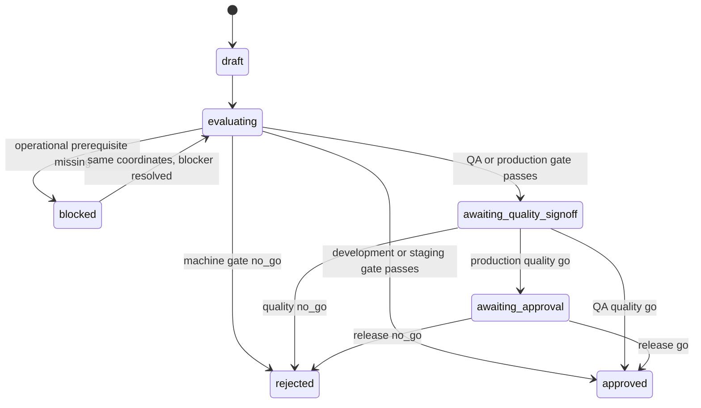

The state names are the literal `status` values, matching the snake_case
vocabulary used by every other status column here and by the existing
`caliber_release_operations` and refinement-job statuses. `blocked` returns to
`evaluating` only when the same immutable revision/config coordinates remain
valid and a non-content blocker is resolved. Machine or human `rejected` is
terminal; changed content requires a new revision and release. `approved`
authorizes creation of an apply operation but does not claim that any provider
effect occurred. The one normal exception is QA candidate deployment: a QA
release in `awaiting_quality_signoff` may be applied by Admin after its machine
gate, technical approval and development predecessor are revalidated, so QA can
test the actual target. That environment is explicitly test-only, and a
subsequent `no_go` blocks promotion and leaves the candidate visible until
rollback or replacement. On QA `go`, the same transaction attempts Change Request
acceptance; if its base is stale, the QA decision and release remain honest but
the Change Request becomes `out_of_date` and staging is refused. All other
normal apply requires `approved`. A valid production break-glass authorization
may instead create one operation while a production release is
`awaiting_quality_signoff` or `awaiting_approval`; the release keeps that honest
decision status and is never relabelled as normally approved.

**`caliber_workspace_release_evaluations`** — `WSRELEV-*` primary key;
non-null `project_id` and `workspace_release_id`; caller-owned
`idempotency_key` unique within project; immutable evaluation-plan and input digests; status in `queued`,
`running`, `succeeded`, `failed`; `claimed_by`, lease and heartbeat fields;
linked evaluation-run IDs and resulting gate-verdict reference; bounded error
fields; request/start/complete actors and timestamps. The endpoint creates or
replays this durable attempt before dispatch. Worker death resumes after lease
expiry; it never leaves the release indefinitely `evaluating`. An operational
attempt failure returns the release to `blocked` with a retryable reason; a
successful machine `no_go` makes the release terminally `rejected`. Retrying a
non-content blocker creates a new attempt with a new caller key while retaining
the same immutable release coordinates and complete attempt history. A partial
unique index permits at most one `queued`/`running` attempt per release, and
release status changes compare the expected release `lock_version` so two
workers cannot settle the same transition differently.

`caliber_release_candidates` remains the artifact-level rubric/evidence model it
is today: one artifact reference, one evaluated status, and one optional legacy
final signoff. It is one possible evidence link, but the Workspace release does
not reuse `caliber_release_signoffs` for its two governance decisions.

**`caliber_workspace_release_evidence`** — `WSRELE-*` primary key;
`workspace_release_id`; `kind` from a closed registry such as
`evaluation_run`, `gate_verdict`, `release_candidate`, `config_snapshot`, and
`provider_preflight`; immutable `evidence_ref`; `evidence_sha256`; `required`;
and provenance timestamps/actor. Unique
`(workspace_release_id, kind, evidence_ref)`. The release's evaluation digest is
computed from the canonical ordered set, allowing an aggregate revision to bind
multiple runs and artifact candidates without pretending one candidate is the
whole release.

**`caliber_workspace_release_decisions`** — `WSRELD-*` primary key; non-null
`workspace_release_id`; `kind` in `quality`, `release`; `decision` in `go`,
`no_go`; rationale; `decided_by`; actor-role and effective-scope snapshot;
revision, environment-config, runtime-dependency, gate-evidence and policy
digests; `created_at`. Decisions are append-only. A unique final decision per
`(workspace_release_id, kind)` is enforced transactionally and by a unique key.
A `no_go` decision rejects that release. Changing any bound digest requires a
new evaluation and new decisions rather than mutating an old snapshot.
QA and production require `quality`; production additionally requires
`release`. Development and staging require neither human decision on their own
release row because their predecessor contracts already establish eligibility.
The QA `quality` decision also binds `change_request_head_id`; production's
fresh decision binds the production configuration and evidence rather than
reusing QA's environment-specific assertion.

**`caliber_workspace_break_glass_authorizations`** — `WSBGA-*` primary key;
non-null `project_id`, `workspace_release_id`, and `environment_id`; mandatory
bounded reason and incident/reference fields; `authorized_by`; authenticated
credential kind and ID; the same revision, environment-config,
runtime-dependency, gate-evidence and policy digests bound by normal approval;
`expires_at`; `created_at`. It is
append-only, can authorize only one apply operation for that exact release, and
can target only the fixed production environment; it cannot authorize rollback
or a different environment. Creation requires an
interactive `caliber.admin` credential, a passing machine gate and integrity
checks, an idle environment, valid CAS expectations, and an explicitly enabled
Workspace recovery policy. The break-glass endpoint creates the authorization
and its operation intent in one transaction; a unique operation-side foreign
key prevents reuse, and expiry is rechecked immediately before the first
provider effect. Refused attempts are audited but do not create an
authorization row. If it expires while the operation is still `prepared`, the
worker atomically cancels that operation and releases its matching environment
lock without calling a provider. Once the first effect begins, expiry cannot
abandon partial work; normal observe/reconcile handling takes over.

**`caliber_workspace_release_operations`** — `WSRELOP-*` primary key;
non-null `project_id`, `workspace_release_id`, `environment_id`, and `kind`
(`apply` or `rollback`);
for rollback, non-null `target_release_id`; caller-owned `idempotency_key`
unique by `(project_id, kind, idempotency_key)`; expected current-release and
environment lock version;
`status` in `prepared`, `applying`, `applied`, `failed`,
`reconcile_required`, `cancelled`; request/apply/complete actors and timestamps;
`observation_count`, last-observed timestamp, nullable unique
`break_glass_authorization_id` if used, and bounded error fields. A release may
have several historical
operations, but one environment has at most one non-terminal operation.
Enforce that invariant with a partial unique environment index over
`prepared`, `applying`, and `reconcile_required`; application checks alone are
not sufficient under concurrent apply/rollback requests. A rollback target must
belong to the same project and environment and have a previously settled
`applied` operation there; an arbitrary approved-but-never-applied release is
not a recoverable target. For rollback, `workspace_release_id` is the exact
expected current release being replaced, `target_release_id` is the prior
release being restored, and operation items are prepared from the target
release's revision while recording the current provider refs as `before_ref`.

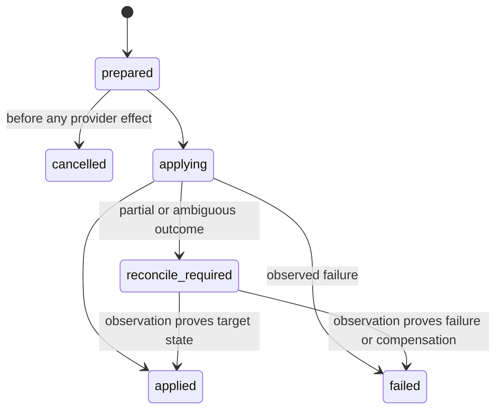

**`caliber_workspace_release_operation_items`** — `WSRELOPI-*` primary key;
`workspace_release_operation_id` and `revision_resource_id`; `action` in
`no_op`, `bind`, `promote`, `activate`, `publish`, `verify`; `target_ref`; exact
`before_ref` and `after_ref`; `status` in `prepared`, `applying`, `applied`,
`failed`, `reconcile_required`, `rolled_back`; nullable
`provider_operation_ref` naming an existing release operation, promotion or
run; redacted `provider_result`; item-level timestamps and error fields.

Unique `(workspace_release_operation_id, revision_resource_id, target_ref)`.
An operation is `applied` only when every deployable item is applied and every
required evidence/config item remains valid. Optional deployable failures are
out of scope for the MVP because they make the meaning of an aggregate release
unstable.

Apply or rollback acquires the environment operation lock and sets
`pending_operation_id` before the first provider effect. On complete apply it
moves `current_release_id` to the operation's release; on complete rollback it
moves the pointer to `target_release_id`. A proven failure with no remaining
effect, a completed compensation, or cancellation before effect leaves the
pointer unchanged. Each terminal settlement clears the matching pending
pointer, increments `lock_version`, and returns the environment to `idle` in one
database transaction. A stale worker that no longer owns the pending pointer
cannot clear another operation's lock.
The original release remains historically approved; rollback never rewrites it
to “rolled back.” On partial or ambiguous effect the operation and environment
become `reconcile_required` and `current_release_id` remains the last confirmed
pointer. Reconcile observes and settles that same operation; each observation
is audited. New runtime execution, promotion, apply, and rollback are refused
until it settles. The old pointer alone is never treated as proof that external
state is still old.

**`caliber_rework_tasks`** — `RWT-*` primary key; non-null `project_id`;
exactly one source link to a refinement job or Workspace release; failure kind
(`machine_gate`, `quality_no_go`, `release_no_go`, `iterations_exhausted`);
immutable reason/evidence reference; `assigned_to`; status in `open`,
`in_progress`, `resolved`, `cancelled`; optional `resolution_revision_id` and
`resolution_release_id`; audit timestamps and actors. A rejected immutable
release never reopens. Resolving its task requires a superseding revision and
release when content changed. Notifications are out of scope, but list/get and
ownership are not. This is the final target schema. Phase 3 initially permits
only a non-null refinement-job/candidate source. Phase 5 additively introduces
the Workspace-release foreign key and then enforces the exactly-one-source
check; Phase 3 cannot reference a table that does not exist yet.

`P3-A` delivered exactly that narrower slice, and only that slice: no
`project_id`, no Workspace-release FK, `resolution_job_id` in place of the
not-yet-existing `resolution_revision_id`/`resolution_release_id`, and
`failure_kind`/`status` restricted to the values `orchestrator/eval_stage.py`
and `routes/rework_tasks.py` can actually produce today (`machine_gate` /
`iterations_exhausted`; `open` / `in_progress` / `resolved` — no
`quality_no_go`, `release_no_go`, or `cancelled`, since nothing creates or
reaches those yet). See section 16, Phase 3, item 1.

### 9.3 The Git workspace manifest

The repository owns authored source. CALIBER owns the resolved lock represented
by the workspace revision and its resource rows.

```yaml
apiVersion: caliber/v1alpha1
kind: Workspace
metadata:
  slug: mortgage-underwriting

resources:
  agents:
    - name: underwriting-agent
      path: caliber/agents/underwriting-agent.yaml

  workflows:
    - name: underwriting
      path: caliber/workflows/underwriting.json

  prompts:
    - name: eligibility-decision
      path: caliber/prompts/eligibility-decision.md
      metadataPath: caliber/prompts/eligibility-decision.yaml

  skills:
    - name: explain-decision
      path: caliber/skills/explain-decision.md

  tools:
    - name: income-ratio
      path: caliber/tools/income-ratio.yaml

  testSets:
    - name: underwriting-regression
      path: caliber/test-sets/underwriting-regression.jsonl

  knowledgeBases:
    - name: policy-manual
      manifestPath: caliber/knowledge/policy-manual.yaml

  judges:
    - name: grounded-decision
      path: caliber/judges/grounded-decision.yaml

  integrations:
    - name: servicing-api
      path: caliber/integrations/servicing.openapi.yaml

  mcpBindings:
    - name: policy-search
      connectionRef: mcp://approved-policy-search
      policyPath: caliber/mcp/policy-search.yaml

  models:
    - name: decision-model
      provider: example-provider
      snapshot: immutable-model-or-deployment-id
      configPath: caliber/models/decision-model.yaml

documentation:
  - docs/architecture.md
  - docs/runbook.md

secretRefs:
  - secret://servicing-api-token
```

Manifest rules:

- paths are normalized POSIX repository-relative paths and cannot escape the
  configured root;
- duplicate logical names per type are refused;
- unknown keys/types are refused for `v1alpha1` rather than ignored;
- secret-looking values are refused; only `secret://` references are accepted;
- source bundle size, file count, individual file size, decompression ratio,
  symlinks, and media types are bounded;
- mutable URLs, provider `latest` aliases, and unversioned object references are
  not valid revision pins;
- the canonical digest uses normalized JSON, sorted resource keys, canonical
  source-tree entries and their SHA-256 values, the complete source-bundle SHA-256, exact resolved version
  refs or snapshot digests, and adapter contract versions;
- a resource backed only by a mutable row is snapshotted before the revision can
  become ready; a digest without recoverable bytes is refused;
- a repository/commit previously observed with different canonical source
  content is refused and audited rather than treated as another revision;
- materialization failures leave the import failed or reconciliation-required;
  they do not create a ready revision with missing resources.

## 10. Isolation and security

### 10.1 Relational isolation

- Require non-null `project_id` for newly created workspace-owned resources.
- Add foreign keys and `(project_id, status/name/created_at)` indexes where
  domain constraints allow.
- Resolve child records through an authorized parent; never authorize a version,
  run, promotion, file, or test result only by its own guessed ID.
- Preserve `user` and `public` visibility only as explicit library/catalog
  scopes. They are not implicit members of an active workspace.
- Require a selected workspace for workspace writes, imports, executions, and
  releases. An absent header cannot mean "write globally."
- Scope background claims and resolver queries by the persisted workspace ID,
  not ambient request state.
- Change global uniqueness constraints to workspace-local constraints only
  after dependent name-based lookups are made workspace-aware.

### 10.2 Provider isolation

- Add a CALIBER prompt binding/projection so MLflow prompt names are not treated
  as globally visible workspace resources.
- Namespace new provider prompt names with a stable workspace key while
  retaining the workspace-local logical name in CALIBER.
- Workflow tool/skill/prompt resolvers must accept workspace/revision context;
  selecting all active registry rows is not valid for a strict workspace run.
- MCP connections remain platform-managed in the MVP. A workspace binds an
  approved connection plus policy; provider credentials do not move into the
  workspace.
- Object keys continue to use the existing tenant/project namespace. Revision
  pins use immutable file IDs, versions, object version IDs, and SHA-256
  digests.

### 10.3 Source-import security

- Accept full commit SHAs, never a mutable branch as release provenance.
- Authenticate CI with a short-lived or regularly rotated CALIBER PAT scoped no
  wider than operator actions and bound to exactly one workspace.
- Bound uploads before decompression and reject path traversal, symlinks,
  duplicate normalized paths, device files, unsupported media, and archive
  bombs.
- After validation, compute the digest from canonical normalized tree entries
  and retain a deterministic content-addressed source snapshot; the raw archive
  hash is diagnostic and never the commit-equivalence key.
- Do not execute imported tool code during import. Static validation and
  sandboxed test execution are separate explicit steps.
- Redact secret values from errors, evidence, logs, manifests, and audit rows.
- Record provider/host, canonical repository ID, commit, run URL, actor,
  digests, and importer/adapter versions. These are provenance, not proof that
  the provider reviewed the change.
- In push mode the dedicated CI principal is the trust boundary asserting that
  the uploaded bytes match the named commit. If provider-verified commit/review
  evidence is required, QA/staging/production must wait for a configured App
  adapter or use native CALIBER review; CALIBER must not overstate a
  caller-supplied SHA as proof.
- Provider App webhook delivery must verify signatures, connection/repository
  binding, event replay keys, and commit reachability before queueing an import.
- Request the minimum provider capabilities. Installation credentials perform
  automation only; any provider review/comment attributed to a human requires a
  user-authorized identity and the intersection of provider and CALIBER access.
- Bind external technical-review evidence to the exact provider request head,
  resulting commit, imported source-tree digest, trusted status-check sources,
  effective policy snapshot and mapped actors. “Merged” alone is insufficient.
- Process webhooks through a durable idempotent inbox and periodically reconcile
  provider state. Event delivery is a hint, never the only durable evidence.
- Never expose repository, PR/MR or provider metadata to a caller who lacks
  CALIBER Workspace read access, even if the provider repository is public.

### 10.4 Release safety

- Evaluate a canonical release plan before any provider mutation.
- Persist the release coordinates and gate evidence, normal decisions or the
  exceptional authorization, parent operation, and all prepared child intents
  before the first external effect where the provider protocol allows it.
- Serialize non-terminal operations per `(environment_id, target_ref)`.
- Use optimistic concurrency against the environment's current release.
- Acquire one environment operation lock and set its pending operation before the
  first provider effect. While `applying`, `rolling_back`, or
  `reconcile_required`, refuse new runs and promotions for that environment.
- Refuse execution and release operations while an environment is disabled or
  `baseline_required`.
- Permit an applied QA candidate in `awaiting_quality_signoff` to execute only
  under QA/runtime-test policy. If QA records `no_go`, block new QA executions
  and every forward promotion until Admin rolls back or applies a superseding
  reviewed candidate.
- Require the same revision digest at each promotion step.
- Revalidate membership, normal approval, narrow QA-candidate eligibility, or
  valid single-use production break-glass authorization; revision integrity,
  environment config digest, predecessor evidence, and provider preflight
  immediately before apply.
- Store exact before/after refs for every reversible item.
- If observation cannot distinguish success from failure, use
  `reconcile_required`; do not retry an effect blindly.
- Rollback creates a new audited Workspace release operation targeting an exact
  prior release. It does not mutate the original release, decrement version
  numbers, or reconstruct state from "latest minus one."
- Break-glass may substitute only for fresh production human decisions and
  actor separation after normal QA acceptance and staging verification. It
  never bypasses a failed machine gate, revision or
  evidence integrity, workspace isolation, provider preflight, environment
  lock, or stale compare-and-set expectation.
- Break-glass accepts only a gate-passed production release awaiting one or both
  production human decisions. It does not create those decisions or change the release status;
  the applied operation and authorization remain the explicit historical basis
  for environment eligibility.

## 11. Key interactions

### 11.1 Git-provider import and revision creation

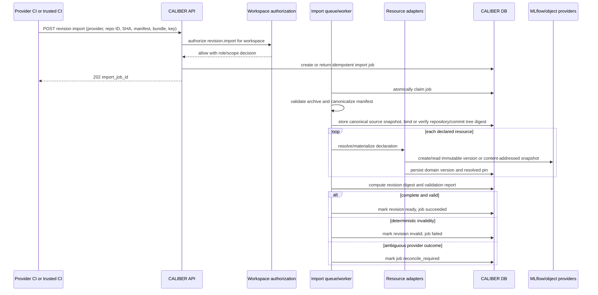

### 11.2 Change review while development continues

The native review backend follows this interaction:

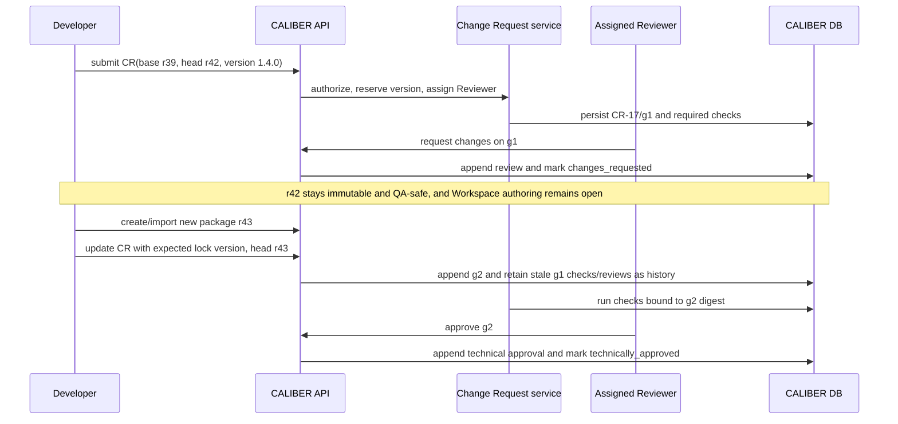

For `review_backend=source_provider`, CALIBER does not recreate the provider
discussion:

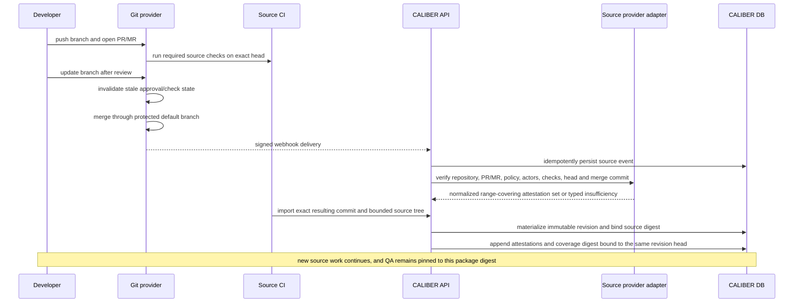

Webhook and import may arrive in either order. The request becomes technically
approved only after both records exist and agree; order never changes the
result.

### 11.3 Promotion through environments

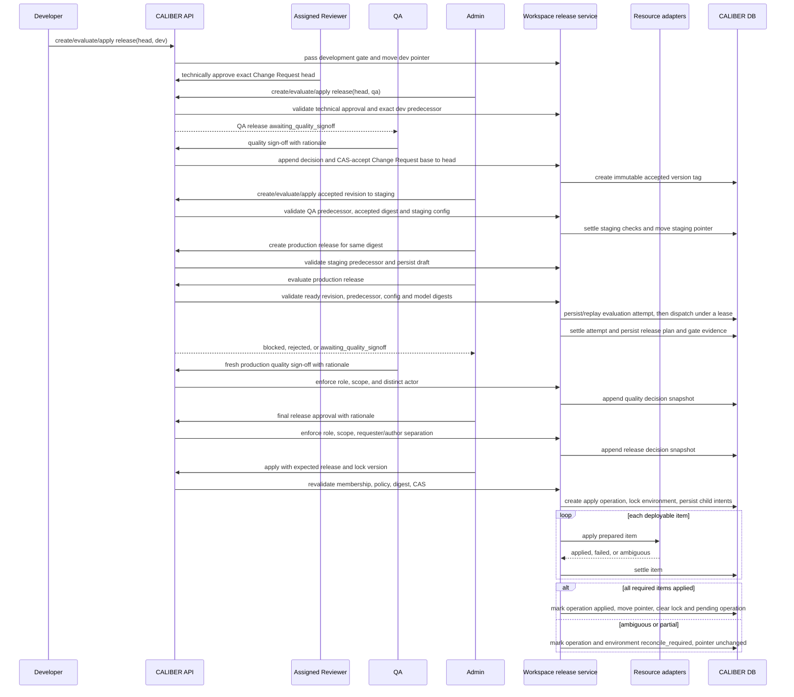

### 11.4 Runtime execution

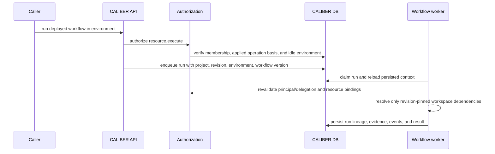

## 12. API surface

### 12.1 Compatibility strategy

For the MVP:

- keep `/ajax-api/2.0/mlflow/caliber/projects` as the wire root;
- keep `project_id`, `PRJ-*`, and `X-CALIBER-Project`;
- use "Workspace" in product documentation and client-facing copy;
- add `workspace` as an SDK convenience namespace only if it delegates to the
  same `/projects` contract without duplicating models;
- return deprecation metadata before introducing `X-CALIBER-Workspace` or
  `/workspaces` in a future major API;
- never accept both project and workspace headers with different values. If a
  later alias is introduced, conflicting values return `400`.

This avoids changing hundreds of resource fields and consumers before the
boundary itself is reliable.

### 12.2 Routes

| Method and path | Purpose | Required action |
| --- | --- | --- |
| `GET /projects` | Visible workspaces; explicit library mode remains separate | authenticated read |
| `GET /admin/projects` | Metadata-only operational inventory; never resource content | `caliber.admin` |
| `POST /projects` | Create workspace and transactionally seed primary Admin + fixed environments | pre-membership `project.create`; **both** operator and approver scopes |
| `GET /projects/{id}` | Details, capabilities, accepted revision, open-request summary and environment pointers | `read` |
| `PATCH /projects/{id}` | Name and description only | `project.update` |
| `POST /projects/{id}/archive` / `restore` | Explicit lifecycle transition | `project.archive` / `project.restore` |
| `POST /projects/{id}/transfer-ownership` | Atomic owner transfer to an active eligible member | `project.transfer_owner` |
| Existing member endpoints | List/add/change/deactivate collaborators | `project.manage_members` |
| `GET /projects/{id}/source` | Read source mode, binding, status | `read` |
| `PUT /projects/{id}/source` | Create or replace a disabled binding with `If-Match` | `source.manage` |
| `POST /projects/{id}/source:enable` | Validate and activate a configured binding with `If-Match` | `source.manage` |
| `POST /projects/{id}/source:disable` | Disable the active binding before replacement with `If-Match` | `source.manage` |
| `GET /projects/{id}/source/capabilities` | Provider-neutral capability and last-verification snapshot; no secret/token metadata | `read` |
| `POST /projects/{id}/source:reconcile` | Refresh commit/review state after missed webhooks or provider recovery | `source.manage` |
| `POST /projects/{id}/revision-imports` | Queue commit-pinned import | `revision.import` |
| `GET /projects/{id}/revision-imports/{job_id}` | Read durable import status | `read` |
| `GET /projects/{id}/revision-imports` | List import jobs — required for recoverability | `read` |
| `POST /projects/{id}/revision-imports/{job_id}:reconcile` | Observe an ambiguous materialization; never blind-retry it | `revision.import` |
| `GET /projects/{id}/revisions` | List immutable revisions | `read` |
| `GET /projects/{id}/revisions/{revision_id}` | Revision, pins, validation | `read` |
| `GET /projects/{id}/revisions/{revision_id}/diff?base=...` | Deterministic pin/content diff | `read` |
| `POST /projects/{id}/revisions:snapshot` | Snapshot selected CALIBER-managed versions | `revision.create` |
| `GET /projects/{id}/change-requests` | Cursor-paged requests with filters for status, author, reviewer and version | `read` |
| `GET /projects/{id}/change-requests/{cr_id}` | One request with current head, capabilities and state summary | `read` |
| `POST /projects/{id}/change-requests` | Create draft with ready base/head, reserve semantic version and assign Reviewer | `change_request.create` |
| `POST /projects/{id}/change-requests/{cr_id}:submit` | Validate current base, assignments and policy; start head checks | `change_request.update` |
| `POST /projects/{id}/change-requests/{cr_id}:update-head` | Append a ready revision as the next head generation using ETag/lock version | `change_request.update` |
| `POST /projects/{id}/change-requests/{cr_id}:rebase` | From `out_of_date`, atomically replace the base, append a conflict-resolved head and, when required, abandon/reserve the semantic version | `change_request.update` |
| `POST /projects/{id}/change-requests/{cr_id}:close` | Close without acceptance; preserve/burn the version claim | owner `change_request.update` or Admin `change_request.manage` |
| `GET /projects/{id}/change-requests/{cr_id}/comments` | Cursor-paged append-only discussion | `read` |
| `POST /projects/{id}/change-requests/{cr_id}/comments` | Add a comment, optionally anchored to a head/resource | `change_request.comment` |
| `GET /projects/{id}/change-requests/{cr_id}/reviewers` | Active and historical technical Reviewer assignments | `read` |
| `PUT /projects/{id}/change-requests/{cr_id}/reviewers/{user_id}` | Assign an eligible technical Reviewer | `change_request.manage` |
| `DELETE /projects/{id}/change-requests/{cr_id}/reviewers/{user_id}` | Remove a Reviewer without deleting history | `change_request.manage` |
| `GET /projects/{id}/change-requests/{cr_id}/reviews` | Cursor-paged technical-review history | `read` |
| `POST /projects/{id}/change-requests/{cr_id}/reviews` | Append `approve`/`request_changes` for the exact current head | `change_request.review` |
| `GET /projects/{id}/change-requests/{cr_id}/external-review-attestations` | Provider review/check/policy evidence and insufficiency reasons for each head | `read` |
| `POST /projects/{id}/change-requests/{cr_id}:refresh-external-review` | Queue idempotent provider re-verification; no human decision is synthesized | `change_request.update` |
| `GET /projects/{id}/change-requests/{cr_id}/checks` | Cursor-paged head-bound check attempts and evidence | `read` |
| `GET /projects/{id}/version-tags` | Cursor-paged immutable candidate/accepted tag history | `read` |
| `GET /projects/{id}/version-tags/{tag}` | Exact tag, package digest and source Change Request | `read` |
| `GET /projects/{id}/environments` | Environment state and current release | `read` |
| `GET /projects/{id}/environments/{name}` | One environment — required for recoverability | `read` |
| `PATCH /projects/{id}/environments/{name}` | Tightening policy and non-secret config refs with ETag; fixed identity fields are not writable | `environment.manage` |
| `POST /projects/{id}/environments/{name}:enable` / `:disable` | Explicit validated lifecycle with `If-Match`; no create/delete route in MVP | `environment.manage` |
| `GET /projects/{id}/rework-tasks` | List owned/visible failed-gate and rejection work | `read` |
| `GET /projects/{id}/rework-tasks/{task_id}` | Task, reason, source evidence and resolution | `read` |
| `POST /projects/{id}/rework-tasks/{task_id}:claim` / `:resolve` / `:reassign` | Developer ownership flow; reassign is Admin-only policy | `rework.update` |
| `GET /projects/{id}/releases` | List releases — required for recoverability | `read` |
| `POST /projects/{id}/releases` | Create revision-to-environment candidate | `release.request` |
| `GET /projects/{id}/releases/{release_id}` | Immutable coordinates, state/count summary, decisions and exceptional authorization summary | `read` |
| `GET /projects/{id}/releases/{release_id}/evidence` | Cursor-paged immutable evidence links | `read` |
| `POST /projects/{id}/releases/{release_id}/evaluate` | Create/replay a durable deterministic evaluation attempt | `release.evaluate` |
| `GET /projects/{id}/releases/{release_id}/evaluations` | Cursor-paged evaluation attempts for recovery and audit | `read` |
| `GET /projects/{id}/releases/{release_id}/evaluations/{evaluation_id}` | One attempt, linked runs and gate result | `read` |
| `POST /projects/{id}/releases/{release_id}/quality-signoff` | QA `go` or `no_go`; QA-environment `go` attempts Change Request acceptance, production `go` advances to Admin decision | `release.quality_signoff` |
| `POST /projects/{id}/releases/{release_id}/approve` | Admin final `go` or `no_go` decision | `release.approve` |
| `POST /projects/{id}/releases/{release_id}/apply` | Create an apply operation for an approved release, or the narrowly eligible QA candidate described in section 5.3 | `release.apply` |
| `GET /projects/{id}/release-operations` | Cursor-paged operations, filterable by release/environment/kind/state | `read` |
| `GET /projects/{id}/release-operations/{operation_id}` | Parent operation and cursor/page-safe child outcomes | `read` |
| `POST /projects/{id}/release-operations/{operation_id}:reconcile` | Observe/settle an ambiguous operation | `release.reconcile` |
| `POST /projects/{id}/environments/{name}:rollback` | Create a rollback operation targeting an exact prior release | `release.rollback` |
| `POST /projects/{id}/releases/{release_id}/break-glass-apply` | Atomically create an expiring one-release authorization and its apply operation | `release.break_glass_apply`; no ordinary role grant |

Normal ownership transfer requires the current primary owner, an active target
Admin member whose live scopes include operator and approver, and one transaction
that changes `caliber_projects.owner` while preserving valid Admin memberships.
Adding another Admin is ordinary member administration and does not transfer
primary ownership. Platform recovery is a different, explicitly audited
break-glass operation; ordinary transfer never requires or confers global admin.

Create must transactionally create the primary-owner membership and the fixed
`dev`, `qa`, `staging`, and `prod` rows; a failed seed leaves no partial workspace.
The creator must already hold both required global scopes. Every mutation accepts an
idempotency key where retries can cross an external effect. Apply also requires
`expected_current_release_id` and `expected_lock_version`; stale or non-idle
environment state returns `409` before any child operation starts.

Existing list methods keep their response shape. New Workspace history lists
use `limit` plus an opaque `cursor` and return `next_cursor` under the existing
envelope, with stable sort and documented filters. They do not reuse the SDK's
offset `Page`. All configuration update/enable/disable routes use ETags. Error responses
include stable `reason_code`, request ID, and retry metadata where relevant;
human-readable detail is not an SDK contract.

The list/get routes marked "required for recoverability" are not optional
conveniences. Without them, a client that loses local state cannot rediscover an
in-flight import or release, which makes automation unrecoverable after a
restart.

For a nested path, the path `project_id` is authoritative. An optional
`X-CALIBER-Project` header must match it or the server returns
`400 workspace_context_mismatch` before resource lookup. A project-bound PAT is
checked independently against the path. Resource routes without a project in
the path require explicit workspace context for workspace-owned writes.

Representative push-based import:

```http
POST /ajax-api/2.0/mlflow/caliber/projects/PRJ-123/revision-imports
Authorization: Bearer <scoped-caliber-pat>
X-CALIBER-Project: PRJ-123
Idempotency-Key: github:example/repo:4ac0e91
Content-Type: multipart/form-data

metadata={
  "repository":"example/repo",
  "commit_sha":"4ac0...e91",
  "manifest_path":".caliber/workspace.yaml",
  "github_run_url":"https://github.com/.../actions/runs/..."
}
bundle=@caliber-source.tar.gz
```

Return `202` with the import job. Repeating the same idempotency key and digest
returns the same job; reusing the key for different content returns `409`.

## 13. The CALIBER Python SDK

“SDK” in this document means the first-party `sdk/caliber-sdk` Python package,
not MLflow's SDK, GitHub's SDK, or `caliber-plugin-sdk`. It is the primary
interface for this initiative. The recommended decision:

> Extend the existing `ProjectsAPI` and `X-CALIBER-Project` wire contract into
> one typed Workspace API tree. Expose that same object as both
> `client.projects` and `client.workspaces`, preserve all current project
> methods and models, and add synchronous and asynchronous parity for every GA
> Workspace operation.

This is deliberately **not** a new package, generated client, second set of
models, or `/workspaces` HTTP API.

### 13.1 Definition of complete

An SDK user should be able to run the whole lifecycle without constructing URLs,
dictionaries, headers, or polling loops. Support is complete only when:

- every GA Workspace server operation has a public typed method;
- sync and async clients expose equivalent signatures, models, errors, request
  options, pagination, and lifecycle semantics;
- every workspace-bound request sends an explicit project scope matching the
  path `project_id`;
- complex writes use typed request models rather than open dictionaries;
- retries, idempotency, ETags, and compare-and-set preconditions are explicit;
- long-running imports and releases have domain-specific waiters;
- unknown response fields remain forward-compatible through `.extra`;
- server errors preserve request IDs and machine-readable reason codes;
- coverage, transport, model, parity, integration, example, and compatibility
  tests pass; and
- the package documentation contains an executable end-to-end example.

`client.raw` makes a new route reachable, but raw reachability does not count as
typed completeness.

**Non-goals:** the backend tables, services, workers, authorization, or routes;
the web UI, TypeScript SDK, or plugin SDK; provider credentials or direct
GitHub/GitLab/Bitbucket API access inside `caliber-sdk`; typed async parity for unrelated resource families;
bidirectional Git synchronization; local manifest compilation that could diverge
from server validation; and a new public `/workspaces` route or
`X-CALIBER-Workspace` header.

Backend route delivery is a hard dependency. SDK and backend contracts should
land in the same feature PR or an ordered pair that keeps the OpenAPI coverage
gate honest.

### 13.2 Baseline and the two limitations to correct

The current package already provides the infrastructure: an independent
`sdk/caliber-sdk` distribution on `httpx`; `ProjectsAPI` for list/get/create/
update, members, storage and files; optional `X-CALIBER-Project`; sync transport
with auth, envelopes, CSRF replay, request IDs, retries, pagination, uploads and
downloads; an async transport sharing retry decisions; frozen dataclasses with
tolerant decoding into `.extra`; typed 4xx/5xx errors; a shared polling engine;
and a live OpenAPI-to-SDK coverage gate.

Two current limitations need correcting:

1. `CaliberClient.project_scope()` mutates shared transport state temporarily.
   It restores correctly for linear code but is **not safe when one client is
   shared across threads**.
2. `AsyncCaliberClient` is intentionally narrow and does not mirror
   `ProjectsAPI`. Imports, release operations, and waiters are precisely the
   workflows that benefit from async.

### 13.3 Client architecture and resource tree

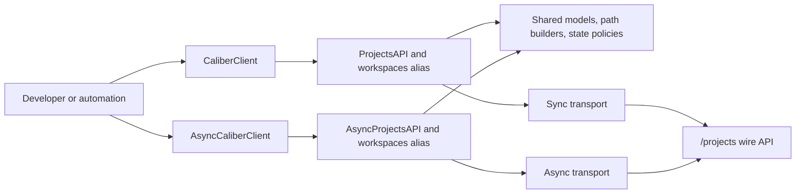

Both product terms resolve to the same object:

```python
client.projects is client.workspaces
async_client.projects is async_client.workspaces
client.workspaces.revision_imports is client.workspaces.imports
client.workspaces.workspace_releases is client.workspaces.releases
```

The longer names preserve the terminology used above; the shorter aliases make
normal code readable. Neither alias gets a separate model or transport.

```text
client.workspaces                         # same object as client.projects
├── list, get, create, update
├── archive, restore, transfer_ownership, storage
├── members                               # flat legacy methods remain delegates
│   └── list, add, update, remove
├── files
│   └── list, upload, create_folder, delete, download
├── source
│   └── get, configure, enable, disable, capabilities, reconcile
├── revision_imports / imports
│   └── list, get, create, reconcile, wait
├── revisions
│   └── list, iter_all, get, diff, snapshot
├── change_requests
│   └── list, iter_all, get, create, submit, update_head, rebase, close,
│       list_comments, comment, list_reviewers, assign_reviewer,
│       remove_reviewer, list_reviews, review, list_checks,
│       list_external_review_attestations, refresh_external_review,
│       wait_for_technical_review
├── version_tags
│   └── list, iter_all, get
├── environments
│   └── list, get, update, enable, disable, rollback
├── rework_tasks
│   └── list, get, claim, resolve, reassign
├── workspace_releases / releases
│   └── list, get, list_evidence, list_evaluations, get_evaluation,
│       request, evaluate, quality_signoff, approve, apply,
│       break_glass_apply, wait_for_evaluation
└── release_operations
    └── list, iter_all, get, reconcile, wait_for_apply, wait_for_rollback
```

The async tree has the same names and argument semantics. Its network methods
are coroutines, `iter_all()` is an async iterator, and waiters are awaitable.

Compatibility rules: keep `ProjectsAPI`, `Project`, `ProjectMember`,
`ProjectFile` and `ProjectFolder` public; add `WorkspacesAPI = ProjectsAPI` and
matching model aliases; do not warn on `client.projects`; keep existing
positional and keyword parameters working; add conveniences such as `archive()`
as delegates rather than changing `update()`; keep `CALIBER_PROJECT` as the
configuration variable; and never send two scope headers.

One security correction is intentionally behavior-changing: today's
`ProjectsAPI.update(status=...)` lets an Editor archive or restore because the
server folds status into `project.update`. Keep the SDK argument for a
deprecation window, but route `archived` and `active` through the explicit
Admin-only archive/restore endpoints and emit a warning. Name/description
updates remain compatible. Existing code keeps its signature; an Editor that
previously changed lifecycle state now receives the intended authorization
denial.

### 13.4 Scope safety

Every method whose URL contains `/projects/{project_id}` must send
`X-CALIBER-Project` equal to the path `project_id`. The SDK must not rely on the
client's ambient project for those calls — that is what prevents a client
configured for `PRJ-A` from requesting a `PRJ-B` URL with the `PRJ-A` header.

The transport gains an internal tri-state request option:

| Value | Meaning |
| --- | --- |
| `UNSET_PROJECT` | Use the active context scope, then the constructor default |
| project ID string | Send exactly that `X-CALIBER-Project` value |
| `None` | Intentionally omit the header for a platform/library call |

Workspace sub-resources always pass the explicit string; existing resource APIs
use `UNSET_PROJECT`, preserving current behavior. If a caller supplies the
header manually *and* an explicit SDK override, unequal values raise
`CaliberConfigError` before network I/O.

Ambient scope becomes `ContextVar`-backed rather than mutable transport state:

```python
with client.workspace_scope("PRJ-123"):
    client.prompts.list()  # inherits PRJ-123

with client.library_scope():
    client.prompts.list()  # deliberately omits the header
```

`project_scope()` remains a compatibility alias. Nested contexts restore the
prior value. A child async task deliberately inherits the context captured when
it is created, while later changes in that child, a sibling task, or another
thread do not leak back. Direct calls such as
`client.workspaces.revisions.get("PRJ-123", revision_id)` still use their
explicit project ID even inside a different ambient scope.

### 13.5 Models

Add frozen dataclasses in `models/workspaces.py`: `WorkspaceSource`,
`WorkspaceSourceCapabilities`,
`WorkspaceRevisionImport`, `WorkspaceRevision`, `WorkspaceRevisionResource`,
`WorkspaceRevisionDiff`, `WorkspaceChangeRequest`,
`WorkspaceChangeRequestHead`, `WorkspaceChangeRequestReviewer`,
`WorkspaceChangeRequestComment`, `WorkspaceChangeRequestCheck`,
`WorkspaceChangeRequestReview`, `WorkspaceExternalReviewAttestation`,
`WorkspaceExternalReviewCoverage`, `WorkspaceVersionClaim`,
`WorkspaceVersionTag`, `WorkspaceEnvironment`, `WorkspaceRelease`,
`WorkspaceReleaseEvidence`, `WorkspaceReleaseDecision`,
`WorkspaceReleaseEvaluation`, `WorkspaceBreakGlassAuthorization`,
`WorkspaceReleaseOperation`, `WorkspaceReleaseOperationItem`, `ReworkTask`,
`WorkspaceValidationIssue`, and a new generic `CursorPage[T]`.

Nested objects require explicit decoders — a top-level dataclass decode is not
enough when `resources`, `items`, `decisions`, or validation issues contain
nested dictionaries. All response models retain `extra: dict[str, Any]`.
Enumerated states are exported constants whose decoder **preserves unknown
server values**; decoding must not fail because a newer server introduced a
state.

Complex mutations use typed request models rather than open dictionaries:
`TransferWorkspaceOwnershipRequest`, `ConfigureWorkspaceSourceRequest`,
`CreateRevisionImportRequest`, `SnapshotWorkspaceRevisionRequest`,
`CreateWorkspaceChangeRequestRequest`, `SubmitWorkspaceChangeRequestRequest`,
`UpdateWorkspaceChangeRequestHeadRequest`, `RebaseWorkspaceChangeRequestRequest`,
`CommentOnWorkspaceChangeRequestRequest`,
`ReviewWorkspaceChangeRequestRequest`, `AssignWorkspaceChangeRequestReviewerRequest`,
`RefreshWorkspaceExternalReviewRequest`,
`UpdateWorkspaceEnvironmentRequest`, `CreateWorkspaceReleaseRequest`,
`EvaluateWorkspaceReleaseRequest`, `QualitySignoffRequest`,
`ApproveWorkspaceReleaseRequest`,
`ApplyWorkspaceReleaseRequest`, `RollbackWorkspaceReleaseRequest`,
`ReconcileWorkspaceReleaseOperationRequest`, `ResolveReworkTaskRequest`, and
`BreakGlassApplyRequest`.

`to_payload()` omits unset optional fields but preserves explicit `None` where
it has compare-and-set meaning. Public APIs must not accept broad `**options`
for governed mutations. Durable history — imports, revisions, releases,
release operations, and rework tasks — is pageable, and each new list method
returns `CursorPage[T]` with `iter_all()` traversing lazily and guarding against
a server returning an unchanged `next_cursor`. The existing offset-based
`Page` and existing list-method return types remain compatible.

### 13.6 Idempotency, preconditions, retries, and errors

Every durable lifecycle creator or externally effective mutation requires an
`idempotency_key` argument: revision import, import reconciliation and snapshot;
Change Request create/submit/head update/comment/review/close; release request
and evaluation; quality sign-off and final approval; apply,
rollback, operation reconciliation; rework resolution; and break-glass apply. The SDK sends
it as `Idempotency-Key` and **does not silently generate one** — a generated
value cannot protect a caller retrying after process failure. Empty or
whitespace-only keys are rejected before I/O.

Source and environment changes use `If-Match`; source and environment response
models therefore expose their server ETag. Apply and break-glass requests
include `expected_current_release_id` and `expected_lock_version`; an explicit
release ID of `None` means "apply only if this environment has no current
release," and omission is invalid. Rollback requires a non-null expected current
release plus a distinct exact target release. Reconcile names the existing
operation and does not create a second provider mutation. `412` is a stale ETag;
`409` is a valid request conflicting with current release or operation state.

Retry policy stays conservative: retry safe reads for configured transient
statuses; **do not automatically retry writes**, even with an idempotency key;
let the caller retry an idempotent write deliberately with the same key; honor
`Retry-After`; and surface transport uncertainty without claiming a write did
not happen.

| Condition | SDK result |
| --- | --- |
| `400` invalid request | `CaliberValidationError` with structured field errors |
| `401` | `CaliberAuthenticationError` |
| `403` | `CaliberPermissionError` |
| `404` | `CaliberNotFoundError`, without existence probing |
| `409` state/idempotency conflict | `CaliberConflictError` with `reason_code` |
| `412` stale ETag | `CaliberPreconditionError` with `reason_code` |
| `429` | `CaliberRateLimitError` with retry metadata |
| `5xx` | `CaliberServerError` |
| invalid response shape | `CaliberDecodeError` in strict decoders |
| network uncertainty | `CaliberTransportError` preserving operation context |

Every error retains status, method, URL, request ID, and safe payload, and
redacts authorization, cookies, bundle bytes, and secret-bearing metadata.
Lifecycle outcomes such as `changes_requested`, `out_of_date`, `blocked`,
`awaiting_quality_signoff`, `awaiting_approval` and
`reconcile_required` are valid server states, **not HTTP errors**.

### 13.7 Waiters

State sets live in one shared internal module used by both clients. The SDK must
never poll past a durable state that requires a human or a separate command.

| Waiter | Continue while | Return successfully when | Raise |
| --- | --- | --- | --- |
| `imports.wait` | `queued`, `running` | `succeeded` | `failed`; `reconcile_required` raises a distinct attention exception |
| `change_requests.wait_for_technical_review` | Native required checks/review or provider attestation for the current head is pending | Current head is `technically_approved`, `changes_requested`, `out_of_date`, or provider evidence is terminally `insufficient` | malformed/unknown response or provider verification attention state |
| `releases.wait_for_evaluation` | `draft`, `evaluating` | `blocked`, `awaiting_quality_signoff`, `awaiting_approval`, `approved`, `rejected` | malformed/unknown response; server attempt failures settle the release as `blocked` |
| `release_operations.wait_for_apply` | `prepared`, `applying` | `applied` | `failed` or `cancelled`; distinct attention exception for `reconcile_required` |
| `release_operations.wait_for_rollback` | `prepared`, `applying` | `applied` | `failed` or `cancelled`; distinct attention exception for `reconcile_required` |

`blocked`, `awaiting_quality_signoff`, `awaiting_approval` and `rejected` are
**returned objects**, so the caller can inspect evidence and decisions. They are
not converted into success booleans.

Every waiter accepts `timeout` on a monotonic clock, `poll_interval` with a
positive minimum, optional deterministic backoff and maximum interval, optional
cancellation, and `raise_on_attention` defaulting to `True`. Timeout exceptions
include the operation ID, last decoded object, last state, elapsed time and
request ID. **A timeout never cancels the server-side operation or reports it as
failed.**

### 13.8 Sync and async design

Sync and async share public models, path builders and serialization, state
constants and waiter policies, idempotency and precondition header builders,
scope-conflict validation, nested decoders, and error mapping. They do not
duplicate policy decisions; thin resource classes perform transport calls and
decode results.

For bundle uploads the async transport must not perform blocking reads of a
large file on the event loop. Accept bytes and seekable binary streams under a
documented size and streaming contract; if the HTTP client requires a blocking
stream read, move it to a worker thread or require an async byte stream type.
Freeze that decision in phase 0 and test it with a heartbeat task.

Parity means semantic parity, not identical awaitability. An introspection test
compares normalized public signatures, allowing only `self`, coroutine form and
iterator-protocol differences. Every model and exception type is shared.

### 13.9 Package changes

| Path | Change |
| --- | --- |
| `client.py` | Expose `workspaces`, add concurrency-safe `workspace_scope`, `project_scope` delegate, `library_scope` |
| `transport.py` | Tri-state per-request project override and header conflict validation |
| `resources/projects.py` | Preserve current API, attach sub-resources, add conveniences and aliases |
| `resources/workspaces.py` | Sync members/source/import/revision/Change Request/version/environment/rework/release/operation sub-resources |
| `models/common.py` | Add `CursorPage[T]` without changing the existing offset `Page` contract |
| `models/workspaces.py` | Response/request models and nested decoders, including Change Request/version history |
| `_workspace_contract.py` | Shared path builders, state policies, headers, serialization |
| `aio/client.py`, `aio/workspaces.py`, `aio/transport.py` | Async client, complete async tree, matching override and multipart behavior |
| `errors.py` | Precondition and reason-code support |
| `waiters.py` | Reuse polling engine, add Workspace state policies |
| `tests/test_resources_workspaces.py`, `tests/test_async_workspaces.py`, `tests/test_async_parity.py`, `tests/test_models_workspaces.py`, `tests/test_transport.py` | New coverage per section 18 |

The private contract module is intentionally narrow. It must not become a second
transport, a code generator, or a local authorization engine.

### 13.10 End-to-end developer contract

```python
from pathlib import Path

from caliber_sdk import (
    ApplyWorkspaceReleaseRequest,
    CaliberClient,
    ConfigureWorkspaceSourceRequest,
    CreateRevisionImportRequest,
    CreateWorkspaceChangeRequestRequest,
    CreateWorkspaceReleaseRequest,
    EvaluateWorkspaceReleaseRequest,
    ReviewWorkspaceChangeRequestRequest,
    SubmitWorkspaceChangeRequestRequest,
)

client = CaliberClient()  # authenticated user has operator + approver scopes
workspace = client.workspaces.create("pricing-policy")

source = client.workspaces.source.configure(
    workspace.project_id,
    ConfigureWorkspaceSourceRequest(
        provider="github",
        repository="example/pricing-policy",
        default_branch="main",
        root_path=".",
        manifest_path=".caliber/workspace.yaml",
        sync_mode="push",
    ),
    if_match="*",
)
client.workspaces.source.enable(
    workspace.project_id,
    if_match=source.etag,
)

with Path("caliber-source.tar.gz").open("rb") as bundle:
    import_job = client.workspaces.imports.create(
        workspace.project_id,
        CreateRevisionImportRequest(
            repository="example/pricing-policy",
            commit_sha="4ac0f0b8a9c4b8d0f65a8e94ad11aa3dc2a274f0",
            manifest_path=".caliber/workspace.yaml",
        ),
        bundle=bundle,
        idempotency_key="github:example/pricing-policy:4ac0f0b8a9c4",
    )

import_job = client.workspaces.imports.wait(
    workspace.project_id, import_job.import_job_id, timeout=600
)
revision = client.workspaces.revisions.get(
    workspace.project_id, import_job.revision_id
)

change = client.workspaces.change_requests.create(
    workspace.project_id,
    CreateWorkspaceChangeRequestRequest(
        base_revision_id=workspace.accepted_revision_id,
        head_revision_id=revision.revision_id,
        semantic_version="1.4.0",
        review_backend="caliber",
        reviewer_ids=["developer-reviewer@example.com"],
        title="Add pricing policy application",
    ),
    idempotency_key=f"cr:{revision.revision_id}",
)
change = client.workspaces.change_requests.submit(
    workspace.project_id,
    change.change_request_id,
    SubmitWorkspaceChangeRequestRequest(expected_lock_version=change.lock_version),
    idempotency_key=f"submit:{change.change_request_id}:g1",
)

release = client.workspaces.releases.request(
    workspace.project_id,
    CreateWorkspaceReleaseRequest(
        revision_id=revision.revision_id, environment="dev"
    ),
    idempotency_key=f"dev-release:{revision.revision_id}",
)
client.workspaces.releases.evaluate(
    workspace.project_id,
    release.workspace_release_id,
    EvaluateWorkspaceReleaseRequest(),
    idempotency_key=f"evaluate:{release.workspace_release_id}",
)
release = client.workspaces.releases.wait_for_evaluation(
    workspace.project_id, release.workspace_release_id
)
if release.status != "approved":
    raise RuntimeError(f"development release did not pass: {release.status}")

environment = client.workspaces.environments.get(workspace.project_id, "dev")
operation = client.workspaces.releases.apply(
    workspace.project_id,
    release.workspace_release_id,
    ApplyWorkspaceReleaseRequest(
        expected_current_release_id=environment.current_release_id,
        expected_lock_version=environment.lock_version,
    ),
    idempotency_key=f"apply:{release.workspace_release_id}",
)
operation = client.workspaces.release_operations.wait_for_apply(
    workspace.project_id, operation.operation_id
)
```

At this point the Developer can start another draft or package: `revision` and
the Change Request head cannot be changed underneath review. The assigned
Reviewer, QA and Admin continue with **separately authenticated clients**:

```python
# reviewer_client: assigned Developer/Admin, not the head author/importer
reviewer_client.workspaces.change_requests.review(
    workspace.project_id,
    change.change_request_id,
    ReviewWorkspaceChangeRequestRequest(
        head_id=change.current_head.head_id,
        decision="approve",
        rationale="Contract and deterministic checks reviewed",
    ),
    idempotency_key=f"review:{change.current_head.head_id}:approve",
)

# admin_client applies the exact head to qa; qa_client evaluates and signs it.
# The QA go decision atomically accepts the Change Request if its base is current.
# admin_client then applies the accepted tag to staging and, after fresh
# production evaluation plus QA and Admin decisions, to prod.
```

The examples package must include the complete executable multi-client journey,
including a request-changes/new-head generation, QA acceptance, staging,
production and rollback; this excerpt keeps the primary developer path
readable. The same lifecycle is available asynchronously. SDK objects must
never imply that one process identity can bypass separation of duties.

### 13.11 Capability behavior

The SDK exposes server-provided permissions and capability metadata **as data**.
It does not use a local role-to-permission table to decide whether to send a
request — that would drift from server policy and mishandle credential ceilings,
environment rules, and release-instance separation of duties.

| SDK behavior | Rule |
| --- | --- |
| Display or preflight | Call server capabilities and inspect returned permissions |
| Enforce | Always server-side |
| Hidden workspace | Preserve the server `404`; do not probe globally |
| Visible but disallowed | Raise `CaliberPermissionError` from `403` |
| Unknown permission or state | Do not infer; let the server decide |
| Break glass | A separate explicit method and request type, never a boolean on `apply()` |

This is also why the role changes in section 2 cost the SDK nothing: capabilities
are server-returned data, so adding the write split or renaming a role requires
no client change.

## 14. CLI

`caliberctl workspace` commands come **after** the Python SDK contract is
stable. They are thin delegates to the same typed CALIBER SDK methods rather
than a separately generated client or hand-written HTTP implementation; the
repository has no general SDK-to-CLI generator today.

Requirements: bounded import, package, Change Request create/update/review,
version-history, status, release, approve, apply, and rollback commands;
documented exit-state mapping that exposes pending, changes-requested,
out-of-date, blocked, and reconcile-required as **distinct non-success states**
rather than collapsing them into a generic failure; and no local authorization
logic.

## 15. Migration strategy

### 15.1 Principles

- Additive schema first; no destructive rename in the MVP.
- Backfill deterministically and publish an exception report before enforcing
  non-null or FK constraints.
- Preserve existing public/user library semantics during migration.
- Never assign ambiguous legacy resources to a workspace by name alone.
- Keep source mode `caliber_managed` for every existing project.
- Never infer or bind a repository from names, URLs in metadata, or current
  GitHub organization membership. Provider authority requires an explicit
  Admin transition and verified canonical repository identity.
- Seed environments without changing current live aliases.
- Feature-flag Git import and multi-environment apply independently.
- A failed migration leaves existing project and resource behavior available; it
  does not partially switch authority.

### 15.2 Sequence

1. Add project/audit columns and the Workspace idempotency ledger, then
   source/source-event/actor-link/import/revision/revision-resource, Change
   Request/head/native-review/check/external-attestation, version claim/tag,
   environment, and rework tables. Add
   release/evaluation/evidence/decision/break-glass tables and
   release-operation/item tables next; only then add the nullable rework-task
   release FK and exactly-one-source check. Create `current_release_id` and
   `pending_operation_id` as nullable environment columns first and add their
   foreign keys only after the referenced tables exist; do not rely on ORM
   declaration order for the circular relationships. Likewise add
   `accepted_revision_id` nullable before the revision table and add its FK only
   in Phase 4 after backfill validation. Add nullable lineage
   columns to existing tables in the same additive stage.
2. Backfill `slug` from project ID/name with deterministic collision suffixes;
   do not alter display names.
3. Create fixed `dev`, `qa`, `staging` and `prod` rows for each project. For new
   Workspaces, make dev active and qa/staging/prod disabled. For existing projects,
   record detected aliases as reconciliation evidence but set every detected
   live target to `baseline_required`; do not create a `current_release_id`
   until an Admin verifies the complete aggregate baseline.
4. Backfill child workspace references through authoritative parents where the
   relationship is unambiguous.
5. Inventory root resources with `project_id IS NULL`, invalid project IDs,
   duplicate names, provider-only prompts, and cross-project dependencies.
6. Classify null resources as public catalog, personal library, assignable, or
   unresolved. Produce a report; do not guess.
7. Create CALIBER-managed baseline revisions only for projects whose selected
   versions and dependencies resolve completely and reconstructably. Leave
   others without an accepted revision and report the blocker; never infer that
   a provider alias represents a complete aggregate release. A one-time,
   Admin-verified migration operation may initialize `accepted_revision_id`
   with an explicit `migration_baseline` audit event; it does not fabricate a
   Change Request, QA decision or semantic-version tag. The next normal Change
   Request uses that revision as its base.
8. Change creation paths to require a workspace for workspace-owned assets.
9. Add FKs and composite uniqueness in separate migrations after the exception
   inventory is zero for the affected table.
10. Turn on strict runtime resolution and environment releases per workspace,
    starting with a controlled pilot.
11. For a Workspace opting into `git_managed`, bind and verify the provider
    repository/root, import an exact source commit, compare its materialized
    package against the CALIBER-managed baseline, and require an Admin-recorded
    authority transition. Historical CALIBER revisions keep their original
    provenance; no old commit or PR/MR is retroactively treated as reviewed.
    The reverse transition snapshots a new CALIBER-authored baseline and
    disables provider writes before authoring resumes. Neither transition is an
    automatic bidirectional sync.

Each schema step has a fresh-install test, upgrade test from the preceding
revision, and ORM-metadata parity test on SQLite and PostgreSQL. The current
migration test exercises SQLite only, so Phase 1 must add an ephemeral
PostgreSQL CI service/job rather than claiming parity from dialect inspection.
Downgrade is
supported while the columns are additive and unused. After imported revisions or
release history exist, operational rollback means disabling new imports/releases
and returning application code to dual-read behavior; dropping those tables would
destroy provenance and is not an acceptable automated downgrade.

### 15.3 Naming and identity migration

Current global uniqueness for project, skill, dataset and judge names and tool
`(name, version)` conflicts with repo-like workspace-local namespaces:

- continue using globally unique stable IDs in URLs and references;
- add workspace-local logical names to manifests and revision pins;
- make every resolver accept `(project_id, logical_name/version)`;
- namespace new MLflow provider prompt names while retaining logical names;
- migrate unique constraints to `(project_id, name...)` only after all read,
  import, workflow compile/run, and assistant paths stop resolving by a global
  bare name;
- retain aliases for legacy provider names rather than renaming live external
  records in place.

## 16. Phased implementation plan

Most implementation tickets should target two to five developer days. The rows
below are delivery slices, not promises that each fits one PR; migration,
authorization, and provider-effect work must split further when their tests or
rollback boundaries differ. Estimation follows the verified inventory, not an
arbitrary PR count.

### Delivery dependency graph

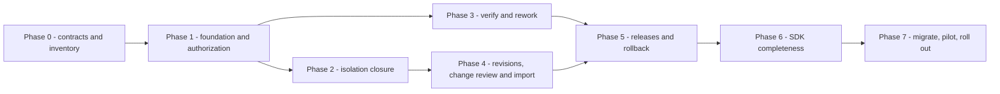

Phase 3 internals and the private SDK foundation in `P6-A` may be developed
beside Phases 1 and 2 after their Phase 0 contracts are stable, but the public
project-scoped rework routes do not merge before `P1-C` authorization exists.
`P3-B`, `P3-A`, and `P3-C` are the three exceptions: all gate on today's
existing global scopes, the same way the routes they sit beside already do,
so none waits on `P1-C` and all three may ship as soon as `P0-B` freezes its
contract. Only the project-scoped `/projects/{id}/rework-tasks` routes
(`P1-C`) and the aggregate Workspace-release quality decision (Phase 5) still
wait; see section 3.6.
The server path from Phase 1 through Phase 5 remains the critical path. "SDK-first" means contract-first and
SDK-as-primary-consumer: transport/model scaffolding and contract tests begin in
Phase 0, but public methods do not claim support before their server routes
exist.

### PR-sized development sequence

The sequence below is the estimating and implementation backlog. IDs are stable
planning handles, not GitHub issue numbers. A slice may become two PRs if its
migration and behavior cannot be reviewed safely together; it must not be
combined with a later slice merely to reduce PR count.

| Slice | Owner | Concrete deliverable | Depends on | Exit/rollback gate |
| --- | --- | --- | --- | --- |
| `P0-A` | Architecture + security | **Delivered.** Machine-readable route required-scope inventory (`routes/scope_inference.py`, `x-caliber-required-scope` on the served OpenAPI document, enforced by `tests/test_route_scope_inventory.py`) — every one of 403 operations classified by reading its own authorization call, not a hand-duplicated table — plus a background-worker inventory (`observability/worker_inventory.py`, `tests/test_worker_inventory.py`) and a per-model project-scoping inventory (`db/resource_inventory.py`, `tests/test_resource_inventory.py`, all 85 models classified with zero hand-maintenance needed); the per-plane authority matrix and every question section 19.2 posed are ratified as decisions (section 19) | — | Every route, every background worker, and every model has one inventory row and none can drift from the real code; every policy question this document posed has a named, ratified decision rather than an implicit default (gate on today's live route table / lifespan / model registry, same as `P3-B`/`P3-A`/`P3-C`'s "doesn't wait" exceptions in spirit, though these have no `P1-C` dependency to begin with) |
| `P0-B` | API + SDK | OpenAPI shapes, closed actions, errors, pagination, ETag/CAS/idempotency contracts, Change Request/version contracts, manifest schema and golden vectors | `P0-A` | Contract fixtures execute offline; no unresolved name or state appears in implementation tickets |
| `P1-A` | Data/backend | Add project slug/counter/accepted-pointer/archive/audit fields, the Workspace idempotency ledger, and fixed environment rows; deterministic backfill, safe baseline state, and PostgreSQL migration CI | `P0-B` | Fresh/upgrade parity on SQLite and real PostgreSQL; idempotency conflict/replay is durable; new Workspace seeds dev active and qa/staging/prod disabled; migrated live aliases remain `baseline_required` |
| `P1-B` | Security/backend | Closed action enum, deny-by-default decision service, all-scope conjunction support, stable reasons, and removal of ordinary platform-admin owner bypass | `P1-A` | Existing wrapper tests pass; negative matrix proves 401/403/404 and fail-closed behavior; policy errors never fall back to legacy allow |
| `P1-C` | Auth/backend | Eligible multiple-Admin membership, one primary-owner invariant, project-bound PAT/credential context, transfer, explicit archive/restore, Admin metadata inventory, and capability projection | `P1-B` | PAT cannot cross workspace; scope-ineligible role grants fail; primary owner transfer is atomic; secondary Admin does not change primary owner |
| `P2-A` | Backend | Convert root routes by resource family to centralized authorization and non-null-on-create workspace ownership | `P1-C` | Each converted family has two-workspace CRUD/child-ID tests; unconverted routes remain inventoried and flagged |
| `P2-B` | Runtime | Project/revision-aware compiler, run queue, workers, callbacks, plan executor and Aria delegation | `P2-A` | Persisted context survives restart; worker cannot widen actor authority or fall back to global registries |
| `P2-C` | Integrations/storage | Prompt/provider binding, storage and file isolation, public/personal immutable pin semantics | `P2-A` | Colliding logical names resolve correctly; guessed provider/file refs do not disclose another workspace |
| `P3-A` | Workflow/quality | **Delivered** (global slice). `caliber_rework_tasks` (global, not yet project-scoped) auto-created in the same transaction that terminally rejects a `CaliberRefinementJob`; list/get/claim/resolve/reassign routes and CALIBER SDK methods (`client.rework_tasks`); `POST /jobs/{id}/request-changes` writer for the already-existing `review_notes` consumer. Exhaustion escalation is satisfied by (1) without changing the shipped `refinement_max_iterations=0` default — see section 3.6. The QA review record this row originally deferred was delivered separately as `P3-C`. Still open: the project-scoped `/projects/{id}/rework-tasks` API, which needs `P1-C`'s Workspace authorization | `P0-B`, `P1-C` | A rejected refinement job produces an owned, claimable, resolvable task instead of a terminal row nobody sees; the resolved slice needs no `P1-C` (gates on today's existing global scopes, see section 16 delivery-dependency notes); Phase 5 adds the release FK and aggregate path |
| `P3-B` | Workflow/quality | **Delivered.** List/get/create/verify/dismiss/duplicate/batch verification-queue routes and CALIBER SDK methods against the existing `CaliberVerificationItem` model and schemas; no new table | `P0-B` | A human can verify or dismiss a pending item they did not create; none of today's four job-creation paths was required to change (and none did); ingestion (a poller creating `pending` items from real signals) remains explicitly out of scope per the Phase 0 decision |
| `P3-C` | Workflow/quality | **Delivered.** New standalone `caliber_quality_reviews` table (not a narrower slice of a later target schema, unlike `caliber_rework_tasks`); `POST`/`GET /jobs/{id}/quality-reviews` and CALIBER SDK methods (`client.quality_reviews`). `"go"` is advisory only; `"no_go"` terminally rejects the job and creates a `caliber_rework_tasks` row with `failure_kind="quality_no_go"` in the same transaction | `P0-B` | A human can record a go/no-go on a `candidate_ready` job's candidate, distinct from the machine gate; a `no_go` produces the same owned rework task a machine-gate rejection does, closing the last gap section 3.6 named; the aggregate Workspace-release quality decision (Phase 5, `caliber_workspace_release_decisions`) is a separate table at a different granularity, not an extension of this one |
| `P4-A` | Data/backend | Source/import/revision/resource schema, portable CAS revision allocator, immutable terminal rows and snapshot-retention guards | `P2-B`, `P2-C` | Concurrent snapshots allocate unique monotonic numbers with allowed gaps on SQLite/PostgreSQL; schema remains dormant behind flags |
| `P4-B` | Import/backend | Manifest/archive limits, canonical retained source snapshot and commit-equivocation guard, reconstructable adapter snapshots, model dependency, and durable import leases | `P4-A` | Golden tree/revision digests stable across archive metadata; mutable rows cannot masquerade as pins; malformed/ambiguous inputs fail closed; worker death resumes or reconciles |
| `P4-C` | API/integration | Provider-neutral source interface, source transitions, import/reconcile and revision list/get/diff/snapshot routes, cursor pages, GitHub push Action example | `P4-B` | Lost clients rediscover and reconcile jobs; source mode cannot switch with in-flight work; ordinary tests need no network; Workspace services contain no GitHub-specific policy |
| `P4-D` | Data/API/security | Change Request/head/comment/check/review/external-attestation and version claim/tag schema, selectable review backend, services, routes, stale-base CAS and approval invalidation | `P4-C`, `P1-C` | Parallel-request tests prevent lost acceptance; one request has exactly one review authority; new heads invalidate authority but preserve history; non-author review and immutable tag rules deny fail-closed |
| `P4-E` | Integration/security | Least-privilege GitHub App adapter, durable signed-webhook inbox, actor links, exact-commit PR/check/ruleset verification, reconciliation and optional status publication | `P4-D` | Replayed/lost/out-of-order events converge; squash/rebase/merge-queue commits cannot reuse stale approval; unknown actors/check sources do not count; provider outage does not block existing release/rollback history |
| `P5-A` | Data/backend | Release/evaluation/evidence/decision/break-glass plus operation/item schema and two literal state-machine services | `P3-A`, `P4-D` | Model-based tests reject every illegal decision/operation edge; durable evaluation attempts recover after worker loss; development/staging can reach approved under their predecessor policy; no provider calls yet |
| `P5-B` | Security/backend | Gate binding, QA quality decision, Admin final decision, actor provenance and interactive break-glass | `P5-A` | Both decisions are digest-bound and append-only; author/requester self-approval and non-interactive break-glass deny |
| `P5-C` | Release/integrations | Prepare/apply/observe/reconcile/rollback adapters, intent-first release operations, environment lock/pending-operation state and CAS | `P5-B` | Timeout-before/after-effect and partial-child tests never report false success; rollback leaves original release immutable; degraded environment blocks runs |
| `P5-D` | Runtime/observability | Stamp release/revision/environment/model/config lineage on runs, evidence and provider operations | `P5-C` | One query reconstructs what executed and why it was eligible; missing lineage fails strict execution |
| `P6-A` | SDK | Concurrency-safe tri-state scope, shared models/errors/contracts, sync/async resource skeleton | `P0-B` | Legacy SDK tests and signature-normalization tests pass; no unsupported public lifecycle method is exported |
| `P6-B` | SDK + API | Typed members/source/import/revision/Change Request/version/environment/rework/release/operation methods, cursor pages and waiters, delivered with corresponding route coverage | `P4-D`, `P5-D`, `P6-A` | OpenAPI inventory has no untracked Workspace route; examples drive package, review and development release without raw HTTP |
| `P6-C` | SDK/docs | Async parity, packaging, executable examples, CLI delegates and compatibility/deprecation notes | `P6-B` | Wheel inspected; sync/async semantic parity and docs contracts pass; pending states retain typed meaning |
| `P7-A` | Data/operations | Production-like inventory, exception resolution, baseline revisions, provider-event recovery, backup/restore and feature flags | `P6-C`, `P4-E` | Zero unexplained ownership/collision rows; provider reconciliation restores missed state; disabling flags stops new effects without hiding history |
| `P7-B` | Operations + product | Native/no-Git and GitHub-backed pilot journeys, failure/reconciliation/rollback drills, telemetry thresholds and go/no-go review | `P7-A` | Both source modes reach production and rollback with the same CALIBER package/release guarantees; human rollout decision recorded; PR remains reversible by flags |

Milestones are evidence boundaries: `M1 = P1-C` provides a trustworthy workspace
administration foundation; `M2 = P2-C` closes isolation; `M3 = P4-D` provides
immutable packages/import and native PR-like review; `M3b = P4-E` proves the
first external review backend; `M4 = P5-D` provides governed release; `M5 = P6-C`
provides complete SDK/CLI consumption; `M6 = P7-B` is the controlled production
readiness decision. Reaching an earlier milestone must be reported as partial,
not as complete Workspace support.

### Phase 0 — contract freeze and inventory

**Outcome:** approved contracts and a measured migration/isolation scope.

1. Approve this document's terminology, per-plane system-of-record matrix,
   source/review modes, role matrix, environment policy, and compatibility
   boundary. Every state class must have exactly one writer.
   **Delivered** (`P0-A`, section 16): sections 19.1 and 19.2 ratify the
   terminology, per-plane authority split, and every policy question this
   document posed. The "one writer per state class" bar is what the
   resource-root inventory (item 3 below) makes verifiable, rather than a
   separate approval step.
2. Build a machine-readable inventory of every route, worker, Aria capability,
   SDK method, CLI command, and resource root with its current global scope,
   project lookup, owner column, parent path, and external effect.
   **The route/scope slice is delivered** (`P0-A`, section 16):
   `routes/scope_inference.py` classifies every one of the management API's
   403 operations by reading each handler's own `require_scopes()` /
   `require_user()` / `require_project_access()` call with `ast` (never a
   hand-duplicated second copy of the truth that could disagree with the
   real enforcement code), exposed on the served OpenAPI document as
   `x-caliber-required-scope` and enforced by
   `tests/test_route_scope_inventory.py` — a route with no authorization
   call and no reviewed justification fails the test by name, the same
   defect class as the `review_queues.py::submit_item` gap PR #279 fixed.
   **The worker slice is also delivered:**
   `observability/worker_inventory.py` derives which background loops exist
   at all — 9 today — by reading `server.py::_build_lifespan`'s own
   `await <name>.start()` calls and typed parameters with `ast` (porting
   `paper/scripts/gen_stats.py::_lifespan_loops`'s already-proven technique
   for the paper's loop count into a form `caliber/tests/` can enforce),
   cross-referenced against a small hand-maintained note per worker
   (description, primary tables — a tick method's full effect set isn't
   safely AST-derivable the way a route's bounded `require_scopes(...)`
   call is, so this stays documentation, verified only for table *names*
   that actually exist on `db.models`, not for completeness) plus a
   genuinely derived `registers_heartbeat` flag (does the worker's module
   call `worker_registry.record_heartbeat` — true for exactly
   `WorkflowRunWorker` today). `tests/test_worker_inventory.py` fails by
   name if a worker is added to or removed from the lifespan without a
   matching registry update. Still open: rendering either new field into
   published documentation (deferred to `P0-B`'s "OpenAPI shapes" work for
   the route/scope side; the worker side has no existing published surface
   to extend).
3. Inventory every table's project FK, nullability, visibility and uniqueness,
   plus all bare-name resolvers.
   **The project-FK/visibility slice is delivered** (`P0-A`, section 16):
   `db/resource_inventory.py` classifies every one of the 85 `Base`
   subclasses by its `project_id`/`visibility`/owner columns — reusing
   `db/scoping.py::owner_column` directly rather than re-deriving the same
   owner-vs-`created_by` fact a second way — into a clean 4-way partition
   (40 `unscoped`, 24 `owned_catalog`, 14 `visibility`, 7 `project_only`;
   see section 16 for the exact per-category meaning). Unlike the route and
   worker slices, nothing here needed a hand-maintained note: every fact is
   safely, mechanically derivable. `tests/test_resource_inventory.py`
   asserts zero models carry `visibility` without also carrying
   `project_id` and a resolvable owner column — the exact shape of the
   historical `CaliberEvalRun` defect `owner_column`'s own docstring names
   — which holds cleanly across all 85 models today. Still open: a full
   nullability/uniqueness audit (materially bigger than the project-scoping
   classification this delivers) and the "bare-name resolvers" inventory
   (needs semantic code reading, not model introspection) — both distinct
   follow-ups, not started.
4. Define the `v1alpha1` manifest JSON Schema and canonicalization algorithm
   with golden vectors.
5. Define the resource adapter capability contract and supported MVP types.
6. Freeze the SDK-facing contracts: list pagination shape, error envelope and
   reason codes, ETag behavior, idempotency replay, apply compare-and-set
   semantics, multipart field names, maximum bundle size, and sync/async
   streaming behavior.
7. Create deterministic fixtures: two workspaces with colliding logical names,
   a primary and secondary Admin, Developer, QA, Viewer, scope-ineligible user,
   four fixed environments, a provider-only prompt, mutable judge/tool rows, a
   shared catalog resource, a partial provider effect, and legacy null rows.
8. Freeze the two typed decision contracts (QA quality sign-off, Admin final
   approval), the one actor-separation axis, the release-versus-operation state
   split, and the bounded interactive break-glass policy.
9. Freeze each MVP adapter's reconstructability strategy: immutable source
   reference, content-addressed snapshot, or explicit refusal. “Digest only” is
   not an allowed strategy for a mutable source row.
10. Freeze Change Request base/head, head-generation invalidation, Reviewer
    eligibility, selectable review backend, normalized provider attestation,
    stale-base CAS, SemVer reservation/tag and QA-acceptance contracts with
    model-based transition fixtures.
11. Freeze the `SourceControlProvider` capabilities, actor-link trust model,
    webhook/idempotency/reconciliation protocol and provider-outage behavior.

**Acceptance:** every protected operation has one inventory row; every
workspace-owned model is classified; manifest canonicalization has golden
vectors; unresolved policy decisions have named owners and block implementation
rather than becoming defaults; no planned behavior is described as implemented.

### Phase 1 — Workspace foundation and central authorization

**Outcome:** existing projects behave as administrable workspaces with explicit
environment identities and one authorization contract.

Primary areas: `db/models.py`, `db/migrations/versions/`, `schemas.py`,
`routes/projects.py`, `resource_access.py`, `auth.py`, and their tests.

1. Add project slug, source mode, archive provenance, audit correlation, and
   environment tables.
2. Make Workspace creation require operator **and** approver, then seed the
   primary Admin membership plus fixed dev/qa/staging/prod environments in the same
   transaction. New dev is active; qa/staging/prod are disabled.
3. Extend the closed environment-class registry with `qa`; retain legacy alias
   behavior only for old routes and reject unknown names in Workspace APIs.
4. Backfill existing workspaces and environment rows additively.
5. Replace free-form action strings with a closed `WorkspaceAction` registry,
   including the `resource.write.runtime` / `resource.write.evidence` split and
   `feedback.submit` from section 2.4.
6. Add conjunction-safe global-scope checks, target eligibility on role grants,
   multiple Admin collaborators, and the single primary-owner invariant.
7. Add optional PAT project binding and identity credential context; require
   project-bound PATs for CI import.
8. Implement `authorize(...)` per section 5.4 with stable reason codes.
9. Preserve `require_project_access` as a compatibility wrapper over the new
   decision service.
10. Add primary-owner transfer, additional-Admin membership, explicit
   environment enable/disable, and archive/restore transitions with audit
   records.
11. Return effective capabilities from workspace and environment responses.
12. Remove the platform-admin-to-owner shortcut from ordinary decisions and
    deny workspace writes when no active workspace is supplied.
13. Add a metadata-only platform Admin inventory and keep resource content
    behind ordinary membership or explicit audited recovery.
14. Add reusable actor-provenance and distinct-actor policy primitives; release
    enforcement lands with the release records in Phase 5.

**Acceptance:** existing `/projects`, membership, SDK and header wire shapes
remain compatible, while create and lifecycle-mutation authorization tests are
updated for the documented tightening; anonymous is `401`, insufficient visible role is `403`, hidden or
wrong workspace is an indistinguishable `404`; inactive member, expired/revoked
PAT, excessive token scope, unknown action and policy-store failure all deny;
scope-ineligible Admin/QA assignment denies; a
project-bound PAT cannot list, import into, execute or release another workspace
even when its owner is a member there; create is atomic across workspace, owner
membership and environment seeds; environment identity fields cannot be edited
or deleted; an archived workspace rejects writes, runs and releases but remains
readable/recoverable; fresh and upgrade migrations match ORM metadata on SQLite
and a real PostgreSQL service.

### Phase 2 — isolation closure

**Outcome:** workspace context is enforced on every in-scope resource and
execution path. **This is the hard prerequisite for the QA role.**

1. Apply the Phase 0 inventory; replace bare child lookup with authorized parent
   resolution.
2. Require project IDs for new project-owned root records; retain explicit
   personal/public catalog paths.
3. Add missing indexes and FKs where migration evidence permits.
4. Add a CALIBER prompt binding and workspace/provider namespace strategy.
5. Make workflow compiler and runtime resolvers project- and revision-aware for
   prompts, tools, skills, KBs, datasets, and MCP bindings.
6. Scope files, evaluations, review queues, release candidates, plans, and all
   run/event/checkpoint reads through the parent workspace.
7. Route Aria capabilities and durable plan execution through the central
   authorization contract.
8. Make SDK and CLI automation send an explicit project scope for every
   workspace operation.
9. Produce the legacy-null and duplicate-name migration report without
   enforcing destructive constraints yet.

**Acceptance:** a complete cross-workspace matrix proves list, detail, mutate,
execute, approve, release, file download, assistant and worker isolation; a
guessed child ID from another workspace returns the same result as missing; two
workspaces can use the same logical manifest names without resolving each
other's assets; workers use persisted workspace context and cannot fall back to
all active tools or prompts; public and personal resources enter a workspace run
only through an exact pinned dependency.

### Phase 3 — signal intake and the rework loop

**Outcome:** the refinement job's two half-built human decisions —
**Verify** at intake and **rework** at the far end of a rejection — both
become real, owned actions instead of a self-stamped bookkeeping field and a
terminal row that goes silent. The release-candidate subset is independently
shippable and improves today's refinement path; aggregate Workspace-release
linkage completes only after the Phase 5 release tables exist. Neither half
needs Workspace, Change Request, or environment machinery — both extend the
refinement path that already ships today.

0. **`P3-B` — delivered.** Stage ① Verify is wired to a real,
   separately-callable action: `caliber/src/caliber/routes/verification.py`
   registers `list`/`get`/`create`/`verify`/`dismiss`/`duplicate`/`batch`
   under `/caliber/verification-queue` against the existing
   `CaliberVerificationItem` model and `schemas.py` request/response types,
   gated the way section 2.4 gates `feedback.submit`
   (`caliber.operator` for writes, an authenticated read for list/get), with
   route tests, `caliber-sdk`'s `client.verification_queue`, and its own SDK
   tests. What shipped is deliberately narrower than the name suggests, and
   section 2.2 has the full account: today's four job-creation paths (prompt
   optimization, skill calibration, workflow calibration, an Aria-proposed
   promotion) are unchanged and still self-verify inline, so the new route
   only reaches a *manually*-flagged concern; there is still no ingestion
   poller (the model's own docstring promises one that was never built,
   before or after this slice); and verifying an item does not create a
   `CaliberRefinementJob` — building that means generalizing three separate,
   bespoke job-creation functions behind a shared interface, which is
   adapter-shaped work for a later phase. The frontend's `VerifyResponse`
   type, which previously claimed `job` was always present, was corrected to
   `job: RefinementJob | null` rather than left to promise something the
   server has never returned.
1. **`P3-A` (partial) — delivered.** Added the rework-task model,
   authorization, list/get/claim/resolve/reassign routes, and CALIBER SDK
   methods so a failed gate produces owned, recoverable work instead of only a
   terminal `rejected` row: `caliber/src/caliber/db/models.py`'s
   `CaliberReworkTask` (migration `0091_rework_tasks.py`) is created by
   `orchestrator/eval_stage.py` in the same transaction that sets
   `job.status = "rejected"`, with `failure_kind` distinguishing
   `iterations_exhausted` from an immediate `machine_gate` rejection and a
   `gate_evidence` snapshot of the gate's own decision. Routes live in
   `routes/rework_tasks.py` (`GET /rework-tasks`, `GET /rework-tasks/{id}`,
   `POST .../claim`, `.../resolve`, `.../reassign`), gated the same way `P3-B`
   gates verification-queue writes (`caliber.operator` for claim/resolve —
   `resolve` additionally requires the assignee or an admin — `caliber.admin`
   for reassign, matching this section's own admin-only reassign policy
   above), with `caliber-sdk`'s `client.rework_tasks` and its own SDK tests.
   Deliberately narrower than the final target schema (section 9.2): global
   scope, not yet project-scoped (no `project_id`, no Workspace-release FK);
   `failure_kind` and `status` only declare the values a route can actually
   produce today (no `quality_no_go`/`release_no_go`/`cancelled`), the same
   anti-aspirational-value discipline `P3-B`'s review applied elsewhere.
2. **`P3-C` — delivered.** A quality-review record distinct from the machine
   gate verdict; Phase 5 binds a separate decision contract to an aggregate
   Workspace release rather than extending this table (section 9.2). New
   `caliber_quality_reviews` (migration `0092_quality_reviews.py`,
   `CaliberQualityReview`), created via
   `POST /jobs/{id}/quality-reviews` (`routes/quality_reviews.py`,
   `caliber.operator`) and listed via
   `GET /jobs/{id}/quality-reviews`. `"go"` records the row only — purely
   advisory, matching the "advisory in v1" precedent
   `routes/gate_verdicts.py` already set, so `apply` is not coupled to it.
   `"no_go"` claims `candidate_ready -> rejected` with the same
   conditional-UPDATE idiom `apply`/`request-changes` use, then creates a
   `CaliberReworkTask` with `failure_kind = "quality_no_go"` in the same
   transaction — the exact pattern `eval_stage.py` uses for a machine-gate
   rejection, just triggered by a human decision. `caliber-sdk`'s
   `client.quality_reviews` and its own SDK tests round it out. Deliberately
   was not folded into `P3-A`: research confirmed no existing model
   represented a human go/no-go on a `CaliberRefinementJob`
   (`CaliberApprovalRequest` is the Apply-decision provenance anchor, always
   minted already-`approved`; `CaliberReleaseSignoff` is a separate
   release-candidate-artifact contract with no FK to refinement jobs), so it
   deserved its own design pass rather than a rushed add-on.
3. **`P3-A` — delivered.** Restored a request-changes writer for
   `review_notes`: `POST /jobs/{id}/request-changes` in `routes/jobs.py`,
   beside `apply_job` and gated the same way (`caliber.operator`), claims
   `candidate_ready -> running` with the same conditional-UPDATE idiom `apply`
   uses (409 if the precondition doesn't hold), sets `review_notes` and
   `current_stage = "candidate"`, and deliberately leaves `refine_iteration`
   untouched — a human request for changes is not a way to spend the
   automatic self-correction budget. The consumer in the candidate stage
   needed no changes; it already read and cleared this field.
4. Set `refinement_max_iterations` deliberately and define the escalation when
   it exhausts. **Escalation is now defined; the default is unchanged.**
   Item 1 means exhausting retries (or rejecting immediately at the shipped
   `0`) always produces an owned rework task, which is a concrete answer to
   "what happens when it exhausts" regardless of the configured value.
   Raising the shipped default itself would change cost/latency behavior for
   every existing refinement flow platform-wide — a separate, deliberate
   operational decision this slice does not make unilaterally.

**Acceptance:** items 0, 1, 2, 3, and the escalation half of item 4 pass
today — a human can list pending verification items and record
`verify`/`dismiss` on one they did not create; every refinement job whose
gate rejects it (whether by the machine gate, exhausted retries, or a human
`no_go` quality review) produces an owned `caliber_rework_tasks` row that can
be listed, claimed, and resolved, optionally linked to the superseding job
that fixed it; a human can record a go/no-go on a `candidate_ready` job's
candidate, distinct from the machine gate, queryable as its own record; and
an operator can send a `candidate_ready` job back for another pass with
written guidance via `request-changes`. It does not yet pass for the traffic
that matters most on item 0: none of today's four job-creation paths routes
through Verify, so most refinement jobs still self-verify. Phase 5 acceptance
extends items 1 and 2's invariant to Workspace revisions, releases, and
immutable release decisions.

### Phase 4 — immutable packages, Change Requests, and pluggable Git source

**Outcome:** a commit or selected CALIBER versions produce a deterministic,
immutable application package that can be reviewed without blocking continued
development.

1. Add source, import-job, revision and revision-resource tables plus ID
   generators and schemas.
2. Add portable compare-and-set project-counter allocation and terminal-revision
   immutability enforcement.
3. Implement the manifest parser, JSON Schema validation, path/archive limits,
   and canonical digest golden tests.
4. Implement the adapter registry with agent, workflow, prompt, skill, tool,
   test-set, KB, judge, OpenAPI, approved MCP-binding, documentation and
   secret-reference adapters. Each must reference an immutable source or create
   a content-addressed snapshot; current mutable agent/tool/judge rows cannot be
   accepted by digest alone. MCP connection credentials remain platform state;
   the revision pins only the approved connection identity and policy snapshot.
5. Add an immutable runtime-model dependency adapter and reject mutable model
   aliases for QA/staging/production eligibility.
6. Persist the deterministic content-addressed source snapshot, bind its
   canonical tree digest to the claimed repository/commit, and reject
   conflicting canonical content for an already observed commit.
7. Implement durable import claim, lease, bounded retry and explicit reconcile
   behavior.
8. Add a GitHub Action and SDK example for push import using a project-bound
   CALIBER PAT; ordinary tests use local fixtures and fake providers.
9. Implement CALIBER-managed snapshot creation from selected saved versions.
10. Add cursor-paged import/revision list, detail, diff and import-reconcile APIs
    plus audit events.
11. Enforce source-mode transition rules and Git-managed authority: local drafts
    are non-promotable beyond development until imported from a commit.
12. Add Change Request, append-only head generation, selectable review backend,
    reviewer assignment, comment, check, review, external-attestation, version
    claim and immutable version-tag models.
13. Implement create/submit/update-head/rebase/close, comment, reviewer, review,
    external-attestation and check-history APIs; bind every native or external
    review result to the exact current head.
14. Implement technical approval, default approval invalidation on a new head,
    stale-base detection and rebase contracts. Add and test the transactional
    acceptance primitive, but keep it unreachable from the public API until
    Phase 5 can supply valid QA release evidence. For Git-managed requests,
    require conflict resolution in Git; for CALIBER-managed requests, require a
    new snapshot from the current accepted baseline.
15. Reserve one canonical SemVer per submitted request and implement the
    immutable version-tag repository. Phase 5 creates
    `<version>-rc.<generation>` on QA entry and the final tag on QA-backed
    acceptance. Enforce greater-than-current accepted precedence; an out-of-date
    rebase may abandon and replace its active reservation, but never reuse an
    abandoned claim.
16. Introduce a provider-neutral `SourceControlProvider` registry and fake
    adapter. Workspace and Change Request services consume capabilities and
    normalized attestations, never GitHub response objects or role names.
17. Add the least-privilege GitHub App adapter: encrypted connection reference,
    signed/idempotent webhook inbox, canonical repository identity, commit
    reachability, exact-head/resulting-commit PR verification, CALIBER
    external-review-policy evaluation, optional provider-ruleset observation,
    trusted check-source verification,
    explicit actor links, complete base-to-head commit/path coverage,
    first-package baseline procedure, reconciliation polling and optional
    check/status publication. It does not deploy environments or store their
    secrets.

**Acceptance:** identical canonical source and pins return the same revision and
idempotent job; path traversal, archive bomb, symlink, secret literal, unknown
type or key, mutable provider alias, mutable unsnapshotted row, missing
dependency, conflicting bytes for one claimed commit, and digest mismatch all
fail closed; a ready revision contains every required exact version/snapshot and
content digest; provider ambiguity is `reconcile_required`, not success or blind retry;
revision rows reject mutation after terminal validation; provenance is visible;
and import requires no network or credentials in ordinary tests.
Two parallel Change Requests cannot overwrite the accepted baseline: exactly
one acceptance-primitive compare-and-set may win and the other becomes
`out_of_date`; a head update
preserves old checks and reviews but none remains authoritative; self-review,
unassigned review, stale-head review, moved/deleted tag, duplicate version and
version-reuse attempts deny deterministically.
Native and GitHub-backed review produce the same normalized technical outcome
for the same policy, but never both count on one request. Replayed, missing and
out-of-order provider events converge; an unlinked actor, untrusted check
source, moved head, squash/rebase/merge result mismatch, uncovered/direct
commit or path, repository transfer, policy drift or inaccessible provider
produces `insufficient`/`stale`, never an approval. GitHub unavailability pauses new imports/attestations without making
existing CALIBER packages, environment state, rollback or audit unreadable.

Adapter delivery is incremental and feature-flagged, not one mega-PR. The
controlled pilot starts with one Agent/Workflow, Prompt, Tool, Test Set, model
dependency, documentation, and secret references. Skill, KB, Judge, OpenAPI,
and MCP-binding adapters may land in parallel slices, but a manifest containing
an unsupported type is refused and Workspace support is not called complete
until the Phase 0 required-type matrix is green. An adapter flag never permits a
ready revision with a silently omitted declaration.

### Phase 5 — environment releases and rollback

**Outcome:** the same workspace revision can move through development, QA,
staging and production under explicit policy.

1. Add Workspace release, durable evaluation, evidence, typed decision,
   break-glass authorization, release-operation and operation-item models,
   schemas, services and routes.
2. Reuse existing release candidates as many-row artifact-level evidence links
   without changing their one-artifact/one-legacy-signoff semantics.
3. Implement predecessor and same-digest rules for dev → qa → staging → prod,
   requiring technical approval before QA and accepted-package state before
   staging.
4. Implement QA quality sign-off in QA and production, Admin final production
   approval, their role-specific
   author/requester-versus-decision-maker checks, and the immutable,
   expiring, single-use interactive break-glass authorization record and audit.
5. Make passing development and staging evaluations become `approved` under
   their predecessor policy; QA entry creates the immutable candidate tag, then
   quality sign-off atomically attempts Change Request acceptance, creates the
   final tag and settles the version claim; production waits for fresh QA and Admin decisions.
   Machine or human rejection is terminal and creates a rework task.
6. Add adapter-backed prepare/apply/observe/rollback for each deployable family;
   classify evidence-only items as verified no-ops.
7. Add environment operation state, pending-operation pointer, lock-version CAS,
   and target-level active locks.
8. Reuse prompt release operations, workflow promotions, KB activation and skill
   snapshots where sound.
9. Add operation/item reconciliation and exact prior-release rollback without
   mutating the original release's approval state.
10. Stamp workspace revision, environment, release and operation IDs on workflow runs and
   provider evidence.

**Acceptance:** QA cannot accept a head without successful development and the
selected backend's complete required-check/non-author technical-review
evidence; staging cannot accept a
revision that is not the exact QA-approved and accepted package; production
cannot accept a different revision or runtime-model digest from verified
staging, and its release must be freshly evaluated and approved against
production's own environment-config digest; a runtime/source
author or requester cannot provide final approval, while an eligible Admin may
both approve and apply; QA quality and Admin release decisions are separately
queryable and digest-bound; production break-glass is disabled by default, requires an
interactive global-admin credential and explicit one-release recovery policy,
cannot use a PAT/service token, cannot bypass a failed machine gate or integrity
check, expires, and emits a high-severity audit event;
stale current-release or lock-version expectation returns `409` before provider
effects; injected timeout-after-provider-success makes both the operation and
environment `reconcile_required`; new runs and promotions are blocked until
observed reconciliation settles state; partial child application never advances
the environment pointer; rollback restores the exact prior release through a new
operation, leaves the original release record immutable, and exposes every child
outcome.

### Phase 6 — SDK completeness

**Outcome:** the full lifecycle is drivable from typed sync and async Python.

1. Add tri-state per-request project scope to both transports and replace mutable
   scope with `ContextVar` behavior.
2. Add `workspace_scope`, `library_scope` and compatibility delegates; expose
   `workspaces is projects` on both clients.
3. Add model aliases, `CursorPage[T]`, lifecycle response/request models,
   strict nested decoders and separate release/operation state policies; extend
   errors with precondition, reason-code and retry metadata.
4. Add grouped members API with flat delegates, root conveniences, ownership
   transfer, and source get/configure/enable/disable/capabilities/reconcile with
   ETags; implement async root, member, storage and file parity.
5. Implement sync and async import list/get/create/reconcile, multipart plus
   digest-safe replay, import waiters, revision list/iterate/get/diff/snapshot,
   Change Request lifecycle/native review/external-attestation/history, and
   version-tag history.
6. Implement environment list/get/update/enable/disable/rollback with ETags;
   rework task methods; release list/get/evidence/evaluation-history/request/
   evaluate/signoff/approve/apply; release-operation list/get/reconcile; and the
   evaluation/apply/rollback waiters.
7. Preserve `ProjectsAPI.update(status=...)` as a deprecated delegate to the
   explicit lifecycle methods while accepting the intentional Admin-only
   authorization tightening.
8. Close every GA entry in the API coverage inventory, run signature parity
   tests, add examples and changelog, and build and inspect the wheel.

**Acceptance:** all section 13.1 completion criteria pass; the OpenAPI coverage
gate reports no untracked Workspace operation; current project-based user code
retains compatible method signatures and read/resource CRUD behavior, while
Workspace creation and project lifecycle mutation have the explicitly
documented tighter authorization; documentation examples execute
deterministically; a revision can be packaged, reviewed and promoted through
development with typed calls only; QA, staging and production
tests enforce distinct actors through real server auth; and break glass cannot
be invoked through normal apply options.

### Phase 7 — migration, controlled pilot, and rollout

1. Run the migration inventory against representative production-like data.
2. Resolve every in-scope null, orphan, collision and provider-only record.
   A waiver may classify a row as an explicit public/personal legacy object,
   but may not invent Workspace ownership or exempt an in-scope route from
   isolation.
3. Create baseline revisions, verify live target/release mappings, and clear
   `baseline_required` only with recorded evidence.
4. Enable strict workspace isolation for one controlled workspace.
5. Enable Git import, native review, the GitHub App review backend, then
   development, QA, staging and production release flags in that order.
6. Run backup/restore, lost/replayed/out-of-order webhook, provider outage,
   worker death, interrupted import, interrupted release, reconciliation and
   rollback drills.
7. Monitor authorization denials, unresolved bindings, import latency and
   failure, release duration, partial effects, reconciliation age, and
   cross-workspace probe tests.
8. Publish the compatibility/deprecation policy and operator rollback procedure.

**Acceptance:** migration reports no unexplained ownership assignment or hidden
data loss; backup/restore recovers workspace metadata, revision pins, source
provenance, release history and provider references together; native/no-Git and
GitHub-backed pilots each complete revision → Change Request → dev → qa →
staging → production → rollback, with the Git-backed path starting from one
verified commit/PR;
all required CI and migration checks pass; feature flags can stop new imports and
promotions without making existing releases or runs unreadable; and rollout
remains a human go/no-go — a green test run alone is not a production-readiness
claim.

## 17. Effort

Engineering person-days, including implementation, focused tests, review fixes,
migrations and documentation; excluding external security review and production
change windows. Confidence is approximately ±35% until Phase 0 completes the
inventory. The estimate reflects the current roughly forty registered route
modules plus workers, assistant/Aria paths, multiple mutable asset families, and
two database dialects; it is not a greenfield CRUD estimate.

| Phase | Scope | Estimate |
| --- | --- | ---: |
| 0. Contract and inventory | Per-plane authority, route/worker/resource matrix, source-provider/review contracts, manifest schema, SDK contract freeze, fixtures | 9-13 days |
| 1. Foundation and authorization | Model/audit extensions, protected environment seeds, multi-Admin/primary-owner rules, action registry, PAT context, PostgreSQL CI | 15-22 days |
| 2. Isolation closure | Root/child scoping across registered routes, prompt binding, runtime resolvers, Aria/worker/callback coverage, constraints | 25-40 days |
| 3. Verify and rework | Verification-queue routes and SDK against the existing model/schemas; durable rework task and APIs/SDK, quality-review record, request-changes writer, escalation policy | 10-16 days |
| 4. Packages, Change Requests and pluggable Git | Manifest/source digest, snapshots, import jobs/reconcile, resource and source-provider adapters, native/external review state, actor links, signed event inbox, GitHub App, version claims/tags, Action example | 44-70 days |
| 5. Environment releases | Four-environment predecessor policy, evidence/decision and operation/item state machines, approvals, CAS, adapters, reconciliation, rollback | 32-50 days |
| 6. CALIBER SDK completeness | Scope safety, cursor pages, models, rework/import/revision/Change Request/version/environment/release operations, async parity, CLI delegates, packaging | 28-42 days |
| 7. Migration, pilot, rollout | Backfill tooling, baseline reconciliation, telemetry, compatibility verification, drills and runbook | 12-20 days |
| **Total** | Full proposed Workspace MVP, API + CALIBER SDK + CLI, including one verified GitHub review adapter | **175-273 person-days** |

One experienced engineer should plan roughly 40-60 calendar weeks after review
latency and interruptions. Two engineers with clear ownership boundaries can
target roughly 23-37 weeks; the work does not divide perfectly because
authorization, isolation, schema, and release state machines are sequencing
constraints. Transport, models and path contracts should have one owner to avoid
semantic divergence. Phase 0 replaces these ranges with ticket estimates after
the inventory is measured.

A narrower first milestone ending after Phase 3 delivers a trustworthy
isolation foundation plus a working verify action and rework loop in
approximately 59-91 person-days, without Git-backed revisions or
multi-environment promotion.

If schedule requires deferral, `P4-E` is an independently feature-flagged
12-20-day increment. The rest of the Workspace remains usable with native
review and push import, but the product must label the source provenance
caller-attested and must not claim GitHub PR verification. GitLab and Bitbucket
adapters are separate post-MVP estimates after the capability contract is
proven; budget roughly 8-16 days each plus self-hosted/enterprise test-matrix
cost, not a provider-name switch.

Major dependencies: existing session/PAT authentication and scope resolution;
project memberships and visibility scoping; Alembic and migration parity tests
for SQLite and PostgreSQL; existing domain version APIs and deterministic fake
providers; MLflow prompt registry behavior and provider failure simulation;
project-aware storage paths; workflow deploy gates, environment classifier,
promotions and rollback stack; artifact-level release candidate evidence and
prompt release reconciliation; background-task lifecycle and lease patterns;
GitHub App registration/installation, webhook ingress and enterprise test
repositories for the first verified source adapter; and the SDK transport,
project header behavior and OpenAPI coverage gate. GitLab/Bitbucket credentials
or availability are not MVP dependencies because those adapters follow the
provider contract later.

### 17.1 Highest-complexity areas

| Area | Why it is hard | Mitigation |
| --- | --- | --- |
| Cross-path authorization | Routes, workers, SDK/CLI, Aria and provider callbacks can diverge | One action registry, endpoint inventory, capability projection, deny-by-default regression matrix |
| Prompt isolation | The provider registry is external and name-oriented | Local workspace binding, provider namespace, exact version pin, fake-provider tests |
| Global-to-local names | Existing global constraints and bare-name references | Stable IDs first, workspace-aware resolvers, compatibility aliases, later constraint migration |
| Aggregate release | Provider effects are not one transaction | Parent/item intents, deterministic ordering, observation, reconciliation, no false atomicity |
| Git source authority | Local authoring can create a competing source | Explicit source mode; QA/staging/prod only from an imported revision in Git-managed mode |
| Parallel Change Requests | Two accepted heads can lose or hide one another | Accepted-base CAS, explicit rebase and no generic cross-resource auto-merge |
| Legacy null/public rows | Automatic assignment risks disclosure or broken dependencies | Report and classify; no name-based guess; feature-flag strict enforcement |
| Environment configuration | The same revision behaves differently with different secrets/providers | Capture config and secret-version references and digests in release evidence |
| Sync/async SDK drift | Different safety or lifecycle behavior between clients | Shared contract module, signature and fixture parity tests |
| Migration and rollback | Constraint changes can strand old rows or provider refs | Additive migrations, dual read, backfill reports, per-workspace opt-in |

### 17.2 Architectural risks

1. **Terminology without enforcement.** Renaming Project to Workspace, or
   surfacing a QA role, without closing route and runtime isolation would create
   a stronger claim than the implementation supports. This is why Phase 2 gates
   the role work.
2. **Generic abstraction leakage.** A universal resource table or release
   interface could erase asset-specific refusal, gate, liveness and rollback
   behavior.
3. **Admin as finalizer.** Letting Admin both author and independently approve
   production defeats governance. Enforce release-instance actor separation.
4. **Branch/environment coupling.** Mapping branches to environments permits
   drift and rebuilds. Promote one revision digest instead.
5. **False source provenance.** A commit SHA supplied by CI is provenance from
   the authenticated caller, not cryptographic proof of review.
6. **Partial release misreporting.** Some provider effects succeed after a
   timeout. Parent and child states must preserve uncertainty.
7. **Workspace-local name changes.** Moving global uniqueness too early breaks
   references that still resolve by bare name.
8. **Scope explosion.** Adding roles before action and environment semantics are
   stable increases policy combinations without increasing safety.
9. **SDK authorization logic diverging.** Expose capabilities as data; enforce
   only on the server.
10. **A noisy eval gate being disabled.** See section 4.3 — separate the fast
    PR suite from the release gate.
11. **Platform-admin scope leakage.** Reusing today's admin-to-owner shortcut
    would bypass workspace isolation. Remove it from ordinary authorization and
    test recovery as a separate credential-gated path.
12. **Evidence digest cycles.** Putting evaluation outputs into the revision
    they evaluate makes immutable identity impossible. Pin quality definitions
    in revisions and bind outputs to releases.
13. **False-safe environment pointers.** A pointer that did not advance says
    nothing about partial provider effects. Persist operation state and block
    execution until reconciliation.
14. **Scope-ineligible memberships.** Workspace Admin can assign a role but
    cannot grant the global scope it requires. Validate the target on every
    assignment/transfer and make platform identity provisioning an explicit
    dependency.
15. **Digest without reconstruction.** Mutable tool/judge rows can retain the
    same identifier after edits. Require an immutable version or
    content-addressed snapshot and protect it from garbage collection.
16. **Approval/effect state conflation.** Reusing one release status for human
    decisions, apply, rollback, and reconcile destroys historical meaning. Keep
    release decisions separate from append-only external-effect operations.
17. **Legacy live alias overclaim.** A current prompt or workflow alias does not
    prove the state of the aggregate Workspace. Mark migrated live targets
    `baseline_required` until the complete mapping is verified.
18. **Push-source equivocation.** A caller can assert a real commit SHA while
    uploading different source content. Bind and retain the canonical source
    snapshot, reject a second tree digest for one source/commit, and label the
    provenance caller-attested. Do not mistake archive-container bytes for the
    canonical tree.
19. **Stale approval reuse.** A technically reviewed package can be replaced by
    another head if approvals bind only to the request ID. Bind every check,
    review, QA decision and tag to the exact head/digest and invalidate current
    authority on every head generation.
20. **Mutable-tag ambiguity.** Calling `prod` a package tag makes rollback look
    like rewriting history. Keep SemVer tags immutable and model environment
    names as audited current-release pointers.
21. **Whole-Workspace Git authority.** A repository commit cannot capture
    materialized provider versions, secret/config bindings, quality evidence or
    partial deployment effects. Keep the per-plane authority matrix enforceable
    in schemas and services, not only in prose.
22. **Duplicate review authority.** Counting both a provider approval and a
    native CALIBER approval makes revocation and separation of duty ambiguous.
    Freeze one `review_backend` when a Change Request is submitted and normalize
    only that backend's evidence. Changing backend requires closing and opening
    a new request.
23. **Provider identity and policy mismatch.** Repository roles and bots are not
    Workspace memberships. Require explicit actor links, trusted check sources,
    exact-commit evidence and CALIBER role/scope revalidation.
24. **Provider availability and edition coupling.** Webhook delivery, APIs,
    protected-environment features and approval rules vary by vendor and plan.
    Use capability discovery, a durable inbox/reconciler and native fallback;
    required unavailable guarantees fail closed.
25. **Action/Pipeline supply chain.** Untrusted PR content can modify automation
    or exfiltrate deployment credentials. Separate untrusted validation from
    privileged import/release invocation, use least privilege and short-lived
    credentials, and reauthorize the exact CALIBER target server-side.

### 17.3 Architecture evolution after MVP

The MVP's fixed roles, environments and one-reviewer rule are deliberate
policy defaults, not schema dead ends. Evolution should add capability around
the same immutable package, Change Request and release coordinates:

1. Add policy-defined review quorum, required teams/code owners and explicit
   approval carry-forward rules without changing stored Workspace role literals.
2. Add GitLab and Bitbucket Cloud/Self-Managed adapters against the proven
   `SourceControlProvider` contract. Preserve provider capability and edition
   differences as typed evidence; do not fake GitHub semantic parity.
3. Add signed package attestations, SBOM-style dependency export and an OCI
   descriptor/bundle representation over the existing package digest. Signing
   adds evidence; it never changes package identity or makes OCI the Workspace
   authorization authority.
4. Add custom environments and promotion graphs only after the four fixed
   environments prove the predecessor-policy model. Existing environment IDs
   and releases remain valid nodes in that graph.
5. Add canary, blue/green and percentage rollout as release-operation strategy
   types. They reuse one package/release and produce additional observed child
   effects; they do not create mutable candidate versions.
6. Add coordinated multi-workspace release sets only after one-workspace
   reconciliation and rollback are reliable. Cross-workspace orchestration must
   preserve each Workspace's approval and audit boundary rather than creating a
   super-admin bypass.
7. Add a read-only repository export for `caliber_managed` workspaces and a
   business-user UI over native Change Requests. Export remains a mirror; a
   deliberate mode-transition workflow is required before Git can become the
   authoring authority.

## 18. Validation strategy

### 18.1 Deterministic test layers

| Layer | Required coverage |
| --- | --- |
| Pure unit | Manifest/package canonicalization, digests, SemVer parsing, environment policy, action matrix, state transitions, adapter refusal |
| Model/migration | Fresh schema, upgrade from pre-workspace state, safe `baseline_required` backfill, indexes, FKs, uniqueness, downgrade where supported, on SQLite and real PostgreSQL |
| Route | Auth status, role/scope intersection, project mismatch, idempotency, ETag/CAS, lifecycle conflict codes |
| Idempotency ledger | Same action/key and digest replays the original result; changed input conflicts; retention prevents a completed effect from becoming repeatable |
| Cross-workspace regression | Two workspaces, colliding names, guessed root/child IDs, files, workers, Aria, release operations |
| Provider contract | Fake MLflow/storage/adapters; success, refusal, timeout-before-effect, timeout-after-effect, observed reconciliation |
| Change Request lifecycle | Base/head validity, head generation, required checks, stale approval, Reviewer assignment, request changes, stale-base/rebase CAS, acceptance, version reservation and immutable tags |
| Release state machines | Decision transitions including development/staging auto-approval and QA-candidate apply; separate operation transitions; distinct actors, partial application, immutable original release, exact rollback, concurrent promotion |
| Revision concurrency | Concurrent import/snapshot CAS number allocation with allowed gaps, digest idempotency, commit/source-digest conflict, immutable terminal rows |
| Revision reconstruction | Mutable tool/judge source changes and deletion cannot alter or remove a retained ready revision's canonical snapshot |
| Environment liveness | Operation lock, pending operation, blocked execution while ambiguous, crash recovery and lock fencing |
| Rework loop | Gate failure assigns an owner, QA rejection carries a reason, content fixes create a superseding revision/release before evaluation, escalation on exhausted iterations |
| SDK models | Complete/minimal payloads, nested decode, unknown fields and states, explicit `None`, malformed strict payloads |
| SDK serialization | Every request model, omitted versus explicit null, full commit SHA, non-empty idempotency key, secret rejection |
| SDK paths and headers | Path/header project equality, ambient override, explicit library omission, conflicting manual header, ETag, idempotency |
| SDK scope concurrency | Nested restoration, two threads, two async tasks, constructor default, library context, exception restoration |
| SDK pagination | Existing offset `Page` compatibility plus empty/short/full/multiple cursor pages, repeated-cursor guard, async early break |
| SDK waiters | Every terminal state, attention state, timeout, transient read retry, cancellation, no polling past human states |
| SDK parity | Normalized signatures, shared models and exceptions, async multipart without event-loop starvation |
| Packaging | Wheel imports without CALIBER server dependencies; exports contain no dead symbols |
| Docs/OpenAPI | Generated docs and assets, route inventory, examples, migration and runbook links |

Negative isolation tests are mandatory: a valid token and valid resource ID must
still fail when the URL project, header project, credential project, or resource
ownership differs.

### 18.2 Minimum authorization regression matrix

- anonymous → `401`
- authenticated but insufficient global scope → `403`
- visible workspace but insufficient role → `403`
- wrong or hidden workspace → indistinguishable `404`
- inactive member → deny
- disabled account or revoked/expired PAT → `401`
- PAT requesting authority beyond its owner → deny
- missing workspace on a workspace write → deny
- workspace creation with only operator or only approver scope → deny; both
  scopes allow the atomic bootstrap path
- forged workspace/environment context → deny
- guessed child or provider reference from another workspace → `404`/refusal
- QA attempting a runtime-resource write → deny
- scope-ineligible target being assigned QA or Admin → deny
- Change Request self-review, unassigned review or review of a stale head → deny
- new Change Request head attempting to reuse prior checks or approval → deny
- two Change Requests accepting the same expected baseline → exactly one wins;
  the other becomes `out_of_date`
- duplicate, moved, deleted or reused abandoned version claim/tag → deny
- acceptance with a semantic version not greater than the highest accepted
  version → deny until rebase reserves a valid successor
- Developer attempting either human release decision → deny
- QA quality-signing a runtime/source change they authored → deny
- Admin approving their own authored change → deny
- Admin approving a release they requested → deny
- Admin applying a release they validly approved for another author → allow
- Admin applying an unapproved release → deny, except the exact
  machine-passed/technically-approved QA candidate awaiting quality sign-off
- platform admin without membership using an ordinary workspace route → `404`
- platform admin using metadata inventory sees no Workspace resource payload → allow metadata only
- PAT or service credential invoking break-glass → deny
- environment in `applying`, `rolling_back`, or `reconcile_required` accepting a
  new run or promotion → deny
- unknown role, action, environment or policy version → deny
- authorization database failure → deny
- worker or Aria delegated identity exceeding the original actor → deny
- break-glass outside production, before QA acceptance/staging verification, or
  without reason or expiry → deny
- break-glass against a failed machine gate, corrupt digest, stale CAS, or
  non-idle environment → deny
- environment create/delete/rename/reorder or policy weakening → deny
- one claimed source/commit uploaded with different canonical source content →
  deny and audit

### 18.3 CI-equivalent validation

Each PR follows `.github/workflows/ci.yml` for affected areas. This work spans
backend, SDK, CLI, docs and migrations, so integration milestones should run
`./test-all.sh` or `scripts/ci-local.sh` rather than only focused tests. Every
PR also runs `git diff --check`, regenerates intentional docs/OpenAPI outputs,
checks migration parity, and inspects the diff for secrets and unrelated state.

For SDK changes specifically:

```bash
cd sdk/caliber-sdk
uv pip install --system -e ".[dev]"
ruff check .
mypy
pytest
python -m build --wheel --outdir dist
```

plus the server-side contract and coverage tests:

```bash
python -m pytest \
  caliber/tests/test_sdk_api_coverage.py \
  caliber/tests/test_sdk_against_server.py \
  caliber/tests/test_sdk_docs_contract.py \
  --no-cov
```

Ordinary tests must remain offline: fake providers, local source archives, and
deterministic Git metadata. A separately labelled live-compatible test may
exercise GitHub or MLflow, but credentials and network cannot become a required
CI dependency.

## 19. Decisions, ratified in `P0-A`

### 19.1 Decisions (ratified in `P0-A`)

Frozen as of `P0-A` (section 16) rather than still open for revision, per
Phase 0's own acceptance bar ("document review approved"). These were
already-argued conclusions, not open questions — `P0-A`'s job for this
section was to ratify them, not deliberate them.

1. Workspace is the product term; `CaliberProject`, `PRJ-*`, `/projects` and
   `X-CALIBER-Project` remain compatibility contracts for the MVP.
2. Existing domain versions remain authoritative; a workspace revision is an
   immutable aggregate pin set. A mutable domain row is eligible only through a
   retained content-addressed snapshot, not a digest that cannot reconstruct it.
3. Four roles are sufficient; environment and release-instance policy provide
   the missing security dimensions. Technical Reviewer is a per-Change-Request
   assignment to an eligible Developer/Admin, and release manager is an Admin
   function; neither is a fifth role. Several eligible collaborators may hold
   the stored `owner` role, while `CaliberProject.owner` identifies exactly one
   primary owner.
4. QA and Workspace Admin each need `caliber.operator` plus
   `caliber.approver`; `caliber.admin` is platform authority and grants no
   ordinary workspace role.
5. Author/requester versus decision-maker is the one separation axis: an
   assigned Reviewer cannot approve a head they authored/imported, QA cannot
   sign off a runtime/source change they authored, and Admin cannot approve a
   release they authored or requested. Approver and applier may be the same
   Admin.
6. Adopt option C: CALIBER is authoritative for the domain/package/release and
   runtime planes; `caliber_managed` or one configured Git provider is
   authoritative for authored source. Integration starts push-based and
   one-way, with zero or one repository/root binding per workspace. The
   authenticated caller attests the commit, and CALIBER binds that
   source/commit to one complete bundle digest to detect equivocation. Git
   branches are not environments; the same revision digest is promoted.
7. Platform services and secret values are bound or referenced, never copied
   into a workspace.
8. A Change Request is the provider-neutral package/promotion envelope over
   immutable base/head revisions. Exactly one technical-review backend is
   selected: native CALIBER, or an exact-commit provider attestation. New work
   creates a new head generation, invalidates checks/approvals and preserves
   history; acceptance compare-and-sets the Workspace's accepted baseline and
   never performs an implicit heterogeneous merge.
9. Package identity, semantic version and deployment channel are separate:
   digest and SemVer tags are immutable; `dev`, `qa`, `staging` and `prod` are
   audited mutable environment pointers.
10. Multi-provider release is explicitly non-atomic and uses parent/item
   reconciliation. Immutable release approval state is separate from
   append-only apply, reconcile, and rollback operations.
11. Existing resources default to `caliber_managed`; migration never guesses
   ownership from names.
12. The SDK exposes capabilities as data and enforces nothing locally.
13. Interfaces in scope are API, SDK and CLI. The UI is deferred to its own
    document after these contracts are frozen.
14. Workspace creation transactionally seeds the fixed protected `dev`, `qa`,
    `staging`, and `prod` environments. The MVP has no custom-environment or
    environment-delete path; QA, staging and production remain disabled until
    valid configuration exists.
15. Release is not a uniform provider capability. Every required revision item
    participates in verification and environment binding, but only prompt,
    workflow, skill, knowledge-base, and supported integration adapters may
    produce external provider effects in the MVP. Tools, test sets and judges
    are exact inputs/no-op evidence items; an agent is resolved through the
    environment's released revision rather than by mutating its global
    `enabled` flag; unsupported MCP rollback or provider operations refuse the
    release instead of being silently skipped.
16. Exceptional break-glass is an immutable, expiring, single-use
    production authorization consumed by one apply operation after QA
    acceptance and staging verification. It is not a role, release state,
    reusable approval, or way around a failed machine/integrity gate.
17. GitHub Actions or another provider pipeline may validate source and invoke
    CALIBER, but CALIBER remains authoritative for deployment intent, current
    environment state, reconciliation and rollback. Provider deployments and
    releases are mirrors or child executors, not competing pointers.
18. No bidirectional sync is permitted. `git_managed` imports one way;
    `caliber_managed` may later export a read-only repository mirror. Changing
    authority is an explicit audited source-mode transition.

### 19.2 Decisions from Phase 0

Ratified in `P0-A` (section 16): every question this section posed already
carried a recommended default, so resolving it means formally accepting
that default as decided, not deliberating a new position. One row (agent
registration scope) is ratified as policy without yet being true in the
running system — flagged explicitly rather than implied.

| Question | Decision | Why it can change implementation |
| --- | --- | --- |
| Which resource types are required in the first Git import? | **Decided:** Agent/workflow, prompt, tool, test set, immutable model dependency, docs, and secret refs for the controlled pilot; the Phase 0 matrix must explicitly stage skill, KB, judge, OpenAPI, and approved MCP-binding support | Determines adapter waves, reconstructability work, and what may truthfully be called complete |
| Is GitHub the Workspace system of record? | **Decided:** No. It may be the `git_managed` authoring/review authority; CALIBER owns inventory, packages, environments, release operations and runtime evidence | Prevents non-Git state from becoming ungoverned and keeps no-Git/provider portability |
| Which review backend applies? | **Decided:** One immutable choice per submitted Change Request: `caliber` by default or verified `source_provider`; changing it requires a new request | Prevents duplicate approvals and defines invalidation/revocation behavior |
| What provider capability is required for protected promotion? | **Decided:** Exact commit/tree, reachability, review/check/policy evidence, trusted actors/sources, signed events and reconciliation | A push upload alone cannot prove PR/MR review |
| Are one technical review, one QA quality decision and one Admin production decision enough? | **Decided:** Yes for MVP; keep required decision kinds/counts extensible | Quorum changes the decision and assignment models |
| May an Admin approve and apply another person's production release? | **Decided:** Yes; never approve their own requested or authored release | Enforces one useful actor-separation axis without a fifth role |
| Which scope permits QA sign-off? | **Decided:** `caliber.approver`, held alongside `caliber.operator`; action is `release.quality_signoff` | Operator alone cannot authorize a human decision |
| Must staging be mandatory? | **Decided:** Yes for production in the default policy | Controls the predecessor state machine |
| Can Git-managed local drafts deploy to development? | **Decided:** Yes, clearly marked uncommitted; never QA, staging or production | Preserves experimentation without dual authority |
| How are provider-only legacy prompts assigned? | **Decided:** An explicit binding workflow; never by name alone | Prevents cross-workspace disclosure |
| Are public catalog resources copied or pinned? | **Decided:** Pinned by immutable version; copied only when editing | Preserves provenance and avoids drift |
| Deny semantics | **Decided:** Grant narrowly and require every predicate; no arbitrary explicit-deny layer in MVP | Matches the closed action/intersection contract without a second policy language |
| Do evals block the Change Request? | **Decided:** Fast deterministic checks block technical approval; the heavy suite runs in QA and blocks acceptance, not authoring | Preserves fast review while keeping package acceptance quality-gated |
| Is a provider model version bump a release? | **Decided:** Yes | Highest-value missing control |
| Gate per axis or on a composite? | **Decided:** Per failure-mode axis | A composite masks single-axis regressions |
| `refinement_max_iterations` | **Decided:** Set above `0` deliberately and define escalation | At `0` there is neither automation nor escalation |
| Is agent registration a Developer or an Admin action? | **Decided, implementation pending:** Developer — authoring an agent is authoring. `register_agent`/`update_agent`/`delete_agent` remain `caliber.admin`-gated in code today; this ratifies the target policy without changing that. Widening the scope is a separate, small follow-up (the same confirm-before-touching-a-real-gate shape as PR #279's fixes), not bundled into this documentation pass | It is `caliber.admin` today (section 2.5.3); changing it moves a guard |
| Should `release.apply` exist for families with no release? | **Decided:** No — the adapter returns a typed refusal | Prevents a release plan silently skipping a required dependency |
| Which asset families are in the controlled pilot? | **Decided:** One workflow and its prompt, tool and test-set dependencies | Limits cross-provider release risk |
| Should job creation require a pending Verify decision, or stay parallel to it? | **Decided and shipped in `P3-B`: stays parallel.** Require it only once the ingestion poller exists | Blocking today's four job-creation paths on a not-yet-built poller would stall the refinement path entirely; making Verify optional first was the safe order |
| Build the verification-queue ingestion poller in `P3-B`, or defer it? | **Decided and shipped in `P3-B`: deferred.** `create`/`verify`/`dismiss` shipped first; a human opens a pending item by hand until a poller exists | The model's docstring already promised a poller that was never built; promising it again in the same PR that shipped the routes would have repeated the mistake this review found |

## 20. Definition of done

Workspace is an implemented capability only when all of the following are true:

- an existing project can be migrated without changing its stable ID or losing
  resources, files, members, runs or audit history;
- the four-role policy and global-scope intersection are enforced by routes,
  workers, SDK/CLI and Aria, with the full negative matrix in section 18.2
  passing;
- every in-scope resource and child record has an authorized workspace path;
- a failed gate or QA rejection produces owned work with a reason, and returned
  content creates a superseding revision/release before re-entering the gate;
- a configured-provider Git commit or a CALIBER-managed selection creates a deterministic ready
  revision with exact reconstructable resource pins or retained snapshots,
  a retained canonical source snapshot when imported, complete provenance, and
  digests;
- a Developer can open a Change Request over immutable base/head revisions,
  continue developing independently, append a new head after requested changes,
  and retain every stale check/review; concurrent acceptance uses CAS and cannot
  lose another accepted change;
- the selected technical-review backend supplies either assigned non-author
  native review/checks or a verified exact-commit provider attestation, and QA
  evidence is required before acceptance; candidate and accepted SemVer tags
  are immutable, while environment channels move only through recorded
  operations;
- Workspace creation atomically produces one primary Admin membership and the
  protected `dev`, `qa`, `staging`, and `prod` rows; their identities and mandatory
  policy cannot be deleted, renamed, reordered, or weakened;
- the same revision moves through development, QA, staging and production with
  environment-specific evidence, explicit model/config digests, QA quality
  sign-off, and distinct Admin final approval;
- partial or ambiguous provider effects make the environment unavailable for
  new execution/promotion until they are visible and reconciled;
- every run identifies its workspace, revision, environment and deployed
  resource versions;
- rollback uses a new operation to restore the exact prior release or reports
  precise unrecoverable items, without mutating the original release approval;
- `CaliberClient` and `AsyncCaliberClient` expose the complete typed resource
  tree including cursor-paged Change Request/check/review/version history,
  rework, release evidence and release operations; all workspace-bound calls
  enforce URL/header equality, every
  external effect requires a caller-owned idempotency key, and the OpenAPI
  parity gate reports no untyped GA operation;
- REST, SDK, CLI, OpenAPI, generated docs and migration tests agree on the
  capability;
- native/no-Git and GitHub-backed controlled pilots, a provider-event recovery
  drill, restore drill, interrupted-release drill and rollback drill complete
  successfully;
- limitations remain explicit: one tenant, one repository/root binding per
  Git-managed workspace, GitHub as the only verified provider adapter in the
  MVP, four fixed roles, fixed default environments, no bidirectional Git sync,
  asset-specific release guarantees, and no UI in this scope.

Anything less may be a useful foundation or a partial milestone, but it is not a
complete Workspace implementation.

## Sources

External practice referenced in sections 1 through 5. Internal claims cite
repository files inline.

### Lifecycle and process model

- [Evaluation-Driven Development and Operations of LLM Agents](https://arxiv.org/abs/2411.13768) — the six-phase process model and reference architecture with evaluation gates as stage checkpoints.
- [Observability in generative AI — Microsoft Foundry](https://learn.microsoft.com/en-us/azure/foundry/concepts/observability) — the GenAIOps evaluation model and post-production monitoring set.
- [AgentOps: operationalize agentic AI at scale — AWS](https://aws.amazon.com/blogs/machine-learning/agentops-operationalize-agentic-ai-at-scale-with-amazon-bedrock-agentcore/) — stage mapping, canary/alias promotion, and the closed telemetry loop.

### Artifacts, promotion, and approval

- [About pull requests — GitHub Docs](https://docs.github.com/en/pull-requests/collaborating-with-pull-requests/proposing-changes-to-your-work-with-pull-requests/about-pull-requests) — reviewable proposal, discussion and checks over independently developed changes; the collaboration precedent for Change Requests.
- [About protected branches — GitHub Docs](https://docs.github.com/en/repositories/configuring-branches-and-merges-in-your-repository/managing-protected-branches/about-protected-branches) — required reviews, status checks and stale-approval behavior that inform head-bound gates.
- [Available rules for GitHub rulesets](https://docs.github.com/en/repositories/configuring-branches-and-merges-in-your-repository/managing-rulesets/available-rules-for-rulesets) — exact-head stale-review behavior, required review/check policy and trusted GitHub App check sources.
- [Choosing permissions for a GitHub App](https://docs.github.com/en/apps/creating-github-apps/registering-a-github-app/choosing-permissions-for-a-github-app) and [GitHub App best practices](https://docs.github.com/en/apps/creating-github-apps/about-creating-github-apps/best-practices-for-creating-a-github-app) — least-privilege provider integration and the difference between installation and user-attributed actions.
- [GitHub deployment environments](https://docs.github.com/en/actions/reference/workflows-and-actions/deployments-and-environments) and [OIDC for cloud providers](https://docs.github.com/en/actions/how-tos/secure-your-work/security-harden-deployments/oidc-in-cloud-providers) — external deployment protection and short-lived credential precedent; these remain defense in depth rather than CALIBER's authority.
- [GitLab merge request approvals](https://docs.gitlab.com/user/project/merge_requests/approvals/) and [deployment approvals](https://docs.gitlab.com/ci/environments/deployment_approvals/) — evidence that review and environment capabilities/tiers differ by provider and should sit behind a capability contract.
- [Bitbucket deployment permissions](https://support.atlassian.com/bitbucket-cloud/docs/set-custom-deployment-permissions-for-your-environments/) and [deployment tracking](https://support.atlassian.com/bitbucket-cloud/docs/set-up-and-monitor-deployments/) — provider-specific permissions, environment ordering and deployment-history behavior that must not define CALIBER's portable policy.
- [Semantic Versioning 2.0.0](https://semver.org/) — canonical major/minor/patch and prerelease syntax used by immutable package tags.
- [OCI image annotations](https://github.com/opencontainers/image-spec/blob/main/annotations.md) — standard precedent for attaching version and revision metadata to content-addressed artifacts without making mutable deployment channels their identity.
- [Manage prompt lifecycles with aliases — MLflow](https://mlflow.org/docs/latest/genai/prompt-registry/manage-prompt-lifecycles-with-aliases/) — immutable versions plus mutable stage aliases; the mechanism CALIBER's prompt path builds on.
- [CI/CD and automation for serverless AI — AWS Prescriptive Guidance](https://docs.aws.amazon.com/prescriptive-guidance/latest/agentic-ai-serverless/cicd-and-automation.html) — prompts as versioned assets in source control, tagged versions for rollback, and an explicit approval stage.
- [MLflow 3 deployment jobs — Databricks](https://learn.microsoft.com/en-us/azure/databricks/mlflow/deployment-job) — one documented evaluation → approval → deployment implementation.

### Evaluation gates

- [Demystifying evals for AI agents — Anthropic](https://anthropic.com/engineering/demystifying-evals-for-ai-agents) — capability versus regression evals, isolated per-dimension judges, judge calibration, and the `pass^k` arithmetic.
- [CI/CD evaluation gates — Openlayer](https://www.openlayer.com/blog/cicd-eval-gates-block-merges-model-failure) — absolute floors versus relative baselines, and the observation/enforcement distinction.
- [Don't use the CLT in LLM evals with fewer than a few hundred datapoints](https://arxiv.org/abs/2503.01747) — why small-sample confidence intervals mislead.
- [Score production traces — Braintrust](https://www.braintrust.dev/docs/evaluate/score-online) — asynchronous online scoring and sampling rates.
- [LangSmith evaluation concepts](https://docs.langchain.com/langsmith/evaluation-concepts) — the offline/online split and the trace-to-dataset path.

### Roles and permissions

- [MLflow role-based access control](https://mlflow.org/docs/latest/self-hosting/security/role-based-access-control/) — `(resource_type, resource_pattern, permission)` grants including `prompt` and `scorer`; `max()` folding with no explicit deny.
- [MLflow workspace permissions](https://mlflow.org/docs/latest/self-hosting/workspaces/permissions/) — current workspace-scoped membership and management grants; useful precedent for separating workspace management from platform administration.
- [LangSmith RBAC](https://docs.langchain.com/langsmith/rbac), [ABAC](https://docs.langchain.com/langsmith/abac), and [operation reference](https://docs.langchain.com/langsmith/organization-workspace-operations) — workspace roles, attribute restrictions, and the concrete create permissions required by experiments and feedback workflows.
- [Braintrust access control](https://www.braintrust.dev/docs/admin/access-control) — permission groups and `restrict_object_type`.
- [Humanloop access roles](https://humanloop.com/docs/v5/reference/access-roles) — `Member` may run evaluations but not deploy. The product was sunset in 2025; cite as precedent, not as a live option.
- [Microsoft Foundry authentication and authorization](https://learn.microsoft.com/en-us/azure/foundry/concepts/authentication-authorization-foundry) — `Foundry User` builds and tests; `Foundry Project Manager` manages project deployments. The role names were renamed from their Azure AI-prefixed forms.
- [Configure registry access — Weights & Biases](https://docs.wandb.ai/guides/registry/configure_registry/) — protected aliases as a promotion gate.
- [Label Studio Enterprise user roles](https://docs.humansignal.com/guide/admin_roles) — `Reviewer` and `Annotator`, the closest shipped precedent for a quality tier.
- [NIST AI Risk Management Framework](https://www.nist.gov/itl/ai-risk-management-framework) — separation of those building from those verifying and validating. Justifies having a gate, not a specific threshold.

### Model and provider drift

- [Test before you deploy: governing updates in the LLM supply chain](https://arxiv.org/abs/2604.27789) — provider-initiated silent updates as a governance problem, and pinning as a control.
