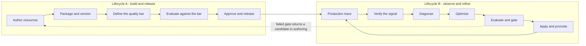
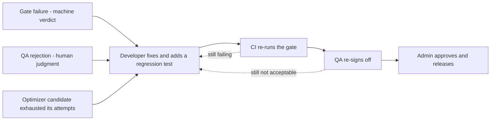
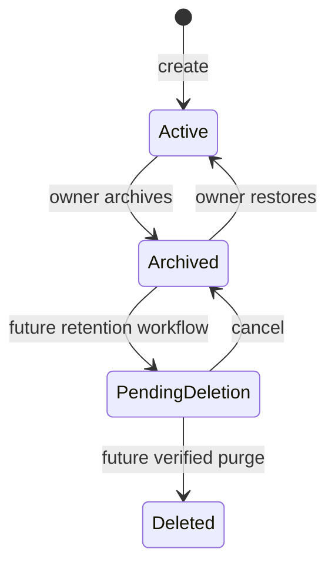
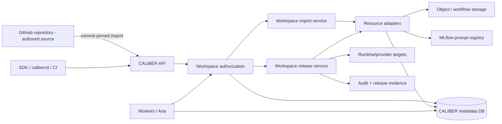
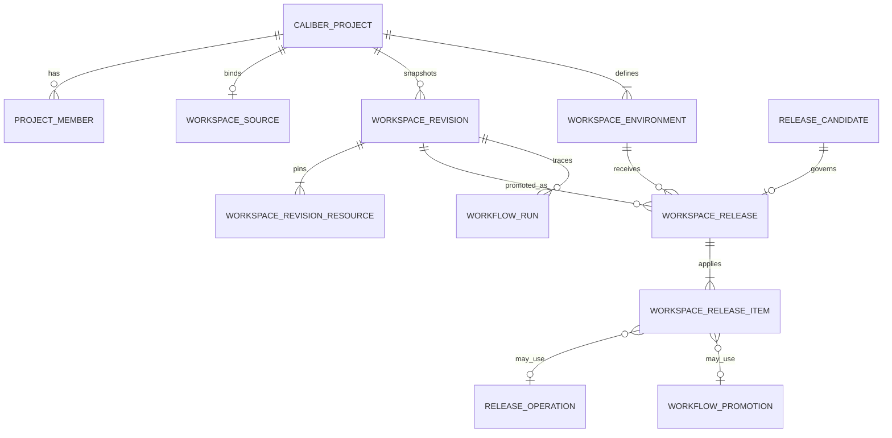
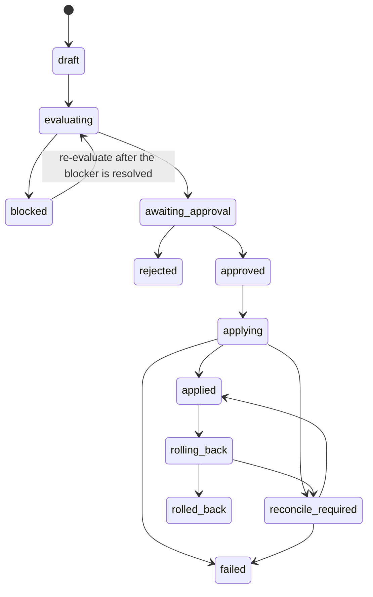
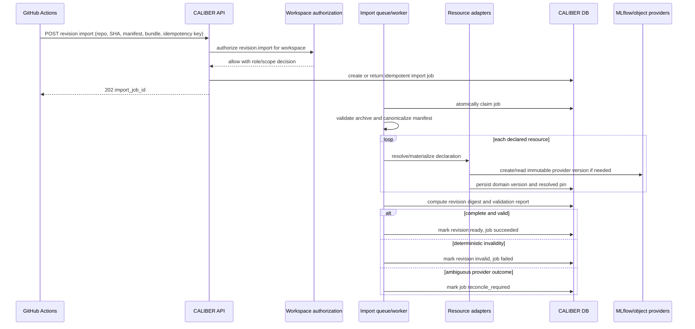
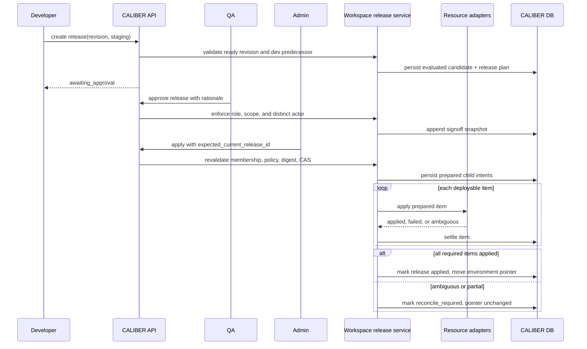
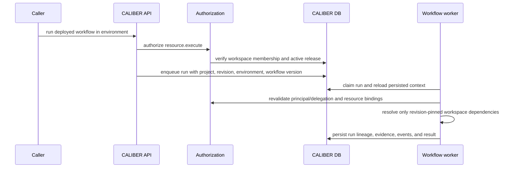
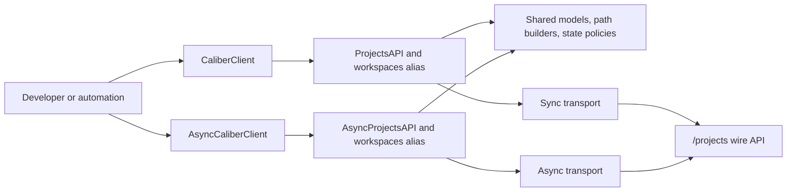

---
audience:
  - decision-maker
  - architect
  - developer
  - operator
  - evaluator
doc_type: concept
product_area: platform
stability: experimental
summary: Single source of truth for the Workspace initiative — the development and release lifecycle for agentic applications, role responsibilities, the Workspace architecture and data model, isolation and RBAC, the Python SDK contract, and the phased delivery plan. Interfaces covered are API, SDK, and CLI; the web UI is deliberately out of scope.
prerequisites:
  - Read ARCHITECTURE.md section 2 for the canonical lifecycle chain
  - Treat current-main behavior and tests as the source of truth for every "today" claim
  - Preserve the current single-tenant product boundary unless a separate decision changes it
reviewed_on: 2026-09-08
version_applicability: architecture baseline 9061aeccb758, revalidated against current main; the Workspace, revision, environment, release, and SDK models are proposed, not implemented
tags:
  - workspace
  - lifecycle
  - cicd
  - rbac
  - sdk
  - releases
  - environments
---

# Workspace platform: lifecycle, roles, architecture, and SDK

## Status and scope

This document is the single source of truth for the Workspace initiative. It
consolidates four earlier documents — the Workspace architecture proposal, the
visual user stories, the SDK development proposal, and the agentic development
lifecycle — because keeping the role model, release states, and environment
story in four places produced contradictions between them rather than clarity.

It is implementation-ready planning, **not** a statement that the capability
exists. Every claim about current behavior is marked; everything else is
proposed.

**Interface scope: API, SDK, and CLI only.** The web UI architecture is
deliberately excluded. The platform is being delivered SDK-first, and a UI plan
written before the server contract stabilizes would be planning against a moving
target. When the API and SDK contracts are frozen, the UI gets its own document.

The recommended decision remains:

> Evolve the existing `CaliberProject` and project-membership implementation
> into the Workspace control boundary; add immutable workspace revisions and
> environment-scoped releases; retain each asset family's existing version and
> release semantics; and introduce GitHub as an optional, one-way source for
> authored workspace content.

The MVP keeps the existing `PRJ-*` identifiers, `X-CALIBER-Project` header,
`/projects` routes, four project roles, and current resource tables.
"Workspace" becomes the product term without forcing a risky repository-wide
physical rename. A later major-version API can rename the wire contract after
the behavior is proven.

### How this document is organized

| Sections | Subject |
| --- | --- |
| 1–5 | **Lifecycle and roles** — the two lifecycles, the four development cycles, role responsibilities, the pipeline and its rework path, the gates, and separation of duty |
| 6–11 | **Workspace architecture** — current state, the Workspace concept, services, data model, isolation, and key interactions |
| 12–14 | **Interfaces** — API compatibility and routes, the Python SDK contract, and the CLI |
| 15–20 | **Delivery** — migration, the phased plan, effort, validation, open decisions, and the definition of done |

## 1. The two lifecycles

CALIBER can look like it has no release process, or two competing ones. It has
neither. It implements **one** lifecycle thoroughly and leaves a **second**
mostly unbuilt, and the two are easy to confuse because they share the same
evaluation and release machinery.

- **Lifecycle B, Observe and Refine** — start from a production failure,
  diagnose it, optimize the artifact, measure it, release the improvement.
  Implemented end to end: the durable job pipeline, optimizer selection, the
  regression gate, and intent-first alias release with reconciliation.
- **Lifecycle A, Build and Release** — author resources from nothing, package
  them as one versioned artifact, test the package, promote it through
  environments. **Partly** implemented. Individual families version and promote
  themselves; nothing versions the application as a whole. Closing that gap is
  what sections 6 through 11 propose.

If you have been describing "developer builds a package, QA tests it, release
manager ships it" and finding the platform does not line up, that sentence
describes Lifecycle A, while the platform's deepest guarantees are in
Lifecycle B.

They are not alternatives. Lifecycle A ships version one; Lifecycle B is how
every version after that gets better.

This split is not a CALIBER peculiarity. The published process model for
LLM-agent development — *Evaluation-Driven Development and Operations of LLM
Agents* (arXiv 2411.13768) — names six phases: agent design and development,
evaluation setup, **offline evaluation**, **online evaluation**, deployment and
monitoring, and continuous improvement. Its offline/online split is the most
standardized vocabulary in the field, and it is the same seam that separates the
two lifecycles: offline evaluation gates Lifecycle A, online evaluation feeds
Lifecycle B.



Lifecycle B is the concrete six-stage refinement path documented in
[The Refinement Loop](refinement-loop.md) and mapped to the seven-term canonical
chain in [ARCHITECTURE.md](../ARCHITECTURE.md) section 2. Its two human decision
points — **Verify** and **Apply** — are the only two the platform requires
today, and they map onto two of the four roles below.

### 1.1 The four development cycles

The two lifecycles are the shape. What a team experiences day to day is four
nested cycles with different cadences and owners. Confusing them is why "the
development cycle" can feel unanswerable.

| Cycle | Cadence | Owner | What gates it | Stages |
| --- | --- | --- | --- | --- |
| **Inner** — author and run | Minutes | Developer | Nothing. It must run, that is all | 1–2 |
| **Quality** — evaluate and fix | Hours to days | Developer + QA | Regression gate, then QA sign-off | 3–6, plus rework |
| **Release** — approve and ship | Per release | Admin | Distinct-actor approval | 7–8 |
| **Refinement** — observe and improve | Continuous, production-driven | QA verifies, platform optimizes, Admin applies | The same regression gate | 9–11, plus rework |

Three properties matter more than the stage list:

- **The inner cycle must stay ungated.** An evaluation gate on a developer's
  edit-and-run loop is the fastest way to make people stop using the platform.
  Gates belong at the quality and release cycles, never at authoring.
- **The refinement cycle reuses the quality cycle's gate** rather than having
  its own. An improvement proposed by an optimizer is held to exactly the same
  bar as one authored by a person, which is why the two lifecycles converge at
  stage 5 instead of running in parallel.
- **Only the release cycle is calendar-driven.** The other three run at whatever
  rate work arrives. Planning a release train around the inner or refinement
  cycle is planning around something you do not control.

## 2. Roles and responsibilities

### 2.1 Job functions are not permission roles

Most confusion about "who does what" comes from conflating two things:

- A **job function** is what a person does: developer, QA, release manager,
  admin, stakeholder. In a small team one person wears several hats.
- A **permission role** is what the system enforces. A role earns its existence
  only when it gates a decision that a *different human* must make.

There are five job functions and **four** permission roles, because **release
manager is a function, not a role** — it is what Admin does at stages 7 and 8.
Adding a fifth role for it is what produced the Operator-versus-Owner
contradiction between two of the documents this one replaces.

Four stored roles; three that do work; one that watches. The role literals
already exist in
[`resource_access.py`](../caliber/src/caliber/resource_access.py); the product
labels are what users should see.

| Product label | Stored role | Charter | Owns | Does not do |
| --- | --- | --- | --- | --- |
| **Developer** | `editor` | Builds the thing | Authors runtime resources — prompts, workflows, tools, skills, knowledge bases. Runs them. Requests release. **Fixes what fails and adds the regression test.** | Approve or apply a release; manage members; register an agent (admin-gated today — see section 2.5) |
| **QA** | `reviewer` | Owns the quality bar and the human quality gate | Authors test sets, scorers, judges, thresholds. Runs evaluations. Verifies production signals. Files feedback. Signs off — or rejects with a reason. | Edit runtime resources; apply a release; manage members |
| **Admin** | `owner` | Owns access and the release | Membership and roles. Workspace settings. Acts as **release manager**: approves, applies, reconciles, rolls back. | Approve a change they authored themselves |
| **Viewer** | `viewer` | Reads, changes nothing | Resources, evidence, release history, audit. | Anything else |

Environment is a scope on an action, not a role. "Reviewer in production" is a
reviewer permitted by production policy, not a `production_reviewer` role.

### 2.2 Why QA earns a role here when it does not elsewhere

Section 2.6 reports that no comparable platform ships a QA role. CALIBER is a
justified exception, for a reason that comes from its own architecture rather
than from industry precedent:

**CALIBER's implemented loop already contains a human quality gate that is not
an authoring action.** Stage ① **Verify** — "is this production failure real?" —
is what *starts* a refinement job. In the platforms surveyed there is no
equivalent; a developer decides to run an evaluation when they choose to. Here,
verification is a production-driven decision with a durable queue behind it.

That gate needs an owner, and its owner is structurally not the author. QA
exists here because the platform has quality *decisions*, not merely quality
*tooling*.

### 2.3 QA is a restriction of operator, not a sibling

This is the most important correction against the earlier documents. Everything
QA needs to do is gated today by `SCOPE_OPERATOR`:

| QA action | Current gate |
| --- | --- |
| Create a test set | `routes/eval_datasets.py` — `SCOPE_OPERATOR` |
| Create a judge or scorer | `routes/judges.py` — `SCOPE_OPERATOR` |
| Run an evaluation | `routes/evaluations.py` — `SCOPE_OPERATOR` |
| File feedback / verify a signal | `routes/review_queues.py` — `SCOPE_OPERATOR` |

Global scope inheritance is asymmetric: `caliber.admin` implies approver,
operator and viewer, while **`caliber.approver` implies only `caliber.viewer`**.
It does not imply operator. So a user holding `caliber.approver` alone — which
is what a `reviewer` role naturally maps to — **cannot perform a single QA
task**, and cannot edit, import, execute, or apply a release either.

QA therefore needs the `caliber.operator` **ceiling**, with runtime-write
subtracted at the project-role layer. Same ceiling as Developer; the difference
lives entirely in the project role.

**This makes isolation closure a hard prerequisite for shipping QA.** The
mutating prompt routes check global scope only, with no project-role
consultation. Grant QA `caliber.operator` before that changes and QA can edit
prompts — a role that looks restricted while being fully privileged.

### 2.4 The action vocabulary this implies

The current registry has seven actions — `read`, `project.update`,
`project.manage_members`, `resource.write`, `resource.publish`,
`resource.approve`, `resource.execute` — with no way to express "may author
evidence but not runtime artifacts", and no feedback verb at all.

| Action | Developer | QA | Admin | Viewer |
| --- | :---: | :---: | :---: | :---: |
| `read` | Y | Y | Y | Y |
| `resource.write.runtime` — prompts, workflows, tools, skills | Y | | Y | |
| `resource.write.evidence` — test sets, scorers, judges | Y | Y | Y | |
| `resource.execute` — run tests, evals, workflows | Y | Y | Y | |
| `feedback.submit` — verify signals, flag traces | Y | Y | Y | |
| `resource.publish` — deploy to development | Y | | Y | |
| `resource.approve` — release sign-off | | Y* | Y* | |
| `release.apply` / `rollback` / `reconcile` | | | Y | |
| `project.update` | Y | | Y | |
| `project.manage_members` | | | Y | |
| **global scope ceiling** | `caliber.operator` | `caliber.operator` | `caliber.admin` | `caliber.viewer` |

`Y*` — neither QA nor Admin may approve a change they authored or requested.
See section 5.

`resource.write` splits because the resource classes already exist in section
6.4, which separates authored runtime assets from evidence assets. The taxonomy
is there; it is simply not wired to a permission.

`feedback.submit` is new. Verification-queue writes currently ride on
`resource.write`, which is precisely why QA cannot file feedback without also
gaining prompt-edit rights.

`Y` means the workspace role permits the action *before* global-scope,
environment-policy, and release-instance checks. The effective decision is:

```text
effective decision =
    authenticated principal
  AND credential/global-scope ceiling
  AND credential workspace ceiling, when present
  AND active workspace membership/role
  AND resource belongs to or is pinned by workspace
  AND environment policy
  AND release-instance rules
```

### 2.5 Resource families: who creates, edits, and releases what

The action vocabulary above is deliberately abstract. This section resolves it
per resource family, because **"release" does not mean the same thing for every
family, and three families have no release step at all.** The per-family
guarantees below are the ones recorded in
[ARCHITECTURE.md](../ARCHITECTURE.md) section 4, not an idealization.

#### 2.5.1 What each family is, and what releasing it means

| Family | Class | How it versions | What "release" means for it | Rollback |
| --- | --- | --- | --- | --- |
| **Prompt** | runtime | Immutable MLflow registry versions behind an alias | Move the live alias to a version. Intent-first: the release intent with exact before/after versions is committed *before* the MLflow mutation | Yes — reconcilable, exact prior version |
| **Workflow** | runtime | Editable drafts → published version rows | Point a deployment alias at a published version, under deploy-gate policy with an optimistic alias check | Yes — pops the deployment's checkpoint stack |
| **Skill** | runtime | Mutable current record + immutable version snapshots | Select a snapshot as current | Yes — restores the prior snapshot **as a new current version** |
| **Knowledge base** | grounding | Immutable build versions behind `active_version_id` | Audited activation of a build | Yes — prior active build derived from history |
| **Agent** | runtime | The record everything else hangs off — items, jobs, approvals | Not released. `enabled` is the pause/resume lever workers read | n/a — toggle `enabled` |
| **Tool** | runtime | Separate `(name, version)` registry rows with lifecycle status | **No release.** Read-only family history, no live alias | **None** |
| **Test set** | evidence | Version counter plus example validity intervals | **No release.** It *is* evidence; it is carried with a release, never deployed | **None** |
| **Judge / scorer** | evidence | Operator-authored, reusable via a `Judge.<id>` token | **No release.** It *is* a scorer | n/a |
| **MCP server** | integration | Mutable managed definitions with discovered tool inventories | Connection plus policy binding, fail-closed; production workflow preflight | **No version rollback** |
| **OpenAPI integration** | integration | Contract snapshot | Validate and preflight; environment binding controls use | Re-bind a prior snapshot |

Two consequences follow, and both matter for role design:

- **A role cannot hold a uniform "release" permission**, because for tools, test
  sets and judges there is nothing to release, and for agents the lever is a
  boolean rather than a version. `release.apply` is meaningful only for prompt,
  workflow, skill, knowledge base, and integration bindings.
- **Rollback is not universal either.** Tools and test sets have none, and MCP
  servers have no version rollback. A release plan that assumes every item is
  reversible is wrong; the adapter contract in section 8.2 returns a typed
  refusal precisely so that this is explicit rather than silently skipped.

#### 2.5.2 Create, edit, release, delete — by role

Target state. `Y` = permitted by the workspace role, before global-scope,
environment-policy and release-instance checks. `—` = not permitted.

| Resource | Create | Edit | Release / activate | Delete |
| --- | --- | --- | --- | --- |
| Prompt | Dev, Admin | Dev, Admin | **Admin** | Admin |
| Workflow | Dev, Admin | Dev, Admin | **Admin** (Dev to development only) | Admin |
| Skill | Dev, Admin | Dev, Admin | **Admin** | Admin |
| Agent | Dev, Admin | Dev, Admin | n/a — `enabled` toggle: Admin | Admin |
| Tool | Dev, Admin | Dev, Admin | n/a — no release | Admin |
| Knowledge base | Dev, Admin | Dev, Admin | **Admin** | Admin |
| MCP server | Admin | Admin | **Admin** (connection plus policy binding) | Admin |
| OpenAPI integration | Dev, Admin | Dev, Admin | **Admin** | Admin |
| **Test set / eval dataset** | **QA**, Dev, Admin | **QA**, Dev, Admin | n/a — evidence | Admin |
| **Judge / scorer** | **QA**, Dev, Admin | **QA**, Dev, Admin | n/a — evidence | Admin |
| **Evaluation run** | **QA**, Dev, Admin | — (immutable result) | n/a | Admin |
| **Feedback / verification item** | **QA**, Dev, Admin | **QA** (verify, dismiss) | n/a | Admin |
| QA sign-off | **QA** | — (immutable decision) | n/a | — |
| Release request | Dev, QA, Admin | — | — | — |
| Release approval | **QA**, Admin — never own work | — (immutable decision) | — | — |
| Workspace revision | Dev, Admin (snapshot or import) | — (immutable once ready) | — | — |
| Environment policy | Admin | Admin | n/a | — |
| Members and roles | Admin | Admin | n/a | Admin |
| Secrets | platform admin | platform admin | n/a — referenced, never copied | platform admin |
| Runs, traces, audit | produced by execution | — (append-only) | n/a | — retention only |

The pattern to notice: **QA's write authority is confined to the evidence rows**
— test sets, judges, scorers, evaluation runs, feedback, and its own sign-off.
It creates nothing runtime and releases nothing. That is the whole content of
the `resource.write.evidence` versus `resource.write.runtime` split.

#### 2.5.3 What the same table looks like today

Nothing above is enforced per-role yet, because there is no per-resource role
check — only the four global scopes. The honest current state:

| Resource | Create / edit today | Release today | Reachable by a Developer (`caliber.operator`)? |
| --- | --- | --- | --- |
| Prompt | `caliber.operator` | `caliber.operator` | Yes — including release |
| Workflow | `caliber.operator` | `caliber.operator` | Yes — including release |
| Skill | `caliber.operator` | `caliber.operator` | Yes |
| Tool | `caliber.operator` | n/a | Yes |
| Knowledge base | `caliber.operator` | `caliber.operator` | Yes |
| **Agent** | **`caliber.admin`** | n/a | **No — admin-gated** |
| MCP server | mostly `caliber.admin` | `caliber.admin` | Partly |
| OpenAPI integration | mixed operator/admin | `caliber.admin` | Partly |
| Test set / eval dataset | `caliber.operator` (delete: admin) | n/a | Yes |
| Judge / scorer | `caliber.operator` (delete: admin) | n/a | Yes |
| Evaluation run | `caliber.operator` | n/a | Yes |
| Feedback / review queue | `caliber.operator` (some admin) | n/a | Yes |

Three facts in that table are the reason this document argues what it does:

1. **A Developer can release a prompt or a workflow today.** `resource.publish`
   and the apply path are not separated from authoring in practice, so the one
   boundary the industry universally enforces — author versus deployer — is not
   enforced here yet.
2. **`caliber.approver` gates none of it.** The scope appears in exactly two
   route modules, neither of which is a resource family. Every mutation above is
   `caliber.operator` or `caliber.admin`.
3. **Agent registration is admin-only.** `register_agent`, `update_agent` and
   `delete_agent` all require `caliber.admin`, so a Developer cannot create the
   record that prompts, jobs and approvals hang off. That is either a deliberate
   guard worth keeping or an accident worth fixing, and Phase 0 should decide
   which — but the target table above assumes it becomes a Developer action,
   since authoring an agent is authoring.

#### 2.5.4 Functionality by role, end to end

| Capability | Developer | QA | Admin | Viewer |
| --- | :---: | :---: | :---: | :---: |
| Browse resources, evidence, history, audit | Y | Y | Y | Y |
| Author prompts, workflows, tools, skills, KBs | Y | — | Y | — |
| Author test sets, judges, scorers, thresholds | Y | Y | Y | — |
| Run a workflow or agent | Y | Y | Y | — |
| Run an evaluation against a test set | Y | Y | Y | — |
| Verify a production signal is real | Y | Y | Y | — |
| File feedback on an output | Y | Y | Y | — |
| Deploy to development | Y | — | Y | — |
| Create a workspace revision (snapshot or import) | Y | — | Y | — |
| Request a release | Y | Y | Y | — |
| Sign off on quality | — | Y | — | — |
| Approve a release | — | Y* | Y* | — |
| Apply, reconcile, roll back a release | — | — | Y | — |
| Configure environment policy | — | — | Y | — |
| Manage members and roles | — | — | Y | — |
| Transfer ownership, archive the workspace | — | — | Y | — |
| Manage secrets, providers, storage | — | — | platform admin | — |

`Y*` — never for work the same actor authored or requested.

### 2.6 How this compares to shipped platforms

A survey of the RBAC actually shipped by LangSmith, Braintrust, Humanloop,
Weights & Biases, Databricks/MLflow, Azure AI Foundry, Vertex AI, Bedrock, Dify,
Langflow, Flowise, Langfuse and OpenAI produced one uncomfortable finding and
several supportive ones. The uncomfortable one first.

**No agentic-AI platform ships a QA role.** Not one has a role named QA, Tester,
Reviewer, Evaluator or Quality. In every one of them, evaluation is done by the
*authoring* role:

- Humanloop's `Member` — its lowest real role — could create evaluators and
  datasets and run evaluations. What was withheld was **deployment**.
- Azure AI Foundry's `Foundry User` is the build-and-test developer role;
  publishing an agent requires `Foundry Project Manager` at minimum.
- W&B lets any Member add model versions but only registry admins move a
  **protected alias**.
- Databricks gates promotion by withholding `CREATE MODEL VERSION`.

**The boundary the industry enforces is author versus deployer, not author
versus tester.** If you enforce only one boundary, that is the load-bearing one
— and CALIBER already has it, since `resource.publish` and the apply path are
separable from authoring.

Consequently: if QA were defined as "Developer who cannot deploy," it would not
be QA at all — Humanloop called that `Member` and Azure calls it `Foundry User`,
and both treat it as the *default* developer tier. Section 2.2 is the reason
this platform is different.

The QA role is therefore defensible on **governance** grounds:

- NIST AI RMF 1.0 states that AI actors performing testing, evaluation,
  verification and validation should be separated as a best practice, "with
  those building and using the models separated from those verifying and
  validating the models."
- The two shipped precedents for a genuine review tier come from *annotation*
  platforms: Label Studio Enterprise's `Reviewer` and Argilla's `annotator`.
  Both are defined by assignment-scoped visibility plus a review verb distinct
  from the authoring verb.

Adopt it knowingly. And note the counter-argument honestly: credible
practitioner guidance holds that error analysis is the single most valuable
activity and that outsourcing it is a mistake, with quality owned by one domain
expert rather than a separate function. Both camps are coherent; which applies
depends on whether the deployment is regulated.

**What the survey supports strongly:**

- **Resource-type scoped permissions are shipping and validated.** MLflow's own
  self-hosted RBAC is literally `(resource_type, resource_pattern, permission)`
  with `prompt` and `scorer` among its resource types — so "may edit scorers but
  not prompts" is directly expressible in the system CALIBER already builds on.
  Braintrust has `restrict_object_type`, LangSmith namespaces every permission
  by resource type, and Dify ships a `dataset_operator` role defined purely by
  resource-type restriction. The split in section 2.4 is a well-attested
  pattern, not an invention.
- **Approval does not belong in the role enum.** The only native
  separation-of-duty implementation in the survey is Databricks' MLflow 3
  deployment jobs, where approval is a *tagged pipeline gate*: a task named
  `Approval_*` passes only when a tag is set by a principal holding `APPLY TAG`,
  and a tag policy can block the model owner from approving their own job.
  Independent gates compose. That is a per-instance permission plus policy —
  exactly the conclusion section 5 reaches independently.
- **Do not put environment into the role.** Every platform that tried it warns
  against it; the convergent answer is tags plus attribute-based policies.
  LangSmith explicitly recommends against workspace-per-environment because
  resources cannot be shared across workspaces, "which would prevent you from
  promoting resources (like prompts) between environments." The model in section 9
  — environments *inside* a workspace — avoids that trap. Keep it that way.
- **The failure mode predicted for a QA tier has been observed elsewhere.** In
  LangSmith, `Workspace Editor` lacks `projects:create`, which silently blocks
  running experiments, and `Workspace Viewer` lacks `feedback:create`, so it
  cannot annotate. That is the same class of bug section 2.3 identifies here: a
  quality tier must be verified against the *create* permissions its workflows
  need, not just the read ones.

One decision to make explicitly, since the two most relevant systems disagree:
MLflow folds grants with `max()` and has **no explicit deny**, so narrowing
access means granting narrowly rather than excepting a resource. LangSmith lets
**deny win**. Pick one deliberately and write it down.

## 3. The pipeline

Stage by stage: who acts, what moves, what gate must pass, where a failure goes,
and whether CALIBER implements it today.

| # | Stage | Actor | Artifact / output | Gate to pass | On failure goes to | Today |
| --- | --- | --- | --- | --- | --- | --- |
| 0 | Provision | Admin | Workspace, members, roles | — | — | Implemented (projects + members) |
| 1 | Author | Developer | Prompts, workflow manifest, tools, skills | — | — | Implemented per family |
| 2 | Smoke-run | Developer | Trace of a successful run | Runs without error | Developer | Implemented |
| 3 | Define the quality bar | **QA** | Test sets, scorers, judges, thresholds | Bar is reviewable and version-pinned | — | Implemented (eval datasets, judges, scorers) |
| 4 | Package and pin | CI | One versioned, digest-pinned artifact + Git tag | Manifest validates; every pin resolves | Developer | **Proposed** — workspace revision |
| 5 | Offline evaluation | CI | Scores per dimension vs baseline | **Regression gate** — section 4 | **Developer**, with gate reasons | Implemented (`eval/gate.py`) |
| 6 | Quality sign-off | **QA** | Verdict, or rejection with a written reason | QA accepts the evidence | **Developer**, with QA's reason | Partly — evidence exists, no sign-off record |
| 7 | Release approval | **Admin** | Approval bound to one version + target | Distinct actor from author | Developer or QA, per reason | Partly — see section 5 |
| 8 | Apply and promote | **Admin** | Live alias moves; before/after recorded | Effect settles or is `reconcile_required` | Admin — reconcile or roll back | Implemented (intent-first release) |
| 9 | Online evaluation | Platform + QA | Sampled scores, assessments, incidents | Alert thresholds | QA triages | Implemented (traces, assessments, SLO) |
| 10 | Feed back | **QA** | Verified failure becomes an eval example | — | — | Implemented (harvested examples) |
| 11 | Refine | Platform | New candidate via optimizer | Same gate as stage 5 | **Developer**, after N bounded attempts | Implemented (refinement loop, GEPA) |

Stages 9 through 11 are Lifecycle B — the part CALIBER does best. They close the
loop back to stage 5 rather than restarting at stage 1.

Read the "on failure" column as the load-bearing part of the process. A pipeline
is defined by what it does when something fails, and every quality failure
converges on the same owner: **the Developer fixes it, adds a regression test,
and re-enters at stage 5.**

### 3.1 The one artifact that does not exist yet

Stage 4 is the gap. `workspace.yaml` appears in **zero** source files — it is
proposal-only. What can be versioned today:

| Family | Versioned unit | Promotion mechanism |
| --- | --- | --- |
| Prompt | MLflow prompt version | Mutable alias (`prod`) at an immutable version |
| Workflow | `CaliberWorkflowVersion` (draft or immutable manifest) | `CaliberWorkflowDeployment` alias + promotion |
| Skill | Immutable skill version | Selected active version |
| Tool | `(name, version)` registry row | No live alias; read-only history |
| Knowledge base | KB build | Activated build |

Each family versions and promotes itself. **Nothing versions the application.**
You cannot today answer "which exact prompt, workflow, tool and test-set
versions constitute release 12" with one identifier — the question a release
manager needs answered, and the reason the workspace revision digest exists.

### 3.2 The rework cycle

Nothing ships because it passed once. It ships because it passed *after*
whatever failed was fixed:



The "adds a regression test" step is the one teams skip and the one that
compounds. CALIBER supports it directly: a verified failure becomes an
eval-dataset example through the harvest path, so the fix and its test land
together and the same failure cannot ship twice.

**One handoff worth naming.** In the automated stages the *platform's optimizer*
authored the candidate, not a person. So "the Developer fixes it" is really a
**transfer of authorship**: the optimizer's candidate is a proposal, and when it
fails, ownership reverts to a human author who may discard it entirely rather
than patch it.

### 3.3 Two kinds of rejection, one destination

| | Gate failure | QA rejection |
| --- | --- | --- |
| Decided by | Machine, threshold-based (0.85 / 0.02) | Human judgment |
| Means | The numbers do not clear the bar | The numbers cleared, but this is still wrong |
| Carries | Gate reasons and per-dimension deltas | A written reason |
| Today | `rejected`, terminal, unassigned | Cannot be expressed at all |

QA rejection is the more valuable of the two, because a change that passes the
gate and is still wrong is precisely what a quality function is for. It is also
the one that does not exist in any form today.

### 3.4 What the rework cycle needs, and does not have

This is the largest process gap in the platform — larger than the missing
package artifact, because it affects every failure rather than every release.

`refinement_max_iterations` **defaults to `0`, meaning off**: "a failed gate
rejects immediately." The eval stage then sets `job.status = "rejected"` and
stops. Concretely, today:

- nobody is assigned the failure;
- there is no task, notification or queue entry for a Developer;
- **no request-changes endpoint exists**, so QA cannot return work with
  guidance.

A failed gate produces a `rejected` row and silence.

**One mechanism is already half-built.** `CaliberRefinementJob.review_notes`
exists, and its docstring reads: *"Reviewer change-request notes. Set by the
request-changes endpoint when an approver wants a new candidate with specific
guidance. Read by the candidate stage on the retry pass, then cleared."* The
candidate stage **still reads it**. The endpoint that wrote it was removed with
the approval-governance subsystem. The pipeline can already consume human rework
guidance; it lost the door people walked through.

Four things to build, in value order:

1. **A rework assignment.** A failed gate or QA rejection must produce an owned,
   visible task rather than a terminal `rejected` row.
2. **A QA sign-off record**, distinct from the machine gate. Today the gate's
   verdict is the only quality decision the system stores.
3. **A request-changes writer** for `review_notes` — nearly free, since the
   consumer already exists.
4. **Set `refinement_max_iterations` above `0`** deliberately and define what
   happens when it exhausts. Shipping at `0` gives you zero automation *and*
   zero escalation.

Items 1 and 2 are the substantive ones.

## 4. The gates

### 4.1 The implemented regression gate

[`eval/gate.py`](../caliber/src/caliber/eval/gate.py) is a pure function with
two thresholds, and it is well designed against current practice:

- `min_aggregate_score`, default **0.85** — an absolute floor the candidate's
  `overall` must clear.
- `max_regression_delta`, default **0.02** — no single dimension may regress by
  more than this against the baseline. Cold-start runs with no baseline skip
  this check.

On failure the job is marked `rejected`; on success an approval is created. That
is enforcement, not observation, and combining an absolute floor with a relative
regression bound is exactly what current guidance recommends. Most teams ship
only the floor.

### 4.2 Two things the gate does not cover

**Per-axis gating.** Recommended practice is to gate per *failure mode* —
hallucination, citation error, retrieval miss, refusal — rather than on a
composite, so a regression in one axis cannot be masked by improvement in
another. CALIBER's scorer set makes this expressible; the gate contract does not
require it.

**A provider model change is not a release.** The same prompts and tools against
a silently updated model is a behavior change with no diff and no error.
Industry guidance is to pin dated model snapshots and treat a model bump as a
release that traverses the full pipeline. CALIBER pins a default model in
config, but a model change does not currently enter the gate. **This is the
highest-value control missing**, and it is cheap relative to its risk.

### 4.3 Separate the cadence from the gate

The most common way eval gates fail is social, not technical: a noisy gate on
every pull request produces randomly red builds, trust erodes, and someone
disables it. Non-deterministic scores can move several points with no change at
all.

- **Fast, deterministic-heavy suite** blocks the pull request: assertions,
  schema checks, contract tests, a small anchored eval subset.
- **Heavy suite, averaged over three or more runs**, gates the *release* on
  merge and nightly — not the merge itself.

Quarantine unstable cases rather than retrying them; retries hide the signal.
With 75% per-trial success over three trials, the probability of passing all
three is about 42% — multi-step agent gates are brittle for arithmetic reasons,
not because the suite is bad.

One statistical caution: the central limit theorem is not a safe basis for
confidence intervals on eval sets with fewer than a few hundred datapoints, and
bootstrap intervals perform poorly there too, because eval items and outputs are
correlated.

### 4.4 Online evaluation

Online evaluation has no reference outputs, so it looks different from the gate:

- Run **deterministic and code-based checks on 100%** of production traces.
- **Sample** LLM-as-judge scoring — commonly 5–20% of traces, lower for very
  high volume, higher for high-value segments. Scoring runs asynchronously after
  the trace is logged, so it adds no request latency.
- Trigger the expensive judge only when a cheap deterministic check already
  shows a quality drop.
- **Cluster failures before writing test cases.** One case per bucket scales;
  case-by-case triage does not.

Judges deserve the same scepticism as any other instrument. Grade each dimension
with its own isolated judge rather than one judge scoring everything, and
calibrate judges against human labels — an uncalibrated judge silently sets the
quality bar wherever it happens to sit.

## 5. Human decisions and separation of duty

CALIBER requires exactly two human decisions today: **Verify** (is this failure
real?) and **Apply** (should this ship?). Verify is QA's; Apply is the release
manager's.

Current practice across cloud vendors converges on one required sign-off at the
**promotion-to-production boundary**, after automated evals have passed, shown
the evidence for that specific version, with self-approval disabled and
independence from the author.

### 5.1 The live separation-of-duty hole

Two facts in the current implementation combine badly:

1. In `resource_access.py`, `owner` holds **both** `resource.write` and
   `resource.approve`, and there is no distinct-actor check anywhere in that
   module.
2. `project_role()` returns `ROLE_OWNER` for anyone holding `caliber.admin`
   **before** it checks membership — so every platform admin is automatically
   release manager for every workspace.

An Admin can therefore author a change and approve their own change, and a
platform operator cannot maintain the service without holding release authority
in every project. On the prompt refinement path the same is true by
construction: `POST /jobs/{id}/apply` requires `caliber.operator` and records
that same actor as `approved_by`.

Closing it needs three things, none of which is a new role:

- a **distinct-actor constraint** on approval — the only real governance control
  here;
- **at least two people who can approve**, which is also the right answer to the
  bus-factor problem with a single owner field;
- **break-glass** for genuinely single-admin deployments: self-approval with a
  mandatory reason, an expiry, one-release scope, global admin scope, and a
  high-severity audit event. Disabled by default, applies to one release only,
  and cannot be embedded in an automation token.

Break-glass is not a normal role and does not turn an owner into their own
independent reviewer.

### 5.2 One axis is enough

Two separation-of-duty axes are possible; MVP needs one:

- **author ≠ approver** — catches bad changes. Required.
- **approver ≠ applier** — catches malicious deployment. A much rarer threat,
  deliberately not enforced here.

Making Admin both approver and applier is a sound trade because the *author*
stays distinct. Record it as a decision so a reviewer does not read it as an
oversight.

### 5.3 Default environment policy

| Environment | Prerequisite | Approval | Apply actor |
| --- | --- | --- | --- |
| Development | Ready revision | None; Developer or Admin may deploy | Developer or Admin |
| Staging | Same revision successfully applied in development | One QA or Admin distinct from the revision requester | Admin |
| Production | Same revision applied and verified in staging; all production gates pass | One approver distinct from source author, requester, and apply actor | Admin after approval |

For a single-user local deployment, development remains usable without a second
actor. Production without a second actor requires the named break-glass action.

### 5.4 Central authorization contract

One server-side entry point:

```python
authorize(
    principal: CaliberIdentity,
    action: WorkspaceAction,
    workspace_id: str,
    *,
    resource: ResourceContext | None = None,
    environment: EnvironmentContext | None = None,
    release: ReleaseContext | None = None,
) -> AccessDecision
```

`AccessDecision` includes `allowed`, a stable reason code, role, effective
permissions, and policy version. Sensitive not-found cases return an
indistinguishable `404`; visible resources with insufficient authority return
`403`. Every write path authorizes before mutation and revalidates under the
transaction immediately before a release state change.

A role cannot widen the token's scope, and a PAT cannot widen its owner's live
scope. Unknown permissions deny. Client-side capability flags are projections of
the server decision and are never the enforcement boundary.

## 6. Current architecture: what exists and what it proves

### 6.1 The user problem

CALIBER exposes workflows, prompts, tools, skills, knowledge bases, test sets,
judges, integrations, files, runs, approvals, releases, and operational
evidence. Those objects have several different versioning and storage idioms. A
user can select a project called a workspace, but there is no single immutable
answer to:

- Which exact resource versions comprise this project?
- Which Git commit produced those versions?
- What is deployed in development, staging, or production?
- Who may edit, review, promote, roll back, or administer this project?
- Can a run be traced back to the complete project state rather than only its
  workflow version?
- Can another project see or execute this project's resources through a route,
  worker, assistant capability, provider lookup, or guessed identifier?

The relational database, MLflow, object storage, GitHub, and runtime providers
legitimately own different physical state, but the user should not need to
reconstruct the project by navigating each store or guessing which one is
authoritative.

### 6.2 Current limitations this addresses

1. `CaliberProject` is documented as a workspace that groups files "and future
   resources"; it is not a versioned aggregate.
2. `CaliberProjectMember` and `resource_access.py` provide four roles and a
   seven-action registry, but routes also use global scopes independently. The
   effective policy is therefore path-specific.
3. The active-project header is optional, and clients also offer an
   all-workspaces mode. That is appropriate for legacy personal/public
   libraries but insufficient for a strict workspace boundary.
4. Many root resources carry nullable `project_id` and `visibility`; most do not
   have a database foreign key to `caliber_projects`. Several names remain
   globally unique despite project scoping.
5. MLflow prompt discovery enumerates provider records independently of a
   first-class CALIBER prompt-to-project binding. A project-scoped agent does
   not by itself make every MLflow prompt project-scoped.
6. MCP server definitions and the encrypted secret store are platform-level.
   They need explicit workspace/environment bindings rather than an assumption
   that every platform record becomes workspace-owned.
7. Asset history is intentionally heterogeneous. Prompts, workflows, knowledge
   bases, skills, tools, test sets, judges, and MCP servers do not share one
   release or rollback contract.
8. Environment classification exists and an unrecognized alias falls back to
   the configured default class, which ships as production — but that fallback
   is configurable rather than an invariant, and the explicit non-deployment
   aliases classify as development. The supported product also remains
   single-environment: prompt discovery uses only `prod`, and workflow
   deployment stores a derived environment class rather than a first-class
   workspace environment.
9. Release candidates, signoffs, prompt release operations, workflow
   promotions, and rollback checkpoints exist, but there is no parent release
   that binds a complete workspace revision to an environment.
10. There is no current GitHub repository binding, commit-pinned workspace
    manifest, workspace revision model, or durable GitHub import job.
11. Personal access tokens can narrow global scopes but cannot currently bind
    the credential to one project. A CI token used for workspace import would
    otherwise retain its owner's access to every workspace where that owner is
    a member.

These identify where the existing project scope should become a real aggregate
and where current path-specific safeguards must be closed over the whole request
and execution surface.

### 6.3 Reusable foundation

| Existing component | Current behavior | Reuse decision | Gap to close |
| --- | --- | --- | --- |
| [`CaliberProject`](../caliber/src/caliber/db/models.py) | `PRJ-*` identity, `tenant_id`, owner, active/archived status, storage backend | Treat as the Workspace root; preserve table and ID | Add stable slug/source mode and stronger lifecycle rules |
| [`CaliberProjectMember`](../caliber/src/caliber/db/models.py) | One active/inactive user membership with owner/editor/reviewer/viewer role | Reuse unchanged initially | Add action-level policy and release-instance separation of duties |
| [`routes/projects.py`](../caliber/src/caliber/routes/projects.py) | Project CRUD, members, folders, uploads, downloads | Extend with nested source/revision/environment routes, or register focused route modules beside it | Current project scope is primarily metadata/files |
| [`resource_access.py`](../caliber/src/caliber/resource_access.py) | Central project role lookup and seven project actions | Evolve into the single workspace authorization entry point | Global scopes, environment policy, workers, CLI, and Aria are not yet one policy decision |
| [`db/scoping.py`](../caliber/src/caliber/db/scoping.py) | Visibility-aware filtering over a three-value tier (`project`, `user`, `public`) | Reuse for discovery and legacy library behavior | Strong workspace actions must require a concrete workspace and deny by default |
| [`auth.py`](../caliber/src/caliber/auth.py) | Validated identity, hierarchical global scopes, PAT scope ceilings, active project header | Reuse authentication and scope ceilings | Do not treat a client-provided workspace header as authorization; add credential workspace, environment, and resource context |
| [`ProjectsAPI`](../sdk/caliber-sdk/src/caliber_sdk/resources/projects.py) | Typed project, member, and file operations | Extend without breaking existing methods | Add source, revision, environment, and release models/resources |
| Domain resource models | Project IDs on agents, datasets, judges, review queues, plans, eval runs, skills, workflows, tools, OpenAPI integrations, KBs, files, and several run tables | Keep domain models authoritative | Coverage is nullable, uneven, and not always FK-enforced |
| Domain version models | MLflow prompt versions; workflow versions; KB builds; skill snapshots; tool version rows; dataset intervals | Keep each domain contract | Add a cross-resource immutable pin set, not a replacement version backend |
| [`deployment_environments.py`](../caliber/src/caliber/deployment_environments.py) | Classifies aliases as development/staging/production; an unrecognized alias falls back to a configurable default class that ships as production, except the explicit non-deployment aliases which classify as development | Reuse classification and policy helpers | Add durable workspace environment identity and state |
| Workflow deployments/promotions | Alias CAS, deploy gates, optional human approval, rollback stack | Reuse through a workspace release adapter | Applies only to workflow aliases and current global scopes |
| Release candidates/signoffs | Evidence rubric, immutable final signoff snapshot | Reuse for workspace release decisions | Current candidate names one artifact/version, not a workspace revision/environment |
| Prompt release operations | Intent-first external effect with reconciliation | Reuse as a child operation | Other asset paths do not inherit this external-effect guarantee |
| Audit log | Actor/action/entity/details | Reuse and add workspace/revision/environment correlation | No mandatory structured workspace fields across every event |
| Storage service | Project/run namespaces, digest-bearing file records, local/S3 backends | Reuse | Revision must pin immutable file refs rather than mutable paths |

### 6.4 Source-of-truth boundaries and resource classification

| State | Current authority | Workspace interpretation |
| --- | --- | --- |
| CALIBER control metadata | CALIBER relational database | Workspace catalog, membership, revisions, environments, releases, and provider references live here |
| File bytes | Object/workflow storage | Workspace records content-addressed references; it does not duplicate large bytes in SQL or Git |
| Prompt versions and traces | MLflow | CALIBER adds workspace-local bindings and records exact provider versions |
| Workflows, tools, skills, datasets, judges, KB metadata | CALIBER relational models | Existing domain versions remain canonical and are pinned by a workspace revision |
| Authored Git-managed files | GitHub commit | Canonical authored source for a `git_managed` workspace; CALIBER materializes and governs it |
| Secret values | Encrypted CALIBER secret versions | Never enter a manifest or audit payload; environments bind `secret://` references |

The CALIBER database is the authoritative inventory: an object that exists only
in MLflow, object storage, or GitHub is not a usable workspace resource until
CALIBER binds it and an immutable revision pins it. Centralizing authority and
navigation is the goal; collapsing every failure domain into one database is not.

Not every object inside a workspace has the same lifecycle. This classification
is what the `resource.write.runtime` / `resource.write.evidence` split in
section 2.4 keys on:

| Class | Examples | Revision behavior | Release behavior |
| --- | --- | --- | --- |
| Authored runtime asset | Prompt, workflow, skill, tool | Pin exact immutable version/content digest | Materialize or bind through an asset-specific adapter |
| Grounding asset | Knowledge base, source manifest | Pin exact KB build and source fingerprint | Activate a build or bind it as a dependency |
| Evidence asset | Test set, judge, evaluation run, review result | Pin the version/run/digest that justified the decision | Never deployed; carried with release evidence |
| Integration definition | OpenAPI snapshot, approved MCP connection binding | Pin contract version and policy | Validate/preflight; environment binding controls use |
| Operational record | Run, trace, release operation, audit event | Reference the workspace revision and environment | Produced by execution; not part of authored source |
| Platform service | Identity, encrypted secret value, provider credentials, storage backend | Referenced by name/version where safe | Managed by platform operators, not copied into workspaces |
| Documentation | Design, runbook, resource documentation | Version in Git for Git-managed workspaces | Not deployed, but included in project provenance |

## 7. The Workspace concept

A Workspace is the durable collaboration and governance boundary for one
CALIBER project. It owns or binds collaborators and their roles; authored
resources and exact resource versions; evidence and operational lineage; zero or
one GitHub source binding in the MVP; immutable workspace revisions;
development, staging and production environment records; release requests,
signoffs, application state and rollback lineage; workspace-scoped file
namespaces and secret references; and policies controlling import, execution,
approval and promotion.

A Workspace is **not** a tenant, a Git repository, a deployment environment, a
mutable bundle, or a physical storage backend. It is the common logical context
that relates those concepts.

### 7.1 Invariants

1. Every workspace-owned root resource has exactly one workspace ID.
2. A resource may be shared from a platform/personal catalog only through an
   explicit, version-pinned revision entry; visibility alone does not make it a
   dependency.
3. CALIBER's workspace inventory is the only discovery and authorization
   authority. Provider listings are reconciliation inputs, never an alternate
   workspace catalog.
4. A ready workspace revision is immutable.
5. A release always names one ready revision and one target environment.
6. Staging and production receive the same revision digest that passed the
   previous environment; CALIBER does not rebuild source between promotions.
7. Environment-specific configuration and secret-version references are
   captured separately and hashed into release evidence.
8. A caller's workspace/environment header or URL is context, not proof of
   access. Server-side membership and policy decide every action.
9. Workers, Aria, SDK/CLI calls, and direct HTTP calls enforce the same decision
   function.
10. Unknown roles, actions, environments, revision item types, provider states,
    or authorization-store failures deny or remain unresolved; they never widen
    access or become a successful release.
11. A partial external release is represented as partial or
    `reconcile_required`; it is never recorded as fully applied because the SQL
    parent transaction committed.

### 7.2 Ownership and lifecycle

The existing project owner remains the initial workspace owner and initial
`owner` membership. Ownership is administrative accountability, not proof that
the person independently reviewed a release.

- exactly one active owner relationship is retained through the existing
  `CaliberProject.owner` compatibility field;
- the owner cannot be removed through ordinary member deletion;
- ownership transfer is an explicit, audited operation that atomically updates
  the owner field and memberships;
- archiving blocks new writes/imports/releases but preserves reads, runs,
  revisions, audit history, and recovery actions;
- hard deletion is out of scope; a later retention workflow must prove that no
  live environment, legal hold, release, or cross-resource reference depends on
  the workspace.



Only `active` and `archived` are implemented for the MVP. `PendingDeletion` and
`Deleted` show the safe extension path and must not be exposed until retention,
dependency, backup, and recovery contracts exist.

### 7.3 Source modes

Each workspace declares one source mode:

- `caliber_managed`: current behavior. CALIBER domain records are the authored
  source; a revision is created from selected saved versions.
- `git_managed`: a GitHub commit plus `.caliber/workspace.yaml` is the authored
  source. CALIBER materializes immutable domain versions and records the
  mapping.

The source mode prevents dual authority. In a `git_managed` workspace, local
edits may be used as development drafts, but they are not eligible for staging
or production until represented by a new imported Git commit. The MVP does not
silently write commits or PRs from CALIBER.

## 8. Proposed architecture



### 8.1 Minimal-disruption decisions

1. **Reuse `CaliberProject` as Workspace.** Do not rename the table, public ID,
   header, or existing routes in the MVP.
2. **Add focused services instead of enlarging `routes/projects.py`.** New
   modules should own sources, revisions, environments, and workspace releases.
3. **Keep domain models authoritative.** A workspace revision references exact
   domain versions; it does not copy all domain payloads into one generic table.
4. **Do not add a mutable generic resource catalog in the MVP.** Existing root
   resources plus immutable revision items avoid a second registry that can
   drift from domain tables.
5. **Use adapters only at aggregate boundaries.** Import, resolve, validate,
   release, observe, and rollback need a common adapter protocol; ordinary
   domain CRUD remains unchanged.
6. **Start GitHub integration as push-based CI.** A GitHub Action or trusted CI
   calls CALIBER with a scoped CALIBER PAT and a commit-pinned bounded source
   bundle. CALIBER does not need to store a GitHub token in the MVP.
7. **Represent environments durably.** Alias classification remains reusable,
   but environment identity, policy, current release, and configuration digest
   must be database state rather than process configuration alone.
8. **Use a parent workspace release.** Existing prompt operations, workflow
   promotions, KB activations, and other asset operations become child items.
   This records partial outcomes without claiming cross-provider atomicity.

### 8.2 Service boundaries

| Service | Responsibility | Must not own |
| --- | --- | --- |
| `WorkspaceService` | Workspace lifecycle, owner transfer, member administration | Domain resource payloads |
| `WorkspaceAuthorizationService` | One deny-by-default decision for principal/action/workspace/resource/environment/release | Authentication or client-only capability hiding |
| `WorkspaceRevisionService` | Canonicalize manifest, resolve pins, compute digest, validate completeness, diff revisions | Provider-specific mutation logic |
| `WorkspaceImportService` | Durable import job, path/size validation, adapter orchestration, idempotency, failure reporting | GitHub user credentials in push-based MVP |
| `WorkspaceEnvironmentService` | Seed/manage environment identities and policy, capture config digest | Secret plaintext |
| `WorkspaceReleaseService` | Request, evaluate, approve, apply, observe, reconcile, and roll back one revision/environment pair | Pretending child effects are atomic |
| `WorkspaceResourceAdapter` registry | Domain-specific resolve/materialize/validate/release/observe/rollback operations | Generic domain CRUD replacement |

The resource adapter interface is narrow and capability-declaring:

```python
class WorkspaceResourceAdapter(Protocol):
    resource_type: str

    def resolve(self, session, workspace, declaration) -> ResolvedPin: ...
    def validate(self, session, pin, environment=None) -> ValidationResult: ...
    def prepare_release(self, session, pin, environment) -> PreparedAction | None: ...
    def apply_release(self, prepared) -> ProviderOutcome: ...
    def observe_release(self, prepared) -> ProviderOutcome: ...
    def rollback(self, prepared) -> ProviderOutcome: ...
```

An adapter returns `None` from `prepare_release` for evidence/documentation
items. Unsupported or ambiguous operations return a typed refusal; they do not
silently skip a required runtime dependency.

## 9. Data model



### 9.1 Existing table changes

**`caliber_projects`** — keep the table and `project_id`. Add:

| Column | Type | Rule |
| --- | --- | --- |
| `slug` | `String(128)` | Stable, lowercase workspace handle; unique within `tenant_id` |
| `source_mode` | `String(24)` | `caliber_managed` or `git_managed`; default `caliber_managed` |
| `archived_at` | nullable datetime | Set with archived status |
| `archived_by` | nullable string | Actor for lifecycle audit |

Replace global project-name uniqueness over time with `(tenant_id, slug)`.
Display names need not be globally unique. Do not drop the old uniqueness
constraint until collision analysis and all name-based lookups are removed.

**`caliber_project_members`** — no new role table is required for the MVP. Add
optional `deactivated_at` and `deactivated_by` only if the existing route
contract needs them. The unique `(project_id, user_id)` remains correct; a
membership is reactivated rather than duplicated.

**Existing release and execution records** — add nullable foreign keys during
dual-read migration:

- `caliber_release_candidates.workspace_revision_id` and `.environment_id`
- `caliber_workflow_deployments.environment_id` and `.workspace_release_id`
- `caliber_workflow_runs.workspace_revision_id` and `.environment_id`
- `caliber_release_operations.workspace_release_item_id`
- `caliber_workflow_promotions.workspace_release_item_id`

Keep current aliases, version IDs, environment-class strings, manifest
snapshots, and evidence payloads for compatibility and independent recovery.

**`caliber_personal_access_tokens` and `CaliberIdentity`** — add a nullable
`project_id` foreign key to the PAT table and `credential_kind`,
`credential_id`, and `credential_project_id` to `CaliberIdentity`. A
project-bound PAT is refused whenever the URL/header, resource owner, or
persisted worker context names a different workspace. Existing PAT rows remain
nullable for compatibility and continue to be bounded by the owner's live global
scopes and workspace memberships. New CI import tokens must be project-bound.

### 9.2 New tables

**`caliber_workspace_sources`** — `WSS-*` primary key; non-null `project_id`,
unique in the MVP (zero or one source per workspace); `provider` (`github`);
`repository` as canonical `owner/name`; `default_branch` (informational — a
release still pins a SHA); normalized `root_path`; `manifest_path` defaulting to
`.caliber/workspace.yaml`; `sync_mode` (`push`); `status` (`active`, `disabled`,
`error`); audit timestamps and actors.

No GitHub access token is stored for push mode. A later GitHub App connection
uses an opaque installation/connection reference, not plaintext credentials.

**`caliber_workspace_import_jobs`** — `WSI-*` primary key; `project_id` and
`source_id`; `repository` and `commit_sha`; `manifest_sha256` and
`bundle_sha256` for idempotency and provenance; `status` in `queued`, `running`,
`succeeded`, `failed`, `reconcile_required`; nullable `revision_id` set on
success; `idempotency_key` unique within project; `claimed_by` plus
lease/heartbeat fields following existing durable-worker patterns; bounded and
redacted `error_code` and `error_summary`; audit timestamps and actors.

**`caliber_workspace_revisions`** — `WSR-*` primary key; non-null `project_id`;
monotonic `revision_number` per workspace; nullable `source_id` and
`source_commit_sha` (required for `git_managed`); canonical normalized
`manifest` JSON; `manifest_sha256`; `revision_sha256` over manifest plus sorted
resolved pins; `status` in `validating`, `ready`, `invalid`;
`validation_report`; provenance fields.

Unique keys: `(project_id, revision_number)`;
`(project_id, revision_sha256)` for idempotent snapshots; and
`(project_id, source_id, source_commit_sha, manifest_sha256)` for Git imports.

Once status reaches `ready` or `invalid`, manifest, pins, digests, source
identity, and report are immutable. Retrying changed input creates a new import
job and, if content differs, a new revision.

**`caliber_workspace_revision_resources`** — `WSRR-*` primary key; non-null
`revision_id`; `resource_type` from a closed registry; workspace-local
`logical_name`; `resource_id`; exact immutable `version_ref`; `content_sha256`;
nullable `source_path` and `source_sha256` for Git provenance; nullable
`provider_ref` (never a secret); `purpose` in `runtime`, `grounding`,
`evidence`, `integration`, `documentation`; and a bounded `resolution` JSON
carrying the adapter version.

Unique `(revision_id, resource_type, logical_name)`. A heterogeneous
`resource_id` cannot have one SQL foreign key, so the revision service must
resolve and authorize every pin before marking the revision ready. The pin
carries a content digest so deletion or provider drift is detectable.

**`caliber_workspace_environments`** — `WSE-*` primary key; non-null
`project_id`; `name` (`dev`, `staging`, `prod`); `environment_class`;
`promotion_order` (10, 20, 30); `status` (`active` or `disabled`); `policy`
JSON carrying approval count, predecessor requirement, gate requirements and
rollback policy; non-secret `config_refs`; `config_sha256` included in release
evidence; nullable CAS-protected `current_release_id`; audit fields.

Unique `(project_id, name)`. The class must be resolved through the existing
environment classifier and stored explicitly. Unknown values fail closed to
production policy and cannot bypass validation by spelling.

**`caliber_workspace_releases`** — `WSREL-*` primary key; `project_id`,
`revision_id` and `environment_id` as exact release coordinates;
`release_candidate_id`; nullable `expected_current_release_id` for optimistic
concurrency; nullable `predecessor_release_id`; `environment_config_sha256`;
`evidence_sha256` over candidate/signoff/evidence inputs; `status` per the state
machine below; request/apply/complete actors and timestamps; nullable
`break_glass_used` with reason and expiry, disabled by default; bounded
`error_code` and `error_summary`.



The state names are the literal `status` values, matching the snake_case
vocabulary used by every other status column here and by the existing
`caliber_release_operations` and refinement-job statuses. `blocked` returns to
`evaluating` through the evaluate endpoint once the blocker is resolved;
`rejected` and `failed` are terminal, and a rejected or failed release is
superseded by a new release rather than reopened.

**`caliber_workspace_release_items`** — `WSRELI-*` primary key;
`workspace_release_id` and `revision_resource_id`; `action` in `no_op`, `bind`,
`promote`, `activate`, `publish`, `verify`; `target_ref`; exact `before_ref` and
`after_ref`; `status` in `prepared`, `applying`, `applied`, `failed`,
`reconcile_required`, `rolled_back`; nullable `provider_operation_ref` naming an
existing release operation, promotion or run; redacted `provider_result`;
item-level timestamps and error fields.

Unique `(workspace_release_id, revision_resource_id, target_ref)`. The parent is
`applied` only when every required deployable item is applied and every required
evidence/config item remains valid. Optional item failure must be declared by
manifest policy; it cannot be inferred after failure.

### 9.3 The Git workspace manifest

The repository owns authored source. CALIBER owns the resolved lock represented
by the workspace revision and its resource rows.

```yaml
apiVersion: caliber/v1alpha1
kind: Workspace
metadata:
  slug: mortgage-underwriting

resources:
  workflows:
    - name: underwriting
      path: caliber/workflows/underwriting.json

  prompts:
    - name: eligibility-decision
      path: caliber/prompts/eligibility-decision.md
      metadataPath: caliber/prompts/eligibility-decision.yaml

  skills:
    - name: explain-decision
      path: caliber/skills/explain-decision.md

  tools:
    - name: income-ratio
      path: caliber/tools/income-ratio.yaml

  testSets:
    - name: underwriting-regression
      path: caliber/test-sets/underwriting-regression.jsonl

  knowledgeBases:
    - name: policy-manual
      manifestPath: caliber/knowledge/policy-manual.yaml

  judges:
    - name: grounded-decision
      path: caliber/judges/grounded-decision.yaml

  integrations:
    - name: servicing-api
      path: caliber/integrations/servicing.openapi.yaml

documentation:
  - docs/architecture.md
  - docs/runbook.md

secretRefs:
  - secret://servicing-api-token
```

Manifest rules:

- paths are normalized POSIX repository-relative paths and cannot escape the
  configured root;
- duplicate logical names per type are refused;
- unknown keys/types are refused for `v1alpha1` rather than ignored;
- secret-looking values are refused; only `secret://` references are accepted;
- source bundle size, file count, individual file size, decompression ratio,
  symlinks, and media types are bounded;
- mutable URLs, provider `latest` aliases, and unversioned object references are
  not valid revision pins;
- the canonical digest uses normalized JSON, sorted resource keys, source file
  SHA-256 values, exact resolved version refs, and adapter contract versions;
- materialization failures leave the import failed or reconciliation-required;
  they do not create a ready revision with missing resources.

## 10. Isolation and security

### 10.1 Relational isolation

- Require non-null `project_id` for newly created workspace-owned resources.
- Add foreign keys and `(project_id, status/name/created_at)` indexes where
  domain constraints allow.
- Resolve child records through an authorized parent; never authorize a version,
  run, promotion, file, or test result only by its own guessed ID.
- Preserve `user` and `public` visibility only as explicit library/catalog
  scopes. They are not implicit members of an active workspace.
- Require a selected workspace for workspace writes, imports, executions, and
  releases. An absent header cannot mean "write globally."
- Scope background claims and resolver queries by the persisted workspace ID,
  not ambient request state.
- Change global uniqueness constraints to workspace-local constraints only
  after dependent name-based lookups are made workspace-aware.

### 10.2 Provider isolation

- Add a CALIBER prompt binding/projection so MLflow prompt names are not treated
  as globally visible workspace resources.
- Namespace new provider prompt names with a stable workspace key while
  retaining the workspace-local logical name in CALIBER.
- Workflow tool/skill/prompt resolvers must accept workspace/revision context;
  selecting all active registry rows is not valid for a strict workspace run.
- MCP connections remain platform-managed in the MVP. A workspace binds an
  approved connection plus policy; provider credentials do not move into the
  workspace.
- Object keys continue to use the existing tenant/project namespace. Revision
  pins use immutable file IDs, versions, object version IDs, and SHA-256
  digests.

### 10.3 Source-import security

- Accept full commit SHAs, never a mutable branch as release provenance.
- Authenticate CI with a short-lived or regularly rotated CALIBER PAT scoped no
  wider than operator actions and bound to exactly one workspace.
- Bound uploads before decompression and reject path traversal, symlinks,
  duplicate normalized paths, device files, unsupported media, and archive
  bombs.
- Do not execute imported tool code during import. Static validation and
  sandboxed test execution are separate explicit steps.
- Redact secret values from errors, evidence, logs, manifests, and audit rows.
- Record repository, commit, run URL, actor, digests, and importer/adapter
  versions. These are provenance, not proof that GitHub reviewed the change.
- In push mode the dedicated CI principal is the trust boundary asserting that
  the uploaded bytes match the named commit. If cryptographic commit/review
  verification is required, staging/production must wait for the later GitHub
  App pull mode; CALIBER must not overstate a caller-supplied SHA as proof.
- Later GitHub App webhook delivery must verify signatures, installation/repo
  binding, event replay keys, and commit reachability before queueing an import.

### 10.4 Release safety

- Evaluate a canonical release plan before any provider mutation.
- Persist the parent release and all prepared child intents before the first
  external effect where the provider protocol allows it.
- Serialize incomplete releases per `(environment_id, target_ref)`.
- Use optimistic concurrency against the environment's current release.
- Require the same revision digest at each promotion step.
- Revalidate membership, approval, revision integrity, environment config
  digest, predecessor evidence, and provider preflight immediately before apply.
- Store exact before/after refs for every reversible item.
- If observation cannot distinguish success from failure, use
  `reconcile_required`; do not retry an effect blindly.
- Rollback creates a new audited release operation pointing to the exact prior
  workspace release. It does not decrement version numbers or reconstruct state
  from "latest minus one."

## 11. Key interactions

### 11.1 GitHub import and revision creation



### 11.2 Promotion through environments



### 11.3 Runtime execution



## 12. API surface

### 12.1 Compatibility strategy

For the MVP:

- keep `/ajax-api/2.0/mlflow/caliber/projects` as the wire root;
- keep `project_id`, `PRJ-*`, and `X-CALIBER-Project`;
- use "Workspace" in product documentation and client-facing copy;
- add `workspace` as an SDK convenience namespace only if it delegates to the
  same `/projects` contract without duplicating models;
- return deprecation metadata before introducing `X-CALIBER-Workspace` or
  `/workspaces` in a future major API;
- never accept both project and workspace headers with different values. If a
  later alias is introduced, conflicting values return `400`.

This avoids changing hundreds of resource fields and consumers before the
boundary itself is reliable.

### 12.2 Routes

| Method and path | Purpose | Required action |
| --- | --- | --- |
| `GET /projects` | Visible workspaces; explicit library mode remains separate | authenticated read |
| `POST /projects` | Create workspace and seed owner + environments | global operator |
| `GET /projects/{id}` | Details, capabilities, current revision, environment summary | `workspace.read` |
| `PATCH /projects/{id}` | Name, description, archive policy | `workspace.admin` |
| `POST /projects/{id}/transfer-ownership` | Atomic owner transfer | owner + global admin |
| Existing member endpoints | List/add/change/deactivate collaborators | `workspace.manage_members` |
| `GET /projects/{id}/source` | Read source mode, binding, status | `workspace.read` |
| `PUT /projects/{id}/source` | Create/replace disabled binding with precondition | `workspace.admin` |
| `POST /projects/{id}/revision-imports` | Queue commit-pinned import | `revision.import` |
| `GET /projects/{id}/revision-imports/{job_id}` | Read durable import status | `workspace.read` |
| `GET /projects/{id}/revision-imports` | List import jobs — required for recoverability | `workspace.read` |
| `GET /projects/{id}/revisions` | List immutable revisions | `workspace.read` |
| `GET /projects/{id}/revisions/{revision_id}` | Revision, pins, validation | `workspace.read` |
| `GET /projects/{id}/revisions/{revision_id}/diff?base=...` | Deterministic pin/content diff | `workspace.read` |
| `POST /projects/{id}/revisions:snapshot` | Snapshot selected CALIBER-managed versions | `revision.create` |
| `GET /projects/{id}/environments` | Environment state and current release | `workspace.read` |
| `GET /projects/{id}/environments/{name}` | One environment — required for recoverability | `workspace.read` |
| `PATCH /projects/{id}/environments/{name}` | Policy and config refs with ETag | `environment.manage` |
| `GET /projects/{id}/releases` | List releases — required for recoverability | `workspace.read` |
| `POST /projects/{id}/releases` | Create revision-to-environment candidate | `release.request` |
| `GET /projects/{id}/releases/{release_id}` | Parent, items, evidence, signoffs | `workspace.read` |
| `POST /projects/{id}/releases/{release_id}/evaluate` | Run deterministic release checks | `release.request` |
| `POST /projects/{id}/releases/{release_id}/approve` | Go/no-go signoff | `release.approve` |
| `POST /projects/{id}/releases/{release_id}/apply` | Apply an approved release | `release.apply` |
| `POST /projects/{id}/releases/{release_id}/rollback` | Restore exact prior release | `release.rollback` |
| `POST /projects/{id}/releases/{release_id}/reconcile` | Observe/settle ambiguous child effects | `release.reconcile` |
| `POST /projects/{id}/releases/{release_id}/break-glass-apply` | One-release override with reason and expiry when explicitly enabled | owner + global admin |

Create must transactionally create the owner membership and default environment
rows; a failed seed leaves no partial workspace. Every mutation accepts an
idempotency key where retries can cross an external effect. Apply also requires
`expected_current_release_id`; stale environment state returns `409` before any
child operation starts.

The three list/get routes marked "required for recoverability" are not optional
conveniences. Without them, a client that loses local state cannot rediscover an
in-flight import or release, which makes automation unrecoverable after a
restart.

Representative push-based import:

```http
POST /ajax-api/2.0/mlflow/caliber/projects/PRJ-123/revision-imports
Authorization: Bearer <scoped-caliber-pat>
X-CALIBER-Project: PRJ-123
Idempotency-Key: github:example/repo:4ac0e91
Content-Type: multipart/form-data

metadata={
  "repository":"example/repo",
  "commit_sha":"4ac0...e91",
  "manifest_path":".caliber/workspace.yaml",
  "github_run_url":"https://github.com/.../actions/runs/..."
}
bundle=@caliber-source.tar.gz
```

Return `202` with the import job. Repeating the same idempotency key and digest
returns the same job; reusing the key for different content returns `409`.

## 13. The Python SDK

The SDK is the primary interface for this initiative. The recommended decision:

> Extend the existing `ProjectsAPI` and `X-CALIBER-Project` wire contract into
> one typed Workspace API tree. Expose that same object as both
> `client.projects` and `client.workspaces`, preserve all current project
> methods and models, and add synchronous and asynchronous parity for every GA
> Workspace operation.

This is deliberately **not** a new package, generated client, second set of
models, or `/workspaces` HTTP API.

### 13.1 Definition of complete

An SDK user should be able to run the whole lifecycle without constructing URLs,
dictionaries, headers, or polling loops. Support is complete only when:

- every GA Workspace server operation has a public typed method;
- sync and async clients expose equivalent signatures, models, errors, request
  options, pagination, and lifecycle semantics;
- every workspace-bound request sends an explicit project scope matching the
  path `project_id`;
- complex writes use typed request models rather than open dictionaries;
- retries, idempotency, ETags, and compare-and-set preconditions are explicit;
- long-running imports and releases have domain-specific waiters;
- unknown response fields remain forward-compatible through `.extra`;
- server errors preserve request IDs and machine-readable reason codes;
- coverage, transport, model, parity, integration, example, and compatibility
  tests pass; and
- the package documentation contains an executable end-to-end example.

`client.raw` makes a new route reachable, but raw reachability does not count as
typed completeness.

**Non-goals:** the backend tables, services, workers, authorization, or routes;
the web UI, TypeScript SDK, or plugin SDK; GitHub credentials or GitHub API
access inside `caliber-sdk`; typed async parity for unrelated resource families;
bidirectional Git synchronization; local manifest compilation that could diverge
from server validation; and a new public `/workspaces` route or
`X-CALIBER-Workspace` header.

Backend route delivery is a hard dependency. SDK and backend contracts should
land in the same feature PR or an ordered pair that keeps the OpenAPI coverage
gate honest.

### 13.2 Baseline and the two limitations to correct

The current package already provides the infrastructure: an independent
`sdk/caliber-sdk` distribution on `httpx`; `ProjectsAPI` for list/get/create/
update, members, storage and files; optional `X-CALIBER-Project`; sync transport
with auth, envelopes, CSRF replay, request IDs, retries, pagination, uploads and
downloads; an async transport sharing retry decisions; frozen dataclasses with
tolerant decoding into `.extra`; typed 4xx/5xx errors; a shared polling engine;
and a live OpenAPI-to-SDK coverage gate.

Two current limitations need correcting:

1. `CaliberClient.project_scope()` mutates shared transport state temporarily.
   It restores correctly for linear code but is **not safe when one client is
   shared across threads**.
2. `AsyncCaliberClient` is intentionally narrow and does not mirror
   `ProjectsAPI`. Imports, release operations, and waiters are precisely the
   workflows that benefit from async.

### 13.3 Client architecture and resource tree



Both product terms resolve to the same object:

```python
client.projects is client.workspaces
async_client.projects is async_client.workspaces
client.workspaces.revision_imports is client.workspaces.imports
client.workspaces.workspace_releases is client.workspaces.releases
```

The longer names preserve the terminology used above; the shorter aliases make
normal code readable. Neither alias gets a separate model or transport.

```text
client.workspaces                         # same object as client.projects
├── list, get, create, update
├── archive, restore, transfer_ownership, storage
├── members                               # flat legacy methods remain delegates
│   └── list, add, update, remove
├── files
│   └── list, upload, create_folder, delete, download
├── source
│   └── get, configure, disable
├── revision_imports / imports
│   └── list, get, create, wait
├── revisions
│   └── list, iter_all, get, diff, snapshot
├── environments
│   └── list, get, update
└── workspace_releases / releases
    ├── list, get, request, evaluate, approve
    ├── apply, reconcile, rollback, break_glass_apply
    └── wait_for_evaluation, wait_for_apply, wait_for_rollback
```

The async tree has the same names and argument semantics. Its network methods
are coroutines, `iter_all()` is an async iterator, and waiters are awaitable.

Compatibility rules: keep `ProjectsAPI`, `Project`, `ProjectMember`,
`ProjectFile` and `ProjectFolder` public; add `WorkspacesAPI = ProjectsAPI` and
matching model aliases; do not warn on `client.projects`; keep existing
positional and keyword parameters working; add conveniences such as `archive()`
as delegates rather than changing `update()`; keep `CALIBER_PROJECT` as the
configuration variable; and never send two scope headers.

### 13.4 Scope safety

Every method whose URL contains `/projects/{project_id}` must send
`X-CALIBER-Project` equal to the path `project_id`. The SDK must not rely on the
client's ambient project for those calls — that is what prevents a client
configured for `PRJ-A` from requesting a `PRJ-B` URL with the `PRJ-A` header.

The transport gains an internal tri-state request option:

| Value | Meaning |
| --- | --- |
| `UNSET_PROJECT` | Use the active context scope, then the constructor default |
| project ID string | Send exactly that `X-CALIBER-Project` value |
| `None` | Intentionally omit the header for a platform/library call |

Workspace sub-resources always pass the explicit string; existing resource APIs
use `UNSET_PROJECT`, preserving current behavior. If a caller supplies the
header manually *and* an explicit SDK override, unequal values raise
`CaliberConfigError` before network I/O.

Ambient scope becomes `ContextVar`-backed rather than mutable transport state:

```python
with client.workspace_scope("PRJ-123"):
    client.prompts.list()  # inherits PRJ-123

with client.library_scope():
    client.prompts.list()  # deliberately omits the header
```

`project_scope()` remains a compatibility alias. Nested contexts restore the
prior value, and separate threads and async tasks do not leak scope into one
another. Direct calls such as
`client.workspaces.revisions.get("PRJ-123", revision_id)` still use their
explicit project ID even inside a different ambient scope.

### 13.5 Models

Add frozen dataclasses in `models/workspaces.py`: `WorkspaceSource`,
`WorkspaceRevisionImport`, `WorkspaceRevision`, `WorkspaceRevisionResource`,
`WorkspaceRevisionDiff`, `WorkspaceEnvironment`, `WorkspaceRelease`,
`WorkspaceReleaseItem`, `WorkspaceReleaseSignoff`, `WorkspaceValidationIssue`,
and a generic `Page[T]`.

Nested objects require explicit decoders — a top-level dataclass decode is not
enough when `resources`, `items`, `signoffs`, or validation issues contain
nested dictionaries. All response models retain `extra: dict[str, Any]`.
Enumerated states are exported constants whose decoder **preserves unknown
server values**; decoding must not fail because a newer server introduced a
state.

Complex mutations use typed request models rather than open dictionaries:
`TransferWorkspaceOwnershipRequest`, `ConfigureWorkspaceSourceRequest`,
`CreateRevisionImportRequest`, `SnapshotWorkspaceRevisionRequest`,
`UpdateWorkspaceEnvironmentRequest`, `CreateWorkspaceReleaseRequest`,
`EvaluateWorkspaceReleaseRequest`, `ApproveWorkspaceReleaseRequest`,
`ApplyWorkspaceReleaseRequest`, `RollbackWorkspaceReleaseRequest`,
`ReconcileWorkspaceReleaseRequest`, and `BreakGlassApplyRequest`.

`to_payload()` omits unset optional fields but preserves explicit `None` where
it has compare-and-set meaning. Public APIs must not accept broad `**options`
for governed mutations. Durable history — imports, revisions, releases — is
pageable, and each list method returns `Page[T]` with `iter_all()` traversing
lazily and guarding against a server returning an unchanged next offset.

### 13.6 Idempotency, preconditions, retries, and errors

Mutations that can cross an external effect require an `idempotency_key`
argument: revision import and snapshot; release request and evaluation;
approval; apply, rollback, and reconcile; and break-glass apply. The SDK sends
it as `Idempotency-Key` and **does not silently generate one** — a generated
value cannot protect a caller retrying after process failure. Empty or
whitespace-only keys are rejected before I/O.

Source and environment changes use `If-Match`. Release apply, rollback,
reconcile and break-glass include `expected_current_release_id`, where an
explicit `None` means "apply only if this environment has no current release"
and omission is invalid. `412` is a stale ETag; `409` is a valid request
conflicting with current release state.

Retry policy stays conservative: retry safe reads for configured transient
statuses; **do not automatically retry writes**, even with an idempotency key;
let the caller retry an idempotent write deliberately with the same key; honor
`Retry-After`; and surface transport uncertainty without claiming a write did
not happen.

| Condition | SDK result |
| --- | --- |
| `400` invalid request | `CaliberValidationError` with structured field errors |
| `401` | `CaliberAuthenticationError` |
| `403` | `CaliberPermissionError` |
| `404` | `CaliberNotFoundError`, without existence probing |
| `409` state/idempotency conflict | `CaliberConflictError` with `reason_code` |
| `412` stale ETag | `CaliberPreconditionError` with `reason_code` |
| `429` | `CaliberRateLimitError` with retry metadata |
| `5xx` | `CaliberServerError` |
| invalid response shape | `CaliberDecodeError` in strict decoders |
| network uncertainty | `CaliberTransportError` preserving operation context |

Every error retains status, method, URL, request ID, and safe payload, and
redacts authorization, cookies, bundle bytes, and secret-bearing metadata.
Lifecycle outcomes such as `blocked`, `awaiting_approval` and
`reconcile_required` are valid server states, **not HTTP errors**.

### 13.7 Waiters

State sets live in one shared internal module used by both clients. The SDK must
never poll past a durable state that requires a human or a separate command.

| Waiter | Continue while | Return successfully when | Raise |
| --- | --- | --- | --- |
| `imports.wait` | `queued`, `running` | `succeeded` | `failed`; `reconcile_required` raises a distinct attention exception |
| `releases.wait_for_evaluation` | `draft`, `evaluating` | `blocked`, `awaiting_approval`, `approved`, `rejected` | terminal technical failure |
| `releases.wait_for_apply` | `approved`, `applying` | `applied` | `failed`; distinct attention exception for `reconcile_required` |
| `releases.wait_for_rollback` | rollback queued/running | `rolled_back` | `failed`; distinct attention exception for `reconcile_required` |

`blocked`, `awaiting_approval` and `rejected` are **returned objects**, so the
caller can inspect evidence and signoffs. They are not converted into success
booleans.

Every waiter accepts `timeout` on a monotonic clock, `poll_interval` with a
positive minimum, optional deterministic backoff and maximum interval, optional
cancellation, and `raise_on_attention` defaulting to `True`. Timeout exceptions
include the operation ID, last decoded object, last state, elapsed time and
request ID. **A timeout never cancels the server-side operation or reports it as
failed.**

### 13.8 Sync and async design

Sync and async share public models, path builders and serialization, state
constants and waiter policies, idempotency and precondition header builders,
scope-conflict validation, nested decoders, and error mapping. They do not
duplicate policy decisions; thin resource classes perform transport calls and
decode results.

For bundle uploads the async transport must not perform blocking reads of a
large file on the event loop. Accept bytes and seekable binary streams under a
documented size and streaming contract; if the HTTP client requires a blocking
stream read, move it to a worker thread or require an async byte stream type.
Freeze that decision in phase 0 and test it with a heartbeat task.

Parity means semantic parity, not identical awaitability. An introspection test
compares normalized public signatures, allowing only `self`, coroutine form and
iterator-protocol differences. Every model and exception type is shared.

### 13.9 Package changes

| Path | Change |
| --- | --- |
| `client.py` | Expose `workspaces`, add concurrency-safe `workspace_scope`, `project_scope` delegate, `library_scope` |
| `transport.py` | Tri-state per-request project override and header conflict validation |
| `resources/projects.py` | Preserve current API, attach sub-resources, add conveniences and aliases |
| `resources/workspaces.py` | Sync members/source/import/revision/environment/release sub-resources |
| `models/common.py` | Make `Page` generic, add optional total without changing constructor fields |
| `models/workspaces.py` | Response/request models and nested decoders |
| `_workspace_contract.py` | Shared path builders, state policies, headers, serialization |
| `aio/client.py`, `aio/workspaces.py`, `aio/transport.py` | Async client, complete async tree, matching override and multipart behavior |
| `errors.py` | Precondition and reason-code support |
| `waiters.py` | Reuse polling engine, add Workspace state policies |
| `tests/test_resources_workspaces.py`, `tests/test_async_workspaces.py`, `tests/test_async_parity.py`, `tests/test_models_workspaces.py`, `tests/test_transport.py` | New coverage per section 18 |

The private contract module is intentionally narrow. It must not become a second
transport, a code generator, or a local authorization engine.

### 13.10 End-to-end developer contract

```python
from pathlib import Path

from caliber_sdk import (
    ApplyWorkspaceReleaseRequest,
    CaliberClient,
    ConfigureWorkspaceSourceRequest,
    CreateRevisionImportRequest,
    CreateWorkspaceReleaseRequest,
    EvaluateWorkspaceReleaseRequest,
)

client = CaliberClient()
workspace = client.workspaces.create("pricing-policy")

client.workspaces.source.configure(
    workspace.project_id,
    ConfigureWorkspaceSourceRequest(
        provider="github",
        repository="example/pricing-policy",
        default_branch="main",
        root_path=".",
        manifest_path=".caliber/workspace.yaml",
        sync_mode="push",
    ),
    if_match="*",
)

with Path("caliber-source.tar.gz").open("rb") as bundle:
    import_job = client.workspaces.imports.create(
        workspace.project_id,
        CreateRevisionImportRequest(
            repository="example/pricing-policy",
            commit_sha="4ac0f0b8a9c4b8d0f65a8e94ad11aa3dc2a274f0",
            manifest_path=".caliber/workspace.yaml",
        ),
        bundle=bundle,
        idempotency_key="github:example/pricing-policy:4ac0f0b8a9c4",
    )

import_job = client.workspaces.imports.wait(
    workspace.project_id, import_job.import_job_id, timeout=600
)
revision = client.workspaces.revisions.get(
    workspace.project_id, import_job.revision_id
)

release = client.workspaces.releases.request(
    workspace.project_id,
    CreateWorkspaceReleaseRequest(
        revision_id=revision.revision_id, environment="dev"
    ),
    idempotency_key=f"dev-release:{revision.revision_id}",
)
client.workspaces.releases.evaluate(
    workspace.project_id,
    release.workspace_release_id,
    EvaluateWorkspaceReleaseRequest(),
    idempotency_key=f"evaluate:{release.workspace_release_id}",
)
release = client.workspaces.releases.wait_for_evaluation(
    workspace.project_id, release.workspace_release_id
)

environment = client.workspaces.environments.get(workspace.project_id, "dev")
client.workspaces.releases.apply(
    workspace.project_id,
    release.workspace_release_id,
    ApplyWorkspaceReleaseRequest(
        expected_current_release_id=environment.current_release_id
    ),
    idempotency_key=f"apply:{release.workspace_release_id}",
)
release = client.workspaces.releases.wait_for_apply(
    workspace.project_id, release.workspace_release_id
)
```

The same lifecycle is available asynchronously. Staging and production approval
is shown in **separate reviewer-authenticated code**, because SDK objects must
never imply that one process identity can bypass separation of duties.

### 13.11 Capability behavior

The SDK exposes server-provided permissions and capability metadata **as data**.
It does not use a local role-to-permission table to decide whether to send a
request — that would drift from server policy and mishandle credential ceilings,
environment rules, and release-instance separation of duties.

| SDK behavior | Rule |
| --- | --- |
| Display or preflight | Call server capabilities and inspect returned permissions |
| Enforce | Always server-side |
| Hidden workspace | Preserve the server `404`; do not probe globally |
| Visible but disallowed | Raise `CaliberPermissionError` from `403` |
| Unknown permission or state | Do not infer; let the server decide |
| Break glass | A separate explicit method and request type, never a boolean on `apply()` |

This is also why the role changes in section 2 cost the SDK nothing: capabilities
are server-returned data, so adding the write split or renaming a role requires
no client change.

## 14. CLI

`caliberctl workspace` commands come **after** the Python SDK contract is
stable, and are generated from the same typed request/response contract rather
than hand-written against HTTP.

Requirements: bounded import, status, release, approve, apply, and rollback
commands; documented exit-state mapping that exposes pending, blocked, and
reconcile-required as **distinct non-success states** rather than collapsing
them into a generic failure; and no local authorization logic.

## 15. Migration strategy

### 15.1 Principles

- Additive schema first; no destructive rename in the MVP.
- Backfill deterministically and publish an exception report before enforcing
  non-null or FK constraints.
- Preserve existing public/user library semantics during migration.
- Never assign ambiguous legacy resources to a workspace by name alone.
- Keep source mode `caliber_managed` for every existing project.
- Seed environments without changing current live aliases.
- Feature-flag Git import and multi-environment apply independently.
- A failed migration leaves existing project and resource behavior available; it
  does not partially switch authority.

### 15.2 Sequence

1. Add workspace source/revision/environment/release tables and nullable lineage
   columns.
2. Backfill `slug` from project ID/name with deterministic collision suffixes;
   do not alter display names.
3. Create `dev`, `staging` and `prod` environment rows for each project, but map
   the current live alias only. Mark dev/staging disabled until explicitly
   enabled.
4. Backfill child workspace references through authoritative parents where the
   relationship is unambiguous.
5. Inventory root resources with `project_id IS NULL`, invalid project IDs,
   duplicate names, provider-only prompts, and cross-project dependencies.
6. Classify null resources as public catalog, personal library, assignable, or
   unresolved. Produce a report; do not guess.
7. Create CALIBER-managed baseline revisions only for projects whose selected
   versions and dependencies resolve completely. Leave others without a current
   revision and display the blocker.
8. Change creation paths to require a workspace for workspace-owned assets.
9. Add FKs and composite uniqueness in separate migrations after the exception
   inventory is zero for the affected table.
10. Turn on strict runtime resolution and environment releases per workspace,
    starting with a controlled pilot.

### 15.3 Naming and identity migration

Current global uniqueness for project, skill, dataset and judge names and tool
`(name, version)` conflicts with repo-like workspace-local namespaces:

- continue using globally unique stable IDs in URLs and references;
- add workspace-local logical names to manifests and revision pins;
- make every resolver accept `(project_id, logical_name/version)`;
- namespace new MLflow provider prompt names while retaining logical names;
- migrate unique constraints to `(project_id, name...)` only after all read,
  import, workflow compile/run, and assistant paths stop resolving by a global
  bare name;
- retain aliases for legacy provider names rather than renaming live external
  records in place.

## 16. Phased implementation plan

Each implementation ticket should remain one or two developer days where
possible. The rows below are milestones; split their tasks into focused PRs with
their own tests and migration impact.

### Phase 0 — contract freeze and inventory

**Outcome:** approved contracts and a measured migration/isolation scope.

1. Approve this document's terminology, source modes, role matrix, environment
   policy, and compatibility boundary.
2. Build a machine-readable inventory of every route, worker, Aria capability,
   SDK method, CLI command, and resource root with its current global scope,
   project lookup, owner column, parent path, and external effect.
3. Inventory every table's project FK, nullability, visibility and uniqueness,
   plus all bare-name resolvers.
4. Define the `v1alpha1` manifest JSON Schema and canonicalization algorithm
   with golden vectors.
5. Define the resource adapter capability contract and supported MVP types.
6. Freeze the SDK-facing contracts: list pagination shape, error envelope and
   reason codes, ETag behavior, idempotency replay, apply compare-and-set
   semantics, multipart field names, maximum bundle size, and sync/async
   streaming behavior.
7. Create deterministic fixtures: two workspaces with colliding logical names,
   four users, three environments, a provider-only prompt, a shared catalog
   resource, a partial provider effect, and legacy null rows.
8. Record whether production requires one or two approvers, and the break-glass
   policy.

**Acceptance:** every protected operation has one inventory row; every
workspace-owned model is classified; manifest canonicalization has golden
vectors; unresolved policy decisions have named owners and block implementation
rather than becoming defaults; no planned behavior is described as implemented.

### Phase 1 — Workspace foundation and central authorization

**Outcome:** existing projects behave as administrable workspaces with explicit
environment identities and one authorization contract.

Primary areas: `db/models.py`, `db/migrations/versions/`, `schemas.py`,
`routes/projects.py`, `resource_access.py`, `auth.py`, and their tests.

1. Add project slug, source mode, archive provenance, and environment tables.
2. Seed owner membership and three environments transactionally on create.
3. Backfill existing workspaces and environment rows additively.
4. Replace free-form action strings with a closed `WorkspaceAction` registry,
   including the `resource.write.runtime` / `resource.write.evidence` split and
   `feedback.submit` from section 2.4.
5. Add optional PAT project binding and identity credential context; require
   project-bound PATs for CI import.
6. Implement `authorize(...)` per section 5.4 with stable reason codes.
7. Preserve `require_project_access` as a compatibility wrapper over the new
   decision service.
8. Add owner-transfer and archive/restore transitions with audit records.
9. Return effective capabilities from workspace and environment responses.
10. Deny workspace writes when no active workspace is supplied.
11. Add the **distinct-actor constraint** on approval.

**Acceptance:** existing `/projects`, membership, SDK and header tests remain
compatible; anonymous is `401`, insufficient visible role is `403`, hidden or
wrong workspace is an indistinguishable `404`; inactive member, expired/revoked
PAT, excessive token scope, unknown action and policy-store failure all deny; a
project-bound PAT cannot list, import into, execute or release another workspace
even when its owner is a member there; create is atomic across workspace, owner
membership and environment seeds; an archived workspace rejects writes and
releases but remains readable; fresh and upgrade migrations match ORM metadata
on SQLite and PostgreSQL.

### Phase 2 — isolation closure

**Outcome:** workspace context is enforced on every in-scope resource and
execution path. **This is the hard prerequisite for the QA role.**

1. Apply the Phase 0 inventory; replace bare child lookup with authorized parent
   resolution.
2. Require project IDs for new project-owned root records; retain explicit
   personal/public catalog paths.
3. Add missing indexes and FKs where migration evidence permits.
4. Add a CALIBER prompt binding and workspace/provider namespace strategy.
5. Make workflow compiler and runtime resolvers project- and revision-aware for
   prompts, tools, skills, KBs, datasets, and MCP bindings.
6. Scope files, evaluations, review queues, release candidates, plans, and all
   run/event/checkpoint reads through the parent workspace.
7. Route Aria capabilities and durable plan execution through the central
   authorization contract.
8. Make SDK and CLI automation send an explicit project scope for every
   workspace operation.
9. Produce the legacy-null and duplicate-name migration report without
   enforcing destructive constraints yet.

**Acceptance:** a complete cross-workspace matrix proves list, detail, mutate,
execute, approve, release, file download, assistant and worker isolation; a
guessed child ID from another workspace returns the same result as missing; two
workspaces can use the same logical manifest names without resolving each
other's assets; workers use persisted workspace context and cannot fall back to
all active tools or prompts; public and personal resources enter a workspace run
only through an exact pinned dependency.

### Phase 3 — the rework loop

**Outcome:** a failed gate or a QA rejection becomes owned work rather than
silence. Independent of the Workspace work, and shippable first — it improves
every failure today rather than every release later.

1. Add a rework assignment so a failed gate or QA rejection produces an owned,
   visible task instead of a terminal `rejected` row.
2. Add a QA sign-off record distinct from the machine gate verdict.
3. Restore a request-changes writer for `review_notes`, whose consumer already
   exists in the candidate stage.
4. Set `refinement_max_iterations` deliberately and define the escalation when
   it exhausts.

**Acceptance:** every gate failure and QA rejection has an owner and a reason;
returned work re-enters at the gate; a QA sign-off is queryable as a decision;
and the automated self-correction loop escalates to a human rather than
terminating silently.

### Phase 4 — immutable revisions and GitHub push import

**Outcome:** a commit or selected CALIBER versions produce a deterministic,
immutable workspace revision.

1. Add source, import-job, revision and revision-resource tables plus ID
   generators and schemas.
2. Implement the manifest parser, JSON Schema validation, path/archive limits,
   and canonical digest golden tests.
3. Implement the adapter registry with initial workflow, prompt, skill, tool,
   test-set, KB, judge, OpenAPI, documentation and secret-reference adapters.
4. Implement durable import claim, lease, retry and reconcile behavior.
5. Add a GitHub Action and SDK example for push import using a project-bound
   CALIBER PAT; ordinary tests use local fixtures and fake providers.
6. Implement CALIBER-managed snapshot creation from selected saved versions.
7. Add revision list, detail, diff APIs and audit events.
8. Enforce Git-managed source authority: local drafts are non-promotable beyond
   development until imported from a commit.

**Acceptance:** identical canonical source and pins return the same revision and
idempotent job; path traversal, archive bomb, symlink, secret literal, unknown
type or key, mutable provider alias, missing dependency and digest mismatch all
fail closed; a ready revision contains every required exact version and content
digest; provider ambiguity is `reconcile_required`, not success or blind retry;
revision rows reject mutation after terminal validation; provenance is visible;
and import requires no network or credentials in ordinary tests.

### Phase 5 — environment releases and rollback

**Outcome:** the same workspace revision can move through development, staging
and production under explicit policy.

1. Add workspace release and item models, schemas, service and routes, plus the
   existing release-candidate/environment/revision links.
2. Extend release candidates to evaluate a workspace revision and environment
   while retaining single-artifact candidates.
3. Implement predecessor and same-digest rules for dev → staging → prod.
4. Implement release approval separation of duties and break-glass refusal and
   audit.
5. Add adapter-backed prepare/apply/observe/rollback for each deployable family;
   classify evidence-only items as verified no-ops.
6. Add environment-pointer CAS and target-level active locks.
7. Reuse prompt release operations, workflow promotions, KB activation and skill
   snapshots where sound.
8. Add parent and item reconciliation, and exact prior-release rollback.
9. Stamp workspace revision, environment and release IDs on workflow runs and
   provider evidence.

**Acceptance:** staging cannot accept a revision not successfully deployed in
development; production cannot accept a different revision digest from verified
staging; requester, source author and apply actor cannot satisfy the configured
distinct production approval; break-glass is disabled by default, requires owner
plus global admin, cannot use a PAT, expires, applies to one release and emits a
high-severity audit event; stale current-release expectation returns `409`
before provider effects; injected timeout-after-provider-success becomes
`reconcile_required` and can be settled from observed state; partial child
application never advances the environment pointer; rollback restores the exact
prior release with every child outcome visible.

### Phase 6 — SDK completeness

**Outcome:** the full lifecycle is drivable from typed sync and async Python.

1. Add tri-state per-request project scope to both transports and replace mutable
   scope with `ContextVar` behavior.
2. Add `workspace_scope`, `library_scope` and compatibility delegates; expose
   `workspaces is projects` on both clients.
3. Add model aliases, lifecycle response models, request models, strict nested
   decoders and shared state policies; extend errors with precondition,
   reason-code and retry metadata.
4. Add grouped members API with flat delegates, root conveniences, ownership
   transfer, and source get/configure/disable with ETags; implement async root,
   member, storage and file parity.
5. Implement sync and async import list/get/create, multipart plus digest-safe
   replay, import waiters, and revision list/iterate/get/diff/snapshot.
6. Implement environment list/get/update with ETags, release list/get/request
   and all action methods, and the evaluation/apply/rollback waiters.
7. Close every GA entry in the API coverage inventory, run signature parity
   tests, add examples and changelog, and build and inspect the wheel.

**Acceptance:** all section 13.1 completion criteria pass; the OpenAPI coverage
gate reports no untracked Workspace operation; current project-based user code
remains green; documentation examples execute deterministically; a revision can
be promoted through development with typed calls only; staging and production
tests enforce distinct actors through real server auth; and break glass cannot
be invoked through normal apply options.

### Phase 7 — migration, controlled pilot, and rollout

1. Run the migration inventory against representative production-like data.
2. Resolve or explicitly waive every null, orphan, collision and provider-only
   record.
3. Create baseline revisions and verify live target and release mapping.
4. Enable strict workspace isolation for one controlled workspace.
5. Enable Git import, then development, staging and production release flags in
   that order.
6. Run backup/restore, provider outage, worker death, interrupted import,
   interrupted release, reconciliation and rollback drills.
7. Monitor authorization denials, unresolved bindings, import latency and
   failure, release duration, partial effects, reconciliation age, and
   cross-workspace probe tests.
8. Publish the compatibility/deprecation policy and operator rollback procedure.

**Acceptance:** migration reports no unexplained ownership assignment or hidden
data loss; backup/restore recovers workspace metadata, revision pins, source
provenance, release history and provider references together; the pilot
completes one commit → revision → dev → staging → production → rollback journey;
all required CI and migration checks pass; feature flags can stop new imports and
promotions without making existing releases or runs unreadable; and rollout
remains a human go/no-go — a green test run alone is not a production-readiness
claim.

## 17. Effort

Engineering person-days, including implementation, focused tests, review fixes,
migrations and documentation; excluding external security review and production
change windows. Confidence is approximately ±30% until Phase 0 completes the
inventory.

| Phase | Scope | Estimate |
| --- | --- | ---: |
| 0. Contract and inventory | Decisions, route/worker/resource matrix, manifest schema, SDK contract freeze, fixtures | 4-6 days |
| 1. Foundation and authorization | Model extensions, environment seeds, action registry, distinct-actor rule, compatibility APIs | 8-12 days |
| 2. Isolation closure | Root/child scoping, prompt binding, runtime resolvers, Aria/worker coverage, constraints | 12-18 days |
| 3. Rework loop | Rework assignment, QA sign-off record, request-changes writer, escalation policy | 4-6 days |
| 4. Revisions and Git import | Manifest, canonical digest, import jobs, adapters, provenance, Action example | 15-22 days |
| 5. Environment releases | Parent/item state machines, approvals, CAS, adapters, reconciliation, rollback | 15-24 days |
| 6. SDK completeness | Scope safety, models, imports/revisions, environments/releases, parity, packaging | 22-34 days |
| 7. Migration, pilot, rollout | Backfill tooling, telemetry, compatibility verification, pilot and runbook | 8-12 days |
| **Total** | Full proposed MVP, API + SDK + CLI | **88-134 person-days** |

One experienced engineer should plan roughly 18-27 calendar weeks after review
latency and interruptions. Two engineers with clear ownership boundaries can
target 10-16 weeks; the work does not divide perfectly because authorization,
schema and release state machines are sequencing constraints. Transport, models
and path contracts should have one owner to avoid semantic divergence.

A narrower first milestone ending after Phase 3 delivers a trustworthy
isolation foundation plus a working rework loop in approximately 28-42
person-days, without Git-backed revisions or multi-environment promotion.

Major dependencies: existing session/PAT authentication and scope resolution;
project memberships and visibility scoping; Alembic and migration parity tests
for SQLite and PostgreSQL; existing domain version APIs and deterministic fake
providers; MLflow prompt registry behavior and provider failure simulation;
project-aware storage paths; workflow deploy gates, environment classifier,
promotions and rollback stack; release candidate/signoff and prompt release
reconciliation; background-task lifecycle and lease patterns; and the SDK
transport, project header behavior and OpenAPI coverage gate.

### 17.1 Highest-complexity areas

| Area | Why it is hard | Mitigation |
| --- | --- | --- |
| Cross-path authorization | Routes, workers, SDK/CLI, Aria and provider callbacks can diverge | One action registry, endpoint inventory, capability projection, deny-by-default regression matrix |
| Prompt isolation | The provider registry is external and name-oriented | Local workspace binding, provider namespace, exact version pin, fake-provider tests |
| Global-to-local names | Existing global constraints and bare-name references | Stable IDs first, workspace-aware resolvers, compatibility aliases, later constraint migration |
| Aggregate release | Provider effects are not one transaction | Parent/item intents, deterministic ordering, observation, reconciliation, no false atomicity |
| Git source authority | Local authoring can create a competing source | Explicit source mode; staging/prod only from an imported revision in Git-managed mode |
| Legacy null/public rows | Automatic assignment risks disclosure or broken dependencies | Report and classify; no name-based guess; feature-flag strict enforcement |
| Environment configuration | The same revision behaves differently with different secrets/providers | Capture config and secret-version references and digests in release evidence |
| Sync/async SDK drift | Different safety or lifecycle behavior between clients | Shared contract module, signature and fixture parity tests |
| Migration and rollback | Constraint changes can strand old rows or provider refs | Additive migrations, dual read, backfill reports, per-workspace opt-in |

### 17.2 Architectural risks

1. **Terminology without enforcement.** Renaming Project to Workspace, or
   surfacing a QA role, without closing route and runtime isolation would create
   a stronger claim than the implementation supports. This is why Phase 2 gates
   the role work.
2. **Generic abstraction leakage.** A universal resource table or release
   interface could erase asset-specific refusal, gate, liveness and rollback
   behavior.
3. **Admin as finalizer.** Letting Admin both author and independently approve
   production defeats governance. Enforce release-instance actor separation.
4. **Branch/environment coupling.** Mapping branches to environments permits
   drift and rebuilds. Promote one revision digest instead.
5. **False source provenance.** A commit SHA supplied by CI is provenance from
   the authenticated caller, not cryptographic proof of review.
6. **Partial release misreporting.** Some provider effects succeed after a
   timeout. Parent and child states must preserve uncertainty.
7. **Workspace-local name changes.** Moving global uniqueness too early breaks
   references that still resolve by bare name.
8. **Scope explosion.** Adding roles before action and environment semantics are
   stable increases policy combinations without increasing safety.
9. **SDK authorization logic diverging.** Expose capabilities as data; enforce
   only on the server.
10. **A noisy eval gate being disabled.** See section 4.3 — separate the fast
    PR suite from the release gate.

## 18. Validation strategy

### 18.1 Deterministic test layers

| Layer | Required coverage |
| --- | --- |
| Pure unit | Manifest canonicalization, digests, environment policy, action matrix, state transitions, adapter refusal |
| Model/migration | Fresh schema, upgrade from pre-workspace state, backfill, indexes, FKs, uniqueness, downgrade where supported |
| Route | Auth status, role/scope intersection, project mismatch, idempotency, ETag/CAS, lifecycle conflict codes |
| Cross-workspace regression | Two workspaces, colliding names, guessed root/child IDs, files, workers, Aria, release operations |
| Provider contract | Fake MLflow/storage/adapters; success, refusal, timeout-before-effect, timeout-after-effect, observed reconciliation |
| Release state machine | Prerequisites, distinct actors, partial application, exact rollback, concurrent promotion |
| Rework loop | Gate failure assigns an owner, QA rejection carries a reason, returned work re-enters the gate, escalation on exhausted iterations |
| SDK models | Complete/minimal payloads, nested decode, unknown fields and states, explicit `None`, malformed strict payloads |
| SDK serialization | Every request model, omitted versus explicit null, full commit SHA, non-empty idempotency key, secret rejection |
| SDK paths and headers | Path/header project equality, ambient override, explicit library omission, conflicting manual header, ETag, idempotency |
| SDK scope concurrency | Nested restoration, two threads, two async tasks, constructor default, library context, exception restoration |
| SDK pagination | Empty, short, exact full page, multiple pages, repeated offset guard, async early break |
| SDK waiters | Every terminal state, attention state, timeout, transient read retry, cancellation, no polling past human states |
| SDK parity | Normalized signatures, shared models and exceptions, async multipart without event-loop starvation |
| Packaging | Wheel imports without CALIBER server dependencies; exports contain no dead symbols |
| Docs/OpenAPI | Generated docs and assets, route inventory, examples, migration and runbook links |

Negative isolation tests are mandatory: a valid token and valid resource ID must
still fail when the URL project, header project, credential project, or resource
ownership differs.

### 18.2 Minimum authorization regression matrix

- anonymous → `401`
- authenticated but insufficient global scope → `403`
- visible workspace but insufficient role → `403`
- wrong or hidden workspace → indistinguishable `404`
- inactive member → deny
- disabled account or revoked/expired PAT → `401`
- PAT requesting authority beyond its owner → deny
- missing workspace on a workspace write → deny
- forged workspace/environment context → deny
- guessed child or provider reference from another workspace → `404`/refusal
- QA attempting a runtime-resource write → deny
- Developer approving their own release → deny
- Admin approving their own authored change → deny
- Admin applying an unapproved production release → deny
- unknown role, action, environment or policy version → deny
- authorization database failure → deny
- worker or Aria delegated identity exceeding the original actor → deny
- break-glass without reason or expiry → deny

### 18.3 CI-equivalent validation

Each PR follows `.github/workflows/ci.yml` for affected areas. This work spans
backend, SDK, CLI, docs and migrations, so integration milestones should run
`./test-all.sh` or `scripts/ci-local.sh` rather than only focused tests. Every
PR also runs `git diff --check`, regenerates intentional docs/OpenAPI outputs,
checks migration parity, and inspects the diff for secrets and unrelated state.

For SDK changes specifically:

```bash
cd sdk/caliber-sdk
uv pip install --system -e ".[dev]"
ruff check .
mypy
pytest
python -m build --wheel --outdir dist
```

plus the server-side contract and coverage tests:

```bash
python -m pytest \
  caliber/tests/test_sdk_api_coverage.py \
  caliber/tests/test_sdk_against_server.py \
  caliber/tests/test_sdk_docs_contract.py \
  --no-cov
```

Ordinary tests must remain offline: fake providers, local source archives, and
deterministic Git metadata. A separately labelled live-compatible test may
exercise GitHub or MLflow, but credentials and network cannot become a required
CI dependency.

## 19. Decisions and open questions

### 19.1 Recommended decisions

1. Workspace is the product term; `CaliberProject`, `PRJ-*`, `/projects` and
   `X-CALIBER-Project` remain compatibility contracts for the MVP.
2. Existing domain versions remain authoritative; a workspace revision is an
   immutable aggregate pin set.
3. Four roles are sufficient; environment and release-instance policy provide
   the missing security dimensions. Release manager is a function of Admin, not
   a fifth role.
4. QA's global scope ceiling is `caliber.operator`, not `caliber.approver`, with
   runtime-write subtracted at the project-role layer.
5. Approval is a per-instance constraint (`author ≠ approver`), not a role.
6. Git integration starts push-based and one-way, with zero or one repository
   per workspace. Git branches are not environments; the same revision digest is
   promoted.
7. Platform services and secret values are bound or referenced, never copied
   into a workspace.
8. Multi-provider release is explicitly non-atomic and uses parent/item
   reconciliation.
9. Existing resources default to `caliber_managed`; migration never guesses
   ownership from names.
10. The SDK exposes capabilities as data and enforces nothing locally.
11. Interfaces in scope are API, SDK and CLI. The UI is deferred to its own
    document after these contracts are frozen.
12. Release is not a uniform capability. Tools, test sets and judges have no
    release step, agents use an `enabled` toggle, and MCP servers have no
    version rollback — so `release.apply` is meaningful only for prompt,
    workflow, skill, knowledge base and integration bindings (section 2.5.1).

### 19.2 Questions for Phase 0

| Question | Recommended default | Why it can change implementation |
| --- | --- | --- |
| Which resource types are required in the first Git import? | Workflow, prompt, skill, tool, test set, KB manifest, judge, OpenAPI, docs, secret refs | Determines adapters and schedule |
| Is one distinct production approver enough? | Yes for MVP; keep the policy field extensible | Quorum changes the signoff model |
| May an Admin approve another person's production release? | Yes, but never their own requested or authored release | Keeps four roles viable |
| Does QA hold `resource.approve`? | Yes, alongside Admin, never for own work | Gives SoD a second approver without a fifth role |
| Must staging be mandatory? | Yes for production in the default policy | Controls the predecessor state machine |
| Can Git-managed local drafts deploy to development? | Yes, clearly marked uncommitted; never staging or production | Preserves experimentation without dual authority |
| How are provider-only legacy prompts assigned? | An explicit binding workflow; never by name alone | Prevents cross-workspace disclosure |
| Are public catalog resources copied or pinned? | Pinned by immutable version; copied only when editing | Preserves provenance and avoids drift |
| Deny semantics | Choose grant-narrowly or deny-wins, once | Silent divergence between the two is a security bug |
| Do evals block the pull request? | No — the fast suite blocks the PR, the heavy suite gates the release | Prevents the noisy-gate death spiral |
| Is a provider model version bump a release? | Yes | Highest-value missing control |
| Gate per axis or on a composite? | Per failure-mode axis | A composite masks single-axis regressions |
| `refinement_max_iterations` | Set above `0` deliberately and define escalation | At `0` there is neither automation nor escalation |
| Is agent registration a Developer or an Admin action? | Developer — authoring an agent is authoring | It is `caliber.admin` today (section 2.5.3); changing it moves a guard |
| Should `release.apply` exist for families with no release? | No — the adapter returns a typed refusal | Prevents a release plan silently skipping a required dependency |
| Which asset families are in the controlled pilot? | One workflow and its prompt, tool and test-set dependencies | Limits cross-provider release risk |

## 20. Definition of done

Workspace is an implemented capability only when all of the following are true:

- an existing project can be migrated without changing its stable ID or losing
  resources, files, members, runs or audit history;
- the four-role policy and global-scope intersection are enforced by routes,
  workers, SDK/CLI and Aria, with the full negative matrix in section 18.2
  passing;
- every in-scope resource and child record has an authorized workspace path;
- a failed gate or QA rejection produces owned work with a reason, and returned
  work re-enters at the gate;
- a Git commit or a CALIBER-managed selection creates a deterministic ready
  revision with exact resource pins and digests;
- the same revision moves through development, staging and production with
  environment-specific evidence and distinct production approval;
- partial or ambiguous provider effects remain visible and reconcilable;
- every run identifies its workspace, revision, environment and deployed
  resource versions;
- rollback restores the exact prior release or reports precise unrecoverable
  items;
- `CaliberClient` and `AsyncCaliberClient` expose the complete typed resource
  tree, all workspace-bound calls enforce URL/header equality, every external
  effect requires a caller-owned idempotency key, and the OpenAPI parity gate
  reports no untyped GA operation;
- REST, SDK, CLI, OpenAPI, generated docs and migration tests agree on the
  capability;
- a controlled pilot, restore drill, interrupted-release drill and rollback
  drill complete successfully;
- limitations remain explicit: one tenant, one repository per Git-managed
  workspace, four fixed roles, fixed default environments, no bidirectional Git
  sync, asset-specific release guarantees, and no UI in this scope.

Anything less may be a useful foundation or a partial milestone, but it is not a
complete Workspace implementation.

## Sources

External practice referenced in sections 1 through 5. Internal claims cite
repository files inline.

### Lifecycle and process model

- [Evaluation-Driven Development and Operations of LLM Agents](https://arxiv.org/abs/2411.13768) — the six-phase process model and reference architecture with evaluation gates as stage checkpoints.
- [Observability in generative AI — Microsoft Foundry](https://learn.microsoft.com/en-us/azure/foundry/concepts/observability) — the GenAIOps evaluation model and post-production monitoring set.
- [AgentOps: operationalize agentic AI at scale — AWS](https://aws.amazon.com/blogs/machine-learning/agentops-operationalize-agentic-ai-at-scale-with-amazon-bedrock-agentcore/) — stage mapping, canary/alias promotion, and the closed telemetry loop.

### Artifacts, promotion, and approval

- [Manage prompt lifecycles with aliases — MLflow](https://mlflow.org/docs/latest/genai/prompt-registry/manage-prompt-lifecycles-with-aliases/) — immutable versions plus mutable stage aliases; the mechanism CALIBER's prompt path builds on.
- [CI/CD and automation for serverless AI — AWS Prescriptive Guidance](https://docs.aws.amazon.com/prescriptive-guidance/latest/agentic-ai-serverless/cicd-and-automation.html) — prompts as versioned assets in source control, tagged versions for rollback, and an explicit approval stage.
- [MLflow 3 deployment jobs — Databricks](https://learn.microsoft.com/en-us/azure/databricks/mlflow/deployment-job) — evaluation → approval → deployment, and the only native separation-of-duty implementation found.

### Evaluation gates

- [Demystifying evals for AI agents — Anthropic](https://anthropic.com/engineering/demystifying-evals-for-ai-agents) — capability versus regression evals, isolated per-dimension judges, judge calibration, and the `pass^k` arithmetic.
- [CI/CD evaluation gates — Openlayer](https://www.openlayer.com/blog/cicd-eval-gates-block-merges-model-failure) — absolute floors versus relative baselines, and the observation/enforcement distinction.
- [Don't use the CLT in LLM evals with fewer than a few hundred datapoints](https://arxiv.org/abs/2503.01747) — why small-sample confidence intervals mislead.
- [Score production traces — Braintrust](https://www.braintrust.dev/docs/evaluate/score-online) — asynchronous online scoring and sampling rates.
- [LangSmith evaluation concepts](https://docs.langchain.com/langsmith/evaluation-concepts) — the offline/online split and the trace-to-dataset path.

### Roles and permissions

- [MLflow role-based access control](https://mlflow.org/docs/latest/self-hosting/security/role-based-access-control/) — `(resource_type, resource_pattern, permission)` grants including `prompt` and `scorer`; `max()` folding with no explicit deny.
- [LangSmith RBAC](https://docs.langchain.com/langsmith/rbac) and [ABAC](https://docs.langchain.com/langsmith/abac) — namespaced per-resource permissions, the warning against workspace-per-environment, and deny-wins semantics.
- [Braintrust access control](https://www.braintrust.dev/docs/admin/access-control) — permission groups and `restrict_object_type`.
- [Humanloop access roles](https://humanloop.com/docs/v5/reference/access-roles) — `Member` may run evaluations but not deploy. The product was sunset in 2025; cite as precedent, not as a live option.
- [Microsoft Foundry RBAC](https://learn.microsoft.com/en-us/azure/foundry/concepts/rbac-foundry) — `Foundry User` builds and tests; publishing requires `Foundry Project Manager`.
- [Configure registry access — Weights & Biases](https://docs.wandb.ai/guides/registry/configure_registry/) — protected aliases as a promotion gate.
- [Label Studio Enterprise user roles](https://docs.humansignal.com/guide/admin_roles) — `Reviewer` and `Annotator`, the closest shipped precedent for a quality tier.
- [NIST AI Risk Management Framework](https://www.nist.gov/itl/ai-risk-management-framework) — separation of those building from those verifying and validating. Justifies having a gate, not a specific threshold.

### Model and provider drift

- [Test before you deploy: governing updates in the LLM supply chain](https://arxiv.org/abs/2604.27789) — provider-initiated silent updates as a governance problem, and pinning as a control.
