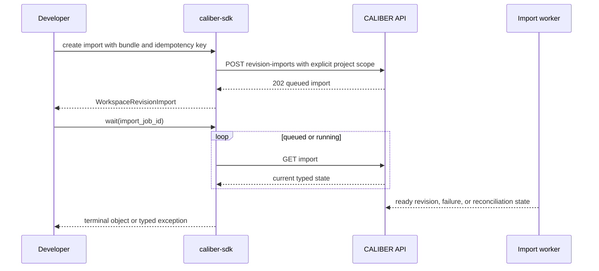
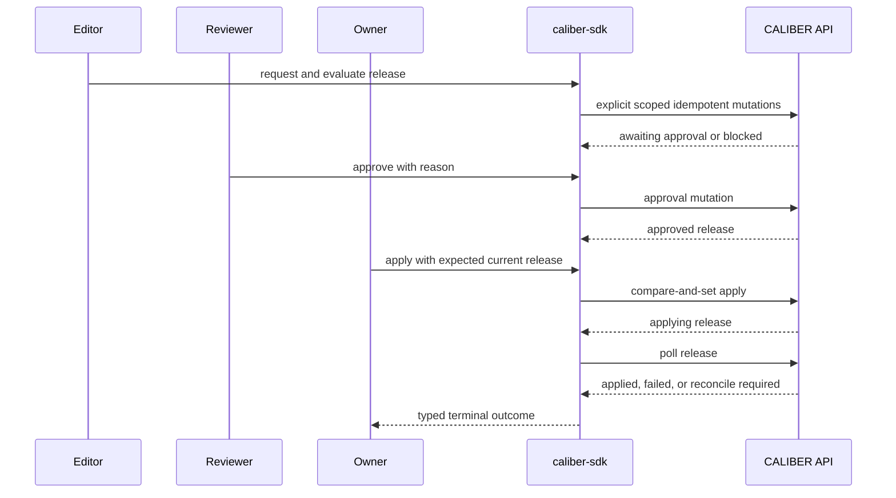

---
audience:
  - sdk-developer
  - backend-developer
  - architect
  - security
doc_type: proposal
product_area: sdk
stability: draft
summary: Implementation-ready plan for complete typed Workspace support in the existing CALIBER Python SDK, with synchronous and asynchronous parity, safe request scoping, lifecycle waiters, and compatibility with the current project wire contract.
prerequisites:
  - Read the Workspace architecture and implementation proposal
  - Treat the current server routes, OpenAPI document, and caliber-sdk tests as the source of truth
  - Preserve the project wire contract during the Workspace MVP
reviewed_on: 2026-09-08
version_applicability: current main f0ea33bd3b90; proposal only, not an implemented SDK capability
tags:
  - workspace
  - sdk
  - python
  - async
  - versioning
  - releases
---

# Workspace SDK development proposal

## Proposal status and decision

This document narrows the broader [Workspace proposal](workspace-plan.md) to
one concern: delivering complete Workspace functionality in the existing
`caliber-sdk` Python package. It is an implementation plan, not a claim that
the proposed methods or server routes already exist.

The recommended decision is:

> Extend the existing `ProjectsAPI` and `X-CALIBER-Project` wire contract into
> one typed Workspace API tree. Expose that same object as both
> `client.projects` and `client.workspaces`, preserve all current project
> methods and models, and add synchronous and asynchronous parity for every GA
> Workspace operation.

This is intentionally not a new package, generated client, second set of
models, or `/workspaces` HTTP API. The SDK continues to call
`/ajax-api/2.0/mlflow/caliber/projects`, use `project_id` and `PRJ-*`, and send
`X-CALIBER-Project`. Product naming becomes friendlier while the proven wire
identifiers remain stable.

## 1. Scope and definition of complete

### 1.1 Goal

An SDK user should be able to perform the complete Workspace development and
release lifecycle without constructing URLs, dictionaries, headers, or polling
loops manually:

1. discover or create a workspace;
2. manage collaborators and files;
3. configure a CALIBER-managed or GitHub-backed source;
4. import or snapshot an immutable workspace revision;
5. inspect revision contents, validation, provenance, and differences;
6. read and configure development, staging, and production environments;
7. request, evaluate, approve, apply, reconcile, and roll back releases;
8. handle blocked, approval-required, failed, and reconciliation-required
   outcomes as different states;
9. execute the same flow through synchronous or asynchronous clients; and
10. use the selected workspace safely when calling existing resource APIs.

### 1.2 Completion criteria

Workspace SDK support is complete only when all of the following are true:

- every GA Workspace server operation has a public typed method;
- sync and async clients expose equivalent Workspace method signatures,
  models, errors, request options, pagination, and lifecycle semantics;
- every workspace-bound request sends an explicit project scope matching the
  path `project_id`;
- complex writes use typed request models rather than open dictionaries;
- retries, idempotency, ETags, and compare-and-set preconditions are explicit;
- long-running imports and releases have domain-specific waiters;
- unknown response fields remain forward-compatible through `.extra`;
- server errors preserve request IDs and machine-readable reason codes;
- API coverage, transport, model, sync/async parity, integration, examples,
  and compatibility tests pass; and
- the package documentation contains an executable end-to-end example.

`client.raw` makes a new route reachable, but raw reachability does not count as
typed Workspace completeness.

### 1.3 Deliberate non-goals

This plan does not implement:

- the backend Workspace tables, services, workers, authorization, or routes;
- the Workspace UI, CLI commands, TypeScript SDK, or plugin SDK;
- GitHub credentials or GitHub API access inside `caliber-sdk`;
- typed async parity for unrelated SDK resource families;
- a bidirectional Git synchronization client;
- local manifest compilation that could diverge from server validation; or
- a new public `/workspaces` route or `X-CALIBER-Workspace` header.

Backend route delivery is a hard dependency. The SDK and backend contracts
should normally land in the same feature PR or in an ordered pair of PRs that
keeps the OpenAPI coverage gate honest.

## 2. Current SDK baseline

The current package already provides most of the infrastructure needed. The
implementation should extend it rather than introduce a parallel client.

| Area | Exists on current `main` | Reuse | Gap for complete Workspace support |
| --- | --- | --- | --- |
| Distribution | Independent `sdk/caliber-sdk`, Python 3.10+, `httpx` runtime dependency | Keep package and lightweight dependency boundary | No new package |
| Project API | `ProjectsAPI` for list/get/create/update, members, storage, and files | Preserve methods and return types | Add Workspace aliases and lifecycle sub-resources |
| Wire scope | Optional `X-CALIBER-Project` from client/transport configuration | Preserve header and environment variable | Bind scope explicitly per workspace request and make ambient scopes concurrency-safe |
| Sync transport | Auth, envelopes, CSRF replay, request IDs, retries, pagination, uploads, downloads | Reuse | Add a typed per-request project override |
| Async transport | Shares retry decisions and supports JSON, multipart, download, and pagination | Reuse | Add full Workspace API tree and async scope context |
| Models | Frozen dataclasses, tolerant decoding, unknown fields in `.extra` | Reuse compatibility behavior | Add Workspace lifecycle and typed write models |
| Errors | Typed common 4xx/5xx errors with payload and request ID | Reuse | Add precondition and machine-readable reason support |
| Waiters | Shared polling behavior and timeout/failure exceptions | Reuse polling engine | Add import/release state policies and domain results |
| API parity | Live OpenAPI-to-SDK coverage gate and explicit allowlist | Keep as release gate | New routes must not remain untyped GA gaps |
| Stability | `0.1.0.dev0` Alpha with server-reported GA/beta/internal tiers | Follow `VERSIONING.md` | Keep Workspace beta until its contract and tests stabilize |

Two current limitations deserve explicit correction:

1. `CaliberClient.project_scope()` changes shared transport state temporarily.
   It restores state correctly for linear code, but it is not safe when one
   client is shared across threads.
2. `AsyncCaliberClient` is intentionally narrow and does not currently mirror
   `ProjectsAPI`. Workspace imports, release operations, and waiters are
   precisely the workflows that benefit from async support.

## 3. Public client architecture

```mermaid
flowchart LR
    DEV[Developer or automation]:::user --> SC[CaliberClient]:::ctrl
    DEV --> AC[AsyncCaliberClient]:::ctrl
    SC --> WA[ProjectsAPI and workspaces alias]:::ctrl
    AC --> AWA[AsyncProjectsAPI and workspaces alias]:::ctrl
    WA --> CT[Shared models, path builders, state policies]:::ctrl
    AWA --> CT
    WA --> ST[Sync transport]:::ctrl
    AWA --> AT[Async transport]:::async
    ST --> API[/projects wire API]:::ext
    AT --> API
```

```legend
```

### 3.1 Namespace contract

Both product terms must resolve to the same resource object:

```python
client.projects is client.workspaces
async_client.projects is async_client.workspaces
```

The same identity rule applies to ergonomic sub-resource aliases:

```python
client.workspaces.revision_imports is client.workspaces.imports
client.workspaces.workspace_releases is client.workspaces.releases
```

The longer names preserve the terminology already selected by the broader
Workspace proposal. The shorter aliases make normal code readable. Neither
alias gets a separate model or transport implementation.

The existing top-level `client.releases` API, if present for an asset family,
is not replaced. Workspace releases always live under
`client.workspaces.releases` or `client.projects.workspace_releases`.

### 3.2 Compatibility rules

The MVP follows these compatibility rules:

- keep `ProjectsAPI`, `Project`, `ProjectMember`, `ProjectFile`, and
  `ProjectFolder` public;
- add `WorkspacesAPI = ProjectsAPI`, `Workspace = Project`,
  `WorkspaceMember = ProjectMember`, `WorkspaceFile = ProjectFile`, and
  `WorkspaceFolder = ProjectFolder` as direct aliases;
- do not warn on `client.projects`; it remains a supported compatibility name;
- keep existing positional and keyword parameters working;
- add convenience methods such as `archive()` as delegates to existing update
  behavior rather than changing `update()`;
- keep `CALIBER_PROJECT` as the configuration variable for the MVP;
- do not send two scope headers; and
- if a future server accepts `X-CALIBER-Workspace`, reject conflicting project
  and workspace values locally before any request is sent.

This additive approach is suitable for the current Alpha package and reduces
migration risk for existing scripts.

### 3.3 Resource tree

```text
client.workspaces                         # same object as client.projects
├── list, get, create, update
├── archive, restore, transfer_ownership, storage
├── members                               # flat legacy methods remain delegates
│   ├── list, add, update, remove
├── files                                 # existing implementation
│   ├── list, upload, create_folder, delete, download
├── source
│   ├── get, configure, disable
├── revision_imports / imports
│   ├── list, get, create, wait
├── revisions
│   ├── list, iter_all, get, diff, snapshot
├── environments
│   ├── list, get, update
└── workspace_releases / releases
    ├── list, get, request, evaluate, approve
    ├── apply, reconcile, rollback, break_glass_apply
    └── wait_for_evaluation, wait_for_apply, wait_for_rollback
```

The async tree has the same names and argument semantics. Its network methods
are coroutines, `iter_all()` is an async iterator, and waiters are awaitable.

## 4. Workspace scope, authentication, and request safety

### 4.1 Scope invariant

Every method whose URL contains `/projects/{project_id}` must send:

```text
X-CALIBER-Project == project_id from the URL
```

The SDK must not rely on the client's ambient project for those calls. This
prevents a client configured for `PRJ-A` from accidentally requesting a
`PRJ-B` URL with the `PRJ-A` header.

The transport gains an internal tri-state request option:

| Request scope value | Meaning |
| --- | --- |
| `UNSET_PROJECT` | Use the active context scope, then constructor default |
| project ID string | Send exactly that `X-CALIBER-Project` value |
| `None` | Intentionally omit the project header for a platform/library call |

Public Workspace sub-resources always pass the explicit string. Existing
resource APIs normally use `UNSET_PROJECT`, preserving current behavior.

If a caller supplies `X-CALIBER-Project` manually and also supplies an explicit
SDK project override, unequal values raise `CaliberConfigError` before network
I/O. Equal values are normalized to one header.

### 4.2 Concurrency-safe ambient scopes

Replace mutable temporary transport state with a `ContextVar`-backed active
scope while preserving the constructor's project as the default:

```python
with client.workspace_scope("PRJ-123"):
    client.prompts.list()  # inherits PRJ-123

with client.library_scope():
    client.prompts.list()  # deliberately omits the header
```

`project_scope()` remains as a compatibility alias to `workspace_scope()`.
Nested contexts restore the prior value. Separate threads and async tasks do
not leak scope into one another.

The async client exposes the same synchronous context managers because changing
an in-process context variable requires no asynchronous cleanup:

```python
with async_client.workspace_scope("PRJ-123"):
    await async_client.workflows.runs.get("RUN-123")
```

The context controls existing resource calls. Direct calls such as
`client.workspaces.revisions.get("PRJ-123", revision_id)` still use their
explicit project ID even inside a different ambient scope.

### 4.3 Credentials

The SDK continues to accept existing bearer tokens and personal access tokens.
It does not infer permissions from role names and does not enforce Workspace
RBAC locally. The server remains authoritative.

For automation, the backend prerequisite is a PAT that can be restricted to a
single `project_id`. The SDK only transmits that token and exposes server
authorization failures. It must never inspect, persist, log, or include token
values in model representations.

## 5. Typed API surface

The tables below define the target public surface. “Current” means the server
route and a typed sync SDK method exist on the reviewed baseline. “Backend
dependency” means the server route must be delivered or finalized before the
SDK method can be considered implemented.

### 5.1 Workspace root, members, storage, and files

| SDK method | HTTP operation | Status | Required action |
| --- | --- | --- | --- |
| `workspaces.list(status=None)` | `GET /projects` | Current | authenticated read |
| `workspaces.get(project_id)` | `GET /projects/{id}` | Current | `workspace.read` |
| `workspaces.create(name, description=None)` | `POST /projects` | Current; response will expand | global operator |
| `workspaces.update(project_id, ...)` | `PATCH /projects/{id}` | Current | `workspace.update` |
| `workspaces.archive(project_id)` | Delegate to `update(status="archived")` | SDK addition | `workspace.update` |
| `workspaces.restore(project_id)` | Delegate to `update(status="active")` | SDK addition | `workspace.update` |
| `workspaces.transfer_ownership(project_id, request)` | `POST /projects/{id}/transfer-ownership` | Backend dependency | owner and global admin |
| `workspaces.storage()` | `GET /projects/storage` | Current | authenticated read |
| `members.list/add/update/remove` | Existing member routes | Current methods, new grouping | `workspace.manage_members` for writes |
| `files.list/upload/create_folder/delete/download` | Existing file/folder routes | Current | read or `resource.write` |

Existing flat member methods remain thin delegates. The grouped API becomes
the preferred documentation surface without forcing migration.

### 5.2 Source, imports, and revisions

| SDK method | HTTP operation | Status | Required action |
| --- | --- | --- | --- |
| `source.get(project_id)` | `GET /projects/{id}/source` | Backend dependency | `workspace.read` |
| `source.configure(project_id, request, if_match=...)` | `PUT /projects/{id}/source` | Backend dependency | `workspace.manage_source` |
| `source.disable(project_id, if_match=...)` | Same `PUT` contract with disabled mode | Backend dependency | `workspace.manage_source` |
| `revision_imports.list(project_id, ...)` | `GET /projects/{id}/revision-imports` | Contract addition required | `workspace.read` |
| `revision_imports.get(project_id, import_job_id)` | `GET /projects/{id}/revision-imports/{import_job_id}` | Backend dependency | `workspace.read` |
| `revision_imports.create(project_id, request, bundle, idempotency_key=...)` | `POST /projects/{id}/revision-imports` | Backend dependency | `revision.import` |
| `revision_imports.wait(project_id, import_job_id, ...)` | Polls import `GET` | SDK addition | `workspace.read` |
| `revisions.list(project_id, ...)` | `GET /projects/{id}/revisions` | Backend dependency | `workspace.read` |
| `revisions.iter_all(project_id, ...)` | Repeated revision `GET` | SDK addition | `workspace.read` |
| `revisions.get(project_id, revision_id)` | `GET /projects/{id}/revisions/{revision_id}` | Backend dependency | `workspace.read` |
| `revisions.diff(project_id, revision_id, base_revision_id=...)` | `GET .../{revision_id}/diff?base=...` | Backend dependency | `workspace.read` |
| `revisions.snapshot(project_id, request, idempotency_key=...)` | `POST /projects/{id}/revisions:snapshot` | Backend dependency | `revision.create` |

The import-list route is required even though it was not explicit in the first
Workspace route table. Operators need to recover an import ID after process
restart, inspect recent failures, and resume observation without relying on
local state.

### 5.3 Environments and Workspace releases

| SDK method | HTTP operation | Status | Required action |
| --- | --- | --- | --- |
| `environments.list(project_id)` | `GET /projects/{id}/environments` | Backend dependency | `workspace.read` |
| `environments.get(project_id, name)` | `GET /projects/{id}/environments/{name}` | Contract addition required | `workspace.read` |
| `environments.update(project_id, name, request, if_match=...)` | `PATCH /projects/{id}/environments/{name}` | Backend dependency | `environment.manage` |
| `releases.list(project_id, ...)` | `GET /projects/{id}/releases` | Contract addition required | `workspace.read` |
| `releases.get(project_id, release_id)` | `GET /projects/{id}/releases/{release_id}` | Backend dependency | `workspace.read` |
| `releases.request(project_id, request, idempotency_key=...)` | `POST /projects/{id}/releases` | Backend dependency | `release.request` |
| `releases.evaluate(project_id, release_id, request, idempotency_key=...)` | `POST .../{release_id}/evaluate` | Backend dependency | `release.request` |
| `releases.approve(project_id, release_id, request, idempotency_key=...)` | `POST .../{release_id}/approve` | Backend dependency | `release.approve` |
| `releases.apply(project_id, release_id, request, idempotency_key=...)` | `POST .../{release_id}/apply` | Backend dependency | `release.apply` |
| `releases.rollback(project_id, release_id, request, idempotency_key=...)` | `POST .../{release_id}/rollback` | Backend dependency | `release.rollback` |
| `releases.reconcile(project_id, release_id, request, idempotency_key=...)` | `POST .../{release_id}/reconcile` | Backend dependency | `release.reconcile` |
| `releases.break_glass_apply(project_id, release_id, request, idempotency_key=...)` | `POST .../{release_id}/break-glass-apply` | Backend dependency | owner and global admin |

The single-environment detail and release-list routes are also required for a
complete recoverable client. Without them, automation cannot refresh one
environment efficiently or rediscover a release after losing local state.

### 5.4 Capability and permission behavior

The SDK exposes server-provided `Project.permissions` and capability metadata
as data. It does not use a local role-to-permission table to decide whether to
send a request. That would drift from server policy and mishandle credential
scope ceilings, environment rules, and release-instance separation of duties.

| SDK behavior | Rule |
| --- | --- |
| Display or preflight | Call server capabilities and inspect returned permissions |
| Enforce | Always server-side |
| Hidden workspace | Preserve server `404`; do not probe globally |
| Visible but disallowed action | Raise `CaliberPermissionError` from `403` |
| Unknown permission or state | Do not infer permission; let the server decide |
| Break glass | Separate explicit method and request type; never a boolean on normal `apply()` |

## 6. Data and request models

### 6.1 Compatibility aliases

The following are aliases, not subclasses or copies:

| Workspace name | Existing model |
| --- | --- |
| `Workspace` | `Project` |
| `WorkspaceMember` | `ProjectMember` |
| `WorkspaceFile` | `ProjectFile` |
| `WorkspaceFolder` | `ProjectFolder` |

`Project` should be extended additively as the server response grows, including
optional source status, current revision, environment summary, and effective
permissions. Existing fields and defaults remain unchanged.

### 6.2 New response models

Add frozen dataclasses in `models/workspaces.py`:

| Model | Required typed content |
| --- | --- |
| `WorkspaceSource` | `source_id`, project ID, provider, repository, default branch, manifest/root paths, sync mode, status, ETag, timestamps |
| `WorkspaceRevisionImport` | `import_job_id`, project/source IDs, repository/commit, bundle and manifest digests, status, revision ID, idempotency key, progress, structured errors, timestamps |
| `WorkspaceRevision` | `revision_id`, project ID, revision number, source commit, manifest/revision digests, status, validation report, provenance, resources, timestamps |
| `WorkspaceRevisionResource` | Resource type/name, resource/version IDs, content/config digests, source, provider, purpose, resolution state |
| `WorkspaceRevisionDiff` | Base/target IDs and typed added, removed, changed, unchanged, unresolved entries |
| `WorkspaceEnvironment` | `environment_id`, project ID, name/class/order, status, policy/config references and digest, current release ID, ETag, timestamps |
| `WorkspaceRelease` | `workspace_release_id`, project/revision/environment IDs, candidate, predecessor/CAS values, status, evidence, signoffs, actors, break-glass metadata, error, items, timestamps |
| `WorkspaceReleaseItem` | Resource identity, target version, provider operation, prior state, current state, evidence, error |
| `WorkspaceReleaseSignoff` | Actor, decision, reason, policy identity, timestamp |
| `WorkspaceValidationIssue` | Stable code, severity, resource pointer, message, optional evidence metadata |
| `Page[T]` | Existing page model made generic, retaining items/limit/offset and adding optional total when provided |

Nested objects require explicit decoders. A top-level dataclass decode is not
enough when `resources`, `items`, `signoffs`, or validation issues contain
nested dictionaries.

All response models retain `extra: dict[str, Any]` so new server fields do not
break older clients. Enumerated states are exported string constants or
`StrEnum` values whose decoder preserves unknown server values; decoding must
not fail solely because a newer server introduced a state.

### 6.3 Typed write models

Complex mutations use request dataclasses. This closes part of the package's
documented pre-1.0 interface-quality gap.

| Request model | Important fields and constraints |
| --- | --- |
| `TransferWorkspaceOwnershipRequest` | `new_owner_user_id`, optional reason |
| `ConfigureWorkspaceSourceRequest` | provider, repository, default branch, manifest/root path, sync mode; no token material |
| `CreateRevisionImportRequest` | repository, full commit SHA, manifest path, optional GitHub run URL and metadata |
| `SnapshotWorkspaceRevisionRequest` | exact resource-version pins, optional source description; no mutable aliases |
| `UpdateWorkspaceEnvironmentRequest` | policy reference, configuration reference/digest; no current release mutation |
| `CreateWorkspaceReleaseRequest` | revision ID, environment name, optional bounded reason/metadata |
| `EvaluateWorkspaceReleaseRequest` | optional named policy revision and deterministic evaluation inputs |
| `ApproveWorkspaceReleaseRequest` | decision (`approve` or `reject`) and non-empty reason where policy requires it |
| `ApplyWorkspaceReleaseRequest` | mandatory `expected_current_release_id`, where `None` explicitly means an empty environment |
| `RollbackWorkspaceReleaseRequest` | target predecessor/release and reason |
| `ReconcileWorkspaceReleaseRequest` | expected observed state and operator reason |
| `BreakGlassApplyRequest` | mandatory reason, expiry, incident/reference ID, and `expected_current_release_id` |

Request objects provide an internal `to_payload()` implementation that omits
unset optional fields but preserves explicit `None` when it has compare-and-set
meaning. Public APIs must not accept broad `**options` for governed mutations.

### 6.4 Pagination contract

Workspace imports, revisions, and releases are durable history and must be
pageable. Phase 0 freezes one server response shape. The SDK should support the
current offset convention unless the backend has already standardized a cursor:

```json
{
  "items": [],
  "limit": 50,
  "offset": 0,
  "total": 0
}
```

Each durable-history list method returns `Page[T]` and each `iter_all()` lazily
traverses pages. Making the current `Page` generic is a typing-only extension;
its existing constructor fields and properties remain compatible. Sync and
async implementations use the same stop conditions and protect against a
server returning an unchanged next offset.

## 7. Idempotency, preconditions, retries, and errors

### 7.1 Idempotency contract

All mutations that can cross an external effect require an
`idempotency_key: str` keyword argument:

- revision import and snapshot;
- release request and evaluation;
- approval/rejection;
- apply, rollback, and reconcile; and
- break-glass apply.

The SDK sends it as `Idempotency-Key`. It does not silently generate a random
key: a generated value cannot protect a caller retrying after process failure.
Validation rejects an empty or whitespace-only key before I/O.

The expected server behavior is:

- same key and same canonical request/bundle digest returns the original
  operation;
- same key and different content returns `409` with a stable reason code; and
- the response exposes the operation ID so the caller can resume observation.

### 7.2 ETags and compare-and-set

Source and environment configuration changes use `If-Match`. Their response
models expose the ETag returned by the server body or response header. The SDK
must retain response metadata long enough to populate that field.

Release apply, rollback, reconcile, and break-glass requests include
`expected_current_release_id`. An explicit `None` means “apply only if this
environment has no current release”; omission is invalid. A stale value fails
before child effects begin.

The server should use `412 Precondition Failed` for stale ETags and `409
Conflict` for a validly formed release request that conflicts with current
release state. Phase 0 must freeze those two cases and their reason codes.

### 7.3 Retry policy

Keep the current conservative transport policy:

- automatically retry safe reads for configured transient statuses;
- do not automatically retry writes, even when an idempotency key is present;
- allow the caller to retry an idempotent write deliberately with the same key;
- honor `Retry-After` for `429`; and
- surface transport uncertainty without claiming that a write did not happen.

Automatic write retries can be evaluated later, after every relevant backend
operation has durable idempotency tests.

### 7.4 Error contract

Extend the common exception model rather than creating unrelated exceptions per
method:

| Condition | SDK result |
| --- | --- |
| `400` invalid request | `CaliberValidationError`, including structured field errors |
| `401` | `CaliberAuthenticationError` |
| `403` | `CaliberPermissionError` |
| `404` | `CaliberNotFoundError` without existence probing |
| `409` state/idempotency conflict | `CaliberConflictError` with `reason_code` |
| `412` stale ETag | new `CaliberPreconditionError` with `reason_code` |
| `429` | `CaliberRateLimitError` with retry metadata |
| `5xx` | `CaliberServerError` |
| invalid response shape | `CaliberDecodeError` in strict Workspace decoders |
| network uncertainty | `CaliberTransportError` preserving operation context |

`CaliberAPIError` gains optional `reason_code` and retry metadata parsed from a
stable server error envelope. Every error retains status, method, URL, request
ID, and safe payload. Exception strings and representations must redact
authorization, cookies, bundle bytes, and secret-bearing metadata.

Lifecycle outcomes such as `blocked`, `awaiting_approval`, and
`reconcile_required` are valid server states, not HTTP errors. Waiters return or
raise domain-specific lifecycle results as defined below.

## 8. Long-running lifecycle and waiters

### 8.1 State policies

State sets live in one shared internal module used by sync and async clients.
The SDK must never poll past a durable state that requires a human or a separate
command.

| Waiter | Continue while | Return successfully when | Raise |
| --- | --- | --- | --- |
| `revision_imports.wait` | `queued`, `running` | `succeeded` | `failed`; `reconcile_required` uses a distinct attention exception |
| `releases.wait_for_evaluation` | `draft`, `evaluating` | `blocked`, `awaiting_approval`, `approved`, `rejected` | terminal technical failure |
| `releases.wait_for_apply` | `approved`, `applying` | `applied` | `failed`; distinct attention exception for `reconcile_required` |
| `releases.wait_for_rollback` | rollback queued/running states | `rolled_back` | `failed`; distinct attention exception for `reconcile_required` |

`blocked`, `awaiting_approval`, and `rejected` are returned release objects so
the caller can inspect evidence and signoffs. They are not converted into
success booleans.

### 8.2 Common waiter parameters

Every waiter accepts:

- `timeout` using a monotonic clock;
- `poll_interval` with a positive minimum;
- optional deterministic backoff and maximum interval;
- optional cancellation callback for sync or normal task cancellation for
  async; and
- `raise_on_attention`, defaulting to `True` for reconciliation-required.

Timeout exceptions include the operation ID, last decoded object, last state,
elapsed time, and request ID when available. A timeout never cancels the
server-side operation or reports it as failed.

### 8.3 Import interaction



### 8.4 Release interaction



The examples use separate actors because the production policy cannot be
satisfied by SDK call order alone. The server verifies actor identity and
separation of duties.

## 9. Sync and async implementation design

### 9.1 Shared contract, separate I/O wrappers

Sync and async implementations share:

- public response and request models;
- path builders and request serialization;
- state constants and waiter transition policies;
- idempotency and precondition header builders;
- scope-conflict validation;
- nested response decoders; and
- error mapping.

They do not duplicate policy decisions. Thin sync and async resource classes
perform transport calls and decode results.

### 9.2 Async additions

Add an internal async resource base with `_get`, `_post`, `_put`, `_patch`, and
`_delete`. The async Workspace implementation must support multipart import,
file-like input, byte downloads, typed pagination, and waiters.

For bundle uploads, the async transport must not perform blocking reads of a
large file on the event loop. Accept bytes and seekable binary streams under a
documented size/streaming contract. If `httpx` requires a blocking stream read,
move that read to a worker thread or require an async byte stream type; freeze
this decision in Phase 0 and test it with a heartbeat task.

### 9.3 Signature parity

Parity means semantic parity, not identical return awaitability:

```python
sync.workspaces.revisions.get(project_id, revision_id)
await async_client.workspaces.revisions.get(project_id, revision_id)
```

An introspection test compares normalized public signatures, allowing only
`self`, coroutine form, and iterator protocol differences. Every model and
exception type is shared.

## 10. Proposed package changes

| Path | Change |
| --- | --- |
| `src/caliber_sdk/client.py` | Expose `workspaces`, add concurrency-safe `workspace_scope`, `project_scope` delegate, and `library_scope` |
| `src/caliber_sdk/transport.py` | Add tri-state per-request project override and header conflict validation |
| `src/caliber_sdk/resources/projects.py` | Preserve current API, attach new sub-resources, add root conveniences and aliases |
| `src/caliber_sdk/resources/workspaces.py` | Implement sync members/source/import/revision/environment/release sub-resources |
| `src/caliber_sdk/models/common.py` | Make the existing `Page` generic and add optional total without changing current constructor fields |
| `src/caliber_sdk/models/workspaces.py` | Add response/request models and nested decoders |
| `src/caliber_sdk/_workspace_contract.py` | Keep path builders, state policies, headers, and request serialization shared |
| `src/caliber_sdk/aio/client.py` | Expose async projects/workspaces and async scope contexts |
| `src/caliber_sdk/aio/workspaces.py` | Implement the complete async Workspace tree |
| `src/caliber_sdk/aio/transport.py` | Match explicit project override and multipart behavior |
| `src/caliber_sdk/errors.py` | Add precondition and reason-code support |
| `src/caliber_sdk/waiters.py` | Reuse generic polling engine and add shared Workspace policies |
| `src/caliber_sdk/__init__.py` and model exports | Export aliases, models, request types, and exceptions without dead exports |
| `tests/test_resources_core.py` | Preserve current project behavior and test new compatibility delegates |
| `tests/test_resources_workspaces.py` | Sync API, scope, headers, payloads, decoding, pagination, and lifecycle tests |
| `tests/test_async_workspaces.py` and `tests/test_async_parity.py` | Async methods, multipart, signatures, concurrency, pagination, cancellation, and waiters |
| `tests/test_models_workspaces.py` | Nested decoding, unknown fields/states, serialization, and redaction |
| `tests/test_transport.py` | Tri-state scope, conflict, retries, ETag, and idempotency headers |
| `caliber/tests/test_sdk_api_coverage.py` | No structural rewrite; new routes must be covered or explicitly tracked |

The private contract module is intentionally narrow. It must not become a
second transport, generic code generator, or local authorization engine.

## 11. End-to-end developer contract

The final package should support a flow of this shape:

```python
from pathlib import Path

from caliber_sdk import (
    ApplyWorkspaceReleaseRequest,
    CaliberClient,
    ConfigureWorkspaceSourceRequest,
    CreateRevisionImportRequest,
    CreateWorkspaceReleaseRequest,
    EvaluateWorkspaceReleaseRequest,
)

client = CaliberClient()
workspace = client.workspaces.create("pricing-policy")

source = client.workspaces.source.configure(
    workspace.project_id,
    ConfigureWorkspaceSourceRequest(
        provider="github",
        repository="example/pricing-policy",
        default_branch="main",
        root_path=".",
        manifest_path=".caliber/workspace.yaml",
        sync_mode="push",
    ),
    if_match="*",
)

with Path("caliber-source.tar.gz").open("rb") as bundle:
    import_job = client.workspaces.imports.create(
        workspace.project_id,
        CreateRevisionImportRequest(
            repository="example/pricing-policy",
            commit_sha="4ac0f0b8a9c4b8d0f65a8e94ad11aa3dc2a274f0",
            manifest_path=".caliber/workspace.yaml",
        ),
        bundle=bundle,
        idempotency_key="github:example/pricing-policy:4ac0f0b8a9c4",
    )

import_job = client.workspaces.imports.wait(
    workspace.project_id,
    import_job.import_job_id,
    timeout=600,
)
revision = client.workspaces.revisions.get(
    workspace.project_id,
    import_job.revision_id,
)

release = client.workspaces.releases.request(
    workspace.project_id,
    CreateWorkspaceReleaseRequest(
        revision_id=revision.revision_id,
        environment="dev",
    ),
    idempotency_key=f"dev-release:{revision.revision_id}",
)
client.workspaces.releases.evaluate(
    workspace.project_id,
    release.workspace_release_id,
    EvaluateWorkspaceReleaseRequest(),
    idempotency_key=f"evaluate:{release.workspace_release_id}",
)
release = client.workspaces.releases.wait_for_evaluation(
    workspace.project_id,
    release.workspace_release_id,
)

environment = client.workspaces.environments.get(
    workspace.project_id,
    "dev",
)
client.workspaces.releases.apply(
    workspace.project_id,
    release.workspace_release_id,
    ApplyWorkspaceReleaseRequest(
        expected_current_release_id=environment.current_release_id,
    ),
    idempotency_key=f"apply:{release.workspace_release_id}",
)
release = client.workspaces.releases.wait_for_apply(
    workspace.project_id,
    release.workspace_release_id,
)
```

The exact same lifecycle is available asynchronously. Approval of staging or
production is shown in separate reviewer-authenticated code because SDK objects
must not imply that one process identity can bypass separation of duties.

## 12. Test and validation strategy

### 12.1 Deterministic test matrix

| Layer | Required tests |
| --- | --- |
| Models | Complete/minimal payloads, nested decode, unknown fields, unknown states, explicit `None`, malformed strict payloads |
| Serialization | Every request model, omitted versus explicit null, full commit SHA, non-empty idempotency key, secret rejection |
| Paths and headers | Path/header project equality, ambient override, explicit library omission, conflicting manual header, ETag, idempotency |
| Sync resources | One success and representative error per method family; payload and response type assertions |
| Async resources | Same contract cases, signature parity, cancellation, file upload without event-loop starvation |
| Scope concurrency | Nested restoration, two threads, two async tasks, constructor default, library context, exception restoration |
| Pagination | Empty, short, exact full page, multiple pages, repeated cursor/offset guard, async early break |
| Waiters | Every terminal state, attention state, timeout, transient read retry, cancellation, no polling past human states |
| Errors | 400/401/403/404/409/412/429/5xx, reason code, request ID, HTML/non-JSON response, redaction |
| Compatibility | `projects is workspaces`, model alias identity, existing method signatures and tests, no deprecation warning |
| API coverage | Every live Workspace operation typed; no stale gap or exclusion |
| Server integration | Real in-process route, auth, scope isolation, multipart digest, idempotent replay, CAS conflict, actor separation |
| Packaging | Wheel imports without CALIBER server runtime dependencies and exports contain no dead symbols |
| Documentation | Examples compile and mocked cookbook flow executes deterministically |

Negative isolation tests are mandatory: a valid token and valid resource ID
must still fail when the URL project, header project, credential project, or
resource ownership differs.

### 12.2 SDK CI-equivalent commands

For SDK implementation changes, run the package's current CI sequence:

```bash
cd sdk/caliber-sdk
uv pip install --system -e ".[dev]"
ruff check .
mypy
pytest
python -m build --wheel --outdir dist
```

Also run the server-side contract and coverage tests from the repository's
configured CALIBER environment, including at minimum:

```bash
python -m pytest \
  caliber/tests/test_sdk_api_coverage.py \
  caliber/tests/test_sdk_against_server.py \
  caliber/tests/test_sdk_docs_contract.py \
  --no-cov
git diff --check
```

Use the exact dependency installation and Python executable defined by the
current CI workflow. A multi-component PR must run all affected jobs or
`./test-all.sh`; a focused SDK command does not substitute for backend route,
authorization, worker, migration, or docs validation.

## 13. Phased implementation plan

The estimates are engineering days for the SDK scope only. They exclude the
backend models, routes, workers, and release orchestrator described in the
broader Workspace proposal. Add approximately 30 percent contingency until the
Phase 0 contracts are frozen.

### Phase 0 - freeze server and SDK contracts (2-3 days)

Tasks:

1. Inventory the final Workspace OpenAPI operations and stability tags.
2. Add the three recoverability routes: import list, environment get, and
   release list, or record an explicit alternative contract.
3. Freeze list pagination, error envelope and reason codes, ETag behavior,
   idempotency replay, and apply compare-and-set semantics.
4. Freeze multipart field names, maximum bundle size, and sync/async streaming
   behavior.
5. Map every operation to an SDK method, model, permission, and test owner.
6. Confirm which Workspace routes are beta and the criteria for GA.

Acceptance criteria:

- one reviewed OpenAPI diff accounts for every target method in Section 5;
- no method depends on an unresolved body or response shape;
- state-machine values and terminal-state semantics are documented; and
- backend and SDK implementation PR ordering is agreed.

### Phase 1 - scope safety, aliases, and model foundation (3-5 days)

Tasks:

1. Add tri-state per-request project scope to both transports.
2. Replace temporary mutable scope with `ContextVar` behavior.
3. Add `workspace_scope`, `library_scope`, and compatibility delegates.
4. Expose `workspaces is projects` on sync and async clients.
5. Add model aliases, lifecycle response models, request models, strict nested
   decoders, and shared state policies.
6. Extend common errors with precondition, reason-code, and retry metadata.

Acceptance criteria:

- project/header conflicts fail before I/O;
- thread and task isolation tests pass;
- existing `ProjectsAPI` tests pass unchanged;
- aliases are identity-equal and warning-free; and
- unknown response fields and states decode safely.

### Phase 2 - root, members, files, and source parity (3-5 days)

Tasks:

1. Add grouped members API with flat-method delegates.
2. Add root conveniences and ownership transfer.
3. Implement source get/configure/disable with ETags.
4. Implement async root, member, storage, and file parity.
5. Verify file uploads and downloads under explicit workspace scope.

Acceptance criteria:

- all existing and new root/member/file/source methods are typed in both
  clients;
- stale ETags map to the typed precondition error; and
- every project-bound request asserts matching path and header IDs.

### Phase 3 - revision imports and immutable revisions (5-7 days)

Tasks:

1. Implement sync and async import list/get/create.
2. Implement multipart metadata plus bundle handling and digest-safe replay.
3. Add import waiters and attention-state exceptions.
4. Implement revision list/iteration/get/diff/snapshot.
5. Add custom nested decoders and pagination guards.
6. Add an executable GitHub push-import cookbook using a scoped CALIBER PAT,
   without adding GitHub dependencies to the SDK.

Acceptance criteria:

- repeated idempotency key plus identical content returns the same typed job;
- key reuse with different content becomes a typed conflict;
- sync/async imports produce equivalent requests and models;
- the async upload does not block the event loop under its supported size; and
- import failure and reconciliation-required remain distinct.

### Phase 4 - environments and governed releases (6-9 days)

Tasks:

1. Implement environment list/get/update with ETags.
2. Implement release list/get/request and all action methods.
3. Implement evaluation, apply, and rollback waiters.
4. Preserve evidence, signoffs, child items, actors, and error detail in nested
   models.
5. Add explicit CAS tests and transport-uncertainty recovery tests.
6. Add multi-client integration tests for requester, reviewer, and owner.
7. Verify that break glass cannot be invoked through normal apply options.

Acceptance criteria:

- a revision can be promoted through development with typed calls only;
- staging/production tests enforce distinct actors through real server auth;
- stale current-release state causes no child operation;
- partial external effects surface as reconciliation-required; and
- rollback identifies and restores an exact predecessor, not a mutable alias.

### Phase 5 - completeness, compatibility, and release readiness (3-5 days)

Tasks:

1. Close every GA Workspace entry in the API coverage inventory.
2. Run normalized sync/async signature parity tests.
3. Add end-to-end examples, API reference entries, changelog, and migration
   notes for `client.workspaces`.
4. Build and inspect the wheel; verify no server dependencies or dead exports.
5. Run full affected CI and a supported older-client/newer-server compatibility
   fixture set.
6. Keep Workspace beta until pilot evidence satisfies the documented GA bar.

Acceptance criteria:

- all Section 1.2 completion criteria pass;
- the OpenAPI coverage gate reports no untracked Workspace operation;
- current project-based user code remains green;
- documentation examples execute deterministically; and
- package stability metadata accurately reflects the deployed server.

### 13.1 Estimated effort and dependencies

| Workstream | Estimate | Depends on |
| --- | ---: | --- |
| Contract freeze | 2-3 days | Backend route/state owners |
| Scope, aliases, models, errors | 3-5 days | Phase 0 error and ETag decisions |
| Root/member/file/source parity | 3-5 days | Source routes and async transport |
| Imports and revisions | 5-7 days | Import worker, multipart contract, revision schema |
| Environments and releases | 6-9 days | Release service, policy, CAS, reconciliation |
| Completeness and release readiness | 3-5 days | All prior phases and OpenAPI stability tags |
| **Total SDK effort** | **22-34 engineering days** | Excludes backend implementation |

Two SDK engineers can overlap sync/async resource work after the shared models
and request contract are stable. Transport, models, and path contracts should
have one owner to avoid semantic divergence.

## 14. Risks and mitigations

| Risk | Consequence | Mitigation |
| --- | --- | --- |
| SDK lands before backend shape stabilizes | Rework and public contract churn | Complete Phase 0 and keep routes beta |
| Product rename becomes physical API rename | Large migration with little user value | Alias one object and preserve project wire names |
| Ambient scope leaks across concurrency | Cross-workspace request or data exposure | `ContextVar`, explicit nested-call scope, negative concurrency tests |
| Sync and async implementations drift | Different safety or lifecycle behavior | Shared contract module and signature/fixture parity tests |
| Generic dictionaries hide invalid release input | Runtime failures or unsafe defaults | Typed governed request models and strict local validation |
| Automatic retries duplicate external effects | Duplicate import or deployment | No automatic write retries; caller-stable idempotency keys |
| Waiter calls blocked state success | Automation promotes or exits incorrectly | State-specific waiters and explicit attention outcomes |
| Reconciliation is flattened into failure | Operator cannot resolve ambiguous provider state | Dedicated model state and exception carrying the last release/import |
| Tolerant decoding hides malformed required content | Corrupt object reaches automation | Strict top-level/nested shape validation plus tolerant unknown fields |
| Listing APIs are omitted | Jobs/releases become undiscoverable after restart | Add import/release list routes before declaring completeness |
| SDK authorization logic diverges | False allow/deny decisions | Expose capabilities as data; enforce only on server |

## 15. Migration and release strategy

No user migration is required for existing project code. The rollout is
additive:

1. ship scope-safety changes and aliases while existing tests establish no
   behavioral regression;
2. expose Workspace beta capabilities only when the deployment reports them;
3. add typed methods with the matching backend routes in lockstep;
4. publish examples using `client.workspaces` while continuing to support
   `client.projects`;
5. collect pilot evidence for import replay, release CAS, reconciliation,
   concurrency, and older-client decoding; and
6. move the Workspace OpenAPI tag to GA only after the complete method and test
   matrix passes.

A newer SDK talking to a server without Workspace capabilities should fail a
method call with the normal typed `404`/capability result; it must not emulate
the operation locally. An older SDK talking to a newer server remains viable
because project fields are additive and unknown response fields land in
`.extra`.

## 16. Architecture evolution

The MVP leaves deliberate extension points without implementing them early:

- add independently versioned server/SDK compatibility ranges when releases no
  longer ship in lockstep;
- introduce generated type fragments from the stable OpenAPI schema while
  retaining hand-written lifecycle methods and waiters;
- add cursor pagination behind the same typed iterator contract;
- support streaming bundle sources once the upload protocol is proven;
- introduce `X-CALIBER-Workspace` and `/workspaces` only in a future major API,
  with conflict detection and a measured migration period;
- add organization/group membership and custom roles without changing SDK
  enforcement, because capabilities remain server-provided data;
- add server-sent event lifecycle streams behind the same terminal-state
  policies, leaving polling as a fallback; and
- generate CLI commands from the stable typed request/response contract after
  the Python SDK is complete.

None of these extensions is required to deliver a safe, complete Workspace SDK
for the current project-based architecture.

## 17. Final definition of done

The Workspace SDK initiative is ready for human review only when:

- `CaliberClient` and `AsyncCaliberClient` expose the complete resource tree;
- `projects` and `workspaces` are identity aliases over the project wire API;
- all workspace-bound calls enforce URL/header equality and concurrency-safe
  ambient scope;
- all complex mutations are typed and all external effects require caller-owned
  idempotency keys;
- ETag and release compare-and-set conflicts are typed and tested;
- imports, evaluations, applies, and rollbacks expose honest terminal states;
- every GA route is covered by the SDK/API parity gate;
- negative isolation and actor-separation integration tests pass;
- sync/async parity, packaging, examples, docs, and full affected CI pass;
- no server runtime dependency enters the SDK wheel; and
- existing `client.projects` code remains supported without a forced rename.
