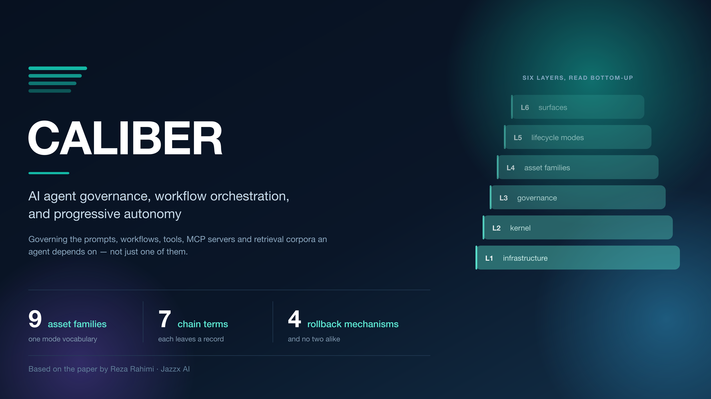
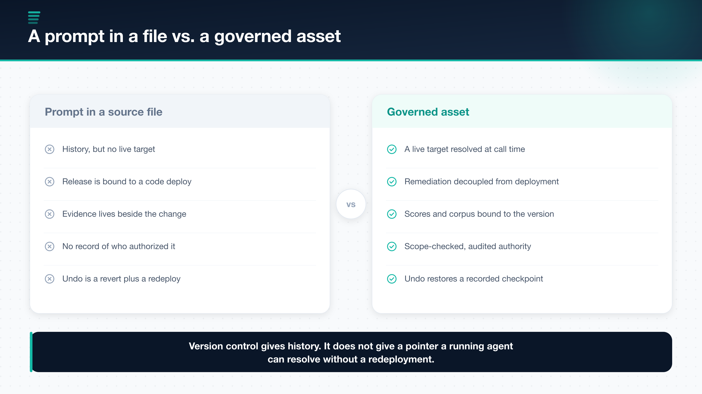
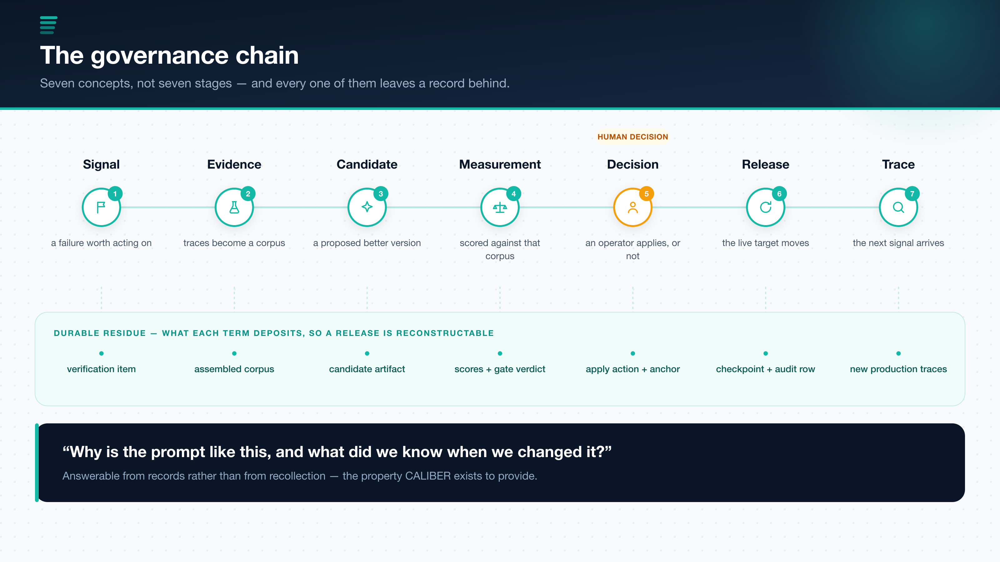
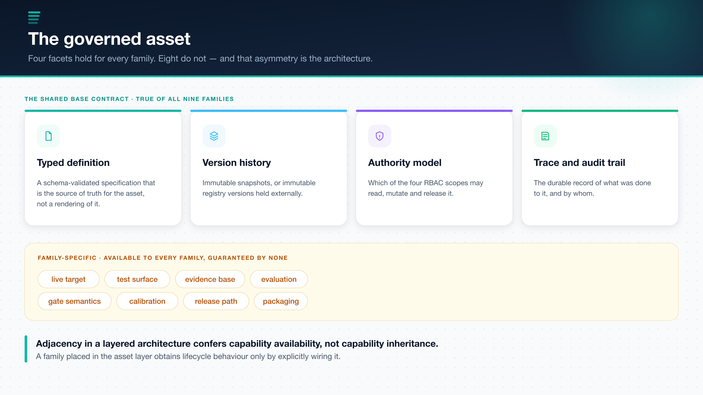
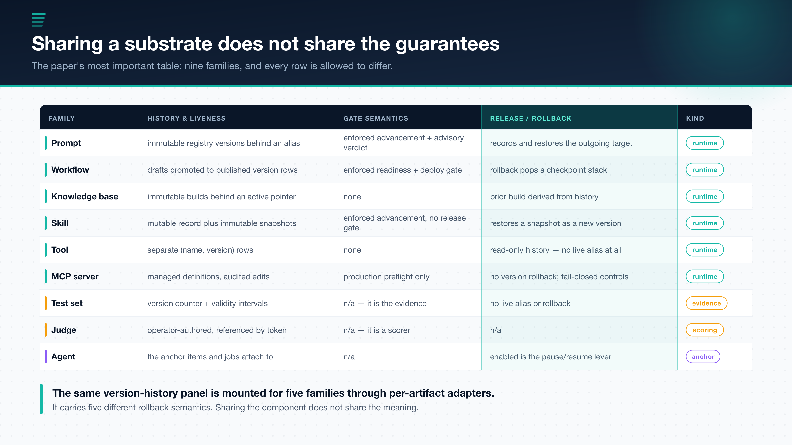
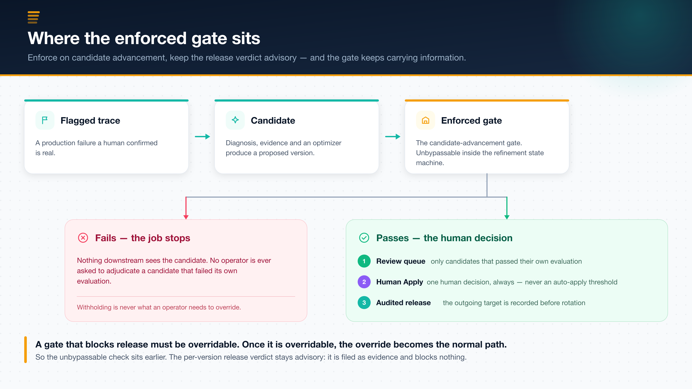
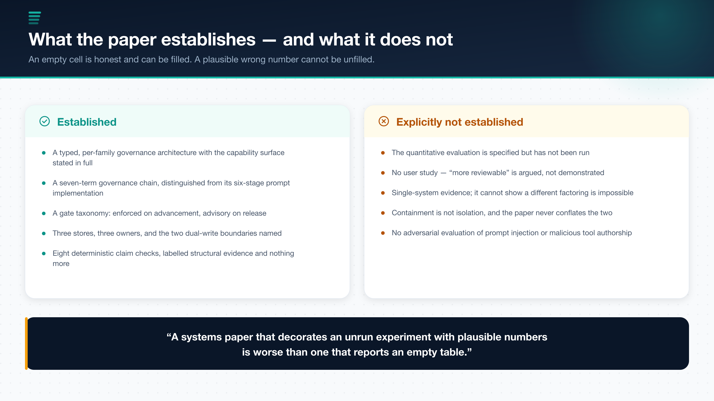

# You Can See Your Agent Fail. Can You Ship the Fix?
How we built a control plane for everything an AI agent depends on

**Executive summary:** Production LLM-agent systems are thoroughly observable and barely governable. Tracing tells an operator that a prompt regressed; nothing in the toolchain says what to change, whether the change is better, who approved it, or how to undo it. Prompt registries closed part of that gap — for prompts. In our paper, *CALIBER: A Layered Control Plane for AI Agent Governance, Workflow Orchestration, and Progressive Autonomy*, we close it across nine resource families at once, around a single abstraction called the **governed asset**. The most interesting result is not that layering makes governance uniform. It is that it does not, and why saying so precisely is worth more than papering over it.

---

## Why this matters

Consider a support agent in production. A customer asks about a refund window; the agent answers confidently and incorrectly, citing a policy that changed last quarter. A reviewer flags the response.

Everything up to that moment is well tooled. The call produced a trace. The trace carries the retrieved chunks and the rendered prompt. The reviewer's judgement is recorded as an assessment attached to that trace. A competent team will find the bug and will be able to point at the span where it happened.

Now enumerate what the team has to do next, and what tooling actually exists for each step. Decide the failure is real — a queue, if someone built one. Assemble evidence beyond this one case so the fix is not overfitted — nothing standard, so teams hand-build spreadsheets. Release the fix so running agents pick it up — a code deployment, because the prompt is a string in a source file. Record what changed and on what evidence — a commit message, if anyone writes one. Undo it to the exact prior state — `git revert` plus another deployment, which reverts the prompt but not the retrieval corpus, the tool version, or the judge that scored it.

That is not a gap in model quality or in observability. It is a gap in **release engineering for non-code artifacts**, and it is structurally the same gap that continuous delivery closed for code and that MLflow and TFX closed, partially, for models.

> Which parts of an agent's dependency surface have a release discipline, and which parts are still a string in a file?

## The idea in plain English

Version control gives you history. It does not give you a pointer a running agent can resolve without a redeployment, it cannot attach evidence to a version, and it cannot record that an operator acting under a declared scope authorized the change. Most decisively, it binds the prompt's release to the application's release — so the fastest possible remediation is gated on a pipeline built for code.

CALIBER's answer is the **governed asset**: a typed record carrying a schema-validated definition, immutable version history, an authority model, an audit trail, and — where its family supports one — a *live target* that client code resolves at call time. An agent loads `@prod`; the platform decides what `@prod` points to. Remediation stops being a deployment and becomes a pointer move.

*Figure 1. The difference is late binding plus bound evidence plus recorded authority — not merely versioning.*

Around that abstraction the system arranges six layers, six lifecycle modes — Author, Test, Evaluate, Calibrate, Release, Observe — and a **governance chain** with seven terms.

*Figure 2. Seven concepts, not seven stages. The lower band is the part that separates this from an observability pipeline.*

The lower band of that figure is the whole point. Each term deposits durable state: a verification item, an assembled corpus with its evidence, a candidate artifact and its diagnosis, scores with an enforced gate decision, an explicit apply action with a provenance anchor, a rollback checkpoint with an audit row, and new traces. Six weeks later, *"why is the prompt like this, and what did we know when we changed it"* is answerable from records rather than from recollection. That property — not any individual mechanism — is what the system exists to provide.

## What makes the approach different

| Prompt-lifecycle platform | Layered control plane |
|---|---|
| One artifact type is a registry citizen | Nine families under one mode vocabulary |
| Evaluation annotates the version | Evidence is bound to the candidate and carried into review |
| Promotion is a pointer move | A failing gate stops the candidate before a human ever sees it |
| Rollback re-points to a prior version | Rollback restores the target the release *recorded* |
| Optimizers run out of band | Optimizers are wired *to* the gate |

I want to be careful here, because the honest version of this table is narrower than the marketing version. MLflow's Prompt Registry, LangSmith, and Langfuse all ship immutable versions, a named pointer the client resolves at call time, rollback by re-pointing, and role restrictions on who may move the pointer. CALIBER is **not novel in any of those four**, and the paper says so in a table with a dated access column. The delta that survives scrutiny is scope — the other eight families — plus the score acting as a precondition rather than an annotation.

## The claim I would most want carried forward

It would be easy to claim that a layered architecture makes governance uniform across artifact types. That claim is false, and the interesting content of the paper is why.

> Adjacency in a layered architecture confers capability **availability**, not capability **inheritance**. A family placed in the asset layer obtains lifecycle behaviour only by explicitly wiring it.

*Figure 3. Four facets hold for every family. The other eight are available to all and guaranteed by none.*

Consider what a uniform cross-artifact release contract would have to mean. For a **prompt**, a live target is a registry alias and release means rotating it. For a **test set**, there is no live target at all — a test set *is* evidence, and forcing it to have a release path produces a field nothing reads. For a **judge**, the artifact is a scorer; what it has is not a release path but a measured agreement rate with human labels. Any single contract all three satisfy is vacuous. Any contract strong enough to be worth enforcing on prompts would exclude test sets and judges from the platform.

So the guarantee surface is stated per family, in full, including the rows where it is weaker than a reader would assume.

*Figure 4. Nine families. Six are authored runtime assets, two are evidence and scoring assets, one is an anchor record. They are not even the same kind of thing.*

The residual risk is named rather than hidden. The shared version-history component is mounted for five families through per-artifact adapters — and **sharing the component does not share the semantics**. An operator who sees the same panel in five places may reasonably infer five equivalent rollback guarantees, and will instead find an alias restore, a checkpoint-stack pop, a derivation from activation history, a restore-as-a-new-version, and, for tools, no rollback at all. The paper calls this the most likely source of operator misunderstanding in the system.

The mitigation is that the *mechanism*, not merely a `rollbackable` boolean, is what the capability registry carries and what the platform's capabilities endpoint publishes — so a client is able to render the five as five. That is a mitigation rather than a fix, and the paper says so: nothing compels a client to read the field, and nothing yet checks that the declared mechanism is the one the handler actually performs.

## The design decision I expect to be argued with

There are two mechanisms a reader will be tempted to call "the gate," and conflating them would invalidate several claims.

*Figure 5. The enforced check sits on candidate advancement. The per-version release verdict is advisory by construction.*

The counterintuitive part is the placement. A gate that blocks *release* must be overridable, because verdicts go stale, corpora drift, and an urgent fix has to be shippable at 3am. Once a gate is overridable, the override becomes the normal path, and the gate stops carrying information. So the unbypassable check sits earlier, where its only power is to withhold a candidate that failed its own evaluation — and withholding a bad candidate is never the thing an operator needs to override.

The companion decision is that a human sits at Apply, always. The machinery to close the loop already exists; we consider using it a mistake at the current state of the art. A score improvement on an assembled corpus is evidence about that corpus, and the corpus is a sample assembled from *prior* failures — while the failure modes that matter most in agent systems, like tool misuse, over-confident assertion, and injection reached through retrieved content, are the ones such a corpus is least likely to represent. Judges are correlated with each other and with the model under evaluation, so a multi-dimensional pass is less independent evidence than its dimensionality suggests.

And most decisively for a control plane: an auto-apply threshold converts a visible, attributable change into an invisible one. The value here is that a change is reviewable. A change nobody reviewed is one nobody can be asked about. The price is real and we do not minimize it — refinement throughput is bounded by operator attention.

## What the paper does not claim

A good article should be as clear about limits as it is about wins, and this paper is unusually blunt about its own.

*Figure 6. The results table is empty by choice rather than by omission.*

The quantitative evaluation is **specified but not executed**. The protocol names the questions, the four baselines, a seven-cell fault-injection matrix, and the analysis in enough detail for someone else to run it — including one cell the paper predicts the system will fail. What it does not contain is measurements. Every unpopulated cell is marked rather than estimated.

I think that call is worth defending in public. Numbers that were projected, carried over from an earlier configuration, or produced under conditions the paper does not state are *worse* than absent numbers, because they are indistinguishable from measured ones to a reader and they propagate into citations. An empty cell is honest and can be filled. A plausible wrong number cannot be unfilled.

The other boundaries are stated the same way. There is no user study, so the claim that governed releases are more *reviewable* is argued rather than demonstrated. The evidence comes from one implementation, which cannot show that a different factoring is impossible. Local tool and MCP execution is **containment, not isolation** — a distinction the paper treats as load-bearing rather than stylistic, because overclaiming about a security boundary is more harmful than overclaiming about latency. Two dual-write boundaries cannot be made atomic, and naming them is precisely what allows a checkable audit guarantee to be stated at all.

## Why this matters for organizations

For teams building agent platforms, the lesson is architectural rather than procedural. Your agent does not depend on a prompt. It depends on a prompt, a set of workflows, a set of tool definitions, some MCP server configurations, a retrieval corpus, the skills you wrote, the test sets you score against, and the judges that do the scoring. Governing one of those well and the rest by convention means your remediation story is only as good as your least-governed dependency.

That suggests a cleaner division of labour:

- the registry owns identity, history, authority, and audit — uniformly
- each family declares what release, rollback, and evidence *mean* for it
- one enforced gate withholds candidates that failed their own evaluation
- one human decides, and the record says who

And it suggests a discipline: when you cannot make a guarantee uniform, write down where it stops instead of implying it does not.

## My takeaway

The most useful thing I learned building this is that the hard part of a control plane is not adding capability. It is resisting the inference that capability is inherited. A layered diagram invites every reader to assume the layer below applies to the layer above. It does not, and a system that lets you believe otherwise is more dangerous than one with fewer features.

The same instinct explains the empty results table. A control plane earns trust by being checkable, and you cannot be checkable about your architecture while being decorative about your evidence.

> What separates a control plane from a dashboard with opinions is being precise about where the guarantees stop.

## Source

This article is based on the paper *CALIBER: A Layered Control Plane for AI Agent Governance, Workflow Orchestration, and Progressive Autonomy* by Reza Rahimi. The paper presents the governed-asset abstraction, the six-layer architecture, the seven-term governance chain, the per-family guarantee matrix, ten design decisions with their costs, and a measurement protocol offered as an artifact rather than as a result.
