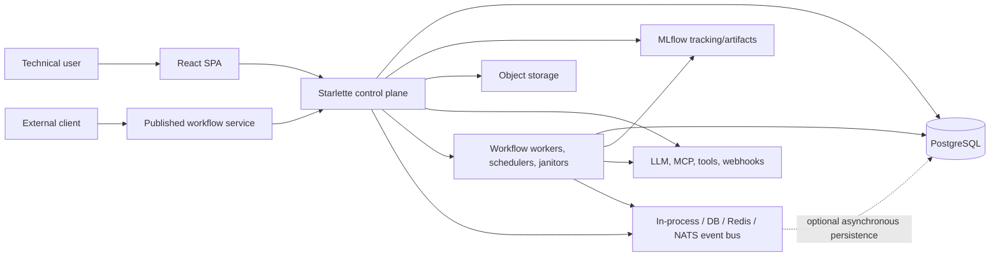

# CALIBER Product Implementation Status and Roadmap

> **Definitive status date:** 2026-08-01
>
> **Audited revision:** `f69d945a00e022a402e7c8a22e31e5cc2391c75b`
>
> **Product version:** `0.1.0.dev0`, Development Status :: 3 - Alpha
>
> **Decision:** suitable only for a controlled, trusted technical pilot; **not ready for any supported production deployment, untrusted authoring, or multi-tenant enterprise use**
>
> **Document policy:** this current snapshot supersedes every earlier revision of this report. Git history preserves the old chronology.

## 1. Executive verdict

CALIBER is a real and unusually broad AI application lifecycle product, not a mock-up. The repository contains a working React application, a large Starlette control plane, typed workflow compilation and execution, approval and release controls, prompt/skill/tool/model/test-set libraries, knowledge and memory systems, evaluations, traces, metrics, published workflow services, and extensive automated tests.

Its strongest product shape is:

> **A self-hosted, MLflow-native, governed optimization and release control plane for AI applications.**

Its current maturity is **feature-rich Alpha**. The product is credible for expert users operating in a trusted environment, but production readiness is blocked by execution containment, timeout/cancellation behavior, incomplete effect idempotency, authorization and workspace correctness, distributed event guarantees, in-process deployment topology, incomplete release evidence, and the lack of a stable management API/SDK/CLI.

The correct near-term objective is not to add more surface area. It is to make the existing lifecycle safe, repeatable, operable, and uniformly enforceable.

### 1.1 What is genuinely strong

- A substantial technical low-code workflow studio with 29 schema-derived node types, typed ports, canvas/code/plan modes, undo/redo, copy/paste, autosave, validation, preview, publishing, approvals, run history, traces, checkpoints, artifacts, and recovery debugging.
- Durable run records, database claiming and leases, worker heartbeats, approval waits, checkpoints, accepted-event recovery, and a persisted effect ledger for selected external effects.
- A broad asset lifecycle spanning prompts, skills, tools, models, datasets, evaluations, knowledge bases, memory, releases, audit records, and published services.
- Strong workflow deployment controls: strict manifests and hashes, validation, approval policy, distinct-approver and separation-of-duty options, service tokens, quotas, idempotency, OpenAPI, and invocation snippets.
- Rich knowledge functionality: versioned ingestion, chunking, embeddings, pgvector search, lexical/vector fusion, optional Apache AGE graph data, reranking, calibration, and inspection.
- Useful security foundations: session and trusted-header modes, scoped roles, versioned AES-256-GCM secrets, audit events, PII controls, signed webhooks, database-enforced read-only relational tools, and workflow HTTP egress controls.
- Meaningful local engineering evidence: 294 backend test files, 112 frontend test files, 8 Playwright specifications, 81 database migrations, and backend statement coverage above 93% in this audit.

### 1.2 What prevents a production claim

1. Published workflows can still read or write caller-selected host paths through file/folder nodes.
2. Several timeout paths detect elapsed time only after work returns; cancellation cannot reliably stop underlying provider or thread work.
3. Crash/retry protection is not uniform across every effectful node or tool.
4. Authentication exists, but tenant membership, enterprise identity, resource-level authorization, and shared rate limiting are incomplete.
5. Workspace switching can display stale data or execute a later action under a different project context.
6. Concurrent event writers can race on sequence allocation; live-event delivery and alert evaluation are best-effort.
7. API, workers, schedulers, and janitors normally share each ASGI process and use significant synchronous work.
8. The supported Python 3.12 full suite is currently red under parallel execution because event-backend fixture state leaks between tests.
9. Browser E2E and a live Compose boot are not release gates in CI.
10. Deployment material is explicitly development-oriented; no supported HA topology, backup/restore drill, upgrade path, or production IaC is shipped.
11. There is no stable control-plane OpenAPI, remote management SDK, or product CLI.

## 2. Audit method and evidence boundary

This report was rebuilt from current code, tests, configuration, documentation, git state, and point-in-time official competitor documentation. Existing report prose was treated as a lead, never as proof.

### 2.1 Status vocabulary

| Status          | Meaning                                                                                        |
| --------------- | ---------------------------------------------------------------------------------------------- |
| **Implemented** | A substantive path exists in current source and is covered by code and/or tests.               |
| **Strong**      | Implemented with unusually broad behavior; listed limitations still apply.                     |
| **Partial**     | Usable behavior exists, but a material safety, scale, UX, or lifecycle boundary is incomplete. |
| **Missing**     | No supported product implementation was found.                                                 |
| **Unverified**  | Source exists, but this audit did not produce current runtime evidence for the claim.          |

“Implemented” does not mean production-grade. A feature can be implemented while its security, reliability, scale, or usability boundary remains partial.

### 2.2 Repository state

At the audit baseline:

- `main` was at `f69d945a0`, four commits ahead of the local `origin/main` tracking ref `ec7646939`. The remote was not refreshed, so this is not a claim about current hosted state.
- Six pre-existing user modifications were preserved and excluded from audit edits:
  - `caliber/caliber-ui/public/docs/presentation.html`
  - `caliber/caliber-ui/public/docs/presentation_timed.html`
  - `docs-site/presentation.html`
  - `docs-site/presentation_timed.html`
  - `overview-video/generate_video.py`
  - `overview-video/narration_script.md`
- Supported Python is 3.10-3.12. Results from unsupported Python versions are not release evidence.

### 2.3 Current validation ledger

| Validation                                                              | Current result                                                                          | Interpretation                                                                                                                                                 |
| ----------------------------------------------------------------------- | --------------------------------------------------------------------------------------- | -------------------------------------------------------------------------------------------------------------------------------------------------------------- |
| Python 3.12 full backend suite, `pytest -n auto --dist loadgroup`       | **Red:** 5,793 passed, 9 skipped, 3 failed, 15 errors; 5,820 collected; 93.46% coverage | The release gate is open. Fifteen errors reproduce aggregate fixture leakage into a database event backend whose fixture database lacks `caliber_live_events`. |
| CSRF + rate-limit files, sequential, no coverage                        | **45 passed**                                                                           | The affected tests work alone; the full-suite failure is an isolation/order defect rather than 15 independent feature failures.                                |
| Three failed full-suite nodes, isolated                                 | Rate-limit node passed; two socket nodes were denied by the managed sandbox             | Separates a transient aggregate failure from an environment restriction.                                                                                       |
| Two exact socket tests outside the restricted sandbox                   | **2 passed**                                                                            | Loopback implementation works when local sockets are permitted.                                                                                                |
| Component catalog focused suite                                         | **33 passed**                                                                           | Current 29-node catalog and designer-copy changes are covered.                                                                                                 |
| Frontend unit suite, `npm test -- --run`                                | **Green:** 112 files and 1,546 tests passed in 151.85 seconds                           | Current unit/component evidence is strong; the run emitted known test-environment warnings but no failures.                                                    |
| Playwright browser suite                                                | **Not run in this audit**                                                               | Existing specs are inventory, not current browser evidence.                                                                                                    |
| Live Compose, multi-replica, provider, hardened sandbox, backup/restore | **Not run in this audit**                                                               | No production-readiness claim is supported for these paths.                                                                                                    |

The full backend run is the controlling result: focused green tests explain the failure, but do not turn the aggregate suite green.

## 3. Product and architecture snapshot

### 3.1 Intended users

CALIBER currently fits:

- AI application and platform engineers who need governed authoring, evaluation, publishing, and rollback.
- Technical workflow builders comfortable with schemas, APIs, credentials, provider configuration, and occasional Python.
- Model-risk, safety, or quality operators who review evidence and approve releases.
- Self-hosting teams willing to own PostgreSQL, MLflow, secrets, workers, providers, and operational hardening.

It does not yet fit:

- Non-technical business users expecting a pure no-code builder.
- Untrusted third-party workflow authors.
- Enterprises requiring turnkey OIDC/SAML, SCIM, organizational tenancy, service accounts, HA, DR, and audited production deployment.
- Developers expecting a stable, generated control-plane SDK and CLI.

### 3.2 Runtime architecture

The logical domains are broad and mostly well named, but the default process boundary is weak: API requests and multiple background loops coexist in each server process. Synchronous SQLAlchemy, MLflow, model, and network calls also appear inside async request paths. Event publication is direct; database persistence is asynchronous and may drop under queue pressure, so the dotted edge is not a durability guarantee.

### 3.3 Scale and concentration

The codebase is organized into meaningful domain packages, but several files have become change-risk centers:

| Area                   |  Approximate size |
| ---------------------- | ----------------: |
| `workflows/runtime.py` |       7,409 lines |
| `knowledge/service.py` |       5,412 lines |
| `assistant/service.py` | about 5,600 lines |
| `KnowledgeBases.tsx`   |       9,006 lines |
| `Prompts.tsx`          |       7,722 lines |
| `Inspector.tsx`        |       6,400 lines |
| `WorkflowEditor.tsx`   |       5,239 lines |
| `WorkflowDetail.tsx`   |       4,788 lines |
| `caliberApi.ts`        |       4,473 lines |

This does not invalidate the implementation, but it makes correctness changes, shared state, code review, testing, and ownership harder than necessary.

## 4. Implementation status by subsystem

| Subsystem                | Status                          | Current implementation                                                                                                  | Remaining boundary                                                                                                                                        |
| ------------------------ | ------------------------------- | ----------------------------------------------------------------------------------------------------------------------- | --------------------------------------------------------------------------------------------------------------------------------------------------------- |
| Repository architecture  | **Partial**                     | Cohesive backend/UI/docs/deploy/test structure; clear domain packages; generated docs flow                              | Large modules, mixed responsibilities, root GitHub metadata misplacement, no formal extension boundary                                                    |
| Backend control plane    | **Strong / Partial**            | Roughly 276 direct Starlette routes across 42 route files; rich CRUD, lifecycle, admin, and runtime APIs                | No stable public control-plane schema; blocking work in async paths; resource authorization uneven                                                        |
| Frontend application     | **Strong / Partial**            | About 29 routes; broad libraries, builder, evaluation, observability, release, admin, and settings surfaces             | Workspace reactivity, role-aware navigation, error states, first-run UX, component concentration                                                          |
| Aria assistant           | **Partial**                     | Durable plans, interactions, approvals, queued work, typed plan inputs, draft validation/testing/publishing             | Executable plans expose only seven narrow built-ins; queue loss, silent mutations, generic context, and no route/resource awareness                       |
| Workflow authoring       | **Strong**                      | Server catalog, 29 node types, typed ports, canvas/code/plan, validation, autosave, history, approvals, debugger        | Raw expert concepts, browser-local layout, fixed templates, silent fallback catalog                                                                       |
| Workflow runtime         | **Partial**                     | Manifests/hashes, compiler, runs, leases, checkpoints, waits, retries, approvals, effect ledger, service publishing     | Host-path access, post-hoc timeouts, incomplete effect coverage, replay semantics, sequence race                                                          |
| Low-code experience      | **Implemented / Partial**       | Strong technical builder, guided inspectors, prompt starters/techniques, templates, wizards, snippets                   | Python callables, JSON Schema, headers, cron, cURL, inline Python, and provider knowledge remain common                                                   |
| Pure no-code experience  | **Partial / narrow**            | Guided flows, safe presets, prompt starters, and Aria business-language assistance exist                                | Aria does not cover sophisticated workflows end-to-end; organization templates, guided production setup, and infrastructure abstraction remain incomplete |
| Prompts and optimization | **Strong / Partial**            | Versioning, composition, starter/technique library, experiments, gates, releases, playground and evaluation surfaces    | Some gate behavior remains advisory; lifecycle policies are not uniform across all asset types                                                            |
| Skills and tools         | **Implemented / Partial**       | Versioned registries, validation, wizards, execution and MCP paths                                                      | Isolation, OAuth, extension compatibility, promotion and effect semantics need hardening                                                                  |
| Models/providers         | **Implemented / Partial**       | Provider configuration, model aliases/catalog behavior, health/readiness surfaces                                       | Enterprise credential lifecycle, role-aware configuration, provider matrix evidence                                                                       |
| Configuration console    | **Partial**                     | Admin-safe runtime inventory, runtime provider overrides, write-only credentials, and existing readiness/service probes | UI exposes only part of the inventory; local/server preferences are mixed; protected-query failures can look like empty state                             |
| Integrations             | **Partial**                     | MCP, generic HTTP/API nodes, webhooks, external apps, object stores, event backends, quick-connect presets              | No mature connector SDK, OAuth lifecycle, marketplace, broad app catalog, or full integration matrix                                                      |
| Authentication           | **Partial**                     | Session and trusted-header modes; viewer/operator/approver/admin scopes                                                 | No OIDC/SAML/SCIM/MFA; trusted-header fail-open configuration; config-list roles                                                                          |
| Authorization/tenancy    | **Partial**                     | Owner/project visibility and endpoint scope checks                                                                      | No organization/team membership model; memory/trace scoping gaps; admin workspace ambiguity; no tenant isolation proof                                    |
| Secrets                  | **Implemented / Partial**       | AES-256-GCM, versions, rotation, revocation                                                                             | Production key-management/HSM integration and complete credential lifecycle are not proven                                                                |
| Memory                   | **Implemented / Partial**       | Optional mem0 integration, pgvector support, session/agent/user/run scopes                                              | Caller-supplied read scopes need authenticated binding; retention, deletion, export, residency controls incomplete                                        |
| Knowledge/RAG            | **Strong / Partial**            | Versioned ingestion, embeddings, vector/lexical/graph retrieval, rerank, calibration, exploration                       | “Hybrid” lexical search is constrained by ANN candidate pool; Python-side graph loading; scale evidence absent                                            |
| Evaluation/calibration   | **Strong / Partial**            | Datasets, scorecards, comparisons, gates, knowledge calibration, workflow evaluation                                    | Ad-hoc evaluation is synchronous and capped; continuous production slices and paired uncertainty/cost gates are incomplete                                |
| Observability/audit      | **Implemented / Partial**       | Traces, metrics, dashboards, system status, audit, releases, incidents, live events                                     | Trace resource filtering, durable events, active alert evaluation, end-to-end SLO evidence                                                                |
| Published services       | **Strong / Partial**            | Tokens, schema validation, auth, idempotency, quotas, OpenAPI, cURL/Python/JS snippets                                  | Runtime isolation, multi-replica correctness, SDK, gateway topology, load/SLO evidence                                                                    |
| Management API/SDK/CLI   | **Missing**                     | Internal AJAX APIs and per-service OpenAPI exist; package exposes the MLflow app                                        | No supported lifecycle OpenAPI, generated clients, remote SDK, or product CLI                                                                             |
| Testing                  | **Strong inventory / Red gate** | Large backend/frontend suites, Playwright specs, integration markers, local scripts                                     | Parallel backend isolation defect; browser/live-stack CI absent; provider/HA/security matrix incomplete                                                   |
| Deployment               | **Development only**            | Container hardening details and loopback-oriented Compose are useful for development                                    | No supported production topology, TLS/ingress pattern, split workers, Helm/Kubernetes/IaC, HA, DR, or upgrade proof                                       |
| Documentation/examples   | **Partial**                     | Generated docs site, architecture/reference material, 16 cookbook directories, service snippets                         | Stale capability claims, cookbook inventory/contract drift, few executable application examples                                                           |

## 5. Detailed product assessment

### 5.1 Workflow and agent development

The workflow studio is CALIBER’s most complete product surface. It is already more than a diagram editor: the backend owns a validated component catalog, the UI supports multiple authoring representations, and run debugging connects authoring to runtime evidence.

Important verified behaviors include:

- 29 backend-defined node types and 13 fixed workflow templates.
- Typed input/output ports and mapped edges.
- Canvas, code, and plan views.
- Undo/redo, copy/paste, quick-add/connect, autosave, validation, and problem navigation.
- Preview, publish, run, cancel, retry, approve, and resume actions.
- History, trace inspection, memory, artifacts, screenshots/video where applicable, checkpoints, and recovery state.
- Published service tokens, request schemas, quotas, idempotency controls, OpenAPI, and client snippets.

The experience remains technical low-code. Many valid workflows require users to understand JSON Schema, API headers, secrets, cron, Python callables, inline Python, provider behavior, runtime mappings, and deployment concepts. The missing layer is not another canvas; it is a governed abstraction layer made of reusable organization templates, schema-driven forms, safe presets, guided provider/credential setup, and explicit progressive disclosure.

Prompt authoring is more guided than this workflow limitation alone suggests: the product includes a starter/technique library and a structured Prompt Builder (`template_library.json`; `prompt_template_library.py:713-719`; `PromptBuilder.tsx:202-277,357-390`). That useful pattern should be generalized to other asset and workflow types.

### 5.2 Assistant experience

Aria has real durable plan and approval behavior, and documentation that says typed plan inputs are missing is stale. Its executable-plan registry is much narrower than its drafting UI: it currently exposes seven built-ins covering judge list/create, review-queue list/create/add, dataset creation, and workflow calibration (`assistant/capabilities.py:323-424`). However:

- A queued message is removed before delivery succeeds, so network/server failure can lose work.
- Several mutations clear input or fail without a persistent rendered error.
- Requests always identify the generic assistant drawer rather than the current workflow, run, node, prompt, skill, tool, or knowledge resource.
- Supported context references and selected resources are not populated by the production UI.
- The existing `ArtifactTypeSelector` is not wired into the production panel, whose `artifactType` remains null (`CaliberAssistantPanel.tsx:253`).

The assistant should become a transactionally reliable, inspectable copilot for the surface the user is already operating—not a generic chat layer.

### 5.3 Testing and debugging journey

Local debugging depth is a strength. Users can inspect validation problems, runs, events, traces, checkpoints, artifacts, memory, approvals, recovery, and service behavior. Evaluation and calibration surfaces are broad.

The main gap is evidence continuity:

- Development tests and focused suites are extensive.
- The current full backend suite is red in supported Python 3.12 under its canonical parallel mode.
- CI does not boot the complete runtime and does not run Playwright.
- Provider, event-backend, multi-replica, worker-termination, sandbox, migration, backup, and upgrade matrices are not current release gates.

### 5.4 Deployment and operations journey

The current Compose deployment is useful for local evaluation and explicitly not a production reference. Container hardening settings exist, but a deployer still has to invent:

- TLS and ingress termination.
- Secure cookie and CSRF requirements.
- Enterprise identity and group mapping.
- Separate API, worker, scheduler, and janitor roles.
- Durable broker/event topology and backpressure.
- Secrets/KMS integration.
- Database/object-store backup and restore.
- Migration, upgrade, rollback, and disaster recovery procedures.
- Resource sizing, autoscaling, SLOs, alerting, and multi-replica tests.

A local bootstrap credential is acceptable only for loopback evaluation, must be visibly rotated, and must never be exposed to a network. The product lacks a role-aware first-run path that makes this boundary obvious.

### 5.5 Configuration journey

The backend has an admin-only safe runtime inventory (`settings.py:1295-1311`), runtime provider overrides, write-only credential handling, and readiness/banner/service probes. The UI does not yet present these as one coherent operating model:

- Settings consumes only a subset of the safe inventory and is concentrated on the versioning group (`Settings.tsx:194-237`).
- Runtime-only provider overrides and write-only credentials need clear source, mutability, persistence, and restart labels.
- Protected-query failures can be swallowed into misleading empty or “not configured” states.
- Browser-local default skill mode is mixed with server-stored model/reasoning settings (`Settings.tsx:436-489`).
- Existing readiness results are fragmented rather than persistent, actionable first-run diagnostics; simulation/fallback provenance must remain visible.

### 5.6 Maintenance journey

The repository has strong test breadth and recognizable domains. Maintenance risk comes from:

- Very large backend services and frontend pages.
- Manual API typing in a 4,000+ line frontend client.
- Coexistence of legacy `useApi` and TanStack Query.
- Duplicated frontend workflow templates despite a backend source of truth.
- Browser-local workflow layout outside version history.
- Documentation claims that are not mechanically checked against code/catalogs.
- GitHub community and Dependabot metadata nested under `caliber/.github` rather than the repository root.

## 6. Persona review

| Persona / task             | What works                                                          | Friction and unmet need                                                                                                                            |
| -------------------------- | ------------------------------------------------------------------- | -------------------------------------------------------------------------------------------------------------------------------------------------- |
| First-time evaluator       | Local Compose, broad UI, example docs, empty states                 | No global setup checklist; infrastructure concepts arrive early; password rotation and production boundary are not prominently guided              |
| AI app developer           | Published services, OpenAPI and invocation snippets                 | No lifecycle SDK/CLI, generated control-plane clients, webhook helpers, or clean sample app                                                        |
| Workflow builder           | Excellent technical studio and debugger                             | Raw schemas/code/runtime details; fixed templates; shared layout and governed reusable subflows missing                                            |
| Agent developer            | Agent nodes, tools, MCP, memory, knowledge and approvals            | Provider/tool isolation and durable effect semantics are uneven; no portable framework import/export                                               |
| Quality/safety operator    | Datasets, evaluation, scorecards, comparisons, approvals, audit     | Asset gates are heterogeneous; continuous production-slice evaluation and statistical release policy need strengthening                            |
| Platform engineer          | Health/config endpoints, containers, Compose, event backend choices | No production reference topology, split roles, HA/load evidence, backup/restore, upgrades, or release artifacts                                    |
| Enterprise administrator   | Roles, projects, audit, releases, review queues                     | No organizational membership/IdP/SCIM/service accounts; nav is not role-aware; admin workspace meaning is ambiguous                                |
| Enterprise buyer/assurance | Broad governance, audit, release, and self-hosting intent           | No support/SLA boundary, deployment certification, residency/retention/legal-hold proof, capacity/cost envelope, upgrade guarantee, or DR evidence |
| Maintainer                 | Broad source/test coverage and generated docs tooling               | Large files, duplicate contracts, dual fetch state, stale docs, manual API types, E2E absent from CI                                               |

## 7. Low-code and no-code verdict

### 7.1 Verdict

- **Technical low-code:** yes, credible and broad.
- **General-purpose no-code:** no.
- **Production no-code for governed enterprises:** not yet.

### 7.2 What would make it meaningfully more accessible

1. Generate forms and safe presets from backend schemas instead of exposing raw JSON first.
2. Provide role-specific first-run journeys for evaluator, builder, operator, and administrator.
3. Consolidate existing provider, credential, banner, and service checks into persistent, actionable first-run diagnostics with explicit non-secret errors and visible simulation/fallback provenance.
4. Make reusable organization templates, subflows, and versioned shared layouts first-class.
5. Offer business-language recipes that expand into inspectable technical manifests.
6. Hide unavailable administration and configuration actions by role while explaining why.
7. Make workspace identity visible, atomic, and part of every cache key and request.
8. Add route-aware assistant context with user-visible inclusion/removal and redaction.
9. Turn cookbook recipes into importable, executable, verified starter projects.
10. Preserve progressive disclosure: simple paths by default, complete technical controls on demand.

The goal should not be to conceal safety-critical details. It should be to supply correct defaults, guided decisions, and clear escalation into expert controls.

## 8. Material technical findings

| ID   | Severity     | Finding                                                                                                                                                                                                                          | Evidence anchors                                                                                                                                                                                         | Product consequence                                                                                                                 |
| ---- | ------------ | -------------------------------------------------------------------------------------------------------------------------------------------------------------------------------------------------------------------------------- | -------------------------------------------------------------------------------------------------------------------------------------------------------------------------------------------------------- | ----------------------------------------------------------------------------------------------------------------------------------- |
| F-01 | **Critical** | File/folder nodes can expand, open, glob, create, and write caller-selected host paths; promotion does not forbid legacy paths                                                                                                   | `workflows/manifest.py:328-438`; `workflows/runtime.py:4996-5135,6811-6899,7053-7085`; `workflows/promoter.py:1980-2070`                                                                                 | Untrusted published workflows can cross the intended data boundary                                                                  |
| F-02 | **Critical** | Generic node timeout is checked after execution; thread-pool shutdown and provider calls can continue waiting; wrapper cancellation does not kill underlying work                                                                | `workflows/runtime.py:2321-2364,6659-6710`; `assistant/service.py:4911-4919`; `assistant/openai_engine.py:69-138`; `assistant/anthropic_engine.py:61-131`; `orchestrator/workflow_run_worker.py:450-504` | Hung dependencies consume workers and make cancellation/SLO claims unreliable                                                       |
| F-03 | **Critical** | Retries are not uniformly restricted to idempotent work; persisted effect protection covers only selected webhook/API paths                                                                                                      | `workflows/manifest.py:198-205`; `workflows/runtime.py:4173-4215,5843,5909,6674-6708`                                                                                                                    | Tools, MCP, external apps, writes, and builds can repeat after crash/recovery                                                       |
| F-04 | **High**     | Memory reads accept supplied scopes after generic auth; trace list/detail lack consistent project/owner filters                                                                                                                  | `routes/memory.py:89-110`; `routes/observability.py:227-328`                                                                                                                                             | Authenticated users may cross intended resource-visibility boundaries                                                               |
| F-05 | **High**     | Workspace change invalidates TanStack caches, but legacy hooks do not observe the event and many keys omit project identity                                                                                                      | `WorkspaceSelector.tsx:41-47`; `hooks/useApi.ts:23-40,56-98`; `pages/Prompts.tsx:306-310`                                                                                                                | Stale rows can remain visible and later actions can use a different project header                                                  |
| F-06 | **High**     | Admins can bypass normal project visibility while the UI describes the selector as a resource scope                                                                                                                              | `db/scoping.py:95-113`                                                                                                                                                                                   | The same selector has different semantics by role without saying so                                                                 |
| F-07 | **High**     | Rate limiting uses caller-influenced header identity and process-local state                                                                                                                                                     | `rate_limit.py:25-31,255-320`                                                                                                                                                                            | Limits are bypassable/inconsistent across replicas                                                                                  |
| F-08 | **High**     | CSRF enablement without a secret silently disables protection; trusted-header mode can operate without proxy-secret binding                                                                                                      | `config.py:1411-1428`; `csrf.py:288-326`; `auth.py:186-203`                                                                                                                                              | Unsafe production configuration can start instead of failing closed                                                                 |
| F-09 | **High**     | Three run-event writers independently allocate `max(sequence)+1` without locking                                                                                                                                                 | `workflows/run_launch.py:52-78`; `routes/workflow_runs.py:208-236`; `orchestrator/workflow_run_worker.py:537-565`                                                                                        | Concurrent events can conflict or be lost                                                                                           |
| F-10 | **High**     | Event subscriber/persistence queues can drop; Redis/NATS use ephemeral pub/sub; accepted-webhook recovery starts only after subscriber acceptance; SLO incidents reconcile when an alert endpoint is polled                      | `events/bus.py:53-110`; `events/database_bus.py:103-145`; `events/nats_bus.py:23-58,138-146`; `events/redis_bus.py:19-59,153-161`; `events/webhooks.py:599-635`; `routes/system_services.py:316-373`     | Upstream drops cannot be recovered, so live updates, webhooks, audit-adjacent automation, and alerts are not a durable control path |
| F-11 | **High**     | API and all background loops share server processes; synchronous work is common in async routes                                                                                                                                  | `server.py:147-217,427-662`; `db/session.py:1-12`                                                                                                                                                        | Scaling, isolation, backpressure, and graceful shutdown are weak                                                                    |
| F-12 | **High**     | “Hybrid” lexical ranking operates over vector ANN candidates; graph retrieval loads broad structures into Python                                                                                                                 | `knowledge/service.py:1619-1694,1802-1888`                                                                                                                                                               | Exact lexical-only recall and large-graph scalability are constrained                                                               |
| F-13 | **High**     | Local MCP and registered-tool subprocesses retain ambient host filesystem/network authority by default; MCP OAuth is absent; remote host policy lacks workflow-egress-equivalent IP pinning                                      | `mcp_policy.py:159-165,187-224,294-339`; `tool_sandbox/service.py:81-107`; `workflows/runtime.py:2418-2453,2577-2640`                                                                                    | Tool execution is not suitable for untrusted authors without hardened external isolation                                            |
| F-14 | **High**     | Assistant queued work is removed before send success and requests omit supported page/resource context                                                                                                                           | `CaliberAssistantPanel.tsx:481-488,543-570`; `assistantTypes.ts:185-200`                                                                                                                                 | User instructions can be lost and assistance remains generic                                                                        |
| F-15 | **High**     | Current supported-runtime parallel backend suite is red because event backend state leaks across fixtures                                                                                                                        | Current validation ledger                                                                                                                                                                                | A release cannot be certified from the present checkout                                                                             |
| F-16 | **High**     | No production deployment, supported public lifecycle API, SDK, CLI, automated package/image release-publication pipeline, HA/DR, or live browser CI                                                                              | `caliber/pyproject.toml`; `.github/workflows/ci.yml`; `deploy/caliber/README.md`                                                                                                                         | Adoption and operations require unsupported custom work; this does not negate the implemented workflow publish/service flow         |
| F-17 | **High**     | Webhook delivery follows redirects without reauthorizing each destination; redirected requests can reach an unauthorized host and expose signature/timestamp headers even when redirect handling changes or strips the POST body | `events/webhooks.py:1049-1073`                                                                                                                                                                           | Redirects can bypass the configured destination boundary                                                                            |
| F-18 | **High**     | Portable export directly supports only a narrow node subset; other nodes embed CALIBER IR, while exported runtimes default to broad admin/approver/operator/viewer scopes                                                        | `workflows/compiler.py:116-123,813-879`; `workflows/export_runtime.py:55-74`                                                                                                                             | “Portable” workflows can still require CALIBER and start over-privileged                                                            |
| F-19 | **Medium**   | `/metrics` bypasses application authentication; Redis readiness is not externally probed and provider readiness checks selectors rather than credentials/connectivity                                                            | `routes/metrics.py:1-36`; `observability/readiness.py:282-307,414-437`                                                                                                                                   | Metrics need a protected network/token boundary and readiness can report healthy without proving dependencies                       |
| F-20 | **Medium**   | Workflow layout is browser-local and frontend templates duplicate backend templates with silent fallback                                                                                                                         | `WorkflowEditor.tsx:1150-1187,1704-1708,2015-2034`; `Workflows.tsx:49-206,292-294,384-386`                                                                                                               | Collaborators see different diagrams and catalog drift can be hidden                                                                |
| F-21 | **Medium**   | Aria, Prompt Playground, cookbook inventory, configuration docs, and login product copy contradict current behavior or maturity                                                                                                  | `docs-site/cookbooks/ARIA-AUTONOMY.md`; `docs-site/cookbooks/FEASIBILITY.md`; `docs-site/cookbooks/README.md`; `caliber/caliber-ui/README.md:304-310`; `Login.tsx:203-211`                               | Users design around stale limitations or are told they are building “production-ready” systems before the production gates exist    |
| F-22 | **Medium**   | Aria's broad drafting UI obscures a seven-built-in executable-plan registry, and artifact type selection is not wired into production                                                                                            | `assistant/capabilities.py:323-424`; `CaliberAssistantPanel.tsx:253`                                                                                                                                     | Users can infer a broader autonomous execution envelope than the product currently supports                                         |

## 9. Technical quality assessment

| Quality dimension | Assessment                                                                    | Required improvement                                                                              |
| ----------------- | ----------------------------------------------------------------------------- | ------------------------------------------------------------------------------------------------- |
| Organization      | Domain structure is understandable and broad                                  | Establish smaller bounded services/controllers and explicit package contracts                     |
| Modularity        | High-level domains are modular; internals are concentrated                    | Decompose runtime, assistant, knowledge, large pages, inspector, and API client incrementally     |
| Correctness       | Many invariants and tests exist                                               | Make event sequencing, workspace identity, retries/effects, and parallel tests deterministic      |
| Performance       | Useful caps, queues, ANN, caches, and worker machinery exist                  | Remove blocking request work; add concurrency/resource queues, backpressure, and measured budgets |
| Scalability       | Configurable stores/brokers and DB leasing are foundations                    | Split process roles; prove multi-replica correctness; improve retrieval and async evaluation      |
| Reliability       | Leases, heartbeats, checkpoints, retries, approvals, and audit are meaningful | Add killable deadlines, durable outbox, effect completeness, broker replay, chaos tests           |
| Security          | Strong primitives exist for secrets, egress, audit, and signed webhooks       | Close filesystem/MCP/authz/config/tenant boundaries; add enterprise identity and isolation tests  |
| Testability       | Test inventory and coverage are strong                                        | Fix isolation, make browser/live-stack/provider/security matrices release gates                   |
| Documentation     | Broad generated and hand-written material exists                              | Generate inventories/contracts, lint claims, execute recipes, remove duplicate truths             |
| Extensibility     | MCP, tools, generic HTTP and manifests are useful seams                       | Publish versioned connector, node, provider, policy, API, SDK, and CLI contracts                  |

## 10. Competitive assessment

### 10.1 Evidence boundary

Competitor status is a point-in-time documentation assessment made on 2026-08-01 from official sources; competitors were not deployed or load-tested. “Strong” below means documented breadth, not independent certification. Managed or commercial tiers often supply identity, scaling, and governance that are not present in the open-source core.

Legend: **S** strong/native, **P** partial/narrower, **W** weak/not evidenced. The evaluation/telemetry and approval/governance columns deliberately summarize two related but distinct capabilities; the cell text identifies important boundaries.

| Product                                                                           | Durable orchestration                                              | Visual authoring                  | Evaluation / telemetry                              | Approval / governance                     | Deployment / scale         | Connectors          | Identity / tenancy                                                                    | Developer surfaces           |
| --------------------------------------------------------------------------------- | ------------------------------------------------------------------ | --------------------------------- | --------------------------------------------------- | ----------------------------------------- | -------------------------- | ------------------- | ------------------------------------------------------------------------------------- | ---------------------------- |
| **CALIBER**                                                                       | **P** — DB claims/leases; recovery can restart non-wait work       | **S** — real studio/debugger      | **S/P** — broad first-party paths; synchronous caps | **S/P** — workflow release strong, uneven | **P** — Compose/in-process | **P** — MCP/generic | **W** — config roles and owner/project visibility                                     | **W** — no remote client SDK |
| [LangGraph / LangSmith](https://docs.langchain.com/oss/python/langgraph/overview) | **S** — checkpointed replay                                        | **P** — Studio inspect/debug      | **S** managed                                       | **P/S** managed                           | **S** managed/hybrid       | **S** ecosystem     | **P/S** managed                                                                       | Python, JavaScript           |
| [Google ADK 2.0](https://adk.dev/)                                                | **P/S** — resume strongest in Python/Kotlin; custom-agent boundary | **P** — experimental, Python-only | **P/S**                                             | **P**                                     | **S** managed/self-host    | **S**               | **P/S** managed                                                                       | Python, TS, Go, Java, Kotlin |
| [Microsoft AutoGen](https://github.com/microsoft/autogen)                         | **P/W** — manual state; maintenance mode                           | **P** — prototype                 | **P**                                               | **P**                                     | **P**                      | **P**               | **W**                                                                                 | Python, .NET                 |
| [CrewAI](https://docs.crewai.com/)                                                | **P/S** — persisted/resumable flows                                | **S** managed                     | **P/S** managed                                     | **S** managed                             | **S** managed              | **S** managed       | **S** managed                                                                         | Python, CLI, managed REST    |
| [OpenAI Agents SDK](https://developers.openai.com/api/docs/guides/agents)         | **P** — sessions/resumable approvals                               | **W** in SDK                      | **S** hosted, adjacent platform                     | **S/P** guardrails/HITL; app policy       | App-owned                  | **S** hosted/MCP    | App-owned                                                                             | Python, TypeScript           |
| [Temporal](https://docs.temporal.io/workflows)                                    | **S** — event-history replay                                       | **W** authoring                   | **P** — strong workflow ops; no native LLM eval     | **P** — primitives, app implemented       | **S**                      | **P**               | **P/S** — namespaces and Cloud RBAC/API-key/mTLS; app tenancy remains app-designed    | 8 language SDKs              |
| [n8n](https://docs.n8n.io/)                                                       | **S/P** — persisted waits/queue workers                            | **S**                             | **S/P**                                             | **S** paid features                       | **S**                      | **S**               | **S** paid features                                                                   | REST, CLI, TypeScript nodes  |
| [Dify](https://docs.dify.ai/)                                                     | **P**                                                              | **S**                             | **P**                                               | **S/P**                                   | **P**                      | **S**               | **P** — workspace model; commercial authorization required for multi-tenant operation | REST, CLI, Python plugin SDK |
| [Flowise](https://docs.flowiseai.com/using-flowise/agentflowv2)                   | **P/S** — restart-resumable checkpoints                            | **S**                             | **S** paid features                                 | **S** paid features                       | **S**                      | **S**               | **S** paid features                                                                   | Python, JS, REST, CLI        |

Official capability notes used for the comparison:

- LangGraph/LangSmith: [deployment](https://docs.langchain.com/oss/python/langgraph/deploy), [Studio](https://docs.langchain.com/oss/python/langgraph/studio), and [graph evaluation](https://docs.langchain.com/langsmith/evaluate-graph).
- Google ADK: [runtime resume](https://adk.dev/runtime/resume/), [evaluation](https://adk.dev/evaluate/), [Agent Runtime deployment](https://adk.dev/deploy/agent-runtime/), and the [experimental Visual Builder](https://adk.dev/visual-builder/).
- AutoGen: the official [repository maintenance notice](https://github.com/microsoft/autogen).
- CrewAI: [core documentation](https://docs.crewai.com/) and [managed enterprise capabilities](https://docs.crewai.com/enterprise/introduction).
- OpenAI: [Agents SDK guidance](https://developers.openai.com/api/docs/guides/agents) and adjacent [Agent Builder](https://developers.openai.com/api/docs/guides/agent-builder), which is scheduled to shut down on 2026-11-30.
- Temporal: [workflow event history](https://docs.temporal.io/workflows), [namespaces](https://docs.temporal.io/namespaces), [SDKs](https://docs.temporal.io/develop), and its operational [Web UI](https://docs.temporal.io/web-ui).
- n8n: [queue mode](https://docs.n8n.io/hosting/scaling/queue-mode/), [AI evaluations](https://docs.n8n.io/advanced-ai/evaluations/metric-based-evaluations/), and [tool-call human review](https://docs.n8n.io/advanced-ai/human-in-the-loop-tools/).
- Dify: [Human Input](https://docs.dify.ai/en/cloud/use-dify/nodes/human-input), [workflow version control](https://docs.dify.ai/en/cloud/use-dify/build/version-control), and its [multi-tenant license restriction](https://github.com/langgenius/dify/blob/main/LICENSE).
- Flowise: [Agentflow V2](https://docs.flowiseai.com/using-flowise/agentflowv2), [evaluations](https://docs.flowiseai.com/using-flowise/evaluations), and [queue scaling](https://docs.flowiseai.com/configuration/running-flowise-using-queue).

### 10.2 Interpretation

- **Temporal is the durability benchmark**, not the visual-product benchmark. CALIBER should either approach event-history-grade guarantees for critical flows or offer a Temporal execution adapter.
- **n8n, Dify, and Flowise are the visual platform benchmarks.** Competing on raw connector count is not credible; interoperability and a connector SDK are.
- **LangGraph, ADK, CrewAI, and the OpenAI Agents SDK are developer ecosystem benchmarks.** CALIBER needs portable workflow-as-code, stable clients, and import/export paths.
- **AutoGen is in maintenance mode** and directs new adopters toward Microsoft Agent Framework; it should be monitored but not treated as the primary forward Microsoft target.
- CALIBER’s defensible opportunity is not “the only full lifecycle platform.” The hypothesis to validate is **open, self-hosted, MLflow-native, evidence-driven optimization that is policy-enforced through supported production paths, permits auditable administrative override, provides version-addressable rollback for CALIBER-managed assets, and records compensation or indeterminate state for external effects**.

### 10.3 Strategic differentiation to pursue

1. Make one evidence-and-release contract apply to workflows, prompts, skills, tools, models, datasets, and knowledge assets.
2. Test a stronger differentiation hypothesis than “evaluation”: a closed loop from production evidence through paired baseline/candidate uncertainty, cost/latency budgets, governed promotion, and managed-asset rollback.
3. Prove CALIBER as a self-hosted governance layer around multiple agent frameworks through narrow invocation/evidence-ingestion contracts first; treat full workflow conversion as later, explicitly lossy work.
4. Publish stable APIs, Python/TypeScript clients, CLI, events, and import/export.
5. Use visual authoring as a governed projection of portable manifests and code, with semantic diff/merge and reusable subflows.
6. Ship measured durability, security, and operability evidence instead of broad “enterprise-ready” language.

## 11. Prioritization

### 11.1 Impact versus effort

| Recommendation                                               | Priority     |     Customer impact |          Effort | Dependency role                         |
| ------------------------------------------------------------ | ------------ | ------------------: | --------------: | --------------------------------------- |
| C-1 Execution containment and real deadlines                 | Critical     |           Very high |              XL | Blocks untrusted execution              |
| C-2A Atomic workspace identity                               | Critical     |           Very high |             M/L | Blocks safe multi-workspace use         |
| C-2B Tenant authorization and enterprise identity            | Critical     |           Very high |              XL | Blocks multi-user/enterprise            |
| C-3 Durable effects, sequencing, and events                  | Critical     |           Very high |              XL | Blocks reliable recovery/scale          |
| C-4 Deterministic release evidence and fail-closed preflight | Critical     |           Very high |             M/L | Blocks every release claim              |
| C-5 Production topology, HA, backup, and upgrade reference   | Critical     |           Very high |              XL | Blocks supported deployment             |
| H-1 Stable management API, SDK, and CLI                      | High         |                High |               L | Enables automation/ecosystem            |
| H-2 Reliable, contextual Aria                                | High         |                High |               M | Improves core workflows                 |
| H-3 Guided role-aware low-code setup                         | High         |                High |               L | Improves activation/adoption            |
| H-4 Uniform governed asset lifecycle                         | High         |           Very high |              XL | Core differentiation                    |
| H-5 Versioned connector/plugin ecosystem                     | High         |                High |            L/XL | Scales integrations                     |
| H-6 Scalable evaluation, retrieval, and observability        | High         |                High |              XL | Tests differentiation hypothesis        |
| H-7 Incremental architecture decomposition                   | High         |         Medium/high | XL, incremental | Reduces execution risk                  |
| H-8 Schema-driven simple-mode authoring                      | High         |                High |               L | Makes low-code claim concrete           |
| H-9 Governed templates, subflows, and shared layout          | High         |                High |               L | Team reuse/collaboration                |
| M-1 Executable documentation and examples                    | Medium       |         Medium/high |               M | Trust and adoption                      |
| M-2 Memory and data governance                               | Medium       | High for enterprise |               L | Compliance readiness                    |
| M-3 Accessibility, mobile, and product telemetry             | Medium       |              Medium |               M | Reach and learnability                  |
| N-1 Full workflow conversion adapters                        | Nice-to-have |         Medium/high |              XL | Ecosystem leverage after core contracts |
| N-2 Managed distribution and marketplace                     | Nice-to-have |          High later |              XL | Only after core gates                   |

Critical items are not interchangeable. C-1, C-2A, C-3 through C-5, and the deny-by-default authorization/shared-limiter slice of C-2B block supported multi-user production. C-2B's organization, IdP, group, and SCIM slices additionally block a multi-tenant enterprise claim.

## 12. Detailed implementation roadmap

### C-1 — Contain execution and enforce real deadlines

- **Objective:** ensure every workflow, tool, provider, MCP, file/folder operation, and outbound destination stays inside an explicit capability boundary and can be stopped at its deadline.
- **Why this is needed:** current path nodes can reach host paths, default tool/MCP subprocesses retain ambient authority, webhook redirects are not reauthorized, and several timeout/cancel paths do not terminate underlying work.
- **Customer impact:** prevents data-boundary violations, stuck workers, runaway cost, and misleading cancellation status.
- **Technical rationale:** managed object references and per-run capability roots create an enforceable data plane; propagated deadlines plus killable process/container boundaries create enforceable compute limits.
- **Dependencies:** object-store reference model; run workspace contract; hardened external sandbox runner; shared egress/destination policy; provider timeout support; cancellation token/deadline propagation; promotion policy.
- **Complexity:** **XL**.
- **Risks/tradeoffs:** breaks legacy host-path workflows; process isolation adds startup cost; some providers cannot support hard cancellation.
- **Success criteria:** production aliases reject host paths; traversal/symlink escapes fail; production promotion requires hardened tool/MCP isolation; redirects are disabled or every hop is re-resolved and authorized; every external call has a bounded deadline; cancellation reaches a terminal state without a continuing worker; indeterminate remote outcomes are represented explicitly.
- **Validation:** adversarial path/symlink and ambient-authority tests; sandbox escape tests; webhook redirect/SSRF cases; hung DNS/TCP/HTTP/provider/MCP/tool cases; cancel-during-call tests; worker resource-leak checks; backward-compatibility migration tests.

### C-2A — Make workspace identity atomic

- **Objective:** make the active project one authoritative frontend state that drives every cache key, request, view, mutation, mobile selector, and admin operating mode.
- **Why this is needed:** workspace switching currently invalidates only part of the data layer, so prior-project rows can remain while requests carry the new project header.
- **Customer impact:** prevents stale cross-workspace displays and wrong-context actions immediately, without waiting for an enterprise tenancy redesign.
- **Technical rationale:** a shared workspace store plus project-aware query factories and explicit remount/refetch behavior eliminate split state between local storage, legacy hooks, TanStack Query, and request injection.
- **Dependencies:** shared workspace context/store; project-aware query keys; migration of legacy `useApi`; explicit global-admin mode; mobile selector; invalid-project error state.
- **Complexity:** **M/L**.
- **Risks/tradeoffs:** migration can create refetch storms or temporarily duplicate requests; changing admin semantics requires clear product copy.
- **Success criteria:** A→B→A never displays A data in B; every scoped mutation is bound to the visible project; invalid persisted projects fail visibly; admin global mode is explicit; desktop and mobile behavior match.
- **Validation:** component/API-header/Playwright tests across rapid switching, offline/refetch failure, stale caches, admin/non-admin roles, mutations, and mobile viewports.

### C-2B — Make tenant authorization and enterprise identity authoritative

- **Objective:** bind every resource to authenticated organization/workspace/project membership and support enterprise users, groups, service identities, and auditable administration.
- **Why this is needed:** endpoint scope checks and owner/project filtering are not a complete tenant model; memory/trace access, trusted-header configuration, and rate-limit identity have material gaps.
- **Customer impact:** prevents cross-resource visibility and enables credible multi-user and enterprise operation.
- **Technical rationale:** deny-by-default authorization must live in repository/service queries; rate limits must derive from authenticated identity in a shared store rather than caller headers or process memory.
- **Dependencies:** organization/workspace/project membership schema; migration from config-list roles; OIDC/SAML and later SCIM; service accounts/API keys; audit subject model; shared limiter keyed by tenant/user/service/route or cost class.
- **Complexity:** **XL**.
- **Risks/tradeoffs:** migration can hide existing resources; IdP/group semantics are complex; shared rate limiting adds a runtime dependency.
- **Success criteria:** generated resource policies cover every route; memory and trace scopes derive from membership; caller headers cannot choose limiter identity; limits remain consistent across replicas; tenant-isolation and service-account rotation tests pass.
- **Validation:** endpoint/resource authorization matrix; property tests; two-tenant adversarial suite; header-spoof and cross-replica limiter tests; IdP/group lifecycle; break-glass/admin audit; service-account rotation.

### C-3 — Complete durable effects, atomic sequencing, and event delivery

- **Objective:** make crash/retry/recovery outcomes deterministic for every effect and every run event.
- **Why this is needed:** effect protection covers selected nodes, event sequence allocation races, and live-event/alert paths can drop work before accepted-webhook recovery begins.
- **Customer impact:** prevents duplicate external actions, missing audit/run events, silent webhook loss, and non-reproducible recovery.
- **Technical rationale:** effects require a central classification and occurrence ledger; events require database-atomic allocation and a transactional outbox; consumers require durable offsets/replay.
- **Dependencies:** node/tool effect metadata; remote idempotency-key adapters; run-row sequence counter or database allocator; outbox schema; durable broker consumers; leased SLO evaluator.
- **Complexity:** **XL**.
- **Risks/tradeoffs:** exactly-once is impossible for some remote systems; storage and operational cost increase; old plugins need explicit classification.
- **Success criteria:** all effectful paths are reject/retry-safe or end as `indeterminate`; concurrent writers produce contiguous unique sequences; publication and accepted events survive process/broker restarts; alert evaluation runs independently of UI polling.
- **Validation:** crash at every pre/post-effect boundary; concurrent event stress; broker outage/replay; webhook duplicate tests; worker lease-steal chaos; audit-to-effect reconciliation.

### C-4 — Establish deterministic release evidence and fail-closed production preflight

- **Objective:** make a clean supported checkout produce one trustworthy release verdict.
- **Why this is needed:** the canonical backend suite is red, browser/live-stack paths are not CI gates, and unsafe security configurations can start.
- **Customer impact:** reduces regressions and prevents deployments that only appear secure or tested.
- **Technical rationale:** production readiness is a set of executable gates, not a documentation claim.
- **Dependencies:** fixture isolation fix; CI service/optional-extra matrix; Playwright; live Compose smoke; real dependency readiness probes; production configuration profile; protected metrics boundary; root GitHub metadata; artifact signing/SBOM/scanning.
- **Complexity:** **M/L**.
- **Risks/tradeoffs:** longer CI and more infrastructure flakiness; fail-closed defaults may break existing local scripts.
- **Success criteria:** the 3.10/3.11/3.12 test policy is explicit and green; Playwright and live-stack smoke are required; production extras (`s3`, `nats`, `redis`, `anthropic`, knowledge/graph, and MCP transports) are audited/tested where supported; readiness proves real Redis/provider connectivity; metrics require a scrape token or deployment-enforced network policy; CSRF/proxy/auth/secrets/cookie/TLS preflight rejects unsafe production config; artifacts are versioned, signed, scanned, and reproducible.
- **Validation:** repeated parallel runs with randomized order; real PostgreSQL/pgvector/AGE, object-store, Redis/NATS, MCP transport, and provider matrices; clean-machine release rehearsal; negative configuration/readiness matrix; migration up/down policy tests; authenticated/network-isolated metrics tests; SBOM/signature verification; root Dependabot/CODEOWNERS checks.

### C-5 — Ship a supported production topology and operational contract

- **Objective:** separate API, workflow workers, schedulers, janitors, and event consumers; publish deploy, scale, backup, upgrade, rollback, and DR procedures.
- **Why this is needed:** the current loopback Compose model and in-process loops do not establish HA or operational readiness.
- **Customer impact:** gives platform teams a deployable, supportable architecture instead of an integration project.
- **Technical rationale:** independent roles permit resource isolation, backpressure, horizontal scale, graceful shutdown, and failure-domain control.
- **Dependencies:** C-1 through C-4; worker concurrency model; durable event topology; container images; Helm/Kubernetes or equivalent reference; secrets/KMS; observability/SLO definitions.
- **Complexity:** **XL**.
- **Risks/tradeoffs:** operational surface and support burden increase; Kubernetes-first packaging can alienate smaller adopters.
- **Success criteria:** documented single-node and HA profiles; no worker loops in API replicas; blocking DB/MLflow/model/network work is replaced with async clients or explicitly bounded thread/process offload; rolling upgrades preserve runs; readiness proves external dependencies; backup restoration meets declared RPO/RTO; event-loop lag, concurrent P95, capacity, and SLO envelopes are measured.
- **Validation:** multi-replica concurrent load with event-loop-lag measurement; node/process termination; broker/database/object-store degradation; readiness fault injection; rolling upgrade/rollback; backup/restore and region-loss drills; soak test.

### H-1 — Publish a stable management API, generated SDKs, CLI, and framework-neutral evidence contract

- **Objective:** support the full lifecycle without browser automation or internal AJAX coupling, and provide a narrow framework-neutral invocation plus trace/evidence-ingestion contract.
- **Why this is needed:** per-workflow service OpenAPI is useful but does not automate authoring, validation, evaluation, release, audit, or administration.
- **Customer impact:** enables CI/CD, infrastructure automation, notebooks, application integration, and external ecosystem growth.
- **Technical rationale:** a versioned OpenAPI/event contract can generate thin Python/TypeScript clients and keep UI/client behavior aligned.
- **Dependencies:** API stability policy; public/private route classification; pagination/errors/idempotency conventions; least-privilege service identities; normalized trace/evidence schema; generated frontend client migration.
- **Complexity:** **L**.
- **Risks/tradeoffs:** freezing immature APIs too early; generated clients can expose accidental internals.
- **Success criteria:** supported OpenAPI covers agreed lifecycle operations; Python and TypeScript clients plus CLI implement login/config, import, validate, run, evaluate, publish, inspect, and rollback; exported runtimes require an explicit default-deny service identity instead of broad default scopes; two reference frameworks can invoke governed services and submit normalized traces/evidence; compatibility policy and deprecation tests exist.
- **Validation:** clean-install sample app; least-privilege export tests; contract tests against two server versions; generated-client CI; CLI golden tests; framework invocation/evidence fixtures; webhook/event examples.

### H-2 — Make Aria transactionally reliable and surface-aware

- **Objective:** preserve every user instruction and ground assistance in explicit current resources.
- **Why this is needed:** queued work can be removed before successful delivery, current context is generic, artifact type is not wired, and the seven-built-in executable registry is not obvious beside broader drafting UI.
- **Customer impact:** reduces lost work and makes assistance valuable during real authoring, debugging, and review.
- **Technical rationale:** queue claim/ack/idempotency plus route context adapters produce recoverable delivery and inspectable grounding.
- **Dependencies:** assistant delivery contract; stable idempotency keys; route/resource context registry; privacy/redaction policy; error-state design.
- **Complexity:** **M**.
- **Risks/tradeoffs:** retry can duplicate actions; automatic context can disclose data unless visible and controllable.
- **Success criteria:** failed sends retain drafts/items with retry/cancel; duplicate sends are harmless; users can inspect/remove workflow, node, run, prompt, or KB context; artifact type is explicit; executable capabilities are accurately disclosed; errors persist until resolved.
- **Validation:** forced timeout/500/offline tests; duplicate delivery; refresh/reconnect; context payload/redaction tests; representative task evaluation.

### H-3 — Build a guided, role-aware low-code setup and configuration experience

- **Objective:** shorten time to a safe first workflow while keeping expert controls available.
- **Why this is needed:** onboarding is page-local, settings expose only part of safe configuration, and navigation/errors do not adapt to role.
- **Customer impact:** fewer setup failures, clearer ownership, safer local evaluation, and lower learning cost.
- **Technical rationale:** backend schemas/readiness endpoints should drive setup, safe configuration inventory, forms, presets, and progressive disclosure.
- **Dependencies:** role/capability API; safe config schema with source/mutability/restart metadata; consolidation of existing provider/readiness checks; first-run state; C-2A workspace state and C-2B identity model.
- **Complexity:** **L**.
- **Risks/tradeoffs:** UI can imply that immutable config is editable; over-guidance can hide important production choices.
- **Success criteria:** role-specific first-run paths cover workspace, provider, credential, starter import, run, evaluation, publish, and bootstrap rotation; unauthorized areas are hidden or explained; every safe config group is searchable and truthfully labeled.
- **Validation:** clean-database usability studies; role matrix; setup fault injection; README/UI parity checks; activation funnel telemetry.

### H-4 — Unify the governed lifecycle across every asset

- **Objective:** give workflows, prompts, skills, tools, models, datasets, and knowledge assets one policy-enforced evidence, approval, promotion, rollback/compensation, and audit contract across supported production paths, with auditable administrative override.
- **Why this is needed:** workflow release controls are strong, while other asset gates and lifecycle semantics vary or remain advisory.
- **Customer impact:** creates a coherent risk-control story and reduces accidental bypass.
- **Technical rationale:** a shared release aggregate can reference immutable asset versions, evidence bundles, policy decisions, approvers, deployment targets, version-addressable rollback pointers for CALIBER-managed assets, and compensation or indeterminate state for irreversible external effects.
- **Dependencies:** common asset/version interface; policy engine; evaluation and external evidence-ingestion schema; C-2B authorization; C-3 effects/events; migration strategy.
- **Complexity:** **XL**.
- **Risks/tradeoffs:** abstraction may erase asset-specific needs; stricter gates slow experimentation if environments are not separated.
- **Success criteria:** all supported production assets use immutable versions and enforced policies; administrative overrides are explicit and audited; environment-specific gates are explicit; every deployment resolves to exact evidence plus version-addressable rollback for managed assets or explicit compensation/indeterminate state for external effects.
- **Validation:** cross-asset release scenarios; bypass/adversarial tests; rollback drills; separation-of-duty cases; audit reconstruction from deployment to source evidence.

### H-5 — Create a versioned connector and plugin ecosystem

- **Objective:** let third parties add connectors, nodes, providers, evaluators, policies, and UI configuration without modifying core.
- **Why this is needed:** built-in MCP/generic integrations are useful, but connector breadth cannot scale through core contributions alone.
- **Customer impact:** expands interoperability and reduces custom forks.
- **Technical rationale:** narrow, versioned contracts with declared permissions/effects are safer and more maintainable than arbitrary in-process code.
- **Dependencies:** extension manifest; semantic compatibility rules; permission/effect model; OAuth/credential lifecycle; sandbox; SDK/test harness; signed distribution.
- **Complexity:** **L/XL**.
- **Risks/tradeoffs:** ecosystem code expands supply-chain and sandbox risk; compatibility obligations grow.
- **Success criteria:** external extension can be developed, tested, signed, installed, upgraded, disabled, and audited without core edits; permissions and effects are visible before activation.
- **Validation:** reference connectors; compatibility matrix; malicious-extension suite; upgrade/rollback; signature and revocation tests.

### H-6 — Scale evaluation, retrieval, and observability into a feedback loop

- **Objective:** continuously turn production evidence into statistically defensible candidate promotion.
- **Why this is needed:** evaluations are rich but capped/synchronous in important paths; retrieval fusion and graph loading constrain scale; events/alerts are not yet durable.
- **Customer impact:** faster, safer improvements with measurable quality, latency, and cost.
- **Technical rationale:** asynchronous evaluation jobs, independent retrieval candidate sets, server-side graph traversal, production sampling, paired comparisons, and enforceable budgets support a product hypothesis: the MLflow-native closed loop from evidence through paired evaluation, governed promotion, and rollback is more valuable than evaluation alone. Design partners must validate it.
- **Dependencies:** worker topology; job queues; durable events; evaluation policy schema; retrieval indexes; cost/latency telemetry; privacy sampling controls.
- **Complexity:** **XL**.
- **Risks/tradeoffs:** higher compute/storage cost; statistical automation can create false confidence; production data requires governance.
- **Success criteria:** large evals run asynchronously with cancellation/retry; vector and lexical pools fuse independently; graph queries stay server-side; releases evaluate paired uncertainty plus quality/latency/cost; production slices trigger review.
- **Validation:** retrieval recall/latency and evaluation soak at a declared design-partner workload and measurable capacity envelope; paired-statistics fixtures; production-slice replay; budget enforcement and alert tests; design-partner outcome review.

### H-7 — Decompose high-risk modules and converge frontend state

- **Objective:** reduce regression risk without a disruptive rewrite.
- **Why this is needed:** several 5,000-9,000 line modules centralize unrelated behavior, while frontend data fetching uses two state models and manual API types.
- **Customer impact:** faster reliable delivery and fewer cross-surface regressions.
- **Technical rationale:** extract bounded domain services/controllers behind existing contracts, migrate one route/feature at a time, and generate API types/query factories.
- **Dependencies:** characterization tests; ownership map; public API contract; observability for behavioral comparison.
- **Complexity:** **XL**, incremental.
- **Risks/tradeoffs:** refactors can consume roadmap capacity and create hidden behavior drift.
- **Success criteria:** no single page/service owns unrelated domains; project-aware query factories replace legacy fetch state; generated types cover public contracts; build/test performance and defect rate improve.
- **Validation:** golden/contract tests before extraction; route-level parity; bundle and test timing; mutation testing on critical invariants; regression trend review.

### H-8 — Add schema-driven simple-mode authoring

- **Objective:** let a technical operator build common governed workflows through generated forms and typed choices while retaining an inspectable manifest and advanced mode.
- **Why this is needed:** the component catalog already describes nodes and ports, but common journeys still expose JSON Schema, Python, cURL, cron, raw headers, and manual mappings too early.
- **Customer impact:** makes the low-code claim concrete and reduces configuration errors without removing expert control.
- **Technical rationale:** generate simple-mode forms, typed mapping pickers, provider/credential selectors, safe presets, and inline validation from the backend catalog; preserve raw/code views as progressive disclosure.
- **Dependencies:** authoritative component/catalog schemas; credential/provider metadata; reusable validation messages; H-3 setup/configuration; H-9 templates/subflows.
- **Complexity:** **L**.
- **Risks/tradeoffs:** a simplified mode can lag advanced features or imply safety where a choice remains consequential; schema changes must not silently alter saved manifests.
- **Success criteria:** a representative retrieval-plus-approval workflow can be built, tested, and published without editing JSON, Python, cURL, or cron; the resulting manifest remains inspectable and round-trips through advanced mode.
- **Validation:** novice and expert usability sessions; generated-form/catalog contract tests; mapping/type error cases; simple↔advanced round trips; Playwright journey through run, approval, and publish.

### H-9 — Add governed reusable templates, subflows, and shared layout

- **Objective:** make team reuse and review deterministic.
- **Why this is needed:** templates are fixed, frontend fallback duplicates backend definitions, and layout is browser-local.
- **Customer impact:** teams can share readable workflows, standardize patterns, and review the same diagram.
- **Technical rationale:** backend-owned versioned templates/subflows and manifest-compatible layout eliminate duplicate truths.
- **Dependencies:** template ownership/visibility/version schema; import/export; semantic diff/merge; migration for local layouts.
- **Complexity:** **L**.
- **Risks/tradeoffs:** layout history can create noisy diffs; subflow versioning complicates dependency resolution.
- **Success criteria:** save-as-template, organization catalogs, versioned subflows, deterministic shared layout, explicit catalog failure, and dependency lockfiles.
- **Validation:** collaboration tests; merge/diff cases; template upgrade/rollback; offline/catalog failure; import/export round trips.

### M-1 — Make documentation and examples executable

- **Objective:** keep claims, inventories, recipes, schemas, and screenshots synchronized with the product.
- **Why this is needed:** current Aria, Prompt Playground, cookbook, and settings claims conflict with implementation.
- **Customer impact:** reduces failed adoption and support load.
- **Technical rationale:** generate what can be generated and turn recipes into tested artifacts with explicit UI/API/manual boundaries.
- **Dependencies:** docs build source of truth; catalog/config/OpenAPI generators; cookbook metadata schema; clean example environment.
- **Complexity:** **M**.
- **Risks/tradeoffs:** executable docs increase CI time and maintenance; provider examples may be non-deterministic.
- **Success criteria:** one generated inventory for nodes/templates/routes/settings; all 16 recipes satisfy a declared contract; examples import and smoke-test; stale capability statements fail CI.
- **Validation:** docs diff gate; link/schema/inventory checks; clean recipe runs; screenshot checks; claim-to-test references.

### M-2 — Complete memory and data governance

- **Objective:** give administrators explicit control over memory, prompts, traces, knowledge data, artifacts, and derived embeddings.
- **Why this is needed:** enterprise adoption requires more than access checks: retention, deletion, export, residency, lineage, and legal hold must be defined.
- **Customer impact:** supports privacy, compliance, incident response, and safe offboarding.
- **Technical rationale:** centralized data classification and retention policies can drive every store and derived artifact.
- **Dependencies:** C-2B tenant model; storage inventory; lineage graph; deletion jobs; KMS; audit and policy engine.
- **Complexity:** **L**.
- **Risks/tradeoffs:** complete deletion conflicts with immutable audit/backup requirements; derived artifacts are easy to miss.
- **Success criteria:** administrators can discover, export, retain, delete, and prove deletion for a subject/project under policy; derived embeddings/caches and backups have defined behavior.
- **Validation:** end-to-end data-subject/project deletion; backup expiry; legal-hold conflict; lineage completeness; cross-store reconciliation.

### M-3 — Establish accessibility, responsive operation, and product telemetry

- **Objective:** make core journeys keyboard/screen-reader usable, reliable at supported viewport sizes, and measurable.
- **Why this is needed:** the shell is responsive, but mobile workspace switching, accessibility gates, and activation/error telemetry are incomplete.
- **Customer impact:** broadens access and reveals where users fail.
- **Technical rationale:** automated accessibility plus critical manual audits and privacy-preserving journey events create a repeatable improvement loop.
- **Dependencies:** design-system semantics; Playwright CI; telemetry/privacy policy; product success metrics.
- **Complexity:** **M**.
- **Risks/tradeoffs:** telemetry can collect sensitive context; complex canvases require non-visual alternatives.
- **Success criteria:** WCAG target is declared; critical journeys pass keyboard/screen-reader and viewport tests; telemetry measures setup, first run, evaluation, publish, failure, and recovery without payload capture.
- **Validation:** axe plus manual assistive-technology audit; mobile/tablet Playwright; telemetry privacy review; funnel/error dashboards.

### N-1 — Add full workflow conversion adapters after narrow interoperability contracts

- **Objective:** after H-1 proves framework-neutral invocation and evidence ingestion, add prioritized import/export conversion for selected LangGraph, ADK, Agents SDK, CrewAI, Temporal, n8n, Dify, or Flowise constructs where semantics permit.
- **Why this is useful:** CALIBER can lower migration cost and become a governance/evaluation layer around existing ecosystems without pretending that unlike runtimes are interchangeable.
- **Customer impact:** protects prior investment and reduces duplicate authoring for validated use cases.
- **Technical rationale:** the current exporter directly handles only START/OUTPUT/NOTE/AGENT/GUARDRAIL; other nodes embed CALIBER IR and require its runtime. Full conversion therefore needs a versioned intermediate model plus explicit loss/unsupported diagnostics, not a thin serializer.
- **Dependencies:** H-1 API/SDK and least-privilege runtime identity; H-5 extension model; H-9 subflows; framework semantic mapping; design-partner priority for the first two targets.
- **Complexity:** **XL** overall, staged by framework and conversion direction.
- **Risks/tradeoffs:** false fidelity is dangerous; framework semantics and versions change quickly; many external effects cannot round-trip.
- **Success criteria:** supported mappings are versioned; unsupported semantics fail visibly; exported runtimes are default-deny; round-trip guarantees are stated per construct and only claimed where tested.
- **Validation:** fixture corpus per selected framework; semantic equivalence and least-privilege checks; failure/loss diagnostics; version compatibility matrix; design-partner migration rehearsal.

### N-2 — Consider a managed distribution and marketplace only after core gates

- **Objective:** reduce operational adoption cost and enable trusted extension distribution.
- **Why this is useful:** many competitors place identity, scaling, collaboration, and integrations in managed tiers.
- **Customer impact:** faster adoption for teams unwilling to self-host.
- **Technical rationale:** a managed control plane can package the production topology, identity, upgrades, telemetry, and signed ecosystem.
- **Dependencies:** all Critical items; H-1/H-5; billing/support/security/compliance operating model.
- **Complexity:** **XL**.
- **Risks/tradeoffs:** materially changes company/product operations; can distract from making self-hosting trustworthy.
- **Success criteria:** only defined after self-hosted production gates are met; managed and self-hosted contracts remain portable and transparent.
- **Validation:** isolated design-partner pilot, restore/export tests, tenancy penetration tests, support/SLO rehearsal.

## 13. Implementation order and exit gates

### Wave 0 — Restore truth

1. Fix parallel test isolation and repeat the supported-runtime matrix.
2. Add required browser and live-stack CI.
3. Add fail-closed production preflight.
4. Correct current documentation and in-product maturity-copy contradictions.

**Exit gate A:** one clean checkout produces reproducible green evidence, versioned artifacts, and an explicit list of untested optional integrations.

### Wave 1 — Close trust boundaries

1. C-1 execution containment/deadlines.
2. C-2A atomic workspace identity.
3. C-2B deny-by-default resource authorization, with enterprise IdP work allowed to continue into the enterprise gate.
4. C-3 effects/events/sequencing.
5. H-2 assistant delivery correctness.

**Exit gate B:** trusted single-tenant pilot workloads cannot escape data/compute boundaries, lose acknowledged work, or cross resource scope in adversarial tests.

### Wave 2 — Make operations supportable

1. C-5 split topology and production reference.
2. H-6 scalable evaluation/retrieval/observability.
3. M-2 data governance.
4. Load, chaos, upgrade, rollback, and DR proof.

**Exit gate C:** declared SLO/RPO/RTO and capacity envelopes are demonstrated under multi-replica failure and recovery.

### Wave 3 — Open the platform

1. H-1 management API/SDK/CLI.
2. H-5 connector/plugin contracts.
3. H-8 schema-driven simple-mode authoring.
4. H-9 governed templates/subflows/layout.
5. H-7 incremental decomposition.
6. M-1 executable examples.

**Exit gate D:** third parties can automate and extend CALIBER through versioned, tested, least-privilege contracts without core edits.

### Wave 4 — Differentiate

1. H-4 uniform governed asset lifecycle.
2. N-1 interoperability adapters.
3. Continuous evidence-to-candidate-to-promotion loops.
4. N-2 managed distribution only if strategically justified.

**Exit gate E:** CALIBER can prove a statistically defensible, policy-enforced improvement lifecycle with auditable override, version-addressable managed-asset rollback, and explicit compensation/indeterminate handling for external effects.

## 14. Release decision checklist

### 14.1 Supported single-tenant production safety and operability

Do not call CALIBER ready for a supported, trusted single-tenant production deployment until all are true:

- [ ] Full supported-runtime backend, frontend, browser, live-stack, migration, and packaging gates are green.
- [ ] Production workflows cannot access arbitrary host paths or ambient tool/MCP resources.
- [ ] Deadlines and cancellation stop underlying work within a declared bound.
- [ ] Every effectful operation has defined retry/idempotency/indeterminate semantics.
- [ ] Every resource route has deny-by-default subject/project authorization appropriate to the supported topology.
- [ ] Workspace UI state, cache keys, and request scope are atomic.
- [ ] Security-sensitive production configuration fails closed.
- [ ] Run events are atomically sequenced and durably delivered/replayed.
- [ ] API, workers, schedulers, janitors, and consumers have supported independent roles.
- [ ] Multi-replica load, termination, upgrade, rollback, backup, restore, and DR evidence exists.
- [ ] Production topology, SLO, capacity, RPO/RTO, and support boundaries are published.
- [ ] Documentation and examples are generated or executable and contain no known contradictory claims.

### 14.2 Multi-tenant enterprise and product-completeness gates

Do not call CALIBER a complete multi-tenant enterprise platform until the supported-production gates above and all of these are true:

- [ ] Organization/workspace/project membership is authoritative and tenant-isolation tests cover every resource class.
- [ ] OIDC/SAML, service accounts, auditable subjects, group lifecycle, and enterprise credential rotation are supported; SCIM is supplied where the target customer requires it.
- [ ] A stable public management API, generated SDKs, CLI, event/evidence contracts, and compatibility policy exist.
- [ ] Data residency, retention, deletion, export, legal hold, and derived-data behavior are defined and tested.
- [ ] Support/SLA, upgrade guarantees, capacity/cost envelopes, and deployment certification are published.
- [ ] Enterprise administrator and assurance journeys expose policy state, overrides, evidence, and exceptions without relying on source inspection.

## 15. Evidence map

| Claim area                              | Primary current source                                                                     |
| --------------------------------------- | ------------------------------------------------------------------------------------------ |
| Version, Python support, entry points   | `caliber/pyproject.toml`                                                                   |
| App/process startup and worker coupling | `caliber/src/caliber/server.py`                                                            |
| Route surface                           | `caliber/src/caliber/routes/`                                                              |
| Auth/scopes                             | `caliber/src/caliber/auth.py`, `db/scoping.py`                                             |
| Workflow schema/catalog/templates       | `caliber/src/caliber/workflows/manifest.py`, `component_catalog.py`, `template_catalog.py` |
| Runtime/effects/files/timeouts          | `caliber/src/caliber/workflows/runtime.py`                                                 |
| Run claiming/recovery/events            | `caliber/src/caliber/orchestrator/workflow_run_worker.py`, `workflows/run_launch.py`       |
| Service publication                     | `caliber/src/caliber/routes/services.py`                                                   |
| Secrets                                 | `caliber/src/caliber/secret_store.py`                                                      |
| MCP/tool policy                         | `caliber/src/caliber/mcp_policy.py`, `mcp/`                                                |
| Knowledge/retrieval                     | `caliber/src/caliber/knowledge/service.py`                                                 |
| Event delivery                          | `caliber/src/caliber/events/`                                                              |
| Frontend routes/shell                   | `caliber/caliber-ui/src/App.tsx`, `components/layout/`                                     |
| Workflow studio                         | `caliber/caliber-ui/src/pages/WorkflowEditor.tsx`, `components/workflow/`                  |
| Workspace behavior                      | `WorkspaceSelector.tsx`, `hooks/useApi.ts`, `services/caliberApi.ts`                       |
| Assistant behavior                      | `components/assistant/CaliberAssistantPanel.tsx`, `assistantTypes.ts`                      |
| CI                                      | `.github/workflows/ci.yml`                                                                 |
| Local release/test orchestration        | `test-all.sh`, `scripts/ci-local.sh`                                                       |
| Deployment boundary                     | `deploy/caliber/README.md`, Compose files, Dockerfiles                                     |
| Documentation generation                | `docs-site/build-docs.mjs`, `docs-site/sync-docs.mjs`                                      |

## 16. Final product decision

CALIBER has crossed the threshold from concept to substantive product. It has not crossed the threshold from substantive Alpha to supported enterprise platform.

The path forward is unusually clear:

1. Preserve the existing workflow, evidence, governance, and debugging strengths.
2. Stop expanding broad feature count until security, correctness, release evidence, and operations are closed.
3. Make the governed optimization lifecycle uniform across every asset.
4. Open that lifecycle through stable APIs, SDKs, CLI, plugins, and interoperability.
5. Compete on demonstrable evidence and rollback—not on unsupported completeness claims.

This report is the single current implementation-status and roadmap source. Behavior remains defined by code and configuration; release readiness remains defined by executed gates.
