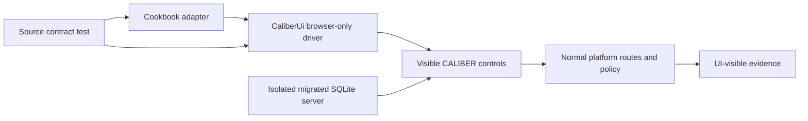

# CALIBER Cookbook UI-completeness review and implementation strategy

**Review date:** 2026-08-04  
**Repository baseline:** `64f15f7a2504fa0435621536853653b338645969` plus the working-tree automation added by this review  
**Required deliverable:** `ui-complete.md`  
**Scope:** all 16 numbered Cookbooks, current React UI, backing platform contracts, and a reusable UI-only Playwright foundation

## Executive summary

CALIBER can implement the central outcome of **9 of 16 Cookbooks entirely through
the UI**, subject to stated environment prerequisites such as a configured model
provider or existing traces. **6 are partial** because their current recipe still
requires custom Python, an externally provisioned connector, or a package step
outside CALIBER. **1 is not UI-only**: Cookbook 11 has evidence views but no
in-product release rubric, durable signoff record, or in-product Allure generation.

| Classification                                   | Cookbooks                          | Count |
| ------------------------------------------------ | ---------------------------------- | ----: |
| Fully implementable through the UI               | 01, 06, 09, 10, 12, 13, 14, 15, 16 |     9 |
| Partially implementable                          | 02, 03, 04, 05, 07, 08             |     6 |
| Not currently implementable through the UI alone | 11                                 |     1 |

This is an assessment of the **complete documented outcome**, not whether a few
individual screens exist. “UI-only” means every platform mutation and validation
step can be completed through visible CALIBER controls without direct REST calls,
database writes, manifest injection, shell commands, or authoring custom Python.
External prerequisites are allowed only when they are already available before the
recipe starts; provisioning them is not counted as a CALIBER UI capability.

The current Cookbook documentation is not reliable as a single source of truth:

- the root README says only 04, 05, and 11 need out-of-band work, which omits the
  custom-code requirements in 03, 07, and 08 and the package bridge in 02;
- its ladder lists only 01–15 although 16 exists;
- `CRITIQUE-REPORT.md` still describes 15 scenarios;
- `FEASIBILITY.md` says both that Prompt Playground is a live chat and that it
  only renders a template;
- the Aria documents and Cookbooks 12–15 say interaction answers cannot carry
  inputs. Current code has `AriaInteractionAnswerRequest.inputs`, schema-driven
  forms, validation, dependency references, and “Continue plan”; those recipes
  are now materially more complete than their prose claims;
- Cookbook 04 still uses the rejected legacy field `side_effect=read` instead of
  `side_effect_level=read`;
- Cookbook 05 recommends the GitHub `npx` preset as the easiest demo even though
  Node/npm/npx exist only in the UI build stage, not the shipped Python runtime;
- Cookbook 11 still requires `make allure-report`, a manual weighted rubric, and
  an external decision record.

The review also adds a reusable Playwright suite that performs mutations only
through visible UI controls. It has been executed successfully for Cookbook 02
(create, render, positive/negative trigger test, persist, archive) and Cookbook 13
(create a governed review queue): **3 Playwright checks passed**, including a
source-contract check that rejects direct API backdoors.

## Review methodology and evidence boundary

### Sources inspected

1. All 16 `docs-site/cookbooks/<number>-*/README.md` files and their scenario,
   build, test-data, verification, and asset contracts.
2. Cookbook-wide `README.md`, `FEASIBILITY.md`, `ARIA-AUTONOMY.md`, and
   `CRITIQUE-REPORT.md`.
3. Current SPA routes and navigation in `App.tsx` and `Sidebar.tsx`.
4. The relevant React workspaces: prompts, skills, tools, workflows, MCP,
   knowledge bases, Test Sets, judges, evaluations, review queues, Plans,
   observability, releases, Object Store, settings, and administration.
5. Backend schemas/routes/runtime contracts where a UI claim depended on actual
   behavior: tool sandboxing, skill selection, workflow execution/recovery,
   read-only MCP SQL, evaluation targets, review queues, release operations, and
   Aria planning/execution.
6. Existing unit and Playwright tests plus a new live Chromium run against an
   isolated migrated CALIBER server.

### Evidence labels

- **Source-verified:** current UI and backend code jointly expose the path.
- **Browser-verified:** the new Playwright workflow completed the visible path.
- **Environment-gated:** the UI exists, but a model, connector, real trace, or
  service must already be configured.
- **Proposed:** a recommended product change; it was not implemented by this review.

### Classification rules

- **Fully UI-only:** the complete scoped outcome and its acceptance evidence can
  be produced in CALIBER without custom code or direct API calls.
- **Partial:** a meaningful central path is available, but at least one required
  outcome, integration, or validation step crosses that boundary.
- **Not UI-only:** the defining artifact or decision cannot currently be created
  and persisted in CALIBER through the UI.

## Portfolio findings

|   # | Cookbook                            | Verdict                                         | Principal current boundary                                                                                                                    |
| --: | ----------------------------------- | ----------------------------------------------- | --------------------------------------------------------------------------------------------------------------------------------------------- |
|  01 | Trustworthy Intake Classifier       | **Fully UI-only**                               | Model-backed runs/calibration are environment-gated.                                                                                          |
|  02 | Precision Skills                    | **Partial**                                     | ZIP round-trip needs an unpack/rename bridge; lexical selection does not model negative boundaries.                                           |
|  03 | Policy-Safe Decision Tool           | **Partial**                                     | Deterministic `decide_refund` is custom Python; runtime approval enablement is not a self-contained recipe UI step.                           |
|  04 | Document-to-JSON Pipeline           | **Partial**                                     | Schema validation is custom Python and the workflow should use managed-file binding rather than the outdated bucket-to-local-path assumption. |
|  05 | Governed Tool Connectivity          | **Partial**                                     | Connector runtime/credentials are external; the advertised GitHub `npx` preset is absent from the shipped runtime.                            |
|  06 | Grounded Knowledge Assistant        | **Fully UI-only with a code-free substitution** | Replace `python_code(score_confidence)` with structured agent output + router; ambiguous traces are queued manually.                          |
|  07 | Support Triage Copilot              | **Partial**                                     | GitHub write connector and an incident lookup remain external/custom.                                                                         |
|  08 | Incident Response Copilot           | **Partial**                                     | Both evidence collectors are custom Python or external connectors.                                                                            |
|  09 | Self-Healing Workflows              | **Fully UI-only**                               | Use the documented `hitl_review` failure/retry path and configuration-only patch; semantic auto-patching remains absent.                      |
|  10 | Trustworthy Evaluation              | **Fully UI-only**                               | Review labels must be transcribed into Human alignment manually, but that work remains in the UI.                                             |
|  11 | Release Signoff Factory             | **Not UI-only**                                 | No release-scoring/signoff object; Allure generation and decision record are external.                                                        |
|  12 | Aria Evaluation Harness             | **Fully UI-only**                               | Planner vocabulary is literal and the created Test Set is initially empty. Documentation is stale.                                            |
|  13 | Aria Review Governance Queue        | **Fully UI-only**                               | Existing trace IDs are required only when adding items. Documentation is stale.                                                               |
|  14 | Aria Governance Starter Kit         | **Fully UI-only**                               | Example rows remain a follow-up UI step. Documentation is stale.                                                                              |
|  15 | Aria Triage and Recalibrate Loop    | **Fully UI-only**                               | Requires existing workflow, agent, traces, provider, and a running refinement worker.                                                         |
|  16 | Production Observability and Triage | **Fully UI-only**                               | Requires existing successful/error traces; this is inherent to an operations recipe.                                                          |

### Per-Cookbook implementation contract

This matrix makes the dependencies, required UI, expected proof, and residual
boundary explicit for every example. “Prerequisite” means an asset or service
that may already exist; creating an external prerequisite is not counted as a
UI-only CALIBER step.

|   # | Dependencies and prerequisites                                                | Required CALIBER UI                                                                                   | Expected output and validation                                                                              | Residual limitation                                                                     |
| --: | ----------------------------------------------------------------------------- | ----------------------------------------------------------------------------------------------------- | ----------------------------------------------------------------------------------------------------------- | --------------------------------------------------------------------------------------- |
|  01 | Configured chat/judge provider; refinement worker for calibration             | Prompts Author, Playground, Test Sets, Runs, Calibration, Observability                               | Versioned prompt, valid JSON run, durable test set, visible baseline regression, calibration job, trace     | Provider/worker readiness is environment-gated                                          |
|  02 | None for core authoring; downloaded package for round-trip                    | Skills wizard, Workspace, Render Preview, Trigger Tests, package panel, Bind, archive                 | Skill version, resolved render, positive/negative results, saved run, baseline/package, archived test asset | ZIP unpack and conflict rename remain external; selector lacks negative semantics       |
|  03 | Shipped demo tools; approval-capable workflow runtime                         | Tools registry, Sandbox, Fixtures, Hardening, Workflows, Runs, approval timeline, Observability       | Tool contracts, fixture baseline, gated run, approved write, rejected no-write proof                        | Refund decision function is custom Python; no code-free policy table                    |
|  04 | Supported document; Object Store and managed-file support                     | Object Store, File Directory, Tools, Prompts, Workflows, Observability                                | Pinned file provenance, extracted content, structured JSON, stage-specific failures                         | Target-schema validation is custom Python                                               |
|  05 | Reachable MCP runtime, credential/secret, network route                       | MCP Servers quick-connect, discovery, Playground, policies, History, Calibration                      | Connection/discovery proof, successful read, blocked invocation, policy badge, calibration result           | CALIBER does not provision the connector; advertised GitHub `npx` runtime is absent     |
|  06 | Source documents; model/judge provider; AGE only for graph retrieval          | Object Store, Knowledge Build/Explore/Calibrate, Workflows, Evaluations, Observability, Review Queues | Versioned KB, retrieval comparison, cited/abstaining runs, evaluation, reviewed trace                       | Automatic workflow-to-queue enqueue is absent                                           |
|  07 | Assets from 01–06; reachable incident source and GitHub write connector       | Prompts, Skills, Tools, KB, MCP, Workflows, approvals, Evaluations, Review Queues                     | Routed workflow runs, approved/rejected action traces, grounded evaluation, review outcome                  | Incident lookup and GitHub connector are external/custom                                |
|  08 | Deployment and service-health collectors; provider                            | Prompts, Tools/MCP, Workflows, approvals, Runs, Evaluations, Review Queues                            | Structured fact/hypothesis output, low/high-risk runs, approval/rejection proof, evaluation                 | Defining evidence collectors are not shipped                                            |
|  09 | Runnable `hitl_review` workflow and prior-good inputs                         | Workflows Runs, Recovery, Checkpoints, Debugger, editor/versioning, Observability                     | Failed/retried/completed run lineage, root cause, configuration patch, green regression slice               | Recovery is operator-guided, not semantic self-patching                                 |
|  10 | Provider and representative candidate traces                                  | Test Sets, Judges, Evaluations, comparison, Review Queues, Human alignment                            | Judge, baseline/candidate runs, completed reviews, kappa/confusion statistics                               | Queue labels require manual transcription into alignment                                |
|  11 | Existing evaluation/review/trace evidence; externally generated Allure report | Evaluations, Review Queues, Observability, Releases                                                   | UI evidence bundle and observable release state only                                                        | Weighted rubric, blocker/waiver model, signoff record, and Allure generation are absent |
|  12 | Provider for the resulting evaluation; worker if later calibration is added   | Plans typed inputs/approvals, Judges, Test Sets, Evaluations                                          | Completed plan interactions, active judge, test set, later evaluation                                       | Planner needs literal keywords; created test set starts empty                           |
|  13 | Existing trace IDs only when adding items                                     | Plans typed inputs/approvals, Review Queues                                                           | Created queue and schema; add-items completed with real traces or explicitly skipped                        | No meaningful items exist until traces are available                                    |
|  14 | Trace IDs only for optional queue population; provider for evaluation         | Plans typed inputs/approvals, Judges, Test Sets, Review Queues, Evaluations                           | One plan, three visible governed artifacts, optional queue items, later evaluation                          | Literal planner vocabulary; test set population is a follow-up UI step                  |
|  15 | Existing workflow, agent, flagged traces, provider, running refinement worker | Plans typed inputs/approvals/job polling, Workflows, Review Queues, Calibration                       | Queue/items, calibration job, visible waiting state, deterministically resolved plan                        | Cannot demonstrate the loop without real prerequisite artifacts and worker              |
|  16 | Existing successful and error traces; separately deployed candidate fix       | Observability, Test Sets, Review Queues, Evaluations                                                  | Captured regression rows, completed reviews, baseline/candidate comparison                                  | UI proves triage and post-fix evidence, not fix deployment                              |

## Per-Cookbook UI-only implementation plans

### 01 — Trustworthy Intake Classifier

**Verdict:** Fully implementable through the UI; environment-gated by a real
chat/judge provider and refinement worker.

**Alignment findings:** The prompt Workspace now owns Author, Playground, Test
Sets, Runs, Calibration, and Bind. The recipe is broadly aligned. The shared
`FEASIBILITY.md` warning that Playground is render-only is obsolete and directly
contradicts both the current page and this recipe.

**UI plan**

1. Open **Prompts → New prompt**, choose the manual/template path, name it
   `intake-classifier`, enter the strict JSON contract, and save the initial version.
2. In **Author**, save a strong version without changing the live alias until it
   is tested.
3. In **Playground**, select the configured model and run a representative input;
   verify that exactly one JSON object is returned.
4. In **Test Sets**, generate or add billing, account, how-to, and injection cases;
   run them and save the durable set as `intake-classifier-golden`.
5. In **Runs**, execute the strong version and set the passing run as baseline.
6. Save a deliberately weakened prompt version, rerun the same cases, and verify
   the baseline comparison reports the intended regressions.
7. In **Calibration**, enqueue a refinement run and retain the job identifier.
8. Open the failing trace in **Observability** and connect the failure to visible
   prompt/run evidence.

**Required UI:** Prompt Workspace stages, Test Set editor, Runs comparison,
Calibration job panel, Observability detail.  
**Output/evidence:** two prompt versions, durable Test Set, baseline/comparison
runs, regression list, calibration job ID, trace.  
**Acceptance:** valid JSON contract; strong run meets the declared threshold;
weakened version produces a visible regression.  
**Limitations/recommendations:** remove the render-only Playground statement and
make provider readiness visible before a model-backed action starts.

### 02 — Precision Skills

**Verdict:** Partially implementable. Core author/render/trigger/run/bind/archive
is UI-only and browser-verified; the advertised package round-trip is not.

**Alignment findings:** The current skill Workspace has six real stages and a UI
package export/import surface. Import consumes selected unpacked files, while the
recipe tells users to POST a ZIP and rename `SKILL.md` frontmatter outside CALIBER.
The deterministic selector is positive token overlap over name/tags/summary/
description. Negative prose such as “do not use for API questions” contributes
positive `API` overlap and can cause the false positive it is meant to prevent.

**UI plan**

1. Open **Skills → New skill** and provide kebab-case name, owner, category, tags,
   concise positive-domain summary, Markdown content, and positive trigger phrases.
2. Use **Render Preview** with all declared variables and require zero unresolved
   variables.
3. Use **Trigger Tests** for positive and genuinely non-overlapping negative cases;
   save the completed batch as a durable run.
4. Tighten positive-domain metadata when false positives appear; do not encode
   exclusions as ordinary summary tokens until the selector supports them.
5. Pin a passing run as baseline and test future versions against it.
6. Download the package from the UI.
7. **Current boundary:** unpacking/renaming the package for a non-conflicting copy
   occurs outside CALIBER, then **Import package** accepts the selected files.
8. Bind the validated skill and archive the test copy through the UI.

**Required UI:** Skill wizard/Workspace, package panel, Bind, archive.  
**Output/evidence:** skill version, render result, positive/negative selection
results, baseline, package.  
**Acceptance:** all positive and negative fixtures match expectation; imported
copy is equivalent.  
**Required product improvements:** accept ZIP directly, provide conflict rename
in the import dialog, and add explicit negative triggers/exclusion scoring.

### 03 — Policy-Safe Decision Tool

**Verdict:** Partially implementable.

**Alignment findings:** Registering shipped callables, schemas, sandbox runs,
fixtures, hardening, baseline, workflow approval, and run recovery are UI-backed.
The defining deterministic `decide_refund` logic is not shipped and must be custom
Python. Pasting Python into a `python_code` node is low-code, not no-code.

**UI plan**

1. Register `lookup_order` and `initiate_refund` from
   `caliber.workflows.demo_tools` in **Tools**, with explicit schemas and side
   effect levels.
2. Verify live read and mocked write behavior in **Sandbox**.
3. Add deterministic fixtures and run **Hardening**; pin a passing baseline.
4. Start a `hitl_review` workflow and bind both registered tools.
5. **Current boundary:** author the deterministic decision function as custom
   `python_code`, then connect lookup → decision → approval → write.
6. Run the workflow, verify `waiting_approval`, approve, then resume; separately
   reject and prove the write does not run.
7. Inspect the trace, fixture run, and approval timeline.

**Output/evidence:** tool contracts, fixture baseline, pass-rate delta, gated
workflow runs.  
**Acceptance:** deterministic decision agreement and 100% approval enforcement.  
**Required product improvements:** ship a configurable decision-table node or a
JSON-logic/policy builder; expose runtime-approval readiness and enablement as a
clear administrative UI workflow.

### 04 — Document-to-JSON Pipeline

**Verdict:** Partially implementable.

**Alignment findings:** Object Store upload/preview/extraction and managed files
are real. The recipe should not imply that bucket output automatically becomes a
host-local path for `extract_document`; the current safe bridge is to import/select
a content-pinned managed file for the workflow. Its `side_effect=read` field is
also stale. Schema validation remains custom Python.

**UI plan**

1. Create `doc-intake` in **Object Store**, upload supported DOCX/PPTX/XLSX files,
   and verify each through the Extract action.
2. Import/select the object in the workflow **File Directory** so the run binds a
   content-pinned managed snapshot rather than a host path typed by the user.
3. Register `extract_document` with `side_effect_level=read` and test it against
   the bound managed file.
4. Create the `doc-structurer` prompt through **Prompts**.
5. Build a blank workflow: managed `file_input` → extractor → prompt/agent →
   validator → output.
6. **Current boundary:** the target-schema validator is custom `python_code`.
7. Run complete/partial/unsupported cases and inspect extraction versus validation
   failures in **Observability**.

**Output/evidence:** object and managed-file provenance, three run IDs, structured
JSON, readable failure evidence.  
**Acceptance:** schema-valid golden output and stage-specific errors.  
**Required product improvements:** add a code-free JSON Schema validation node;
update the recipe to managed-file binding and correct `side_effect_level`.

### 05 — Governed Tool Connectivity (MCP)

**Verdict:** Partially implementable.

**Alignment findings:** Quick-connect, connection testing, discovery, Playground,
policy overlays, history, and calibration are UI-backed. Database `run_query` is
now protected by a PostgreSQL READ ONLY transaction plus parser restrictions, so
the old mutation warning is superseded. The GitHub preset still depends on `npx`,
which is absent from the shipped runtime image; credentials and remote services are
also externally provisioned.

**UI plan**

1. Begin with a connector already reachable from the deployment; the included
   PostgreSQL sidecar is the least misleading local demonstration.
2. Register it from **MCP Servers**, test the connection, and inspect discovery.
3. Invoke a read tool in **Playground** and retain duration/result history.
4. Set `allowed=false` on a selected tool and prove direct invoke is refused.
5. For a workflow-only approval demonstration, set `requires_approval=true` and
   bind the tool behind a workflow approval path.
6. Save and run calibration cases for the permitted read tool.
7. Use Playground History, policy badges, and calibration results as evidence;
   do not claim MLflow spans because this route does not emit them.

**Output/evidence:** connection/discovery result, successful read, blocked invoke,
policy badge, calibration verdict.  
**Acceptance:** reachable connector, blocked-tool enforcement, saved passing
calibration.  
**Required product improvements:** ship or remotely host the catalog runtimes,
add connector prerequisite/readiness diagnostics, and integrate secret references
without asking users to paste environment configuration outside the product.

### 06 — Grounded Knowledge Assistant

**Verdict:** Fully UI-only with a code-free substitution.

**Alignment findings:** KB Build/Explore/Calibrate, retrieval modes, AGE sync,
workflow nodes, Test Sets, evaluations, judges, and queues are real. The documented
`python_code(score_confidence)` is unnecessary for the central outcome.

**UI plan**

1. Upload policy documents in **Object Store** and create a KB version from them.
2. Inspect chunk/source lineage and compare dense, hybrid, and graph retrieval.
3. If AGE is enabled, run **Sync to AGE** before `age_graph` retrieval.
4. Calibrate on question/expected pairs, adjust chunking/retrieval, and pin the
   passing baseline.
5. Start from `knowledge_rag`; have the answer agent emit structured
   `{answer,citations,confidence,needs_review}`.
6. Use a router condition over `needs_review` instead of custom Python; answer or
   abstain accordingly.
7. Run answerable, missing-evidence, and conflicting-source inputs.
8. Evaluate with deterministic scorers plus `CitationFaithfulness`.
9. From Observability/Review Queues, manually enqueue ambiguous trace IDs and
   complete review in the UI.

**Output/evidence:** KB version, retrieval comparison, calibration baseline,
workflow runs, evaluation, completed queue.  
**Acceptance:** cited answers, compliant abstention, improved recall without a
faithfulness loss.  
**Limitation:** automatic queue enqueue is not a first-class workflow node; add one
if the handoff must be unattended.

### 07 — Support Triage Copilot

**Verdict:** Partially implementable.

**Alignment findings:** Most reusable CALIBER assets and workflow controls are
UI-backed. The complete `escalate_bug` path assumes a GitHub MCP runtime not shipped
in the application image, and `lookup_recent_incidents` is either a loose
substitution or custom code.

**UI plan**

1. Reuse validated prompt, skill, tools, KB, and connector assets from 01–06.
2. Create a structured intake/reply contract with four decision outcomes.
3. Build the workflow using lookup, KB query, answer agent, router, approval, and
   output nodes.
4. Configure safe reply/clarify branches entirely inside CALIBER.
5. **Current boundary:** provide the incident source and GitHub issue connector
   outside the shipped runtime, then bind `escalate_bug` behind approval.
6. Run low-risk, approved high-risk, and rejected high-risk cases.
7. Evaluate decision and grounding; queue low-scoring traces for review.

**Output/evidence:** workflow version/runs, approved and rejected external-action
traces, evaluation, review outcomes.  
**Acceptance:** grounded replies, correct routing, no external write before
approval.  
**Required product improvements:** first-party incident-source and issue-creation
connectors with deployment readiness checks.

### 08 — Incident Response Copilot

**Verdict:** Partially implementable.

**Alignment findings:** Prompting, routing, structured output, approval, runs,
evaluation, and review are UI-backed. The two defining evidence collectors are not
shipped tools; the recipe explicitly asks users to write Python fixtures or install
external MCP services.

**UI plan**

1. Create the commander prompt and fact/hypothesis/open-question schema.
2. Start a `hitl_review` workflow.
3. **Current boundary:** implement or provision deployment and service-health
   collectors, then register/bind them.
4. Connect evidence → commander → risk router → approval → optional external write.
5. Execute low- and high-risk incidents; approve and reject separate high-risk runs.
6. Evaluate action correctness and complete review of conflicting cases.

**Output/evidence:** two risk-path runs, structured evidence separation,
approval/rejection timeline, evaluation.  
**Acceptance:** traceable recommendations and zero ungated unsafe actions.  
**Required product improvements:** add code-free HTTP/JSON data-source nodes or
ship supported deployment/health connectors and fixtures.

### 09 — Self-Healing Workflows

**Verdict:** Fully UI-only for the documented operator-recovery scope.

**Alignment findings:** Recovery, checkpoints, debugger, lineage, retry, approval,
resume, editor versioning, and Observability comparison are real. “Self-healing” is
an overstatement: diagnosis and patch choice remain operator-controlled.

**UI plan**

1. Create a `hitl_review` workflow and run it to `waiting_approval`.
2. Reject the request to produce a reproducible failed run.
3. Inspect Recovery, Checkpoint, and Debugger panels and record the failing node.
4. Retry; confirm attempt lineage, approve, resume, and reach completed.
5. Make a minimal configuration/guardrail/branch change in the editor and save a
   new version—no custom code is required for this demonstration.
6. Preview and run the prior failing input plus a small prior-good slice.
7. Compare pre/post traces in Observability.

**Output/evidence:** failed/retried/patched runs, root-cause note, lineage,
post-patch regression slice.  
**Acceptance:** replay succeeds and prior-good behavior remains green.  
**Limitation/recommendation:** rename the recipe “Operator-guided workflow
recovery” or add governed semantic patch proposal/application before claiming
self-healing.

### 10 — Trustworthy Evaluation

**Verdict:** Fully UI-only; provider and real candidate traces are prerequisites.

**Alignment findings:** Dataset authoring/from-trace capture, custom judge,
artifact-target evaluation, comparison, queue review, and Human alignment are all
present. Completed queue labels are not auto-ingested into alignment.

**UI plan**

1. Create a Test Set and add representative rows manually or from trace.
2. Create `FaithfulnessJudge` with valid template variables and boolean output.
3. Run the same set against explicit baseline and candidate subjects.
4. Open per-example results, compare runs, and collect low/disagreeing trace IDs.
5. Create a matching Review Queue, enqueue the traces, and submit human answers.
6. In **Judges → Human alignment**, transcribe judge and human pass/fail labels.
7. Read agreement, Cohen’s kappa, false positives, and false negatives; update the
   dataset/rubric and rerun.

**Output/evidence:** judge, two evaluation runs, completed review items, alignment
statistics.  
**Acceptance:** declared score/alignment/sample-size thresholds.  
**Recommended improvement:** one-click import of completed queue labels into the
judge alignment sample with preserved trace provenance.

### 11 — Release Signoff Factory

**Verdict:** Not currently implementable through the UI alone.

**Alignment findings:** Evaluations, queues, traces, release timeline/live state,
and incomplete release-operation recovery are real. They do not implement the
Cookbook’s weighted rubric, blocker aggregation, durable go/no-go decision record,
waivers, or signoff. Allure generation remains a shell command.

**Best available UI-assisted plan**

1. Gather evaluation, review, and trace evidence through the UI.
2. Open the currently served Allure report if an external job already generated it.
3. Rerun critical workflows and inspect Releases/recovery state.
4. **Current boundary:** calculate the weighted rubric outside CALIBER.
5. **Current boundary:** create and persist the decision record outside CALIBER.
6. Use the Releases page only to observe live artifacts and reconcile/resolve
   incomplete prompt operations; do not present it as release signoff.

**Missing output:** a CALIBER release-candidate/signoff record.  
**Acceptance for the current UI-assisted boundary:** every referenced evaluation,
review, trace, and live release artifact opens in the UI and retains its identity;
this evidence bundle still does not satisfy the Cookbook's signoff outcome.  
**Required product implementation:** release-candidate object, evidence picker,
version-pinned rubric engine, blocker/waiver model, approver identities, immutable
decision, release action, rollback target, Allure generation job, and audit trail.

### 12 — Aria Evaluation Harness

**Verdict:** Fully UI-only on the current platform.

**Alignment findings:** The recipe’s central blocker is fixed. The answer schema
accepts `inputs`; the executor creates an `input` interaction for missing fields,
the Plans UI renders typed controls from capability JSON Schema, validates the
values, and resumes the step. Documentation still describes the obsolete external
POST workaround.

**UI plan**

1. Open **Plans**, create a goal containing the literal domains `judge` and
   `eval dataset`, and use `ask_each`.
2. Review and approve the two-step plan.
3. Execute; when “Aria needs information” appears, complete the typed judge fields
   and continue.
4. Complete the Test Set name/metadata form and continue.
5. Approve mutation interactions as required by the selected autonomy policy.
6. Verify completed steps and the created artifacts in **Judges** and **Test Sets**.
7. Add rows to the empty Test Set and run it through **Evaluations**.

**Output/evidence:** plan, input interactions, active judge, Test Set, evaluation.  
**Acceptance:** both planned creates complete and artifacts are visible.  
**Required documentation update:** remove all “inputs cannot be injected” and
direct-route workaround text; retain the literal-keyword and empty-dataset limits.

### 13 — Aria Review Governance Queue

**Verdict:** Fully UI-only and browser-verified for queue creation.

**Alignment findings:** Typed plan input collection and dependency wiring supersede
the stated execution gap. `review_queue.create` declares `queue_id`, so the planner
wires it into `review_queue.add_items`; only trace IDs remain user input.

**UI plan**

1. In **Plans**, create the canonical review-queue goal with `ask_each`.
2. Review/approve the create and add-items steps.
3. Enter queue name, description, reviewer list, and question JSON in the
   schema-driven input form; continue and approve the mutation.
4. If real traces exist, enter them in the add-items form; otherwise choose
   **Skip step**.
5. Verify the queue and schema in **Review Queues**.
6. Later enqueue traces and submit reviews through the same UI.

**Output/evidence:** completed/skipped plan steps, queue, questions, optional
items/reviews.  
**Acceptance:** queue exists; add-items is either completed with real traces or
explicitly skipped.  
**Required documentation update:** replace API creation instructions with typed
interaction fields and explain automatic `queue_id` dependency wiring.

### 14 — Aria Governance Starter Kit

**Verdict:** Fully UI-only on the current platform.

**Alignment findings:** All three create capabilities collect missing inputs in
the UI. The deterministic planner remains literal-keyword based and the Test Set
starts empty; those are limitations, not external implementation blockers.

**UI plan**

1. Create a Plan goal containing `judge`, `eval dataset`, and `review queue`.
2. Review the three create steps plus add-items and approve the plan shape.
3. Complete each schema-driven input form for judge, Test Set, and queue.
4. Skip add-items when no trace IDs exist, or provide real IDs.
5. Verify all artifacts in their native pages.
6. Add Test Set examples, run the judge, and route difficult traces to the queue.

**Output/evidence:** one plan, three created artifacts, optional queue items,
evaluation.  
**Acceptance:** all create steps complete and artifacts are independently visible.  
**Required documentation update:** remove the external route workaround and show
the exact typed input/approval sequence.

### 15 — Aria Triage and Recalibrate Loop

**Verdict:** Fully UI-only with significant prerequisites.

**Alignment findings:** The same typed-input correction applies. Queue ID
dependency wiring is automatic; trace IDs, workflow ID, and agent ID are supplied
through the UI. Calibration remains an asynchronous job and needs the worker/
provider to be operational.

**UI plan**

1. Build/run the prerequisite workflow and collect visible workflow, agent, and
   flagged trace IDs.
2. Create the literal-domain Plan goal and approve its three-step shape.
3. Complete queue inputs; continue and approve.
4. Enter trace IDs for add-items; the queue ID comes from the previous step.
5. Enter workflow/agent IDs for calibration and approve the mutation.
6. Observe `waiting_job`, use the Plans refresh/poll path until resolution, and
   verify the plan completes or exposes a durable failure.
7. Inspect the queue items and refinement/calibration result in their native pages.

**Output/evidence:** queue, queued traces, calibration job, waiting/resolved plan.  
**Acceptance:** queue and items exist; job resolves; plan resumes deterministically.  
**Required documentation update:** replace “no inputs field” and direct-route
steps with the actual UI interaction lifecycle.

### 16 — Production Observability and Triage

**Verdict:** Fully UI-only; existing production-like traces are an inherent
prerequisite.

**Alignment findings:** The central watch → capture → review → baseline loop is
represented in Observability, Test Sets, Review Queues, and Evaluations. The root
Cookbook ladder and critique inventory must include this sixteenth recipe.

**UI plan**

1. Open **Observability**, filter errors, select a trace, and identify the failing
   node from the tree/timeline.
2. Use **Add to test set** to capture the input/expectation into `prod-regression`.
3. Create `prod-triage` in **Review Queues** with the supplied question schema.
4. Add the failing trace IDs, complete the review, and verify assessments on trace.
5. Run `prod-regression` in **Evaluations** and retain the baseline score.
6. After a separately deployed fix, repeat the run and compare the failure rate.

**Output/evidence:** error traces, regression rows, queue answers, evaluation
baseline/comparison.  
**Acceptance:** every in-window error is captured or triaged; root cause is
readable; reviews write back; regression score is durable.  
**Limitation:** it proves evidence capture and post-fix comparison, not automatic
fix deployment.

## Cross-Cookbook gap analysis

### P0 — Required to make every Cookbook genuinely UI-only

1. **Code-free deterministic transforms:** ship decision-table, JSON Schema
   validation, mapping, confidence, and fixture-source nodes. This closes the
   custom Python boundary in 03, 04, 06, and 08 without weakening determinism.
2. **Connector runtime readiness:** package supported MCP runtimes or use managed
   remote connectors; show binary/network/secret prerequisites before Register.
3. **Release signoff domain:** implement the full Cookbook 11 object and workflow,
   not another observational dashboard.
4. **Allure generation job:** allow an authorized operator to start, monitor, and
   retain a report generation run in CALIBER.

### P1 — No-code fidelity and lifecycle closure

1. Accept skill ZIP upload directly and provide UI conflict rename/merge.
2. Add negative trigger phrases/exclusions and stopword-aware selection; show the
   exact matched signals in the skill test result.
3. Add a Review Queue enqueue workflow component and alignment-label import.
4. Expose deployment runtime-approval readiness/enablement with scope and audit.
5. Add reusable first-party incident/deployment/service-health connectors.
6. Add a Cookbook installer that creates a versioned draft bundle, checks
   prerequisites, and requires explicit review before activation.

### P2 — Documentation and automation durability

1. Make one generated capability manifest the source for Cookbook feasibility.
2. Add stable `data-testid` contracts for every recipe mutation and evidence view.
3. Run the UI-only Cookbook suite in CI on an isolated database and forbid direct
   API use in its adapters.
4. Expand automation in dependency order: 01/02 → 03/04/05/06 → 07/09/10/16 →
   12–15 → 11 after its domain model exists.

## Reusable Playwright automation architecture

### Delivered files

- `caliber/caliber-ui/e2e/cookbooks/ui-only-driver.ts`
- `caliber/caliber-ui/e2e/cookbooks/ui-only-cookbooks.spec.ts`
- `caliber/caliber-ui/playwright.cookbooks.config.ts`
- `caliber/caliber-ui/package.json` script `test:e2e:cookbooks`

### Design



- **Cookbook adapter:** declares a bounded recipe using domain-level driver calls.
- **Driver:** owns stable locators, waits, form interactions, and visible
  assertions. It intentionally has no API request context.
- **Isolated configuration:** one Chromium worker, a dedicated port, a fresh SQLite
  state directory, no project `.env`, and knowledge warmup disabled because these
  two demonstrations do not use retrieval.
- **Contract test:** scans the adapter/driver sources for `page.request`, HTTP
  request methods, `fetch`, or API endpoint paths.
- **Evidence discipline:** a step is complete only when the user-visible artifact,
  status, result, or control state confirms it.

### Current automated demonstrations

1. **Cookbook 02:** UI login → skill wizard → Render Preview → positive and
   negative Trigger Tests → save durable run → archive.
2. **Cookbook 13:** UI login → Review Queues → create queue → add a required
   citation question → verify the visible queue row.
3. **Automation contract:** verifies there is no direct API backdoor in these
   executable sources.

### Extension contract for future agents

1. Add a domain operation to `CaliberUi` only when it represents a visible,
   reusable platform action.
2. Add a `UiOnlyCookbook` adapter with a stable ID/title and `execute(ui)` method.
3. Generate unique names and use an isolated database; archive through the UI when
   the product supports it.
4. Never use `page.request`, `fetch`, direct endpoint URLs, database fixtures, or
   manifest/API seeding in the Cookbook adapter.
5. File upload is allowed only through the rendered file chooser and must be part
   of the documented user journey.
6. Assert final evidence—not merely that a button was clickable.
7. If the UI cannot express a step, stop and classify the Cookbook partial instead
   of hiding the gap behind setup code.

### Execution and verified result

```bash
cd caliber/caliber-ui
npm run test:e2e:cookbooks
```

Observed on this review baseline: **3 passed** (contract + Cookbook 02 + Cookbook
13). The live run used the real migrated application and Chromium; no adapter used
direct API seeding or mutation.

## Risks and limitations

1. **A passing local UI path is not production certification.** Model providers,
   remote MCP systems, object storage, AGE, workers, and authentication modes need
   environment-specific validation.
2. **Admin-only automation can hide RBAC gaps.** Add viewer/operator/approver
   projects and negative authorization journeys before calling the framework an
   autonomous production agent.
3. **UI agents amplify unsafe defaults.** External writes, releases, credentials,
   and gated actions must retain the same scopes, confirmation, and audit records
   as human UI use; automation must not bypass them.
4. **Literal planner vocabulary is brittle.** Cookbooks 12–15 work with canonical
   domain words; this is not general natural-language planning.
5. **Generated docs can drift.** Cookbook source, generated HTML/Markdown, and
   product code need a common machine-readable capability inventory and CI check.
6. **Manual bridges remain UI-only but not autonomous.** Label transcription,
   trace-ID collection, and manual queue handoffs satisfy the narrow UI-only test
   but still limit unattended execution.

## Required documentation corrections

1. Update the root Cookbook README to include 16 and replace “only 04, 05, 11”
   with the current 9/6/1 classification.
2. Rewrite `FEASIBILITY.md` Prompt Playground guidance into one consistent live
   chat versus persisted/scored-run explanation.
3. Rewrite Aria guidance and Cookbooks 12–15 for typed `inputs`, dependency
   wiring, “Continue plan,” permission interactions, and async polling.
4. Correct Cookbook 04 to `side_effect_level` and managed-file binding.
5. Correct Cookbook 02 package import and negative-selection guidance.
6. Reframe Cookbook 05 catalog choices around actual runtime readiness.
7. Mark all custom `python_code` steps as low-code, never no-code.
8. Reframe Cookbook 09 as operator-guided recovery unless semantic patching ships.
9. Reframe Cookbook 11 as blocked until the release-signoff domain exists.
10. Regenerate `m-16-cookbooks.html`, Markdown copies, navigation, and training
    overrides after source corrections.

## Final assessment

CALIBER is now credibly a **broad low-code platform with nine complete UI-only
Cookbook paths**, not a universally no-code platform. Its strongest no-code areas
are prompt lifecycle, knowledge/evaluation/review operations, workflow recovery,
observability triage, and the newly completed typed-input Aria governance plans.

The claim “all complex Cookbooks can be built exclusively through the UI” is not
yet defensible. Custom deterministic logic, connector provisioning, portable skill
round-trip, and release signoff remain material boundaries. The shortest route to
an honest end-to-end no-code claim is: ship code-free deterministic nodes, make
connector readiness a product feature, complete skill import, and implement the
release-candidate/signoff object. The delivered Playwright architecture provides a
repeatable proof mechanism for those improvements: if a future adapter needs an
API shortcut, that Cookbook is still not UI-complete.
