# CALIBER UX Remediation Execution Plan

**Scope:** Source-grounded UX review and implementation plan for the CALIBER web
UI and its supporting APIs, conducted per-persona and per-journey against the
code on `main` at commit `70c4e82345`.

**Re-verified:** 2026-09-06 against `ff6d18c414`; ledger refreshed 2026-09-07.
Of the four "silent wrong object" Critical items, **three are merged** — UX-04
(`#237`), UX-03 (`#238`), UX-01 (`#239`) — and **UX-02 has a fix open for
review** (`#247`); none is closed at its gate (§15.2). Also merged: their two
residues as `#245` (UX-01a, UX-03a), the primary outcomes of UX-05/06/07 as
`#243`, `#242`, `#244`, and UX-15's honest-numbers half as `#246`. Open for
review: the structural census that makes §15.1's counts re-runnable (`#248`).
§15 carries the re-verification commands, the live status ledger with each
package's named remainder, and a full implementation specification for every
remaining work package.

**Method:** Every implementation finding is grounded in a specific file and line
in this repository. Where a claim is quantitative (modelled step counts, page
sizes, control counts), the measurement command or file reference is given so
it can be re-run. Where the implementation contradicts an assumption, the
implementation wins.

**Evidence boundary:** This is a static implementation audit, not an observed
usability study. It did not include authenticated browser journeys, production
telemetry, user interviews, task-completion timing, or accessibility testing
with assistive technology. Interaction counts are modelled lower bounds through
the shortest path found in source, not measured user behaviour. File size and
duplication are maintainability signals, not UX outcomes by themselves. The
execution plan therefore makes browser validation and telemetry a gate before
irreversible information-architecture consolidation.

**Review stance:** critical product reviewer, not feature advocate. The
objective is a lower-friction product, not a larger one. Recommendations follow
a fixed decision order:

> **Simplify → Consolidate → Improve defaults → Progressive disclosure → Remove → Add**

"Add" appears only where the absence of a capability is itself the friction.

---

## 1. Executive Summary

### The core finding

**CALIBER's backend is materially more honest, more complete, and better
designed than its user interface — and the fastest route to a much better
product is not new features, but rendering the signal the platform already
computes.**

In **thirteen verified cases** (§7.1) a decision signal is already returned by
an existing server contract and is not rendered where the user needs it. Five
additional gaps require a contract or workflow change rather than a render-only
fix. Validation errors carry per-field detail that is thrown away, so request
schema validation failures collapse to
_"request body validation failed"_. The count of pending approvals is fetched on
**every page load** and displayed nowhere. Judge/human disagreement is computed
example-by-example and then reduced to a single number. A knowledge-base build
failure is fetched to drive a poll and never shown, so a failed build renders as
_"0 chunks · 0 entities"_ — indistinguishable from an empty success.

This has a direct consequence for planning: several high-value corrections are
isolated, but the evidence, security, durability, and cross-surface changes are
not small merely because the missing UI looks small.

### What is genuinely strong

The evidence and honesty layer is the product's differentiator and is
implemented with unusual rigour (§6): the Evidence panel discloses sampling
bounds, digests, and per-scorer denominators; incomplete runs cannot masquerade
as clean ones; baseline comparison _refuses_ to compare mismatched suites and
discloses differences rather than hiding them; AGE retrieval states when it fell
back and why; the MCP tool policy denies by default; the health indicator is
real and its comment explains why it refuses to overclaim. Two surfaces —
`Cookbooks.tsx` and `planView.tsx` — are good enough to be templates for the
rest of the app.

### What is wrong

| Symptom                                          | Measure                                                                                                                                                                                                   |
| ------------------------------------------------ | --------------------------------------------------------------------------------------------------------------------------------------------------------------------------------------------------------- |
| **Feedback loops that do not close**             | **4 of 4** core loops (prompt regression, evaluation capture, judge trust, KB calibration) dead-end (§7.2)                                                                                                |
| **Nothing tells a human something needs them**   | **1** attention badge exists for **12** distinct attention items; pending approvals have **no UI at all** (§7.3)                                                                                          |
| **Permission affordances**                       | **3** competing models; **at least 33** mutating controls visible to a viewer who will 403 in the audited surfaces; the assistant labels **every admin "Viewer"** (§7.4)                                  |
| **Concentration of complexity**                  | **4 of 34** pages hold **47.5%** of all page code; the largest is **9,006 lines** with ~55 feature areas (§8.1)                                                                                           |
| **Dead, duplicated, and misleading UI**          | **20** static deletion/consolidation candidates; **19** helper functions copy-pasted verbatim; roughly **7,000** lines of code movement are candidates for parity-tested extraction or removal (§8.2–8.3) |
| **Vocabulary**                                   | **6** names for a test set, **5** for a grader, **5** for "ship it"; _"Calibrate"_ means **three different things**, one of which queues an LLM to rewrite your asset (§7.5)                              |
| **Governance depends on which button you found** | **5** prompt promote paths, only **2** gate-aware; release scores are arithmetic on numbers the gated party typed (§5.1.5, §5.6.3)                                                                        |
| **Wayfinding**                                   | **31** addressable routes; **0** global search, **0** command palette, **0** global shortcuts; breadcrumbs are **built and used once** (§7.7)                                                             |
| **First run**                                    | An empty install opens on **two red 0% tiles and one amber**, while the useful Cookbook on-ramp is not connected to the Home empty state (§4.6)                                                           |

### Measured against the product's own intent

ARCHITECTURE.md commits to ten canonical design principles, enforced across four
surfaces by a contract test. Two are directly relevant:

- **#9 "Developer & User Friendly — … for both developers _and business
  users_"**, discharged by _"the SPA surfaces and the Cookbook examples"_. The
  business-user personas the docs themselves recognise (`system-user`,
  `decision-maker`) are not served today: their destinations are a review form
  that shows no evidence, a raw-JSON compliance surface with self-attested
  scores, and a page with no URLs. The Cookbook examples, named as half the
  mechanism, are reachable from the sidebar but not connected to first-run
  guidance.
- **#4 "Evaluation by Design"** is contradicted by the prompt workspace's local
  scoring path bypassing the evaluation engine, the judge registry, and the
  evidence contract in favour of a judge prompt hardcoded in the browser bundle.
  Repository evidence establishes the duplicate path, but not which path users
  use most often.

### Direction

The recommendation is **not to add capability**. Applying
_Simplify → Consolidate → Improve defaults → Progressive disclosure → Remove →
Add_, the target model (§11) takes 21 grouped sidebar destinations to 19 (22 to
20 when Dashboard/Home is included) — but the real
wins are consolidations: **one** admin destination instead of two, **one**
"tools I can call" catalog instead of four mental models, **one** scoring engine
instead of two, **one** run-monitoring component instead of two mounts, and the
two 8,000–9,000-line pages split along the seams the code already suggests.

Fourteen capabilities are proposed (§10). They are now classified as direct
rendering, contract extension, or new workflow work; none should be scheduled
only because it appears in this document.

The seven Critical issues share a shape worth naming: **each one silently
produces a wrong result or destroys work while the interface looks like it is
working.** A button labelled "Save as New Version" that promotes to production; a
"New version" action that versions a different knowledge base than the header
names; a signoff form that submits another candidate's rationale; an editor that
accepts edits it can never save. These are not polish items. The isolated state
bugs should land first; the approval, evidence, and evaluation items follow
their explicit contracts in §14.

### Corrections applied in this revision

| Prior wording or assumption                                          | Corrected planning interpretation                                                                                                                                                                              |
| -------------------------------------------------------------------- | -------------------------------------------------------------------------------------------------------------------------------------------------------------------------------------------------------------- |
| The report implied observed UX evidence                              | Source inspection supports implementation findings; browser, accessibility, telemetry, and user evidence remain required validation work                                                                       |
| Sixteen signals were described as computed, typed, and browser-ready | Thirteen are direct rendering gaps; tool provenance needs TypeScript contract alignment, while bulk dataset import, release evidence resolution, and trace/result linkage need backend workflow or schema work |
| “Every 4xx” lost field detail                                        | The verified loss applies to structured request-validation responses; other 4xx paths have independent messages                                                                                                |
| The prompt scorer was called “most-used”                             | No usage telemetry was inspected; the verified issue is duplicate, non-comparable scoring behaviour                                                                                                            |
| Roughly 7,000 lines were called safely removable                     | This is a code-movement estimate. Orphan routes and duplicate surfaces require parity tests, compatibility redirects, and usage validation before deletion                                                     |
| “~80% ungated” was presented as a stable percentage                  | The defensible baseline is at least 33 viewer-visible mutating controls in the audited surfaces; build an automated permission matrix before using a percentage                                                |
| 21 destinations becoming 19 was ambiguous                            | It is 21 grouped entries becoming 19; including Dashboard/Home, the primary in-app total is 22 becoming 20                                                                                                     |
| XS/S/M/L implied hour-level delivery certainty                       | Sizes below are relative blast-radius estimates, not schedules; staffing and discovery determine calendar time                                                                                                 |
| A low line-count ceiling was treated as a UX outcome                 | Component size is an engineering guardrail. User outcomes are task completion, error recovery, evidence visibility, and forbidden-action prevention                                                            |

Two recent capabilities are explicitly **baseline, not backlog**: the
review-first prompt calibration Apply dialog from `a9829841b7`, and the sealed
workflow deployment-bundle status/export/import flow from `70c4e82345`. The
plan protects and extends those behaviours rather than proposing them again.

### Status since publication

The first delivery slice is in. **Merged:** release signoff state is isolated
per candidate (`#237`), a stale knowledge-base selection can no longer become a
version target (`#238`), and published workflow versions are genuinely
read-only (`#239`) — three of the four Critical "silent wrong object" items.
The two residues those left — run recovery opening the wrong version, and a
version control that never named its target — are also merged (`#245`).

**Open for review:** the fourth Critical, a button labelled "Save as New
Version" that also promoted to production (`#247`). Until that merges, the
"all four" claim is a claim about work written, not work shipped.

Also merged: UX-05 (`#243`), UX-06 (`#242`) and UX-07 (`#244`) shipped their
primary outcomes, and UX-15's honest-numbers half shipped as `#246`. UX-00's
structural census is open for review (`#248`). Five of those are **Partial**
in the sense §15.2 defines: a complete, independently-valuable outcome with a
named remainder, each scoped out for a stated reason rather than forgotten.

Three findings from doing the work are worth carrying back into the plan,
because they change what "covered" should be taken to mean:

- **`overridden: true` was never a gate bypass.** The eval gate is advisory in
  v1, so the flag is audit attribution. The prompt save path was writing a
  *false attribution* — a machine claiming a human had knowingly overridden a
  gate — into the row the Releases timeline and `rollback_prompt` both read.
  That is a governance defect the audit had classified only as a UX one.
- **Two of the fixed defects were protected by green tests.** §14.6's "tests
  cover the regression" is necessary but not sufficient; §15.2 records both
  cases.
- **A write-time rule must never make already-written data unreadable.** The
  first UX-07 implementation enforced the new tool-approval coupling inside a
  schema that also serializes stored state, which turned every read of a
  pre-existing policy into a 400. The full backend suite caught it.

**G1 is not certified by any of this.** Every validation recorded on those PRs
is deterministic, offline, and source-or-jsdom level. §14.2's browser and role
passes have not been run, and §14.1 rule 2 still blocks structural work on
UX-00 evidence that `#248` only partly supplies.

---

## 2. Personas & Jobs-to-be-Done

### 2.1 The persona set is already defined in the repository

CALIBER does not need invented personas — the documentation set declares its own
audience taxonomy in frontmatter. Counting `audience:` values across `docs/`:

| Audience         | Docs tagged | Maps to auth scope?                          |
| ---------------- | ----------- | -------------------------------------------- |
| `developer`      | 61          | — (no scope; the default authenticated user) |
| `architect`      | 28          | — (no scope)                                 |
| `evaluator`      | 26          | — (**no scope**)                             |
| `operator`       | 25          | `caliber.operator`                           |
| `system-user`    | 14          | `caliber.viewer`                             |
| `decision-maker` | 9           | `caliber.approver` (partially)               |

The authorization model in [auth.py:85-106](caliber/src/caliber/auth.py#L85-L106)
recognises exactly four scopes, in an implication hierarchy:

```text
caliber.admin → caliber.approver → caliber.viewer
caliber.operator → caliber.viewer
```

**Finding P-1 — the persona model, the permission model, and the UI disagree
about how many kinds of user exist.** Documentation recognises six audiences;
authorization recognises four scopes; the UI gates on approximately _one and a
half_ (`me.is_admin`, plus an ad-hoc scope string check on two pages). Evidence
and impact are developed in §7.4.

### 2.2 Personas used in this report

Five personas, each with a primary job-to-be-done. These are the personas the
implementation actually serves — a distinct surface exists for each.

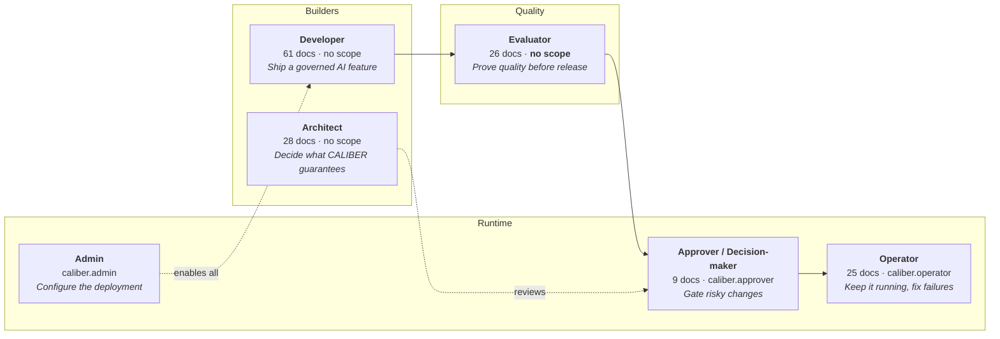

| Persona       | Primary job-to-be-done                                            | Primary surfaces today                                    |
| ------------- | ----------------------------------------------------------------- | --------------------------------------------------------- |
| **Developer** | Author a prompt / workflow / tool and get it working and measured | Prompts, Workflows, Tools, Skills, Cookbooks              |
| **Evaluator** | Prove a change is better, and that the judge can be trusted       | Test Sets, Judges, Evaluations, Review Queues             |
| **Operator**  | Detect, diagnose, and recover failures in production              | Observability, Workflows (runs), Review Queues, Audit Log |
| **Approver**  | Approve or reject a gated change or a paused run                  | Releases, Workflow run approvals, Plans                   |
| **Admin**     | Configure providers, identity, storage, and platform policy       | Administration, Settings, LLM Gateway                     |

**Finding P-2 — the Evaluator is a first-class documented persona with no
permission scope and no home page.** The evaluator's job spans four separate
nav destinations (`/eval-datasets`, `/judges`, `/evaluations`, `/review-queues`)
plus a duplicate testing surface inside `/prompts`. There is no "quality" entry
point that assembles them. Developed in §7.2.

---

## 3. Current Information Architecture

### 3.1 Navigation as implemented

The IA is declared as data in
[Sidebar.tsx:199-261](caliber/caliber-ui/src/components/Sidebar.tsx#L199-L261) —
6 collapsible groups, 21 in-app destinations, plus a Dashboard and an external
Docs link.

```mermaid
flowchart TD
  ROOT["CALIBER"] --> DASH["Dashboard /"]
  ROOT --> B["<b>Build</b>"]
  ROOT --> R["<b>Resources</b>"]
  ROOT --> I["<b>Integrations</b>"]
  ROOT --> E["<b>Evaluate</b>"]
  ROOT --> O["<b>Operate</b>"]
  ROOT --> A["<b>Admin</b>"]
  ROOT --> D["Docs ↗ external"]

  B --> B1["Workflows"]
  B --> B2["Cookbooks"]
  B --> B3["Agents"]
  B --> B4["Plans 🔔"]

  R --> R1["Prompts"]
  R --> R2["Tools"]
  R --> R3["Skills"]
  R --> R4["Knowledge Bases"]
  R --> R5["Object Store"]

  I --> I1["LLM Gateway"]
  I --> I2["MCP Servers"]
  I --> I3["OpenAPI Integrations"]

  E --> E1["Test Sets"]
  E --> E2["Judges"]
  E --> E3["Evaluations"]

  O --> O1["Releases"]
  O --> O2["Observability"]
  O --> O3["Review Queues"]
  O --> O4["Audit Log"]

  A --> A1["Administration"]
  A --> A2["Settings"]

  classDef badged fill:#fef3c7,stroke:#f59e0b
  class B4 badged
```

Only one destination in the entire navigation carries a badge — Plans, driven by
a 30-second poll for paused Aria plans
([Sidebar.tsx:320-339](caliber/caliber-ui/src/components/Sidebar.tsx#L320-L339)).
Everything else requires the user to visit the page to learn whether it wants
them. See §7.3.

### 3.2 Routes vs. navigation: directly addressable but unlinked surfaces

[App.tsx:294-383](caliber/caliber-ui/src/App.tsx#L294-L383) declares 35 route
entries. Nine are detail routes not present in navigation:

| Detail route                               | Reached from     |
| ------------------------------------------ | ---------------- |
| `/tools/:toolId`                           | Tools list       |
| `/agents/:agentId`                         | Agents list      |
| `/skills/:skillId`                         | Skills list      |
| `/eval-datasets/:datasetId`                | Test Sets list   |
| `/evaluations/:runId`                      | Evaluations list |
| `/workflows/:workflowId`                   | Workflows list   |
| `/workflows/:workflowId/editor/:versionId` | Workflow detail  |
| `/workflow-versions/:versionId`            | Workflow detail  |
| `/workflow-runs/:runId`                    | redirect shim    |

**Finding IA-1 — the two multi-step creation wizards have no URL at all.**
`ToolWizard` (976 lines) and `SkillWizard` (1,415 lines) are page-sized
components rendered _inside a tab_ of another page:

- [ToolRegistry.tsx:269](caliber/caliber-ui/src/pages/ToolRegistry.tsx#L269) — `<ToolWizard onClose={() => setActiveTab("registry")} />`
- [Skills.tsx:753](caliber/caliber-ui/src/pages/Skills.tsx#L753) — `<SkillWizard onClose={() => onCreated?.()} />`

2,391 lines of multi-step authoring flow is therefore not linkable, not
bookmarkable, and not recoverable: a refresh or an accidental tab switch
discards in-progress work with no draft persistence. Every other creation
surface in the product (workflow editor, prompt workspace) _does_ have a URL.

### 3.3 Page weight as a proxy for feature density

Measured with `wc -l` over `caliber/caliber-ui/src/pages/` on this branch;
**57,373 lines across 34 page components** (plus the `pages/knowledge/` subdir).

| Page                      | Lines       | Note                                               |
| ------------------------- | ----------- | -------------------------------------------------- |
| `KnowledgeBases.tsx`      | **9,006**   | largest single page in the product                 |
| `Prompts.tsx`             | **8,192**   | the journey named as most important in this review |
| `WorkflowEditor.tsx`      | 5,274       |                                                    |
| `WorkflowDetail.tsx`      | 4,788       |                                                    |
| `McpServers.tsx`          | 3,519       |                                                    |
| `Skills.tsx`              | 2,570       |                                                    |
| `OpenApiIntegrations.tsx` | 2,413       |                                                    |
| `ToolRegistry.tsx`        | 2,352       |                                                    |
| `ObjectStore.tsx`         | 2,067       |                                                    |
| `SkillDetail.tsx`         | 1,642       |                                                    |
| `SkillWizard.tsx`         | 1,415       | no route (§3.2)                                    |
| `ToolWizard.tsx`          | 976         | no route (§3.2)                                    |
| _(22 more)_               | ≤1,144 each |                                                    |

Four pages account for **27,260 lines — 47.5% of all page code** — and each is a
single navigation destination. Page size is not itself a UX defect, but at this
scale it reliably indicates that one destination is being asked to host many
distinct jobs. §8 tests that hypothesis per page and finds it holds.

> **Note on measurement drift.** `Prompts.tsx` is 8,192 lines here; it was 7,732
> on the branch checked out when this review began, having grown 460 lines in
> commit `a9829841b7` ("Add review-first UX for prompt calibration Apply").
> All line citations in this report were re-verified against `70c4e82345`.
> The growth rate is itself relevant to §8: the largest pages are still
> accreting features.

### 3.4 Consistency of shared chrome

Adoption of shared primitives across the 34 pages:

| Primitive       | Pages using it |                                 |
| --------------- | -------------- | ------------------------------- |
| `PageHeader`    | 18 / 34        | 53%                             |
| `SearchInput`   | 12 / 34        | 35%                             |
| `FilterBar`     | 10 / 34        | 29%                             |
| `FilterSelect`  | 9 / 34         | 26%                             |
| `PageTabs`      | 8 / 34         | 24%                             |
| `CopyButton`    | 5 / 34         | 15%                             |
| `ProblemsPanel` | 2 / 34         | 6%                              |
| `EmptyState`    | 1 / 34         | **defined locally, not shared** |

**Finding IA-2 — the shared header component's own contract is not met.**
[PageHeader.tsx:1-5](caliber/caliber-ui/src/components/PageHeader.tsx#L1-L5)
states it is _"Used by every top-level page so the header looks identical
everywhere."_ It is used by 18 of 34.

**Finding IA-3 — breadcrumbs are built and unused.** `PageHeader` accepts a
`crumbs` array for a real trail
([PageHeader.tsx:15-16](caliber/caliber-ui/src/components/PageHeader.tsx#L15-L16)),
and defaults to a flat `Dashboard › <title>` when omitted
([PageHeader.tsx:36](caliber/caliber-ui/src/components/PageHeader.tsx#L36)).
Exactly one page passes `crumbs`: `ObjectStore.tsx`. So on all nine detail
routes — including `/workflows/:id/editor/:versionId`, three levels deep — the
breadcrumb claims the user came from the Dashboard and offers no way back up to
the parent object. The capability to fix this already exists and is a one-line
change per page.

**Finding IA-4 — `EmptyState` is a local function inside a 4,788-line page.**
Defined at
[WorkflowDetail.tsx:177](caliber/caliber-ui/src/pages/WorkflowDetail.tsx#L177)
and used four times within that same file. No other page can reach it, so empty
states elsewhere are hand-rolled or absent — the highest-leverage moment for a
new user is the least standardised surface in the product.

### 3.5 Global wayfinding: what does not exist

Verified absent across `caliber/caliber-ui/src` (no matching component, and no
supporting dependency in `package.json`):

- **No command palette / global search.** No `cmdk`, `fuse`, or equivalent
  dependency; no palette component. With 21 destinations and nine detail routes,
  every navigation is a manual sidebar traversal.
- **No global keyboard shortcuts.** Six page-local `keydown` handlers exist
  (`WorkflowEditor.tsx:3026`, `Prompts.tsx:219`, `Workflows.tsx:307`,
  `ObjectStore.tsx:395`, and two in the assistant panel) — so shortcuts are a
  per-page dialect rather than a product-level contract.
- **No cross-object search.** A user who remembers an object's name but not its
  type has no way to find it.

---

## 4. End-to-End User Journey Maps

Each journey below was traced by reading the implementing components, not by
reasoning about what the product probably does. Step counts are discrete user
interactions (clicks, typed fields, tab switches, modal opens), counted along
the _fastest_ verified path — they are floors, not averages.

### 4.1 Journey: Prompt Management (Developer → Evaluator)

The named journey for this review. Six stages are declared "in pipeline order"
at [Prompts.tsx:71](caliber/caliber-ui/src/pages/Prompts.tsx#L71) with the intent
recorded in a source comment at
[Prompts.tsx:67](caliber/caliber-ui/src/pages/Prompts.tsx#L67) — a comment the
user never sees.

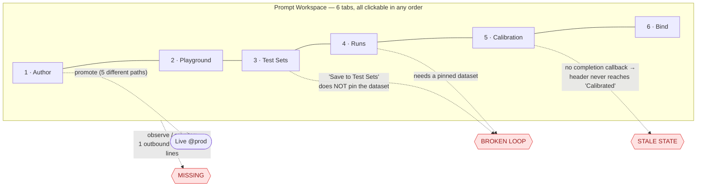

**The declared pipeline is not the reachable pipeline.** Three of the twelve
journey steps named in the review brief are absent or broken in the
implementation:

| Journey step               | Status                                                          | Evidence                          |
| -------------------------- | --------------------------------------------------------------- | --------------------------------- |
| Create                     | Over-built — 4 on-ramps, only 1 has a stepper                   | `PromptBuilder.tsx:63`, `:1009`   |
| **Configure model**        | **Not in Author at all** — a per-tab `AssistantConfig` mutation | `Prompts.tsx:3163`, `:4790`       |
| Configure variables        | Create-time only; lost after creation                           | `PromptBuilder.tsx:2214`, `:2234` |
| Author / version           | Works well                                                      | `Prompts.tsx:1720`, `:1917`       |
| Test                       | Duplicative (two runners)                                       | `Prompts.tsx:4620` and `:1936`    |
| Evaluate / baseline / diff | **Strongest surface in the product**                            | `Prompts.tsx:2342-2472`           |
| Calibrate                  | Overloaded; stale state                                         | `Prompts.tsx:5719`                |
| Bind                       | Works, partly non-functional pickers                            | `Prompts.tsx:2570`                |
| Deploy / publish           | 5 competing paths, inconsistent governance                      | §5.1.5                            |
| **Monitor**                | **Absent** — one outbound link in 8,192 lines                   | `Prompts.tsx:5388`                |
| **Maintain**               | **Absent** — delete / delete-all only                           | `Prompts.tsx:1307`                |

### 4.2 Journey: Workflow authoring & recovery (Developer → Operator)

The workflow journey spans **~700 KB of TSX across 35 components**
(`Inspector.tsx` alone is 6,611 lines with ~45 distinct panels).

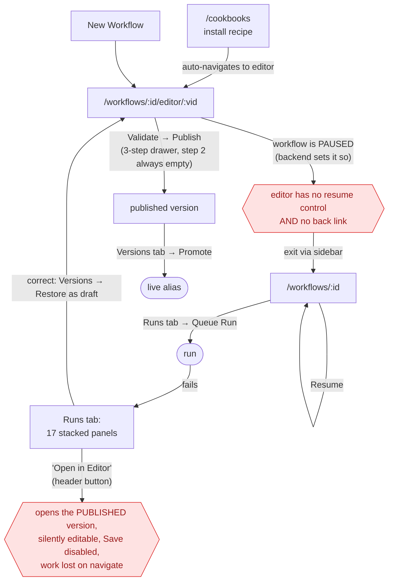

| Journey                               | Interactions | Pages  | Notes                                                               |
| ------------------------------------- | ------------ | ------ | ------------------------------------------------------------------- |
| Install cookbook → running workflow   | 8–10         | 3      | includes one forced wrong turn (the pause/resume split)             |
| Author from scratch → published run   | 12–14        | 2      | includes a mandatory click through a permanently-empty publish step |
| **Debug a failed run → deployed fix** | **14–18**    | **3+** | the primary header button leads to silent data loss                 |

Three structural findings, developed in §5.2: publishing is **not required to
run** (the editor posts a draft, or even an unsaved manifest snapshot); the only
**Compile/Export** affordance in the product sits on a route nothing links to;
and **19 helper functions are copy-pasted verbatim** between the two largest
files in the journey.

### 4.3 Journey: Evaluation & judge trust (Evaluator)

Both evaluator loops are _open_ — they do not return to their starting point.

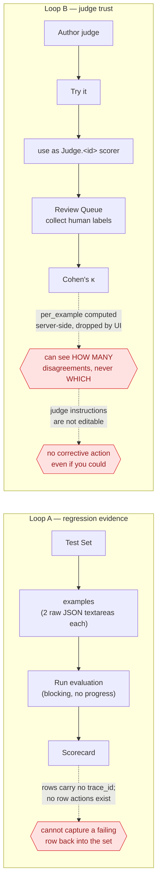

**Step count from nothing to a first scored evaluation: 16 interactions**
minimum; **~46 for a realistic 5-example set with one judge**, of which **10 are
hand-authored JSON blobs**. There is no wizard, no template, no seeded example,
and no bulk import — despite the backend already modelling file-backed dataset
examples (`CaliberEvalDatasetFile`, `db/models.py:1949-1957`) with **zero UI
references**.

**The single most severe finding in the whole review sits here:** the human
reviewer is never shown the thing being reviewed. `ReviewForm` renders
`item.trace_id` and the questions and nothing else
([ReviewQueues.tsx:575-604](caliber/caliber-ui/src/pages/ReviewQueues.tsx#L575-L604)).
A person is asked _"Pass or Fail?"_ about `tr-abc123`. The backend proves the
data is available — it calls `fetch_trace_detail(item.trace_id)` in the
alignment path ([review_queues.py:476](caliber/src/caliber/routes/review_queues.py#L476))
— but `GET /review-queues/{id}` returns only ids (`:218-235`). **Every human
label, every κ, and every gate decision downstream is built on labels produced
without evidence.**

### 4.4 Journey: Knowledge base build & retrieval tuning (Developer)

One route, **9,006 lines, ~55 distinct feature areas, 66 `useState` hooks**.
About 20 areas are core; ~33 are expert-only; one is dead code.

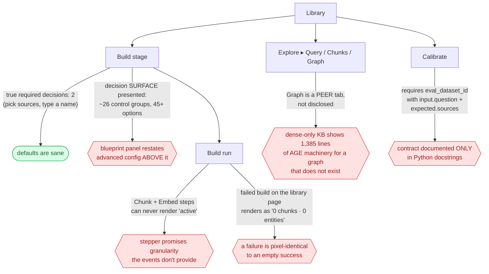

**The defaults are genuinely good and the product never says so.** The submit
gate requires only a bucket, ≥1 source, and a name; chunking, embedding, and the
entire graph config are pre-seeded from server defaults. Nothing on the page
tells the user _"defaults are fine — pick files and go."_

**The worst defect in this journey is a cross-page schema contract with no UI
expression.** KB calibration requires `input["question"]`
([service.py:5278-5282](caliber/src/caliber/knowledge/service.py#L5278-L5282))
and `expected = {"sources": [...], "answer": "..."}`
([calibration.py:99-131](caliber/src/caliber/knowledge/calibration.py#L99-L131)).
The dataset editor defaults to `{"input": ""}` / `{"expected": ""}`
([EvalDatasetDetail.tsx:523-528](caliber/caliber-ui/src/pages/EvalDatasetDetail.tsx#L523-L528))
and the strings `"question"` and `"sources"` **appear nowhere in that file**.
Wrong key → HTTP 400 _"eval dataset 'X' has no examples"_ — a message that is
actively false, since the dataset visibly does have examples.

### 4.5 Journey: Tool / integration governance (Developer → Admin)

**There are four different doors to a callable tool, split across two nav
groups, with four different default governance postures.**

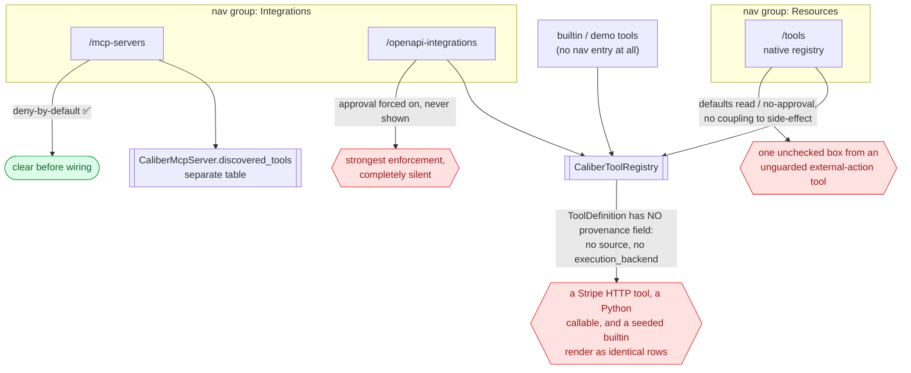

| Journey                                                                | Steps | Page contexts | Key friction                                                                                                                            |
| ---------------------------------------------------------------------- | ----- | ------------- | --------------------------------------------------------------------------------------------------------------------------------------- |
| A · Tool: register → schema → test → cases → calibrate → bind          | ~12   | 3             | wizard step 4 of 5 is **structurally unreachable**; 3 competing Calibrate entry points; **bind has no home in the tool surface at all** |
| B · Skill: author → render → trigger-test → package → calibrate → bind | ~15   | 2–3           | packaging lives only on a route with **no inbound links**; wizard step 4 is write-only; workflow bind needs a **hand-typed `node_id`**  |
| C · MCP: connect → test → discover → policy → invoke → calibrate       | ~13   | 1             | most coherent flow in the product — but the workflow binding **discards the policy you just set**                                       |
| D · OpenAPI: import → publish → govern                                 | ~16   | 1             | best-staged pipeline; the `requires_approval` outcome is never surfaced                                                                 |

**Three parallel 6-stage workspaces exist for Prompts, Skills, and Tools with the
same skeleton and three different vocabularies:**

| #   | Prompts         | Skills        | Tools         |
| --- | --------------- | ------------- | ------------- |
| 1   | author          | author        | **spec**      |
| 2   | playground      | **render**    | **sandbox**   |
| 3   | test-sets       | **trigger**   | **fixtures**  |
| 4   | runs            | **scenarios** | runs          |
| 5   | **calibration** | runs          | **hardening** |
| 6   | bind            | bind          | **publish**   |

Their lifecycle ladders are the same five rungs renamed twice
(`Draft → Has test set/scenarios/fixtures → Tested → Calibrated/Hardened →
Bound/Published`), and the tool ladder awards its **top** rung to a tool that is
bound to nothing ([tools.py:1133-1134](caliber/src/caliber/routes/tools.py#L1133-L1134)).

### 4.6 Journey: First run & operate (all personas)

**There is no onboarding.** No first-run detection exists anywhere in the
codebase — no `hasData` / `isEmpty` / `firstRun` branch, no checklist, no tour,
no dismissible getting-started card.

What a brand-new user sees on an empty deployment at `/`:

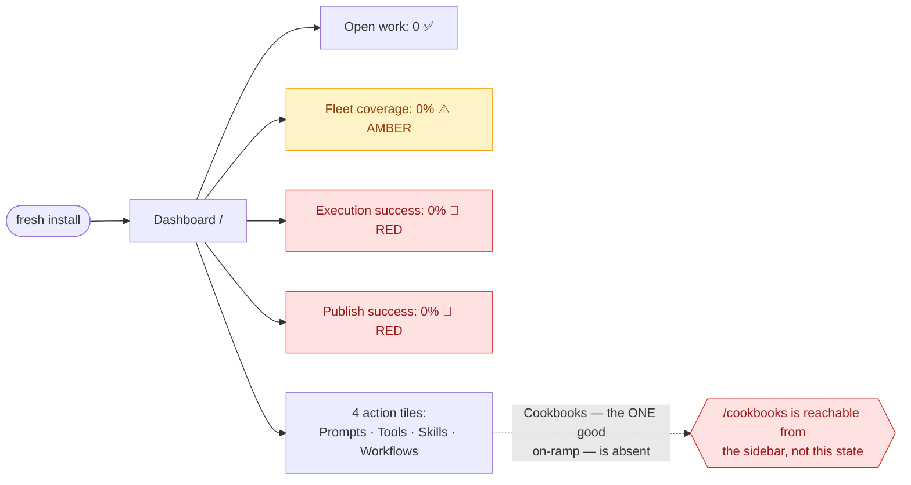

**A fresh install opens on two red 0% reliability tiles and an amber 0% coverage
tile — three false alarms before the user has done anything.** The tone logic
has no zero-denominator branch
([Overview.tsx:191-196](caliber/caliber-ui/src/pages/Overview.tsx#L191-L196),
`:233-244`), and the two "Awaiting signal" fallbacks that would have prevented
this are **dead code**: `assistant_slo` is non-optional, so the ternary always
takes the truthy branch and prints `0/0 completed`.

Every empty state in the operate/admin surfaces is a terminal statement.
Verbatim: _"No recent events yet."_ · _"No workflow calibration jobs have been
recorded yet."_ · _"Nothing deployed yet in your visible projects."_ · _"No
audit entries recorded yet."_ **Exactly one** contains a call to action —
Observability's _"No traces yet. Run a workflow or agent with tracing enabled,
then refresh."_ ([Observability.tsx:388-395](caliber/caliber-ui/src/pages/Observability.tsx#L388-L395)).

---

## 5. Detailed Workflow Analysis

### 5.1 Prompt Management

#### 5.1.1 The happy path costs 16 interactions — and the cheap path is hidden

Fastest verified route to "author a prompt and get a scored regression result",
via the paste on-ramp:

| #   | Interaction                                              | Evidence                                        |
| --- | -------------------------------------------------------- | ----------------------------------------------- |
| 1   | Sidebar → Prompts                                        | `Sidebar.tsx:214`                               |
| 2   | **New prompt**                                           | `Prompts.tsx:793`                               |
| 3   | Choose **Write / paste**                                 | `PromptBuilder.tsx:1179`                        |
| 4   | Type template                                            | `PromptBuilder.tsx:1157`                        |
| 5   | Type name                                                | `PromptBuilder.tsx:1193`                        |
| 6   | **Create** _(silently promotes to live)_                 | `PromptBuilder.tsx:1268`, promote at `:766-772` |
| 7   | Tab → Test Sets                                          | `Prompts.tsx:102`                               |
| 8   | **Generate Test Cases** _(LLM wait)_                     | `Prompts.tsx:5258`                              |
| 9   | **Run Tests & Judge** _(10 sequential LLM calls at N=5)_ | `Prompts.tsx:5311`, runner at `:4315-4358`      |
| 10  | Tab → Runs                                               | `Prompts.tsx:116`                               |
| 11  | **Set as baseline**                                      | `Prompts.tsx:2284`                              |
| 12  | Tab → Author                                             | `Prompts.tsx:74`                                |
| 13  | Edit template                                            | `Prompts.tsx:1824`                              |
| 14  | **Save & promote**                                       | `Prompts.tsx:1906`                              |
| 15  | Tab → Runs                                               | —                                               |
| 16  | **Run tests** _(LLM wait)_                               | `Prompts.tsx:2241`                              |

**16 interactions, 4 tab switches, 3 LLM waits.** The template on-ramp — the
visually primary one — costs **28–35 interactions** for the same outcome
(Step 1 search + goal facets + method multi-select + template card; Step 2
modifiers + 5 element overrides + 3 variable textareas; Step 3 goal + methods +
name + commit: `PromptBuilder.tsx:1583-1615`, `:2214-2253`, `:2344-2485`).

Step 9 issues **two sequential LLM round-trips per test case** (one agent
session, one judge session) with no concurrency and **no cancel control**
([Prompts.tsx:4315-4358](caliber/caliber-ui/src/pages/Prompts.tsx#L4315-L4358)).
At the default N=5 that is 10 serial model calls behind one button.

#### 5.1.2 The core regression loop is broken by a state bug — and the error message prescribes the fix that does not work

> **Persona:** Developer / Evaluator
> **Job-to-be-done:** "Prove my new prompt version didn't regress."
> **Current experience:** Build a test set on the Test Sets tab → click _Save to
> Test Sets_ → go to Runs → click _Run tests_ → get told to go build a test set.
> **Problem:** `optimizer_config.dataset_id` is written in exactly one place in
> the entire backend — `enqueue_prompt_optimization_run`
> ([routes/prompts.py:473](caliber/src/caliber/routes/prompts.py#L473)) — i.e.
> **only a calibration run pins a dataset.** `saveToEvalDataset`
> ([Prompts.tsx:4996](caliber/caliber-ui/src/pages/Prompts.tsx#L4996)) creates
> the dataset and fires `onDatasetSaved`, which in Workspace mode only calls
> `refreshWorkspace()` ([Prompts.tsx:1676](caliber/caliber-ui/src/pages/Prompts.tsx#L1676))
> — nothing persists the id. So `PromptRunsStage`'s
> `datasetId = workspace?.dataset_id ?? null`
> ([Prompts.tsx:1948](caliber/caliber-ui/src/pages/Prompts.tsx#L1948)) stays
> `null` forever.
> **Evidence:** the dead-end message reads _"No test set is pinned and no
> previous run exists. **Build one on the Test Sets tab first.**"_
> ([Prompts.tsx:2110](caliber/caliber-ui/src/pages/Prompts.tsx#L2110)).
> Following that instruction does not clear it. The only escapes are to run
> tests _on the Test Sets tab_ so a prior run exists to scavenge cases from
> (`:2054-2093`), or to start a calibration run. Consequently the lifecycle
> status `Has test set`
> ([prompt_targets.py:125](caliber/src/caliber/prompt_targets.py#L125)) is
> **unreachable** except via Calibration.
> **User impact:** the single most important loop in the product — regression
> testing a prompt — dead-ends on first use, and the remediation text is wrong.
> A new user reasonably concludes the feature is broken.
> **Recommendation:** have `saveToEvalDataset` write `optimizer_config.dataset_id`,
> **or** give Runs an explicit dataset picker (preferred: it removes the hidden
> coupling entirely and makes the dependency visible).
> **Expected improvement:** removes a hard dead-end from the primary journey and
> makes one of five lifecycle states reachable.
> **Priority: Critical**

#### 5.1.3 Long-running work loses its status the moment you look away

Polling exists in exactly **one** place in this 8,192-line page: the Calibration
tab polls its job and the assistant operation every 2s
([Prompts.tsx:6541-6575](caliber/caliber-ui/src/pages/Prompts.tsx#L6541-L6575),
`:6357-6389`). Both are unmounted on tab switch.

`PromptOptimizationTab` is passed **no completion callback** — only
`prompts`/`loading`/`lockedPrompt`
([Prompts.tsx:1690-1694](caliber/caliber-ui/src/pages/Prompts.tsx#L1690-L1694)).
Every sibling stage has one: Author `onSaved` (`:1659`), Test Sets
`onDatasetSaved` (`:1676`), Runs `onAfterRun` (`:1687`), Bind `onBound` (`:1701`).

Consequences, all verified:

1. After a calibration Apply succeeds, the workspace header **does not** flip to
   `Calibrated`; `has_applied_job` is only re-read by `GET /workspace`
   ([routes/prompts.py:2204](caliber/src/caliber/routes/prompts.py#L2204)). The
   user must navigate away and back.
2. Leave the Calibration tab while a job is `running` and **there is no queued-job
   indicator anywhere in the product** — the poll is gone and no badge exists.
3. Everything else is fire-and-forget behind a manual **Refresh** link (Runs
   history `:2472`, Recent Prompt Runs `:7463`).

**The backend already solved half of this and the UI discards it.**
`PromptWorkspaceResponse` returns `last_run` and `baseline_run` summaries
([routes/prompts.py:2280-2290](caliber/src/caliber/routes/prompts.py#L2280-L2290))
with a comment stating they exist so _"the Runs tab can mark/compare against it
without a second round-trip"_ (`:2262`). **No `.tsx` file reads either field**;
Runs re-fetches both details itself (`:2004`, `:2028`).

#### 5.1.4 Validation errors are captured, typed, and thrown away

The backend returns structured field errors:
`{"detail": "request body validation failed", "errors": [{loc, msg, type}]}`
([routes/\_errors.py:39-68](caliber/src/caliber/routes/_errors.py#L39-L68)).
The client **models them** — `ApiErrorBody.errors?: Array<{loc, msg, type}>`
([api/types.ts:52](caliber/caliber-ui/src/api/types.ts#L52)) — and `ApiError`
carries the parsed body
([api/caliberApi.ts:321-327](caliber/caliber-ui/src/api/caliberApi.ts#L321-L327)).
But the throw keeps only `detail`
([caliberApi.ts:731-732](caliber/caliber-ui/src/api/caliberApi.ts#L731-L732)),
and **no component anywhere reads `.errors`**. Every renderer is
`err instanceof Error ? err.message : "…"` (`Prompts.tsx:544`, `:1804`, `:2135`,
`:2153`, `:2653`, `:4878`, `:5027`, `:6522`, `:6662`, `:6729`).

**Net effect:** any malformed prompt / bind / baseline / calibration payload
shows the literal string **"request body validation failed"** — no field, no
reason, no fix. This is a product-wide defect surfaced here, and the fix is one
shared error component; the data is already on the wire. **Priority: High.**

#### 5.1.5 "Promote to live" has five paths and three different governance rules

| Path                                   | Gate-aware?                                             | Evidence                           |
| -------------------------------------- | ------------------------------------------------------- | ---------------------------------- |
| Author → _Save & promote_              | No — hardcodes `overridden: true`                       | `Prompts.tsx:1906` → `:1789-1794`  |
| `VersionPanel` → _Promote_             | **Yes** — reads verdict, requires typed override reason | `VersionPanel.tsx:151`, `:215-218` |
| Versions modal → _Make live_ (per row) | No                                                      | `Prompts.tsx:1047`                 |
| Compare diff → _Promote v{n}_          | No                                                      | `Prompts.tsx:1160-1175`            |
| Calibration → _Apply candidate live_   | **Yes** — hard-blocks a failed gate                     | `Prompts.tsx:7933`                 |

Only two of five paths honour the release gate. The other three hardcode
`overridden: true`, and the backend treats the verdict as advisory by design
([docs/02-prompts/architecture.md:302](docs/02-prompts/architecture.md#L302)), so
nothing catches it. **Governance is therefore a function of which button the
user happened to find.**

Worse, one path promotes without saying so: the Edit modal's button reads
**"Save as New Version"** ([Prompts.tsx:943](caliber/caliber-ui/src/pages/Prompts.tsx#L943))
but `submitEditPrompt` also calls `promotePrompt` with
`override_reason: "direct prompt edit activation"` (`:530-534`). **It goes
live.** A button that ships to production without using the word "live",
"promote", or "deploy" is a correctness problem, not a copy problem.
**Priority: Critical.**

**Rollback is available on exactly one surface** — `VersionPanel`, buried under
Author's Version history (`adapters.ts:52-54`). The modal literally named
"Versions" has **no rollback**, so rolling back from there means _promoting_ an
older version — which emits a `promote_prompt` audit event instead of
`rollback_prompt` ([Releases.tsx:38-39](caliber/caliber-ui/src/pages/Releases.tsx#L38-L39)),
corrupting the audit trail for the operator persona downstream.

#### 5.1.6 The page scores prompts with an unregistered judge, so its numbers can't be compared to the product's own evaluation surface

The Prompts page never touches `/judges` — **zero references**. It scores with a
judge prompt hardcoded in the frontend bundle
([Prompts.tsx:4331-4346](caliber/caliber-ui/src/pages/Prompts.tsx#L4331-L4346),
invoked at `:4351`), returning `{verdict, score, reasoning}`.

| Capability                           | Prompts page        | `/evaluations`                                                                           |
| ------------------------------------ | ------------------- | ---------------------------------------------------------------------------------------- |
| Score a prompt version on a test set | inline ad-hoc judge | `predictTarget="prompt"`, subject `name@version` (`Evaluations.tsx:323`, `:332`, `:348`) |
| Grader choice                        | 1 hardcoded string  | `AVAILABLE_SCORERS` + registered judges (`Evaluations.tsx:355-400`)                      |
| Registered LLM judges                | **unreachable**     | first-class (`Evaluations.tsx:377-399`)                                                  |

So _"is v3 better than v2 on this test set?"_ has **two answers computed by two
different scoring stacks**, and the prompt-page answer is unversioned,
unregistered, and unauditable. This directly contradicts canonical design
principle #4, "Evaluation by Design."

**And the inline judge manufactures false regressions.** Unparseable judge output
becomes a **`fail` with score 0** and `reasoning: "Judge response was not valid
JSON"` (`:4370`, `:4381`) — indistinguishable in the scorecard from a genuine
behavioural failure. A flaky judge therefore produces fake entries in the
`Vs. baseline` regression list, which is the one panel the user is most likely
to trust. **Priority: High.**

#### 5.1.7 Cognitive load: 17 concurrent concepts, and the vocabulary collides

A user must hold: prompt · prompt_name · agent_id · agent_name · hidden prompt
target · alias · version · artifact_ref · test case · test set · eval dataset ·
test run · baseline run · refinement job · candidate · scorer · judge — plus
optimizer ("Calibration Strategy"), gate thresholds, and a 5-value lifecycle
status.

**One thing, two names:**

| Concept      | Name A                                                              | Name B                                | Evidence                                                   |
| ------------ | ------------------------------------------------------------------- | ------------------------------------- | ---------------------------------------------------------- |
| Eval dataset | "Test Sets"                                                         | "Eval Dataset" / "Existing Dataset"   | `Prompts.tsx:102`, `Sidebar.tsx:238` vs `Prompts.tsx:7089` |
| Optimizer    | "Calibration Strategy"                                              | `optimizer_type`                      | `:7069` vs `:6675`                                         |
| Calibration  | "Calibration" (tab)                                                 | "Optimization" (component + endpoint) | `:130` vs `:5719`, `/prompts/optimization/runs`            |
| Promote      | "Save & promote" / "Make live" / "Apply candidate live" / "Promote" | —                                     | `:1906`, `:1047`, `:7946`, `VersionPanel.tsx:188`          |

**One name, two things:** "Test Sets" is both a workspace stage (`:102`) and the
top-level page (`Sidebar.tsx:238`); "Runs" is both prompt _test_ runs (`:116`)
and calibration _jobs_ ("Recent Prompt Runs", `:7461`) in adjacent tabs;
"Judge" is both the inline string (`:4351`) and the registered entities on
`/judges`; "baseline" is both the pinned test run (`:1949`) and the
pre-optimization score in the Apply dialog (`:7615`).

**A documented implementation detail is surfaced as a user-facing label.**
`agent_id` is described in
[prompt_targets.py:29-38](caliber/src/caliber/prompt_targets.py#L29-L38) as
_"an implementation detail, never something an operator manages directly."_ It
is displayed on every prompt card (`:3931`), keys the Edit modal's switcher
(`:838`), and populates a picker whose `aria-label` is "Select a prompt"
(`:4538`) with agent ids.

**Alias exposure is exactly inverted against its own rule.**
`lib/environment.ts:12` sets `SINGLE_ENVIRONMENT = true` and instructs at
`:16-19` to _"never surface it to users; show neutral wording like
'Live'/'Deployed'."_ Author and Edit correctly hide their selectors behind
`!SINGLE_ENVIRONMENT` (`:897`, `:1850`) — but three no-op alias dropdowns remain
unconditionally visible (Playground `:3379`, Test Sets `:5121`, Calibration
`:7046`), each offering a single option, `@prod`: the exact string the rule
forbids showing. **Priority: Medium** (trivial fix, pure noise removal).

#### 5.1.8 Dead controls and stale copy

- **A checkbox that does nothing.** "Open Prompt Calibration after save"
  (`PromptBuilder.tsx:1250`, default `true` at `:197`) passes
  `{ openCalibration }` (`:724`), but the call site drops it —
  `onCreated={(created) => onPromptCreated(created)}`
  ([Prompts.tsx:1654](caliber/caliber-ui/src/pages/Prompts.tsx#L1654)). You
  always land on Author (`:1537`). It only changes the button label to
  "Create and Open" (`:1278`). **The button lies.**
- **~150 lines of dead code with the stepper the page needs.**
  `PromptCalibrationTab` (`:4469-4618`) renders a real numbered stepper
  (`CalibrationStep` / `StepConnector`, `:4580-4615`). **Nothing renders it** —
  zero references outside its own definition, including tests. The import at
  `:35` is reachable only through dead code. The affordance that would fix
  §5.1.9 already ships, unused.
- **Copy referring to a tab that does not exist:** "Create a prompt on the
  Create Prompt tab" (`:3320`, `:5063`, `:6777`) — the entry point is the
  _New prompt_ button (`:793`).
- **`Delete all (N)`** (`:1307-1329`) — a single-confirm loop over every deployed
  prompt (`:592-629`), sitting in the browse toolbar next to the view toggle.

#### 5.1.9 Stage order is neither enforced nor discoverable

`PageTabs` renders plain buttons — no `disabled`, no step numbers, no completion
marks, no progress
([components/PageTabs.tsx:24-51](caliber/caliber-ui/src/components/PageTabs.tsx#L24-L51)).
All six stages are clickable at all times, in any order. The only ordering
signals are the array order, an invisible source comment (`:67`), and a status
pill whose five values _do_ encode the pipeline (`PROMPT_STATUS_TONES`, `:169`)
but which never maps back to a tab and never marks one "next".

#### 5.1.10 Prompts: Keep / Improve / Consolidate / Hide / Remove

| Verdict         | Item                                                                              | Justification                                                                                                                                        |
| --------------- | --------------------------------------------------------------------------------- | ---------------------------------------------------------------------------------------------------------------------------------------------------- |
| **Keep**        | `Vs. baseline` panel (`:2342-2472`)                                               | Best surface in the product: net delta, explicit regression definition (`:2404`), per-case output diff, input-text fallback alignment (`:2171-2178`) |
| **Keep**        | `CalibrationApplyReviewDialog` (`:7654-7954`)                                     | Only place a production change is gated on evidence; Apply disabled on failed gate (`:7933`)                                                         |
| **Keep**        | `VersionPanel` promote/rollback (`:1917`)                                         | Only gate-aware, override-audited release path                                                                                                       |
| **Keep**        | Auto-provisioned hidden prompt targets                                            | Correctly removes an agent-registration step — wrong only in its exposure                                                                            |
| **Improve**     | Pin the dataset on save (§5.1.2)                                                  | Unblocks the primary loop                                                                                                                            |
| **Improve**     | Add `onApplied` callback at `:1690`                                               | Header reaches `Calibrated` without navigating away                                                                                                  |
| **Improve**     | Render `ApiErrorBody.errors` (§5.1.4)                                             | Data already on the wire; kills "request body validation failed"                                                                                     |
| **Improve**     | Consume `workspace.last_run`/`baseline_run`                                       | Backend added them for exactly this (`routes/prompts.py:2262`); removes 2 round-trips                                                                |
| **Improve**     | Stop swallowing errors (`:1988`, `:4788`, `:6178`, `:2603`, `:3129`)              | Auth failures currently render as cheerful empty states                                                                                              |
| **Improve**     | Rename "Save as New Version" (`:943`)                                             | It promotes to live                                                                                                                                  |
| **Improve**     | Show stage order — reuse the shipped `CalibrationStep`                            | Fixes §5.1.9 with existing code                                                                                                                      |
| **Consolidate** | Two run surfaces → one (keep Runs)                                                | `:4620` and `:1936` share `runPromptTestCases` (`:4298`) and one endpoint                                                                            |
| **Consolidate** | Two run histories → one (`:2465`, `:5536`)                                        | Same endpoint, neither aware of the other                                                                                                            |
| **Consolidate** | Dataset authoring → `/eval-datasets`                                              | Page mints a new dataset per click (`:4998-5003`), accumulating date-named near-duplicates                                                           |
| **Consolidate** | Three diff renderers → one (`:1060`, `:7869`, unused `PromptDiff.tsx`)            | Same job, three implementations                                                                                                                      |
| **Consolidate** | Five promote paths → two                                                          | Author-time save+promote, release-time gated promote                                                                                                 |
| **Consolidate** | Adopt registered `/judges` (§5.1.6)                                               | Makes prompt scores comparable and auditable                                                                                                         |
| **Consolidate** | Reuse shared `CalibrationPanel` as Tools/MCP do                                   | Prompts hand-rolls ~1,800 equivalent lines                                                                                                           |
| **Hide**        | Assistant-Guided Calibration (`:6804-7014`)                                       | Currently the _first_ thing in the tab, above the real form; leaks `plan_id`/`operation_id`/`trace_id`/`correlation_id` (`:6947-7009`)               |
| **Hide**        | Per-scorer weight + JSON config (`:7217-7265`)                                    | Expert control with server defaults                                                                                                                  |
| **Hide**        | Gate thresholds (`:7276-7297`)                                                    | Free-text numerics, no validation/units; defaults exist (`:6456-6460`)                                                                               |
| **Hide**        | Test-case count UI (`:5140-5202`)                                                 | Spinner + stepper + 7 chips + hint, for one integer 1–50                                                                                             |
| **Hide**        | Playground file attachment (48 extensions, `:3019-3069`)                          | A chat feature inside a prompt-QA tool                                                                                                               |
| **Remove**      | `PromptCalibrationTab` (`:4469-4618`)                                             | Dead code                                                                                                                                            |
| **Remove**      | "Open Prompt Calibration after save" checkbox                                     | Non-functional; mislabels the button                                                                                                                 |
| **Remove**      | Stale "Create Prompt tab" copy (`:3320`, `:5063`, `:6777`)                        | Refers to nothing                                                                                                                                    |
| **Remove**      | `Delete all (N)` from the browse toolbar (`:1307`)                                | Destructive bulk action in a filter bar; belongs in Administration                                                                                   |
| **Remove**      | In-modal "Switch prompt" dropdown (`:825-849`)                                    | Changes the edit subject behind a `window.confirm` (`:482`)                                                                                          |
| **Remove**      | Duplicate `/prompts/optimization/*` route aliases (`routes/prompts.py:2427-2438`) | Same handlers; the direct source of the Calibration/Optimization vocabulary split                                                                    |

### 5.2 Workflow authoring & recovery

#### 5.2.1 The primary header button causes silent data loss

> **Persona:** Developer / Operator
> **Job-to-be-done:** "Fix the workflow that just failed."
> **Current experience:** From a failed run, click the header's **Open in
> Editor** — the obvious next action. Edit the graph. Watch the save chip turn
> amber, reading **"Unsaved"**. Find **Save** greyed out with no tooltip.
> Navigate away. Lose everything.
> **Problem:** "Open in Editor" resolves `latest.version_id` as
> `versions.find(published) ?? versions[0]`
> ([WorkflowDetail.tsx:1404-1405](caliber/caliber-ui/src/pages/WorkflowDetail.tsx#L1404-L1405))
> — i.e. the **published, immutable** version, not the run's version and not a
> draft. The editor computes `published`
> ([WorkflowEditor.tsx:2072](caliber/caliber-ui/src/pages/WorkflowEditor.tsx#L2072))
> and uses it to disable Undo, Redo, Save, and Publish (`:4103`, `:4114`,
> `:4123`, `:4205`) — but **`patchManifest` has no `published` guard at all**,
> so every canvas drag, edge wire, and Inspector edit still mutates state and
> sets `dirty`. Autosave correctly refuses (`:3076`, `:3083`).
> **Evidence:** there is no read-only banner anywhere — a grep for
> `read-only|readOnly|immutable|cannot be edited` in `WorkflowEditor.tsx`
> returns nothing. The backend is unambiguous: `409 "only draft versions can be
edited (published is immutable)"`
> ([workflow_versions.py:633-636](caliber/src/caliber/routes/workflow_versions.py#L633-L636)).
> **User impact:** uncommitted work is destroyed, reached from the most
> prominent button on the page, with the UI actively signalling "Unsaved" —
> i.e. it tells the user there is something to save while making saving
> impossible and never saying why.
> **Recommendation:** guard `patchManifest` on `published`; add a read-only
> banner with a one-click **Restore as draft** (the mutation already exists at
> `WorkflowDetail.tsx:1416-1426`).
> **Expected improvement:** removes the highest-severity data-loss path in the
> product and shortens the debug journey by the wrong turn it currently forces.
> **Priority: Critical**

#### 5.2.2 The only Compile and Export affordance is on a route nothing links to

`WorkflowVersionDetail` is the sole surface with a **Compile** button
([WorkflowVersionDetail.tsx:202-210](caliber/caliber-ui/src/pages/WorkflowVersionDetail.tsx#L202-L210)),
a compiler report (`:319-331`), generated Python (`:333-343`), and YAML/Python
export (`:211-228`). **Nothing in the app links to `/workflow-versions/:id`** —
the only references to that path are the route declaration and API helpers. The
Versions tab links every row to the _editor_ instead (`WorkflowDetail.tsx:3236-3241`).

Consequence: `compile_version_route` returns a structured
`{detail, status_code, report}` on `CompileError`
([workflow_versions.py:686-699](caliber/src/caliber/routes/workflow_versions.py#L686-L699))
and the only renderer for it is unreachable. In practice compile errors reach
users as an opaque publish failure — `setMessage("Publish failed: " +
err.message)` (`WorkflowEditor.tsx:2105`) in a small grey toolbar pill, wrapping
the backend's `"version does not compile: {exc}"`.

#### 5.2.3 Publishing is not required to run, and the state machine is not visible

`create_workflow_run` gates on queue-enabled, MCP preflight, paused, and
archived — but **never checks `version.status`**
([workflow_runs.py:602-635](caliber/src/caliber/routes/workflow_runs.py#L602-L635)).
The editor posts `workflow_version_id` with `source: "editor"` and an inline
`manifest` when dirty (`WorkflowEditor.tsx:2125-2135`). So a draft — or even an
unsaved snapshot — produces a real, persisted run, and `WorkflowDetail`'s
"manual (latest version)" alias resolves to `versions[0]` when nothing is
published, meaning it will run a **draft** while labelled "latest version".

| State                                 | Visible where                                    | Invisible where                                                     |
| ------------------------------------- | ------------------------------------------------ | ------------------------------------------------------------------- |
| Workflow `active`/`paused`/`archived` | detail header, list chips                        | **all of `WorkflowEditor`**                                         |
| Version `draft`/`published`           | editor chip, Versions table                      | **the Graph tab** — renders `latest.manifest` with no version label |
| Live / deployed                       | the hidden Deployments tab, `VersionPanel` badge | header, Graph tab, Runs tab                                         |

**"Why can't I run this yet?"** is computed with five branches
(`WorkflowDetail.tsx:1492-1507`) and surfaced **only as a native `title=`
tooltip** on the disabled button (`:3531-3532`). The single most likely
blocker — `!queueRunsEnabled` — gets no inline banner at all.

Worse, that blocker names a setting the UI cannot change.
`workflow_run_queue_enabled`, `..._runtime_approvals_enabled`, and
`..._checkpointing_enabled` all default to `False`
([config.py:539-559](caliber/src/caliber/config.py#L539-L559)) and are flipped
on only by the dev/e2e scripts. `Settings.tsx` has five tabs and **no run-queue
toggle**; `Administration.tsx` has none either. So the message _"Enable the run
queue to execute workflows"_ names an action no page can perform — and on
library defaults **every run button in the product is disabled**.

**The backend already ships the remedy and the UI drops it.**
`capabilities.py:110-127` returns `approval_readiness.blockers` plus a
`settings_path`, and its own code comment admits the gap: _"Latent so far
because the type declares the field and no component renders it yet — the same
shape as the Cookbook readiness dead link."_ Confirmed: `approval_readiness`
exists in `api/workflowTypes.ts:692-694` and in **no component**.

#### 5.2.4 An approval-gated run is undiscoverable without its URL

| Discovery route               | Exists?             | Evidence                                                                                                                                   |
| ----------------------------- | ------------------- | ------------------------------------------------------------------------------------------------------------------------------------------ |
| Cross-workflow run list       | **No**              | runs are per-workflow; filters accept only `search` and `artifact_persistence` — **no `status` filter** (`workflow_versions.py:1576-1598`) |
| Global approval queue         | **No**              | approvals are per-run only (`workflow_runs.py:95`, `:1420`)                                                                                |
| Sidebar badge                 | **No**              | `badgeKey` is typed as the single literal `"plans"` (`Sidebar.tsx:181`)                                                                    |
| Dashboard `approvals_pending` | **Different thing** | counts `CaliberApprovalRequest` refinement approvals, not runs (`dashboard.py:118-123`)                                                    |
| Runs-tab filters              | **No**              | `all` / `upload_failed` / `artifacts_stored` only (`WorkflowDetail.tsx:4180-4229`)                                                         |

So an approver's only paths are (i) already be looking at that exact run when
the SSE frame lands — and the handler early-returns if a different run is
selected (`WorkflowDetail.tsx:1925-1933`) — or (ii) be handed the URL by a
human. Quorum approvals make it worse: the backend emits
`workflow.run.approval.partial` with `remaining_approvals`
([workflow_runs.py:1507-1564](caliber/src/caliber/routes/workflow_runs.py#L1507-L1564)),
and that event type is absent from both surfaces' subscription lists, so a
partial approval refreshes nothing.

#### 5.2.5 `/agents` is the clearest IA mistake in the product

The page's own banner
([Agents.tsx:123-127](caliber/caliber-ui/src/pages/Agents.tsx#L123-L127)) says:

> "These records bind an MLflow experiment to CALIBER evaluation and refinement
> settings. Runtime model, prompt, and orchestration behavior remains versioned
> in workflow manifests."

Its create form asks for `agent_id`, MLflow experiment ID, `artifact_types`,
`optimize_for`, `required_approvals` — an **optimizer-fleet record**, not a
runnable agent. Meanwhile the thing that actually executes is a `type: "agent"`
node in a workflow manifest, and the palette's node group is _also_ called
"Agents". The sidebar lists Workflows · Cookbooks · Agents · Plans as four
peers with no disambiguation. **The destination named "Agents" is not where you
build agents.**

#### 5.2.6 Duplication: 19 helpers copy-pasted between the two largest files

Run monitoring is implemented **twice** — `WorkflowDetail`'s Runs tab and
`WorkflowEditor`'s Run Monitor both render `WorkflowRunRecoveryPanel`,
`WorkflowRunLineagePanel`, `TraceReplayGraph`, `WorkflowRunDebugger`,
`WorkflowRunCheckpointPanel`, `WorkflowSessionMemoryPanel`, and `RunFilePanel`,
plus the resume-by-event form. Nineteen helper functions are duplicated
verbatim across the two files, including `workflowRunResumeCorrelationMatches`,
`workflowRunCheckpointIdentityIssue`, and all five run-action failure-message
builders — roughly 600 lines of copy-paste in the two files most likely to
diverge.

#### 5.2.7 Workflows: Keep / Improve / Consolidate / Hide / Remove

| Verdict         | Item                                                                                      | Justification                                                                                                                                 |
| --------------- | ----------------------------------------------------------------------------------------- | --------------------------------------------------------------------------------------------------------------------------------------------- |
| **Keep**        | Per-node validation + execution badges (`CaliberNode.tsx:72-87`, `:220-227`)              | Error/warning/setup counts drawn on the canvas itself                                                                                         |
| **Keep**        | `ProblemsPanel` issue → node → **field** focus (`ProblemsPanel.tsx:71-90`)                | One click from a validation issue to the offending field                                                                                      |
| **Keep**        | Debounced autosave + SPA-unmount flush (`WorkflowEditor.tsx:1704`, `:3082-3101`)          |                                                                                                                                               |
| **Keep**        | Optimistic locking with a legible 409 (`workflow_versions.py:637-644`)                    |                                                                                                                                               |
| **Keep**        | `?tab=` / `?run=` deep links + cross-workflow resolution (`WorkflowDetail.tsx:2208-2267`) |                                                                                                                                               |
| **Keep**        | Cookbook readiness checks with `Configure` deep links (`Cookbooks.tsx:24-51`)             | Best onboarding artifact in the product                                                                                                       |
| **Improve**     | Guard `patchManifest`; add read-only banner (§5.2.1)                                      | Critical data loss                                                                                                                            |
| **Improve**     | Render `error_summary` on the selected-run card                                           | Currently search-only (`:357-358`); the editor already proves the pattern                                                                     |
| **Improve**     | Render `approval_readiness.blockers` + `settings_path`                                    | Backend ships it; nothing consumes it                                                                                                         |
| **Improve**     | Add a `status` filter to the runs endpoint + `failed`/`waiting_approval` chips            | Makes §5.2.4 discoverable                                                                                                                     |
| **Improve**     | Breadcrumb + workflow-status chip + Pause/Resume in the editor toolbar                    | Removes the cookbook flow's forced page bounce                                                                                                |
| **Improve**     | Rename "Run Pipeline" (`:2924-2931`)                                                      | It only switches tabs — it runs nothing                                                                                                       |
| **Improve**     | Add run-history triage columns; stop titling rows with `trace_id` (`:4274-4324`)          | Three columns, no timestamp or duration                                                                                                       |
| **Consolidate** | Extract the 19 duplicated helpers into `lib/workflowRunActions.ts`                        | Highest-leverage single change in this journey                                                                                                |
| **Consolidate** | One run-monitoring component, two mounts (`density="full\|compact"`)                      | ~700 duplicated lines                                                                                                                         |
| **Consolidate** | Merge the two Versions-tab lists (`:3220` + `:3221-3279`)                                 | Same data, two visual languages, four disjoint verbs                                                                                          |
| **Consolidate** | Fold `WorkflowVersionDetail`'s Compile/Export into the Versions tab                       | Recovers the only compile affordance                                                                                                          |
| **Consolidate** | Merge Cookbooks into the New-Workflow gallery as "Curated examples"                       | Two galleries, one destination; carries readiness checks to templates                                                                         |
| **Consolidate** | Collapse Plan + Copilot into one "Describe" surface                                       | Their docstrings say they differ only by whether the graph is empty                                                                           |
| **Hide**        | Calibrate panel in the page header (`:2964-3146`)                                         | Epsilon, candidate budget, deploy-gate dataset — optimizer research controls in a page header                                                 |
| **Hide**        | Resume-by-event correlation form (`:3862-3925`)                                           | Raw JSON + cross-run correlation, always expanded                                                                                             |
| **Hide**        | Files & Artifact Lineage + artifact-persistence filters                                   | Object-store concerns dominating run triage                                                                                                   |
| **Remove**      | Publish drawer step 2                                                                     | `changeSummary={[]}` is hardcoded (`:5253`), so it always reads "First version." — a mandatory click on permanently-empty content             |
| **Remove**      | `runMut`'s non-queue sync branch (`:1588-1593`)                                           | Unreachable behind the disable                                                                                                                |
| **Remove**      | Deployments + Promotions tab bodies                                                       | Dead under `SINGLE_ENVIRONMENT = true` and `GATED_ALIASES = frozenset()` — and keeping them dormant is what produced the Service-tab dead end |
| **Remove**      | Legacy palette components + toggle (`NodePalette.tsx:96-107`)                             | The node vocabulary has outgrown itself and shipped deprecation UI                                                                            |
| **Move**        | `/agents` out of the Build group; rename "Refinement Fleet"                               | §5.2.5                                                                                                                                        |

### 5.3 Evaluation & judge trust

#### 5.3.1 A human is asked to grade an opaque id

Covered as the headline finding in §4.3. The blast radius is the entire
governance story, and the safe fix is not to expose a raw trace: return a
bounded, access-checked, redacted evidence projection from
`GET /review-queues/{id}` and render it above the questions. Preserve a stable
trace id/digest, explicit unavailable state, and an audit event without
returning secrets, hidden system instructions, unrestricted attachments, or an
unbounded payload.
**Priority: Critical.**

#### 5.3.2 Both loops are open — the data to close them exists and is discarded

| Loop                                           | Where it breaks                                                                                                                                                         | The data that already exists                                                                                                                                |
| ---------------------------------------------- | ----------------------------------------------------------------------------------------------------------------------------------------------------------------------- | ----------------------------------------------------------------------------------------------------------------------------------------------------------- |
| Failing scorecard row → back into the test set | `EvaluationDetail` has **zero row actions**, and `EvalRunResultRow` carries **no `trace_id`** (`api/types.ts:1220-1238`) while the only capture endpoint is trace-keyed | Needs a trace/prediction reference plus visibility and missing-lineage semantics                                                                            |
| κ → which examples disagreed → fix the judge   | UI renders aggregate + FP/FN only (`Judges.tsx:665-691`)                                                                                                                | `per_example` with `human_label`, `judge_label`, `judge_score`, `agree`, `error` is returned (`judges.py:316-348`) **and typed** (`api/types.ts:1233-1241`) |
| κ → fix the judge's instructions               | **There is no `/judges/:judgeId` route.** `updateJudge` is called with `{status}` only (`Judges.tsx:87`)                                                                | `PATCH` accepts description/instructions/model/type/tags (`judges.py:66-73`)                                                                                |

Because judge names are globally unique (`judges.py:131-142`), a judge with a
typo in its instructions can only be archived — and **cannot be recreated under
the same name.**

#### 5.3.3 A blocking run with no progress, nothing persisted, and no timeout

Evaluation is fully synchronous by design (`routes/evaluations.py:14-17`), up to
50 examples (20 for workflows, each executing a whole compiled workflow). What
the user gets:

- the submit button's text changes to `"Running…"` — no spinner, no counter, no
  elapsed time, **no cancel**;
- **no row appears in the list while it runs** — the row is created only after
  scoring completes (`:626-675`), and `status` is only ever `completed` or
  `failed`, making `StatusPill`'s neutral branch dead code;
- the client sets **no timeout on writes** (`caliberApi.ts:351-354`, `:431`), so
  the tab hangs indefinitely;
- **closing the tab destroys the run** — nothing was persisted, and every LLM
  call was already paid for.

The same app already does this correctly for tool calibration:
`refetchInterval: … queued|running ? 2000 : false`
([ToolCalibrationJobs.tsx:25-31](caliber/caliber-ui/src/components/ToolCalibrationJobs.tsx#L25-L31)).

Two smaller cuts in the same flow: the created `EvalRun` is explicitly discarded
— `const run = await caliberApi.createEvaluation(payload); void run;`
([Evaluations.tsx:261-263](caliber/caliber-ui/src/pages/Evaluations.tsx#L261-L263))
— forcing the user to hunt for it in a list that has **no search and no
filters**; and pre-flight errors are backend-voiced, e.g. _"set
`CALIBER_LLM_PROVIDER` (openai/anthropic) and the matching API key, then
retry"_ — a server env-var instruction shown to a UI operator with no link to
Settings or Gateway.

#### 5.3.4 The naming problem, catalogued

**One concept, six user-visible names.** The test set is called _Test Sets_
(nav, title, buttons, empty states), _Eval Dataset_ / _Existing Dataset_
(pickers), `eval-datasets` (URL), `dataset_id` (API), and _"eval dataset
'ED-…'"_ in every error message the user sees. The docs concede it in writing:
_"(UI "Test Sets", backend `eval-datasets`)"_
([docs/11-test-sets/architecture.md:26](docs/11-test-sets/architecture.md#L26)).

**The grader concept has five names**: _Judges_ (nav/page), _Graders_ (the
column header and field label — the word a user meets first), _Custom LLM
judges_ (the sub-heading inside Graders), _scorers_ (the wire field and the
`"unknown scorer 'x'"` error), and _LLM judge_ (an unrelated per-calibration
boolean on the Dashboard).

**The `Judge.<id>` token is invisible and misdocumented.** It is computed and
used only as a checkbox `value` (`Evaluations.tsx:26-31`, `:387`), then stripped
and replaced by `⚖ <name>` on read-back (`:69-75`). The backend docstring says
the format is `Judge.<name>` ([judges.py:7](caliber/src/caliber/routes/judges.py#L7))
while the code partitions the **id** (`evaluations.py:334`) — so an SDK user
following the docstring gets a 404, and a UI-only user cannot attribute a
`Judge.JDG-7f3a90c2` string in an audit row at all.

#### 5.3.5 `predict_target` is a first-class capability behind one unlabelled dropdown

The server supports scoring an `llm` completion, a registered `prompt` version,
a `skill`, or a compiled `workflow` version, pinning a content digest of what
was actually scored (`evaluations.py:539-604`). The UI exposes this as **one
select that defaults to `llm` and collapses the subject field entirely**, so a
user who never opens it never learns the other three exist. `subject_ref` is
then **free text with no picker** — you must hand-type `support-greeting@3` or
`SK-…`, and there is no in-app way to find a skill id except copying it out of
another tab's URL. There is **no reverse entry point**: no "Evaluate this"
action on Prompts, SkillDetail, or WorkflowVersionDetail.

Switching to `workflow` also silently drops the sample cap from 50 to 20
(`evaluations.py:461-464`); the user discovers this from a badge _after_ paying
for the run.

#### 5.3.6 Evaluation: Keep / Improve / Consolidate / Hide / Remove

| Verdict         | Item                                                                                                                                   | Justification                                                                                                                                                                                                       |
| --------------- | -------------------------------------------------------------------------------------------------------------------------------------- | ------------------------------------------------------------------------------------------------------------------------------------------------------------------------------------------------------------------- |
| **Keep**        | The **Evidence panel** (`EvaluationDetail.tsx:478-576`)                                                                                | `bounded sample` vs `full dataset`, `graded N of M`, dataset + result digests, per-scorer denominators, tag slices, and an honest caveat that slice weights don't sum. The most trustworthy artifact in the product |
| **Keep**        | Incomplete-row honesty (`:233-242`, `:327`, `:402-425`)                                                                                | Refuses to let a partial run masquerade as clean                                                                                                                                                                    |
| **Keep**        | Controlled baseline comparison (`:111-122`, `:277-293`)                                                                                | Requires matching dataset version + scorer suite; _discloses_ differences rather than hiding them; `DeltaChip` refuses a misleading `+0pp`                                                                          |
| **Keep**        | MLflow sync badge semantics (`EvalDatasets.tsx:349-391`)                                                                               | "This is registry PARITY, not version liveness"                                                                                                                                                                     |
| **Keep**        | Judge instruction authoring: insert chips + client mirror of the server validator (`Judges.tsx:34-38`, `:801-829`)                     |                                                                                                                                                                                                                     |
| **Keep**        | Review-queue auto-advance (`ReviewQueues.tsx:398-402`)                                                                                 | Gives a real queue-worker rhythm                                                                                                                                                                                    |
| **Improve**     | Show the trace in the review form                                                                                                      | **Critical** — §5.3.1                                                                                                                                                                                               |
| **Improve**     | Render `per_example`; make each disagreement actionable                                                                                | Without it κ is a number with no next step                                                                                                                                                                          |
| **Improve**     | Persist the run before scoring; poll for progress; navigate to the created run                                                         | §5.3.3                                                                                                                                                                                                              |
| **Improve**     | Make judges editable (`/judges/:judgeId` + existing PATCH fields)                                                                      | A typo is currently unfixable                                                                                                                                                                                       |
| **Improve**     | Add row actions to the scorecard (+ a trace ref on the row)                                                                            | Closes loop A                                                                                                                                                                                                       |
| **Improve**     | Replace free-text `subject_ref` with pickers; add "Evaluate this" from artifacts                                                       | §5.3.5                                                                                                                                                                                                              |
| **Improve**     | Bulk import of examples                                                                                                                | 4 interactions per row makes a 50-row golden set a 200-click job — and `CaliberEvalDatasetFile` already models file-backed examples with **zero UI references**                                                     |
| **Improve**     | Surface `skipped[].reason` on alignment import; stop silently overwriting hand-typed rows                                              | `Judges.tsx:559-569`                                                                                                                                                                                                |
| **Consolidate** | **One scoring engine** — retire the in-browser judge in `Prompts.tsx` in favour of `POST /evaluations` with `predict_target: "prompt"` | A prominent prompt scoring path bypasses the shared engine, judges, and evidence contract; relative usage is not measured                                                                                           |
| **Consolidate** | **One Test Sets surface** — make the prompt workspace stage an embedded view of the real dataset                                       |                                                                                                                                                                                                                     |
| **Consolidate** | Move Review Queues from _Operate_ into _Evaluate_                                                                                      | Human labels are evaluation input, not an ops chore                                                                                                                                                                 |
| **Consolidate** | Adopt `PageHeader` on the four hold-outs; delete four duplicate local `Chevron()` components                                           |                                                                                                                                                                                                                     |
| **Hide**        | The version-view controls (`EvalDatasetDetail.tsx:218-301`)                                                                            | Every mutation auto-increments the version, so the dropdown enumerates `v1..vN` where N is the mutation count — unusable at scale. Move to a history drawer                                                         |
| **Hide**        | "Sync to MLflow"                                                                                                                       | Registry plumbing shown as a column + two buttons + a 3-state badge legend                                                                                                                                          |
| **Hide**        | `predict_target: workflow`                                                                                                             | Executes a real workflow per example; _"Preview is an execution mode, not a guarantee that every integration is side-effect-free"_ — sitting in a flat dropdown with no cost warning                                |
| **Remove**      | The `non_empty` grader from the default chip row                                                                                       | The backend itself calls it _"too lenient to carry a run on its own"_ — yet it can be the sole grader and yield a 100% pass rate                                                                                    |
| **Remove**      | The unreachable `skipped` review status                                                                                                | Rendered and typed, but no UI can set it                                                                                                                                                                            |
| **Remove**      | The always-empty Tag column/filter on Test Sets                                                                                        | The create form has no `tags` field                                                                                                                                                                                 |

### 5.4 Knowledge base build & retrieval tuning

#### 5.4.1 The bloat exhibit, quantified

| Metric                                       | Count                                       |
| -------------------------------------------- | ------------------------------------------- |
| Lines in one page component                  | **9,006**                                   |
| `useState` hooks                             | **66**                                      |
| `useEffect` hooks                            | 17                                          |
| `useApiQuery` calls                          | 13                                          |
| `<select>` / `<input>` / `<button>` elements | 19 / 27 / 59                                |
| Module-scope helpers before the component    | 27 (**11 of them AGE-specific**)            |
| Distinct feature areas                       | **~55** (≈20 core, ≈33 expert-only, 1 dead) |
| Tests in its suite                           | 43 — **20 of which name AGE**               |

Nearly half the page's test surface and 40% of its helpers exist for Apache
AGE, an optional backend that is **off by default**
([knowledge/schemas.py:502](caliber/src/caliber/knowledge/schemas.py#L502)).

**Duplication census — same data, multiple renderers:** entities/relationships
have **four** renderers; graph query presets **two** (identical five cards);
the query playground **two** (a full one and a "Graph Retrieval Probe", whose
~230-line result cards have already drifted apart); the AGE sync button two;
**Top K appears twice on the same screen bound to the same state**; and the
library list/grid views duplicate ~320 lines including two copies of the
delete-confirm flow.

#### 5.4.2 The configuration burden is 2 decisions, presented as 26 control groups

**The defaults are correct and the product never says so.** The submit gate
requires only a bucket, ≥1 source, and a name; chunking (`recursive`), embedding
(`BAAI/bge-m3`, the server's `recommended` spec), and the entire graph config
are pre-seeded from server defaults. `graph_config` is `| None` at the API
boundary — the whole graph subsystem is optional.

Three things defeat that good default:

1. **A "Pipeline blueprint" panel restates the advanced config _above_ the
   collapsed disclosure** (`:3486-3644`), including a "Quick graph preset" pill
   row — so the user is asked to choose a graph posture before they know what
   one is.
2. **The one blocking error lives inside the collapsed disclosure.** When local
   embeddings are flagged, submit is permanently disabled and the only
   explanation renders at `:3765-3769` **inside** the collapsed block. The test
   suite itself has to call `openBuildAdvanced(user)` before asserting the
   message. A first-time user on a flagged runtime sees a dead grey button and
   no reason.
3. **Server `tags` are dropped.** Options carry `recommended` / `fast` /
   `default` tags server-side; the UI renders only `name` and `description`, so
   nothing marks the recommended choice.

Twelve distinct graph vocabularies (~45 enumerated values) are exposed across
three surfaces with three parallel state trees. And `"custom"` is reachable by
accident — `graphBuildPresetMatch` does exact equality over every patch key, so
nudging one number silently flips the label to "Custom graph profile" with
**no "Reset to recommended" anywhere.**

#### 5.4.3 Build observability: a stepper that promises granularity the events don't provide

`kbBuildStepStates` jumps `reached` from `1` straight to `4`, so **`Chunk` and
`Embed` can never render as `active`** — they flip pending→done in one tick.
`failed` is computed globally but applied only at `index === reached`, so an
embedding failure at step 3 draws a red X on **Extract**.

**A failed build is invisible on the library landing.** `kbSummaryBuilding`
covers only `queued|processing|running|pending`, so a `failed` summary falls
through to the counts branch and renders **"0 chunks · 0 entities"** — pixel-
identical to a KB that built successfully over an empty folder. And
`last_run_status` **is** fetched: it drives `refetchInterval` and is **never
rendered**.

#### 5.4.4 Two state bugs that silently target the wrong knowledge base

`selectedKnowledgeBaseId` auto-seeds to `knowledgeBases[0]`, and **"New
knowledge base" does not clear it**. Therefore:

- a workspace headed "New knowledge base / draft" renders a **"Build Runs"**
  panel for an unrelated corpus; and, more seriously,
- **the "New version" button stays enabled** (it is gated on
  `!selectedKnowledgeBase`, which is non-null), and clicking it **overwrites the
  user's hand-picked sources** with the other KB's manifest, then submits
  `createKnowledgeBaseVersion(selectedKnowledgeBase.knowledge_base_id, …)` —
  **silently creating a version of a different knowledge base than the header
  names.** **Priority: Critical.**

#### 5.4.5 The playground misrepresents `hybrid` in three places

`hybrid` is a first-class server mode (BM25 + vector RRF, no graph involvement):

1. **The score breakdown doesn't explain the score.** `_retrieve_hybrid` returns
   `score = rrf_score` with a breakdown of `dense`/`lexical`/`rrf`; the UI
   renders **neither `lexical` nor `rrf`**. So a hybrid result shows
   `score 0.031` beside a breakdown reading `dense 0.847` — visibly
   contradictory numbers in the one panel meant to establish grounding trust.
2. **A fake, empty "Graph context" panel renders.** Gated on
   `retrieval_mode !== "dense"`, so every hybrid answer gets a blue box reading
   _"0 boosted"_ and _"No direct entity matches for this question."_ — implying
   graph retrieval ran and found nothing, when no graph was consulted.
3. **The version summary omits it entirely** — `graphConfigSummary` hardcodes
   `["Dense", "GraphRAG hybrid"]`.

Same root cause elsewhere: `playgroundUsesGraphModes` is
`some(mode => mode !== "dense")`, so selecting Hybrid enables the whole
query-time graph-tuning block, letting the user set knobs the hybrid path
silently ignores.

#### 5.4.6 KB: Keep / Improve / Consolidate / Hide / Remove

| Verdict         | Item                                                                                                                                                                               | Justification                                                                                                                                         |
| --------------- | ---------------------------------------------------------------------------------------------------------------------------------------------------------------------------------- | ----------------------------------------------------------------------------------------------------------------------------------------------------- |
| **Keep**        | 4-stage workspace IA (Build/Explore/Calibrate/Use)                                                                                                                                 | Genuinely good spine                                                                                                                                  |
| **Keep**        | Sane defaults; only 2 truly-required inputs                                                                                                                                        | The right call — just undiscoverable                                                                                                                  |
| **Keep**        | Conditional 2s polling throughout                                                                                                                                                  | Correct pattern; the rest of the app should copy it                                                                                                   |
| **Keep**        | "Auto" retrieval mode = follow the saved policy; compare-collapsed version pinning                                                                                                 | Careful, correct scoping                                                                                                                              |
| **Keep**        | AGE fallback honesty (pills, reasons, strict-mode explanations)                                                                                                                    |                                                                                                                                                       |
| **Keep**        | Per-chunk score breakdown + matched-entity chips                                                                                                                                   | Best grounding evidence in the product — once §5.4.5 is fixed                                                                                         |
| **Keep**        | Object Store preview modal (8 kinds + server-side Office extraction)                                                                                                               | Best-executed piece of either journey                                                                                                                 |
| **Improve**     | **Document the eval-example contract in the UI** (`{"question": …}` / `{"sources": […], "answer": …}`) and make the 400 say _"N examples found, 0 with an `input.question` field"_ | The only defect that makes a documented feature unusable while appearing to work                                                                      |
| **Improve**     | Explain `—` metrics and blanket `fail` verdicts (missing `expected.sources`; no judge configured)                                                                                  | Currently four dashes and an all-red table with no cause                                                                                              |
| **Improve**     | Move the embedding-blocked reason outside the collapsed disclosure                                                                                                                 | §5.4.2                                                                                                                                                |
| **Improve**     | Show failed builds on the library landing (render `last_run_status`)                                                                                                               | §5.4.3                                                                                                                                                |
| **Improve**     | Clear `selectedKnowledgeBaseId` on create; gate "New version" on `!creatingKnowledgeBase`                                                                                          | §5.4.4 — silent wrong-target writes                                                                                                                   |
| **Improve**     | Gate graph panels on `graph_hybrid`/`age_graph`, not `!== "dense"`; render `lexical`/`rrf`; fix `graphConfigSummary`                                                               | §5.4.5                                                                                                                                                |
| **Improve**     | Paginate the KB source picker (`BucketTree` never reads `next_token`/`is_truncated`)                                                                                               | **Silent data loss** — a folder >1000 objects is capped with no warning at the top of the KB journey                                                  |
| **Improve**     | Add "Reset to recommended" whenever the profile reads "Custom"                                                                                                                     |                                                                                                                                                       |
| **Improve**     | Default calibration `retrieval_mode` to the version's saved default, and warn when it differs                                                                                      | Calibration currently measures a different retrieval path than production                                                                             |
| **Improve**     | Link Calibrate → Test Sets; badge the tab when no test set exists                                                                                                                  | The tab has no `Link`/`href` at all                                                                                                                   |
| **Consolidate** | Extract `<GraphRetrievalControls>` (one component, three scopes)                                                                                                                   | ~600 lines of near-identical clusters                                                                                                                 |
| **Consolidate** | Extract `<GraphPresetPicker>` and `<KnowledgeQueryResultCard>`                                                                                                                     | Four preset renderers; ~570 duplicated lines of result card                                                                                           |
| **Consolidate** | Extract `<KnowledgeBaseListItem variant>`                                                                                                                                          | ~320 duplicated lines                                                                                                                                 |
| **Consolidate** | One object-store browser (`BucketTree` vs `ObjectStore` table; **three** `humanSize` copies)                                                                                       |                                                                                                                                                       |
| **Consolidate** | **Split the file** into `pages/knowledge/` — the directory already exists with one sibling                                                                                         | 9,006 lines in one route                                                                                                                              |
| **Hide**        | **The entire Graph sub-view** — gate on `entityCount > 0`                                                                                                                          | 1,385 lines of AGE machinery shown as a peer tab for graphs that don't exist                                                                          |
| **Hide**        | The 17-row "Apache AGE Retrieval" diagnostics card; the 12-badge metadata row; the 16-chip entity-type multi-select                                                                | Debug telemetry at top level                                                                                                                          |
| **Remove**      | The object-store launch deep-link machinery                                                                                                                                        | ~50 lines with **zero production callers** — `BucketTree`'s own docstring says the launchers were removed — plus a test guarding the unreachable path |
| **Remove**      | "Graph Retrieval Probe" + `KnowledgeQueryCompactResultCard`                                                                                                                        | ~410 lines: a second ask-box and a second result renderer that have already drifted                                                                   |
| **Remove**      | Legacy `KnowledgeTab` alphabet + `setActiveTab` shim                                                                                                                               | The comment admits it exists to avoid touching 8 call sites                                                                                           |
| **Remove**      | The "Pipeline blueprint" panel; the Chunks-tab "GraphRAG Lineage" card; the "AGE ready" library badge; the duplicate Top K                                                         | §5.4.1–2                                                                                                                                              |
| **Remove**      | Object Store's "Add immutable copy to active project files"                                                                                                                        | Names a destination with **no page, no nav entry, and no link**                                                                                       |
| **Remove**      | Object Store's fake upload-cancel (a `span` titled "Cancel upload" with no handler)                                                                                                |                                                                                                                                                       |

### 5.5 Tools, skills & integration governance

#### 5.5.1 At least 33 viewer-visible mutations lack a matching client-side gate

Three permission models coexist: `me.is_admin` (8 pages), scope strings (2
pages), and project-level `access_role`/`permissions` (1 page). The backend
enforces **any-of scopes** with `ADMIN ⊃ {APPROVER, OPERATOR, VIEWER}`, so
**OPERATOR cannot satisfy an ADMIN gate** — and `is_admin`, the dominant UI
model, cannot express the OPERATOR tier that gates most writes.

| Population   | Controls visible that will 403                                                                                      |
| ------------ | ------------------------------------------------------------------------------------------------------------------- |
| **VIEWER**   | **~33**                                                                                                             |
| **OPERATOR** | **8** (Register Tool, tool-wizard submit, skill Author-stage Save, Add Server, Test, discover, Invoke, Save Policy) |

`OpenApiIntegrations.tsx` contains **zero** permission checks across 11
mutations. `CalibrationPanel` has **no permission prop at all** and is
instantiated four times.

Two standout bugs:

- **`McpServers.tsx:1631-1633` states the intent and doesn't implement it:**
  _"MCP server config (register / edit / delete) is an admin-only operation on
  the backend; gate the mutating controls so only admins see them."_ `isAdmin`
  is threaded to edit/delete only — **Register and Test are ungated.**
- **OPERATOR can create a skill but cannot edit it** (`create_skill` →
  OPERATOR; `update_skill` → ADMIN). The Author-stage Save is the primary
  authoring action for the primary authoring role, and it 403s. Tools have the
  **reverse** asymmetry (create = ADMIN), so the two surfaces disagree about
  who may create, with no stated rationale.
- **One inverse bug:** skill package import is gated on `isAdmin` but needs only
  OPERATOR — operators who _are_ permitted cannot see the control.

#### 5.5.2 "Calibrate" is one word for three genuinely different actions

| Semantics                                                        | Surfaces                                       | Consequence                                        |
| ---------------------------------------------------------------- | ---------------------------------------------- | -------------------------------------------------- |
| **Measure** (sync, nothing changes)                              | tool (×2 mechanisms), MCP tool, knowledge base | "tell me my pass rate"                             |
| **Propose a mutation** (queues an LLM optimizer, needs approval) | **skill, prompt, workflow**                    | "let an LLM rewrite this and file it for approval" |
| **Hyperparameter search**                                        | workflow                                       | objective + epsilon + candidate budget             |

**Same verb, same button styling, opposite consequence.** Input surfaces range
from **zero inputs** (skills: one button) to a **seven-field form with scorer
weights and regression gates** (prompts). Nothing signals the difference. The
alias trail `PromptOptimizationOptions = PromptCalibrationOptions` shows
"Optimization" was the original — and better — name.

**Within the tool surface alone, the identical `CalibrationPanel` renders three
times**, and the Fixtures-stage instance contradicts its own docstring (_"It is
the storage surface only; the deterministic suite is RUN on the Hardening
tab"_) while shipping a working Calibrate button that persists **less** state
than the Hardening one. Two identically-labelled buttons on adjacent tabs
produce different durable results.

Meanwhile the _durable_ async mechanism — whose backend docstring says the
inline route is _"fine for a handful of cases and wrong for two hundred: the
client holds a connection open for minutes, a proxy timeout or a closed lid
loses the result"_ — is rendered **only on the orphaned detail page**. The page
users actually reach offers only the mechanism the backend calls wrong.

#### 5.5.3 Governance is weakest at the default door

| Door                | Default posture                                                                                                               | Verdict                                        |
| ------------------- | ----------------------------------------------------------------------------------------------------------------------------- | ---------------------------------------------- |
| MCP                 | **`allowed: false`** — invoke/test/calibrate blocked until an explicit allow + side-effect + approval classification is saved | **Strongest, and clearly communicated**        |
| OpenAPI             | `requires_approval` **forced on** for any non-read tool, cannot be disabled                                                   | Strongest enforcement, **invisible in the UI** |
| Builtin             | Curated per-tool map                                                                                                          | Fine, but invisible                            |
| **Native registry** | **`side_effect_level: "read"`, `requires_approval: false`, with no coupling between them**                                    | **Weakest — and it is the default door**       |

The native wizard offers _"🔴 External Action — Sends data to external
services"_ and an **independent, unchecked-by-default** "Requires Approval"
checkbox, with no coupling, no warning, and no validation. Select red, leave
approval off, submit — accepted, client and server.

**And the workflow binding silently discards the MCP policy you just
configured:** `lib/workflowGraph.ts:2462-2469` hardcodes
`side_effect_level: "read"` and `requires_approval: false` for auto-created MCP
bindings, though `server.tool_policies` is on the same object. This is not a
security hole — the deploy gate catches it — but the model is **enforced late
and expressed as a compiler blocker** rather than prevented at bind time. The
user configures `external_action` + approval in the playground, wires it in, and
meets the contradiction at deploy in language describing a manifest rather than
their decision.

#### 5.5.4 Structurally unreachable UI in both wizards

- **`ToolWizard` step 4 of 5 can never render its content.** `PlaygroundStep`
  requires `registeredToolId`, which is set only in `registerMut.onSuccess` —
  which immediately navigates away, unmounting the wizard. So the step can only
  ever show its amber placeholder: _"Playground available after
  registration."_ **20% of the wizard is a dead end telling you to go
  elsewhere.**
- **`SkillWizard` step 4 is write-only.** Trigger phrases are stashed into an
  untyped `meta.test_triggers` blob read by exactly one Python module and **no
  UI page**. The user types should-trigger/should-not-trigger lists, then finds
  an empty form in the stage named after them.
- **Neither wizard enforces sequence** — both step indicators are
  click-to-jump and tool submit validates only steps 0–1. They are tabbed
  forms wearing wizard chrome.
- **Both detail routes are orphaned.** `ToolDetail` (664 lines) and
  `SkillDetail` (1,642) have **zero inbound links** from any page; list rows
  open the embedded workspace instead. **2,306 lines of parallel detail UI that
  primary navigation never reaches** — and they hold the only durable
  calibration surface and the only skill-packaging surface respectively.

#### 5.5.5 Tools/Skills/Integrations: Keep / Improve / Consolidate / Hide / Remove

| Verdict         | Item                                                                                                                                                     | Justification                                                                                   |
| --------------- | -------------------------------------------------------------------------------------------------------------------------------------------------------- | ----------------------------------------------------------------------------------------------- |
| **Keep**        | MCP deny-by-default policy gate                                                                                                                          | Best governance affordance in the product; make it the template for the other three doors       |
| **Keep**        | OpenAPI staged pipeline (_"Importing a spec never creates a runtime tool by itself"_) + publish preconditions                                            |                                                                                                 |
| **Keep**        | Approval forcing for non-read OpenAPI drafts; max-severity pack ranking                                                                                  |                                                                                                 |
| **Keep**        | Honest destructive labels (_"allow live preview (fires a real request)"_)                                                                                |                                                                                                 |
| **Keep**        | `ToolCalibrationJobs` — durable, snapshotted, retry/abandon, and **the only correctly scope-gated control in the surface set**                           | Keep it; move it somewhere reachable                                                            |
| **Improve**     | Add `execution_backend` + provenance to `ToolDefinition` and badge the source in `/tools`                                                                | ~3 lines; unlocks the unified catalog. The data already exists server-side                      |
| **Improve**     | Couple side-effect → approval in the native wizard, client **and** server                                                                                | Closes the only unguarded path to an approval-free external-action tool                         |
| **Improve**     | Seed MCP workflow bindings from `server.tool_policies`; add `side_effect_level` to registry bindings                                                     | ~10 lines; turns a late deploy blocker into a correct default                                   |
| **Improve**     | Surface `requires_approval` on the OpenAPI draft card                                                                                                    | The strongest governance in the system is silent                                                |
| **Improve**     | Add a permission prop to `CalibrationPanel`; standardise on scope gating; adopt the graceful-fallback message pattern                                    | Removes ~8 of ~33 false affordances immediately                                                 |
| **Improve**     | Reconcile the create-scope asymmetry; let OPERATOR edit what OPERATOR created                                                                            |                                                                                                 |
| **Improve**     | Read `test_triggers` back into the Trigger Tests stage                                                                                                   |                                                                                                 |
| **Improve**     | Replace the `mcp:server/tool` string convention and the hand-typed skill `node_id` with pickers                                                          |                                                                                                 |
| **Consolidate** | Migrate orphan-detail capabilities into reachable workspaces, add compatibility redirects, verify parity and usage, then consider deleting the old pages | Two broken journeys fixed without assuming direct-URL users do not exist                        |
| **Consolidate** | Collapse Fixtures + Hardening into one stage                                                                                                             | Same panel, same handlers; keeping both guarantees hitting the non-persisting one half the time |
| **Consolidate** | Unify the three stage vocabularies and align the lifecycle ladders                                                                                       |                                                                                                 |
| **Consolidate** | **Split the "Calibrate" verb** — reserve _Calibrate_ for measurement, use _Optimize_ for mutation-proposing surfaces                                     | §5.5.2                                                                                          |
| **Consolidate** | Give tools a Bind stage + endpoint mirroring skills                                                                                                      | Journey A currently terminates outside the tool surface                                         |
| **Consolidate** | Build one **"Tools I can call"** catalog (registry ∪ MCP discovered tools), filterable by source / side-effect / approval                                | Largely a query change once provenance exists                                                   |
| **Hide**        | OpenAPI Dependencies + Graph tabs (~700 lines)                                                                                                           | Sophisticated, irrelevant to import→publish                                                     |
| **Hide**        | Tool `secret_refs` free-text entry; raw-JSON schema toggles                                                                                              | A typo silently produces an unresolvable reference; OpenAPI already validates this              |
| **Remove**      | `ToolWizard` step 4                                                                                                                                      | Structurally unreachable §5.5.4                                                                 |
| **Remove**      | The Fixtures-stage Calibrate button                                                                                                                      | Contradicts its own docstring                                                                   |
| **Remove**      | The global `updateAssistantConfig` side effect from tool/MCP test generators                                                                             | A per-tool panel silently rewrites a **global** setting                                         |

### 5.6 Dashboard, operate & administration

#### 5.6.1 Nine of ten backend setting groups are invisible

`GET /settings/runtime` returns ten groups: `assistant`, `model-providers`,
`memory`, `storage`, `knowledge`, `security`, `runtime-advisories`,
`operations`, `tool-sandbox`, `versioning`. The UI renders **exactly one** —
`groups.find(g => g.id === "versioning")`
([Settings.tsx:196](caliber/caliber-ui/src/pages/Settings.tsx#L196)) — and the
endpoint is `GET`-only, so even that one is display-only.

The group whose name most obviously belongs under "Administration" —
`security` — is rendered nowhere. And this produces a **dangling reference in
shipped copy**: Settings tells the user _"Workflow-run retention is configured
under the Operations group (`CALIBER_WORKFLOW_RUN_RETENTION_DAYS`)."_ **There is
no Operations group in the UI.**

#### 5.6.2 The Settings / Administration split is not principled

|                  | Settings (5 tabs)                                                                                                               | Administration (3 sections)       |
| ---------------- | ------------------------------------------------------------------------------------------------------------------------------- | --------------------------------- |
| Writes anything? | Aria + Providers only — **4 of 5 tabs are read-only**                                                                           | all three                         |
| Contents         | Aria model/effort, provider keys, service health table, read-only versioning list, **an Allure URL bookmark + `make` commands** | accounts, project access, secrets |

Five specific breaks: `security` is in neither; a page called "Settings" is
mostly unchangeable; **Aria configuration lives in three places** (Settings tab,
panel gear, and the composer's inline selector — all writing the same global
mutation); provider **credentials** are split from provider **routing**
(`/gateway`); and Settings ships build tooling (`cd caliber && make
test-allure`) in a production admin UI.

`Administration.tsx` is also the only page in the reviewed set **styled for a
dark canvas on a light shell** — every input is `bg-slate-900 border-slate-700`,
with pastel `text-*-400` status copy on `bg-surface-50`, plus two hand-rolled
bare `<table>`s with no overflow wrapper (a correct one exists 150 lines below).

#### 5.6.3 Releases: an audited compliance surface built on self-attested numbers

`_evaluate_candidate` reads `score` **straight out of the JSON the operator
typed**:

```python
weighted = sum(float(item.get("weight", 0)) * float(item.get("score", 0))
               for item in criteria)
```

`evidence_refs` are **never resolved** — their only use in the file is as report
hyperlinks. No evaluation run is fetched, no judge result read, no gate verdict
consulted. `/gate-verdicts` has API-client methods and **zero UI consumers**.

Meanwhile the page promises _"Weighted evidence, blockers, waivers, accountable
decisions."_ Three of six required fields are **free-text identifiers with no
picker**; criteria and evidence are **raw JSON textareas**.

Two undisclosed traps:

- `DEFAULT_CRITERIA` ships `score: 0` for both criteria, so the out-of-the-box
  form produces `weighted_score = 0.0`, `status = "blocked"` — and
  **`Sign off GO` is disabled unless status is `ready`**. The default path leads
  to a permanently unsignable candidate.
- **There is no `PATCH` on a candidate.** Criteria are immutable after creation,
  so "Re-evaluate" recomputes the same arithmetic forever. The only escapes are
  an admin waiver or a brand-new candidate. Nothing says so.

**And a correctness bug in the compliance surface itself:** `rationale`,
`waiverKey`, and `waiverReason` are single state values at factory scope, shared
across the whole candidate list. Every row's rationale input is bound to the
same string — typing a rationale for candidate A fills it for candidate B, and
clicking B's **Sign off GO** submits what you wrote for A. **Priority:
Critical.**

Governance reasons are additionally collected through **three
`window.prompt()` calls** — abandoning a release, retry/skip on an indeterminate
effect, and acknowledging a dead letter.

#### 5.6.4 Observability: one-way navigation, no failure drill-down

The trace payload has **no `workflow_run_id`, `workflow_id`, `agent_id`, or
`evaluation_id`** — the concept does not exist in the API. Exactly one link
connects the two worlds (`WorkflowRunTracePanel` → `/observability?trace=…`),
and **nothing on the Observability page links back**. So trace → run → workflow
is not bidirectional; it is run → trace, terminal.

Inside a trace, `TraceSpanTree` initialises `expanded = {}` — every span starts
collapsed, with **no auto-expand to the first error, no "jump to failure", no
error count on the header, and no errors-only filter**. On a deep trace you
hand-expand until you find it. Adding nullable origin identities to the trace
summary creates the missing "a run failed → the span that failed" path.

Secondary: the free-text search filters **client-side over the 100 fetched rows
only**, with no pagination and no "showing 100 of N" disclosure.

#### 5.6.5 Aria: the execution gap is handled well; two honesty gaps remain

The documented planner gap is largely **fixed in code**: `HeuristicPlanner`
still emits `inputs: {}`, but the executor raises a typed `kind="input"`
interaction carrying `input_schema`/`missing`/`current_inputs`, and the UI
renders a proper JSON-Schema-driven form with enum selects, required markers,
and per-field parse errors, headed **"Aria needs information"**. So the UI does
**not** let a user believe artifacts appeared from nowhere.

Two gaps remain: **no forewarning at plan time** — a draft plan with 5 steps and
12 empty inputs looks identical to a fully-specified one, and "Approve & run"
offers no _"this will stop 5 times to ask for 12 values"_ preflight, while the
panel banner oversells it as _"describe a goal and Aria drafts a plan you
approve & run here"_; and **publish is silent about destination** —
`showToast.success("Published!")` names no artifact, no type, and no link.

`/aria/plans` also has **no URL state** — plan detail is `useState`, so a plan
cannot be linked or bookmarked, browser-back exits the feature entirely, and the
sidebar's "N plans awaiting your input" badge navigates to the **list**, not to
the plan that is waiting. The page then hand-rolls fake breadcrumbs to
compensate for having no real hierarchy.

**A live role bug:** `AccessBadge` tests `scopes.includes("admin")` /
`("operator")` while the backend emits `caliber.admin` / `caliber.operator` — so
**the assistant panel's access badge reads "Viewer" for every user, including
admins.**

#### 5.6.6 Operate/Admin: Keep / Improve / Consolidate / Hide / Remove

| Verdict         | Item                                                                                                                                       | Justification                                                                                                                                                              |
| --------------- | ------------------------------------------------------------------------------------------------------------------------------------------ | -------------------------------------------------------------------------------------------------------------------------------------------------------------------------- |
| **Keep**        | `Cookbooks.tsx` as built                                                                                                                   | Readiness checks with deep links to the fixing page; an install modal stating exactly what will and won't happen. Best onboarding artifact — it just needs to be reachable |
| **Keep**        | Observability's capture loop (thumbs feedback + trace → test set)                                                                          | Turns a debugging surface into an evaluation feeder                                                                                                                        |
| **Keep**        | `components/aria/planView.tsx`                                                                                                             | One presentation layer shared by panel and page; the typed input form is exemplary                                                                                         |
| **Keep**        | Releases' error-vs-empty discipline (_"This is a load failure, not an empty release board."_)                                              | Should be house style                                                                                                                                                      |
| **Keep**        | `useHealthStatus`                                                                                                                          | An honest indicator with an honest tooltip                                                                                                                                 |
| **Keep**        | `AuditLog` 403 handling + filtered-vs-empty distinction                                                                                    | The right way to degrade                                                                                                                                                   |
| **Keep**        | Administration's write-only credential model                                                                                               |                                                                                                                                                                            |
| **Improve**     | Zero-denominator branches on the Dashboard tiles ("—"/"Not started", not red 0%)                                                           | Removes three day-one false alarms                                                                                                                                         |
| **Improve**     | Make the actionable numbers clickable (`CompactMetricTile` → `Link`)                                                                       | Gate-blocked and candidate-ready are the only real signals and neither links                                                                                               |
| **Improve**     | Fix `AccessBadge` scope strings                                                                                                            | Mislabels every admin as Viewer                                                                                                                                            |
| **Improve**     | Key Releases' rationale/waiver state by `candidate_id`                                                                                     | §5.6.3 correctness bug                                                                                                                                                     |
| **Improve**     | Give `/aria/plans` a `?plan=` URL; point the badge at the waiting plan                                                                     |                                                                                                                                                                            |
| **Improve**     | Flag unfilled step inputs at plan time; name the artifact on publish                                                                       |                                                                                                                                                                            |
| **Improve**     | Auto-expand to the first errored span; add an error count + errors-only filter                                                             |                                                                                                                                                                            |
| **Improve**     | Replace the three `window.prompt()` governance calls with dialogs that show the object and validate the reason                             |                                                                                                                                                                            |
| **Improve**     | Adopt `PageHeader` on the 16 hold-outs; populate `crumbs` on the 9 detail routes                                                           |                                                                                                                                                                            |
| **Improve**     | Fix Administration's palette; wrap its two bare tables                                                                                     |                                                                                                                                                                            |
| **Consolidate** | **Merge Settings + Administration into one Admin destination** with tabs: Access · Credentials · Aria · Platform · Services                | Closes the `security` gap and removes one top-level destination                                                                                                            |
| **Consolidate** | Fold provider keys and `/gateway` together                                                                                                 | Same content split across two destinations                                                                                                                                 |
| **Consolidate** | One owner for Aria config (Settings = global default; composer = session override; delete the third)                                       |                                                                                                                                                                            |
| **Consolidate** | Merge the Dashboard's "Recent Activity" and "Workflow Delivery Lane"                                                                       | Same `listJobs` response, re-cut                                                                                                                                           |
| **Hide**        | Releases' criteria/evidence JSON textareas behind "Edit as JSON"                                                                           | Default to a structured builder                                                                                                                                            |
| **Hide**        | The Recovery console                                                                                                                       | Break-glass content above the release timeline                                                                                                                             |
| **Hide**        | `assistant_slo` reliability tiles                                                                                                          | A platform-team metric as an operator's landing headline — and it reads red 0% on day one                                                                                  |
| **Remove**      | Settings → Allure Report                                                                                                                   | A localStorage bookmark plus `make` commands in a production admin UI                                                                                                      |
| **Remove**      | The "Completed runs" `MetricBar`                                                                                                           | A lifetime counter with failures demoted to a subtitle                                                                                                                     |
| **Remove**      | `MetricBar`'s self-normalizing `max` heuristic                                                                                             | `max(1, verification_pending, jobs_completed)` encodes ratio-to-an-arbitrary-other-metric and misleads at both ends                                                        |
| **Remove**      | The dead "Awaiting signal" branches; the dangling "Operations group" sentence; `getPlatformCapabilities`; the unused `hideBreadcrumb` prop | Dead code and copy pointing at nothing                                                                                                                                     |

---

## 6. UX Strengths

These are not consolation prizes. Several are better than the equivalent
surfaces in comparable tools, and the recommendations in §9–§13 are designed to
**protect** them.

### 6.1 The evidence and honesty layer is excellent

This is CALIBER's genuine differentiator, and it is implemented with unusual
rigour:

| Strength                                                                                                                                                                                                                      | Evidence                                             |
| ----------------------------------------------------------------------------------------------------------------------------------------------------------------------------------------------------------------------------- | ---------------------------------------------------- |
| The **Evidence panel** discloses `bounded sample` vs `full dataset`, `graded N of M`, dataset + result digests, per-scorer denominators, and tag slices — with an honest caveat that slice weights don't sum to the run total | `EvaluationDetail.tsx:478-576`                       |
| **Incomplete runs cannot masquerade as clean ones** — amber banner, per-row `Incomplete` pill, per-row error, per-scorer coverage (`valid 7/10 rows`)                                                                         | `EvaluationDetail.tsx:233-242`, `:327`, `:402-425`   |
| **Baseline comparison is controlled**: requires a matching dataset version + scorer suite, and _discloses_ target/subject/model differences rather than hiding them; `DeltaChip` refuses to print a misleading `+0pp`         | `EvaluationDetail.tsx:111-122`, `:277-293`, `:55-71` |
| The prompt **`Vs. baseline` panel** defines "regression" explicitly ("was passing/partial in baseline, now fails"), diffs per-case output, and falls back to input-text alignment when ids differ                             | `Prompts.tsx:2342-2472`                              |
| **AGE fallback is stated, not hidden**: "AGE-backed" vs "Fell back to {mode}" pills, `Served via {mode} fallback`, and "Strict AGE mode prevented fallback…"                                                                  | `KnowledgeBases.tsx:7286-7305`, `:7451-7473`         |
| **Per-chunk score breakdown** with `dense`/`graph_boost`/`age_*` components and matched-entity chips                                                                                                                          | `KnowledgeBases.tsx:7511-7585`                       |
| **The MLflow sync badge means parity, and says so** — "not which dataset version is active … labelled accordingly so it is not mistaken for version liveness"                                                                 | `EvalDatasets.tsx:349-391`                           |
| **Error-vs-empty discipline**: _"This is a load failure, not an empty release board."_; `AuditLog` distinguishes "no entries recorded" from "no entries match these filters"                                                  | `Releases.tsx:386-392`, `AuditLog.tsx:253-258`       |
| **The health dot is real** — driven by an actual `/health` poll, with a comment explaining why it refuses to overclaim (a decorative always-green dot taught users to ignore status lights)                                   | `useHealthStatus.ts`, `Sidebar.tsx:418-436`          |

### 6.2 Governance done right — where it is done right

- **MCP deny-by-default.** `allowed: false` is the default, and invoke / test /
  calibrate stay **blocked** until an explicit allow + side-effect + approval
  classification is saved. The backend agrees in writing: _"Missing policy is
  deliberately denied."_ This is the best governance affordance in the product
  and should be the template for the other three tool doors.
- **OpenAPI's staged pipeline.** _"Importing a spec never creates a runtime tool
  by itself"_ — with well-chosen publish preconditions (server URL, auth
  binding, resolved secrets), approval **forced on** for any non-read tool, and
  max-severity ranking across packs.
- **`VersionPanel`** is the only release path that reads the gate verdict and
  requires a typed override reason before overriding a FAIL.
- **`CalibrationApplyReviewDialog`** is the only surface that hard-blocks a
  failed gate, and it shows the score, per-scorer deltas, gate reasons, a
  word-level diff, and a rationale field before applying.
- **Honest destructive labels**: _"allow live preview (fires a real request)"_.
- **Write-only credential handling** in Administration — values are never read
  back and the form clears on success.

### 6.3 Editor craft

- **Per-node validation and execution badges drawn on the canvas itself**, with
  a `data-testid` per node, in both expanded and collapsed variants.
- **`ProblemsPanel` focuses issue → node → field in one click**, by parsing
  `nodes.<id>.<field>` out of the issue path.
- **Debounced autosave with an SPA-unmount flush**, and **optimistic locking**
  with a legible 409 that tells you to reload before editing.
- **Deep links that resolve across workflows** (`?tab=`, `?run=`), plus a
  `/workflow-runs/:id` redirect shim so a bare run id is a valid URL.
- **Situation-specific empty and degraded copy** — distinct messages for empty
  run history, empty logs, and filtered-to-nothing, with graceful fallbacks when
  full-history search or stats fail.

### 6.4 Two exemplary surfaces worth copying wholesale

**`Cookbooks.tsx`** is the best onboarding artifact in the product: per-recipe
readiness checks with **deep links to the settings page that fixes each unmet
prerequisite**, and an install modal that states exactly what will and will not
happen — _"CALIBER will create one paused workflow and one editable draft.
Nothing is published, deployed, or invoked."_ Its only defect is that nothing
links to it (§4.6).

**`components/aria/planView.tsx`** is one presentation layer shared by both the
assistant panel and the Plans page, and its typed interaction form builds a real
input UI from a JSON Schema — enum selects, booleans, JSON textareas, required
markers, per-field parse errors — under the heading _"Aria needs information"_.
This is precisely the pattern the raw-JSON textareas elsewhere should adopt.

**Also worth keeping:** Observability's capture loop (thumbs feedback and "Add
to test set" turn a debugging surface into an evaluation feeder); Object Store's
preview modal (8 media kinds plus server-side Office extraction); review-queue
auto-advance, which gives a real queue-worker rhythm; KB's conditional 2s
polling, which is the pattern the rest of the app should adopt; and KB's
genuinely sane build defaults.

---

## 7. UX Gaps, Inconsistencies & Friction

### 7.1 The systemic finding: existing decision signals are not reaching the user

This is the most consequential pattern in the review, and it recurs in every
journey. **CALIBER's backend is markedly more honest and more complete than its
front end.** The inventory below separates changes that can render an existing
contract (`R`) from TypeScript contract alignment (`T`) and new backend/workflow
work (`W`). This prevents a useful pattern from turning into an inaccurate
claim that every fix is already available in the browser.

| #   | Signal or capability                                                                    | What the UI does                                                             | User-visible consequence                                                                                        | Class |
| --- | --------------------------------------------------------------------------------------- | ---------------------------------------------------------------------------- | --------------------------------------------------------------------------------------------------------------- | ----- |
| 1   | `ApiErrorBody.errors[{loc,msg,type}]` — typed, carried on `ApiError.body`               | **No component reads `.errors`**                                             | Request-schema validation failures show _"request body validation failed"_ without the field, reason, or remedy | R     |
| 2   | `capabilities.approval_readiness.blockers` + `settings_path`                            | Typed in `workflowTypes.ts`, rendered nowhere — the source comment admits it | "Why can't I run this?" is a `title=` tooltip, and the named remedy is unreachable                              | R     |
| 3   | `approvals_pending`, `jobs_awaiting_approval` — fetched **app-wide on every page load** | Rendered by **zero** production components                                   | Whoever must approve a run has no way to find out (§7.3)                                                        | R     |
| 4   | Judge alignment `per_example` (`human_label`, `judge_label`, `agree`, `error`)          | Only aggregates + FP/FN rendered                                             | You learn _how many_ disagreements exist and can never see _which_                                              | R     |
| 5   | `workspace.last_run` / `baseline_run` — added expressly to avoid a round-trip           | Neither field is read                                                        | Two redundant fetches, and the header goes stale                                                                | R     |
| 6   | KB `last_run_status` — fetched to drive polling                                         | Never displayed                                                              | **A failed build renders as "0 chunks · 0 entities"** — identical to an empty success                           | R     |
| 7   | `next_token` / `is_truncated` on object listings                                        | `BucketTree` reads neither                                                   | **Silent truncation above 1000 objects** in the KB source picker                                                | R     |
| 8   | Option `tags` (`recommended`, `fast`, `default`)                                        | Only `name` + `description` rendered                                         | Nothing marks the recommended chunker / embedding / strength                                                    | R     |
| 9   | `citation.score`                                                                        | Only `label` rendered                                                        | Citations cannot be ranked                                                                                      | R     |
| 10  | Alignment-import `skipped[].reason`                                                     | Count only                                                                   | _"Imported 0, skipped 7"_ with no reason                                                                        | R     |
| 11  | `/gate-verdicts` — full route + client methods                                          | **Zero UI consumers**                                                        | Release criteria cannot reference the gate the platform already computed                                        | R     |
| 12  | `execution_backend` on server `ToolSchema`                                              | The field is absent from the UI's `ToolDefinition`                           | Tool provenances render as identical rows (§7.5)                                                                | T     |
| 13  | `CaliberEvalDatasetFile` storage model                                                  | No complete bulk-import user/API workflow is exposed                         | A 50-row golden set requires repeated manual entry                                                              | W     |
| 14  | Hybrid `lexical` / `rrf` score components                                               | Not rendered                                                                 | `score 0.031` can appear beside an incomplete breakdown showing `dense 0.847`                                   | R     |
| 15  | `server.tool_policies` — on the object at bind time                                     | Not consulted; the binding hardcodes `read` / no-approval                    | The policy you just configured is discarded, then re-raised as a deploy blocker                                 | R     |
| 16  | Release `evidence_refs`                                                                 | Stored as links but not resolved into trusted criterion scores               | **Weighted scores are arithmetic on numbers the gated party typed**                                             | W     |

Thirteen rows are direct rendering or client-default work (`R`); one needs
TypeScript contract alignment (`T`); two need a backend workflow (`W`). Two
related backend omissions add further narrow schema work: the trace payload
carries **no
`workflow_run_id`/`agent_id`/`evaluation_id`** (so trace navigation is one-way),
and `EvalRunResultRow` carries **no trace reference** (so a failing scorecard row
cannot be captured back).

**Why this matters more than any individual bug:** the fastest path to a
materially better product is _not_ new features. Most of §13's high-value work
is rendering data the platform already produces.

### 7.2 Four loops that do not close

CALIBER is architecturally a set of feedback loops. Four of the most important
are open. Closing them combines the rendering gaps above with the trace/result
identity additions and explicit dataset binding.

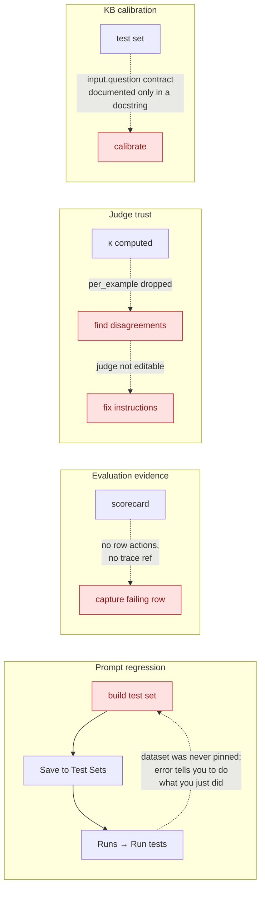

### 7.3 Nothing tells a human that something needs them

**The entire product has exactly one attention badge**: paused Aria plans,
polled every 30s. `badgeKey` is typed as the single literal `"plans"`, so no
other badge is even _expressible_ without a type change.

| Attention item                                           | Surfaced globally?               | Where it actually lives                               |
| -------------------------------------------------------- | -------------------------------- | ----------------------------------------------------- |
| **Pending run approvals**                                | **No — and no UI exists at all** | nowhere                                               |
| Jobs awaiting approval                                   | **No**                           | nowhere (a `StatusBadge` label only)                  |
| Review-queue items pending                               | No                               | visit `/review-queues`                                |
| Failed runs                                              | No                               | a subtitle string on an **unclickable** Dashboard row |
| Gate verdicts                                            | **No UI at all**                 | nowhere                                               |
| Gate-blocked / candidate-ready calibrations              | No                               | Dashboard numbers with no links                       |
| Blocked release candidates, incomplete ops, dead letters | No                               | visit `/releases` (and only with `canOperate`)        |
| Unhealthy backing services                               | No                               | Settings → Services                                   |
| Simulated providers                                      | **Yes** — global banner          | every route                                           |
| API/DB down                                              | **Yes** — health dot ×2          | TopBar + sidebar                                      |

**Both global signals are _system_ health. Every _human_ attention item requires
you to remember the page and go look.** Approvals are the sharpest case: the
count is computed server-side, on the wire, typed, and in the browser on every
page load — and rendered nowhere.

The one badge that exists points at the wrong thing: it navigates to the Plans
**list**, not to the plan that is waiting, because plan detail has no URL.

### 7.4 Permissions: three models and at least 33 false write affordances

Documentation recognises six audiences; auth recognises four scopes; the UI
gates on `me.is_admin` (8 pages), scope strings (2 pages), and project
`access_role` (1 page). Only the scope model matches the backend's enforcement
primitive — and because `ADMIN ⊃ OPERATOR`, `is_admin` **cannot express the
OPERATOR tier that gates most write endpoints.**

- **VIEWER sees ~33 mutating controls that will 403**; OPERATOR sees 8.
- `OpenApiIntegrations.tsx` has **zero** permission checks across 11 mutations.
- `CalibrationPanel` has **no permission prop** and is instantiated 4×.
- The sidebar has **no scope logic at all**, so a viewer sees Administration and
  Audit Log and learns their permissions by receiving a 403. (`AuditLog` handles
  this gracefully with a dedicated panel; `Administration` degrades to a raw red
  error line.)
- **`AccessBadge` compares the wrong strings** (`"admin"` vs `caliber.admin`), so
  the assistant panel labels **every user "Viewer", including admins.**
- One **inverse** bug: skill package import is admin-gated but needs only
  OPERATOR, hiding a control from users entitled to use it.
- **Two sibling surfaces disagree about who may create**: tools require ADMIN,
  skills require OPERATOR — and OPERATOR can create a skill but **cannot edit
  it**, breaking the primary authoring action for the primary authoring role.

### 7.5 Vocabulary collisions

**One concept, many names:**

| Concept            | Names visible in the UI                                                                                                     | Count |
| ------------------ | --------------------------------------------------------------------------------------------------------------------------- | ----- |
| Evaluation dataset | Test Sets · Eval Dataset · Existing Dataset · `eval-datasets` (URL) · `dataset_id` (API) · _"eval dataset 'ED-…'"_ (errors) | **6** |
| Grader             | Judges · Graders · Custom LLM judges · scorers · LLM judge (an unrelated boolean)                                           | **5** |
| Ship it            | Save & promote · Make live · Apply candidate live · Promote · Publish                                                       | **5** |
| Optimizer          | Calibration Strategy · `optimizer_type`                                                                                     | 2     |
| Object store       | Object Store · Workspaces · "file manager"                                                                                  | 3     |

**One name, several things:** _Test Sets_ is a prompt-workspace stage **and** a
top-level page; _Runs_ is prompt test runs **and** calibration jobs, in adjacent
tabs; _Judge_ is a hardcoded frontend string **and** a registry entity;
_baseline_ is a pinned test run **and** a pre-optimization score; _Publish_ means
draft→published, expose-as-HTTP-service, **and** (in leftover copy)
promote-to-prod; _Calibrate_ means measure, propose-a-mutation, or
hyperparameter-search depending on the page; and _Agents_ is a nav destination
that is **not** where you author agents, while the thing that executes is an
`agent` node inside a workflow.

**Implementation details surfaced as labels:** `agent_id` — documented as _"an
implementation detail, never something an operator manages directly"_ — is shown
on every prompt card and populates a picker labelled "Select a prompt". And
`SINGLE_ENVIRONMENT` mode instructs _"never surface [the alias] to users"_, yet
three no-op alias dropdowns remain visible, each offering the single value
`@prod`.

### 7.6 Long-running work loses its status the moment you look away

| Surface               | Progress visible?                              | Survives a tab switch / reload?                                                                                               |
| --------------------- | ---------------------------------------------- | ----------------------------------------------------------------------------------------------------------------------------- |
| Tool calibration jobs | **Yes** — 2s conditional poll                  | Yes (durable)                                                                                                                 |
| KB builds             | **Yes** — 2s poll + 7-step stepper             | Yes                                                                                                                           |
| Prompt calibration    | Yes, 2s — **only while the tab is mounted**    | **No** — the poll dies on unmount, and **no queued-job indicator exists anywhere**                                            |
| Prompt test runs      | No — a manual Refresh link                     | n/a                                                                                                                           |
| **Evaluation runs**   | **No** — the button text changes to "Running…" | **No — closing the tab destroys the run.** Nothing is persisted until scoring completes, and the client sets no write timeout |
| Workflow runs         | Yes — SSE + 2s telemetry                       | Yes                                                                                                                           |

The product already contains the correct pattern three times; the two surfaces
that most need it don't use it.

### 7.7 Wayfinding

Across **22 nav destinations plus 9 unlinked detail routes**:

- **No command palette, no global search, no cross-object search.** No `cmdk` or
  `fuse` dependency exists. 11 of 22 destinations have no search at all.
- **No global keyboard shortcuts** — six page-local `keydown` handlers form a
  per-page dialect, and the editor's `Cmd+Z/Y/A/D` is undiscoverable (there is
  no `?` overlay).
- **Breadcrumbs are built and unused.** `PageHeader.crumbs` supports a real
  trail; **one** page passes it. All nine detail routes — including the
  three-level-deep editor — claim you came from the Dashboard.
- **`PageHeader` is used by 18 of 34 pages**, against a docstring saying "every
  top-level page". Three pages hand-roll chevron trails instead, and four
  duplicate a local `Chevron()`.
- **`EmptyState` is a local function inside a 4,788-line page** — the
  highest-leverage moment for a new user is the least standardised surface.
- **No recently-viewed.** 34 `caliber.*` localStorage keys exist; none records
  navigation.

**Net: the sidebar is effectively the only way to get anywhere, and once you are
three levels deep the shell gives you nothing to climb back with.**

### 7.8 URL state is missing where work happens

| Surface                                                       | Has a URL? | Consequence                                                                            |
| ------------------------------------------------------------- | ---------- | -------------------------------------------------------------------------------------- |
| `ToolWizard` / `SkillWizard` (2,391 lines)                    | **No**     | a refresh or tab switch discards in-progress authoring, with no draft persistence      |
| Aria plan detail                                              | **No**     | plans can't be linked; back exits the feature; the badge can't target the waiting plan |
| Review-queue detail                                           | **No**     | a queue has no permalink; back exits the feature                                       |
| Workflow editor view state (mode, selected node, run monitor) | **No**     | unshareable, lost on reload                                                            |
| Workflow detail (`?tab=`, `?run=`)                            | **Yes**    | the pattern the others should copy                                                     |
| Observability (`?trace=`, filters)                            | **Yes**    |                                                                                        |

### 7.9 The product does not yet meet its own design principle #9

ARCHITECTURE.md commits to _"**Developer & User Friendly** — provide a clear,
productive experience for both developers **and business users**"_, discharged
by _"the SPA surfaces and the Cookbook examples"_. Measured against that:

- The **business user** (the `system-user` and `decision-maker` audiences, 23
  docs between them) is not served by the SPA today. Their most likely
  destinations — Review Queues, Releases, Plans — are respectively a form that
  shows no evidence, a raw-JSON compliance surface with self-attested scores,
  and a page with no URLs.
- The **Cookbook examples**, named as half the mechanism, are **linked from
  nowhere but the sidebar**.
- Principle **#4 "Evaluation by Design"** is contradicted by a prominent prompt
  scoring path bypassing the evaluation engine, the judge registry, and the
  evidence contract in favour of a judge prompt hardcoded in the browser bundle.
  No usage ranking is claimed without telemetry.

This is not a rhetorical flourish — it is the clearest available statement of
the product's own intent, and it names exactly which personas the current UI
under-serves.

---

## 8. Feature Creep & UI Bloat

### 8.1 Weight is concentrated in four destinations

Four of 34 pages hold **27,260 of 57,373 lines (47.5%)**, and each is a single
nav destination. The hypothesis that page size indicates a destination hosting
too many jobs holds in every case:

| Page                             | Lines   | Distinct feature areas                                                             | Verdict                  |
| -------------------------------- | ------- | ---------------------------------------------------------------------------------- | ------------------------ |
| `KnowledgeBases.tsx`             | 9,006   | **~55** (≈20 core, ≈33 expert-only, 1 dead) · 66 `useState`                        | Must be split            |
| `Prompts.tsx`                    | 8,192   | **16**                                                                             | Must be split            |
| `WorkflowEditor.tsx`             | 5,274   | 12 toolbar controls · 8 overlays · 46 `useState`                                   | Extract run monitoring   |
| `WorkflowDetail.tsx`             | 4,788   | 25 queries + 22 mutations · **17 always-expanded panels** in the selected-run view | Extract run monitoring   |
| _(`Inspector.tsx`, a component)_ | _6,611_ | _~45 `<Section>` panels in a 300px rail_                                           | Capability-gate sections |

`Prompts.tsx` grew **460 lines during this review**. The largest pages are still
accreting features.

### 8.2 Duplication census

| Duplicated thing                         | Copies                       | Where                                                                                   |
| ---------------------------------------- | ---------------------------- | --------------------------------------------------------------------------------------- |
| Workflow run-action helper functions     | **19, verbatim**             | `WorkflowDetail.tsx` ↔ `WorkflowEditor.tsx` (~600 lines)                                |
| Run-monitoring panel stack               | **2 full mounts**            | Runs tab ↔ editor Run Monitor overlay                                                   |
| KB entity/relationship renderers         | **4**                        | Chunks card, focus card, Graph lists, canvas trails                                     |
| Query playground (ask box + result card) | **2**                        | Explore ▸ Query ↔ "Graph Retrieval Probe" (~410 lines, already drifted)                 |
| Graph preset pickers                     | **4 renderers, 2 families**  | build pills, build cards, explorer, playground                                          |
| Graph retrieval control clusters         | **3**                        | build default / explorer / query override (~600 lines)                                  |
| `CalibrationPanel` instances             | **3 in tools alone**         | Fixtures, Hardening, orphaned detail — two labelled identically, persisting differently |
| Prompt run surfaces / run histories      | 2 / 2                        | Test Sets ↔ Runs, neither aware of the other                                            |
| Prompt diff renderers                    | **3**                        | Versions modal, Apply dialog, unused `PromptDiff.tsx`                                   |
| Prompt promote paths                     | **5** (only 2 gate-aware)    | §5.1.5                                                                                  |
| Object-store browsers                    | 2                            | `BucketTree` ↔ `ObjectStore` table                                                      |
| `humanSize` implementations              | **3**                        | KB, ObjectStore, BucketTree                                                             |
| Local `Chevron()` components             | **4**                        | the four pages that skip `PageHeader`                                                   |
| Versions lists on one tab                | 2                            | `VersionPanel` + a second table, four disjoint verbs                                    |
| Detail pages duplicating workspaces      | **2,306 lines**              | `ToolDetail` + `SkillDetail`, zero inbound links                                        |
| Parallel 6-stage workspaces              | **3 vocabularies**           | Prompts / Skills / Tools                                                                |
| "Calibrate" mechanisms                   | **7 endpoints, 3 semantics** | §5.5.2                                                                                  |
| Aria config writers                      | 3                            | Settings tab, panel gear, composer                                                      |

### 8.3 Dead, unlinked, and misleading UI

| Item                                               | Status                                                                                                                     |
| -------------------------------------------------- | -------------------------------------------------------------------------------------------------------------------------- |
| `WorkflowVersionDetail` route                      | **Directly addressable but has no in-app inbound link** — and holds the only Compile/Export affordance                     |
| `ToolDetail` + `SkillDetail` (2,306 lines)         | **Directly addressable but have no in-app inbound links** — hold the only durable calibration and the only skill packaging |
| `ToolWizard` step 4 of 5                           | **Structurally unreachable** — `registeredToolId` is always null while mounted                                             |
| `PromptCalibrationTab` (~150 lines)                | **Dead** — and contains the numbered stepper the page needs                                                                |
| Object-store launch machinery (~50 lines + a test) | **Dead** — `BucketTree`'s docstring says the launchers were removed                                                        |
| Deployments + Promotions tab bodies (~180 lines)   | **Dead** under `SINGLE_ENVIRONMENT` + `GATED_ALIASES = frozenset()`                                                        |
| `runMut` non-queue branch                          | **Unreachable** behind the disable                                                                                         |
| `StatusPill` neutral branch                        | **Unreachable** while eval runs are synchronous                                                                            |
| Dashboard "Awaiting signal" fallbacks              | **Unreachable** — `assistant_slo` is non-optional, so day-one tiles read red `0%`                                          |
| `skipped` review status                            | Rendered + typed, **no UI can set it**                                                                                     |
| `hideBreadcrumb` prop · `getPlatformCapabilities`  | **Zero callers**                                                                                                           |
| Publish drawer step 2                              | Permanently empty (`changeSummary={[]}`) — a mandatory click on nothing                                                    |
| "Open Prompt Calibration after save" checkbox      | **Does nothing** — the arg is dropped at the call site; it only relabels the button                                        |
| "Run Pipeline" button                              | Runs nothing (`setTab("runs")`) — styled as the page's primary action                                                      |
| "Save as New Version" button                       | **Promotes to live** without saying so                                                                                     |
| Object Store upload-cancel                         | A `span` with no handler                                                                                                   |
| Copy: _"Create a prompt on the Create Prompt tab"_ | **No such tab exists** (3 occurrences)                                                                                     |
| Copy: _"configured under the Operations group"_    | **No such group in the UI**                                                                                                |
| Tag column + filter on Test Sets                   | Permanently empty — the create form has no `tags` field                                                                    |

### 8.4 Expert controls presented as primary

- **Assistant-Guided Calibration is the _first_ thing in the prompt Calibration
  tab**, above the actual run form — a free-text box, three buttons, and result
  cards exposing `plan_id`, `operation_id`, `trace_id`, `correlation_id`, and
  `missing_slots`. A debugging console for CALIBER's own intent pipeline,
  positioned as the primary CTA.
- **The KB Graph sub-view is a peer tab**, so a dense-only knowledge base
  presents 1,385 lines of AGE machinery — including a 17-row diagnostics card and
  a second query playground — for a graph that does not exist.
- **A "Pipeline blueprint" panel restates the collapsed advanced config above
  it**, asking for a graph posture before explaining what one is.
- **The workflow Calibrate panel** (epsilon, candidate budget, deploy-gate
  dataset) is bolted onto the page header.
- **Raw gate numerics as free-text inputs** with no units or validation;
  **per-scorer JSON config textareas**; a **16-chip entity-type multi-select**
  whose default is "all"; a **12-badge graph metadata row**; and a **spinner +
  stepper + 7 preset chips + hint sentence for one integer 1–50**.
- **`assistant_slo` reliability tiles** — a platform-team metric as the
  operator's landing headline.
- **Settings ships `cd caliber && make test-allure`** in a production admin UI.

---

## 9. Simplify / Consolidate / Remove Opportunities

Master list, applying the decision order. Per-journey detail is in §5; this is
the consolidated view with estimated code movement.

### 9.1 Simplify (same capability, fewer decisions)

| #   | Action                                                                                                                                                                                          | Effect                                                                    |
| --- | ----------------------------------------------------------------------------------------------------------------------------------------------------------------------------------------------- | ------------------------------------------------------------------------- |
| S1  | Say _"defaults are fine — pick files and go"_ on the KB build form; move the blocking embedding error out of the collapsed disclosure; propagate the server's `recommended` tags                | Turns a 26-control-group form back into the 2-decision form it already is |
| S2  | Show stage order (numbers + completion marks) on the three 6-stage workspaces — **the component already ships, unused**                                                                         | Makes an implicit pipeline explicit at zero design cost                   |
| S3  | Replace free-text identifier fields with pickers: eval `subject_ref`, release artifact/version/rollback, MCP `mcp:server/tool`, skill `node_id`, tool `secret_refs`                             | Removes the "go find an id in another tab" pattern product-wide           |
| S4  | Replace raw-JSON textareas (release criteria/evidence, dataset examples) with structured builders, keeping "Edit as JSON" behind a toggle — **`planView.tsx` already demonstrates the pattern** | Removes ~10 hand-authored JSON blobs from the first-evaluation journey    |
| S5  | Hide the three no-op `@prod` alias dropdowns under `!SINGLE_ENVIRONMENT`                                                                                                                        | Honours the codebase's own stated rule                                    |
| S6  | Reduce the test-case-count control to one number input                                                                                                                                          | −1 stepper, −7 chips, −1 hint sentence                                    |

### 9.2 Consolidate

| #   | Action                                                                                                                                                                                                                      | Code movement                                                                         |
| --- | --------------------------------------------------------------------------------------------------------------------------------------------------------------------------------------------------------------------------- | ------------------------------------------------------------------------------------- |
| C1  | **Merge Settings + Administration** into one Admin destination (Access · Credentials · Aria · Platform · Services); fold `/gateway` in beside provider keys                                                                 | −1 top-level destination; closes the missing `security` group                         |
| C2  | **One "Tools I can call" catalog** (registry ∪ MCP discovered), filterable by source / side-effect / approval; keep `/mcp-servers` and `/openapi-integrations` as _connection_ management                                   | Collapses 4 mental models into 1 view; largely a query change once provenance exists  |
| C3  | **Extract one run-monitoring component**, mounted twice at different densities; move the 19 duplicated helpers to `lib/workflowRunActions.ts`                                                                               | ~1,300 lines de-duplicated across the two largest workflow files                      |
| C4  | Migrate the two unlinked detail pages' durable capabilities into reachable workspaces; ship redirects and parity evidence before considering deletion                                                                       | Up to 2,306 lines may later be retired; no direct-URL usage assumption                |
| C5  | **Split `KnowledgeBases.tsx`** into `pages/knowledge/*` (the directory exists with one sibling); extract `<GraphRetrievalControls>`, `<GraphPresetPicker>`, `<KnowledgeQueryResultCard>`, `<KnowledgeBaseListItem variant>` | ~1,900 lines de-duplicated; a 9,006-line route broken up                              |
| C6  | **One scoring engine** — retire the in-browser prompt judge for `POST /evaluations` with `predict_target: "prompt"`; make the workspace Test Sets stage an embedded view of the real dataset                                | Removes a fork of the evaluation engine; makes prompt scores comparable and auditable |
| C7  | **Collapse the prompt page's duplicates**: 2 run surfaces → 1, 2 run histories → 1, 3 diff renderers → 1, 5 promote paths → 2, dataset authoring → `/eval-datasets`                                                         | ~2,000 lines simplified; governance becomes path-independent                          |
| C8  | **Split the "Calibrate" verb** — _Calibrate_ = measure, _Optimize_ = propose a mutation for approval                                                                                                                        | Removes the most dangerous ambiguity in the product                                   |
| C9  | **Unify the three workspace vocabularies** and align the lifecycle ladders; stop awarding a tool's top rung to an unbound tool                                                                                              | One learnable pattern instead of three                                                |
| C10 | **Merge Cookbooks into the New-Workflow gallery** as "Curated examples", carrying readiness checks over to templates                                                                                                        | −1 destination; makes the best onboarding artifact reachable                          |
| C11 | **Collapse Plan + Copilot** into one "Describe" surface (their docstrings say they differ only by whether the graph is empty)                                                                                               | −1 overlay, −1 concept                                                                |
| C12 | **Move Review Queues into Evaluate**; adopt `PageHeader` + `crumbs` everywhere; promote `EmptyState` to a shared component                                                                                                  | Coherent grouping; −4 duplicate `Chevron()`s                                          |
| C13 | **Collapse Fixtures + Hardening** into one tool stage                                                                                                                                                                       | Removes two identically-labelled buttons with different durability                    |
| C14 | One owner for Aria config; merge the Dashboard's two job feeds                                                                                                                                                              | −2 duplicate surfaces                                                                 |

### 9.3 Improve defaults

| #   | Action                                                                                                     |
| --- | ---------------------------------------------------------------------------------------------------------- |
| D1  | Couple side-effect → approval in the native tool wizard, **client and server**                             |
| D2  | Seed MCP workflow bindings from saved `tool_policies`; add `side_effect_level` to registry bindings        |
| D3  | Default KB calibration `retrieval_mode` to the version's saved default, and warn on divergence             |
| D4  | Persist an evaluation run as `running` **before** scoring; poll to completion; navigate to the created run |
| D5  | Zero-denominator branches on Dashboard tiles ("—", not red `0%`)                                           |
| D6  | Gate KB graph panels on `graph_hybrid`/`age_graph`, not `!== "dense"`                                      |

### 9.4 Progressive disclosure

Hide behind _Advanced_ (each already has server defaults or is expert-only):
Assistant-Guided Calibration · per-scorer weights + JSON config · gate
thresholds · the KB Graph sub-view (gate on `entityCount > 0`) · the 17-row AGE
diagnostics card · the 16-chip entity-type selector · the 12-badge metadata row ·
the workflow Calibrate panel · resume-by-event correlation · Files & Artifact
Lineage · OpenAPI Dependencies + Graph tabs · raw-JSON schema toggles ·
Releases' Recovery console and JSON textareas · `assistant_slo` tiles · Test Sets
version controls and MLflow sync · `predict_target: workflow` (with a cost
warning) · Inspector sections gated by capability.

### 9.5 Remove

The full inventory is §8.3. The following are high-value removal candidates,
but only items proven dead by tests may be deleted immediately. Orphan routes
and duplicate surfaces require capability parity, compatibility redirects, and
usage validation first:

`PromptCalibrationTab` · the object-store launch machinery · the second KB query
playground + compact result card · the legacy `KnowledgeTab` shim · the
"Pipeline blueprint" panel · the Chunks-tab lineage card · `ToolWizard` step 4 ·
the Fixtures-stage Calibrate button · the Fixtures/Hardening split · publish
drawer step 2 · the non-functional calibration checkbox · Deployments +
Promotions bodies · `runMut`'s dead branch · legacy palette components ·
`Delete all (N)` in the browse toolbar · the in-modal prompt switcher · Settings
→ Allure · the "Completed runs" `MetricBar` and its self-normalizing `max` · the
dead "Awaiting signal" branches · `hideBreadcrumb` · `getPlatformCapabilities` ·
the empty Tag column · the `non_empty` default chip · duplicate
`/prompts/optimization/*` aliases · the global `updateAssistantConfig` side
effect · Object Store's fake cancel and its orphaned "project files" button ·
the three stale copy strings.

---

## 10. Missing Capabilities That Materially Improve UX

These are candidate capabilities justified by a verified implementation gap.
They are not all render-only and they are not approved merely by appearing in
this list. Section 14 turns the accepted subset into gated work packages and
requires additional discovery for structural changes.

| #       | Capability                                                                                                                                                      | Why it is justified                                                                                                                                                                                                                                 | Cost   |
| ------- | --------------------------------------------------------------------------------------------------------------------------------------------------------------- | --------------------------------------------------------------------------------------------------------------------------------------------------------------------------------------------------------------------------------------------------- | ------ |
| **A1**  | **A "Needs your attention" surface** — the top block of Home, backed by generalised sidebar badges                                                              | §7.3: the product has no way to tell a human something needs them. Existing application-summary counts prove demand, but they do not identify actionable items or share one permission model; UX-14 defines the required ACL-filtered list contract | L      |
| **A2**  | **An Approvals destination**                                                                                                                                    | `CaliberApprovalRequest` has **no UI whatsoever**, and workflow `waiting_approval` runs are undiscoverable without a URL (§5.2.4). This is a governance product; the approver persona has no home                                                   | M      |
| **A3**  | **A first-run experience on `/`** — on an empty deployment, replace the metric grid with "Install a Cookbook → Add a provider key → Run it"                     | §4.6: a fresh install opens on three false alarms, while the useful Cookbook route is not presented as the next step                                                                                                                                | S      |
| **A4**  | **Command palette (`Cmd+K`)** over destinations plus objects by name                                                                                            | §7.7: 31 addressable routes, no global search, no recent history, no shortcuts. The highest-leverage wayfinding addition                                                                                                                            | M      |
| **A5**  | **Real breadcrumbs on the 9 detail routes**                                                                                                                     | §7.7: the capability already exists and is used once. One line per page                                                                                                                                                                             | **XS** |
| **A6**  | **Nullable origin identities on the trace payload**, plus reciprocal links                                                                                      | §5.6.4: explicit workflow-run/workflow/agent/evaluation identities turn one-way run→trace into bidirectional navigation and create the missing "a run failed → the span that failed" path                                                           | M      |
| **A7**  | **Row actions on the scorecard** (+ a trace ref on the row): "Add to test set", "Send to review queue", "Show judge rationale"                                  | §7.2: closes evaluation loop A, which cannot close without the reference                                                                                                                                                                            | S–M    |
| **A8**  | **Render `per_example` and make judges editable**                                                                                                               | §7.2: closes the judge-trust loop. Both the data and the PATCH fields already exist                                                                                                                                                                 | S      |
| **A9**  | **Bulk / file import of dataset examples**                                                                                                                      | §5.3.6: 4 interactions per row; `CaliberEvalDatasetFile` already models this with zero UI references                                                                                                                                                | M      |
| **A10** | **Evidence-derived release criterion scores** (resolve `evidence_refs`; consume `/gate-verdicts`) — and until then, state plainly that scores are self-attested | §5.6.3: an audited compliance surface currently computes weighted scores from numbers the gated party typed                                                                                                                                         | M–L    |
| **A11** | **A `status` filter on the runs endpoint**                                                                                                                      | §5.2.4: `waiting_approval` and `failed` are unfindable; the API cannot even express the question                                                                                                                                                    | S      |
| **A12** | **Draft persistence + URLs for the two wizards**                                                                                                                | §7.8: 2,391 lines of authoring that a refresh discards                                                                                                                                                                                              | S–M    |
| **A13** | **A `PATCH` on release candidates** (or "clone with edits")                                                                                                     | §5.6.3: a candidate created with the shipped defaults is permanently unsignable                                                                                                                                                                     | S      |
| **A14** | **Scope-aware navigation**                                                                                                                                      | §7.4: users currently discover their permissions by receiving 403s                                                                                                                                                                                  | S      |

---

## 11. Proposed Target UX & Navigation Model

### 11.1 Principles for the target model

1. **Group by the job, not the object family.** Review Queues is evaluation
   input, not an ops chore; Object Store is infrastructure, not an authored
   asset.
2. **One destination per job.** Two admin pages, two tool-catalog mental models,
   and two galleries each force a guess before work starts.
3. **Connecting a system and using a capability are different jobs.** Keep
   `/mcp-servers` and `/openapi-integrations` for _connecting_; make `/tools` the
   single answer to _"what can I call?"_.
4. **Attention is a first-class surface**, not a property of pages you remember
   to visit.
5. **Expert depth lives behind disclosure**, not adjacent to first-run controls.

### 11.2 Target navigation

This navigation is a **testable design hypothesis**, not an approved wholesale
restructure. Implement low-risk corrections first, then validate labels,
findability, role visibility, and direct-route usage under UX-00/UX-17 before
moving or deleting destinations. Preserve old URLs with redirects for at least
one release whenever a route moves.

```mermaid
flowchart TD
  ROOT["CALIBER"] --> HOME["<b>Home</b><br/>Needs your attention<br/>+ first-run start"]
  ROOT --> BUILD["<b>Build</b>"]
  ROOT --> CONNECT["<b>Connect</b>"]
  ROOT --> MEASURE["<b>Measure</b>"]
  ROOT --> GOVERN["<b>Govern</b>"]
  ROOT --> OPERATE["<b>Operate</b>"]
  ROOT --> ADMIN["<b>Admin</b><br/><i>one destination, 5 tabs</i>"]
  ROOT --> DOCS["Docs ↗"]

  BUILD --> W["Workflows<br/><i>+ Curated examples gallery</i>"]
  BUILD --> PR["Prompts"]
  BUILD --> SK["Skills"]
  BUILD --> TL["Tools<br/><i>unified callable catalog</i>"]
  BUILD --> KB["Knowledge Bases"]
  BUILD --> PL["Plans"]

  CONNECT --> MCP["MCP Servers"]
  CONNECT --> API["OpenAPI Integrations"]
  CONNECT --> GW["LLM Gateway"]
  CONNECT --> OS["Object Store"]

  MEASURE --> TS["Test Sets"]
  MEASURE --> JU["Judges"]
  MEASURE --> EV["Evaluations"]
  MEASURE --> RQ["Review Queues<br/><i>moved from Operate</i>"]

  GOVERN --> AP["Approvals<br/><i>NEW</i>"]
  GOVERN --> RL["Releases"]
  GOVERN --> AU["Audit Log"]

  OPERATE --> OB["Observability"]

  classDef new fill:#dcfce7,stroke:#16a34a,color:#166534
  classDef moved fill:#dbeafe,stroke:#2563eb,color:#1e40af
  class AP,HOME new
  class RQ,OS,TL,W moved
```

### 11.3 What changed and why

| Change                                                                                        | Rationale                                                                                                                                                                                                                                     |
| --------------------------------------------------------------------------------------------- | --------------------------------------------------------------------------------------------------------------------------------------------------------------------------------------------------------------------------------------------- |
| **Home** replaces a metric Dashboard                                                          | §7.3 — attention has no surface; §4.6 — first run is hostile                                                                                                                                                                                  |
| **+ Approvals**                                                                               | §10-A2 — the approver persona has no home; existing summary counts prove the gap, while UX-14 supplies the missing ACL-filtered actionable list                                                                                               |
| **Cookbooks folded** into the Workflows gallery                                               | §6.4 — the best on-ramp is reachable only as a separate sidebar destination; two galleries, one destination                                                                                                                                   |
| **Tools becomes a unified catalog**                                                           | §7.5 — tool provenances render identically; TypeScript contract alignment plus a normalized provenance view model unlock it                                                                                                                   |
| **Object Store → Connect**, name unchanged                                                    | §5.4.6 — it is infrastructure. Renaming is _not_ recommended: the name is defended by a docs series and a distinct `routes/files.py` concept. The right fix is to build or delete the orphaned "project files" button, not to rename the page |
| **Review Queues → Measure**                                                                   | §5.3.6 — human labels are evaluation input; the two halves of the judge-trust loop sat in different nav groups                                                                                                                                |
| **Settings + Administration → one Admin** (Access · Credentials · Aria · Platform · Services) | §5.6.2 — the split is unpredictable, 4 of 5 Settings tabs are read-only, and 9 of 10 backend setting groups are invisible                                                                                                                     |
| **LLM Gateway beside provider credentials**                                                   | §5.6.2 — keys and the routing for those keys were split across destinations                                                                                                                                                                   |
| **`/agents` leaves Build** → Admin, renamed _Refinement Fleet_                                | §5.2.5 — by its own banner it is an optimizer-fleet record editor, and the current name actively misleads                                                                                                                                     |
| **Plans stays**, and gains a URL                                                              | §5.6.5 — a real work surface that simply isn't addressable                                                                                                                                                                                    |
| Group order follows the lifecycle                                                             | Build → Connect → Measure → Govern → Operate mirrors the sequence the product implements                                                                                                                                                      |

**Net: 21 grouped sidebar destinations → 19** (−Cookbooks, −Settings, −Agents
from the grouped nav, +Approvals), or 22 → 20 when Dashboard/Home is included.
The significant wins are in _consolidation_ rather than count: one admin
destination, one tool catalog, one scoring engine, and one run-monitoring
component. The code-movement estimate is not a deletion commitment.

---

## 12. Current vs. Target Journey Diagrams

### 12.1 Prompt regression — the named journey

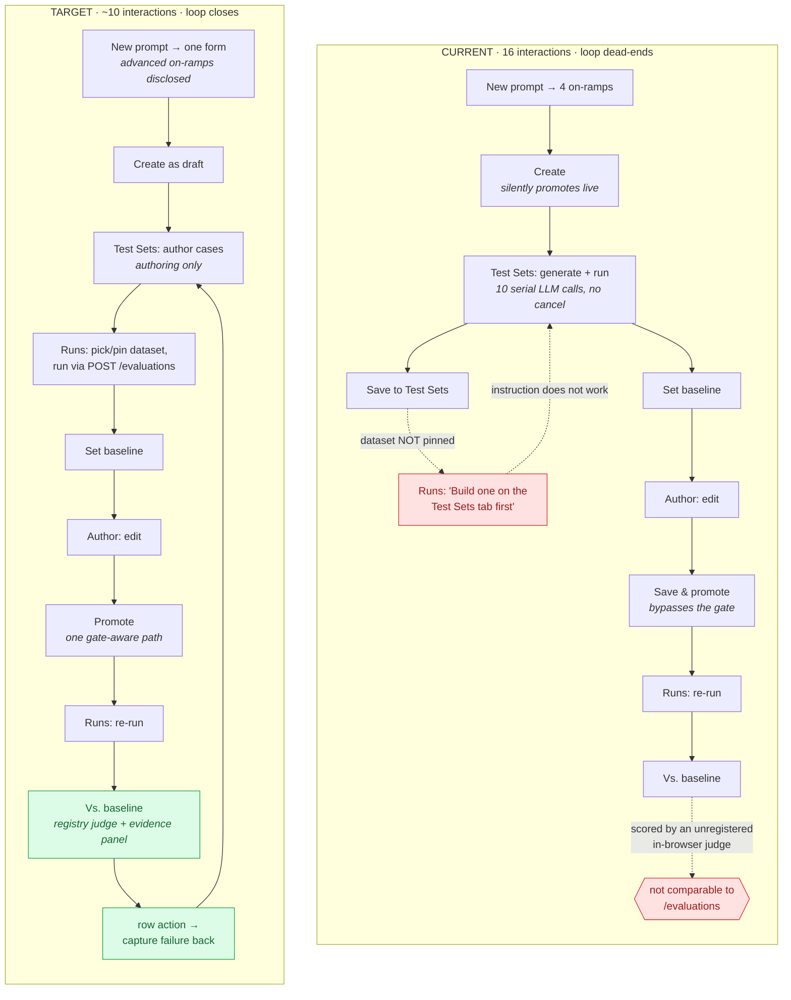

### 12.2 Debug a failed run

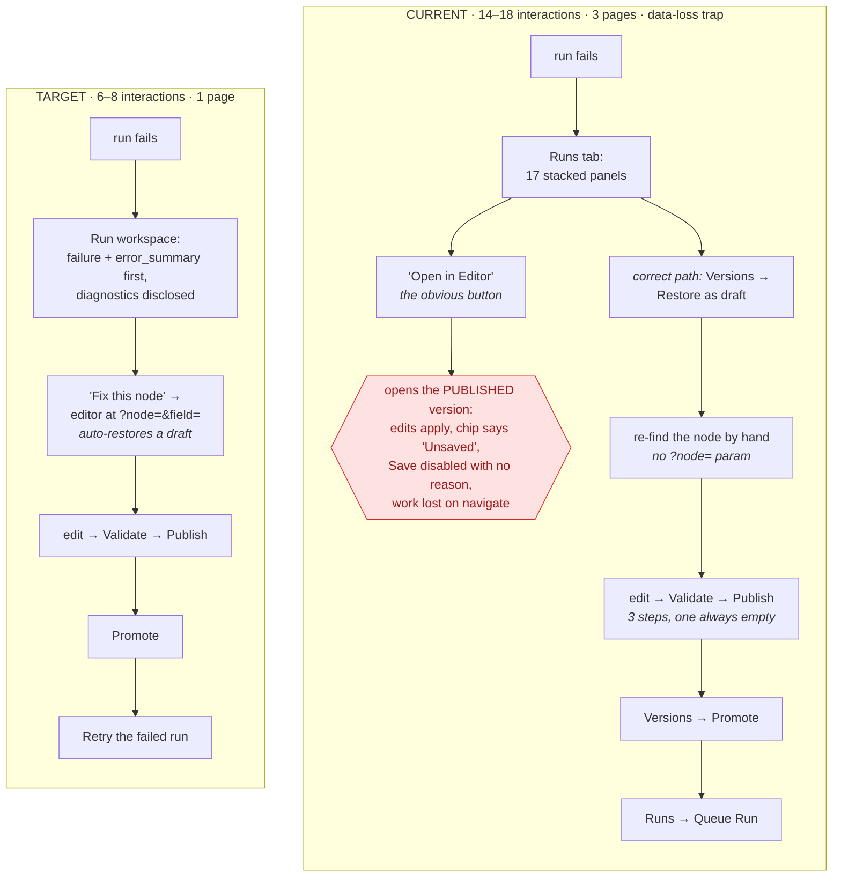

### 12.3 First run

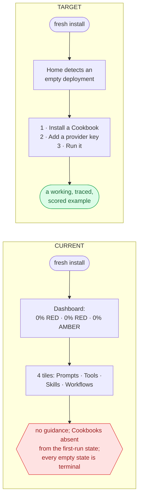

### 12.4 Judge trust

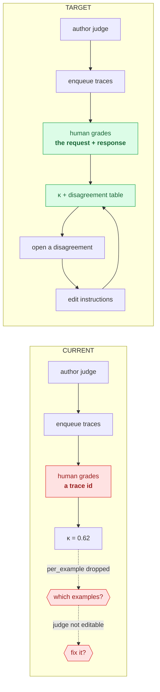

---

## 13. Corrected Delivery Backlog

Priorities are assigned on **user harm**, not implementation cost. _Critical_ =
silent data loss, silently wrong output, or a primary journey that dead-ends.
Effort is relative blast radius: **XS** = isolated presentation/state fix;
**S** = one surface with existing contracts; **M** = cross-surface or additive
API work; **L** = new durable workflow, migration, or broad IA change. These are
not calendar estimates.

Nine issues are documented in the full
_Persona → JTBD → Current Experience → Problem → Evidence → User Impact →
Recommendation → Expected Improvement → Priority_ form inline at §5.1.2, §5.1.4,
§5.1.5, §5.2.1, §5.3.1, §5.4.4, §5.5.3, §5.6.3, and §4.3.

### 13.1 Summary table

| Priority     | Persona             | Journey             | Problem                                                                                                                      | Recommendation                                                                                                                           | User Impact                                                                                        | Effort     |
| ------------ | ------------------- | ------------------- | ---------------------------------------------------------------------------------------------------------------------------- | ---------------------------------------------------------------------------------------------------------------------------------------- | -------------------------------------------------------------------------------------------------- | ---------- |
| **Critical** | Evaluator, Approver | Judge trust         | Review form shows only a trace **id** — a human grades `tr-abc123`                                                           | Return a bounded, redacted, access-checked evidence projection and render it above the questions                                         | Every human label, κ, and gate decision downstream is founded on evidence the reviewer never saw   | M          |
| **Critical** | Developer           | Prompt regression   | "Save to Test Sets" never pins the dataset; Runs dead-ends with an instruction that does not work                            | Persist an explicit Test Set selection, expose a picker in Runs, and make the binding visible and changeable                             | The product's core loop fails on first use; one lifecycle state is unreachable                     | M          |
| **Critical** | Developer, Operator | Workflow recovery   | The primary header button opens an immutable version that still accepts edits; Save is disabled with no reason               | Guard `patchManifest`; read-only banner + one-click Restore as draft                                                                     | Silent loss of uncommitted work, from the most prominent button on the page                        | S          |
| **Critical** | Developer           | KB build            | "New version" stays enabled in create mode, overwrites picked sources, and versions **a different KB than the header names** | Isolate create/edit state, clear the selected id on create, show the mutation target, and gate versioning while creating                 | Silently writes to the wrong object                                                                | S          |
| **Critical** | Approver            | Release signoff     | `rationale`/`waiver*` are single state values shared across all candidate rows                                               | Key by `candidate_id`, or move signoff into a per-candidate modal                                                                        | Signing off candidate B submits the rationale typed for A — in an audited compliance surface       | XS         |
| **Critical** | Developer           | Prompt deploy       | A button labelled "Save as New Version" also promotes to live                                                                | Split save from promote; make the production action gate-aware and explicit                                                              | Unannounced production changes                                                                     | S–M        |
| **Critical** | Approver            | Workflow approval   | `waiting_approval` runs have no queue, no badge, no filter, and no cross-workflow list                                       | Define an ACL-filtered attention contract, add run-status filtering and an Approvals destination, then generalise badges                 | An approval-gated platform where approvers cannot find what needs approving                        | L          |
| **High**     | All                 | Every journey       | Request-schema field errors are dropped; users see _"request body validation failed"_                                        | One shared error component rendering `ApiErrorBody.errors`, with safe fallbacks for non-schema failures                                  | Verified request-schema failures become actionable without claiming all 4xx bodies share one shape | S          |
| **High**     | Developer, Admin    | Tool governance     | The native (default) tool door allows an external-action tool with approval off — uncoupled and unvalidated                  | Couple side-effect → approval in the client and server and align the TypeScript contract with the authoritative server schema            | Closes the only unguarded path to an ungoverned write tool                                         | M          |
| **High**     | Developer           | Tool → workflow     | Auto-created MCP bindings hardcode `read` / no-approval, discarding saved policy                                             | Seed bindings from `server.tool_policies`                                                                                                | Turns a late, manifest-worded deploy blocker into a correct default                                | XS         |
| **High**     | Evaluator           | Prompt / evaluation | A prominent prompt scoring path uses an unregistered in-browser judge; unparseable output scores 0 as `fail`                 | Adapt prompt scoring to the governed evaluation service, preserve scorer/config parity, and treat invalid judge output as a scorer error | Comparable, auditable scores without manufacturing false regressions                               | L          |
| **High**     | Evaluator           | Evaluation          | A blocking run has no progress, nothing persisted, and no write timeout                                                      | Introduce a durable run state machine and worker with idempotency, polling, cancellation, timeout, and recovery                          | A closed tab currently destroys up to 50 paid LLM calls                                            | L          |
| **High**     | Evaluator           | Judge trust         | κ's `per_example` is computed then dropped; judges cannot be edited                                                          | Render addressable disagreements; add a conflict-safe `/judges/:id` editor using the existing PATCH fields                               | Makes the alignment number actionable instead of decorative                                        | M          |
| **High**     | Developer           | KB calibration      | The required `input.question` / `expected.sources` contract exists only in Python docstrings; the 400 says "has no examples" | Add a KB-specific dataset template, structured hints, and matching-row validation without changing generic dataset semantics             | A documented feature is unusable while appearing to work                                           | M          |
| **High**     | All                 | First run           | Two red 0% tiles and an amber 0% on an empty install; Cookbooks absent from the Home empty state; no onboarding              | Add capability-aware zero-denominator states and a verified three-step start path                                                        | Removes day-one false alarms and connects the best on-ramp                                         | M          |
| **High**     | Viewer, Operator    | All                 | ~33 mutating controls visible to users who will 403; three competing permission models                                       | Standardise on scope gating; add a permission prop to `CalibrationPanel`; scope-aware nav                                                | Users stop learning their permissions from error dialogs                                           | M          |
| **High**     | Approver, Operator  | Attention           | No global surface for approvals, reviews, failures, or gate blocks                                                           | Build a normalized, ACL-filtered attention list with exact deep links; existing counts alone are insufficient                            | Required action becomes discoverable without leaking object existence across roles or projects     | L          |
| **High**     | Admin               | Aria                | `AccessBadge` compares the wrong scope strings                                                                               | Compare `caliber.*`                                                                                                                      | Every admin is currently labelled "Viewer"                                                         | XS         |
| **High**     | Architect, Approver | Release signoff     | Weighted scores are arithmetic on operator-typed numbers; `evidence_refs` never resolved; `/gate-verdicts` has no consumer   | Resolve evidence server-side; until then state that scores are self-attested                                                             | An audited governance surface currently self-attests                                               | M–L        |
| **Medium**   | Developer           | Workflow            | Compile/Export exists only on a route nothing links to                                                                       | Fold into the Versions tab                                                                                                               | Recovers a real capability and surfaces compile errors properly                                    | S          |
| **Medium**   | Operator            | Workflow            | The run-queue blocker names a setting no page can change                                                                     | Render `approval_readiness.blockers` + `settings_path`; expose the toggle in Admin                                                       | Removes an unresolvable dead end                                                                   | S          |
| **Medium**   | Developer           | KB sources          | `BucketTree` ignores `next_token`/`is_truncated`                                                                             | Paginate + warn                                                                                                                          | Silent source truncation above 1000 objects                                                        | S          |
| **Medium**   | Operator            | Observability       | Trace navigation is one-way; no failure drill-down                                                                           | Add run/agent/eval ids to the trace payload; auto-expand the first error                                                                 | Creates the missing "a run failed → the span that failed" path                                     | S          |
| **Medium**   | Developer           | KB retrieval        | `hybrid` is misrepresented in three places, including contradictory score numbers                                            | Gate graph panels correctly; render `lexical`/`rrf`; fix the summary                                                                     | Restores trust in the panel built to establish grounding                                           | S          |
| **Medium**   | All                 | Wayfinding          | Breadcrumbs built and unused; `PageHeader` on 18/34; no palette                                                              | Pass `crumbs` on the 9 detail routes; adopt `PageHeader`; add `Cmd+K`                                                                    | The sidebar stops being the only way to navigate                                                   | XS / S / M |
| **Medium**   | Developer           | Tools, Skills       | 2,306 lines of orphaned detail pages hold the only durable calibration and packaging surfaces                                | Migrate the capabilities, add compatibility redirects, verify parity and usage, then consider deletion                                   | Two broken journeys fixed without assuming direct-URL users do not exist                           | M          |
| **Medium**   | Developer           | Authoring           | Wizards have no URL and no draft persistence                                                                                 | Route them; persist drafts                                                                                                               | 2,391 lines of work stop being refresh-fragile                                                     | S–M        |
| **Medium**   | All                 | Vocabulary          | 6 names for a test set, 5 for a grader, 5 for promote; "Calibrate" means three things                                        | Pick one term each; split Calibrate/Optimize                                                                                             | Removes the product's steepest learning tax                                                        | M          |
| **Low**      | All                 | Bloat               | Roughly 7,000 lines are candidates for extraction, consolidation, or removal (§8.3)                                          | Execute only after parity and reachability gates in §14                                                                                  | Smaller maintained surface without deleting unverified behaviour                                   | M          |

### 13.2 Candidate correction queue

These are ordered for investigation, not bundled into one PR. Each still needs
the source, browser, permission, and regression checks in §14. Status is
re-verified as of `ff6d18c414` (2026-09-06); the full implementation
specification for each open item is in §15.

1. ~~Isolate create/edit KB state; clear `selectedKnowledgeBaseId`~~ **— landed
   in `#238`.** Residual: show the mutation target on the "New version" control
   (**UX-03a**, XS). "New version" is correctly gated while creating.
2. ~~Key Releases' rationale/waiver state by candidate id.~~ **— landed in
   `#237`** (per-candidate `ReleaseCandidateCard`, plus focus management).
3. Split prompt save from gate-aware promotion. **(S–M, Critical — open; the
   last unfixed silent-production change. §15.5/UX-02)**
4. Seed MCP bindings from saved policy. **(XS, High — open. §15.5/UX-07)**
5. Fix `AccessBadge` scope strings. **(XS, High — open; still compares `admin` /
   `operator` against `caliber.admin` / `caliber.operator`. §15.5/UX-06)**
6. Pass `crumbs` on the nine detail routes. **(XS, Medium — open; still one
   caller. §15.8/UX-21)**
7. ~~Guard `patchManifest` + add a read-only banner.~~ **— landed in `#239`**
   (`patchManifest`/`undo`/`redo` guarded, banner with **Restore as draft**).
   Residual: run recovery still opens the latest published version rather than
   the run's own (**UX-01a**, XS).
8. Add explicit persisted Test Set binding and a Runs picker. **(M, Critical —
   open. §15.6/UX-09)**
9. Return and render a bounded, redacted, access-checked review-evidence projection. **(M, Critical)**
10. Shared error component for `ApiErrorBody.errors`. **(S, High)**
11. Zero-denominator Dashboard branches; delete the dead fallbacks. **(S, High)**
12. Couple side-effect → approval and align client/server contracts. **(M, High)**
13. Implement a durable evaluation worker and run state machine. **(L, High)**
14. Render addressable `per_example` disagreements and add conflict-safe judge editing. **(M, High)**
15. Add a KB-specific dataset template, matching-row validation, and a truthful 400. **(M, High)**
16. Hide the three no-op alias dropdowns. **(XS, Medium)**
17. Delete `PromptCalibrationTab`, the launch machinery, publish step 2, the
    non-functional checkbox, and the three stale copy strings. **(S, Low)**

### 13.3 Structural UX improvements

Home + attention surface · Approvals destination · one Admin destination ·
unified tool catalog · one scoring engine · one run-monitoring component ·
splitting `KnowledgeBases.tsx` and `Prompts.tsx` · command palette · scope-aware
navigation · stage-order affordances on the three workspaces.

### 13.4 Simplify / Consolidate

§9.1 and §9.2 in full — the highest-value entries being C1 (Admin), C2 (tool
catalog), C3/C4/C5 (de-duplication), C6/C7 (one scoring engine), and C8
(Calibrate vs Optimize).

### 13.5 Remove / deprioritize

Use §9.5 as an investigation queue, not an unconditional deletion list. Items
proven dead by reachability tests may be removed directly; orphan routes,
duplicates, and misleading controls still require parity, redirect, usage, and
browser evidence before retirement.

### 13.6 New capability — only where justified

§10, items A1–A14. Use §7.1's delivery classification and §14's work-package
contracts; do not treat this mixed list as fourteen equally small UI tasks.

---

## 14. Execution Plan

This section is the delivery contract. It replaces a time-shaped roadmap with
dependency-ordered work packages. Calendar commitments require named staffing;
until then, sequence and blast radius are the honest planning units.

### 14.1 Work-state and decision rules

Every work package moves through these states. A source finding is not an
implemented or user-validated result.

| State                 | Required evidence                                                                                             |
| --------------------- | ------------------------------------------------------------------------------------------------------------- |
| **Verified**          | Current source/API/test evidence reproduces the issue on the recorded base SHA                                |
| **Browser-confirmed** | Authenticated desktop and mobile journey reproduces it with the relevant role; keyboard behaviour is recorded |
| **Accepted**          | Product/engineering owner accepts the outcome, scope, dependencies, and non-goals                             |
| **Implemented**       | Smallest complete code change plus deterministic regression tests is on a dedicated PR                        |
| **Validated**         | Affected CI-equivalent checks, browser journey, permission matrix, and accessibility checks pass              |
| **Released**          | PR is merged by the human owner; deployment and live behaviour are separately verified                        |

Rules:

1. One PR should deliver one user-visible outcome. Closely related client and
   server changes belong together when separating them would leave a broken
   intermediate contract.
2. Wave 1 correctness work may proceed from source proof plus a focused browser
   reproduction. Navigation moves, route deletion, and scoring consolidation
   require UX-00 evidence first.
3. Existing backend authorization remains authoritative. Hiding a forbidden
   control improves UX but never replaces server enforcement.
4. The prompt calibration Apply review and workflow deployment-bundle review
   remain regression-protected release boundaries.
5. Direct URLs remain compatible for at least one release after a route move.
   A route is deleted only after capability parity, redirect coverage, and
   usage evidence show that removal is safe.
6. Ordinary tests stay deterministic and offline. Model-dependent acceptance
   uses simulated providers or recorded fixtures unless an explicitly labelled
   integration job is being run.

### 14.2 Delivery gates and dependency graph

| Gate                        | Exit condition                                                                                                                                  | Unlocks                              |
| --------------------------- | ----------------------------------------------------------------------------------------------------------------------------------------------- | ------------------------------------ |
| **G0 · Evidence baseline**  | UX-00 records reproducible role/journey baselines, automated counts, browser captures, and known evidence limits                                | Structural IA and deletion decisions |
| **G1 · Silent-correctness** | UX-01–UX-07 pass focused regression, role, and browser checks; no audited path silently targets, mutates, promotes, or submits the wrong object | Loop-closing work                    |
| **G2 · Closed loops**       | Prompt regression, evaluation capture, judge correction, and KB calibration each complete end-to-end with durable state                         | Attention and onboarding work        |
| **G3 · Findability**        | A fresh user reaches a working example; an approver can find every supported approval type; forbidden actions are not offered                   | Consolidation experiments            |
| **G4 · Structural change**  | Parity tests, route redirects, usage evidence, and rollback flags exist before pages or destinations move or disappear                          | Final IA rollout                     |

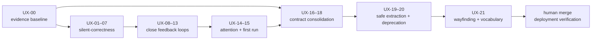

### 14.3 Work packages

Each package below states its outcome and its acceptance evidence. **§15 carries
the implementation specification for the same IDs** — re-verified evidence with
file and line, ordered implementation steps, the tests that must be added, the
exact validation commands, acceptance criteria, non-goals, and rollback. Read
§14.3 for the contract; read §15 to do the work. UX-01, UX-03, and UX-04 have
landed (`#239`, `#238`, `#237`); their residual tasks are UX-01a and UX-03a.

#### Wave 0 — establish the evidence baseline

| ID        | Outcome and implementation contract                                                                                                                                                                                                                                                                                                                                                                                                                                                    | Acceptance evidence                                                                                                                                                                                                                                                                                                        | Dependencies / size / owner             |
| --------- | -------------------------------------------------------------------------------------------------------------------------------------------------------------------------------------------------------------------------------------------------------------------------------------------------------------------------------------------------------------------------------------------------------------------------------------------------------------------------------------- | -------------------------------------------------------------------------------------------------------------------------------------------------------------------------------------------------------------------------------------------------------------------------------------------------------------------------- | --------------------------------------- |
| **UX-00** | Create a reproducible UX evidence harness for five journeys: prompt regression, failed-workflow recovery, judge review, KB build/calibration, and first run. Seed viewer/operator/approver/admin accounts and simulated-provider data. Add a script that reports route/nav/page/header/permission-affordance counts from source. Record desktop, narrow-mobile, and keyboard-only browser captures. Define telemetry events without sending prompt, response, secret, or file content. | Playwright journeys run against the local stack; each baseline records commit, role, fixture, expected/actual, screenshots, and PASS/PARTIAL/BLOCKED. The source-count script is deterministic. At least one formative session with each primary role validates terminology before G4; this is discovery evidence, not CI. | None · **M** · Product design + UI + QA |

#### Wave 1 — stop silent wrongness

| ID        | Outcome and implementation contract                                                                                                                                                                                                                                                                                                                                                          | Acceptance evidence                                                                                                                                                                                                                            | Dependencies / size / owner                                        |
| --------- | -------------------------------------------------------------------------------------------------------------------------------------------------------------------------------------------------------------------------------------------------------------------------------------------------------------------------------------------------------------------------------------------- | ---------------------------------------------------------------------------------------------------------------------------------------------------------------------------------------------------------------------------------------------- | ------------------------------------------------------------------ |
| **UX-01** | Make published workflow versions truly read-only in `WorkflowEditor.tsx`. `patchManifest`, undo/redo, node drag/wire, and Inspector edits must not create dirty state. Show a persistent immutable-version banner with **Restore as draft**. From run recovery, open the run's exact version and offer a draft-restoration action instead of silently choosing the latest published version. | Component tests prove every edit path is inert on published versions and active on drafts; browser test proves no “Unsaved” state can occur on an immutable version and that Restore creates/navigates to a draft.                             | UX-00 reproduction · **S** · UI/workflows                          |
| **UX-02** | Separate prompt **Save new version** from **Promote live**. Remove hidden `overridden: true` activation from save-only actions. Route all live changes through one gate-aware promote control, while preserving the review-first calibration Apply dialog and its failed-gate block. Use one verb: Save, Promote, Roll back.                                                                 | Tests assert save creates a non-live version, every promote path checks the same verdict contract, override requires a reason, rollback emits rollback audit semantics, and no save-labelled control calls `promotePrompt`.                    | UX-00 reproduction · **S–M** · UI/prompts + backend contract owner |
| **UX-03** | Isolate KB create and version targets. Entering create mode clears the selected existing KB and incompatible source state. Existing-version mode must show and submit the exact target KB id/name; it cannot be selected while create mode is active without an explicit target choice.                                                                                                      | `knowledge-bases.test.tsx` covers switching library → create → existing and verifies the submitted endpoint/object; browser test proves the workspace header, sources, and mutation target agree.                                              | UX-00 reproduction · **S** · UI/knowledge                          |
| **UX-04** | Isolate release signoff/waiver form state per candidate, preferably in a candidate-scoped dialog. The submitted candidate id, visible title/version, rationale, and waiver fields must come from the same state object.                                                                                                                                                                      | `releases.test.tsx` opens two candidates, types different rationales, submits each, and asserts no cross-row leakage. Keyboard focus returns to the invoking row.                                                                              | UX-00 reproduction · **XS–S** · UI/releases                        |
| **UX-05** | Preserve and render structured API validation errors through one shared component. Keep the summary, map `loc` to human field labels, de-duplicate messages, and fall back safely for non-validation errors. Do not expose server traces.                                                                                                                                                    | API tests preserve `ApiError.body`; shared-component tests cover nested/list paths and unknown shapes; one prompt, workflow, KB, and admin form integration test shows field-level remediation.                                                | None · **S** · UI platform                                         |
| **UX-06** | Establish one permission model based on canonical `caliber.*` scopes. Add reusable `canAnyScope`/`MutationGuard` primitives, correct `AccessBadge`, and create an endpoint-to-affordance matrix. Remove or explain forbidden mutations for viewer/operator/approver/admin while retaining server-side 403 tests.                                                                             | Automated matrix covers every audited mutation; viewer-visible forbidden controls fall from the verified baseline to zero; entitled operators retain skill-package import; browser tests cover all four roles and responsive navigation.       | UX-00 · **M** · Auth + UI platform                                 |
| **UX-07** | Make tool governance safe by default. An `external_action` native tool must require approval client- and server-side. MCP workflow bindings must copy the saved tool policy rather than hardcode read/no-approval. Surface OpenAPI approval posture and tool execution provenance.                                                                                                           | Route tests reject unsafe native registration; UI tests couple side effect/approval; workflow graph tests preserve MCP policy; type tests carry `execution_backend`; deploy preflight no longer reports a contradiction created by the binder. | UX-06 primitives for final UI gating · **M** · Tools/integrations  |

**G1 release criterion:** UX-01–UX-07 are separate PRs unless a client/server
contract requires an atomic change. Each PR includes a before/after browser
artifact and a rollback note. G1 is not satisfied by hiding controls alone.

#### Wave 2 — close the four feedback loops

| ID        | Outcome and implementation contract                                                                                                                                                                                                                                                                                                          | Acceptance evidence                                                                                                                                                                                                                                                                 | Dependencies / size / owner                                                                  |
| --------- | -------------------------------------------------------------------------------------------------------------------------------------------------------------------------------------------------------------------------------------------------------------------------------------------------------------------------------------------- | ----------------------------------------------------------------------------------------------------------------------------------------------------------------------------------------------------------------------------------------------------------------------------------- | -------------------------------------------------------------------------------------------- |
| **UX-08** | Show reviewer-safe evidence in Review Queues. The server returns a bounded, access-checked, redacted projection of the trace request/response plus trace id/digest; the UI renders it before questions. Never return raw secrets, hidden system instructions, unrestricted attachments, or an unbounded trace payload.                       | Backend tests cover project visibility, redaction, truncation, missing/deleted trace, and stable digest; UI tests show evidence/error/empty states; browser review proves the question cannot be submitted before its evidence panel is available or explicitly marked unavailable. | UX-06 scope helpers · **M** · Review/evaluation + security                                   |
| **UX-09** | Make prompt regression dataset binding explicit. The Runs stage gets a Test Set picker and persists the selected dataset through a dedicated prompt-target/workspace contract. Saving generated cases may offer **Use this Test Set in Runs**, but must not create invisible coupling. Refreshing or switching tabs preserves the selection. | Route tests validate visibility/status/version; prompt tests prove save → select → run → baseline → edit → rerun → diff closes without calibration; the lifecycle reaches “Has test set”; stale/deleted datasets produce an actionable picker error.                                | UX-02 lifecycle semantics · **M** · Prompts/evaluation                                       |
| **UX-10** | Make judge alignment actionable. Render `per_example`, filter disagreements/errors, deep-link a row, and add judge detail/edit using the existing PATCH fields with optimistic concurrency or an explicit last-write policy. Preserve globally unique names and explain name immutability if retained.                                       | Judge route/UI tests cover edits, validation, stale updates, disagreements, scorer errors, and empty alignment; browser journey edits instructions and reruns alignment from the same context.                                                                                      | UX-05 error rendering · **M** · Judges                                                       |
| **UX-11** | Make evaluation execution durable. Persist an eval run before work starts; expose `queued/running/completed/failed/cancelled`, progress counts, timestamps, and cancellation; execute through a bounded worker; return the run immediately and navigate to its durable detail. Idempotency prevents duplicate paid runs.                     | State-machine, recovery, cancellation, idempotency, and partial-result tests pass; UI reload/tab-switch retains progress; worker failure persists an actionable terminal state. This is not a one-day UI change and may need a migration and operations documentation.              | UX-05 · **L** · Evaluation + runtime                                                         |
| **UX-12** | Give KB calibration a first-class dataset schema/template: `input.question`, `expected.sources`, optional `expected.answer`. The generic Test Set editor remains generic; a KB-calibration template, validation hints, and truthful matching-row counts guide the specialised workflow.                                                      | Knowledge calibration tests distinguish zero examples from zero compatible examples and report row-level reasons; UI can create/import a compatible set without hand-discovering keys; end-to-end calibration starts from that set.                                                 | UX-05 · **M** · Knowledge + datasets                                                         |
| **UX-13** | Add explicit trace/result lineage. Evaluation result rows carry a trace/prediction reference; trace summaries carry nullable workflow-run, workflow, agent, and evaluation identities where known. Links are project-scoped and degrade honestly when the destination is unavailable.                                                        | Schema/migration tests preserve old rows; route visibility tests prevent cross-project lookup; Evaluation Detail can add a failing row to a Test Set or Review Queue; Observability links back to the originating run/evaluation and opens the first failed span.                   | UX-08 evidence projection design; UX-11 durable run ids · **M–L** · Observability/evaluation |

**G2 release criterion:** four Playwright journeys demonstrate closed cycles:
prompt regression, scorecard capture, judge correction, and KB calibration.
Each survives reload and exposes a durable id in the URL.

#### Wave 3 — make work findable and make first run honest

| ID        | Outcome and implementation contract                                                                                                                                                                                                                                                                                                                                                                                           | Acceptance evidence                                                                                                                                                                                                               | Dependencies / size / owner                                 |
| --------- | ----------------------------------------------------------------------------------------------------------------------------------------------------------------------------------------------------------------------------------------------------------------------------------------------------------------------------------------------------------------------------------------------------------------------------- | --------------------------------------------------------------------------------------------------------------------------------------------------------------------------------------------------------------------------------- | ----------------------------------------------------------- |
| **UX-14** | Add an ACL-filtered attention contract and Approvals surface. Do not conflate prompt-refinement approvals, calibration jobs, workflow runtime approvals, review-queue items, and release blockers merely because dashboard counts exist. Define a normalized item (`kind`, object id, label, status, age, project, required scope, destination), add workflow-run status filtering, and generalize badges from that contract. | Backend counts equal visible item lists per role/project; stale/completed items disappear via SSE or bounded polling; each item deep-links to the exact action; viewer/operator/approver/admin tests prove no existence leakage.  | UX-06, UX-11 state model · **L** · Governance + UI platform |
| **UX-15** | Replace empty-install alarm colours with zero-denominator states and a capability-aware start block: configure a provider, install a Cookbook, run the paused draft, inspect its trace/evaluation. Keep Cookbooks as a direct route until the later IA decision.                                                                                                                                                              | Dashboard tests distinguish not-started from 0% failure; browser journey on an empty seeded deployment reaches a working example with no unexplained dead end; every prerequisite links to the page that can actually resolve it. | UX-05, supported local topology · **M** · Onboarding        |

**G3 release criterion:** the primary landing page tells a user what is blocked,
what needs their role, and what to do next. An approver can find all supported
approval kinds without receiving an out-of-band URL.

#### Wave 4 — consolidate only after behaviour is measured

| ID        | Outcome and implementation contract                                                                                                                                                                                                                                                                                                                                      | Acceptance evidence                                                                                                                                                                                                                                                                                                   | Dependencies / size / owner                                                |
| --------- | ------------------------------------------------------------------------------------------------------------------------------------------------------------------------------------------------------------------------------------------------------------------------------------------------------------------------------------------------------------------------ | --------------------------------------------------------------------------------------------------------------------------------------------------------------------------------------------------------------------------------------------------------------------------------------------------------------------- | -------------------------------------------------------------------------- |
| **UX-16** | Converge prompt scoring on the evaluation engine. Define an adapter from prompt-workspace cases to a durable `predict_target="prompt"` run; use registered/versioned judges; preserve baseline matching, incomplete-row honesty, evidence digests, and the calibration Apply gate. Invalid judge output is a scorer error, never a behavioural fail.                     | Golden parity tests compare old/new deterministic fixtures; evidence and gate tests pass; prompt browser journey uses one run identity and one result model; old local scorer remains behind a temporary rollback flag until parity is accepted.                                                                      | UX-09, UX-10, UX-11 · **L** · Prompts/evaluation                           |
| **UX-17** | Validate and then stage the target IA in §11. First test labels/tree with representative developer, evaluator, operator, approver, and admin tasks. If accepted, merge Settings/Administration incrementally, move Review Queues, and rename/move Refinement Fleet with redirects and preserved deep links. Do not expose read-only runtime groups as editable settings. | Tree/task tests record findability; `navigation.spec.ts` covers desktop/mobile/collapsed state, roles, badges, active groups, redirects, and keyboard disclosure; old URLs resolve for at least one release; no destination becomes permission-inaccessible.                                                          | UX-00, UX-06, UX-14, UX-15 · **L** · Product design + UI platform          |
| **UX-18** | Build one callable-tool catalog after provenance is end-to-end. Registry and MCP tools share a view model with source, execution backend, side effect, approval, health, and connection deep link; connection management remains in MCP/OpenAPI.                                                                                                                         | API/type contract tests preserve provenance; filters and permission-aware actions are tested; the same tool cannot appear with contradictory governance; direct connection routes remain available.                                                                                                                   | UX-07 and accepted UX-17 grouping · **M–L** · Tools/integrations           |
| **UX-19** | Extract workflow run actions and monitoring without changing behaviour. Move the 19 duplicated helpers into typed modules, build one monitoring component with explicit density/capability props, and mount it in detail/editor.                                                                                                                                         | Characterization tests pass before refactor; both mounts show the same statuses/actions/errors for identical fixtures; existing run deep links and browser recovery journey remain unchanged; bundle status/export controls remain available.                                                                         | UX-01, UX-13 · **M** · Workflows                                           |
| **UX-20** | Decompose `Prompts.tsx` and `KnowledgeBases.tsx` by domain state and component contracts. Migrate orphan-route capabilities into reachable workspaces, add redirects and deprecation telemetry, then delete only proven-dead code. Line count is tracked as a guardrail, not the acceptance outcome.                                                                     | State ownership and public component contracts are documented; focused unit tests replace implicit page coupling; direct URLs retain capability parity; bundle/calibration regressions pass; no deletion occurs solely because a file is large.                                                                       | UX-12, UX-16, UX-18, UX-19 · **L** · UI architecture                       |
| **UX-21** | Complete wayfinding in risk order: real breadcrumbs first; durable URL state for plans, review queues, wizards, and editor focus; shared EmptyState/PageHeader; then command palette after IA stabilizes; vocabulary migration last.                                                                                                                                     | Nine detail routes have hierarchical crumbs; shareable URLs restore state after reload/back; palette results respect scopes and never leak hidden object names; vocabulary contract tests cover Test Set, Judge, Save/Promote/Roll back, Calibrate/Optimize; old terms remain only in API compatibility/docs mapping. | UX-17 accepted IA, UX-20 route map · **M–L** · UI platform + documentation |

### 14.4 Required validation by change type

| Change type           | Minimum deterministic validation                                                                                       | Additional journey evidence                                                               |
| --------------------- | ---------------------------------------------------------------------------------------------------------------------- | ----------------------------------------------------------------------------------------- |
| UI-only state/copy    | Affected Vitest files; `npm run typecheck`; `npm run lint`; `npm run build`; `git diff --check`                        | Focused Playwright path at desktop + narrow viewport; keyboard operation and focus return |
| Backend/API contract  | Focused pytest with `--no-cov`; strict mypy; Ruff; schema/visibility/error tests; migration head check when applicable | SDK/client contract check and local-stack request/response capture                        |
| Auth/governance       | Backend scope tests plus the automated affordance matrix for viewer/operator/approver/admin                            | Authenticated browser pass for all affected roles; no cross-project existence leakage     |
| Long-running work     | State-machine, idempotency, recovery, timeout, cancellation, partial-result, and worker-restart tests                  | Reload/tab-close/reconnect journey with durable URL and terminal status                   |
| Navigation/route move | Route inventory, redirect tests, `navigation.spec.ts`, active-group/mobile/collapsed tests, docs-link check            | Task-based findability check before and after; direct old URL verified                    |
| Deletion/refactor     | Characterization/parity tests before deletion; import/build/type checks; no orphan route or public export              | Browser parity on both old entry points; rollback flag or redirect exercised              |

For every implementation PR, run the applicable commands from
`.github/workflows/ci.yml`. The normal UI floor is:

```bash
cd caliber/caliber-ui
npm test
npm run typecheck
npm run lint
npm run build
npm run test:e2e
```

For backend-affecting work, add:

```bash
cd caliber
.venv/bin/ruff check .
.venv/bin/ruff format --check .
.venv/bin/mypy src
.venv/bin/python -m pytest --no-cov <affected test files>
```

Use `./test-all.sh --no-allure` when a work package spans backend, UI, SDK,
docs, and deployment contracts. Regenerate served documentation when a source
under `docs/`, `ARCHITECTURE.md`, API references, or SDK references changes.

### 14.5 Measurement contract

Source-modelled counts are retained as hypotheses until UX-00 records a browser
baseline. Do not claim adoption, completion-rate, or time savings from line
counts or click counts.

| Measure                                | Verified baseline                                          | Acceptance target                                                                             | Collection method                                                   |
| -------------------------------------- | ---------------------------------------------------------- | --------------------------------------------------------------------------------------------- | ------------------------------------------------------------------- |
| Silent wrong-object/action regressions | 4 named Critical examples                                  | 0 in the accepted regression suite                                                            | Deterministic component/API tests + focused Playwright              |
| Closed core feedback loops             | 0 of 4 complete in the source trace                        | 4 of 4 durable across reload                                                                  | End-to-end journey assertions with durable ids                      |
| Viewer-visible forbidden mutations     | At least 33 in audited surfaces                            | 0 for routes represented in the matrix                                                        | Generated endpoint-to-affordance scope matrix                       |
| Existing-contract signals not rendered | 13 direct/client-default gaps                              | 0 unlabelled; each is rendered or explicitly deferred with rationale                          | Contract inventory test + issue ledger                              |
| Reviewer evidence availability         | Review form renders id/questions only                      | 100% show bounded evidence or an explicit unavailable reason                                  | Review-queue API/UI tests                                           |
| Attention findability                  | 1 global badge; approval kinds fragmented                  | Every supported attention kind has an ACL-safe list item and exact deep link                  | API count/list parity + role journeys                               |
| Detail-route breadcrumbs               | 0 of 9 hierarchical trails                                 | 9 of 9                                                                                        | Component and navigation tests                                      |
| Long-running task durability           | Evaluation is request-bound; prompt polling is tab-bound   | Every accepted long-running flow survives reload and reports terminal state                   | Worker/state tests + reconnect journey                              |
| Task steps/time                        | Source-modelled lower bounds only                          | Set after UX-00 observed baseline; report median and failure rate, not an invented percentage | Instrumented local study or privacy-reviewed telemetry              |
| Page size/duplication                  | 5 files/components over 2,500 lines; 19 duplicated helpers | Trend downward with no fixed UX threshold                                                     | Static maintainability report; never used alone as release evidence |

### 14.6 Definition of done for every work package

A work package is ready for human review only when:

- the issue names the user, job, current evidence, desired outcome, non-goals,
  dependencies, API/schema impact, permissions, risks, and rollback;
- UI states cover loading, empty, partial, error, forbidden, stale/conflict, and
  success where applicable;
- destructive or production-changing actions name their effect and target;
- desktop, narrow viewport, keyboard order, focus management, accessible name,
  and reduced-motion behaviour are checked for changed interactions;
- tests cover the regression, happy path, boundary/permission cases, and any
  compatibility redirect or migration;
- validation commands and exact results are recorded in the PR template;
- the branch is pushed, CI is terminal, review comments are addressed on the
  same PR, and the PR remains open for the human owner to merge;
- deployment/live verification is reported separately from local and CI
  validation.

### 14.7 Rollout and rollback

- Use feature flags for UX-11 async evaluation, UX-14 attention aggregation,
  UX-16 scoring convergence, and UX-17 navigation restructuring. Flags are
  temporary and need removal criteria.
- Additive schemas land before clients consume them. Backfills are resumable;
  old rows render an explicit “lineage unavailable” state.
- Preserve old scoring/run identifiers during UX-16 until parity is accepted;
  never rewrite historical evidence to match the new presentation.
- Route moves ship redirects and canonical-link updates before navigation
  changes. Remove redirects only after a documented compatibility window.
- Refactors in UX-19/UX-20 use characterization tests and revert cleanly without
  data migration. Feature removals are separate commits from capability moves.
- A failed rollout disables the flag or reverts the focused PR. It does not
  bypass authorization, gate checks, audit events, or the deployment-bundle
  integrity contract.

### 14.8 Recommended issue order

Open issues in this order, but assign calendar dates only after ownership and
capacity are confirmed:

1. UX-00 evidence baseline.
2. UX-01, UX-03, and UX-04 in parallel; UX-02 immediately after its prompt
   promotion-contract review.
3. UX-05, then UX-06 and UX-07.
4. UX-08, UX-09, UX-10, and UX-12; design UX-11/UX-13 state and lineage
   contracts before implementation.
5. UX-11 and UX-13, then certify G2.
6. UX-14 and UX-15, then certify G3.
7. UX-16, UX-17, and UX-18 behind rollback flags.
8. UX-19 and UX-20 after parity; UX-21 after the route map stabilizes.

Do not begin with the command palette, visual polish, or wholesale page
rewrites. The first shipped outcome is that CALIBER never appears to save,
promote, review, or version one object while acting on another.

---

## 15. Task Specifications

§13 says *what* is wrong and §14 says *in what order* it may be fixed. This
section is the missing third layer: for every work package, the concrete task —
re-verified evidence, the exact files, the implementation steps, the tests that
must exist, the commands that must pass, and what "done" means. It is written to
be transcribed into issues without further analysis.

### 15.1 Re-verification pass

The audit body was written against `70c4e82345`. Every finding below was
re-verified against **`ff6d18c414`** on **2026-09-06**, after `#236`–`#240`
merged. Three Critical items have since landed; the rest reproduce unchanged.
Where a landed fix covered part of a work package but not all of it, the residue
is broken out as its own lettered task rather than left implied.

| Re-verification | Command | Result on `ff6d18c414` |
| --- | --- | --- |
| Canonical scopes | `grep -n 'SCOPE_' caliber/src/caliber/auth.py` | `caliber.viewer` / `caliber.operator` / `caliber.admin` (L85–88) |
| Badge comparison | `sed -n '12,20p' caliber/caliber-ui/src/components/assistant/AccessBadge.tsx` | compares `"admin"` / `"operator"` — never matches |
| Unrouted pages | `for f in src/pages/*.tsx; do grep -q "<$(basename $f .tsx)" src/App.tsx \|\| echo $f; done` | `Overview.tsx` (aliased `Dashboard`), `SkillWizard.tsx`, `ToolWizard.tsx` |
| Breadcrumb adoption | `grep -rn 'crumbs' src/pages src/components` | declared in `PageHeader.tsx:16`, passed once (`ObjectStore.tsx:907`) |
| `PageHeader` adoption | `grep -rln PageHeader src/pages \| wc -l` vs `ls src/pages/*.tsx \| wc -l` | 18 of 34 |
| Command palette | `grep -rn 'cmdk\|CommandPalette\|Cmd+K' src` | no match |
| Approvals signal | `grep -rn approvals_pending src` | contract (`types.ts:43`) + fixtures only; no render site |
| Duplicated helpers | `grep -o '^function [A-Za-z0-9_]*' <4 workflow files> \| sort \| uniq -d \| wc -l` | **22** identically-named helpers (audit said 19; re-measure before quoting) |
| Page weight | `wc -l src/pages/*.tsx \| sort -rn \| head -4` | `KnowledgeBases.tsx` 9,021 · `Prompts.tsx` 8,192 · `WorkflowEditor.tsx` 5,321 · `WorkflowDetail.tsx` 4,788 |

### 15.2 Status ledger

| ID | Outcome | Status | Wave · gate | Blast radius | PR |
| --- | --- | --- | --- | --- | --- |
| **UX-00** | UX evidence harness | **In review** | 0 · G0 | M | `#248` — open, census only |
| **UX-01** | Published workflow versions are read-only | **Landed** | 1 · G1 | S | `#239` |
| **UX-01a** | Run recovery opens the run's own version | **Landed** | 1 · G1 | XS | `#245` |
| **UX-02** | Split prompt save from promote | **In review** | 1 · G1 | S–M | `#247` — open |
| **UX-03** | KB create/version target isolation | **Landed** | 1 · G1 | S | `#238` |
| **UX-03a** | Name the KB a "New version" will mutate | **Landed** | 1 · G1 | XS | `#245` |
| **UX-04** | Per-candidate release signoff state | **Landed** | 1 · G1 | XS | `#237` |
| **UX-05** | Render structured validation errors | **Partial** | 1 · G1 | S | `#243` |
| **UX-06** | One permission model on `caliber.*` scopes | **Partial** | 1 · G1 | M | `#242` |
| **UX-07** | Tool governance safe by default | **Partial** | 1 · G1 | M | `#244` |
| **UX-08** | Reviewer-safe evidence in Review Queues | Open | 2 · G2 | M | — |
| **UX-09** | Explicit prompt→test-set binding | Open | 2 · G2 | M | — |
| **UX-10** | Actionable judge alignment + judge editing | Open | 2 · G2 | M | — |
| **UX-11** | Durable evaluation execution | Open | 2 · G2 | L | — |
| **UX-12** | First-class KB calibration dataset shape | Open | 2 · G2 | M | — |
| **UX-13** | Trace ↔ result lineage | Open | 2 · G2 | M | — |
| **UX-14** | ACL-filtered attention + Approvals surface | Open | 3 · G3 | L | — |
| **UX-15** | Honest first run | **Partial** | 3 · G3 | S | `#246` |
| **UX-16** | One scoring engine | Open | 4 · G4 | L | — |
| **UX-17** | Validate then stage the target IA | Open | 4 · G4 | L | — |
| **UX-18** | One callable-tool catalog | Open | 4 · G4 | M | — |
| **UX-19** | Extract workflow run actions/monitoring | Open | 4 · G4 | M | — |
| **UX-20** | Decompose the two 8–9k-line pages | Open | 4 · G4 | L | — |
| **UX-21** | Complete wayfinding | Open | 4 · G4 | M | — |

**Partial** means the package shipped a complete, independently-valuable
outcome and left a named remainder. **In review** means the same shape, with
the PR still open — UX-00 and UX-02 are both in that state, so nothing below
should be read as merged for those two. The remainder is not a to-do the PR
forgot; each one was scoped out for a stated reason, and each is listed here
so it cannot quietly become "done":

| ID | Shipped | Remainder, and why it was not shipped with it |
| --- | --- | --- |
| **UX-00** *(in review)* | The structural census and its committed baseline (`#248`, open) | Seeded role fixtures, the five persona journeys, keyboard traversal capture, and `evidence-limits.md`. The census makes the *counts* reproducible; it does not make the *journeys* observed, and G0 asks for both. |
| **UX-05** | `describeApiError`/`apiErrorText`, the `ApiErrorMessage` component, and 53 call sites across the six highest-traffic surfaces (`#243`) | ~20 remaining call sites, and wiring `invalidFieldPaths` to `aria-invalid` per form. Both are mechanical but per-surface, and mixing them into one PR would have made the behaviour change unreviewable. |
| **UX-06** | Canonical `caliber.*` vocabulary, `hasScope`/`canAnyScope`/`accessLevel`, `MutationGuard`, the AccessBadge fix, and the two ad-hoc call sites (`#242`) | The ~30 `is_admin`-gated call sites. Converting them **changes who sees what** — they currently hide operator-authorized controls from operators — so it needs the endpoint-to-affordance matrix, which is blocked on UX-00's census landing. |
| **UX-07** | Side-effect↔approval coupling on both write paths and in the wizard; MCP bindings seeded from saved policy (`#244`) | Surfacing OpenAPI approval posture and tool execution provenance in the registry. Deferred to **UX-18**, which is where the unified tool view model is defined; building it here would create a second provenance surface to throw away. |
| **UX-15** | Zero-denominator states, so an empty install no longer opens on two red tiles and one amber (`#246`) | The capability-aware start block (configure a provider → install a Cookbook → run the paused draft → inspect its trace). New onboarding UI with its own design questions. This half removed the false alarm; that half connects the on-ramp. |

**Landed ≠ closed at the gate.** With `#247` merged, all four "silent wrong
object" Criticals and all three of UX-05/06/07 will have shipped their primary
outcomes — but **G1 is not certified by that alone**. §14.2 requires the
focused regression, role, and browser checks, and §14.1 rule 2 requires UX-00
evidence before any structural decision. The browser and role passes have not
been run: every validation recorded on these PRs is deterministic, offline,
and source-or-jsdom level.

Two things worth stating plainly about how this slice went:

1. **Two defects were found by tests that were already green.** The
   AccessBadge suite asserted `scopes: ["admin"]`, a payload the server cannot
   emit. The `MutationGuard` suite asserted `queryByRole` returned nothing,
   which passed because `aria-hidden` had removed the control from the
   accessibility tree while leaving it fully keyboard-operable. In both cases
   the test measured something adjacent to the property it was trusted for.
   §14.6's "tests cover the regression" is necessary but not sufficient — the
   test has to measure the thing that would actually break.
2. **Two defects were introduced while fixing their own class.** `#247` first
   shipped a promote button that carried a stale version number across a
   prompt switch — naming one object while writing to another, three functions
   away from the code removing exactly that. Reviewing a fix against its own
   stated principle is worth doing explicitly.

### 15.3 Card format

Each task below carries the same fields, in the same order:

**Evidence** (file:line, re-verified) · **Outcome** (the user-visible change) ·
**Plan** (ordered implementation steps) · **Tests** (what must be added, not
just run) · **Validation** (exact commands) · **Done when** (acceptance
criteria) · **Not in scope** · **Risk & rollback** · **Depends on / unlocks**.

Anything a card does not state is deliberately left to the implementer. Where a
card asserts a number, the command that produced it is in §15.1 — re-run it
rather than quoting the number.

Two reading conventions. **Tests** names the tests that must exist when the
package is done; where a cited path does not yet exist in the repository, it is
a file to create, and where it does, extend it rather than adding a parallel
file. **Validation** names commands to run and paste results from — it is the
CI-equivalent floor from §14.4 narrowed to the affected area, not a substitute
for it.

---

### 15.4 Wave 0 — establish the evidence baseline

#### UX-00 · Reproducible UX evidence harness

**Evidence.** Every structural recommendation in §11 and every deletion in §9.5
rests on source-modelled counts. §14.5 already forbids claiming adoption or time
savings from them. Nothing in the repository currently produces a role-aware,
re-runnable baseline: `caliber/caliber-ui/e2e/` exercises features, not
personas, and no script emits the route/nav/affordance census this document
quotes.

**Outcome.** Any reviewer can reproduce the baseline this plan is measured
against with one command, and can re-run it after each wave to show movement.

**Plan.**

1. Add `caliber/caliber-ui/scripts/ux-census.mjs` emitting JSON + Markdown:
   addressable routes (parse `src/App.tsx`), sidebar destinations, pages with
   and without `PageHeader`, detail routes passing `crumbs`, page line counts,
   duplicated top-level helper names across the workflow surfaces, and every
   mutating control (`onClick` calling a `caliberApi` mutation) with its
   enclosing page. Commit the first output as `docs/ux/baseline-<sha>.json`.
2. Add a seeded-fixture path that provisions four accounts — viewer, operator,
   approver, admin — against the simulated provider, so role journeys are
   deterministic and offline. Reuse the existing `test/handlers.ts` fixture
   vocabulary rather than inventing a second one.
3. Add `caliber/caliber-ui/e2e/personas/` with five journeys: prompt
   regression, failed-workflow recovery, judge review, KB build + calibration,
   first run. Each records step count, terminal state, and a screenshot at
   desktop (1440px) and narrow (390px) widths.
4. Record keyboard-only traversal for each journey: tab order, focus return
   after dialog close, and any control reachable by mouse but not keyboard.
5. Write `docs/ux/evidence-limits.md` naming what the harness does *not*
   establish — real-user timing, assistive-technology behaviour, production
   telemetry — so later waves cannot silently upgrade a model into an
   observation.

**Tests.** The census script gets a unit test over a fixture `App.tsx` so its
counts cannot drift silently. Each persona journey is itself the test; all five
must pass offline with no credentials.

**Validation.**

```bash
cd caliber/caliber-ui
node scripts/ux-census.mjs --out docs/ux/baseline-$(git rev-parse --short HEAD).json
npm run test:e2e -- e2e/personas
npm test && npm run typecheck && npm run lint && npm run build
```

**Done when.** The five journeys run green offline; the census output is
committed; `docs/ux/evidence-limits.md` exists; §14.5's "verified baseline"
column can cite generated artifacts instead of prose.

**Not in scope.** Telemetry collection, real-user studies, assistive-technology
certification, and any product change.

**Risk & rollback.** Additive only — no product code changes. Risk is a census
that measures the wrong thing; mitigate by asserting its numbers against the
hand-counted values in §3 and §8 and reconciling every disagreement in the PR
body before the numbers are trusted.

**Depends on.** Nothing. **Unlocks.** G0 → all structural and deletion work
(UX-17, UX-19, UX-20, UX-21), and the honest denominators UX-06 needs.

---

### 15.5 Wave 1 — stop silent wrongness

#### UX-01a · Run recovery opens the run's own version

**Evidence.** `#239` made published versions genuinely read-only and added
**Restore as draft**, closing the data-loss half of UX-01. The recovery half is
untouched: `WorkflowDetail.tsx:2947` still routes **Open in Editor** to
`latest.version_id`. An operator debugging a run of v3 while v7 is published
lands on v7, reads it as "the workflow", and now — correctly — cannot edit it.
The banner explains immutability; nothing explains that this is the wrong
version.

**Outcome.** From a run, the editor opens the version that run executed. From
the workflow header, the destination names which version it is opening.

**Plan.**

1. In `WorkflowDetail.tsx`, when the page is scoped to a run (or a run row is
   the entry point), link to that run's `version_id`, not `latest.version_id`.
2. Label the header action with its target — `Open v7 in Editor` — so the
   default is legible rather than implied.
3. When the opened version is not the latest, extend `#239`'s read-only banner
   with the run context ("v3 · the version run `wr-…` executed") and keep
   **Restore as draft** as the one forward action.
4. Leave the latest-published default in place for the non-run entry point; the
   change is to name it, not to move it.

**Tests.** Component test: a run of a non-latest version routes to that
version's editor. Test: header action label includes the version number.
Test: opening a non-latest published version renders the run-context banner.

**Validation.**

```bash
cd caliber/caliber-ui
npx vitest run src/pages/__tests__/workflow-studio.test.tsx
npm run typecheck && npm run lint && npm run build
```

**Done when.** No path from a run reaches an editor showing a different
version's manifest without saying so.

**Not in scope.** Re-opening the read-only enforcement `#239` settled; any
change to the restore-as-draft contract.

**Risk & rollback.** Presentation and routing only; revert is a single-commit
revert with no data implications.

**Depends on.** `#239` (landed). **Unlocks.** G1.

---

#### UX-02 · Split prompt save from promote

**Evidence.** `Prompts.tsx:943` renders a button labelled **"Save as New
Version"**. Its handler, `submitEditPrompt` (`Prompts.tsx:514`), calls
`createPromptVersion` and then — unconditionally, with no second confirmation —
`promotePrompt(..., { gate_state: "none", overridden: true, override_reason:
"direct prompt edit activation" })` (`Prompts.tsx:530`). `overridden: true` is
the flag that tells the server to bypass the gate. The authoring panel's
`save(promote)` (`Prompts.tsx:1775`) does gate the promotion behind an argument
and is honest about it, so the product contains both the correct pattern and
the incorrect one. `PromptBuilder.tsx:721`, `:772`, and `:906` each promote with
`overridden: true` on initial creation — defensible as first activation, but
undisclosed at the point of click.

**Outcome.** Saving a prompt version never changes what production serves.
Promotion is a separate, named, gate-aware action that states its target alias.

**Plan.**

1. Reduce `submitEditPrompt` to `createPromptVersion` only. Rename the control
   to **Save new version**; on success, report the version created and offer
   **Promote…** as a distinct follow-up.
2. Route every promotion through one component — reuse the authoring panel's
   gate-aware path — that shows the target alias, the gate verdict, and the
   diff against what is currently live before it submits.
3. Remove `overridden: true` from every save-shaped call site. Keep it only
   where a human has explicitly chosen to override a failed gate, and require
   an `override_reason` typed by that human rather than a hardcoded string.
4. For `PromptBuilder`'s three creation paths, keep first activation but state
   it at the point of action ("Create and activate on `@prod`"), and let the
   user create without activating.
5. Settle one verb set across the surface: **Save**, **Promote**, **Roll back**.
   Retire "activate", "deploy", and "publish" from prompt copy (§7.5).

**Tests.** Component tests asserting `promotePrompt` is *not* called by the save
path; that promotion renders the target alias and gate verdict before submit;
that a failed gate blocks promotion unless a human-typed override reason is
supplied. Backend test that a hardcoded override reason is rejected if the
server chooses to enforce it. Regression test protecting the review-first
calibration Apply dialog from `a9829841b7`.

**Validation.**

```bash
cd caliber/caliber-ui
npx vitest run src/pages/__tests__/prompts.test.tsx
npm test && npm run typecheck && npm run lint && npm run build
cd ../ && .venv/bin/python -m pytest --no-cov tests/test_routes_prompts.py
```

**Done when.** No control that says "save" changes the live alias; every
promotion names its alias and shows its gate state; the calibration Apply
review still blocks on a failed gate.

**Not in scope.** Changing the alias model itself, the gate algorithm, or
single-environment deployments' alias collapsing.

**Risk & rollback.** Users who relied on save-and-promote-in-one-click gain a
step. That is the intended cost. Rollback is a focused revert; no schema change
is involved. Ship behind no flag — a flag here would mean shipping the unsafe
path deliberately.

**Depends on.** Prompt promotion-contract review (§14.8 step 2).
**Unlocks.** G1; a precondition for UX-16's parity claims.

---

#### UX-03a · Name the knowledge base a "New version" will mutate

**Evidence.** `#238` closed the silent-wrong-target defect by clearing
`selectedKnowledgeBaseId` on "New knowledge base" and disabling the "New
version" toggle for the whole create flow. The remaining half of UX-03's
contract — *"Existing-version mode must show and submit the exact target KB
id/name"* — is not implemented: the toggle at
`KnowledgeBases.tsx:3488` reads "New version · Re-run an existing corpus with
new chunking or embeddings" and never names the corpus.

**Outcome.** Before a version is created, the surface names the knowledge base
that will receive it.

**Plan.**

1. Render `selectedKnowledgeBase.name` (and its id, monospaced) inside the "New
   version" toggle and in the build blueprint header while
   `buildMode === "existing"`.
2. Put the same target name in the submit control and in the success toast, so
   the object is named at intent, at confirmation, and at outcome.
3. Keep the disabled state `#238` established when no explicit target exists.

**Tests.** Component test: selecting an existing KB and switching to "New
version" shows that KB's name in the toggle and the submit control; submitting
posts to that KB's id. Extend the existing
`src/pages/__tests__/knowledge-bases.test.tsx` file rather than adding a new one.

**Validation.**

```bash
cd caliber/caliber-ui
npx vitest run src/pages/__tests__/knowledge-bases.test.tsx
npm run typecheck && npm run lint && npm run build
```

**Done when.** No version-creating control in the KB workspace is unlabelled as
to its target.

**Not in scope.** Building a target picker inside the create flow — `#238`
established that disabling is the correct outcome there.

**Risk & rollback.** Copy and presentation only.

**Depends on.** `#238` (landed). **Unlocks.** G1.

---

#### UX-05 · Render structured validation errors

**Evidence.** The backend already returns per-field detail:
`caliber/src/caliber/routes/_errors.py:58` emits
`{detail, status_code, errors: [{loc, msg, type}]}`. The client already carries
it: `ApiError.body` is typed `ApiErrorBody` (`api/caliberApi.ts:319`,
`api/types.ts:49`) with the optional `errors` array. No production component
reads `.body.errors` — every surface renders `err.message`, which is the generic
`"request body validation failed"` string. The signal is computed, transported,
typed, and discarded at the last inch.

**Outcome.** A rejected form says which fields were wrong and why.

**Plan.**

1. Add `src/components/ApiErrorMessage.tsx`: given an `unknown` error, render
   the summary line; when `error instanceof ApiError && error.body?.errors`,
   render a de-duplicated list mapping `loc` → a human field label.
2. Add a `loc`-to-label resolver with a per-surface override map. Default
   behaviour is the last `loc` segment, humanised — never the raw tuple.
3. Fall back to the plain message for non-validation 4xx/5xx. Never surface a
   server trace or an internal type name to the user.
4. Replace inline error rendering surface by surface, highest-traffic first:
   Prompts, Knowledge Bases, Tool Registry, MCP Servers, Eval Datasets,
   Workflow Inspector. Each surface is its own commit inside the PR.
5. Where a form owns the fields, additionally mark the offending inputs
   `aria-invalid` and associate the message via `aria-describedby`.

**Tests.** Unit tests for the component: multi-error, single-error, nested
`loc`, duplicate messages, non-`ApiError` input, `ApiError` with no body.
Per-surface test that a 400 with two field errors renders both labels.
Accessibility assertion that the message is associated with its input.

**Validation.**

```bash
cd caliber/caliber-ui
npx vitest run src/components/__tests__/api-error-message.test.tsx
npm test && npm run typecheck && npm run lint && npm run build
cd ../ && .venv/bin/python -m pytest --no-cov tests/test_routes_errors.py
```

**Done when.** Every audited surface renders `errors[]` when present; no
surface claims field detail for errors that do not carry it.

**Not in scope.** Changing the server error contract, or claiming coverage of
4xx paths that never carried field detail (§1, corrections table).

**Risk & rollback.** Additive component; per-surface adoption is independently
revertible.

**Depends on.** Nothing. **Unlocks.** Every later form-bearing package.

---

#### UX-06 · One permission model on canonical scopes

**Evidence.** Three models coexist. (1) `AccessBadge.tsx:13,16` compares
`"admin"` / `"operator"` against scopes the server issues as `caliber.admin` /
`caliber.operator` (`caliber/src/caliber/auth.py:85–88`) — so the badge labels
**every** admin "Viewer". (2) `BucketSelect.tsx:26` reads the boolean
`data?.is_admin`. (3) `ToolDetail.tsx:112` and `Releases.tsx:324–327` inline
`scopes.includes("caliber.operator")` per call site. Nothing generates a
coverage view, so the §7.4 count ("at least 33 viewer-visible mutating
controls") is a floor, not a measurement.

**Outcome.** One primitive answers "may this user do this", the badge tells the
truth, and forbidden actions are not offered.

**Plan.**

1. Fix `AccessBadge` to compare `caliber.admin` / `caliber.operator` first —
   land this as its own commit; it is a one-line correctness fix with an
   immediate user-visible effect.
2. Add `src/lib/scopes.ts` exporting the canonical constants (imported from a
   single source of truth, not re-typed), `hasScope`, and `canAnyScope`.
3. Add `<MutationGuard requires={[...]}>` rendering children when permitted and
   a disabled control with a reason when not. Disabled-with-reason beats hidden
   for discoverability; hidden is correct only where existence itself leaks.
4. Give `CalibrationPanel` (and any component taking a mutation callback but no
   permission input) an explicit permission prop — no component should infer
   authority from its own query.
5. Generate the endpoint-to-affordance matrix from the UX-00 census: for every
   mutating control, the scope its endpoint requires and whether the control is
   guarded. Fail CI on a new unguarded row.
6. Make the sidebar scope-aware last, once the matrix proves what each
   destination needs.

**Tests.** Unit tests for `hasScope`/`canAnyScope` including the
prefix-collision case (`caliber.operator` must not satisfy a check for
`operator`). `MutationGuard` tests for allowed, denied-with-reason, and
missing-session states. A generated-matrix test that fails on an ungated
mutating control. Backend scope tests stay unchanged and authoritative.

**Validation.**

```bash
cd caliber/caliber-ui
npx vitest run src/lib/__tests__/scopes.test.ts src/components/__tests__/mutation-guard.test.tsx
node scripts/ux-census.mjs --check-affordances
npm test && npm run typecheck && npm run lint && npm run build
cd ../ && .venv/bin/python -m pytest --no-cov tests/test_auth.py
```

**Done when.** The badge is correct for all four roles; the matrix exists and
is enforced in CI; no route represented in the matrix offers a mutation the
signed-in role cannot perform.

**Not in scope.** Relaxing server-side enforcement. Client gating is a UX
improvement layered over authorization that stays authoritative (§14.1 rule 3).

**Risk & rollback.** Over-hiding — a mis-specified scope removes a control a
user legitimately has. Mitigate by preferring disabled-with-reason, by driving
the matrix from the server's own requirements rather than hand-written lists,
and by shipping the sidebar change behind a flag.

**Depends on.** UX-00 census for the matrix. **Unlocks.** G1; honest
denominators for UX-14.

---

#### UX-07 · Tool governance safe by default

**Evidence.** Two independent paths produce an ungoverned write tool.
(1) `ToolWizard.tsx:726` renders `requires_approval` as a free checkbox with no
coupling to `side_effect_level` (`:699`), so `external_action` + approval-off is
a reachable, saveable default — `DEFAULT` seeds `side_effect_level: "read"`,
`requires_approval: false` (`:74–75`). (2) `lib/workflowGraph.ts:2466–2467`,
inside `ensureAgentToolBindings` (`:2425`, called from
`WorkflowEditor.tsx:2724`), hardcodes `side_effect_level: "read"` and
`requires_approval: false` for every auto-created MCP binding — discarding the
policy the operator already saved and the API already returns
(`McpServers.tsx:1562` reads `server.tool_policies`; typed at
`api/workflowTypes.ts:1492`).

**Outcome.** A tool that can act on the outside world cannot be created or
bound without approval, and a saved server policy is the default for bindings
derived from it.

**Plan.**

1. In `ensureAgentToolBindings`, look up `server.tool_policies[toolName]` and
   seed `side_effect_level` / `requires_approval` from it. Fall back to the
   *safe* default (`external_action`-equivalent gating) when no policy exists —
   never to `read`/no-approval.
2. In `ToolWizard`, couple the controls: selecting `write` or
   `external_action` forces `requires_approval` on and explains why; turning
   approval off requires lowering the side-effect level.
3. Enforce the same rule server-side so the API is not weaker than the form.
   Client coupling is an affordance; the server decision is the guarantee.
4. Align the TypeScript tool contract with the authoritative server schema
   (§1 corrections: this was mis-stated as browser-ready and is a contract
   task).
5. Surface OpenAPI approval posture and tool execution provenance in the
   registry list, so a governed tool is visibly governed before it is bound.

**Tests.** Unit test on `ensureAgentToolBindings`: a server with a
`write`+approval policy produces a binding carrying it; a server with no policy
produces the safe default, never `read`/false. Wizard tests for each
side-effect/approval combination, including the attempt to save
`external_action` with approval off. Backend tests rejecting the same payload.
Contract test asserting the TS type matches the server schema.

**Validation.**

```bash
cd caliber/caliber-ui
npx vitest run src/lib/__tests__/workflowGraph.test.ts src/pages/__tests__/tool-wizard.test.tsx
npm test && npm run typecheck && npm run lint && npm run build
cd ../ && .venv/bin/python -m pytest --no-cov tests/test_routes_tools.py tests/test_mcp_servers.py tests/test_mcp_policy.py
.venv/bin/mypy src && .venv/bin/ruff check .
```

**Done when.** No client path and no API call can produce an external-action
tool with approval disabled; every auto-created MCP binding matches its saved
policy; the TS contract and server schema agree under test.

**Not in scope.** Changing what approval *means* at runtime, or the MCP
connection lifecycle.

**Risk & rollback.** Existing manifests may carry bindings created under the
old default. Do not rewrite them silently: detect and surface them as a
governance warning on the workflow, and let a human correct them. Rollback
restores the old default for *new* bindings only.

**Depends on.** UX-05 for legible rejection messages. **Unlocks.** G1; UX-18's
provenance requirement.

---

### 15.6 Wave 2 — close the four feedback loops

#### UX-08 · Reviewer-safe evidence in Review Queues

**Evidence.** `ReviewQueues.tsx:579–580` renders "Reviewing trace" followed by
`item.trace_id` in monospace — that is the entire context a human gets before
answering the queue's questions. The route module
(`caliber/src/caliber/routes/review_queues.py:606–613`) registers list, create,
get, update, add-items, alignment-examples, and submit. There is no endpoint
that returns a reviewable projection of the trace, so the UI cannot render one
even if it wanted to. Every human label produced here — and therefore every κ in
UX-10 and every gate decision downstream — is founded on a human grading an
identifier.

**Outcome.** A reviewer sees the request and response they are grading, bounded
and redacted, before they answer.

**Plan.**

1. Add `GET /caliber/review-queues/{queue_id}/items/{item_id}/evidence`
   returning a projection: truncated request input, truncated model output,
   trace id, content digest, and explicit truncation markers. Never the raw
   trace.
2. Enforce access on the *trace*, not just the queue: a reviewer with queue
   access but no project access to the trace gets an explicit
   "evidence unavailable" reason, not a leak and not a blank.
3. Redact by allowlist, not blocklist: system instructions, secret-shaped
   fields, credentials, and attachment bodies are excluded by construction.
   Emit a redaction summary so the reviewer knows something was withheld.
4. Bound the payload — per-field character caps plus a total cap — and mark
   truncation inline so a reviewer never mistakes a cut-off answer for a short
   one.
5. Render it in `ReviewQueues.tsx` above the question set, with the trace id
   and digest kept visible for provenance. Keep the current id-only rendering
   as the explicit fallback state.

**Tests.** Backend: project-visibility denial, redaction of each allowlisted-out
category, truncation markers, digest stability, missing-trace handling. UI:
evidence renders above questions; unavailable-reason state; truncation notice
is visible; no raw secret appears in the DOM in any fixture.

**Validation.**

```bash
cd caliber && .venv/bin/python -m pytest --no-cov tests/test_routes_review_queues.py
.venv/bin/mypy src && .venv/bin/ruff check . && .venv/bin/ruff format --check .
cd caliber-ui && npx vitest run src/pages/__tests__/review-queues.test.tsx
npm test && npm run typecheck && npm run lint && npm run build
```

**Done when.** Every review item shows bounded evidence or a stated reason it
cannot; no test fixture can produce a secret in the reviewer's DOM.

**Not in scope.** Changing the assessment write-back contract, or the queue's
question model.

**Risk & rollback.** This is the one package where a bug leaks data rather than
merely confusing a user. Treat the redaction allowlist as security-critical:
review it separately, and default to withholding on any unrecognised field
shape. Rollback removes the panel and returns to id-only rendering — degraded,
but safe.

**Depends on.** UX-06 (scope primitives). **Unlocks.** UX-10's κ becomes
defensible; G2.

---

#### UX-09 · Explicit prompt → test-set binding

**Evidence.** The Runs stage reads `workspace?.dataset_id`
(`Prompts.tsx:1948`), which the server resolves from the hidden runtime
target's `optimizer_config.dataset_id`
(`caliber/src/caliber/routes/prompts.py:2284`). That key is written only by the
calibration/optimize path (`prompts.py:473`). "Save to Test Sets"
(`Prompts.tsx:5353`) creates a dataset and appends examples — and never pins it.
So the Runs stage renders "No test set is pinned and no previous run exists.
Build one on the Test Sets tab first." (`Prompts.tsx:2110`) to a user who *just
did that*, and offers no picker to fix it. The product's named core loop fails
on first use, and the "Has test set" lifecycle state (`Prompts.tsx:171`) is
unreachable except via calibration.

**Outcome.** A user can see which test set a prompt runs against, change it,
and have that survive a reload.

**Plan.**

1. Add an explicit binding to the prompt-workspace contract — a first-class
   `dataset_id` with a `PATCH`/`PUT` that sets and clears it, rather than a key
   borrowed from `optimizer_config`. Keep reading the legacy key so existing
   prompts keep their binding.
2. Add a Test Set picker to the Runs stage listing datasets in the project,
   showing the current binding and its example count.
3. After "Save to Test Sets", offer **Use this test set in Runs** as an
   explicit action. Do not auto-bind — invisible coupling is what created the
   ambiguity in the first place.
4. Reflect the binding in the workspace header and in the lifecycle status so
   "Has test set" is reachable without running calibration.
5. Put the selection in the URL so a reload, a tab switch, and a shared link
   all resolve to the same run configuration (§7.8).

**Tests.** Route tests for set/clear/visibility/version of the binding, and for
reading the legacy `optimizer_config` key. UI tests: picker renders and
persists; save-to-test-sets does *not* silently bind; reload preserves the
selection; the empty-state copy no longer appears when a dataset is bound.

**Validation.**

```bash
cd caliber && .venv/bin/python -m pytest --no-cov tests/test_routes_prompts.py
cd caliber-ui && npx vitest run src/pages/__tests__/prompts.test.tsx
npm test && npm run typecheck && npm run lint && npm run build
npm run test:e2e -- e2e/personas/prompt-regression
```

**Done when.** The prompt-regression journey completes without leaving the
workspace, survives a reload, and the bound test set is named on screen at every
stage that depends on it.

**Not in scope.** Changing dataset semantics or versioning; UX-16's scoring
convergence.

**Risk & rollback.** A migration-free additive contract. Rollback keeps the
legacy read path, so no prompt loses its binding.

**Depends on.** UX-05. **Unlocks.** G2; UX-16 needs a stable binding to compare
against.

---

#### UX-10 · Actionable judge alignment and judge editing

**Evidence.** `caliber/src/caliber/routes/judges.py:359` returns
`per_example=rows`; it is typed end to end
(`schemas.py:3409`, `api/types.ts:1252`). `Judges.tsx` renders the aggregate
only — "Human alignment" (`:406`), "Check alignment" (`:700`) — and never
touches `per_example`. `App.tsx:371` routes `/judges` and nothing else, so
there is no judge detail route and no editor; a judge whose alignment is poor
cannot be corrected from the UI at all. The loop computes exactly the
information needed to fix the judge and then discards it.

**Outcome.** A poor κ becomes a list of specific disagreements, each openable,
and the judge can be corrected without leaving the product.

**Plan.**

1. Render `per_example` as a table: example, human label, judge label,
   agreement, error. Default the filter to disagreements and errors — the rows
   that carry information.
2. Deep-link each row (`/judges/:id?example=…`) so a disagreement can be shared
   and returned to.
3. Add `/judges/:id` with an editor over the existing PATCH fields. Use
   optimistic concurrency (version or `updated_at` precondition); on conflict,
   show both versions rather than overwriting.
4. If names remain globally unique and immutable, say so at the field, with the
   reason — an unexplained disabled input is a support ticket.
5. Distinguish *judge error* from *judge disagreement* everywhere. They have
   different fixes and must not share a colour or a count.

**Tests.** Route tests for PATCH validation, stale-precondition conflict, and
name immutability. UI tests: per-example table renders and filters; deep link
resolves to the row; conflict renders both versions and does not auto-resolve;
error and disagreement are visually and semantically distinct.

**Validation.**

```bash
cd caliber && .venv/bin/python -m pytest --no-cov tests/test_routes_judges.py
cd caliber-ui && npx vitest run src/pages/__tests__/judges.test.tsx
npm test && npm run typecheck && npm run lint && npm run build
```

**Done when.** From an alignment number, a user reaches a specific
disagreement, understands it, and edits the judge — in the product.

**Not in scope.** Changing the κ computation or the alignment sampling method.

**Risk & rollback.** Concurrent judge edits. Never last-write-wins silently;
if optimistic concurrency is too heavy for this release, state the policy in the
UI explicitly and test it.

**Depends on.** UX-08 (κ founded on real evidence). **Unlocks.** G2.

---

#### UX-11 · Durable evaluation execution

**Evidence.** `create_evaluation`
(`caliber/src/caliber/routes/evaluations.py:409`) validates, loads rows,
hydrates judges, resolves the subject, runs the *entire* scored evaluation
inline, and only then calls `_persist_eval_run` at `:527`. Nothing exists in the
database until the last line succeeds. The cap is 50 examples
(`_DEFAULT_MAX_EXAMPLES`, `:83`; 20 for workflows, `:87`). A closed tab, a proxy
timeout, or a dropped connection therefore destroys up to 50 paid model calls
and leaves no record they happened. There is no progress, no cancel, no
idempotency key, and no write timeout.

**Outcome.** An evaluation run is a durable object from the moment it is
requested, observable while it works and recoverable after any client failure.

**Plan.**

1. Add the run row *before* work starts, with `queued` status, requested
   configuration, and the resolved dataset version. Return it immediately.
2. Introduce the state machine: `queued → running → completed | failed |
   cancelled`, with `started_at`, `finished_at`, `examples_total`,
   `examples_completed`, and a terminal reason. Persist partial results as they
   are produced.
3. Execute through a bounded worker with a per-run timeout. Enforce a
   concurrency cap so one large run cannot starve the instance.
4. Accept an idempotency key so a retried request returns the existing run
   rather than paying for a second one. The client already keeps keys across
   ambiguous failures (`api/caliberApi.ts:331`) — reuse that mechanism.
5. Add cancellation that stops the worker and records `cancelled` with the
   partial scorecard intact and clearly labelled partial.
6. Navigate to the durable run detail on submit; poll or subscribe there.
   Reconnect after reload. Never keep the result only in component state.
7. On startup, reconcile runs stuck in `running` past their timeout to `failed`
   with a stated reason, so no run is observably immortal.

**Tests.** State-machine transitions including illegal ones; idempotent
re-submission; worker restart mid-run; timeout reconciliation; cancellation with
partial results; partial-result honesty (a cancelled run must not present as
complete); concurrency cap. UI: durable id in the URL; reload during a run;
terminal state rendering for each outcome.

**Validation.**

```bash
cd caliber
.venv/bin/python -m pytest --no-cov tests/test_routes_evaluations.py tests/test_eval_worker.py   # test_eval_worker.py is new
.venv/bin/mypy src && .venv/bin/ruff check . && .venv/bin/ruff format --check .
.venv/bin/python -m pytest --no-cov tests/test_migrations.py
cd caliber-ui && npx vitest run src/pages/__tests__/evaluations.test.tsx
npm run test:e2e -- e2e/personas/evaluation-capture
```

**Done when.** Closing the tab mid-run loses nothing; the run reports a terminal
state without a client attached; a duplicate submission does not double-charge.

**Not in scope.** Distributed queuing infrastructure, multi-node scheduling, or
changing scorer semantics. Keep the worker in-process and bounded unless the
deployment contract already provides a queue.

**Risk & rollback.** The largest package in the plan and the only one with a
migration. Ship behind a flag with the synchronous path retained; make the
migration additive and the backfill resumable; keep old run identifiers stable.
Rollback disables the flag — it must not require reverting the schema.

**Depends on.** State/lineage contract design agreed with UX-13 first
(§14.8 step 4). **Unlocks.** G2; UX-16 depends on durable runs existing.

---

#### UX-12 · First-class KB calibration dataset shape

**Evidence.** `_load_calibration_questions`
(`caliber/src/caliber/knowledge/service.py:5247`) requires each example's
`input` to carry a non-blank `question` and silently skips every row that does
not (`:5277–5281`). The contract for `expected.sources` lives only in Python
docstrings. When no row qualifies, the caller returns
`"eval dataset {id!r} has no examples"` (`service.py:4921`) — which is false:
the dataset has examples, they are the wrong shape. The generic dataset editor
offers no template and no hint, so a documented feature is unusable while
appearing to work.

**Outcome.** A user building a KB calibration set is told the shape up front,
sees how many of their rows qualify, and gets a truthful error when none do.

**Plan.**

1. Add a KB-calibration dataset template to the Test Set editor:
   `input.question` (required), `expected.sources` (required),
   `expected.answer` (optional), with inline field help.
2. Show a live matching-row count — "18 of 40 examples usable for KB
   calibration" — before the run is submitted, not after it fails.
3. Change the 400 to state the real cause and the count:
   `"0 of 40 examples carry input.question"`. Keep the genuinely-empty message
   distinct from the wrong-shape message.
4. Publish the contract in the served docs and link it from the template.
5. Leave the generic dataset editor generic. This is a template layered on top,
   not a narrowing of dataset semantics.

**Tests.** Backend: zero examples, examples-but-none-matching, partial match —
three distinct messages, asserted separately. Version-pinned loading still
respects supersession. UI: template creates a conforming example; matching-row
count updates as rows change; the generic editor is unaffected.

**Validation.**

```bash
cd caliber && .venv/bin/python -m pytest --no-cov tests/test_knowledge_calibration.py tests/test_routes_knowledge_bases.py
cd caliber-ui && npx vitest run src/pages/__tests__/eval-datasets.test.tsx
npm test && npm run typecheck && npm run lint && npm run build
cd "$(git rev-parse --show-toplevel)"
node caliber/caliber-ui/scripts/sync-docs.mjs   # regenerate served docs
git diff --exit-code docs-site caliber/caliber-ui/public/docs caliber/src/caliber/ui/docs
```

**Done when.** No KB calibration attempt fails with a message that contradicts
what the dataset contains.

**Not in scope.** Changing retrieval metrics or the judge used for
faithfulness/correctness.

**Risk & rollback.** Additive; the error-message change is the only behavioural
edit and is covered by a test asserting each distinct case.

**Depends on.** UX-05. **Unlocks.** G2.

---

#### UX-13 · Trace ↔ result lineage

**Evidence.** Trace navigation is one-way. Evaluation result rows carry no
trace or prediction reference, and trace summaries carry no workflow-run,
workflow, agent, or evaluation identity — so "a run failed → open the span that
failed" is not a path that exists. `Observability.tsx` has no outbound link into
the objects a trace belongs to.

**Outcome.** From a failed run a user reaches the failing span, and from a
result row the trace that produced it.

**Plan.**

1. Add nullable lineage columns to trace summaries — workflow-run id, workflow
   id, agent id, evaluation run id — populated where the producer knows them.
   Additive migration; old rows stay valid and render "lineage unavailable".
2. Add a trace/prediction reference to evaluation result rows.
3. Scope every link by project. A lineage id the caller cannot see renders as
   unavailable, never as a broken link and never as evidence the object exists.
4. Auto-expand the first error span on a failed trace so drill-down starts at
   the failure rather than the root.
5. Backfill resumably where the source data allows; never fabricate a lineage
   that was not recorded.

**Tests.** Migration test preserving old rows; route visibility tests for
cross-project ids; UI tests for the unavailable state, the auto-expanded error
span, and both link directions.

**Validation.**

```bash
cd caliber
.venv/bin/python -m pytest --no-cov tests/test_routes_observability.py tests/test_routes_evaluations.py
.venv/bin/python -m pytest --no-cov tests/test_migrations.py
.venv/bin/mypy src && .venv/bin/ruff check .
cd caliber-ui && npx vitest run src/pages/__tests__/observability.test.tsx
npm test && npm run typecheck && npm run lint && npm run build
```

**Done when.** Every failed run reaches its failing span in one hop, and no
lineage link leaks the existence of an object across a project boundary.

**Not in scope.** Retroactively reconstructing lineage that was never recorded.

**Risk & rollback.** Schema is additive, so rollback is client-side. The real
risk is cross-project leakage through an id — cover it with explicit visibility
tests, not by trusting the caller.

**Depends on.** Lineage contract designed alongside UX-11. **Unlocks.** G2.

---

### 15.7 Wave 3 — make work findable and first run honest

#### UX-14 · ACL-filtered attention and an Approvals surface

**Evidence.** `_compute_summary` counts pending approvals
(`caliber/src/caliber/routes/dashboard.py:54`) and returns them as
`approvals_pending` (`:68`), typed at `api/types.ts:43`. A repository-wide
search finds the field in the contract and in test fixtures only — **no
production component renders it**. Meanwhile `waiting_approval` is a real run
state handled throughout the workflow components
(`WorkflowRunDebugger.tsx`, `TraceReplayGraph.tsx`,
`WorkflowRunLineagePanel.tsx`), with no queue, no filter, and no cross-workflow
list. An approval-gated platform fetches the count of things awaiting a human on
every page load and shows it nowhere.

**Outcome.** A person signing in can see what is waiting for *them* and reach it
in one click.

**Plan.**

1. Define a normalized attention item — `kind`, object id, label, status, age,
   project, required scope, destination URL — and an endpoint returning items
   the caller may act on. Filter by ACL server-side; never return an item whose
   existence the caller should not learn.
2. Enumerate the kinds deliberately and keep them distinct: workflow runtime
   approvals, prompt refinement approvals, calibration jobs, review-queue items,
   release gate blocks. They have different destinations and different required
   scopes; a single count that merges them is not actionable.
3. Add run-status filtering to the workflow runs API and UI so
   `waiting_approval` is a first-class filter, not a state you find by reading
   rows.
4. Add an **Approvals** destination listing every kind, grouped, with exact deep
   links. Empty is a valid, calm state — it must not look like an error.
5. Generalize the badge mechanism to per-destination counts driven by the same
   ACL-filtered contract, so a badge and its list can never disagree.
6. Render `approvals_pending` where it was always meant to go, sourced from the
   same contract as the list.

**Tests.** Backend: ACL filtering per kind; no cross-project existence leakage;
count and list parity for every role. UI: each kind renders with a working deep
link; badge equals list length; empty state; a viewer sees nothing they cannot
act on.

**Validation.**

```bash
cd caliber && .venv/bin/python -m pytest --no-cov tests/test_routes_dashboard.py tests/test_routes_workflow_runs.py
.venv/bin/mypy src && .venv/bin/ruff check .
cd caliber-ui && npx vitest run src/pages/__tests__/approvals.test.tsx
npm test && npm run typecheck && npm run lint && npm run build
npm run test:e2e -- e2e/personas/approver
```

**Done when.** Every supported attention kind has an ACL-safe list entry and an
exact destination; an approver completes their journey without an out-of-band
URL.

**Not in scope.** Notifications, email, or any outbound channel. Inventing an
approval kind the backend does not already model.

**Risk & rollback.** Aggregation across kinds is where existence leaks. Test
each kind's ACL separately, never as one combined query. Ship behind a flag.

**Depends on.** UX-06 (scope primitives). **Unlocks.** G3.

---

#### UX-15 · Honest first run

**Evidence.** `Overview.tsx` computes `agentCoverage = percentOf(0, 0)`, and
`percentOf` returns `0` when the denominator is `≤ 0` (`:761–764`).
`executionRate` and `publishRate` default to `0` when
`assistant_slo` is absent (`:119–120`). The tone rules then read those zeros as
failure: `executionRate >= 0.9 ? emerald : >= 0.75 ? amber : red` (`:237`) and
the same for publish (`:243`), while coverage `>= 80 ? emerald : amber` (`:195`).
An empty install therefore opens on **two red tiles and one amber** describing
an absence of data as an operational failure. `Cookbooks` — the working on-ramp,
and one of the two surfaces §6.4 calls exemplary — is routed (`App.tsx:345`) but
not connected to this empty state.

**Outcome.** A new install says "nothing has run yet" and offers the first
useful thing to do.

**Plan.**

1. Distinguish "no data" from "bad data" at the source: give the rate helpers a
   null return for a zero denominator, and give tiles an explicit
   no-denominator state ("No runs yet") with a neutral tone. Do not paint a
   missing measurement red or green.
2. Add a capability-aware start block on Home with four verified steps:
   configure a provider, install a Cookbook, run the paused draft it creates,
   inspect its trace and evaluation. Each step reflects real state and
   self-completes.
3. Show what is blocked and why — no provider configured, no project selected —
   with the destination that resolves it.
4. Keep `/cookbooks` a direct route; the IA decision belongs to UX-17.
5. Delete the dead zero fallbacks the tiles no longer need, rather than leaving
   two code paths for the same state.

**Tests.** Component tests for each tile at zero denominator, partial data, and
healthy data. Test that no tile renders red purely because a denominator is
zero. E2E: a fresh install renders the start block; completing a step marks it
complete; the Cookbook step reaches a working example.

**Validation.**

```bash
cd caliber/caliber-ui
npx vitest run src/pages/__tests__/overview.test.tsx
npm test && npm run typecheck && npm run lint && npm run build
npm run test:e2e -- e2e/personas/first-run
```

**Done when.** A fresh install shows no alarm colour caused by absence of data,
and a new user reaches a running example without leaving Home for guidance.

**Not in scope.** Redesigning the dashboard's populated state; moving Cookbooks
in the IA.

**Risk & rollback.** Presentation only; independently revertible per tile.

**Depends on.** UX-00 (first-run journey capture). **Unlocks.** G3.

---

### 15.8 Wave 4 — consolidate only after behaviour is measured

#### UX-16 · One scoring engine

**Evidence.** `runPromptTestCases` (`Prompts.tsx:4298`) is the shared scoring
path for both the Test Sets and Runs surfaces. For each case it opens an
assistant session seeded with the prompt, then opens a **second** session whose
goal is a judge prompt built inline in the browser bundle
(`Prompts.tsx:4350–4366`) requesting
`{"verdict": …, "score": …, "reasoning": …}`. It regex-matches a JSON object out
of the reply; when parsing fails, it keeps the initialized values —
`verdict = "fail"`, `score = 0`, `reasoning = "Could not parse judge response"`
(`:4382–4384`). An unparseable judge reply is therefore recorded as a
**behavioural failure of the prompt**, manufacturing a regression that did not
happen. None of this reaches the judge registry, the evaluation engine, or the
evidence contract — it contradicts design principle #4 by construction.

**Outcome.** One scoring engine, one judge registry, one evidence contract —
and an invalid judge reply is a scorer error, never a failing score.

**Plan.**

1. Define an adapter from prompt-workspace cases to a durable evaluation run
   with `predict_target="prompt"`, reusing the dataset binding from UX-09 and
   the durable run machinery from UX-11.
2. Use registered, versioned judges. Retire the in-bundle judge prompt; do not
   port it as a hidden default.
3. Introduce a distinct `error` outcome for unparseable or failed judge calls.
   It must not aggregate into the pass/fail rate, and it must be visible in the
   scorecard.
4. Preserve baseline matching, incomplete-row honesty, evidence digests, and
   the calibration Apply gate — these are the behaviours §6 identifies as the
   product's differentiator and must not regress.
5. Run both engines in parallel behind a flag and record golden parity results
   before removing the old path. Keep old run identifiers stable; never rewrite
   historical evidence to match the new presentation.

**Tests.** Golden parity tests comparing old and new scoring across a fixture
suite. Explicit test that an unparseable judge reply produces `error`, not
`fail`. Baseline-comparison tests that mismatched suites still refuse to
compare. Evidence-digest stability tests. Calibration Apply gate regression test.

**Validation.**

```bash
cd caliber && .venv/bin/python -m pytest --no-cov tests/test_routes_evaluations.py tests/test_eval_parity.py   # test_eval_parity.py is new
cd caliber-ui && npx vitest run src/pages/__tests__/prompts.test.tsx
npm test && npm run typecheck && npm run lint && npm run build
./test-all.sh --no-allure
```

**Done when.** Parity is recorded and accepted; no scoring path bypasses the
judge registry; no invalid judge output can be read as a prompt regression.

**Not in scope.** Changing judge semantics or scorer definitions. This is
convergence, not redesign.

**Risk & rollback.** Scores are the product's currency; silent scoring changes
destroy trust faster than any UI bug. Do not remove the old path until parity
is accepted in writing. Rollback = flag off, old identifiers intact.

**Depends on.** UX-09, UX-11, UX-02. **Unlocks.** Deleting the duplicate
scoring surface in UX-20.

---

#### UX-17 · Validate, then stage, the target IA

**Evidence.** §11 proposes 21 grouped destinations → 19 (22 → 20 including
Dashboard/Home). `App.tsx` registers 35 `path=` entries today. No evidence
exists that the proposed labels are more findable than the current ones, and
§14.1 rule 2 forbids moving navigation on source inspection alone.

**Outcome.** The IA changes only where a task-based test shows it helps, and no
existing URL breaks.

**Plan.**

1. Run tree/label testing against the UX-00 personas with representative tasks
   per role. Record where people look first, not where they eventually succeed.
2. Accept, amend, or reject §11 in writing per destination. A destination with
   no findability evidence does not move.
3. Stage accepted moves one at a time: merge Settings/Administration
   incrementally, relocate Review Queues, rename/move Refinement Fleet.
4. Ship redirects for every moved route *before* the navigation changes, and
   update canonical links and docs in the same PR.
5. Keep read-only runtime groups read-only. Merging Administration into
   Settings must not present a runtime fact as an editable setting.

**Tests.** Route-inventory test; redirect tests for every moved path;
`e2e/navigation.spec.ts`; active-group, mobile, and collapsed-sidebar tests;
generated-docs parity. Task-based findability recorded before and after.

**Validation.**

```bash
cd caliber/caliber-ui
npx playwright test e2e/navigation.spec.ts
npm test && npm run typecheck && npm run lint && npm run build
npm run test:e2e
node scripts/ux-census.mjs --diff docs/ux/baseline-<sha>.json
cd "$(git rev-parse --show-toplevel)" && node caliber/caliber-ui/scripts/sync-docs.mjs
git diff --exit-code docs-site caliber/caliber-ui/public/docs
```

**Done when.** Every accepted move has findability evidence, a redirect, and a
docs update; every old URL still resolves.

**Not in scope.** Moving a destination because the diagram looks tidier.

**Risk & rollback.** Navigation changes are the most disruptive and least
reversible in users' habits. Flag the tree; keep redirects for at least one
release (§14.1 rule 5).

**Depends on.** G0 evidence, G3 certified. **Unlocks.** UX-21's command palette
(a palette over an unstable tree teaches the wrong names).

---

#### UX-18 · One callable-tool catalog

**Evidence.** Four mental models exist for "a tool I can call": the registry
(`ToolRegistry.tsx`, 2,352 lines), MCP servers (`McpServers.tsx`, 3,519),
OpenAPI integrations (`OpenApiIntegrations.tsx`, 2,413), and workflow tool
bindings (`Inspector.tsx`). Provenance is not end-to-end today — UX-07 is the
prerequisite that makes source, side effect, and approval trustworthy across
all four.

**Outcome.** One catalog answers "what can this call, where does it run, what
can it do, and who approved it".

**Plan.**

1. Define one view model: name, source (registry / MCP / OpenAPI), execution
   backend, side-effect level, approval requirement, health, and a deep link to
   its connection.
2. Render one catalog over that model. Keep connection *management* where it
   lives — this is a catalog, not a merge of four admin surfaces.
3. Make provenance the acceptance bar: a row whose source or approval posture is
   unknown renders as unknown, not as a default.
4. Retire the duplicate list views only after the catalog covers every filter
   and action they provided.

**Tests.** API/type contract tests for the view model across all three sources;
UI tests for each source's row, the unknown-provenance state, and every filter
the retired views offered.

**Validation.**

```bash
cd caliber && .venv/bin/python -m pytest --no-cov tests/test_routes_tools.py tests/test_mcp_servers.py tests/test_mcp_policy.py tests/test_routes_openapi_integrations.py
cd caliber-ui && npx vitest run src/pages/__tests__/tool-catalog.test.tsx
npm test && npm run typecheck && npm run lint && npm run build
```

**Done when.** One destination answers the four questions for every callable
tool, with no row defaulting a governance field it does not know.

**Not in scope.** Merging connection management; changing MCP or OpenAPI
lifecycles.

**Risk & rollback.** A catalog that defaults unknown provenance to a safe-looking
value is worse than four lists. Fail loudly on unknown. Rollback restores the
existing lists, which remain until the catalog reaches parity.

**Depends on.** UX-07. **Unlocks.** Part of UX-20's deletion set.

---

#### UX-19 · Extract workflow run actions and monitoring

**Evidence.** Re-measured on `ff6d18c414`: **22** identically-named top-level
helpers are duplicated across `WorkflowRunDebugger.tsx`, `TraceReplayGraph.tsx`,
`WorkflowDetail.tsx`, and `WorkflowEditor.tsx` — including
`workflowRunResumeFailureMessage`, `workflowRunCheckpointIdentityIssue`,
`normalizeRunStep`, `parseJsonObjectText`, `readString`, and `readNumber`. Two
run-monitoring mounts exist where one component with density props would do.

**Outcome.** One implementation per behaviour, with no user-visible change.

**Plan.**

1. Write characterization tests against current behaviour **first**, covering
   every duplicated helper's edge cases. This is the gate, not a follow-up.
2. Extract the helpers to typed modules under `src/lib/workflowRun/`. Where the
   copies have drifted, resolve the difference explicitly in the PR body — a
   silent choice between two behaviours is a behaviour change.
3. Build one monitoring component with explicit density and capability props;
   mount it in both detail and editor.
4. Delete the duplicates in a commit separate from the extraction, so a bisect
   can distinguish "moved" from "removed".

**Tests.** Characterization tests before the change; the same tests unchanged
after. Snapshot parity for both mounts at both densities.

**Validation.**

```bash
cd caliber/caliber-ui
npx vitest run src/pages/__tests__/workflow-studio.test.tsx src/pages/__tests__/workflow-editor-handlers.test.tsx
npm test && npm run typecheck && npm run lint && npm run build
npm run test:e2e -- workflows
```

**Done when.** The duplicate-helper count from §15.1 reaches zero for these four
files with the characterization suite unchanged and green.

**Not in scope.** Behaviour changes of any kind. If a helper is wrong, fix it in
a separate PR before or after — never inside the extraction.

**Risk & rollback.** Drifted copies are the trap: two functions with one name
and different behaviour. Diff them explicitly before merging. Refactor reverts
cleanly with no data migration.

**Depends on.** G4 gate. **Unlocks.** UX-20.

---

#### UX-20 · Decompose the two largest pages

**Evidence.** `KnowledgeBases.tsx` is 9,021 lines and `Prompts.tsx` 8,192;
with `WorkflowEditor.tsx` (5,321) and `WorkflowDetail.tsx` (4,788) they hold
roughly half of all page code. `Prompts.tsx:4469` exports
`PromptCalibrationTab`, which no route or page mounts — dead code inside the
second-largest file. `SkillDetail.tsx` (1,642) and `ToolDetail.tsx` (664) are
routed (`App.tsx:365`, `:335`) but effectively unreachable from their list
pages: the only inbound links are `ToolWizard.tsx:895` after creation and
`OpenApiIntegrations.tsx:1552`. `SkillWizard.tsx` (1,415) and `ToolWizard.tsx`
(976) are mounted inside their parents with no route of their own, so 2,391
lines of authoring work is destroyed by a refresh.

**Outcome.** Domain state has an owner, capability lives where users are, and
only proven-dead code is deleted.

**Plan.**

1. Split by domain state, not by line count: extract each page's independent
   state machines with explicit component contracts. Track line count as a
   guardrail; do not accept it as the outcome (§14.5).
2. Give the wizards their own routes and persist drafts, so a refresh does not
   destroy work.
3. Migrate the capabilities stranded in the detail pages into the reachable
   workspaces, then add compatibility redirects from the old routes.
4. Instrument the old routes with deprecation telemetry. Delete only after the
   usage window shows the redirect carries no traffic — direct-URL users exist
   until proven otherwise (§14.1 rule 5).
5. Delete `PromptCalibrationTab` and the other §13.2 item-17 dead code in a
   separate commit, each with a reachability proof in the PR body.

**Tests.** State-ownership and public-contract tests for each extracted module;
browser parity on both entry points for every migrated capability; redirect
tests; wizard draft-persistence tests across reload; a test asserting no orphan
route or unused public export remains.

**Validation.**

```bash
cd caliber/caliber-ui
npm test && npm run typecheck && npm run lint && npm run build
npm run test:e2e
node scripts/ux-census.mjs --diff docs/ux/baseline-<sha>.json
```

**Done when.** Every migrated capability works from its new home; every old URL
redirects; every deletion cites its reachability evidence.

**Not in scope.** Deleting anything on the strength of "nothing links to it".
A route with no inbound link is not the same as a route with no users.

**Risk & rollback.** The largest deletion surface in the plan. Capability moves
and feature removals are separate commits (§14.7). Rollback restores the old
mount without a migration.

**Depends on.** UX-19 (shared helpers extracted first), UX-16 (before deleting
the duplicate scoring surface), UX-18 (before retiring tool list views).

---

#### UX-21 · Complete wayfinding

**Evidence.** `PageHeader.tsx:16` declares a `crumbs` prop and `:36` falls back
to a single-item trail when it is absent. Exactly one caller passes it
(`ObjectStore.tsx:907`), so the breadcrumb component is built and unused.
`PageHeader` itself appears on 18 of 34 pages. There is no command palette and
no global shortcut anywhere in `src`. §7.8 records the wizards, plans, review
queues, and editor focus as having no URL state.

**Outcome.** The sidebar stops being the only way to navigate, and work has an
address.

**Plan — in risk order, not preference order.**

1. Pass real `crumbs` on all nine detail routes. Cheapest, most immediately
   useful, no dependency.
2. Add durable URL state for plans, review queues, wizards, and editor focus —
   this is what makes work shareable and reload-safe, and it is a prerequisite
   for anything that deep-links.
3. Adopt shared `EmptyState` and `PageHeader` across the remaining pages, so
   chrome is consistent before it is indexed.
4. Add the command palette **after** UX-17 settles the tree. A palette over a
   tree about to change teaches names that are about to be wrong.
5. Migrate vocabulary last (§7.5): one name for a test set, one for a grader,
   one for promote; split "Calibrate" from "Optimize". Do this once, across
   copy, routes, and docs, with redirects — a half-migrated vocabulary is worse
   than the current one.

**Tests.** Component and navigation tests for the nine breadcrumb trails; URL
round-trip tests for each stateful surface; palette keyboard tests including
focus return and Escape; a copy-consistency test asserting retired terms do not
reappear.

**Validation.**

```bash
cd caliber/caliber-ui
npx vitest run src/components/__tests__/page-header.test.tsx
npx playwright test e2e/navigation.spec.ts
npm test && npm run typecheck && npm run lint && npm run build
npm run test:e2e
cd "$(git rev-parse --show-toplevel)" && node caliber/caliber-ui/scripts/sync-docs.mjs
git diff --exit-code docs-site caliber/caliber-ui/public/docs
```

**Done when.** Nine of nine detail routes show hierarchical trails; every
stateful surface round-trips through its URL; the palette exists only after the
tree is stable; no retired term survives in shipped copy or docs.

**Not in scope.** Starting here. §14.8 is explicit: not the command palette,
not visual polish, not page rewrites.

**Risk & rollback.** Vocabulary migration touches copy, routes, and docs at
once; it is the item most likely to be left half-done. Treat it as one
deliverable with a single acceptance check, or defer it whole.

**Depends on.** UX-17 for the palette and vocabulary steps; steps 1–3 have no
dependency and may proceed once G1 is certified.

---

### 15.9 Turning a card into an issue

`.github/ISSUE_TEMPLATE` governs the field names; this is the content contract
§14.6 requires, mapped onto the card fields above.

| Issue field | Source in the card |
| --- | --- |
| Title | `UX-nn · <Outcome>` — the outcome, not the defect |
| User & job | The persona/journey row in §13.1 for that ID |
| Current evidence | **Evidence**, with the file:line re-verified at the time the issue is opened |
| Desired outcome | **Outcome** |
| Implementation notes | **Plan** |
| Non-goals | **Not in scope** |
| Dependencies | **Depends on** |
| API/schema impact | Named in the plan step that introduces it; `none` where truly none |
| Permissions | The scopes the changed controls require, from the UX-06 matrix |
| Tests | **Tests** — the tests to *add*, distinct from the commands to run |
| Validation | **Validation**, with actual output pasted into the PR |
| Risks & rollback | **Risk & rollback** |

Three rules the cards assume and do not repeat:

1. **Re-verify before you start.** Every `file:line` here is dated
   `ff6d18c414` / 2026-09-06. An issue opened later must re-check its own
   evidence; a finding that no longer reproduces is closed, not implemented.
2. **The card is a floor, not a ceiling.** If implementation reveals the
   underlying defect is larger, say so in the PR and re-scope openly — do not
   quietly deliver less, and do not quietly deliver more.
3. **Nothing here authorises a merge.** Per `CLAUDE.md`, every package lands on
   a dedicated branch and PR, tests and validation output go in the body, and
   the PR stays open for the human owner to merge.

### 15.10 Sequencing check

The order below is §14.8 with the landed work removed and the residual tasks
inserted. It is the shortest path that never leaves a gate half-certified.
Steps struck through have shipped their primary outcome; their named remainders
are in §15.2's Partial table.

1. **UX-00** — evidence baseline. The census is open for review (`#248`); the
   journeys, role fixtures, keyboard capture, and `evidence-limits.md` are not
   written, so **G0 is still open** and everything structural stays blocked.
2. ~~**UX-01a, UX-03a**~~ — landed (`#245`).
3. ~~**UX-02**~~ — in review (`#247`). The promotion-contract question §14.8
   gated it behind turned out to answer itself: the gate is advisory, so the
   defect was a false audit attribution rather than a policy choice.
4. ~~**UX-05**, then **UX-06** and **UX-07**~~ — primary outcomes merged
   (`#243`, `#242`, `#244`). UX-06's remainder is blocked on the census
   merging, so it can generate the affordance matrix.
   → **G1 not yet certified**: needs the browser and role passes, which no
   validation on those PRs supplies.
5. **UX-08, UX-09, UX-10, UX-12** in parallel; design the UX-11/UX-13 state and
   lineage contracts together before either is implemented.
6. **UX-11**, then **UX-13**. → **certify G2.**
7. **UX-14**; ~~**UX-15**~~ honest-numbers half landed (`#246`), start block
   outstanding. → **certify G3.**
8. **UX-16, UX-17, UX-18** behind rollback flags.
9. **UX-19**, then **UX-20** after parity. **UX-21** steps 1–3 may run once G1
   is certified; steps 4–5 only after UX-17.

The nearest real milestone is therefore not "more packages" but **G1
certification** — the browser and role evidence for work that is already
written — followed by UX-00's journeys to unblock G0.

§14.8's first shipped outcome is three-quarters delivered: three of the four
fixes are on `main`, and `#247` is open for review. When it merges, no audited
path in CALIBER will save, promote, review, or version one object while acting
on another.
